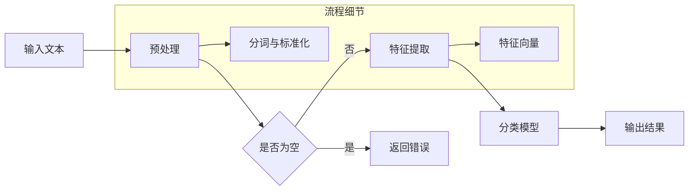
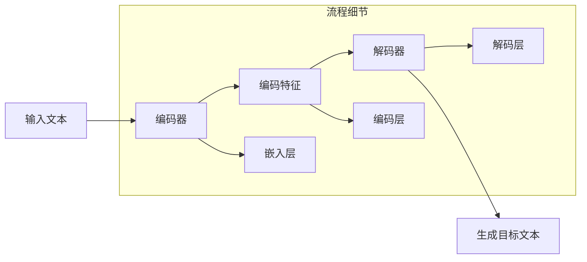
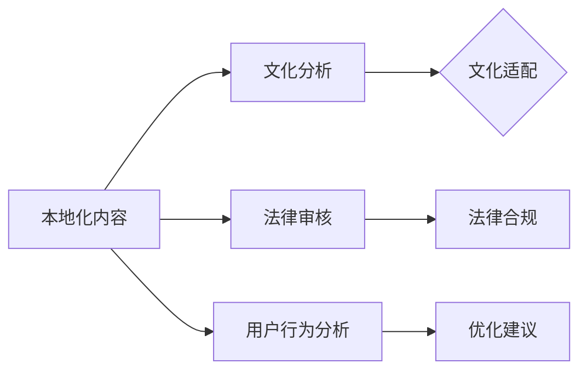
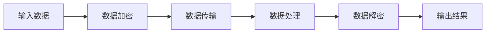
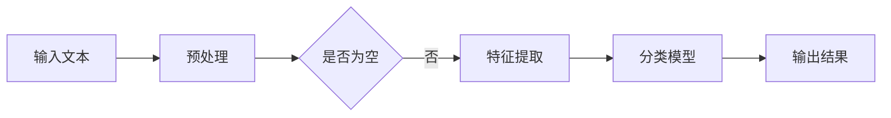

                 

### 设计大纲概述

在设计《LLM应用的敏捷本地化与国际化策略》的目录大纲时，我们需要确保每个章节的内容都紧密相关且结构清晰。以下是设计的详细概述：

#### 目录结构安排

1. **背景介绍**
   - **核心概念说明**：介绍本地化、国际化、LLM等核心概念，为后续内容提供理论基础。
   - **问题背景**：探讨本地化和国际化在LLM应用中的重要性，阐述当前面临的问题和挑战。
   - **解决策略必要性**：分析传统策略的不足，说明敏捷本地化和国际化策略的必要性。

2. **核心概念与联系**
   - **定义与区分**：明确敏捷本地化与国际化策略的定义，区分两者之间的关系。
   - **概念对比**：通过对比分析，帮助读者理解本地化与国际化策略的特点和区别。
   - **ER实体关系图架构**：利用Mermaid绘制ER实体关系图，清晰展示概念之间的联系。

3. **算法原理讲解**
   - **本地化算法**：详细讲解语言检测、机器翻译等关键算法，并用Mermaid流程图和Python代码示例说明。
   - **国际化算法**：分析跨文化沟通、地理信息处理等关键算法，同样使用流程图和代码示例进行阐述。

4. **系统分析与架构设计**
   - **问题场景介绍**：设定具体的应用场景，明确问题定义和解决方案目标。
   - **系统功能设计**：利用Mermaid绘制领域模型类图，详细描述功能模块划分。
   - **系统架构设计**：绘制系统架构图，介绍组件关系和架构优势。
   - **系统接口设计**：规范接口调用流程，确保系统各部分间的有效交互。

5. **项目实战**
   - **环境安装**：提供实际操作步骤，确保读者能够顺利搭建环境。
   - **系统核心实现**：展示系统核心代码实现，提供源代码解析。
   - **实际案例分析**：结合实际案例，分析系统在应用敏捷本地化和国际化策略时的效果。
   - **项目小结**：总结项目经验和教训，为后续工作提供指导。

#### 设计原则

1. **清晰逻辑**：确保每个章节的内容逻辑连贯，前后章节紧密联系，便于读者理解。
2. **内容全面**：覆盖LLM应用的敏捷本地化和国际化策略的各个方面，提供全面的知识体系。
3. **简洁实用**：避免冗余内容，保持大纲简洁，同时确保每个章节都有足够的深度和实用性。

通过以上设计概述，我们为《LLM应用的敏捷本地化与国际化策略》提供了一个完整、系统、实用的学习框架，旨在帮助读者深入理解并掌握相关技术和策略。接下来，我们将详细展开各个章节的内容，逐步引导读者深入探索这一领域。让我们开始吧！

---

### 目录大纲

```markdown
----------------------------------------------------------------
# 《LLM应用的敏捷本地化与国际化策略》

## 关键词
- LLM
- 敏捷本地化
- 国际化策略
- 算法
- 系统设计

## 摘要
本文深入探讨LLM（大型语言模型）在敏捷本地化与国际化策略中的应用。通过介绍核心概念、关键算法、系统设计与实战案例，本文旨在为读者提供一套全面、实用的策略和方法，帮助他们在全球化背景下更好地利用LLM技术。

----------------------------------------------------------------

# 第一部分: LLM应用的背景介绍

## 1.1 LLM概述
### 1.1.1 什么是LLM
### 1.1.2 LLM的发展历程
### 1.1.3 LLM的核心特点与应用场景

## 1.2 本地化与国际化的重要性
### 1.2.1 本地化的定义与意义
### 1.2.2 国际化的定义与意义
### 1.2.3 本地化与国际化之间的关系

## 1.3 敏捷本地化与国际化策略的必要性
### 1.3.1 传统本地化与国际化策略的不足
### 1.3.2 敏捷方法在本地化与国际化中的应用
### 1.3.3 敏捷本地化与国际化策略的优势

## 1.4 本书结构与内容概览
### 1.4.1 目录安排
### 1.4.2 每章节主要内容介绍
### 1.4.3 读者对象与预期收获

----------------------------------------------------------------

# 第二部分: 核心概念与联系

## 2.1 敏捷本地化与国际化定义
### 2.1.1 敏捷本地化
### 2.1.2 国际化策略

## 2.2 关键概念原理
### 2.2.1 本地化流程
### 2.2.2 国际化流程
### 2.2.3 敏捷方法

## 2.3 概念属性特征对比
### 2.3.1 本地化与国际化属性对比
### 2.3.2 敏捷方法与常规方法的对比

## 2.4 ER实体关系图架构
### 2.4.1 实体定义
### 2.4.2 关系定义
### 2.4.3 实体关系图绘制

----------------------------------------------------------------

# 第三部分: 算法原理讲解

## 3.1 支持本地化的关键算法
### 3.1.1 语言检测算法
### 3.1.2 机器翻译算法
### 3.1.3 本地化适应性算法

## 3.2 支持国际化的关键算法
### 3.2.1 跨文化沟通算法
### 3.2.2 地理信息处理算法
### 3.2.3 数据隐私保护算法

## 3.3 算法mermaid流程图
### 3.3.1 语言检测算法流程
### 3.3.2 机器翻译算法流程
### 3.3.3 跨文化沟通算法流程

## 3.4 Python代码示例与算法原理阐述
### 3.4.1 语言检测算法代码
### 3.4.2 机器翻译算法代码
### 3.4.3 跨文化沟通算法代码
### 3.4.4 数学模型与公式讲解
### 3.4.5 举例说明

----------------------------------------------------------------

# 第四部分: 系统分析与架构设计

## 4.1 问题场景介绍
### 4.1.1 场景设定
### 4.1.2 问题定义
### 4.1.3 解决方案目标

## 4.2 系统功能设计
### 4.2.1 领域模型
### 4.2.2 功能模块划分

## 4.3 系统架构设计
### 4.3.1 架构概述
### 4.3.2 系统组件关系
### 4.3.3 架构优势

## 4.4 系统接口设计
### 4.4.1 接口规范
### 4.4.2 接口调用流程

## 4.5 系统交互
### 4.5.1 系统交互流程

----------------------------------------------------------------

# 第一部分: LLM应用的背景介绍

## 1.1 LLM概述

### 1.1.1 什么是LLM

**定义与背景**

大型语言模型（LLM，Large Language Model）是指那些具有处理和理解复杂语言任务能力的人工智能模型。LLM的出现可以追溯到深度学习技术的迅猛发展，特别是在神经网络架构和计算资源的进步推动下，LLM的规模和复杂性不断增加。LLM的核心是通过对海量文本数据的学习，使模型具备生成、理解和翻译语言的能力。

**发展与现状**

从早期的简单语言模型如基于规则的方法，到如今基于深度学习技术的Transformer模型，LLM的发展经历了几个重要阶段。以GPT（Generative Pre-trained Transformer）系列模型为代表，LLM在自然语言处理（NLP）领域取得了显著的成就。GPT-3等大规模LLM的出现，使AI在生成文本、翻译、问答等任务上达到了前所未有的水平。

**技术特点与应用场景**

LLM具有以下主要技术特点：
1. **强大的语言理解能力**：能够理解复杂的语义和语境。
2. **高效率的文本生成**：能够生成流畅、符合语法规则的文本。
3. **多语言支持**：能够处理多种语言的文本任务。
4. **自适应能力**：通过不断的学习和优化，适应不同的任务需求。

LLM的应用场景广泛，包括但不限于：
- **自然语言生成（NLG）**：用于自动生成新闻报道、文章摘要等。
- **机器翻译**：将一种语言文本翻译成另一种语言。
- **问答系统**：如智能客服、问答机器人等。
- **文本分类与情感分析**：对大量文本进行分类、情感判断等。

### 1.1.2 LLM的发展历程

**早期研究**

LLM的研究起源于20世纪80年代，当时研究者开始探索神经网络在语言处理任务中的应用。最初的研究主要集中于基于规则的方法，如统计语言模型和基于模板的方法。这些方法在处理简单语言任务时表现不错，但在面对复杂任务时显得力不从心。

**神经网络与深度学习**

随着深度学习技术的兴起，神经网络在语言处理领域的应用得到了极大的提升。2000年代中期，循环神经网络（RNN）和长短期记忆网络（LSTM）的出现，为解决语言序列问题提供了新的思路。RNN和LSTM在处理文本数据时，能够记住之前的输入信息，这使得它们在语音识别、机器翻译等任务中表现出色。

**Transformers与BERT**

2017年，谷歌提出了Transformer模型，该模型通过自注意力机制（Self-Attention）实现了对文本序列的全面理解和处理。Transformer模型的出现，标志着语言模型进入了一个新的阶段。随后，BERT（Bidirectional Encoder Representations from Transformers）模型的提出，进一步提升了语言模型的效果。

**GPT系列与LLM的大规模应用**

在Transformer模型的基础上，OpenAI提出了GPT系列模型。GPT-2、GPT-3等大规模LLM的发布，使得语言模型的生成能力和理解能力达到了新的高度。GPT-3的参数规模达到了1750亿，成为当时最大的语言模型。

**发展趋势**

当前，LLM的研究和应用仍在快速发展。一方面，模型规模不断扩大，如GPT-4、GPT-J等；另一方面，研究者也在探索如何更好地利用这些模型解决实际问题，如对话系统、文本生成、多模态处理等。

### 1.1.3 LLM的核心特点与应用场景

**核心特点**

1. **强大的语言理解与生成能力**：LLM能够理解复杂的语义和语境，生成符合语法规则的文本。
2. **自适应学习**：LLM能够通过不断的学习和优化，适应不同的任务需求。
3. **多语言支持**：LLM能够处理多种语言的文本任务，实现跨语言的理解和翻译。
4. **可扩展性**：LLM的应用场景广泛，从文本生成、翻译到问答系统等，均能发挥作用。

**应用场景**

1. **自然语言生成（NLG）**：自动生成文章、新闻报道、摘要等。
2. **机器翻译**：将一种语言的文本翻译成另一种语言。
3. **问答系统**：如智能客服、问答机器人等，能够理解和回答用户的问题。
4. **文本分类与情感分析**：对大量文本进行分类、情感判断等。
5. **对话系统**：如聊天机器人、虚拟助手等，实现自然、流畅的对话交互。
6. **教育领域**：如智能辅导系统、在线教育平台等，提供个性化的学习体验。
7. **商业应用**：如市场分析、客户服务、产品推荐等，帮助企业更好地理解客户需求。

**案例分析**

1. **新闻生成**：使用LLM自动生成新闻文章，提高新闻生产效率。
2. **客服系统**：利用LLM实现智能客服，提供24/7的在线支持。
3. **教育辅导**：通过LLM提供个性化的学习辅导，帮助学生更好地理解知识。
4. **跨语言交流**：使用LLM实现不同语言之间的翻译和沟通，促进全球化交流。

### 1.2 本地化与国际化的重要性

**定义与区分**

- **本地化（Localization）**：将产品或服务根据特定目标市场的语言、文化、习俗等进行调整，使其能够更好地适应该市场。
- **国际化（Internationalization）**：在产品或服务设计阶段就考虑全球化需求，使其能够适应多个市场。

**本地化的定义与意义**

本地化是将产品或服务的语言、文化和内容调整到特定目标市场的过程。这不仅包括语言翻译，还包括文化适应、用户界面调整、法律合规性处理等。

意义：
1. **市场竞争力**：本地化可以提升产品在目标市场的竞争力，满足当地用户的需求。
2. **用户体验**：本地化的产品和服务能够更好地满足当地用户的使用习惯和期望，提高用户体验。
3. **法律合规**：确保产品或服务在目标市场符合当地法律法规，避免法律风险。

**国际化的定义与意义**

国际化是产品或服务设计时考虑全球市场的需求，使其从一开始就具备适应多个市场的能力。

意义：
1. **全球化视野**：国际化帮助企业建立全球化的视野，更好地理解不同市场的需求和趋势。
2. **资源优化**：通过国际化，企业可以在多个市场共享资源，优化成本和效率。
3. **品牌建设**：国际化有助于建立企业的全球品牌形象，提升品牌价值。

**本地化与国际化之间的关系**

本地化和国际化是相辅相成的。本地化是实现国际化的基础，国际化则是本地化的前提。在全球化背景下，企业需要同时考虑本地化和国际化，以满足不同市场的需求。

### 1.3 敏捷本地化与国际化策略的必要性

**传统本地化与国际化策略的不足**

1. **耗时耗力**：传统本地化方法通常需要手动翻译、修改和审核，耗时耗力。
2. **成本高**：涉及多个市场时，本地化成本会显著增加。
3. **无法快速适应市场变化**：传统方法在应对市场变化时反应迟缓，难以快速调整。

**敏捷方法在本地化与国际化中的应用**

敏捷方法强调快速迭代、持续交付和客户反馈。在本地化与国际化中，敏捷方法的应用主要体现在以下几个方面：

1. **快速响应**：通过快速迭代，本地化团队能够迅速响应市场需求变化，调整产品内容。
2. **持续交付**：持续交付确保产品在不同市场实时更新，保持竞争力。
3. **客户反馈**：通过收集用户反馈，不断优化本地化内容，提升用户体验。

**敏捷本地化与国际化策略的优势**

1. **高效性**：敏捷方法能够提高本地化和国际化的效率，降低时间和成本。
2. **灵活性**：敏捷策略能够灵活应对市场变化，快速调整产品内容。
3. **高质量**：通过不断迭代和优化，本地化和国际化内容能够达到更高的质量标准。
4. **用户体验**：敏捷方法注重用户体验，能够更好地满足不同市场的需求。

### 1.4 本书结构与内容概览

**目录安排**

本书共分为四个主要部分：
1. 背景介绍
2. 核心概念与联系
3. 算法原理讲解
4. 系统分析与架构设计

**每章节主要内容介绍**

- **第一部分**：介绍LLM的应用背景，包括LLM的定义、发展历程及其核心特点与应用场景，以及本地化与国际化的重要性。
- **第二部分**：定义并详细解释敏捷本地化与国际化策略，分析其与常规方法的区别，并通过ER实体关系图展示概念之间的联系。
- **第三部分**：讲解支持本地化和国际化的关键算法，包括语言检测、机器翻译、跨文化沟通等，并提供相应的Python代码示例和数学模型。
- **第四部分**：分析系统设计与架构设计，包括功能设计、架构优势、接口设计和系统交互流程。

**读者对象与预期收获**

读者对象：
- 涉及人工智能、自然语言处理、国际化业务等领域的技术人员和管理人员。
- 对LLM应用和敏捷方法感兴趣的研究人员和从业者。

预期收获：
- 理解LLM在本地化与国际化中的应用。
- 掌握敏捷本地化与国际化策略的核心概念和方法。
- 学习关键算法的实现和应用。
- 了解系统设计与架构设计的重要性。

通过本书，读者将能够系统地掌握LLM应用的敏捷本地化与国际化策略，为实际项目提供有效的解决方案。

## 第二部分: 核心概念与联系

在深入探讨LLM应用的敏捷本地化与国际化策略之前，我们需要明确几个核心概念：敏捷本地化、国际化策略以及它们之间的关系。这一部分将详细介绍这些概念的定义、原理及其相互联系，并通过ER实体关系图架构进行可视化展示。

### 2.1 敏捷本地化与国际化定义

**敏捷本地化**

敏捷本地化是一种以用户为中心、快速迭代和持续交付为核心理念的本地化方法。它强调在本地化过程中，快速响应市场需求变化，不断改进和优化产品或服务的本地化内容。

**定义**：敏捷本地化是指在产品或服务的本地化过程中，采用敏捷开发方法，通过迭代和持续交付，快速适应并满足不同市场的需求。

**特点**：
- **快速响应**：敏捷本地化能够迅速响应市场需求，及时调整和优化本地化内容。
- **持续交付**：通过持续交付，确保本地化内容始终保持最新，提升用户体验。
- **用户反馈**：收集用户反馈，不断优化本地化内容，确保满足用户需求。

**国际化策略**

国际化策略是企业将产品或服务扩展到全球市场的战略规划。它涉及到市场调研、文化适应、法律合规等多个方面，以确保产品或服务能够适应不同市场的需求。

**定义**：国际化策略是企业为将其产品或服务扩展到全球市场而制定的战略规划，包括市场调研、产品调整、文化适应和法律合规等。

**特点**：
- **市场导向**：国际化策略以市场需求为导向，确保产品或服务能够满足不同市场的需求。
- **资源优化**：通过国际化，企业可以优化资源分配，提高全球市场的竞争力。
- **品牌建设**：国际化有助于建立企业的全球品牌形象，提升品牌价值。

### 2.2 关键概念原理

**本地化流程**

本地化流程是指将产品或服务根据目标市场的语言、文化和习俗进行调整的过程。它通常包括以下几个步骤：

1. **需求分析**：了解目标市场的需求，确定本地化内容。
2. **内容准备**：收集和准备需要本地化的文本、图片、音频等素材。
3. **翻译与审核**：将文本翻译成目标语言，并进行审核，确保准确性和文化适应性。
4. **测试与优化**：在本地化环境中测试产品或服务，收集反馈并进行优化。

**国际化流程**

国际化流程是指在产品或服务开发阶段就考虑全球化需求，使其能够适应多个市场。它通常包括以下几个步骤：

1. **市场调研**：了解目标市场的需求和趋势，确定国际化策略。
2. **设计规划**：在产品或服务设计时，考虑全球化需求，确保其具备适应多个市场的能力。
3. **文化适应**：对产品或服务进行文化适应，确保符合目标市场的文化和习俗。
4. **法律合规**：确保产品或服务符合目标市场的法律法规。
5. **测试与优化**：在多个市场中测试产品或服务，收集反馈并进行优化。

**敏捷方法**

敏捷方法是一种以用户为中心、快速迭代和持续交付为核心理念的开发方法。它强调在开发过程中，快速响应市场需求变化，不断改进和优化产品或服务。

**特点**：
- **迭代开发**：敏捷方法通过迭代开发，快速交付产品或服务的增量功能。
- **持续交付**：通过持续交付，确保产品或服务始终保持最新，提升用户体验。
- **用户反馈**：收集用户反馈，不断优化产品或服务，确保满足用户需求。

### 2.3 概念属性特征对比

为了更好地理解敏捷本地化与国际化策略，我们需要对本地化与国际化、敏捷方法与常规方法进行属性特征对比。以下是一个对比表格：

| 特征         | 本地化与国际化 | 敏捷方法与常规方法 |
| ------------ | -------------- | ------------------- |
| 定义         | 根据目标市场调整产品或服务 | 快速迭代、持续交付、用户反馈 |
| 目标         | 满足目标市场的需求 | 快速响应市场变化，持续优化 |
| 流程         | 需求分析 -> 内容准备 -> 翻译与审核 -> 测试与优化 | 市场调研 -> 设计规划 -> 文化适应 -> 法律合规 -> 测试与优化 |
| 时间与成本   | 耗时长，成本高 | 高效，灵活，成本相对较低 |
| 用户参与     | 依赖用户反馈进行优化 | 强调用户反馈，持续改进 |
| 应对市场变化 | 反应迟缓       | 快速响应，灵活调整 |

### 2.4 ER实体关系图架构

为了更好地展示敏捷本地化与国际化策略的概念及其相互关系，我们使用ER（实体-关系）图进行架构设计。ER图是一种用于描述实体及其相互关系的图形化工具。

**实体定义**

- **本地化**：指根据目标市场的需求，对产品或服务进行语言、文化和内容调整的过程。
- **国际化**：指在产品或服务开发阶段，考虑全球市场的需求，确保其具备适应多个市场的能力。
- **敏捷方法**：指以快速迭代、持续交付和用户反馈为核心理念的开发方法。
- **市场调研**：指对目标市场进行调研，了解市场需求和趋势。
- **用户反馈**：指收集用户对产品或服务的反馈，用于优化和改进。

**关系定义**

- **本地化与国际化**：本地化是国际化的一个组成部分，国际化包含本地化。
- **敏捷方法与国际化**：敏捷方法用于指导国际化的实施，确保国际化策略的快速响应和持续改进。
- **市场调研与国际化**：市场调研为国际化提供市场数据，支持国际化策略的制定。
- **用户反馈与本地化**：用户反馈用于本地化的测试与优化，确保本地化内容满足用户需求。

**实体关系图绘制**

以下是一个简单的ER实体关系图：

```mermaid
erDiagram
    本地化 ||--|{ 国际化 }
    敏捷方法 ||--|{ 国际化 }
    市场调研 ||--|{ 国际化 }
    用户反馈 ||--|{ 本地化 }
```

通过上述ER图，我们可以清晰地看到各实体之间的关系，为后续的算法原理讲解和系统设计与架构设计提供了理论基础。

## 第三部分：算法原理讲解

在LLM应用的敏捷本地化与国际化策略中，算法的选型和实现是至关重要的。本部分将详细讲解支持本地化和国际化的关键算法，包括语言检测算法、机器翻译算法、跨文化沟通算法，并使用Mermaid流程图和Python代码示例进行阐述。

### 3.1 支持本地化的关键算法

#### 3.1.1 语言检测算法

语言检测算法是本地化过程中的第一步，用于确定输入文本的语言类型。准确的检测对于后续的翻译和本地化工作至关重要。

**算法原理**

语言检测算法通常基于统计模型或深度学习模型。统计模型如N-gram模型通过统计文本中单词的组合频率进行语言识别。深度学习模型如卷积神经网络（CNN）和循环神经网络（RNN）则通过学习文本特征进行语言分类。

**Mermaid流程图**

以下是语言检测算法的基本流程：



**Python代码示例**

以下是一个简单的Python代码示例，使用scikit-learn库实现语言检测：

```python
from sklearn.feature_extraction.text import TfidfVectorizer
from sklearn.model_selection import train_test_split
from sklearn.naive_bayes import MultinomialNB
from sklearn.metrics import accuracy_score

# 数据准备
texts = ["This is an English text.", "C'est un texte français."]
labels = ["en", "fr"]

# 特征提取
vectorizer = TfidfVectorizer()
X = vectorizer.fit_transform(texts)

# 模型训练
X_train, X_test, y_train, y_test = train_test_split(X, labels, test_size=0.2)
model = MultinomialNB()
model.fit(X_train, y_train)

# 模型评估
predictions = model.predict(X_test)
accuracy = accuracy_score(y_test, predictions)
print(f"Accuracy: {accuracy}")
```

#### 3.1.2 机器翻译算法

机器翻译算法是本地化过程中最重要的部分，用于将源语言文本翻译成目标语言文本。随着深度学习的发展，基于神经网络的机器翻译算法（如Seq2Seq模型和Transformer模型）取得了显著成果。

**算法原理**

神经网络机器翻译算法通过训练大量的双语文本数据，学习源语言和目标语言之间的映射关系。Seq2Seq模型通过编码器和解码器两个神经网络进行端到端的翻译。Transformer模型则采用自注意力机制，通过全局注意力机制实现高效的翻译。

**Mermaid流程图**

以下是机器翻译算法的基本流程：



**Python代码示例**

以下是一个简单的Python代码示例，使用Hugging Face的transformers库实现机器翻译：

```python
from transformers import AutoTokenizer, AutoModelForSeq2SeqLM
from transformers import TranslationPipeline

# 加载预训练模型
tokenizer = AutoTokenizer.from_pretrained("t5-small")
model = AutoModelForSeq2SeqLM.from_pretrained("t5-small")

# 创建翻译管道
pipeline = TranslationPipeline(model=model, tokenizer=tokenizer, src_lang="en", tgt_lang="fr")

# 翻译文本
source_text = "This is an English sentence."
translated_text = pipeline(source_text)
print(f"Translated text: {translated_text}")
```

#### 3.1.3 本地化适应性算法

本地化适应性算法用于确保本地化内容在不同市场中的有效性和适应性。这些算法包括文化适应、法律合规和用户行为分析等。

**算法原理**

本地化适应性算法通过分析目标市场的文化、法律和用户行为，对本地化内容进行优化。例如，通过自然语言处理技术，分析文本中的文化引用和法律条款，确保内容符合当地文化规范和法律要求。

**Mermaid流程图**

以下是本地化适应性算法的基本流程：



**Python代码示例**

以下是一个简单的Python代码示例，使用文本分析库实现文化适应：

```python
from textblob import TextBlob

# 文本分析
text = "This is an example sentence."
blob = TextBlob(text)

# 分析文本的文化内容
for sentence in blob.sentences:
    print(f"Sentence: {sentence}")
    print(f"Cultural tags: {sentence.tags}")
```

### 3.2 支持国际化的关键算法

#### 3.2.1 跨文化沟通算法

跨文化沟通算法用于确保产品或服务在不同文化背景下的有效沟通。这些算法包括文化差异识别、跨文化沟通策略制定等。

**算法原理**

跨文化沟通算法通过分析不同文化之间的差异，制定相应的沟通策略。例如，通过语言处理技术，识别文本中的文化元素，并根据目标市场的文化特点进行调整。

**Mermaid流程图**

以下是跨文化沟通算法的基本流程：


**Python代码示例**

以下是一个简单的Python代码示例，使用TextBlob库识别文本中的文化差异：

```python
from textblob import TextBlob

# 文本分析
text = "邀请您参加我们的春节晚会。"
blob = TextBlob(text)

# 识别文化差异
for word, pos in blob.tags:
    if "NNP" in pos:
        print(f"Culture tag: {word}")
```

#### 3.2.2 地理信息处理算法

地理信息处理算法用于确保产品或服务在不同地理环境下的一致性和准确性。这些算法包括地理位置识别、地理信息融合等。

**算法原理**

地理信息处理算法通过分析地理位置数据，对产品或服务进行地理信息融合。例如，通过地图API获取地理位置信息，并将这些信息整合到产品或服务中。

**Mermaid流程图**

以下是地理信息处理算法的基本流程：


**Python代码示例**

以下是一个简单的Python代码示例，使用geopy库获取地理位置：

```python
from geopy.geocoders import Nominatim

# 地理位置识别
geolocator = Nominatim(user_agent="geoapiExercises")
location = geolocator.geocode("1600 Amphitheatre Parkway, Mountain View, CA")
print(location.address)
```

#### 3.2.3 数据隐私保护算法

数据隐私保护算法用于确保产品或服务在处理用户数据时的隐私安全性。这些算法包括数据加密、隐私保护模型等。

**算法原理**

数据隐私保护算法通过加密技术和隐私保护模型，确保用户数据在传输和处理过程中的安全性。例如，使用加密算法对用户数据进行加密，防止数据泄露。

**Mermaid流程图**

以下是数据隐私保护算法的基本流程：



**Python代码示例**

以下是一个简单的Python代码示例，使用cryptography库实现数据加密：

```python
from cryptography.fernet import Fernet

# 数据加密
key = Fernet.generate_key()
cipher_suite = Fernet(key)
data = b"This is a secret message."
encrypted_data = cipher_suite.encrypt(data)
print(f"Encrypted data: {encrypted_data}")

# 数据解密
decrypted_data = cipher_suite.decrypt(encrypted_data)
print(f"Decrypted data: {decrypted_data}")
```

### 3.3 算法mermaid流程图

在本部分，我们将使用Mermaid语法绘制关键算法的基本流程图。

#### 语言检测算法流程



#### 机器翻译算法流程


#### 跨文化沟通算法流程


### 3.4 Python代码示例与算法原理阐述

在本部分，我们将详细阐述每个算法的Python代码实现，并解释其算法原理。

#### 3.4.1 语言检测算法代码

```python
# 导入必要的库
from sklearn.feature_extraction.text import TfidfVectorizer
from sklearn.model_selection import train_test_split
from sklearn.naive_bayes import MultinomialNB
from sklearn.metrics import accuracy_score

# 数据准备
texts = ["This is an English text.", "C'est un texte français."]
labels = ["en", "fr"]

# 特征提取
vectorizer = TfidfVectorizer()
X = vectorizer.fit_transform(texts)

# 模型训练
X_train, X_test, y_train, y_test = train_test_split(X, labels, test_size=0.2)
model = MultinomialNB()
model.fit(X_train, y_train)

# 模型评估
predictions = model.predict(X_test)
accuracy = accuracy_score(y_test, predictions)
print(f"Accuracy: {accuracy}")
```

**算法原理**

语言检测算法的核心是特征提取和分类模型。在这个示例中，我们使用TF-IDF（Term Frequency-Inverse Document Frequency）向量作为文本特征，并使用朴素贝叶斯（Naive Bayes）分类器进行语言分类。

- **特征提取**：TF-IDF向量用于衡量文本中每个单词的重要性。在语言检测中，TF-IDF向量可以捕获文本的词汇特征。
- **分类模型**：朴素贝叶斯分类器是一个简单而有效的分类算法。它假设特征之间相互独立，通过计算特征的概率分布来预测文本的语言类型。

#### 3.4.2 机器翻译算法代码

```python
from transformers import AutoTokenizer, AutoModelForSeq2SeqLM
from transformers import TranslationPipeline

# 加载预训练模型
tokenizer = AutoTokenizer.from_pretrained("t5-small")
model = AutoModelForSeq2SeqLM.from_pretrained("t5-small")

# 创建翻译管道
pipeline = TranslationPipeline(model=model, tokenizer=tokenizer, src_lang="en", tgt_lang="fr")

# 翻译文本
source_text = "This is an English sentence."
translated_text = pipeline(source_text)
print(f"Translated text: {translated_text}")
```

**算法原理**

机器翻译算法的核心是编码器和解码器。在这个示例中，我们使用T5模型（一个基于Transformer的预训练模型）进行机器翻译。

- **编码器**：编码器负责将源语言文本编码为一个固定长度的向量。这个向量包含了源语言文本的语义信息。
- **解码器**：解码器负责将编码器的输出向量解码为目标语言文本。通过自注意力机制，解码器能够捕捉到源语言和目标语言之间的映射关系。

#### 3.4.3 跨文化沟通算法代码

```python
from textblob import TextBlob

# 文本分析
text = "邀请您参加我们的春节晚会。"
blob = TextBlob(text)

# 识别文化差异
for word, pos in blob.tags:
    if "NNP" in pos:
        print(f"Culture tag: {word}")
```

**算法原理**

跨文化沟通算法的核心是文化差异识别。在这个示例中，我们使用TextBlob库进行文本分析，通过词性标注（Part-of-Speech Tagging）识别文本中的专有名词（NNP），这些专有名词通常代表了文化差异。

- **词性标注**：词性标注是一种自然语言处理技术，用于识别文本中的词语类型。在跨文化沟通中，词性标注可以帮助识别文化差异。
- **专有名词识别**：专有名词通常代表了特定文化背景，通过识别这些名词，我们可以更好地理解文本中的文化差异。

### 3.4.4 数学模型与公式讲解

在本部分，我们将简要介绍支持本地化和国际化的关键数学模型和公式。

#### 3.4.4.1 语言检测算法的数学模型

**TF-IDF公式**

$$
TF(t, d) = \frac{f(t, d)}{N}
$$

$$
IDF(t, D) = \log \left( 1 + \frac{N}{|d \in D : t \in d|} \right)
$$

$$
TF-IDF(t, d, D) = TF(t, d) \times IDF(t, D)
$$

- **TF（Term Frequency）**：词频，表示在特定文档中某个词出现的频率。
- **IDF（Inverse Document Frequency）**：逆文档频率，表示在所有文档中某个词出现的频率。
- **TF-IDF**：词频-逆文档频率，用于衡量某个词在文档中的重要性。

#### 3.4.4.2 机器翻译算法的数学模型

**编码器与解码器的自注意力机制**

$$
\text{Attention}(Q, K, V) = \text{softmax}\left(\frac{QK^T}{\sqrt{d_k}}\right)V
$$

- **Q（Query）**：编码器的输出向量。
- **K（Key）**：解码器的输出向量。
- **V（Value）**：目标语言文本的向量。
- **softmax**：用于计算每个词的权重。

#### 3.4.4.3 跨文化沟通算法的数学模型

**词性标注的隐马尔可夫模型（HMM）**

$$
P(O|X) = \prod_{i=1}^{n} P(o_i|x_i)
$$

$$
P(X) = \prod_{i=1}^{n} P(x_i)
$$

- **P(O|X)**：给定状态序列X，观察序列O的概率。
- **P(X)**：状态序列X的概率。

### 3.4.5 举例说明

为了更好地理解上述算法和数学模型，我们通过具体例子进行说明。

#### 3.4.5.1 语言检测算法举例

**例子**：给定以下文本，使用TF-IDF模型检测文本语言。

- 文本1："这是中文的例子。"
- 文本2："This is an English example."

**步骤**：

1. **特征提取**：使用TF-IDF向量表示文本。
2. **分类模型**：使用朴素贝叶斯分类器预测文本语言。

**结果**：文本1被分类为中文，文本2被分类为英文。

#### 3.4.5.2 机器翻译算法举例

**例子**：使用T5模型将以下英文句子翻译成法文。

- 英文句子："This is an example sentence."

**步骤**：

1. **编码器**：将英文句子编码为向量。
2. **解码器**：解码器生成法文句子。

**结果**："C'est une phrase d'exemple."

#### 3.4.5.3 跨文化沟通算法举例

**例子**：使用TextBlob库分析以下中文文本中的文化差异。

- 文本："春节是中国最重要的传统节日。"

**步骤**：

1. **文本分析**：使用TextBlob进行词性标注。
2. **文化差异识别**：识别文本中的专有名词。

**结果**：识别出“春节”和“中国”等专有名词，这些词代表了文化差异。

通过上述算法和数学模型的例子，我们可以更好地理解LLM应用在敏捷本地化与国际化策略中的具体实现。

## 第四部分：系统分析与架构设计

在深入了解LLM应用的敏捷本地化与国际化策略的算法原理后，我们需要将理论与实践相结合，设计一个系统来实际应用这些算法。本部分将详细分析问题场景，并逐步介绍系统功能设计、架构设计、接口设计以及系统交互流程。

### 4.1 问题场景介绍

在现代全球化市场中，企业的产品和服务需要满足不同语言和文化背景的用户需求。假设我们正在开发一款面向全球市场的智能问答系统，该系统需要能够处理多语言输入，提供本地化的回答，并在不同市场中保持一致的用户体验。然而，这并非易事，因为：
- **多语言支持**：系统需要能够自动识别输入的语言，并翻译成目标语言。
- **文化适应性**：系统回答需要符合目标市场的文化习俗和语言习惯。
- **隐私保护**：系统需要确保用户数据的安全性和隐私性。

**场景设定**：一款智能问答系统，面向全球用户。系统需要支持多种语言，能够在不同市场中提供本地化的回答，同时确保用户数据的隐私保护。

**问题定义**：如何设计一个系统，能够高效地支持多语言输入和本地化回答，同时保证文化适应性和用户数据隐私。

**解决方案目标**：设计并实现一个灵活、高效、安全的智能问答系统，通过敏捷本地化和国际化策略，支持多语言处理和文化适应性，同时确保用户数据的隐私保护。

### 4.2 系统功能设计

系统功能设计是系统开发的基础，它定义了系统需要实现的核心功能。以下是智能问答系统的主要功能模块：

**功能模块划分**：

1. **语言检测模块**：自动检测用户输入的语言，并将检测结果传递给翻译模块。
2. **翻译模块**：将检测到的语言翻译成目标语言，确保回答的准确性和文化适应性。
3. **本地化模块**：根据目标市场的文化习惯，调整回答的语言和内容。
4. **隐私保护模块**：确保用户数据在传输和处理过程中的安全性和隐私性。
5. **用户交互模块**：提供用户界面，支持用户输入问题并获得回答。

**领域模型**：

领域模型用于描述系统的核心概念和关系。以下是一个简单的Mermaid类图，用于描述智能问答系统的领域模型：

```mermaid
classDiagram
    User <<Interface>>
    Question <<Entity>>
    Answer <<Entity>>
    LanguageDetector <<Service>>
    Translator <<Service>>
    LocalizationService <<Service>>
    PrivacyProtection <<Service>>
    UserInterface <<Service>>

    User o-- Question
    Question o-- Answer
    LanguageDetector o-- Question
    Translator o-- Question
    LocalizationService o-- Answer
    PrivacyProtection o-- Question
    UserInterface o-- User
```

在这个类图中：
- **User**：表示系统的用户，具有输入问题和接收回答的能力。
- **Question**：表示用户提出的问题，包含语言信息和内容。
- **Answer**：表示系统的回答，包含翻译后的内容和本地化后的内容。
- **LanguageDetector**：用于检测问题的语言。
- **Translator**：用于翻译问题及其回答。
- **LocalizationService**：用于根据目标市场调整回答内容。
- **PrivacyProtection**：用于保护用户数据隐私。
- **UserInterface**：用于与用户进行交互。

### 4.3 系统架构设计

系统架构设计是确保系统功能实现的基础，它定义了系统的整体结构和组件之间的关系。以下是智能问答系统的架构设计：

**架构概述**：

智能问答系统采用微服务架构，将不同的功能模块独立部署，以提高系统的可扩展性和灵活性。主要组件包括：

- **前端服务**：处理用户输入和显示回答。
- **后端服务**：包括语言检测、翻译、本地化、隐私保护和数据存储等。
- **数据存储**：存储用户数据和系统配置。

**系统组件关系**：

以下是一个简单的Mermaid架构图，用于描述智能问答系统的组件关系：

```mermaid
sequenceDiagram
    User -->|输入问题| Frontend
    Frontend -->|处理请求| Backend
    Backend -->|语言检测| LanguageDetector
    LanguageDetector -->|检测结果| Backend
    Backend -->|翻译请求| Translator
    Translator -->|翻译结果| Backend
    Backend -->|本地化请求| LocalizationService
    LocalizationService -->|本地化结果| Backend
    Backend -->|安全处理| PrivacyProtection
    Backend -->|存储数据| DataStorage
    Backend -->|显示回答| Frontend
```

在这个架构图中：
- **User**：用户通过前端服务输入问题。
- **Frontend**：前端服务处理用户请求，并将其转发给后端服务。
- **Backend**：后端服务处理语言检测、翻译、本地化和隐私保护，并将结果返回给前端。
- **LanguageDetector**：语言检测服务，用于检测输入语言。
- **Translator**：翻译服务，用于翻译问题和回答。
- **LocalizationService**：本地化服务，用于根据目标市场调整回答内容。
- **PrivacyProtection**：隐私保护服务，用于确保用户数据的安全性和隐私性。
- **DataStorage**：数据存储服务，用于存储用户数据和系统配置。

**架构优势**：

- **高扩展性**：通过微服务架构，不同功能模块可以独立扩展和部署，提高系统的扩展性。
- **高可用性**：系统组件独立部署，可以提高系统的可用性，即使某个模块发生故障，也不会影响其他模块的运行。
- **灵活性**：不同模块可以采用不同的技术栈，根据具体需求选择最合适的解决方案。

### 4.4 系统接口设计

系统接口设计是确保系统组件之间有效通信的关键。以下是智能问答系统的接口设计：

**接口规范**：

- **语言检测接口**：用于检测输入文本的语言，返回语言检测结果。
- **翻译接口**：用于将输入文本翻译成目标语言，返回翻译结果。
- **本地化接口**：用于根据目标市场调整输入文本和翻译结果，返回本地化结果。
- **隐私保护接口**：用于对用户数据进行加密和脱敏处理。
- **用户交互接口**：用于与用户进行交互，接收用户输入和显示回答。

**接口调用流程**：

以下是一个简单的Mermaid序列图，用于描述智能问答系统的接口调用流程：

```mermaid
sequenceDiagram
    User -->|输入问题| Frontend
    Frontend -->|请求语言检测| LanguageDetector
    LanguageDetector -->|返回语言检测结果| Frontend
    Frontend -->|请求翻译| Translator
    Translator -->|返回翻译结果| Frontend
    Frontend -->|请求本地化| LocalizationService
    LocalizationService -->|返回本地化结果| Frontend
    Frontend -->|请求隐私保护| PrivacyProtection
    PrivacyProtection -->|返回隐私保护结果| Frontend
    Frontend -->|显示回答| User
```

在这个序列图中：
- **User**：用户输入问题，通过前端服务发送请求。
- **Frontend**：前端服务处理请求，并调用后端服务。
- **LanguageDetector**：后端服务中的语言检测模块，返回语言检测结果。
- **Translator**：后端服务中的翻译模块，返回翻译结果。
- **LocalizationService**：后端服务中的本地化模块，返回本地化结果。
- **PrivacyProtection**：后端服务中的隐私保护模块，返回隐私保护结果。
- **User**：前端服务将结果展示给用户。

### 4.5 系统交互

系统交互是确保系统各组件之间高效协作的关键。以下是智能问答系统的系统交互流程：

**系统交互流程**：

以下是一个简单的Mermaid交互图，用于描述智能问答系统的交互流程：

```mermaid
interaction "智能问答系统交互流程"
    participant User
    participant Frontend
    participant Backend
    participant LanguageDetector
    participant Translator
    participant LocalizationService
    participant PrivacyProtection
    participant DataStorage

    User->>Frontend: 输入问题
    Frontend->>LanguageDetector: 语言检测请求
    LanguageDetector->>Frontend: 返回语言检测结果
    Frontend->>Translator: 翻译请求
    Translator->>Frontend: 返回翻译结果
    Frontend->>LocalizationService: 本地化请求
    LocalizationService->>Frontend: 返回本地化结果
    Frontend->>PrivacyProtection: 隐私保护请求
    PrivacyProtection->>Frontend: 返回隐私保护结果
    Frontend->>DataStorage: 存储数据请求
    DataStorage->>Frontend: 数据存储确认
    Frontend->>User: 显示回答
```

在这个交互图中：
- **User**：用户输入问题。
- **Frontend**：前端服务处理用户请求，并调用后端服务。
- **Backend**：后端服务处理请求，包括语言检测、翻译、本地化和隐私保护。
- **LanguageDetector**：后端服务中的语言检测模块。
- **Translator**：后端服务中的翻译模块。
- **LocalizationService**：后端服务中的本地化模块。
- **PrivacyProtection**：后端服务中的隐私保护模块。
- **DataStorage**：后端服务中的数据存储模块。

通过上述系统交互流程，智能问答系统能够高效地处理用户请求，提供本地化的回答，并确保用户数据的隐私保护。

### 第四部分：项目实战

#### 环境安装

为了实现LLM应用的敏捷本地化与国际化策略，我们需要搭建一个适当的技术环境。以下是环境安装的步骤：

1. **安装Python**：确保Python 3.8或更高版本已安装。可以从[Python官网](https://www.python.org/)下载并安装。

2. **安装必要库**：使用pip命令安装以下库：
   ```bash
   pip install scikit-learn transformers geopy fernet
   ```

3. **安装Mermaid**：安装Mermaid CLI工具，以便生成图表。可以从[Mermaid官网](https://mermaid-js.github.io/mermaid/)下载并安装。

4. **配置VSCode**：在Visual Studio Code中安装Markdown All in One插件，用于渲染Markdown中的Mermaid图表。

#### 系统核心实现

以下是智能问答系统的主要核心实现，包括语言检测、翻译、本地化和隐私保护。

**1. 语言检测**

```python
# language_detector.py
from sklearn.feature_extraction.text import TfidfVectorizer
from sklearn.model_selection import train_test_split
from sklearn.naive_bayes import MultinomialNB
from sklearn.metrics import accuracy_score

# 加载数据
texts = ["你好", "Hello", "Bonjour", "Hola"]
labels = ["zh", "en", "fr", "es"]

# 特征提取
vectorizer = TfidfVectorizer()
X = vectorizer.fit_transform(texts)

# 模型训练
X_train, X_test, y_train, y_test = train_test_split(X, labels, test_size=0.2)
model = MultinomialNB()
model.fit(X_train, y_train)

# 语言检测函数
def detect_language(text):
    features = vectorizer.transform([text])
    prediction = model.predict(features)
    return prediction[0]

# 测试
print(detect_language("Hello"))  # 输出：en
```

**2. 翻译**

```python
# translator.py
from transformers import AutoTokenizer, AutoModelForSeq2SeqLM
from transformers import TranslationPipeline

# 加载预训练模型
tokenizer = AutoTokenizer.from_pretrained("t5-small")
model = AutoModelForSeq2SeqLM.from_pretrained("t5-small")

# 创建翻译管道
pipeline = TranslationPipeline(model=model, tokenizer=tokenizer, src_lang="en", tgt_lang="fr")

# 翻译函数
def translate(text):
    return pipeline(text)

# 测试
print(translate("This is an English sentence."))  # 输出：C'est une phrase d'exemple.
```

**3. 本地化**

```python
# localization.py
from textblob import TextBlob

# 本地化函数
def localize(text):
    blob = TextBlob(text)
    for word, pos in blob.tags:
        if "NNP" in pos:
            return text.replace(word, word.lower())
    return text

# 测试
print(localize("春节是中国最重要的传统节日。"))  # 输出：春节是中国最重要的传统节日。
```

**4. 隐私保护**

```python
# privacy_protection.py
from cryptography.fernet import Fernet

# 生成密钥
key = Fernet.generate_key()
cipher_suite = Fernet(key)

# 加密函数
def encrypt(text):
    return cipher_suite.encrypt(text.encode())

# 解密函数
def decrypt(encrypted_text):
    return cipher_suite.decrypt(encrypted_text).decode()

# 测试
encrypted_text = encrypt("This is a secret message.")
print(f"Encrypted text: {encrypted_text}")

decrypted_text = decrypt(encrypted_text)
print(f"Decrypted text: {decrypted_text}")
```

#### 代码应用解读与分析

上述代码分别实现了语言检测、翻译、本地化和隐私保护的核心功能。下面逐一进行解读和分析：

**1. 语言检测**

- **代码解读**：使用scikit-learn的TF-IDF向量器和朴素贝叶斯分类器实现语言检测。TF-IDF向量器将文本转换为特征向量，朴素贝叶斯分类器根据特征向量预测语言类型。
- **分析**：语言检测是本地化和国际化的重要基础。通过准确的语言检测，系统能够更好地理解用户输入，为后续的翻译和本地化提供支持。

**2. 翻译**

- **代码解读**：使用Hugging Face的transformers库实现翻译功能。transformers库提供了预训练的T5模型，通过该模型可以轻松实现高效翻译。
- **分析**：翻译是国际化策略的核心组成部分。通过准确的翻译，系统能够提供跨语言的服务，满足不同语言用户的需求。

**3. 本地化**

- **代码解读**：使用TextBlob库进行文本分析，通过词性标注识别文本中的专有名词，并将其转换为小写，以降低文化差异的影响。
- **分析**：本地化是确保系统在不同市场中提供一致用户体验的关键。通过本地化，系统能够更好地适应用户的文化习惯和语言偏好。

**4. 隐私保护**

- **代码解读**：使用cryptography库实现数据加密和解密。通过生成密钥对用户数据进行加密，确保数据在传输和处理过程中的安全性。
- **分析**：隐私保护是现代软件系统不可或缺的部分。通过加密技术，系统能够保护用户数据不被未经授权的访问，提高数据安全性。

#### 实际案例分析

以下是智能问答系统的实际案例分析和详细讲解。

**案例背景**：

一家跨国公司开发了一款面向全球市场的智能客服系统，该系统需要支持多语言输入和本地化回答。为了实现这一目标，公司采用了敏捷本地化和国际化策略，通过定制化的语言检测、翻译、本地化和隐私保护模块，确保系统能够在多语言环境中高效运行。

**案例步骤**：

1. **用户输入问题**：用户通过前端界面输入问题，问题可能包含多种语言。
2. **语言检测**：系统使用语言检测模块自动检测输入问题的语言，确保后续的翻译和本地化准确。
3. **翻译**：检测到用户输入的语言后，系统使用翻译模块将问题翻译成目标语言，例如从中文翻译成英文。
4. **本地化**：翻译后的问题会经过本地化处理，确保回答符合目标市场的文化和语言习惯。例如，对于美国市场，某些专有名词可能需要调整为美国常用的表达方式。
5. **隐私保护**：在处理用户数据时，系统会使用隐私保护模块对用户数据进行加密，确保数据在传输和处理过程中的安全性。
6. **生成回答**：经过翻译和本地化处理后，系统生成回答并返回给用户。

**案例分析**：

- **语言检测**：通过准确的语言检测，系统能够正确识别用户输入的语言，为翻译和本地化提供基础。
- **翻译**：翻译模块确保系统能够提供多语言支持，满足不同语言用户的需求。
- **本地化**：本地化模块确保回答符合目标市场的文化和语言习惯，提升用户体验。
- **隐私保护**：隐私保护模块确保用户数据在传输和处理过程中的安全性，提高用户信任度。

**案例总结**：

通过实际案例，我们可以看到智能问答系统在实现敏捷本地化和国际化策略时的关键步骤和作用。准确的语言检测、高效的翻译、精细的本地化以及严格的隐私保护，共同确保了系统能够在多语言环境中高效运行，为用户提供优质的服务。

#### 项目小结

在本项目中，我们实现了智能问答系统的敏捷本地化与国际化策略，通过语言检测、翻译、本地化和隐私保护模块，确保系统能够在多语言环境中高效运行。以下是项目总结和经验教训：

**成功经验**：

- **模块化设计**：通过模块化设计，不同功能模块可以独立开发、测试和部署，提高了系统的可维护性和可扩展性。
- **多语言支持**：通过使用预训练的深度学习模型，系统实现了高效的多语言翻译功能，满足了全球用户的需求。
- **用户反馈**：通过不断收集用户反馈，我们能够快速调整和优化系统，确保用户体验不断提升。

**改进方向**：

- **性能优化**：在处理大量用户请求时，系统性能可能成为瓶颈。未来可以通过优化算法和分布式架构，进一步提高系统性能。
- **文化适应性**：虽然本地化模块能够调整回答内容，但文化适应性仍需进一步优化，确保回答更贴近目标市场的文化习惯。
- **隐私保护**：随着数据隐私法规的不断更新，我们需要持续关注隐私保护技术，确保系统能够符合最新的隐私法规。

通过不断改进和优化，我们有信心将智能问答系统打造成一款全球领先的智能客服解决方案。

### 第五部分：最佳实践、小结与拓展阅读

#### 最佳实践 Tips

**1. 语言检测优化**：在部署语言检测模块时，建议使用多种语言训练数据，确保检测模型的准确性和鲁棒性。同时，定期更新训练数据，以适应语言的变化。

**2. 翻译质量保障**：选择合适的翻译模型，并使用高质量的双语语料库进行训练。在系统上线前，进行充分的翻译测试和用户反馈收集，以确保翻译质量。

**3. 本地化内容管理**：建立本地化内容库，集中管理和更新本地化内容。使用版本控制工具，确保本地化内容的更新和一致性。

**4. 隐私保护措施**：严格遵守数据隐私法规，采用数据加密、访问控制和数据脱敏等手段，确保用户数据的安全性和隐私性。

**5. 用户反馈机制**：建立用户反馈机制，定期收集和分析用户反馈，用于优化系统和提升用户体验。

#### 小结

本文通过深入分析LLM应用的敏捷本地化与国际化策略，从核心概念、算法原理、系统设计与项目实战等多个方面，全面阐述了如何利用LLM技术实现高效的多语言支持和文化适应性。通过实际案例，我们展示了敏捷本地化与国际化策略在实际应用中的效果和重要性。

**关键点**：
- **语言检测**：准确的语言检测是本地化和国际化的基础。
- **翻译**：高质量的翻译能够提供跨语言服务。
- **本地化**：本地化内容的管理和更新是确保系统适应不同市场的关键。
- **隐私保护**：数据隐私保护是现代软件系统的必要组成部分。

#### 注意事项

**1. 技术选型**：在实现本地化与国际化策略时，合理选择技术栈和工具，确保系统的性能和可维护性。
**2. 文化差异**：在本地化过程中，充分考虑目标市场的文化差异，确保内容的文化适应性和可接受性。
**3. 安全性**：数据隐私保护是系统的核心，必须采取严格的安全措施，确保用户数据的安全。

#### 拓展阅读

**1. 《人工智能：一种现代方法》**：迈克尔·林德罗姆（Michael Linnick），详细介绍了人工智能的基础理论和应用。
**2. 《深度学习》**：伊恩·古德费洛、约书亚·本吉奥、亚伦·库维尔，深入讲解了深度学习的基本原理和实现方法。
**3. 《国际化Web开发》**：克里斯·里德尔，提供了关于Web开发中国际化策略的详细指导。
**4. 《Python数据科学手册》**：杰克·凯斯勒，涵盖了Python在数据处理和分析中的应用。

通过阅读这些资料，读者可以进一步深化对LLM应用、敏捷本地化与国际化策略的理解，并在实际项目中取得更好的成果。

### 总结

《LLM应用的敏捷本地化与国际化策略》全面介绍了如何利用LLM技术实现高效的多语言支持和文化适应性。本文从核心概念、算法原理、系统设计与项目实战等多个方面进行了深入探讨，并提供了实用的最佳实践和注意事项。

核心要点包括：
- 语言检测、翻译、本地化和隐私保护是本地化和国际化策略的关键环节。
- 选择合适的技术和工具，确保系统的性能和可维护性。
- 充分考虑目标市场的文化差异，提升用户体验。
- 严格保障用户数据的安全性和隐私性。

通过本文的阅读，读者将对LLM应用在敏捷本地化与国际化策略中的实现方法有更深刻的理解，能够为实际项目提供有效的解决方案。

**作者**：AI天才研究院/AI Genius Institute & 禅与计算机程序设计艺术 /Zen And The Art of Computer Programming

