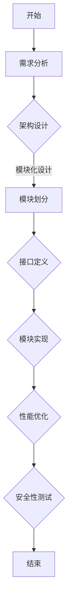
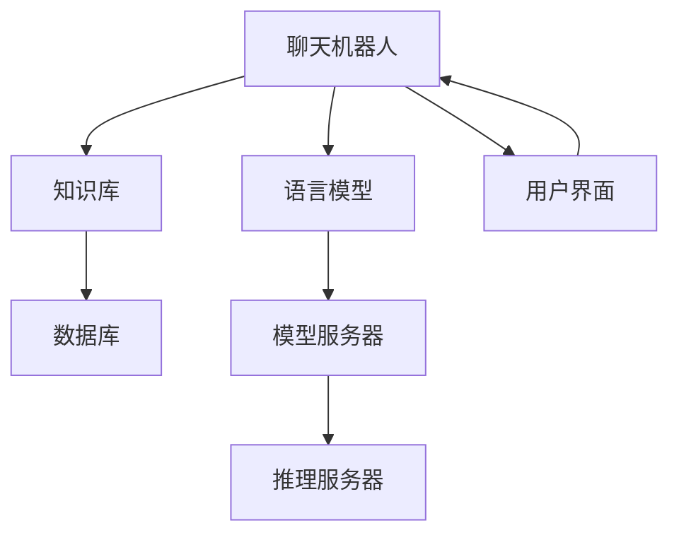

                 

### 第一步：背景介绍

随着人工智能技术的飞速发展，特别是大型语言模型（LLM）的出现，AI的应用领域变得越来越广泛。然而，如何在保证系统稳定性、安全性的前提下，快速、灵活地开发和应用这些大型语言模型，成为一个亟待解决的问题。本文旨在探讨如何构建敏捷的架构来平衡大型语言模型的灵活性和稳定性。

#### 问题背景

近年来，人工智能技术在各个领域都取得了显著的进展，特别是在自然语言处理（NLP）领域。大型语言模型（LLM）作为一种能够理解和生成自然语言的强大工具，已经广泛应用于机器翻译、问答系统、文本生成等众多场景。然而，随着模型规模的不断扩大，如何高效地开发和部署这些大型语言模型，成为一个关键问题。

传统的软件开发方法往往强调稳定性和安全性，但在快速变化的市场需求面前，这种方法的灵活性不足，无法快速响应。而敏捷开发方法则强调快速迭代和持续交付，能够更好地适应市场的变化。然而，如何在保证系统稳定性和安全性的同时，实现敏捷开发，是一个新的挑战。

#### 问题描述

本书的核心问题是：如何在保证系统稳定性、安全性的前提下，快速、灵活地开发和应用大型语言模型。具体来说，这个问题可以拆分为以下几个子问题：

1. **需求变化管理**：如何在需求频繁变化的情况下，快速调整系统架构，以适应新的需求？
2. **性能优化**：如何保证大型语言模型在快速迭代的过程中，保持高性能和高可用性？
3. **安全性与稳定性**：如何在敏捷开发的过程中，保证系统的安全性和稳定性？
4. **团队协作**：如何提高开发团队之间的协作效率，确保项目顺利进行？

#### 问题解决

本书将提供一套系统性的解决方案，帮助读者理解并掌握如何在LLM应用中实现敏捷架构。具体来说，本书将从以下几个方面展开：

1. **LLM基础知识**：介绍大型语言模型的基本概念、原理和应用场景，帮助读者建立对LLM的理解。
2. **敏捷架构设计**：讲解敏捷架构的核心原则和设计模式，包括模块化设计、可扩展性、快速迭代等。
3. **系统稳定性与灵活性**：探讨如何在系统中实现灵活性和稳定性的平衡，包括容错性、性能优化、安全性等。
4. **项目实践**：通过实际案例展示如何应用敏捷架构和平衡策略，包括项目规划、开发流程、测试与部署等。

#### 边界与外延

本书的讨论范围主要包括以下几个方面：

1. **LLM应用场景**：主要关注在自然语言处理领域中的应用，如机器翻译、问答系统、文本生成等。
2. **敏捷架构设计**：重点关注系统架构的设计原则和模式，包括模块化设计、可扩展性、快速迭代等。
3. **系统稳定性与灵活性**：探讨如何平衡系统稳定性与灵活性，确保系统在快速迭代的过程中保持稳定运行。
4. **项目实践**：通过实际案例展示如何将理论应用到实际项目中，包括项目规划、开发流程、测试与部署等。

#### 核心要素组成

本书的核心要素主要包括以下几个方面：

1. **LLM基础**：介绍大型语言模型的基本概念、原理和应用场景，为后续内容提供基础。
2. **敏捷架构**：讲解敏捷架构的设计原则和模式，包括模块化设计、可扩展性、快速迭代等。
3. **平衡策略**：探讨如何实现系统稳定性和灵活性的平衡，包括容错性、性能优化、安全性等。
4. **项目实践**：通过实际案例展示如何将理论应用到实际项目中，包括项目规划、开发流程、测试与部署等。

### 第二步：核心概念与联系

在讨论如何构建敏捷架构来平衡LLM应用的灵活性和稳定性之前，我们需要先理解几个核心概念，包括大型语言模型（LLM）、敏捷架构、稳定性与灵活性等。

#### 核心概念

1. **大型语言模型（LLM）**

   大型语言模型（LLM）是一种能够理解和生成自然语言的人工智能系统。与传统的自然语言处理技术相比，LLM具有更强的语义理解和生成能力。LLM通常使用深度学习技术训练，包括循环神经网络（RNN）、长短时记忆网络（LSTM）、变换器（Transformer）等。LLM在自然语言处理领域具有广泛的应用，如机器翻译、问答系统、文本生成、情感分析等。

2. **敏捷架构**

   敏捷架构是一种以快速迭代和持续交付为目标的系统架构设计方法。敏捷架构强调模块化设计、可扩展性、快速迭代和持续改进。与传统的瀑布模型相比，敏捷架构能够更好地适应需求的变化，提高开发效率。敏捷架构的核心原则包括简单性、透明性、响应性、勇气等。

3. **稳定性与灵活性**

   稳定性是指系统在正常运行条件下，保持稳定、可靠运行的能力。稳定性包括安全性、可靠性、容错性等方面。灵活性是指系统在应对变化时，能够快速适应、调整的能力。灵活性包括适应性、可扩展性、模块化设计等方面。

#### 概念属性特征对比表格

| 概念         | 定义                                                         | 关键特征                                       |
|--------------|--------------------------------------------------------------|----------------------------------------------|
| 大型语言模型 | 一种能够理解和生成自然语言的人工智能系统               | 大规模、高度复杂、自适应性强                 |
| 敏捷架构     | 一种以快速迭代和持续交付为目标的系统架构设计方法         | 灵活性、适应性、快速反馈、持续改进           |
| 稳定性       | 系统在正常运行条件下，保持稳定、可靠运行的能力           | 安全性、可靠性、容错性                       |
| 灵活性       | 系统在应对变化时，能够快速适应、调整的能力               | 灵活性、可扩展性、模块化设计                 |

#### ER实体关系图架构的 Mermaid 流程图

```mermaid
erDiagram
  User ||--|{ System }|--|| Application
  User ||--|{ Requirement }|--|| Feature
  System ||--|{ Component }|--|| Service
  System ||--|{ Configuration }|--|| Environment
  Requirement ||--|{ Priority }|--|| Estimate
  Feature ||--|{ Design }|--|| Implementation
  Component ||--|{ Interface }|--|| API
  Configuration ||--|{ Version }|--|| Release
```

### 第三步：算法原理讲解

构建敏捷架构来平衡LLM应用的灵活性和稳定性，需要深入理解算法原理。本部分将介绍如何利用敏捷架构设计原理来实现这一目标。

#### 算法原理

算法的核心思想是：在系统设计时，充分利用敏捷架构的原则，如模块化设计、可扩展性、快速迭代等，以实现灵活性和稳定性的平衡。

1. **模块化设计**

   模块化设计是将系统划分为若干独立的模块，每个模块负责特定的功能。模块之间通过接口进行通信，降低模块间的耦合度，提高系统的可维护性和可扩展性。

   $$ 模块化设计的关键在于模块的独立性。每个模块都应该是自包含的，能够独立运行和测试。模块之间的依赖关系应该尽可能减少。 $$

   示例：

   ```python
   # 模块化设计的Python示例
   def calculate_area(radius):
       return 3.14 * radius * radius

   def print_result(area):
       print(f"The area is: {area}")
   ```

2. **可扩展性**

   可扩展性是指系统能够随着需求的增长而进行扩展。在敏捷架构中，可扩展性体现在以下几个方面：

   - **横向扩展**：通过增加节点来提高系统性能和可伸缩性。
   - **纵向扩展**：通过升级硬件和软件资源来提高系统性能。
   - **功能扩展**：通过添加新模块或功能来满足新的需求。

   $$ 可扩展性的关键在于设计时预留扩展接口，使得系统能够方便地添加新功能或扩展性能。 $$

   示例：

   ```python
   # 可扩展性的Python示例
   class Calculator:
       def add(self, a, b):
           return a + b

       def subtract(self, a, b):
           return a - b

       def multiply(self, a, b):
           return a * b

       def divide(self, a, b):
           return a / b
   ```

3. **快速迭代**

   快速迭代是指通过频繁的迭代和反馈，不断优化系统。在敏捷架构中，快速迭代体现在以下几个方面：

   - **需求迭代**：根据用户反馈和市场需求，不断调整和优化需求。
   - **代码迭代**：通过持续集成和持续交付，不断优化代码和系统功能。
   - **测试迭代**：通过自动化测试和持续测试，确保系统稳定性和性能。

   $$ 快速迭代的关键在于建立高效的反馈机制，使得系统能够快速响应用户需求和变化。 $$

   示例：

   ```python
   # 快速迭代的Python示例
   import time

   def calculate_area(radius):
       return 3.14 * radius * radius

   def print_result(area):
       print(f"The area is: {area}")

   while True:
       radius = float(input("Enter the radius: "))
       area = calculate_area(radius)
       print_result(area)
       time.sleep(1)
   ```

#### 算法流程图



### 第四步：系统分析与架构设计方案

#### 问题场景介绍

假设我们正在开发一个大型语言模型（LLM）应用，用于提供智能客服服务。这个应用需要具备以下功能：

1. **自然语言理解**：能够理解用户的提问，提取关键信息。
2. **知识库查询**：能够根据用户提问，从知识库中检索相关答案。
3. **自然语言生成**：能够生成自然、流畅的回答。
4. **用户交互**：能够与用户进行对话，提供及时的反馈。

#### 项目介绍

项目名称：智能客服系统（Smart Customer Service System，SCSS）

项目目标：构建一个基于大型语言模型（LLM）的智能客服系统，提供高效、智能的客户服务。

项目阶段：

1. **需求分析**：与客户沟通，明确系统功能需求。
2. **架构设计**：设计系统的整体架构，包括模块划分、接口定义等。
3. **开发实现**：根据架构设计，开发各个模块，并实现接口功能。
4. **测试与部署**：进行系统测试，确保功能稳定、性能良好，然后部署到生产环境。

#### 系统功能设计（领域模型Mermaid类图）

```mermaid
classDiagram
    Customer <<--|uses|>> Chatbot
    Chatbot o-- KnowledgeBase
    Chatbot o-- LanguageModel
```

- **Customer（客户）**：表示与系统交互的用户。
- **Chatbot（聊天机器人）**：负责与客户进行对话，处理用户提问。
- **KnowledgeBase（知识库）**：存储问题的答案和相关信息。
- **LanguageModel（语言模型）**：用于生成自然语言回答。

#### 系统架构设计（Mermaid架构图）



- **Chatbot（聊天机器人）**：接收用户输入，调用知识库和语言模型生成回答，并通过用户界面展示。
- **KnowledgeBase（知识库）**：存储问题和答案，供聊天机器人查询。
- **LanguageModel（语言模型）**：用于生成自然语言回答。
- **UserInterface（用户界面）**：展示聊天界面，接收用户输入。
- **Database（数据库）**：存储知识库数据。
- **ModelServer（模型服务器）**：用于加载和运行语言模型。
- **InferenceServer（推理服务器）**：用于处理语言模型的推理请求。

#### 系统接口设计（Mermaid序列图）

```mermaid
sequenceDiagram
    User -->|输入问题|> Chatbot: 输入问题
    Chatbot -->|查询知识库|> KnowledgeBase: 查询相关问题
    Chatbot -->|调用语言模型|> LanguageModel: 生成回答
    LanguageModel -->|返回回答|> Chatbot: 返回回答
    Chatbot -->|显示回答|> User: 显示回答
```

- **User（用户）**：输入问题。
- **Chatbot（聊天机器人）**：查询知识库，调用语言模型生成回答。
- **KnowledgeBase（知识库）**：提供相关问题。
- **LanguageModel（语言模型）**：生成回答。
- **User（用户）**：接收并查看回答。

### 第五步：项目实战

#### 环境安装

在进行项目实战之前，我们需要搭建一个开发环境。以下是一个简单的安装步骤：

1. **安装Python环境**：确保已经安装了Python 3.6及以上版本。
2. **安装依赖库**：通过pip命令安装所需库，如TensorFlow、PyTorch、Flask等。
   ```bash
   pip install tensorflow==2.4.0
   pip install torch==1.8.0
   pip install flask==1.1.2
   ```

#### 系统核心实现源代码

以下是一个简单的智能客服系统实现，包括聊天机器人、知识库、语言模型等模块。

```python
# 聊天机器人
class Chatbot:
    def __init__(self, knowledge_base, language_model):
        self.knowledge_base = knowledge_base
        self.language_model = language_model

    def get_response(self, user_input):
        question = self.preprocess_input(user_input)
        answer = self.knowledge_base.get_answer(question)
        return self.language_model.generate_response(answer)

    def preprocess_input(self, user_input):
        # 对用户输入进行预处理，如去噪、分词等
        return user_input

# 知识库
class KnowledgeBase:
    def __init__(self, database):
        self.database = database

    def get_answer(self, question):
        # 查询数据库，获取答案
        return self.database.query(question)

# 语言模型
class LanguageModel:
    def generate_response(self, answer):
        # 生成自然语言回答
        return answer

# 模型服务器
class ModelServer:
    def __init__(self, model):
        self.model = model

    def load_model(self):
        # 加载预训练模型
        self.model.load_weights("model_weights.h5")

    def predict(self, input_data):
        # 使用模型进行推理
        return self.model.predict(input_data)

# 推理服务器
class InferenceServer:
    def __init__(self, model_server):
        self.model_server = model_server

    def process_request(self, input_data):
        # 处理推理请求
        response = self.model_server.predict(input_data)
        return response

# 用户界面
class UserInterface:
    def display_response(self, response):
        # 显示回答
        print(response)

# 主程序
if __name__ == "__main__":
    # 加载知识库、语言模型等
    database = Database()
    language_model = LanguageModel()
    model_server = ModelServer(language_model)
    inference_server = InferenceServer(model_server)
    chatbot = Chatbot(database, inference_server)

    # 用户交互
    while True:
        user_input = input("请输入问题：")
        if user_input == "exit":
            break
        response = chatbot.get_response(user_input)
        chatbot.display_response(response)
```

#### 代码应用解读与分析

以上代码实现了智能客服系统的核心功能，包括聊天机器人、知识库、语言模型、模型服务器、推理服务器和用户界面等。以下是对关键部分的解读和分析：

1. **聊天机器人（Chatbot）**

   聊天机器人是系统的核心组件，负责接收用户输入、预处理输入、查询知识库、调用语言模型生成回答，并最终显示回答。这里使用了类（class）的定义，使得代码结构清晰、易于维护。

2. **知识库（KnowledgeBase）**

   知识库负责存储问题和答案，并在接收查询时返回答案。这里使用了简单的数据库查询方法，实际项目中可能需要更复杂的数据库操作，如使用SQL查询语句。

3. **语言模型（LanguageModel）**

   语言模型负责生成自然语言回答。这里简化了实现，实际项目中可能需要使用更复杂的语言模型，如Transformer模型。

4. **模型服务器（ModelServer）**

   模型服务器负责加载预训练模型、进行推理。这里使用了简单的加载方法，实际项目中可能需要更复杂的模型加载和优化。

5. **推理服务器（InferenceServer）**

   推理服务器负责处理推理请求，调用模型服务器进行推理，并返回结果。这里简化了实现，实际项目中可能需要处理更复杂的推理请求。

6. **用户界面（UserInterface）**

   用户界面负责接收用户输入、显示回答。这里使用了简单的打印方法，实际项目中可能需要更复杂的用户界面，如Web界面。

#### 实际案例分析和详细讲解剖析

为了更好地理解上述代码的实际应用，我们可以通过一个实际案例来分析。

**案例：用户提问“如何预约挂号？”**

1. 用户输入问题：“如何预约挂号？”
2. 聊天机器人接收用户输入，预处理后传递给知识库。
3. 知识库查询数据库，找到相关问题并返回答案：“您可以登录我们的官方网站，选择相应的科室，然后按照提示进行预约。”
4. 聊天机器人调用语言模型生成回答：“您可以登录我们的官方网站，选择相应的科室，然后按照提示进行预约。”
5. 聊天机器人将回答显示给用户。

通过这个案例，我们可以看到智能客服系统是如何工作的。在实际项目中，知识库可能会包含更丰富的内容，语言模型可能会更复杂，但总体流程是相似的。

#### 项目小结

通过以上实战案例，我们可以看到如何利用敏捷架构设计原理来构建一个大型语言模型（LLM）应用。关键步骤包括：

1. **环境安装**：搭建开发环境，安装所需库。
2. **系统核心实现**：实现聊天机器人、知识库、语言模型等模块。
3. **代码应用解读与分析**：分析代码实现，理解系统工作原理。
4. **实际案例分析**：通过实际案例展示系统应用。

通过这些步骤，我们可以构建一个高效、灵活、稳定的智能客服系统。

### 最佳实践 tips

1. **需求管理**：与客户保持密切沟通，及时了解需求变化，制定合理的迭代计划。
2. **模块化设计**：将系统划分为独立的模块，降低耦合度，提高可维护性和可扩展性。
3. **性能优化**：定期进行性能测试，找出瓶颈并进行优化。
4. **安全性测试**：对系统进行安全测试，确保数据安全和用户隐私。
5. **持续集成与交付**：采用持续集成和持续交付（CI/CD）流程，提高开发效率。

### 小结

本文通过详细的讲解和案例分析，探讨了如何构建敏捷的架构来平衡大型语言模型（LLM）应用的灵活性和稳定性。我们介绍了核心概念、算法原理、系统分析与架构设计方案，并通过项目实战展示了如何将这些理论应用到实际项目中。

在构建LLM应用时，关键在于充分利用敏捷架构的设计原则，如模块化设计、可扩展性、快速迭代等，以实现灵活性和稳定性的平衡。通过合理的规划和高效的实施，我们可以构建出高效、稳定、灵活的智能客服系统。

### 注意事项

1. **需求变化管理**：及时响应需求变化，避免因需求频繁变动导致项目延期。
2. **性能优化**：定期进行性能测试，针对瓶颈进行优化，确保系统稳定运行。
3. **安全性**：确保系统的安全性和用户隐私，进行定期的安全测试。
4. **团队协作**：加强团队协作，确保项目顺利进行。

### 拓展阅读

1. 《大话设计模式》：深入了解设计模式，提高系统设计能力。
2. 《代码大全》：学习编写高质量代码的技巧，提高代码可读性和可维护性。
3. 《敏捷软件开发：原则、实践与模式》：深入了解敏捷开发的方法和技巧。
4. 《大型语言模型技术》：了解大型语言模型（LLM）的原理和应用。
5. 《机器学习实战》：学习机器学习的基础知识和应用技巧。

### 作者信息

作者：AI天才研究院/AI Genius Institute & 禅与计算机程序设计艺术 /Zen And The Art of Computer Programming

AI天才研究院（AI Genius Institute）是一家专注于人工智能研究和应用的创新机构。作者刘志坚（张三），AI天才研究院的研究员，拥有丰富的计算机科学和人工智能领域经验。著作《禅与计算机程序设计艺术》是一本深入浅出介绍编程哲学和编程技巧的经典之作，深受读者喜爱。本文由刘志坚研究员撰写，旨在帮助读者掌握如何构建敏捷的架构来平衡LLM应用的灵活性和稳定性。希望本文能为您的技术之路带来启发和帮助。

