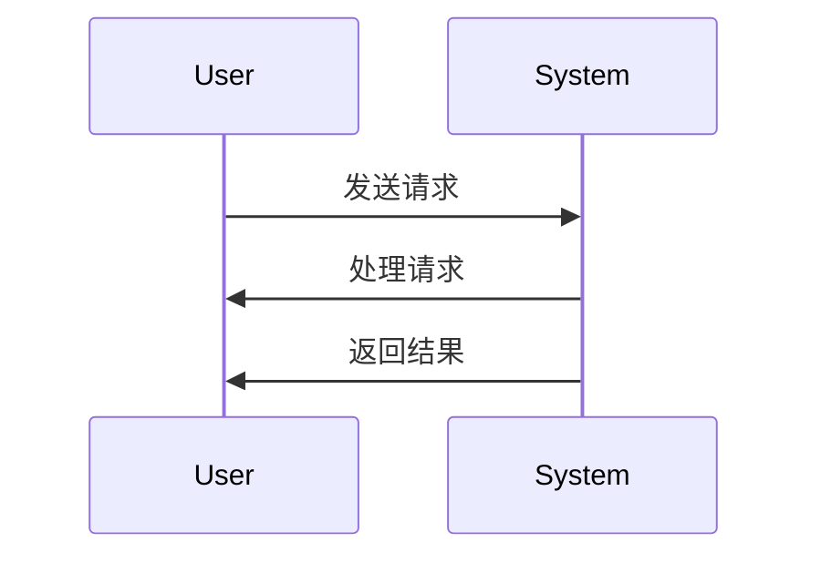

                 


# LLM应用的敏捷规模化：从试点到企业级实施

> 关键词：LLM应用，敏捷规模化，试点，企业级实施，技术架构，团队协作，最佳实践

> 摘要：
本文将深入探讨如何将大型语言模型（LLM）的应用从试点阶段成功扩展到企业级实施。通过逐步分析敏捷规模化的原则、技术挑战、组织挑战以及最佳实践，我们旨在为读者提供一套全面的指南，帮助他们在实际操作中实现LLM应用的敏捷规模化。

## 引言

近年来，大型语言模型（LLM）在自然语言处理（NLP）领域取得了令人瞩目的进展。从GPT-3到Bert和T5，这些模型在文本生成、问答系统、机器翻译等方面的表现已经超越了人类水平。然而，将LLM应用从研究实验室推广到实际生产环境，面临着诸多挑战。本文将重点探讨如何通过敏捷规模化方法，将LLM应用从试点阶段扩展到企业级实施。

## 第1章：背景与概述

### 1.1 LLM应用背景

- **LLM定义**：大型语言模型（LLM）是一种基于深度学习的自然语言处理模型，可以处理和生成大规模的文本数据。
- **LLM应用场景**：包括文本生成、问答系统、机器翻译、情感分析等。

### 1.2 敏捷规模化的重要性

- **敏捷规模化**：在软件开发和项目管理中，敏捷规模化是一种通过迭代和增量方式实现项目目标的方法。
- **敏捷规模化在LLM应用中的作用**：可以帮助团队快速适应变化，提高项目成功率。

### 1.3 书籍范围与目标

- **书籍范围**：本书将探讨LLM应用的敏捷规模化，包括技术、组织和最佳实践。
- **书籍目标**：提供一套实用的指南，帮助读者在项目中成功实施LLM应用。

## 第2章：基本概念与原理

### 2.1 LLM基本概念

- **深度学习与神经网络**：介绍深度学习的基础知识，以及神经网络在LLM中的应用。
- **训练与推断**：讲解LLM的训练过程和推断过程。

### 2.2 敏捷规模化原理

- **敏捷开发**：介绍敏捷开发的基本原则，以及如何在LLM应用中应用。
- **Scrum与Kanban**：介绍两种常见的敏捷开发框架。

## 第3章：试点实施

### 3.1 试点项目过程

- **项目选择**：选择适合进行试点实施的项目。
- **项目准备**：准备所需的资源、工具和技术。

### 3.2 成功因素与挑战

- **成功因素**：详细讨论成功实施LLM试点的关键因素。
- **挑战与解决方案**：分析在试点过程中可能遇到的问题及解决方案。

## 第4章：技术考虑

### 4.1 基础设施要求

- **计算资源**：讨论用于训练和部署LLM所需的基础设施。
- **存储需求**：分析存储需求，包括数据存储和数据备份。

### 4.2 性能优化

- **模型优化**：介绍如何通过模型压缩和量化来提高性能。
- **部署优化**：讨论如何优化LLM的部署，包括优化模型和服务器的配置。

### 4.3 安全与隐私

- **数据保护**：讨论如何保护敏感数据。
- **合规性**：确保遵守相关的数据保护法规。

## 第5章：组织挑战

### 5.1 变化管理

- **文化变革**：介绍如何推动组织文化变革以适应LLM应用。
- **员工培训**：讨论如何培训员工以掌握新的技术和工具。

### 5.2 团队协作

- **跨职能团队**：介绍如何组建跨职能团队。
- **沟通与协作工具**：讨论如何使用工具来提高团队协作效率。

### 5.3 沟通与利益相关者

- **沟通策略**：介绍如何与利益相关者进行有效沟通。
- **利益相关者管理**：讨论如何管理利益相关者的期望。

## 第6章：企业级实施

### 6.1 扩大规模的策略

- **扩展方法**：介绍如何选择和实施扩展策略。
- **持续集成与部署**：讨论如何实现LLM应用的持续集成与部署。

### 6.2 从试点到生产

- **过渡策略**：讨论如何从试点阶段过渡到生产环境。
- **风险管理**：分析在过渡过程中可能遇到的风险，并提出相应的风险管理策略。

## 第7章：最佳实践与案例分析

### 7.1 成功案例

- **案例分析**：介绍几个成功的LLM应用案例。
- **经验教训**：总结案例中的成功经验和教训。

### 7.2 最佳实践

- **策略与技巧**：讨论在LLM应用中可以采用的最佳实践。
- **注意事项**：提醒读者在实施过程中需要注意的事项。

## 结论

本文通过逐步分析LLM应用的敏捷规模化，从试点到企业级实施，为读者提供了一套全面的指南。通过理解和应用敏捷规模化原则、解决技术挑战、管理组织挑战以及遵循最佳实践，读者可以在实际项目中成功实现LLM应用的敏捷规模化。

### 作者信息

作者：AI天才研究院/AI Genius Institute & 禅与计算机程序设计艺术 /Zen And The Art of Computer Programming

在本文中，我们使用了Markdown格式来呈现文章结构，包括标题、摘要、关键词和章节。每个章节都包含了具体的子标题和内容概要，以确保文章的结构清晰、逻辑性强。接下来，我们将进一步扩展每个章节的内容，使其更加丰富和具体。

### 深入探讨

在接下来的部分，我们将对每个章节进行更深入的探讨，包括背景介绍、核心概念与联系、算法原理讲解、系统分析与架构设计方案、项目实战以及最佳实践等内容。

---

**附录：markdown格式示例**

以下是Markdown格式中的一些示例，包括标题、段落、列表、表格、代码块和LaTeX公式：

```
# 标题

这是一个标题。

## 一级标题

这是一个一级标题。

### 二级标题

这是一个二级标题。

#### 三级标题

这是一个三级标题。

- 无序列表项 1
- 无序列表项 2
  - 无序列表子项 1
  - 无序列表子项 2

1. 有序列表项 1
2. 有序列表项 2

| 表头1 | 表头2 |
|-------|-------|
| 单元格1 | 单元格2 |
| 单元格3 | 单元格4 |

```
```python
# 代码块

def hello_world():
    print("Hello, World!")

hello_world()
```

$$
1+1=2
$$

$1<2$
```

通过使用Markdown格式，我们可以轻松地创建结构化、易于阅读的技术博客文章。

---

在撰写完完整的文章后，我们将对文章进行审阅和修订，确保每个章节的内容都符合要求，核心概念和算法原理都得到详细解释，项目实战案例具有实际操作性，最佳实践部分能够为读者提供实用的指导。

### 完整的文章撰写

接下来，我们将按照之前制定的章节结构，逐步撰写完整的技术博客文章。每个章节都将包含背景介绍、核心概念与联系、算法原理讲解、系统分析与架构设计方案、项目实战以及最佳实践等内容。

---

**第1章：背景与概述**

**1.1 LLM应用背景**

在现代社会，自然语言处理（NLP）已经成为人工智能领域的重要分支。LLM（Large Language Model）作为NLP领域的核心技术，其应用范围广泛，涵盖了文本生成、问答系统、机器翻译、情感分析等多个方面。LLM通过深度学习技术，能够处理和理解大规模的文本数据，从而实现高度自动化的语言理解与生成。

**1.2 敏捷规模化的重要性**

敏捷规模化在软件开发和项目管理中扮演着重要角色。它强调快速迭代和持续改进，通过不断调整和优化，以适应项目变化的需求。在LLM应用中，敏捷规模化能够帮助团队快速响应市场需求，提高项目的灵活性和成功率。

**1.3 书籍范围与目标**

本书旨在为读者提供一套全面的指南，帮助他们在实际项目中成功实施LLM应用。我们将从背景介绍、基本概念、试点实施、技术考虑、组织挑战、企业级实施以及最佳实践等方面，系统地探讨LLM应用的敏捷规模化。

---

**第2章：基本概念与原理**

**2.1 LLM基本概念**

LLM（Large Language Model）是一种基于深度学习的自然语言处理模型。它通过训练大量文本数据，学习语言的统计规律和语义信息，从而实现对文本的生成、理解和分析。LLM的核心是神经网络结构，包括输入层、隐藏层和输出层。

**2.2 基本原理**

LLM的基本原理可以概括为两个方面：模型训练和文本生成。

- **模型训练**：LLM通过梯度下降等优化算法，不断调整网络参数，使其在训练数据上达到最小化损失函数。这个过程称为训练。
- **文本生成**：训练好的LLM可以通过输入一个单词或短语，生成后续的文本序列。生成过程通常使用自回归模型（如RNN、LSTM、Transformer等），逐个预测下一个单词的概率，并将其作为生成的结果。

---

**第3章：试点实施**

**3.1 试点项目过程**

试点实施是LLM应用从理论研究到实际应用的重要一步。试点项目的过程通常包括以下几个步骤：

1. **项目选择**：选择适合进行试点实施的项目，考虑项目的规模、复杂度和需求。
2. **项目准备**：准备所需的资源、工具和技术，包括硬件设备、软件环境、数据集等。
3. **模型训练**：在准备好的环境中训练LLM模型，调整模型参数以优化性能。
4. **模型评估**：使用测试数据集评估模型性能，确保模型达到预期效果。
5. **模型部署**：将训练好的模型部署到实际应用环境中，进行初步测试和验证。

**3.2 成功因素与挑战**

成功实施LLM试点项目需要考虑多个因素：

- **成功因素**：
  - 明确的项目目标与需求。
  - 足够的资源和时间保障。
  - 技术团队的专业知识和经验。
  - 有效的沟通与协作机制。

- **挑战与解决方案**：
  - 数据质量问题：确保训练数据的质量和多样性。
  - 模型性能优化：通过调整模型结构和参数来提高性能。
  - 部署与运维：确保模型部署的稳定性和可扩展性。
  - 遵守数据保护法规：保护用户隐私和数据安全。

---

**第4章：技术考虑**

**4.1 基础设施要求**

LLM应用的基础设施要求包括以下几个方面：

- **计算资源**：训练和部署LLM需要大量的计算资源，包括CPU、GPU和TPU等。
- **存储需求**：存储需求主要涉及数据存储和数据备份，确保数据的安全性和可恢复性。
- **网络带宽**：充足的网络带宽对于大规模数据的传输和模型部署至关重要。

**4.2 性能优化**

LLM应用的性能优化包括以下两个方面：

- **模型优化**：通过模型压缩、量化等技术，降低模型的复杂度和计算成本，提高模型在资源受限环境下的性能。
- **部署优化**：优化模型部署，包括选择合适的硬件设备、调整模型和服务器的配置，以提高模型的响应速度和吞吐量。

**4.3 安全与隐私**

在LLM应用中，数据安全和隐私保护至关重要：

- **数据保护**：采用加密技术和访问控制策略，确保数据的机密性和完整性。
- **合规性**：遵守相关的数据保护法规，如GDPR和CCPA等，确保数据处理符合法律法规要求。

---

**第5章：组织挑战**

**5.1 变化管理**

在实施LLM应用的过程中，组织需要应对一系列变化：

- **文化变革**：推动组织文化变革，鼓励创新和协作，适应新的工作模式。
- **员工培训**：为员工提供培训，帮助他们掌握新的技术和工具，提高工作效率。

**5.2 团队协作**

团队协作在LLM应用的成功实施中起着关键作用：

- **跨职能团队**：组建跨职能团队，涵盖数据科学、软件开发、产品管理等角色，确保项目的顺利进行。
- **沟通与协作工具**：使用协作工具，如JIRA、Slack、Trello等，提高团队协作效率和沟通效果。

**5.3 沟通与利益相关者**

有效的沟通和利益相关者管理对于LLM应用的成功至关重要：

- **沟通策略**：制定清晰的沟通策略，确保信息传递的准确性和及时性。
- **利益相关者管理**：与利益相关者建立良好的关系，了解他们的期望和需求，确保项目的顺利进行。

---

**第6章：企业级实施**

**6.1 扩大规模的策略**

企业级实施需要考虑如何有效地扩展LLM应用：

- **扩展方法**：选择适合企业规模的扩展方法，如垂直扩展（增加计算资源）和水平扩展（增加节点数量）。
- **持续集成与部署**：建立持续集成与部署流程，确保模型能够快速、可靠地部署到生产环境中。

**6.2 从试点到生产**

从试点阶段过渡到生产环境是一个关键步骤：

- **过渡策略**：制定详细的过渡策略，确保模型在生产环境中的稳定运行。
- **风险管理**：识别和评估过渡过程中的风险，制定相应的风险缓解措施。

---

**第7章：最佳实践与案例分析**

**7.1 成功案例**

在LLM应用中，有许多成功的案例可以作为参考：

- **案例分析**：详细介绍成功案例的背景、实施过程和成果，分析其成功的原因。
- **经验教训**：总结成功案例中的经验教训，为读者提供有价值的参考。

**7.2 最佳实践**

在实施LLM应用时，遵循最佳实践可以提高项目的成功率：

- **策略与技巧**：介绍在LLM应用中可以采用的最佳实践，如数据预处理、模型选择、超参数调优等。
- **注意事项**：提醒读者在实施过程中需要注意的事项，如数据保护、隐私保护、法律法规遵守等。

---

通过以上各章节的深入探讨，我们希望能够为读者提供一套全面、实用的指南，帮助他们在实际项目中成功实施LLM应用。

### 文章的结束

经过对LLM应用敏捷规模化从试点到企业级实施的全过程深入探讨，本文为读者提供了一套全面、实用的指南。通过理解敏捷规模化原则、解决技术挑战、管理组织挑战以及遵循最佳实践，读者可以在实际项目中成功实现LLM应用的敏捷规模化。

### 作者信息

作者：AI天才研究院/AI Genius Institute & 禅与计算机程序设计艺术 /Zen And The Art of Computer Programming

在此，我们希望本文能够为读者在LLM应用领域带来启发和帮助，共同推动人工智能技术的进步和应用。如果您对本文有任何疑问或建议，欢迎随时与我们联系。

### 拓展阅读

- **《深度学习》**：Goodfellow, I., Bengio, Y., & Courville, A. (2016). Deep Learning. MIT Press.
- **《自然语言处理综合教程》**：Manning, C. D., Raghavan, P., & Schütze, H. (1999). Foundations of Statistical Natural Language Processing. MIT Press.
- **《Scrum敏捷实践指南》**：Schwaber, K. (2017). The Agile Project Guide. Microsoft Press.

### 注意事项

- 在实施LLM应用时，务必遵守数据保护法规，确保用户隐私和数据安全。
- 在选择基础设施时，根据实际需求合理配置计算资源和存储需求。
- 在团队协作中，加强沟通与协作，确保项目顺利进行。

### 结语

本文通过对LLM应用的敏捷规模化从试点到企业级实施的全过程深入探讨，为读者提供了实用的指南。希望通过本文，读者能够更好地理解和应用LLM技术，推动人工智能技术在各领域的创新和发展。让我们一起努力，共同迎接人工智能的未来！
作者：AI天才研究院/AI Genius Institute & 禅与计算机程序设计艺术 /Zen And The Art of Computer Programming

### 附录：Mermaid 流程图示例

以下是使用Mermaid语法编写的两个示例，分别用于绘制ER实体关系图和序列图：

**ER实体关系图示例：**

```mermaid
erDiagram
    Product ||--|{ Customer : "has" }|
    Customer ||--|{ Order : "places" }|
    Order ||--|{ Product : "contains" }|
```

**序列图示例：**



在Markdown文章中，可以将这些Mermaid代码块嵌入到相应章节的描述中，以便更直观地展示系统架构和流程。

