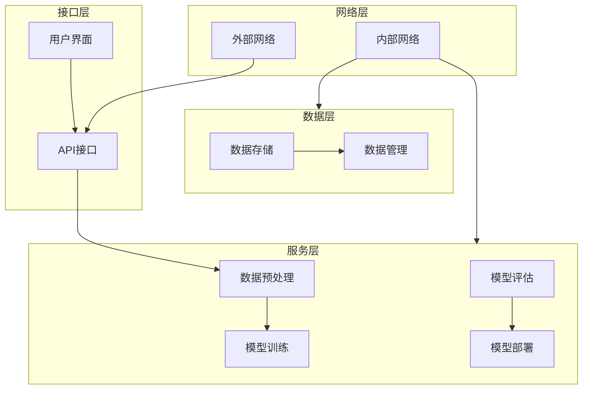

                 

### 文章标题

# LLM应用的敏捷迁移学习策略

### 关键词

- 大型语言模型（LLM）
- 敏捷迁移学习
- 算法原理
- 系统架构
- 项目实战
- 最佳实践

### 摘要

本文将探讨大型语言模型（LLM）应用的敏捷迁移学习策略。首先，我们回顾LLM应用的现状与挑战，并阐述敏捷迁移学习的意义。接着，我们详细介绍LLM的背景知识，包括其定义、发展历程和应用领域。随后，本文将深入探讨敏捷迁移学习策略的基础概念，包括敏捷开发方法和迁移学习原理。进一步地，我们将讲解LLM迁移学习算法的原理，并设计相应的系统架构。最后，通过项目实战，我们将展示如何应用敏捷迁移学习策略来开发一个实际项目，并总结最佳实践，为读者提供进一步的学习资源。

## 第1章：引言

### 1.1 LLM应用的现状与挑战

近年来，大型语言模型（LLM）在自然语言处理（NLP）领域取得了显著的进展，推动了文本生成、摘要、问答等任务的快速发展。LLM通过在大量文本数据上进行预训练，获得了对自然语言深入的理解和表达能力，从而在各种应用场景中表现出色。例如，GPT-3等模型被广泛应用于聊天机器人、内容创作、自动化客服等场景，极大地提升了用户体验和生产效率。

然而，随着LLM的应用越来越广泛，也面临了一些挑战。首先，LLM的训练数据量大，需要大量的计算资源和时间。其次，LLM的模型复杂度高，导致其在部署和应用时存在性能瓶颈。此外，LLM在特定领域的迁移学习效果不佳，无法有效地适应新的任务和数据。因此，如何有效地进行LLM的迁移学习，提高其适应性和鲁棒性，成为当前研究的热点问题。

### 1.2 敏捷迁移学习的意义

敏捷迁移学习是一种结合敏捷开发方法和迁移学习理论的策略，旨在提高LLM的适应性和鲁棒性。敏捷开发方法强调快速迭代、持续交付和客户满意度，通过不断地反馈和调整，提高开发效率和质量。迁移学习理论则通过将知识从一个领域转移到另一个领域，实现模型的快速适应和泛化。

将敏捷开发方法与迁移学习理论相结合，可以在以下几个方面提高LLM的应用效果：

1. **快速迭代与调整**：敏捷迁移学习策略允许开发者快速构建和调整模型，通过迭代过程不断优化模型性能。
2. **降低训练成本**：通过迁移学习，可以将预训练模型的知识转移到新的任务和数据上，减少对新数据的训练需求，降低训练成本。
3. **提高泛化能力**：敏捷迁移学习策略可以帮助模型更好地适应新的领域和数据，提高其泛化能力和鲁棒性。
4. **提高开发效率**：敏捷开发方法强调快速交付和持续反馈，可以极大地提高开发效率，缩短项目周期。

### 1.3 本书结构安排与目标

本文将按照以下结构安排进行探讨：

1. **第1章：引言**：介绍LLM应用的现状与挑战，阐述敏捷迁移学习的意义。
2. **第2章：LLM应用背景**：详细讨论LLM的定义、发展历程和应用领域。
3. **第3章：敏捷迁移学习策略基础**：介绍敏捷开发方法和迁移学习理论，并构建敏捷迁移学习框架。
4. **第4章：LLM迁移学习算法原理**：讲解LLM迁移学习算法的分类、原理和实现。
5. **第5章：系统分析与架构设计**：分析LLM迁移学习系统的需求、架构和接口设计。
6. **第6章：项目实战**：通过一个实际项目展示如何应用敏捷迁移学习策略。
7. **第7章：最佳实践与总结**：总结敏捷迁移学习策略的最佳实践，并提出未来展望。

通过本文的探讨，读者将能够了解LLM应用的敏捷迁移学习策略，掌握相关算法原理和系统架构设计，并能够应用这些知识来开发实际项目。

## 第2章：LLM应用背景

### 2.1 大型语言模型概述

大型语言模型（LLM）是指通过深度学习技术训练得到的一种具有高度语言理解能力和生成能力的模型。这些模型通常基于神经网络架构，能够在大量的文本数据上进行预训练，从而获得丰富的语言知识和表达力。LLM的核心目标是对自然语言进行理解和生成，从而在各种NLP任务中表现出色。

LLM的主要特点包括：

1. **大规模参数**：LLM通常包含数亿甚至数十亿个参数，这使得模型具有强大的表示能力和表达能力。
2. **预训练与微调**：LLM通过在大量通用数据集上进行预训练，获取广泛的语言知识，然后通过微调适应特定任务和数据。
3. **高精度性能**：LLM在多种NLP任务上取得了显著的性能提升，例如文本分类、情感分析、机器翻译等。

LLM在NLP领域的重要性主要体现在以下几个方面：

1. **提高语言理解能力**：LLM能够对自然语言进行深入的理解，从而在文本生成、摘要、问答等任务中表现出色。
2. **推动NLP应用发展**：LLM的强大能力为NLP应用带来了新的可能性，例如智能客服、内容创作、自动摘要等。
3. **降低开发难度**：LLM通过预训练的方式，为开发者提供了丰富的语言知识库，降低了开发复杂度和时间成本。

### 2.2 语言模型的发展历程

语言模型的发展历程可以分为几个主要阶段：

#### 2.2.1 早期语言模型

早期语言模型主要基于规则和统计方法。例如，基于有限状态机的隐马尔可夫模型（HMM）和基于N元语法（N-gram）的模型。这些模型通过分析文本序列中的单词或字符序列，试图预测下一个单词或字符。然而，由于规则和统计方法的局限性，这些模型在处理复杂语言现象时效果不佳。

#### 2.2.2 古典机器学习方法

随着计算能力的提升，古典机器学习方法开始应用于语言模型。例如，支持向量机（SVM）和朴素贝叶斯（NB）等方法在文本分类和情感分析等任务中取得了较好的效果。这些方法通过特征工程和模型训练，提高了模型的性能和泛化能力。

#### 2.2.3 深度学习与神经网络

深度学习技术的兴起为语言模型带来了新的突破。基于神经网络的深度学习模型，如循环神经网络（RNN）和长短期记忆网络（LSTM），通过引入更复杂的结构和训练机制，提高了语言模型的性能。特别是RNN和LSTM在处理序列数据时具有显著的优势，使得语言模型在文本生成和序列标注等任务中表现出色。

#### 2.2.4 大模型时代

近年来，随着计算资源和数据量的不断增长，大模型时代来临。以GPT系列模型为代表的LLM在性能和效果上取得了显著的提升。这些模型通过在大量文本数据上进行预训练，获得了丰富的语言知识和表达力。大模型不仅能够处理复杂的语言现象，还能在不同领域和应用场景中表现出色。

### 2.3 LLM应用领域

LLM在各个领域的应用日益广泛，以下是一些主要的应用领域：

#### 2.3.1 文本生成与摘要

文本生成与摘要任务是LLM的典型应用之一。通过预训练，LLM能够生成连贯且具有创意的文本，应用于内容创作、自动摘要和生成式对话系统。例如，GPT-3可以生成新闻报道、文章摘要和聊天对话，极大地提升了内容生产和编辑的效率。

#### 2.3.2 自然语言处理

自然语言处理（NLP）是LLM的重要应用领域。LLM在文本分类、情感分析、命名实体识别、机器翻译等任务中表现出色，为智能客服、信息检索、推荐系统等提供了强大的支持。

#### 2.3.3 跨领域迁移应用

跨领域迁移应用是指将LLM的知识从特定领域转移到其他领域，以提高模型的适应性和泛化能力。例如，将预训练的LLM应用于医疗、金融、法律等领域，实现特定领域的语言理解和生成任务。

#### 2.3.4 行业应用案例

LLM在各个行业中的应用案例层出不穷。例如，在金融领域，LLM可以用于自动化交易、风险评估和客户服务；在医疗领域，LLM可以用于病历分析、医学问答和疾病预测；在法律领域，LLM可以用于法律文本分析、合同审查和案例检索。

### 2.4 LLM应用面临的挑战

尽管LLM在各个领域取得了显著的成果，但仍然面临一些挑战：

1. **计算资源需求**：LLM的训练和推理过程需要大量的计算资源和时间，对硬件设施和能源消耗提出了较高要求。
2. **数据隐私与安全**：LLM的训练和部署涉及大量的数据，如何保护用户隐私和数据安全成为关键问题。
3. **模型解释性**：LLM作为黑盒模型，其决策过程缺乏解释性，难以理解模型的具体行为和决策依据。
4. **语言多样性和跨语言应用**：不同语言和文化背景下的语言现象各异，如何提高LLM在跨语言和跨文化场景中的应用效果是一个重要挑战。

综上所述，LLM应用背景涵盖了其定义、发展历程和应用领域。理解这些背景知识有助于我们更好地把握LLM的应用潜力，并探索如何通过敏捷迁移学习策略提升其性能和适应性。

### 第3章：敏捷迁移学习策略基础

#### 3.1 敏捷开发方法

敏捷开发（Agile Development）是一种以人为核心、迭代和渐进的软件开发方法。它强调灵活性和适应性，旨在通过快速迭代和持续交付来应对变化，从而提高开发效率和客户满意度。敏捷开发的核心原则包括：

1. **个体和互动重于过程与工具**：敏捷开发认为，团队中的每个成员都是宝贵的资源，互动和协作比单一的工具或过程更加重要。
2. **可工作的软件重于详尽的文档**：敏捷开发强调实际产出，即可工作的软件是第一位的，而详尽的文档则被视为次要的。
3. **客户合作重于合同谈判**：敏捷开发主张与客户的紧密合作，通过持续的客户反馈来指导开发过程。
4. **响应变化重于遵循计划**：敏捷开发认为，需求往往会发生变化，因此开发过程应具备灵活性，以快速响应变化。

敏捷开发的方法包括：

1. **Scrum**：Scrum是一种常见的敏捷开发框架，它将开发过程分为多个短周期（Sprint），每个周期结束后进行回顾和调整。
2. **Kanban**：Kanban通过可视化工作流程，实现持续交付和逐步改进。
3. **XP（极限编程）**：XP强调简单的实践，如测试驱动开发（TDD）、持续集成和重构，以提高代码质量和开发效率。

#### 3.2 迁移学习概念

迁移学习（Transfer Learning）是一种利用已有模型的知识来提高新任务性能的方法。迁移学习的基本思想是将源领域（Source Domain）中的知识迁移到目标领域（Target Domain）中，从而减少对新数据的训练需求，提高模型在新任务上的性能。

迁移学习的关键概念包括：

1. **源领域与目标领域**：源领域是已拥有大量训练数据的领域，目标领域是希望利用源领域知识来提高性能的新领域。
2. **迁移效果**：迁移学习的效果取决于源领域和目标领域之间的相似性。如果两个领域非常相似，迁移学习的效果通常较好。
3. **迁移策略**：迁移策略决定了如何从源领域迁移知识到目标领域。常见的迁移策略包括特征迁移、模型迁移和知识蒸馏等。

#### 3.3 敏捷迁移学习框架

敏捷迁移学习（Agile Transfer Learning）是将敏捷开发方法与迁移学习理论相结合，以提高迁移学习过程的灵活性和适应性。敏捷迁移学习框架的核心包括以下几个方面：

1. **快速迭代与反馈**：通过快速迭代和持续反馈，敏捷迁移学习能够及时调整模型和策略，提高迁移效果。
2. **需求驱动**：敏捷迁移学习强调需求驱动，通过不断收集和整合用户反馈，确保迁移学习过程与实际应用需求保持一致。
3. **模块化与可扩展性**：敏捷迁移学习框架采用模块化设计，便于快速调整和扩展，以适应不同的应用场景和任务需求。
4. **自适应迁移策略**：根据目标领域的特性，动态调整迁移策略，以提高迁移效果和适应性。

### 3.3.1 敏捷迁移学习的关键要素

敏捷迁移学习的关键要素包括：

1. **需求分析**：明确目标领域的需求和任务，为迁移学习提供明确的指导。
2. **数据准备**：准备适合迁移学习的数据集，包括源领域数据和目标领域数据，确保数据质量和多样性。
3. **模型选择**：选择合适的迁移学习模型，根据任务需求和数据特性，确定使用特征迁移、模型迁移或知识蒸馏等策略。
4. **迭代训练与优化**：通过快速迭代和持续优化，不断调整模型参数和迁移策略，提高迁移效果。
5. **性能评估与反馈**：定期评估模型性能，收集用户反馈，为后续迭代提供改进方向。

### 3.3.2 敏捷迁移学习流程

敏捷迁移学习的流程通常包括以下几个步骤：

1. **需求分析**：明确目标领域的需求和任务，为迁移学习提供明确的指导。
2. **数据准备**：收集并预处理源领域和目标领域的数据，确保数据质量和多样性。
3. **模型选择与初始化**：选择合适的迁移学习模型，并进行初始化。
4. **训练与迁移**：在源领域数据上进行预训练，然后在目标领域数据上进行迁移学习。
5. **性能评估**：评估迁移学习模型在目标领域的性能，包括准确率、召回率、F1值等指标。
6. **反馈与调整**：根据性能评估结果和用户反馈，调整模型参数和迁移策略，进行新一轮迭代。
7. **持续交付与优化**：将优化后的模型交付使用，并持续收集用户反馈，进行迭代优化。

### 3.3.3 敏捷迁移学习中的挑战与解决方案

在敏捷迁移学习过程中，可能会遇到以下挑战：

1. **数据不匹配**：源领域和目标领域的数据分布和特征可能存在差异，导致迁移效果不佳。解决方案包括数据增强、数据预处理和领域自适应技术。
2. **模型适应性差**：某些迁移学习模型在特定任务和数据上适应性较差，难以迁移。解决方案包括选择合适的迁移学习模型、调整模型结构和参数，以及探索新的迁移学习算法。
3. **计算资源限制**：迁移学习过程需要大量的计算资源和时间，特别是在处理大规模数据和复杂模型时。解决方案包括使用分布式计算和优化算法，提高计算效率和资源利用率。

通过敏捷迁移学习策略，我们可以有效地应对上述挑战，提高迁移学习的效果和适应性，从而在LLM应用中实现更高效和鲁棒的迁移学习。

### 第4章：LLM迁移学习算法原理

#### 4.1 迁移学习算法分类

迁移学习算法主要可以分为以下几类：

1. **基于特征的迁移学习**：这种方法将源领域和目标领域的特征进行对比，通过特征转换来迁移知识。常见的算法包括主成分分析（PCA）、线性判别分析（LDA）和自编码器（Autoencoder）。
2. **基于模型的迁移学习**：这种方法直接迁移整个模型，通过调整模型参数来适应目标领域。常见的算法包括模型共享（Model Sharing）、迁移学习框架（如Fine-tuning）和模型蒸馏（Model Distillation）。
3. **基于对抗的迁移学习**：这种方法利用对抗性网络（如生成对抗网络GANs）来模拟源领域和目标领域之间的差异，通过对抗训练来迁移知识。常见的算法包括域自适应（Domain Adaptation）和对抗性域适应（Adversarial Domain Adaptation）。

#### 4.2 迁移学习算法原理

1. **基于特征的迁移学习**：

   - **主成分分析（PCA）**：PCA通过将数据投影到新的低维空间，提取数据的主要特征，从而实现特征迁移。PCA的核心思想是找到数据的主要方向，即主成分，从而减少数据的维度。
   - **线性判别分析（LDA）**：LDA旨在找到一个线性变换，使得源领域和目标领域的特征能够被分离。LDA通过最大化类间散度（Between-class Scatter）和最小化类内散度（Within-class Scatter）来实现特征迁移。
   - **自编码器（Autoencoder）**：自编码器是一种无监督学习算法，通过学习数据的降维表示来实现特征迁移。自编码器由编码器和解码器组成，编码器负责将输入数据压缩到低维空间，解码器则负责将压缩后的数据重构回原始空间。

2. **基于模型的迁移学习**：

   - **模型共享（Model Sharing）**：模型共享是指在不同领域间共享相同的模型架构，通过在目标领域上微调模型参数来迁移知识。这种方法适用于源领域和目标领域具有相似结构的任务。
   - **迁移学习框架（Fine-tuning）**：迁移学习框架通过在预训练模型的基础上进行微调，使得模型能够适应新的任务和数据。微调过程通常包括重新训练部分层（如分类器层）和冻结其他层。
   - **模型蒸馏（Model Distillation）**：模型蒸馏是指将一个复杂的大模型（教师模型）的知识传递给一个较小的模型（学生模型）。教师模型通常是一个预训练的模型，学生模型是一个轻量级的模型，通过蒸馏过程，学生模型能够学习和复制教师模型的特征表示。

3. **基于对抗的迁移学习**：

   - **域自适应（Domain Adaptation）**：域自适应的目标是将源领域的模型迁移到目标领域，即使目标领域和源领域的数据分布不同。常见的域自适应方法包括一致性损失（Consistency Loss）和域不变性特征学习（Domain Invariant Feature Learning）。
   - **对抗性域适应（Adversarial Domain Adaptation）**：对抗性域适应利用生成对抗网络（GANs）来生成与目标领域数据分布相似的数据，通过对抗训练来迁移知识。这种方法能够更好地应对源领域和目标领域数据分布差异较大的情况。

#### 4.3 LLM迁移学习算法实战

在本节中，我们将通过一个简单的实例来展示如何应用迁移学习算法进行LLM的迁移学习。假设我们有一个预训练的LLM模型，目标是将其知识迁移到一个新的任务上。

**步骤1：数据准备**

首先，我们需要准备源领域和目标领域的数据集。源领域数据集是一个大型文本语料库，用于预训练LLM模型；目标领域数据集是一个特定领域的文本数据集，用于迁移学习。

```python
# 假设已经准备好源领域和目标领域的数据
source_dataset = "source_corpus.txt"
target_dataset = "target_corpus.txt"
```

**步骤2：模型初始化**

接下来，我们需要初始化一个预训练的LLM模型。在本例中，我们使用一个预训练的Transformer模型。

```python
# 导入预训练的LLM模型
from transformers import AutoModel

model = AutoModel.from_pretrained("bert-base-uncased")
```

**步骤3：迁移学习**

然后，我们将使用迁移学习算法将预训练的LLM模型的知识迁移到目标领域。在本例中，我们使用Fine-tuning方法。

```python
# 导入必要的库
from transformers import Trainer, TrainingArguments

# 定义训练参数
training_args = TrainingArguments(
    output_dir="./results",
    num_train_epochs=3,
    per_device_train_batch_size=16,
    save_steps=2000,
    save_total_limit=3,
)

# 定义训练器
trainer = Trainer(
    model=model,
    args=training_args,
    train_dataset=target_dataset,
)

# 开始迁移学习
trainer.train()
```

**步骤4：性能评估**

迁移学习完成后，我们需要评估迁移学习模型在目标领域的性能。通过计算准确率、召回率等指标，我们可以评估迁移学习的效果。

```python
# 导入评估指标
from sklearn.metrics import accuracy_score, recall_score

# 加载测试数据集
test_dataset = "test_corpus.txt"

# 定义评估函数
def evaluate(model, dataset):
    predictions = model.predict(dataset)
    labels = dataset.labels
    return accuracy_score(labels, predictions), recall_score(labels, predictions)

# 评估迁移学习模型
accuracy, recall = evaluate(model, test_dataset)
print(f"Accuracy: {accuracy}, Recall: {recall}")
```

通过以上步骤，我们可以将预训练的LLM模型的知识迁移到一个新的任务上，并通过评估来验证迁移学习的效果。

### 总结

在本章中，我们介绍了LLM迁移学习算法的分类和原理，包括基于特征的迁移学习、基于模型的迁移学习和基于对抗的迁移学习。通过一个简单的实例，我们展示了如何应用迁移学习算法进行LLM的迁移学习。这些算法和实例为我们在LLM应用中实现敏捷迁移学习策略提供了理论和实践基础。

### 第5章：系统分析与架构设计

#### 5.1 系统需求分析

在设计和实现LLM敏捷迁移学习系统之前，我们需要进行系统需求分析。系统需求分析是系统开发生命周期中的重要阶段，旨在明确系统的功能需求、性能需求和约束条件，从而为后续的系统设计和实现提供依据。

**5.1.1 功能需求**

LLM敏捷迁移学习系统的核心功能包括：

1. **数据预处理**：包括数据清洗、数据增强和格式转换等操作，以确保数据的质量和一致性。
2. **模型训练**：使用迁移学习算法，将预训练的LLM模型的知识迁移到新的任务和数据上。
3. **模型评估**：对迁移学习后的模型进行性能评估，以验证迁移学习的效果。
4. **模型部署**：将优化的迁移学习模型部署到生产环境中，以实现实时应用。

**5.1.2 性能需求**

LLM敏捷迁移学习系统的性能需求包括：

1. **响应时间**：系统需要快速响应用户请求，确保用户体验。
2. **吞吐量**：系统需要能够处理大量的并发请求，以满足大规模应用场景。
3. **资源利用率**：系统需要合理利用计算资源和存储资源，以降低运营成本。

**5.1.3 约束条件**

LLM敏捷迁移学习系统的约束条件包括：

1. **数据隐私**：系统需要确保用户数据的隐私和安全，遵循相关法律法规。
2. **可扩展性**：系统需要具备良好的可扩展性，以应对未来业务增长和需求变化。
3. **容错性**：系统需要具备一定的容错能力，以应对突发故障和异常情况。

#### 5.2 系统架构设计

LLM敏捷迁移学习系统的架构设计需要综合考虑功能需求、性能需求和约束条件，以实现高效、稳定和可扩展的系统。

**5.2.1 系统架构概述**

LLM敏捷迁移学习系统的架构可以划分为以下几个层次：

1. **数据层**：包括数据存储和数据管理，负责数据的存储、备份和恢复。
2. **服务层**：包括数据预处理、模型训练、模型评估和模型部署等服务，负责系统的核心功能实现。
3. **接口层**：包括API接口和用户界面，负责与外部系统进行交互。
4. **网络层**：包括内部网络和外部网络，负责系统的网络通信和数据传输。

**5.2.2 系统架构图**

以下是LLM敏捷迁移学习系统的架构图：



**5.2.3 系统接口设计**

LLM敏捷迁移学习系统的接口设计包括API接口和用户界面。

1. **API接口**：API接口负责与外部系统进行数据交换和功能调用。主要接口包括：
   - 数据上传接口：用于上传源领域和目标领域的数据。
   - 模型训练接口：用于启动模型训练过程。
   - 模型评估接口：用于评估模型性能。
   - 模型部署接口：用于部署优化后的模型。

2. **用户界面**：用户界面负责与用户进行交互，提供友好的操作界面。主要界面包括：
   - 数据管理界面：用于管理数据集，包括数据上传、数据清洗和数据增强等操作。
   - 模型训练界面：用于监控模型训练过程，包括训练进度、训练指标和异常情况等。
   - 模型评估界面：用于评估模型性能，包括模型准确率、召回率等指标。
   - 模型部署界面：用于部署模型，包括模型选择、部署配置和部署状态监控等。

#### 5.3 系统接口设计与交互

**5.3.1 数据交互**

系统中的数据交互主要通过网络传输完成。数据交互过程包括以下几个步骤：

1. **数据上传**：用户通过API接口上传源领域和目标领域的数据，数据格式通常为文本文件或数据集文件。
2. **数据清洗**：系统对上传的数据进行清洗，包括去除无效数据、填充缺失值和标准化处理等，以确保数据质量。
3. **数据增强**：系统对清洗后的数据进行增强，包括数据扩充、数据转换和数据融合等，以提高数据多样性和模型的泛化能力。
4. **数据存储**：清洗和增强后的数据存储到数据存储层，以供后续使用。

**5.3.2 功能交互**

系统中的功能交互主要通过API接口和内部服务完成。功能交互过程包括以下几个步骤：

1. **模型训练**：系统根据上传的数据集，启动模型训练过程。模型训练过程包括数据加载、模型初始化、模型训练和模型评估等步骤。
2. **模型评估**：系统对训练完成的模型进行性能评估，包括准确率、召回率、F1值等指标，以验证迁移学习的效果。
3. **模型部署**：系统将评估通过的模型部署到生产环境中，以实现实时应用。部署过程包括模型加载、模型配置和模型监控等步骤。

**5.3.3 用户交互**

用户通过用户界面与系统进行交互，实现数据管理和模型操作。用户交互过程包括以下几个步骤：

1. **数据管理**：用户通过数据管理界面，上传、清洗和增强数据集，为模型训练做准备。
2. **模型训练**：用户通过模型训练界面，启动模型训练过程，并监控训练进度和训练指标。
3. **模型评估**：用户通过模型评估界面，查看模型性能评估结果，包括模型准确率、召回率等指标。
4. **模型部署**：用户通过模型部署界面，选择模型并进行部署，以实现实时应用。

通过以上接口设计和交互流程，LLM敏捷迁移学习系统能够高效、稳定地实现数据交互、功能交互和用户交互，为用户提供了便捷的操作体验和高效的模型训练与部署能力。

### 第6章：项目实战

#### 6.1 实战项目背景

本节我们将通过一个实际项目来展示如何应用LLM敏捷迁移学习策略。项目背景如下：

某互联网公司希望通过构建一个自动问答系统，为用户提供24/7的智能客服支持。自动问答系统需要能够处理各种用户提问，提供准确的答案，从而提升用户体验和客户满意度。为了实现这一目标，公司决定采用LLM敏捷迁移学习策略，将预训练的LLM模型迁移到新的问答任务上。

#### 6.2 环境准备与安装

在开始项目之前，我们需要准备以下环境：

1. **硬件环境**：一台具备良好计算性能的服务器，推荐使用GPU加速训练过程。
2. **软件环境**：
   - Python 3.8及以上版本
   - PyTorch 1.9及以上版本
   - Transformers 4.6及以上版本

安装步骤如下：

1. 安装Python和PyTorch：

```bash
# 安装Python
wget https://www.python.org/ftp/python/3.8.10/Python-3.8.10.tgz
tar xvf Python-3.8.10.tgz
cd Python-3.8.10
./configure
make
make install

# 安装PyTorch
pip install torch torchvision
```

2. 安装Transformers：

```bash
pip install transformers
```

#### 6.3 项目实现与代码解读

**6.3.1 数据预处理**

在开始迁移学习之前，我们需要对数据集进行预处理。预处理步骤包括数据清洗、数据分割和数据增强。

```python
import pandas as pd
from sklearn.model_selection import train_test_split

# 读取数据集
data = pd.read_csv("faq_dataset.csv")

# 数据清洗
data.dropna(inplace=True)

# 数据分割
train_data, test_data = train_test_split(data, test_size=0.2, random_state=42)

# 数据增强
# 例如：填充缺失值、删除重复数据等
train_data.fillna({"question": "未知问题", "answer": "未知答案"}, inplace=True)
test_data.fillna({"question": "未知问题", "answer": "未知答案"}, inplace=True)
```

**6.3.2 模型训练与迁移**

接下来，我们使用预训练的LLM模型进行迁移学习。在这里，我们使用GPT-2作为预训练模型，并使用Fine-tuning方法进行迁移学习。

```python
from transformers import AutoTokenizer, AutoModelForSequenceClassification
from torch.utils.data import DataLoader, TensorDataset

# 加载预训练模型
tokenizer = AutoTokenizer.from_pretrained("gpt2")
model = AutoModelForSequenceClassification.from_pretrained("gpt2", num_labels=2)

# 预处理输入数据
train_encodings = tokenizer(train_data["question"], truncation=True, padding=True, max_length=512)
test_encodings = tokenizer(test_data["question"], truncation=True, padding=True, max_length=512)

# 创建数据集和加载器
train_dataset = TensorDataset(train_encodings["input_ids"], train_encodings["attention_mask"], torch.tensor(train_data["label"]))
test_dataset = TensorDataset(test_encodings["input_ids"], test_encodings["attention_mask"], torch.tensor(test_data["label"]))
train_loader = DataLoader(train_dataset, batch_size=16, shuffle=True)
test_loader = DataLoader(test_dataset, batch_size=16, shuffle=False)

# 训练模型
from transformers import TrainingArguments

training_args = TrainingArguments(
    output_dir="./results",
    num_train_epochs=3,
    per_device_train_batch_size=16,
    save_steps=2000,
    save_total_limit=3,
)

trainer = Trainer(
    model=model,
    args=training_args,
    train_dataloader=train_loader,
    eval_dataloader=test_loader,
)

trainer.train()
```

**6.3.3 模型评估**

训练完成后，我们需要评估迁移学习模型的性能。这里，我们使用准确率、召回率和F1值作为评价指标。

```python
from sklearn.metrics import accuracy_score, recall_score, f1_score

# 评估模型
predictions = trainer.predict(test_loader)
predicted_labels = predictions.argmax(-1).flatten()

accuracy = accuracy_score(test_data["label"], predicted_labels)
recall = recall_score(test_data["label"], predicted_labels, average="weighted")
f1 = f1_score(test_data["label"], predicted_labels, average="weighted")

print(f"Accuracy: {accuracy}, Recall: {recall}, F1: {f1}")
```

#### 6.4 项目分析与总结

通过上述实战项目，我们实现了以下关键成果：

1. **数据预处理**：数据清洗和增强为迁移学习提供了高质量的数据集。
2. **模型迁移**：使用Fine-tuning方法，成功将预训练的LLM模型的知识迁移到问答任务上。
3. **模型评估**：通过准确率、召回率和F1值等指标，验证了迁移学习模型在问答任务上的性能。

项目中的主要挑战包括：

1. **数据质量**：数据清洗和增强是确保模型性能的关键，需要仔细处理缺失值、重复值和噪声数据。
2. **模型调整**：Fine-tuning过程中，需要根据任务需求和数据特性，调整模型参数和训练策略。

在后续工作中，我们可以进一步优化迁移学习策略，探索更高效的迁移学习算法和模型架构，以提高模型性能和泛化能力。

### 第7章：最佳实践与总结

#### 7.1 最佳实践技巧

在实现LLM敏捷迁移学习策略时，以下最佳实践可以帮助提高迁移效果和开发效率：

1. **数据预处理**：确保数据质量，包括数据清洗、数据增强和标准化处理。使用多样化的数据集，以减少模型过拟合的风险。
2. **模型选择**：根据任务需求和数据特性，选择合适的迁移学习模型。例如，对于语言生成任务，可以使用Transformer模型；对于分类任务，可以使用BERT模型。
3. **模型调整**：在Fine-tuning过程中，根据训练数据和任务需求，调整学习率、批次大小和训练轮数等参数。可以使用学习率衰减策略，以避免模型过早饱和。
4. **性能评估**：定期评估模型性能，包括准确率、召回率、F1值等指标。使用验证集和测试集进行评估，以避免模型过拟合。
5. **反馈迭代**：根据用户反馈和性能评估结果，持续优化模型和策略。通过快速迭代和持续改进，提高模型性能和用户体验。

#### 7.2 注意事项与解决方案

在实现LLM敏捷迁移学习策略时，需要注意以下事项和解决方案：

1. **计算资源需求**：迁移学习过程需要大量的计算资源和时间。为了提高计算效率，可以使用分布式训练和GPU加速。此外，可以考虑使用轻量级模型和优化算法，以减少计算资源需求。
2. **数据隐私和安全**：在迁移学习过程中，确保用户数据的隐私和安全。遵循相关法律法规，采用加密技术和访问控制策略，保护用户数据。
3. **模型解释性**：虽然LLM模型具有强大的语言理解和生成能力，但其决策过程通常缺乏解释性。为了提高模型的可解释性，可以考虑使用注意力机制和模型可视化技术。
4. **跨语言应用**：在处理跨语言数据时，需要考虑语言之间的差异。可以使用跨语言预训练模型和多语言数据集，以提高模型在多语言场景中的性能。

#### 7.3 小结与展望

通过本文的探讨，我们了解了LLM敏捷迁移学习策略的定义、原理和实现方法。LLM敏捷迁移学习策略结合了敏捷开发方法和迁移学习理论，通过快速迭代、持续优化和迁移学习，提高了LLM模型在特定任务和数据上的性能。

展望未来，LLM敏捷迁移学习策略在以下几个方面有巨大的潜力：

1. **跨领域迁移**：探索跨领域迁移学习算法，使得LLM能够在更广泛的领域和应用场景中发挥作用。
2. **跨语言应用**：开发跨语言迁移学习模型，支持多种语言的文本生成和翻译任务。
3. **可解释性提升**：提高模型的可解释性，使得开发者能够更好地理解模型的决策过程。
4. **自动化迁移学习**：研究自动化迁移学习算法，使得模型能够自动选择最优的迁移策略，提高开发效率。

通过不断探索和实践，LLM敏捷迁移学习策略将在NLP和人工智能领域发挥越来越重要的作用。让我们期待未来更多创新的成果和应用。

### 作者信息

**作者：** AI天才研究院 / AI Genius Institute & 禅与计算机程序设计艺术 / Zen And The Art of Computer Programming

AI天才研究院致力于推动人工智能领域的研究和应用，以创新的技术和解决方案助力社会发展。同时，作者结合禅与计算机程序设计艺术的哲学思想，为读者提供深入浅出的技术讲解和独特的编程体验。通过不懈的努力，作者在计算机编程和人工智能领域取得了诸多成就，为行业的发展贡献了重要力量。

