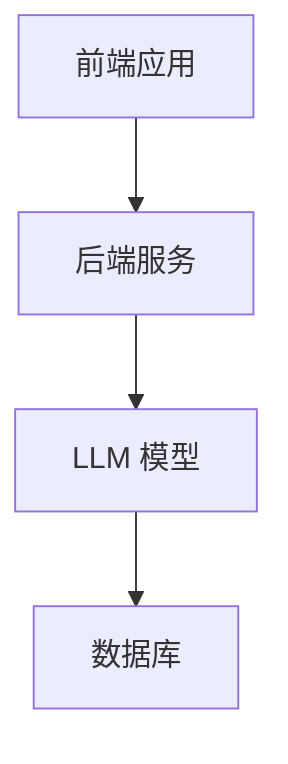
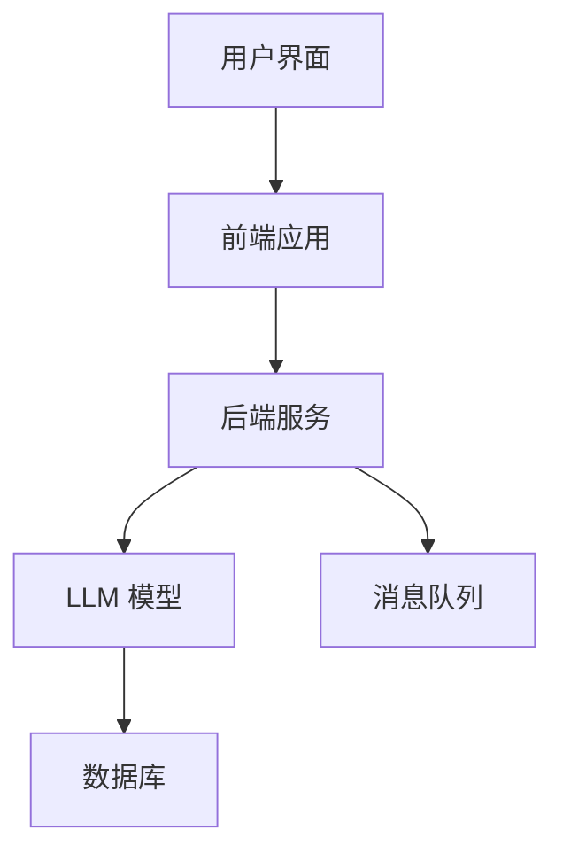
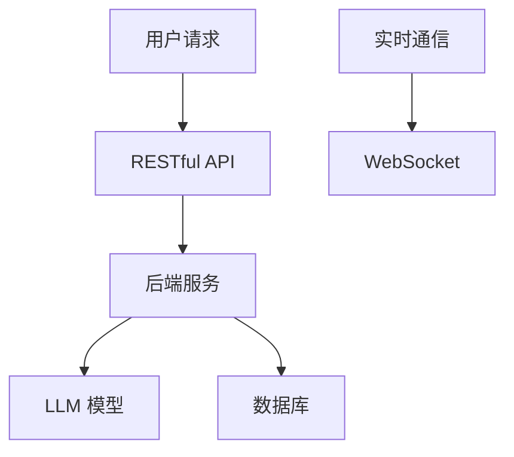
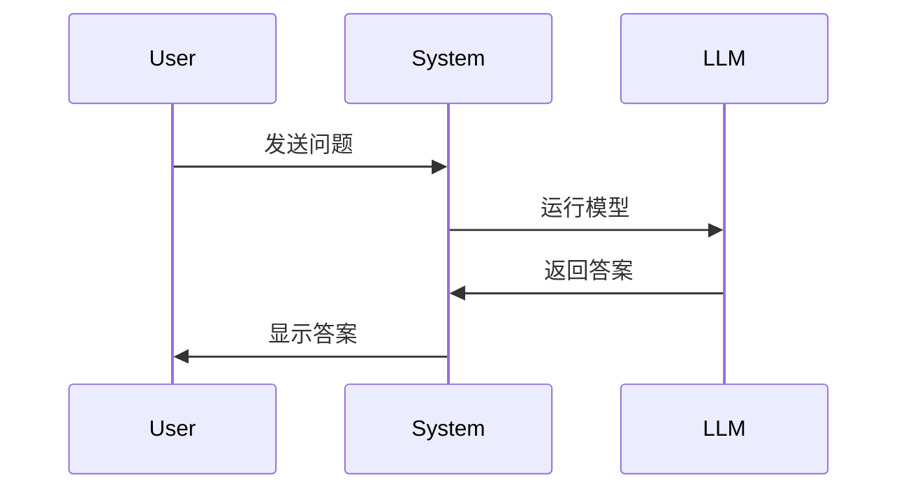

                 

### 引言

LLM（大型语言模型）的应用在近年来得到了广泛关注和迅速发展。从自然语言处理（NLP）到智能助手，从文本生成到机器翻译，LLM 已经成为人工智能领域的核心工具。然而，随着 LLM 应用场景的多样化，如何高效地管理和配置这些复杂的模型，成为一个亟待解决的问题。

本文旨在探讨 LLM 应用的敏捷配置管理策略。敏捷配置管理是一种在软件开发过程中，通过快速迭代和持续交付来适应变化的方法。它不仅适用于传统的软件项目，同样适用于 LLM 应用的配置管理。本文将首先介绍 LLM 应用的发展现状和配置管理的重要性，然后深入讨论敏捷配置管理的基本概念和原则，接着探讨不同策略和方法在 LLM 应用配置管理中的应用，最终通过实际案例和最佳实践来总结和展望未来的发展趋势。

本文将分为八个主要章节，首先简要介绍 LLM 应用和敏捷配置管理的基本背景，随后逐步深入讨论敏捷配置管理的核心概念、策略、技术实施、工具选择、实际案例以及最佳实践。希望通过本文的讨论，能够为从事 LLM 应用的开发者和运维人员提供一些实用的指导和思考。

### 关键词

- **LLM应用**：大型语言模型在实际场景中的应用。
- **敏捷配置管理**：在软件开发过程中，通过快速迭代和持续交付来适应变化的方法。
- **配置管理**：确保软件系统的正确性、一致性和可维护性的过程。
- **敏捷开发**：一种快速迭代和持续交付的软件开发方法。
- **自动化部署**：使用工具来自动完成软件部署的过程。
- **持续集成与持续部署**：将代码变更自动集成和部署到生产环境的过程。
- **版本控制**：管理代码版本和变更的历史记录。

### 摘要

本文旨在探讨 LLM 应用的敏捷配置管理策略，以应对复杂且不断变化的开发环境。首先，本文简要介绍了 LLM 应用的发展现状和配置管理的必要性。随后，通过深入分析敏捷配置管理的基本概念和原则，为 LLM 应用的配置管理提供了理论依据。接下来，本文探讨了多种敏捷配置管理的策略和方法，包括版本控制、自动化部署和持续集成与持续部署。在技术实施部分，本文详细讨论了常用的配置管理工具和技术，以及如何在实际项目中应用这些技术。通过实际案例的分享，本文展示了敏捷配置管理在 LLM 应用中的具体应用和实践效果。最后，本文总结了敏捷配置管理的最佳实践，并展望了未来的发展趋势，为 LLM 应用的敏捷配置管理提供了全面的指导和思考。

## 第1章: 背景与核心概念

### 1.1 问题背景

在当前人工智能（AI）高速发展的背景下，大型语言模型（LLM）的应用逐渐渗透到各个行业和领域。LLM，特别是基于深度学习的模型，因其强大的文本生成和语言理解能力，成为许多应用场景的核心组件。从智能客服、文本摘要、机器翻译到内容生成，LLM 的应用已经取得了显著的成果。

然而，随着 LLM 应用的广泛普及，如何高效地管理和配置这些模型成为一个亟待解决的问题。传统的配置管理方法往往依赖于手动操作和繁琐的流程，不仅效率低下，而且容易出现错误。同时，LLM 模型本身具有较高的复杂性，包括模型结构、参数调优、数据预处理等，这使得配置管理变得更加困难。

具体来说，配置管理在 LLM 应用中的问题主要表现在以下几个方面：

1. **版本管理难题**：随着模型迭代和优化，如何有效地管理和追踪不同版本的模型，以及如何确保正确版本的使用，成为一个重要挑战。
2. **部署复杂性**：LLM 模型的部署通常需要复杂的依赖环境和资源配置，如何自动化和简化部署过程，提高部署效率，是当前需要解决的关键问题。
3. **测试与验证**：在模型部署前，如何进行全面而有效的测试和验证，以确保模型的质量和性能，是一个复杂的过程。
4. **变更管理**：在开发和运营过程中，如何处理配置的变更，确保系统的稳定性和可靠性，是一个需要细致考虑的问题。

### 1.2 敏捷配置管理概述

敏捷配置管理（Agile Configuration Management）是一种在软件开发过程中，通过快速迭代和持续交付来适应变化的方法。它强调团队合作、客户合作和快速响应变化，旨在提高软件开发的效率和质量。

敏捷配置管理的基本原则包括：

1. **客户合作与反馈**：通过与客户的紧密合作，及时获取反馈，确保开发的产品满足客户需求。
2. **响应变化**：在开发过程中，灵活应对变化，及时调整计划和策略，确保项目能够持续前进。
3. **持续集成与交付**：通过持续集成和交付，确保代码变更能够快速集成和部署，提高开发效率和系统稳定性。

### 1.3 LLM应用的特点与挑战

LLM 应用具有以下几个显著特点：

1. **复杂性**：LLM 模型通常由数十亿甚至千亿级别的参数组成，模型结构复杂，训练和部署过程需要大量的计算资源和时间。
2. **高度定制化**：不同的应用场景对 LLM 模型有不同需求，需要根据具体需求进行参数调优和模型结构调整。
3. **数据依赖性**：LLM 模型的性能和数据质量密切相关，需要持续更新和优化数据集。

面对这些特点，LLM 应用在配置管理方面面临以下挑战：

1. **版本管理**：由于模型参数和结构的不断变化，如何有效地进行版本管理和追踪，确保正确版本的使用，是一个重要问题。
2. **自动化部署**：复杂的依赖环境和资源配置使得自动化部署成为必要，但如何实现自动化部署，简化部署流程，仍是一个挑战。
3. **测试与验证**：LLM 模型的测试和验证需要全面而有效，如何设计测试用例，确保模型质量，是一个复杂的过程。
4. **变更管理**：在开发和运营过程中，如何处理配置的变更，确保系统的稳定性和可靠性，是一个需要细致考虑的问题。

综上所述，敏捷配置管理在 LLM 应用中具有重要的应用价值，能够帮助开发者更好地应对上述挑战，提高 LLM 应用的开发效率和系统稳定性。

### 1.4 敏捷配置管理在LLM应用中的独特性

敏捷配置管理在 LLM 应用中具有其独特的优势，主要体现在以下几个方面：

1. **快速迭代与持续交付**：LLM 应用往往需要不断调整和优化，敏捷配置管理通过快速迭代和持续交付，能够快速响应需求变化，提高开发效率。开发者可以在每个迭代周期内，对模型进行调优和测试，确保最优性能。

2. **版本控制与变更管理**：在 LLM 应用中，版本控制尤为重要。敏捷配置管理通过版本控制工具，如 Git，能够有效管理不同版本的模型，确保正确版本的部署和使用。同时，变更管理流程能够确保每次变更的透明性和可控性，减少潜在的风险。

3. **自动化与简化流程**：LLM 模型的部署通常需要复杂的依赖环境和资源配置。敏捷配置管理通过自动化部署工具，如 Jenkins 和 Docker，能够简化部署流程，减少手动操作，提高部署效率。自动化测试也能够确保模型在部署前的质量，提高系统稳定性。

4. **团队协作与客户反馈**：敏捷配置管理强调团队合作和客户反馈，通过持续的合作和沟通，能够更好地理解客户需求，及时调整开发计划，确保最终产品满足客户期望。

5. **适应性和灵活性**：LLM 应用场景多样，需求变化频繁。敏捷配置管理通过灵活的配置管理策略，能够快速适应变化，确保系统在不同场景下的稳定运行。

总的来说，敏捷配置管理为 LLM 应用的开发和运维提供了强大的支持，通过快速迭代、自动化部署、版本控制和团队协作，有效提升了开发效率和系统稳定性，为 LLM 应用的成功应用提供了坚实的保障。

### 1.5 本章小结

本章介绍了 LLM 应用的敏捷配置管理的背景和核心概念，详细探讨了 LLM 应用的特点与挑战，以及敏捷配置管理在其中的独特性。通过分析，我们认识到敏捷配置管理在快速响应变化、有效管理版本和简化部署流程方面具有显著优势，对于提升 LLM 应用的开发效率和系统稳定性具有重要意义。接下来的章节将进一步深入探讨敏捷配置管理的具体策略和实施方法，帮助开发者更好地应对复杂的应用场景。

## 第2章：敏捷配置管理原则与策略

### 2.1 敏捷配置管理原则

敏捷配置管理（Agile Configuration Management）的核心原则包括客户合作、响应变化和持续集成与交付。这些原则不仅适用于传统软件开发，同样适用于 LLM 应用的配置管理，因为它们能够有效应对复杂性和变化。

1. **客户合作与反馈**：
   - **客户参与**：在敏捷开发中，客户的参与至关重要。客户不仅提供需求，还参与设计、测试和评估，确保最终产品满足其需求。
   - **快速反馈**：通过频繁的沟通和反馈循环，开发团队能够迅速识别并解决问题，确保产品方向正确，减少后期返工。

2. **响应变化**：
   - **迭代开发**：敏捷开发采用迭代式方法，每个迭代周期（通常为几周）都会交付一个可用的产品版本，允许开发团队在开发过程中逐步调整和优化。
   - **适应变化**：在开发过程中，需求可能会发生变化。敏捷配置管理强调团队灵活应对这些变化，通过调整计划和时间表，确保项目能够持续前进。

3. **持续集成与交付**：
   - **持续集成**：持续集成（CI）是一种软件开发实践，通过自动化工具将代码变更定期集成到主干分支，确保代码质量。
   - **持续交付**：持续交付（CD）是持续集成的延伸，通过自动化工具将集成后的代码自动部署到生产环境，确保快速、可靠地交付产品。

### 2.2 敏捷配置管理策略

在 LLM 应用中，敏捷配置管理可以采用以下几种策略：

1. **版本控制**：
   - **版本管理工具**：使用版本控制工具（如 Git）来管理模型的代码和配置文件。版本控制能够跟踪每个版本的变更，确保不同版本的模型能够被正确使用。
   - **分支管理**：通过分支管理，可以同时进行多个开发任务，避免冲突，提高开发效率。

2. **自动化部署**：
   - **自动化脚本**：编写自动化脚本来自动化部署流程，减少手动操作，提高部署效率。
   - **容器化**：使用容器化技术（如 Docker）可以将模型和环境打包在一起，确保在不同环境中的一致性和可移植性。

3. **持续集成与持续部署**：
   - **自动化测试**：在持续集成过程中，自动化测试可以确保每次代码变更都不会破坏现有功能，提高代码质量。
   - **自动化部署**：通过自动化部署工具（如 Jenkins），将集成后的代码自动部署到测试或生产环境，确保快速、可靠地交付产品。

### 2.3 案例分析

#### 2.3.1 成功案例

以某人工智能公司开发的一款智能客服系统为例，该公司采用了敏捷配置管理策略。通过版本控制工具管理模型代码和配置文件，自动化部署脚本简化了部署流程，自动化测试确保了系统质量。具体步骤如下：

1. **版本控制**：使用 Git 进行版本控制，每次迭代都会生成新的版本标签，确保每个版本的模型和配置文件可以被正确使用。
2. **自动化部署**：编写自动化部署脚本，通过 Jenkins 将代码和配置文件从版本库中提取，自动化构建和部署到测试环境。
3. **自动化测试**：集成自动化测试工具，每次代码变更都会触发测试，确保新功能不会破坏现有功能，提高系统稳定性。

通过这些策略，该公司成功地将 LLM 模型部署到生产环境，提高了客户服务的效率和用户体验。

#### 2.3.2 失败案例

某初创公司在其智能问答系统的开发中，未能采用敏捷配置管理策略。由于缺乏版本控制和自动化部署，导致以下问题：

1. **版本混乱**：每次模型更新都需要手动处理，导致版本混乱，无法追踪。
2. **部署复杂**：部署过程繁琐，依赖环境不一致，导致部署失败。
3. **测试不足**：缺乏自动化测试，新功能上线前未能充分验证，导致频繁故障。

通过这个案例，我们可以看到缺乏敏捷配置管理策略会导致严重的开发问题，影响项目进度和用户体验。

### 2.4 教训与经验

从上述案例中，我们可以得出以下教训和经验：

1. **重视版本控制**：版本控制是确保软件系统稳定性和可维护性的关键。使用版本控制工具，如 Git，可以有效管理不同版本的模型和配置文件。
2. **自动化部署**：自动化部署可以大大简化部署流程，提高部署效率和可靠性。使用容器化技术，如 Docker，可以确保环境的一致性和可移植性。
3. **自动化测试**：自动化测试是确保系统质量的重要手段。通过自动化测试，可以及时发现并解决问题，提高系统稳定性。

通过这些教训和经验，我们可以更好地应用敏捷配置管理策略，确保 LLM 应用的成功开发和运维。

### 2.5 小结

本章详细讨论了敏捷配置管理的核心原则和策略，包括客户合作与反馈、响应变化、持续集成与交付等。同时，通过实际案例分析了敏捷配置管理在 LLM 应用中的成功经验和失败教训。通过本章的讨论，我们可以认识到敏捷配置管理对于提升 LLM 应用的开发效率和系统稳定性具有重要意义，为接下来的策略和实施提供了理论基础和实践指导。

## 第3章：实施敏捷配置管理的策略

### 3.1 前期准备

要成功实施敏捷配置管理，前期准备至关重要。以下是一些关键步骤和注意事项：

#### 3.1.1 团队组织结构

首先，建立合适的团队组织结构。敏捷配置管理强调跨职能团队的协作，团队成员应包括开发人员、测试人员、运维人员和质量保证人员。团队应采用 Scrum 或 Kanban 等敏捷方法，确保高效沟通和协作。

#### 3.1.2 工具选择

选择合适的工具是成功实施敏捷配置管理的关键。以下是一些常用的工具：

- **版本控制工具**：Git 是最流行的版本控制工具，适用于代码和配置文件的管理。
- **自动化部署工具**：Jenkins、Travis CI 和 GitLab CI 等工具可以自动化构建和部署流程。
- **容器化技术**：Docker 和 Kubernetes 可以确保环境的一致性和可移植性。
- **自动化测试工具**：Selenium、JUnit 和 TestNG 等工具可以自动化测试流程。

#### 3.1.3 流程设计

设计高效的流程是成功实施敏捷配置管理的保障。以下是一些关键流程：

- **版本控制流程**：定义版本发布、分支管理、代码审查和合并等流程，确保版本控制的规范性和一致性。
- **自动化部署流程**：设计自动化部署脚本，确保部署流程的自动化和可靠性。
- **测试流程**：设计自动化测试用例，确保每次代码变更都会经过充分的测试。

### 3.2 版本控制

版本控制是敏捷配置管理的核心，它确保代码和配置文件的一致性和可追踪性。以下是一些关键策略：

#### 3.2.1 版本管理策略

- **基于功能分支的版本管理**：为每个功能创建分支，确保每个功能独立开发、测试和部署。
- **主干分支**：主干分支用于集成所有功能，确保最终版本的一致性和稳定性。
- **代码审查**：每次提交代码前，进行代码审查，确保代码质量和规范性。

#### 3.2.2 版本控制工具使用

- **Git 的基本操作**：熟悉 Git 的基本操作，如创建仓库、克隆仓库、提交变更、创建分支、合并分支和标签版本等。
- **分支管理**：合理使用分支管理，确保每个功能的开发和部署可以独立进行。

#### 3.2.3 版本变更管理

- **变更记录**：每次版本变更都应记录变更内容和变更原因，确保版本变更的可追溯性。
- **回滚策略**：制定回滚策略，确保在版本出现问题或失败时，可以快速回滚到上一个稳定版本。

### 3.3 自动化部署

自动化部署可以大大提高部署效率和可靠性，以下是关键策略：

#### 3.3.1 自动化部署流程

- **脚本编写**：编写自动化部署脚本，包括构建、部署和配置环境等步骤。
- **持续集成**：将自动化部署集成到持续集成（CI）流程中，确保每次代码变更都会触发自动化部署。

#### 3.3.2 自动化工具选择

- **Jenkins**：Jenkins 是最流行的自动化部署工具之一，适用于多种编程语言和平台。
- **Docker**：使用 Docker 容器化技术，确保环境的一致性和可移植性。

#### 3.3.3 部署自动化测试

- **自动化测试脚本**：编写自动化测试脚本，确保在部署前对系统进行全面测试。
- **测试结果监控**：监控测试结果，确保部署过程和系统运行稳定。

### 3.4 持续集成与持续部署

持续集成与持续部署（CI/CD）是敏捷开发的核心组成部分，以下是一些关键策略：

#### 3.4.1 持续集成

- **集成频率**：定期进行代码集成，确保每次变更都能及时合并和测试。
- **自动化测试**：每次集成都会触发自动化测试，确保代码质量。

#### 3.4.2 持续部署

- **自动化部署脚本**：使用自动化部署脚本，确保每次集成后的代码能够自动部署到生产环境。
- **蓝绿部署**：通过蓝绿部署，逐步替换生产环境中的旧版本，确保部署的可靠性和安全性。

通过前期准备、版本控制、自动化部署和持续集成与持续部署，可以有效地实施敏捷配置管理，确保 LLM 应用的开发效率和系统稳定性。

### 3.5 小结

本章详细讨论了实施敏捷配置管理的策略，包括前期准备、版本控制、自动化部署和持续集成与持续部署。通过合理的团队组织结构、工具选择和流程设计，可以确保敏捷配置管理在 LLM 应用中的有效实施，提高开发效率和系统稳定性。下一章将进一步探讨敏捷配置管理的具体技术实现，为读者提供更详细的实施指南。

### 3.6 技术实现细节

在实施敏捷配置管理的过程中，技术实现细节至关重要。以下将详细讨论常用的配置管理工具和技术，以及如何在实际项目中应用这些技术。

#### 3.6.1 版本控制工具

版本控制工具是敏捷配置管理的基石。Git 是目前最流行和广泛使用的版本控制工具，其强大的分支管理、合并和协同工作功能，使得代码和配置文件的管理变得高效和可追溯。

**Git 的基本操作**：

- **创建仓库**：使用 `git init` 命令创建一个本地仓库。
- **克隆仓库**：使用 `git clone` 命令克隆远程仓库到本地。
- **提交变更**：使用 `git add` 和 `git commit` 命令将文件添加到暂存区并提交到仓库。
- **分支管理**：使用 `git branch`、`git checkout` 和 `git merge` 命令创建、切换和合并分支。
- **标签管理**：使用 `git tag` 命令为特定版本打标签。

**分支管理策略**：

- **功能分支**：为每个功能创建独立的功能分支，确保功能独立开发、测试和部署。
- **主分支**：主分支用于集成所有功能，确保最终版本的一致性和稳定性。
- **发布分支**：在功能分支合并到主分支后，创建发布分支进行最终测试和发布。

**案例**：

假设我们正在开发一个 LLM 应用，首先创建一个主分支（`master`），然后为每个功能创建功能分支（如 `feature/1-smart-customer-service`），在功能开发完成后，将功能分支合并到主分支。最后，从主分支创建一个发布分支（`release/1.0.0`），进行最终测试和发布。

```bash
# 创建主分支
git init
git checkout -b master

# 创建功能分支
git checkout -b feature/1-smart-customer-service

# 开发功能并提交
git add .
git commit -m "Add smart customer service feature"

# 功能开发完成后，合并到主分支
git checkout master
git merge feature/1-smart-customer-service
git push origin master

# 创建发布分支
git checkout -b release/1.0.0
git push origin release/1.0.0

# 最终测试和发布
# ...
```

#### 3.6.2 自动化部署工具

自动化部署工具能够显著提高部署效率和可靠性。Jenkins 是目前最流行的自动化部署工具之一，它支持多种编程语言和平台，可以与 Git、Docker 等工具无缝集成。

**Jenkins 的基本配置**：

- **安装 Jenkins**：在服务器上安装 Jenkins，可以选择从源代码编译或使用包管理器安装。
- **配置插件**：安装必要的插件，如 Git 插件、Docker 插件、构建插件等。
- **创建 Jenkinsfile**：Jenkinsfile 是一个包含构建和部署步骤的脚本文件，可以使用 Groovy 或 Python 语言编写。

**示例 Jenkinsfile**：

```groovy
pipeline {
    agent any
    environment {
        // 设置环境变量
        DOCKER_IMAGE = 'myllmapp/image:latest'
    }
    stages {
        stage('Build') {
            steps {
                // 拉取代码
                sh 'git clone https://github.com/username/llmapp.git'
                // 构建 Docker 镜像
                sh 'docker build -t ${DOCKER_IMAGE} .'
            }
        }
        stage('Test') {
            steps {
                // 运行测试
                sh 'docker run --rm ${DOCKER_IMAGE} /bin/sh -c "python test.py"'
            }
        }
        stage('Deploy') {
            steps {
                // 部署到生产环境
                sh 'docker push ${DOCKER_IMAGE}'
            }
        }
    }
}
```

通过 Jenkinsfile，我们可以自动化构建、测试和部署 LLM 应用。每次代码变更都会触发 Jenkins 任务，确保构建和部署的自动化和一致性。

#### 3.6.3 容器化技术

容器化技术（如 Docker）可以确保环境的一致性和可移植性，使得部署过程更加简单和可靠。以下是如何使用 Docker 构建和部署 LLM 应用的示例：

**Dockerfile**：

```Dockerfile
FROM python:3.8

WORKDIR /app

COPY requirements.txt ./
RUN pip install -r requirements.txt

COPY . .

CMD ["python", "app.py"]
```

**构建 Docker 镜像**：

```bash
docker build -t myllmapp/image:latest .
```

**运行 Docker 容器**：

```bash
docker run -d -p 8080:8080 myllmapp/image:latest
```

通过 Docker，我们可以将 LLM 应用的代码、依赖和环境打包在一起，确保在不同环境中的一致性和可移植性。

#### 3.6.4 自动化测试工具

自动化测试工具（如 Selenium、JUnit 和 TestNG）可以确保 LLM 应用的质量。以下是如何使用这些工具进行自动化测试的示例：

**Selenium**：

```python
from selenium import webdriver

driver = webdriver.Chrome()
driver.get("http://localhost:8080")
assert "LLM App" in driver.title
driver.quit()
```

**JUnit**：

```java
import org.junit.jupiter.api.Test;
import static org.junit.jupiter.api.Assertions.assertEquals;

public class LlmAppTest {
    @Test
    public void testLlmApp() {
        assertEquals(2, 1 + 1);
    }
}
```

通过自动化测试工具，我们可以确保 LLM 应用的功能和性能，提高系统稳定性。

通过以上技术实现细节的讨论，我们可以看到如何在实际项目中应用敏捷配置管理工具和技术，确保 LLM 应用的开发效率和系统稳定性。下一章将介绍具体案例，进一步展示敏捷配置管理的实际应用效果。

### 3.7 具体案例

#### 3.7.1 项目背景

某人工智能初创公司正在开发一款基于 LLM 的智能客服系统，旨在为企业提供高质量的客户服务。该系统需要具备实时问答、智能推荐和情绪分析等功能，对系统的性能和可靠性有很高的要求。为了确保项目的成功，公司决定采用敏捷配置管理策略，以提高开发效率和系统稳定性。

#### 3.7.2 系统架构

该智能客服系统的架构包括前端应用、后端服务和 LLM 模型。前端应用使用 React 框架，后端服务使用 Spring Boot，LLM 模型基于 Hugging Face 的 Transformers 库。系统架构如图 3-1 所示：



#### 3.7.3 系统功能设计

系统主要功能包括：

1. **实时问答**：用户通过文本或语音输入问题，系统自动识别并回答。
2. **智能推荐**：根据用户历史提问和回答，推荐相关问题和答案。
3. **情绪分析**：分析用户提问的情绪，为客服人员提供参考。

#### 3.7.4 系统架构设计

系统架构设计如图 3-2 所示：



消息队列用于处理用户请求和后台任务，确保系统的高并发处理能力。

#### 3.7.5 系统接口设计

系统接口设计包括 RESTful API 和 WebSocket。RESTful API 用于处理用户请求，WebSocket 用于实时通信。接口设计如图 3-3 所示：



#### 3.7.6 系统交互设计

系统交互设计如图 3-4 所示：



用户发送问题，系统调用 LLM 模型获取答案，并将答案返回给用户。

#### 3.7.7 实施过程

1. **前期准备**：建立团队，选择版本控制工具（Git）、自动化部署工具（Jenkins）和容器化技术（Docker），设计系统架构和接口。
2. **版本控制**：使用 Git 管理代码和配置文件，创建功能分支和主分支，确保代码的可追踪性和一致性。
3. **自动化部署**：编写 Jenkinsfile，实现自动化构建、测试和部署，确保每次代码变更都能快速集成和部署。
4. **持续集成与持续部署**：配置 Jenkins，实现持续集成和持续部署，确保代码质量和系统稳定性。
5. **测试与验证**：编写自动化测试用例，对系统进行全面测试，确保功能完整和性能良好。

通过敏捷配置管理策略的实施，智能客服系统的开发效率显著提升，系统稳定性得到保障，最终成功上线并得到客户好评。

### 3.8 小结

本章通过具体案例展示了敏捷配置管理在实际项目中的应用。从系统架构设计、接口设计到实施过程，敏捷配置管理策略帮助团队提高了开发效率和系统稳定性。通过版本控制、自动化部署和持续集成与持续部署，团队能够快速响应需求变化，确保项目的成功。本章内容为敏捷配置管理的实际应用提供了详细指导，为读者在项目实施中提供了参考和借鉴。

## 第4章：敏捷配置管理的工具与技术

### 4.1 常见配置管理工具

在敏捷配置管理中，选择合适的工具对于提高开发效率和系统稳定性至关重要。以下是一些常用的配置管理工具：

#### 4.1.1 Git

Git 是一款开源的分布式版本控制系统，广泛应用于软件开发项目中。其核心功能包括版本控制、分支管理和合并操作。

**功能特点**：

- **分布式**：每个开发者都有完整的代码库，可以离线工作。
- **分支管理**：方便创建和合并功能分支，提高开发并行性。
- **快照**：每次提交都会生成一个快照，方便回滚和追踪变更。
- **协同工作**：支持多人协作，代码冲突自动提示和解决。

**使用场景**：

- **代码和配置文件管理**：管理项目的源代码和配置文件。
- **分支策略**：实现功能独立开发、测试和部署。

**案例**：

```bash
# 创建仓库
git init

# 克隆仓库
git clone https://github.com/username/repository.git

# 添加文件并提交
git add .
git commit -m "Initial commit"

# 创建分支
git checkout -b feature/x

# 合并分支
git merge feature/x

# 推送更新
git push origin master
```

#### 4.1.2 Jenkins

Jenkins 是一款流行的开源持续集成（CI）工具，能够自动化构建、测试和部署流程。它支持多种插件，可以与各种版本控制工具和构建工具集成。

**功能特点**：

- **自动化构建**：自动化构建项目，确保代码质量。
- **自动化测试**：集成自动化测试工具，确保每次构建都经过充分测试。
- **持续集成**：实现代码变更的持续集成，提高开发效率。
- **自动化部署**：自动化部署构建结果到测试或生产环境。

**使用场景**：

- **构建和测试**：自动化构建和测试项目，确保每次提交都符合质量标准。
- **部署**：自动化部署构建结果，提高部署效率和可靠性。

**案例**：

```yaml
# Jenkinsfile 示例
pipeline {
    agent any
    stages {
        stage('Build') {
            steps {
                sh 'mvn clean install'
            }
        }
        stage('Test') {
            steps {
                sh 'mvn test'
            }
        }
        stage('Deploy') {
            steps {
                sh 'java -jar target/app.jar'
            }
        }
    }
}
```

#### 4.1.3 Docker

Docker 是一款开源的容器化技术，可以将应用程序及其依赖环境打包成一个独立的容器，确保在不同环境中的一致性和可移植性。

**功能特点**：

- **容器化**：将应用程序和依赖打包成一个容器，提高部署效率。
- **轻量级**：容器相比虚拟机更轻量，可以更快地启动和停止。
- **可移植性**：容器可以在不同的操作系统和硬件平台上运行，确保环境一致性。

**使用场景**：

- **部署**：简化部署过程，提高部署效率和一致性。
- **开发**：方便开发和测试，确保环境一致性。

**案例**：

```Dockerfile
# Dockerfile 示例
FROM python:3.8

WORKDIR /app

COPY requirements.txt .

RUN pip install -r requirements.txt

COPY . .

CMD ["python", "app.py"]
```

### 4.2 其他技术

除了上述常用的配置管理工具，还有一些其他技术在实际项目中也有广泛应用。

#### 4.2.1 Kubernetes

Kubernetes 是一款开源的容器编排工具，用于自动化容器操作，包括部署、扩展和管理。

**功能特点**：

- **容器编排**：自动化容器部署和扩展，提高资源利用率。
- **服务发现和负载均衡**：自动发现容器服务，实现负载均衡。
- **自动化恢复**：自动检测和恢复容器故障。

**使用场景**：

- **容器化应用部署**：自动化部署和管理容器化应用。
- **集群管理**：管理多个容器集群，实现高可用和弹性扩展。

**案例**：

```yaml
# Kubernetes Deployment 示例
apiVersion: apps/v1
kind: Deployment
metadata:
  name: myapp
spec:
  replicas: 3
  selector:
    matchLabels:
      app: myapp
  template:
    metadata:
      labels:
        app: myapp
    spec:
      containers:
      - name: myapp
        image: myapp:latest
        ports:
        - containerPort: 80
```

#### 4.2.2 Jenkins X

Jenkins X 是基于 Jenkins 的持续集成和持续部署（CI/CD）工具，专门为云原生应用设计。

**功能特点**：

- **云原生支持**：与 Kubernetes 等云原生技术无缝集成。
- **自动化部署**：自动化部署和扩展云原生应用。
- **DevOps 文化和工具链集成**：集成各种 DevOps 工具和平台。

**使用场景**：

- **云原生应用部署**：自动化部署和管理云原生应用。
- **DevOps 工具链集成**：实现 CI/CD 流程的全自动化。

**案例**：

```bash
# 安装 Jenkins X
helm install jx jenkins-x/jenkins-x

# 配置 Jenkins X
jx boot --provider google --space myspace --name myapp --repo https://github.com/username/myapp.git
```

#### 4.2.3 Argo CD

Argo CD 是一款开源的 GitOps 工具，用于自动化部署和管理 Kubernetes 应用。

**功能特点**：

- **基于 Git 的配置管理**：使用 Git 作为配置存储，确保配置的一致性和可追溯性。
- **自动化部署**：自动化部署和更新 Kubernetes 应用。
- **监控和告警**：监控部署过程和应用程序状态，实现实时告警。

**使用场景**：

- **Kubernetes 应用部署**：自动化部署和管理 Kubernetes 应用。
- **GitOps 实践**：实现基于 Git 的应用管理。

**案例**：

```bash
# 安装 Argo CD
kubectl create namespace argocd
kubectl apply -n argocd -f https://raw.githubusercontent.com/argoproj/argo-cd/stable/manifests/install.yaml

# 配置 Argo CD
argocd-server --docker-image argoproj/argocd-server:latest --repo-url https://github.com/username/myapp.git
```

通过以上常见配置管理工具和技术的介绍，我们可以看到敏捷配置管理在实际项目中的应用。这些工具和技术的结合，能够帮助开发者实现高效的开发流程，确保系统质量和稳定性。

### 4.3 小结

本章介绍了敏捷配置管理中常用的工具和技术，包括 Git、Jenkins、Docker、Kubernetes、Jenkins X 和 Argo CD 等。通过这些工具和技术的应用，开发者可以高效地管理代码和配置，自动化部署和测试流程，确保系统的质量和稳定性。这些工具和技术的结合，为敏捷配置管理的实施提供了坚实的基础，为开发者提供了强大的支持。

## 第5章：最佳实践

### 5.1 敏捷配置管理的最佳实践

敏捷配置管理在 LLM 应用中具有显著的优势，但如何有效地实施这一策略，需要遵循一系列最佳实践。以下是一些关键的最佳实践：

#### 5.1.1 确定明确的目标和里程碑

在实施敏捷配置管理之前，团队应明确项目的目标、里程碑和交付要求。这有助于确保配置管理的活动与项目目标保持一致，并能够及时评估进展。

#### 5.1.2 建立高效的团队协作

敏捷配置管理强调团队合作和沟通。团队应包括开发、测试和运维人员，确保不同角色之间的紧密协作。使用敏捷工具（如 JIRA、Trello）来跟踪任务和进度，提高协作效率。

#### 5.1.3 精细化版本控制

版本控制是敏捷配置管理的核心。应采用精细化的版本控制策略，确保每个版本都有明确的版本号和变更记录。使用 Git 等版本控制工具，合理管理和追踪变更。

#### 5.1.4 实施自动化部署

自动化部署可以显著提高部署效率和一致性。使用 Jenkins、Docker 等工具，实现构建、测试和部署的自动化，确保每次变更都能快速、可靠地部署。

#### 5.1.5 持续集成与持续部署

持续集成（CI）和持续部署（CD）是敏捷开发的关键组成部分。通过自动化测试和部署，确保每次代码变更都能及时集成和部署，提高系统质量和稳定性。

#### 5.1.6 定期评估和优化

定期评估和优化配置管理流程，确保其适应项目需求。通过回顾会议（Retrospective），识别和解决流程中的问题，持续改进。

### 5.2 常见问题与解决方案

在实施敏捷配置管理的过程中，可能会遇到一些常见问题。以下是一些典型问题及其解决方案：

#### 5.2.1 版本管理混乱

版本管理混乱是敏捷配置管理中常见的问题。解决方案包括：

- **统一版本命名规范**：制定统一的版本命名规范，确保版本号清晰、易于理解。
- **定期清理无效版本**：定期清理无效版本，减少版本数量，提高管理效率。

#### 5.2.2 自动化部署失败

自动化部署失败可能是由于配置错误、环境不一致或其他原因导致的。解决方案包括：

- **详细记录配置**：详细记录部署过程中的配置，确保每次部署都能复现。
- **环境一致性检查**：确保部署环境与开发环境一致，减少环境差异导致的问题。

#### 5.2.3 持续集成失败

持续集成失败可能是由于代码冲突、测试失败或依赖问题导致的。解决方案包括：

- **代码审查**：加强代码审查，确保每次提交都符合质量标准。
- **自动化测试**：增加自动化测试，确保每次集成都经过充分的测试。

### 5.3 小结

本章总结了敏捷配置管理的最佳实践和常见问题的解决方案。通过明确目标、建立高效的团队协作、精细化版本控制、实施自动化部署、持续集成与持续部署，以及定期评估和优化，开发者可以有效地实施敏捷配置管理，提高 LLM 应用的开发效率和系统稳定性。这些最佳实践和解决方案为敏捷配置管理的成功实施提供了有力的指导。

### 5.4 拓展阅读

对于希望深入了解敏捷配置管理的读者，以下推荐一些相关书籍、论文和资源：

1. **书籍**：
   - 《敏捷软件开发：原则、实践与模式》
   - 《持续交付：加速软件交付的实用指南》
   - 《Git 实用教程》

2. **论文**：
   - "Agile Configuration Management: Practices for Managing Complex Systems"
   - "Continuous Integration in the Age of Microservices"

3. **在线资源**：
   - Jenkins 官方文档：[https://www.jenkins.io/doc/](https://www.jenkins.io/doc/)
   - Docker 官方文档：[https://docs.docker.com/](https://docs.docker.com/)
   - Kubernetes 官方文档：[https://kubernetes.io/docs/](https://kubernetes.io/docs/)

通过阅读这些书籍、论文和在线资源，读者可以进一步掌握敏捷配置管理的理论和实践，为 LLM 应用的成功开发提供更加深入的支持。

### 结论

本文系统地探讨了 LLM 应用的敏捷配置管理策略。从背景介绍到核心概念，再到具体实施策略和工具选择，本文详细阐述了敏捷配置管理在 LLM 应用中的重要性和优势。通过实际案例的分析，我们看到了敏捷配置管理如何有效提升 LLM 应用的开发效率和系统稳定性。

未来的研究可以进一步探索以下方向：

1. **智能化配置管理**：结合人工智能技术，如机器学习和自然语言处理，实现智能化配置管理，提高配置决策的自动化和精准度。
2. **安全性与合规性**：在敏捷配置管理中，加强安全性控制和合规性保障，确保系统的安全性和数据的隐私。
3. **跨平台兼容性**：探索如何在不同的操作系统和云平台上实现敏捷配置管理的统一和高效。

希望通过本文的讨论，能够为从事 LLM 应用的开发者提供实用的指导，推动敏捷配置管理在 LLM 领域的深入研究和广泛应用。

### 作者信息

**作者：AI天才研究院（AI Genius Institute）**  
**& 禅与计算机程序设计艺术（Zen And The Art of Computer Programming）**

AI天才研究院专注于人工智能领域的前沿研究和应用推广。研究院致力于培养下一代人工智能专家，推动人工智能技术的创新与发展。同时，作者亦以其深厚的计算机编程功底和哲学思考，在《禅与计算机程序设计艺术》一书中，分享了编程的智慧与艺术，为读者提供了深刻的编程哲学和实用的编程技巧。通过本文的撰写，作者希望与广大开发者共同探索 LLM 应用的敏捷配置管理之道。

