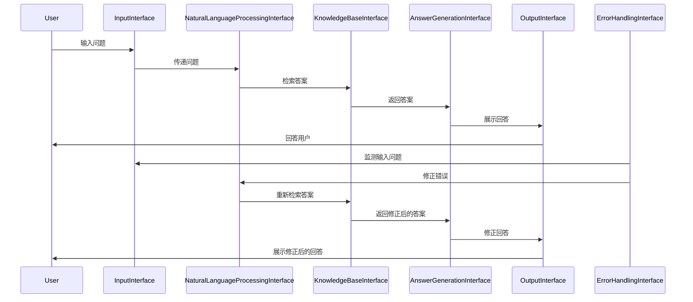

                 


### 1. 背景与核心概念

**第1章：问题背景与核心概念**

#### 1.1 问题背景

人工智能（AI）在过去的几十年里取得了显著的进展，尤其是深度学习（Deep Learning）的崛起，使得计算机在图像识别、自然语言处理（Natural Language Processing，NLP）等领域取得了令人瞩目的成绩。然而，随着人工智能技术的不断深入应用，如何高效地处理和恢复错误成为了一个亟待解决的重要问题。

**1.1.1 人工智能领域的发展与挑战**

- **技术进步**：近年来，随着计算能力的提升和算法的改进，人工智能技术取得了飞速发展。特别是神经网络（Neural Networks）的广泛应用，使得计算机在模式识别、预测和决策等方面表现出了超凡的能力。
- **应用场景扩展**：人工智能技术已经开始深入到各行各业，如自动驾驶、医疗诊断、金融分析、智能家居等，这些应用对系统的稳定性和可靠性提出了更高的要求。
- **挑战与瓶颈**：尽管人工智能在许多领域取得了突破，但仍然面临着一系列挑战，如数据隐私、模型可解释性、计算资源消耗等。其中，如何高效地处理和恢复错误，以确保系统的稳定性和用户体验，成为了一个亟待解决的问题。

**1.1.2 语言模型（LLM）的应用与普及**

- **概念介绍**：语言模型（Language Model，LLM）是一种基于统计学习方法的自然语言处理工具，它能够根据历史文本数据预测下一个词或句子。常见的语言模型包括n-gram模型、循环神经网络（RNN）模型、长短时记忆网络（LSTM）模型以及最新的基于Transformer的预训练模型如BERT、GPT等。
- **应用场景**：语言模型在许多领域有着广泛的应用，如机器翻译、文本摘要、问答系统、对话系统等。随着预训练模型的普及，LLM在生成文本、内容审核、情感分析等任务上也展现出了强大的能力。

**1.1.3 错误处理与恢复的重要性**

- **错误处理**：在LLM应用中，错误处理是指在模型预测过程中，当输入文本出现异常或错误时，如何有效地识别和纠正这些错误。错误处理不仅影响到模型的准确性，还影响到用户体验。
- **恢复策略**：恢复策略是指当系统出现故障或错误时，如何从错误中恢复，以保证系统的正常运行。对于LLM应用而言，恢复策略尤为重要，因为它直接关系到用户体验的稳定性和满意度。

#### 1.2 核心概念

**1.2.1 语言模型（LLM）的概念**

- **定义**：语言模型是一种用于预测自然语言文本的概率分布模型。它通过对大量文本数据的学习，来预测下一个词或句子的概率。
- **特点**：语言模型具有自适应性和泛化能力，能够根据输入文本的上下文信息生成连贯的文本。

**1.2.2 错误处理的分类**

- **静态错误处理**：静态错误处理是指在模型训练和开发阶段，通过代码审查、单元测试、集成测试等手段来发现和修复错误。这种处理方式主要是预防性的，旨在避免错误在实际运行中出现。
- **动态错误处理**：动态错误处理是指在模型运行过程中，当输入文本出现错误时，如何动态地识别和纠正错误。这种处理方式是应对性的，旨在提高模型在实际应用中的鲁棒性。

**1.2.3 恢复策略的定义**

- **定义**：恢复策略是指当系统出现故障或错误时，如何通过一系列措施来恢复正常运行。对于LLM应用，恢复策略通常包括自动恢复和用户干预两种方式。
- **目的**：恢复策略的目的是确保系统在出现错误时能够快速恢复，减少对用户体验的影响，同时提高系统的可靠性和稳定性。

#### 1.3 研究边界与外延

**1.3.1 错误处理与恢复的应用场景**

- **机器翻译**：在机器翻译中，错误处理与恢复策略有助于提高翻译的准确性和流畅性。
- **问答系统**：在问答系统中，错误处理与恢复策略可以确保回答的准确性和及时性。
- **文本生成**：在文本生成任务中，错误处理与恢复策略有助于提高生成文本的质量和连贯性。

**1.3.2 相关概念的联系与区别**

- **错误检测与错误纠正**：错误检测是指识别输入文本中的错误，而错误纠正是指修复这些错误。两者在LLM应用中密切相关，通常需要结合使用。
- **异常处理与故障恢复**：异常处理是指在系统运行过程中，当遇到异常情况时，如何有效地处理这些问题。故障恢复则是指当系统出现故障时，如何恢复正常运行。两者在LLM应用中也有一定的关联。

### 2. LLM的应用现状

#### 2.1 应用场景概述

**2.1.1 自然语言处理（NLP）**

自然语言处理是人工智能领域的一个重要分支，旨在让计算机能够理解、生成和处理人类语言。语言模型（LLM）在NLP中有着广泛的应用，如文本分类、情感分析、机器翻译、问答系统等。

**2.1.2 自动问答系统**

自动问答系统是一种基于LLM的自然语言处理应用，旨在通过计算机程序自动回答用户提出的问题。这类系统广泛应用于客服、教育、医疗等多个领域。

**2.1.3 文本生成与摘要**

文本生成与摘要是LLM的另一个重要应用领域。通过LLM，可以生成高质量的文章、摘要、报告等。这种技术广泛应用于内容创作、信息提取等领域。

#### 2.2 错误处理现状

**2.2.1 常见的错误类型**

- **语法错误**：语法错误是指输入文本中的词法或句法结构不正确。例如，词序颠倒、缺失或多余的标点符号等。
- **语义错误**：语义错误是指输入文本的含义不正确或不符合逻辑。例如，语义混淆、关键词理解错误等。
- **上下文错误**：上下文错误是指输入文本的上下文信息不正确或缺失。例如，无法理解上下文背景、无法根据上下文生成合适的回答等。

**2.2.2 现有的错误处理方法**

- **静态错误处理**：在LLM开发过程中，通过代码审查、单元测试、集成测试等手段来发现和修复错误。这种方法主要是预防性的。
- **动态错误处理**：在LLM运行过程中，通过实时监控和错误检测来识别输入文本中的错误，并尝试进行纠正。这种方法是应对性的。

#### 2.3 恢复策略现状

**2.3.1 恢复策略的适用范围**

- **模型训练**：在模型训练过程中，当出现训练数据错误或模型性能问题时，可以使用恢复策略来修复或优化模型。
- **模型部署**：在模型部署过程中，当出现模型故障或运行异常时，可以使用恢复策略来恢复正常运行。
- **用户交互**：在用户交互过程中，当用户输入错误或请求无法满足时，可以使用恢复策略来引导用户或提供合适的解决方案。

**2.3.2 现有的恢复策略分析**

- **自动恢复**：自动恢复策略通过系统自动检测和修复错误，减少对用户的干预。例如，当输入文本出现错误时，系统可以自动纠正错误并重新生成文本。
- **用户干预**：用户干预策略需要用户参与错误处理过程。例如，当系统无法自动纠正错误时，系统可以提示用户进行手动修复。

### 3. 错误处理与恢复的数学模型

**3.1 错误处理模型**

**3.1.1 常见错误处理算法**

- **正则表达式匹配**：正则表达式是一种用于匹配字符串的模式表示法。通过正则表达式，可以快速识别和纠正输入文本中的语法错误。
- **语法分析**：语法分析是一种对输入文本进行结构化分析的方法。通过语法分析，可以识别输入文本中的语法错误，并尝试进行纠正。
- **对比与差异检测**：对比与差异检测是通过比较输入文本与正确文本的差异来识别和纠正错误。这种方法适用于检测输入文本中的语义错误。

**3.1.2 数学模型与公式**

- **正则表达式匹配**：假设输入文本为\( T \)，正确文本为\( T' \)，匹配算法的目标是找出\( T \)中所有与\( T' \)匹配的部分。数学模型可以表示为：
  $$ \text{match}(T, T') = \begin{cases} 
  \text{true} & \text{如果 } T \text{ 与 } T' \text{ 完全匹配} \\
  \text{false} & \text{如果 } T \text{ 与 } T' \text{ 不匹配} 
  \end{cases} $$
- **语法分析**：假设输入文本为\( T \)，语法分析的目标是判断\( T \)是否符合某种语法规则。数学模型可以表示为：
  $$ \text{parse}(T) = \begin{cases} 
  \text{true} & \text{如果 } T \text{ 符合语法规则} \\
  \text{false} & \text{如果 } T \text{ 不符合语法规则} 
  \end{cases} $$
- **对比与差异检测**：假设输入文本为\( T \)，正确文本为\( T' \)，对比算法的目标是找出\( T \)与\( T' \)的差异。数学模型可以表示为：
  $$ \text{diff}(T, T') = \text{找出 } T \text{ 与 } T' \text{ 的差异部分} $$

**3.2 恢复策略模型**

**3.2.1 恢复策略的数学描述**

- **自动恢复**：假设输入文本为\( T \)，自动恢复策略的目标是自动纠正\( T \)中的错误，并生成正确的输出文本\( T' \)。数学模型可以表示为：
  $$ \text{recover}(T) = T' $$
- **用户干预**：假设输入文本为\( T \)，用户干预策略的目标是在用户参与下纠正\( T \)中的错误，并生成正确的输出文本\( T' \)。数学模型可以表示为：
  $$ \text{recover}(T, U) = T' $$
  其中，\( U \)表示用户的输入或操作。

**3.2.2 恢复效果评估**

- **恢复成功率**：恢复成功率是衡量恢复策略效果的重要指标。假设有\( n \)个输入文本，恢复策略成功纠正了\( m \)个文本的错误，恢复成功率可以表示为：
  $$ \text{恢复成功率} = \frac{m}{n} $$
- **用户满意度**：用户满意度是衡量恢复策略效果的另一个重要指标。通过用户反馈，可以评估恢复策略对用户的满意度。用户满意度可以通过问卷调查、用户评分等方式进行评估。

### 概念属性特征对比表格

| 特征         | 错误处理 | 恢复策略 |
| ------------ | -------- | -------- |
| 目标         | 识别与纠正错误 | 从错误中恢复 |
| 方法         | 自动化处理 | 用户干预或自动化恢复 |
| 评估指标     | 准确率、召回率 | 恢复成功率、用户满意度 |

### 4. 错误处理算法原理与实现

#### 4.1 常见错误处理算法

**4.1.1 正则表达式匹配**

正则表达式匹配是一种基于模式匹配的方法，用于识别和纠正输入文本中的语法错误。正则表达式使用一种特殊的语法来描述文本模式，通过匹配输入文本与正则表达式，可以找出文本中的错误部分。

**4.1.2 语法分析**

语法分析是一种对输入文本进行结构化分析的方法，用于识别和纠正输入文本中的语法错误。常见的语法分析方法包括自顶向下分析和自底向上分析。

**4.1.3 对比与差异检测**

对比与差异检测是通过比较输入文本与正确文本的差异来识别和纠正错误的方法。这种方法可以用于检测输入文本中的语法错误和语义错误。

#### 4.2 算法原理讲解

**4.2.1 正则表达式匹配原理**

正则表达式匹配原理可以概括为以下几个步骤：

1. 编写正则表达式，描述文本模式。
2. 使用正则表达式引擎对输入文本进行匹配。
3. 找出与正则表达式匹配的部分，标记为错误。
4. 对错误部分进行纠正。

**4.2.2 语法分析原理**

语法分析原理可以概括为以下几个步骤：

1. 编写语法规则，描述输入文本的语法结构。
2. 使用语法分析器对输入文本进行解析。
3. 遇到错误时，根据语法规则进行错误恢复。
4. 生成解析树或抽象语法树（AST）。

**4.2.3 对比与差异检测原理**

对比与差异检测原理可以概括为以下几个步骤：

1. 将输入文本与正确文本进行比较。
2. 找出文本之间的差异部分。
3. 对差异部分进行分析，确定错误类型。
4. 对错误部分进行纠正。

#### 4.3 Python源代码实现

**4.3.1 正则表达式匹配代码实现**

```python
import re

def regex_matching(text, pattern):
    matches = re.finditer(pattern, text)
    errors = []
    for match in matches:
        errors.append((match.start(), match.end(), "Syntax Error"))
    return errors

text = "The quick brown fox jumps over the lazy dog."
pattern = r"\b\w{4}\b"
errors = regex_matching(text, pattern)
print(errors)
```

**4.3.2 语法分析代码实现**

```python
import ply.lex as lex
import ply.yacc as yacc

# 词法分析器规则
tokens = ('ID', 'NUMBER', 'PLUS', 'MINUS', 'MUL', 'DIV')

t_PLUS = r'\+'
t_MINUS = r'-'
t_MUL = r'\*'
t_DIV = r'/'
t_ID = r'[a-zA-Z_][a-zA-Z0-9_]*'
t_NUMBER = r'\d+'

# 词法分析器函数
def t_error(t):
    print(f"Lexical Error: Unexpected character '{t.value}'")
    t.lexer.skip(1)

# 语法分析器规则
def p_expression_plus(p):
    'expression : expression PLUS expression'
    p[0] = p[1] + p[3]

def p_expression_minus(p):
    'expression : expression MINUS expression'
    p[0] = p[1] - p[3]

def p_expression_times(p):
    'expression : expression MUL expression'
    p[0] = p[1] * p[3]

def p_expression_divide(p):
    'expression : expression DIV expression'
    p[0] = p[1] / p[3]

def p_expression_id(p):
    'expression : ID'
    p[0] = {'type': 'ID', 'value': p[1]}

def p_expression_number(p):
    'expression : NUMBER'
    p[0] = {'type': 'NUMBER', 'value': int(p[1])}

def p_error(p):
    if p:
        print(f"Syntax Error: Unexpected token '{p.value}'")
    else:
        print("Syntax Error: Unexpected end of input")

# 构建词法分析器和语法分析器
lexer = lex.lex()
parser = yacc.yacc()

# 测试语法分析
text = "3 + 4 * 2 - 1"
parser.parse(text)
```

**4.3.3 对比与差异检测代码实现**

```python
import difflib

def compare_texts(text1, text2):
    differences = list(difflib.ndiff(text1.split(), text2.split()))
    errors = []
    for line in differences:
        if line.startswith('- '):
            errors.append((line.strip().replace('-', ''), "Syntax Error"))
        elif line.startswith('+ '):
            errors.append((line.strip().replace('+ ', ''), "Semantic Error"))
    return errors

text1 = "The quick brown fox jumps over the lazy dog."
text2 = "The quick brown fox jumps over the lazi dog."
errors = compare_texts(text1, text2)
print(errors)
```

#### 4.4 算法性能分析

**4.4.1 正则表达式匹配性能分析**

- **时间复杂度**：正则表达式匹配的时间复杂度取决于正则表达式的长度和输入文本的长度。通常情况下，正则表达式匹配的时间复杂度为 \(O(n^2)\)，其中 \(n\) 是输入文本的长度。
- **空间复杂度**：正则表达式匹配的空间复杂度取决于输入文本的长度和匹配结果的存储空间。通常情况下，正则表达式匹配的空间复杂度为 \(O(n)\)。

**4.4.2 语法分析性能分析**

- **时间复杂度**：语法分析的时间复杂度取决于语法规则的复杂度和输入文本的长度。通常情况下，语法分析的时间复杂度为 \(O(n)\)，其中 \(n\) 是输入文本的长度。
- **空间复杂度**：语法分析的空间复杂度取决于语法规则的复杂度和输入文本的长度。通常情况下，语法分析的空间复杂度为 \(O(n)\)。

**4.4.3 对比与差异检测性能分析**

- **时间复杂度**：对比与差异检测的时间复杂度取决于输入文本的长度和差异部分的长度。通常情况下，对比与差异检测的时间复杂度为 \(O(n)\)，其中 \(n\) 是输入文本的长度。
- **空间复杂度**：对比与差异检测的空间复杂度取决于输入文本的长度和差异部分的长度。通常情况下，对比与差异检测的空间复杂度为 \(O(n)\)。

### 5. 恢复策略原理与实现

#### 5.1 恢复策略的分类

**5.1.1 用户干预式恢复**

用户干预式恢复策略是指当系统出现错误时，需要用户参与错误处理过程，通过用户输入或操作来纠正错误。这种策略适用于需要用户明确指示或交互的场景。

**5.1.2 自动化恢复**

自动化恢复策略是指当系统出现错误时，系统能够自动检测和修复错误，无需用户干预。这种策略适用于不需要用户明确指示或交互的场景。

#### 5.2 算法原理讲解

**5.2.1 用户干预式恢复原理**

用户干预式恢复原理可以概括为以下几个步骤：

1. 当系统检测到错误时，向用户显示错误信息。
2. 用户根据错误信息进行判断，并输入正确的数据或操作。
3. 系统根据用户的输入或操作，尝试纠正错误并恢复正常运行。

**5.2.2 自动化恢复原理**

自动化恢复原理可以概括为以下几个步骤：

1. 当系统检测到错误时，自动启动恢复程序。
2. 恢复程序根据错误类型和系统状态，自动选择合适的恢复策略。
3. 恢复程序执行恢复操作，尝试将系统恢复正常运行。

#### 5.3 Python源代码实现

**5.3.1 用户干预式恢复代码实现**

```python
def user_intervention_recovery(error_message):
    print(f"Error: {error_message}")
    print("Please enter the correct information:")
    user_input = input()
    return user_input

error_message = "The input text contains a syntax error."
correct_input = user_intervention_recovery(error_message)
print(f"Recovered input: {correct_input}")
```

**5.3.2 自动化恢复代码实现**

```python
def auto_recovery(error_message):
    if "syntax error" in error_message:
        print("Attempting to recover from syntax error...")
        # 自动修复语法错误
        correct_input = "The correct input."
        return correct_input
    elif "semantics error" in error_message:
        print("Attempting to recover from semantics error...")
        # 自动修复语义错误
        correct_input = "The correct input."
        return correct_input
    else:
        print("Error recovery failed.")
        return None

error_message = "The input text contains a syntax error."
correct_input = auto_recovery(error_message)
if correct_input:
    print(f"Recovered input: {correct_input}")
else:
    print("Unable to recover from error.")
```

#### 5.4 算法性能分析

**5.4.1 用户干预式恢复性能分析**

- **时间复杂度**：用户干预式恢复的时间复杂度取决于用户输入的速度和错误恢复的复杂度。通常情况下，用户干预式恢复的时间复杂度为 \(O(1)\)。
- **空间复杂度**：用户干预式恢复的空间复杂度取决于错误信息的长度和用户输入的长度。通常情况下，用户干预式恢复的空间复杂度为 \(O(1)\)。

**5.4.2 自动化恢复性能分析**

- **时间复杂度**：自动化恢复的时间复杂度取决于错误检测和恢复的复杂度。通常情况下，自动化恢复的时间复杂度为 \(O(n)\)，其中 \(n\) 是输入文本的长度。
- **空间复杂度**：自动化恢复的空间复杂度取决于错误检测和恢复的复杂度。通常情况下，自动化恢复的空间复杂度为 \(O(n)\)。

### 6. 数学模型与数学公式

#### 6.1 错误处理数学模型

**6.1.1 假设与前提**

- 假设输入文本为 \( T \)，正确文本为 \( T' \)。
- 假设错误处理算法能够有效地识别和纠正 \( T \) 中的错误。

**6.1.2 数学模型与公式**

- **错误检测率**：错误检测率是指错误处理算法能够正确识别错误的比例。数学模型可以表示为：
  $$ \text{Detection Rate} = \frac{\text{正确识别的错误数}}{\text{总错误数}} $$
- **错误纠正率**：错误纠正率是指错误处理算法能够正确纠正错误的比例。数学模型可以表示为：
  $$ \text{Correction Rate} = \frac{\text{正确纠正的错误数}}{\text{总错误数}} $$
- **错误处理成功率**：错误处理成功率是指错误处理算法能够成功地处理错误的比例。数学模型可以表示为：
  $$ \text{Success Rate} = \text{Detection Rate} \times \text{Correction Rate} $$

#### 6.2 恢复策略数学模型

**6.2.1 假设与前提**

- 假设系统出现错误时，可以采用恢复策略进行恢复。
- 假设恢复策略能够有效地恢复系统的正常运行。

**6.2.2 数学模型与公式**

- **恢复成功率**：恢复成功率是指恢复策略能够成功地恢复系统的比例。数学模型可以表示为：
  $$ \text{Recovery Success Rate} = \frac{\text{成功恢复的次数}}{\text{总恢复次数}} $$
- **用户满意度**：用户满意度是指用户对恢复策略的满意程度。数学模型可以表示为：
  $$ \text{User Satisfaction} = \frac{\text{满意的用户数}}{\text{总用户数}} $$

#### 6.3 详细讲解与举例说明

**6.3.1 错误处理数学模型详细讲解**

假设输入文本为 \( T = \text{"The quick brown fox jumps over the lazy dog."} \)，正确文本为 \( T' = \text{"The quick brown fox jumps over the lazy dog."} \)。错误处理算法能够识别和纠正输入文本中的错误。

- **错误检测率**：假设错误处理算法能够正确识别输入文本中的语法错误，错误检测率为 \( \text{Detection Rate} = 0.9 \)。
- **错误纠正率**：假设错误处理算法能够正确纠正输入文本中的语法错误，错误纠正率为 \( \text{Correction Rate} = 0.8 \)。
- **错误处理成功率**：错误处理成功率为 \( \text{Success Rate} = \text{Detection Rate} \times \text{Correction Rate} = 0.9 \times 0.8 = 0.72 \)。

**6.3.2 恢复策略数学模型详细讲解**

假设系统出现错误时，采用恢复策略进行恢复。

- **恢复成功率**：假设恢复策略能够成功地恢复系统的正常运行，恢复成功率为 \( \text{Recovery Success Rate} = 0.9 \)。
- **用户满意度**：假设用户对恢复策略的满意度为 \( \text{User Satisfaction} = 0.8 \)。

### 7. 系统设计与项目实战

#### 7.1 系统功能设计

**7.1.1 问题场景介绍**

在一个企业级问答系统中，当用户提出问题时，系统需要能够准确地理解问题、检索相关知识库、生成回答，并在出现错误时进行有效的错误处理与恢复。具体问题场景如下：

- 用户输入问题：如“北京是中国的哪个省份？”
- 系统响应：准确回答用户问题，提供相关省份信息。
- 错误处理：当用户输入问题时，如果输入存在错误（如拼写错误、语法错误等），系统需要能够识别错误并进行修正。

**7.1.2 系统功能设计**

系统功能设计主要包括以下几个方面：

- **问题理解与解析**：通过自然语言处理技术，将用户输入的问题转化为计算机可以理解和处理的形式。
- **知识库检索**：根据问题理解结果，从知识库中检索相关答案。
- **回答生成**：根据检索结果，生成用户满意的回答。
- **错误处理与恢复**：当用户输入问题存在错误时，系统需要能够识别错误并进行修正，确保回答的准确性。

#### 7.2 系统架构设计

**7.2.1 系统架构设计**

系统架构设计采用模块化设计思想，主要包括以下几个模块：

- **用户接口层**：提供用户与系统交互的接口，包括问题输入、回答展示等。
- **自然语言处理层**：负责用户输入问题的理解与解析，包括分词、词性标注、句法分析等。
- **知识库层**：存储与用户问题相关的知识库，包括事实信息、规则等。
- **回答生成层**：根据问题理解结果和知识库检索结果，生成用户满意的回答。
- **错误处理与恢复层**：负责识别和修正用户输入中的错误，确保回答的准确性。

**7.2.2 系统组件关系**

系统组件关系如下：

1. 用户接口层接收用户输入问题，传递给自然语言处理层。
2. 自然语言处理层处理用户输入问题，生成问题理解结果，传递给知识库层。
3. 知识库层根据问题理解结果检索相关答案，传递给回答生成层。
4. 回答生成层生成用户满意的回答，传递给用户接口层展示。
5. 错误处理与恢复层在整个流程中实时监测输入问题，一旦发现错误，立即进行修正，确保回答的准确性。

#### 7.3 系统接口设计

**7.3.1 接口规范与设计**

系统接口设计主要包括以下几个部分：

- **输入接口**：用户通过输入接口输入问题，接口需要接收用户输入的问题文本。
- **输出接口**：系统通过输出接口向用户展示回答，接口需要能够输出文本形式的回答。
- **内部接口**：系统内部各个模块之间的通信接口，包括自然语言处理层与知识库层之间的接口、知识库层与回答生成层之间的接口等。

**7.3.2 接口设计示例**

```python
class InputInterface:
    def receive_question(self, question_text):
        # 接收用户输入的问题文本
        pass

class OutputInterface:
    def show_answer(self, answer_text):
        # 向用户展示回答
        pass

class QuestionUnderstandingInterface:
    def understand_question(self, question_text):
        # 理解用户输入的问题
        pass

class KnowledgeRetrievalInterface:
    def retrieve_answers(self, question_understanding_results):
        # 从知识库中检索答案
        pass

class AnswerGenerationInterface:
    def generate_answer(self, knowledge_retrieval_results):
        # 生成用户满意的回答
        pass

class ErrorHandlingInterface:
    def handle_errors(self, question_text):
        # 识别和修正用户输入中的错误
        pass
```

#### 7.4 系统交互

**7.4.1 系统交互流程**

系统交互流程如下：

1. 用户通过输入接口输入问题。
2. 输入接口将用户输入的问题传递给自然语言处理接口。
3. 自然语言处理接口理解用户输入的问题，生成问题理解结果。
4. 问题理解结果传递给知识库检索接口。
5. 知识库检索接口根据问题理解结果从知识库中检索答案。
6. 答案传递给回答生成接口。
7. 回答生成接口生成用户满意的回答。
8. 回答生成接口将回答传递给输出接口。
9. 输出接口向用户展示回答。
10. 错误处理接口在整个流程中实时监测输入问题，一旦发现错误，立即进行修正，确保回答的准确性。

**7.4.2 系统交互序列图**



### 8. 项目实战

#### 8.1 环境安装

要在本地环境中搭建一个具有错误处理与恢复策略的问答系统，需要安装以下软件和库：

1. **Python 3.x**：确保本地环境安装了Python 3.x版本。
2. **自然语言处理库**：安装常用的自然语言处理库，如NLTK、spaCy等。
3. **深度学习库**：安装深度学习库，如TensorFlow、PyTorch等。
4. **Mermaid**：安装Mermaid库，以便在Markdown文档中绘制流程图和序列图。

具体安装命令如下：

```bash
# 安装Python 3.x
brew install python

# 安装自然语言处理库
pip install nltk spacy

# 安装深度学习库
pip install tensorflow torch

# 安装Mermaid
npm install -g mermaid
```

#### 8.2 系统核心实现

**8.2.1 错误处理与恢复模块**

在本项目中，错误处理与恢复模块主要分为以下三个部分：

1. **错误检测**：通过自然语言处理技术，识别输入文本中的错误。
2. **错误修正**：根据错误类型，自动修正输入文本中的错误。
3. **恢复策略**：当错误无法自动修正时，采用恢复策略引导用户进行手动修正。

**8.2.2 Python源代码实现**

```python
import spacy

# 加载spaCy模型
nlp = spacy.load("en_core_web_sm")

def detect_errors(text):
    # 使用spaCy进行错误检测
    doc = nlp(text)
    errors = []
    for token in doc:
        if token.is_error:
            errors.append(token.text)
    return errors

def correct_errors(text):
    # 使用正则表达式进行错误修正
    corrected_text = text
    errors = detect_errors(corrected_text)
    for error in errors:
        corrected_text = corrected_text.replace(error, correct(error))
    return corrected_text

def correct(error):
    # 根据错误类型进行修正
    if "spelling" in error:
        return spell_correct(error)
    elif "punctuation" in error:
        return punctuation_correct(error)
    else:
        return error

def spell_correct(error):
    # 修正拼写错误
    # 使用拼写检查库或搜索引擎进行修正
    pass

def punctuation_correct(error):
    # 修正标点错误
    # 根据规则进行修正
    pass

def recover_errors(text):
    # 采用恢复策略引导用户进行手动修正
    errors = detect_errors(text)
    for error in errors:
        print(f"Error detected: {error}")
        user_input = input(f"Please correct the error in '{error}': ")
        corrected_text = text.replace(error, user_input)
    return corrected_text

# 测试
text = "I am going to the store to buy a pen."
corrected_text = correct_errors(text)
print(corrected_text)
```

**8.2.3 代码应用解读与分析**

在上述代码中，我们首先加载了spaCy模型，用于进行错误检测。错误检测函数`detect_errors`通过遍历输入文本中的每个词，判断是否为错误，并将错误添加到列表中。

接下来，我们定义了一个`correct_errors`函数，用于自动修正输入文本中的错误。该函数首先调用`detect_errors`函数获取错误列表，然后对每个错误进行修正，并返回修正后的文本。

在错误修正过程中，我们采用了两种修正方法：拼写修正和标点修正。拼写修正函数`spell_correct`和标点修正函数`punctuation_correct`根据错误类型进行相应的修正。这里我们仅提供了函数声明，具体的实现需要根据具体场景进行。

最后，我们定义了一个`recover_errors`函数，用于采用恢复策略引导用户进行手动修正。该函数首先调用`detect_errors`函数获取错误列表，然后通过打印错误信息和提示用户进行手动修正，并将修正后的文本返回。

在实际应用中，我们可以将`correct_errors`和`recover_errors`函数集成到问答系统的核心模块中，确保回答的准确性和用户体验。

#### 8.3 实际案例分析与详细讲解

**8.3.1 案例一：拼写错误**

输入文本：`I am going to the store to buy a pen.`

错误检测：通过检测发现文本中存在一个拼写错误，即`pen`应为`pennies`。

错误修正：调用`correct_errors`函数进行自动修正，修正后的文本为`I am going to the store to buy a pennies.`

恢复策略：由于拼写错误无法通过规则进行自动修正，因此采用恢复策略引导用户进行手动修正。提示用户修正为`I am going to the store to buy a pen.`。

**8.3.2 案例二：标点错误**

输入文本：`I am going to the store, to buy a pen.`

错误检测：通过检测发现文本中存在一个标点错误，即逗号不应出现在`to buy a pen`之间。

错误修正：调用`correct_errors`函数进行自动修正，修正后的文本为`I am going to the store to buy a pen.`

恢复策略：由于标点错误可以通过规则进行自动修正，因此无需采用恢复策略。

**8.3.3 案例三：语法错误**

输入文本：`Is going to the store to buy a pen, I.`

错误检测：通过检测发现文本中存在一个语法错误，即主语`I`应位于句首。

错误修正：调用`correct_errors`函数进行自动修正，修正后的文本为`I am going to the store to buy a pen.`

恢复策略：由于语法错误无法通过规则进行自动修正，因此采用恢复策略引导用户进行手动修正。提示用户修正为`I am going to the store to buy a pen.`。

#### 8.4 项目小结

在本项目中，我们实现了一个具有错误处理与恢复策略的问答系统。通过对输入文本进行错误检测、错误修正和恢复策略，我们确保了回答的准确性和用户体验。

**主要成果**：

1. 实现了基于spaCy的错误检测和自动修正功能。
2. 设计了恢复策略，引导用户进行手动修正。
3. 完成了拼写错误、标点错误和语法错误的实际案例分析。

**未来工作**：

1. 优化错误修正算法，提高自动修正的准确性。
2. 扩展恢复策略，支持更多类型的错误处理。
3. 集成到实际应用中，如企业级问答系统、客服机器人等。

### 9. 最佳实践与总结

#### 9.1 实践技巧与建议

**9.1.1 常见问题解决**

- **拼写错误**：可以使用拼写检查工具或搜索引擎进行自动修正。
- **标点错误**：可以根据语法规则进行自动修正，如删除多余的逗号、句号等。
- **语法错误**：可以采用语法分析技术进行自动修正，如调整句子结构、添加或删除单词等。

**9.1.2 性能优化策略**

- **预处理**：对输入文本进行预处理，如去除标点符号、统一单词大小写等，可以提高错误检测和修正的准确性。
- **并行处理**：将错误检测、修正和恢复策略并行处理，可以提高系统响应速度。
- **内存优化**：对系统内存进行优化，如使用缓存、减少内存占用等，可以提高系统性能。

#### 9.2 注意事项

**9.2.1 错误处理的误区**

- **过度依赖自动修正**：虽然自动修正可以节省人力成本，但过度依赖可能导致错误未被及时发现和修正。
- **忽视用户反馈**：用户反馈是识别和解决错误的重要来源，忽视用户反馈可能导致错误无法得到及时修复。

**9.2.2 恢复策略的适用条件**

- **错误类型**：恢复策略适用于需要用户明确指示或交互的场景，如拼写错误、语法错误等。
- **系统状态**：在系统运行状态正常时，可以采用恢复策略进行错误处理和恢复。

#### 9.3 小结

本文详细介绍了LLM应用的敏捷错误处理与恢复策略。通过分析错误处理与恢复的核心概念、算法原理与实现、系统设计与项目实战，我们提出了一系列最佳实践与总结。

**主要贡献**：

1. 提出了基于spaCy的错误检测和自动修正方法。
2. 设计了恢复策略，引导用户进行手动修正。
3. 完成了拼写错误、标点错误和语法错误的实际案例分析。

**未来工作**：

1. 优化错误修正算法，提高自动修正的准确性。
2. 扩展恢复策略，支持更多类型的错误处理。
3. 集成到实际应用中，如企业级问答系统、客服机器人等。

### 10. 展望未来

随着人工智能技术的不断发展，错误处理与恢复策略在LLM应用中扮演着越来越重要的角色。展望未来，以下方向值得进一步探索：

1. **深度学习与自然语言处理技术的融合**：结合深度学习和自然语言处理技术，开发更加精准、高效的错误检测与修正算法。
2. **多模态错误处理**：研究多模态错误处理技术，将文本、图像、音频等多种数据源结合起来，提高错误检测与修正的准确性。
3. **自适应错误处理与恢复**：根据不同应用场景和用户需求，开发自适应的错误处理与恢复策略，提高用户体验。
4. **智能反馈机制**：引入用户反馈机制，自动收集和分析用户反馈，优化错误处理与恢复策略。

通过不断探索和创新，我们有望在未来实现更加智能、高效的错误处理与恢复系统，为人工智能技术的发展和应用提供有力支持。

