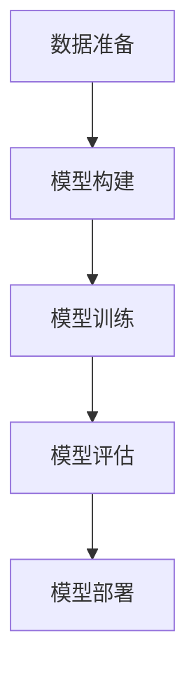
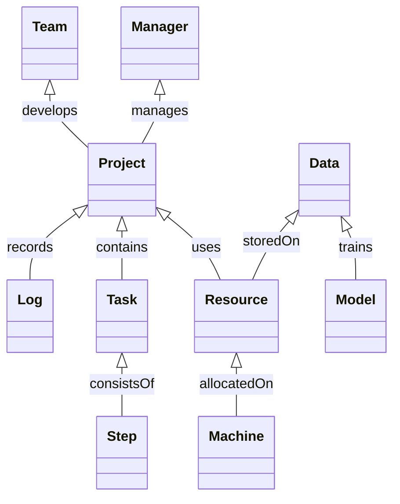
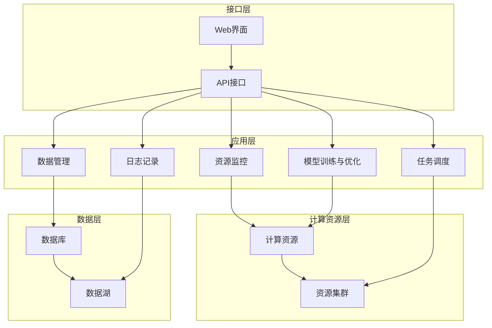
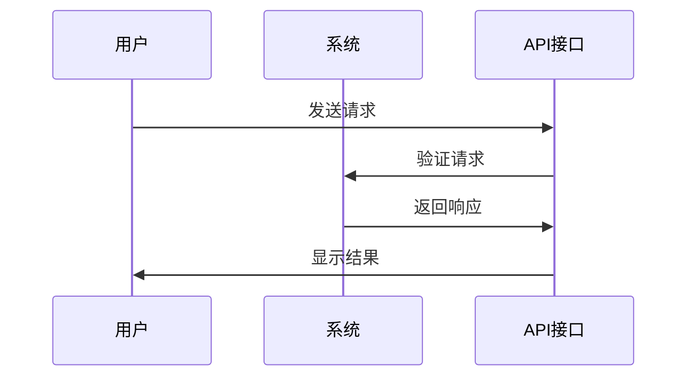

                 

### 第1章：软件2.0与AI大模型概述

#### 1.1.1 软件1.0与软件2.0的演进

软件1.0时代，也被称为个人电脑时代，其主要特点是以个人用户为中心，软件的形态主要是基于命令行或简单的图形用户界面，功能相对单一，注重软件的功能实现。而随着互联网的普及和商业活动的日益复杂，软件1.0逐渐无法满足企业对于高效、智能、自动化的需求。于是，软件2.0应运而生。

软件2.0时代，其核心在于软件的智能化和数据驱动。软件不再仅仅是一个工具，更是一个连接用户、数据和智能算法的桥梁。在这个时代，软件的功能不再局限于执行预先设定的任务，而是能够根据用户行为、环境变化、数据输入等动态调整自身的行为和功能。AI大模型作为软件2.0的核心组件，极大地提升了软件的智能水平和自动化程度。

#### 1.1.2 AI大模型在软件2.0中的核心地位

AI大模型在软件2.0中扮演着至关重要的角色。首先，它赋予了软件以人工智能的能力，使得软件能够自主学习和优化，实现自动化决策和操作。其次，AI大模型能够处理和分析大量数据，从中提取有价值的信息和模式，为企业和用户提供洞察和决策支持。

与传统AI技术相比，AI大模型具有以下几个独特优势：

1. **数据处理能力更强**：传统AI技术通常只能处理少量数据，而AI大模型能够处理和分析大规模、多维度的数据集。
2. **泛化能力更优**：AI大模型通过大量的数据训练，能够更好地适应不同的任务和场景，具备更强的泛化能力。
3. **学习能力更强**：AI大模型能够通过自我学习和优化，不断提升其性能和效果，而传统AI技术往往需要手动调整参数。
4. **集成度更高**：AI大模型通常与其他软件组件深度融合，使得软件的整体智能化程度更高。

#### 1.1.3 企业级应用开发的新范式

AI大模型的出现，使得企业级应用开发进入了一个全新的时代。传统的软件开发模式强调预定义的功能和流程，而AI大模型则强调灵活性和动态调整。企业级应用开发的新范式主要体现在以下几个方面：

1. **以用户为中心**：AI大模型能够根据用户行为和需求，动态调整软件的功能和界面，提供个性化的服务。
2. **数据驱动**：AI大模型依赖于大量数据进行训练和优化，数据成为软件开发的重要驱动力。
3. **持续集成和持续部署**：AI大模型需要不断更新和优化，企业需要建立高效的集成和部署流程，以快速响应市场变化。
4. **灵活的架构**：为了支持AI大模型的训练和部署，企业需要采用更加灵活和可扩展的架构设计。

总之，AI大模型作为软件2.0的核心组件，正在引领企业级应用开发的变革。企业需要抓住这一机遇，积极拥抱AI大模型，以实现业务的智能化和自动化。### 1.2 AI大模型的定义与特点

#### 1.2.1 AI大模型的定义

AI大模型（Large-scale AI Model），通常指的是那些参数量在数十亿甚至千亿级别的人工神经网络模型。这些模型通过深度学习算法，对大规模数据集进行训练，以实现高度复杂的数据分析和预测任务。AI大模型的出现，标志着人工智能技术的又一次飞跃，使得计算机在处理和理解人类语言、图像、音频等复杂信息方面取得了显著进展。

#### 1.2.2 AI大模型的核心特点

AI大模型具有以下几个核心特点：

1. **参数量巨大**：AI大模型的参数量通常在数十亿到千亿级别，这使得它们能够捕捉到数据中的细微模式和特征。
2. **训练数据规模庞大**：AI大模型通常依赖于大规模的数据集进行训练，这些数据集可能包括互联网上的文本、图像、语音等多种类型的数据。
3. **高度非线性**：AI大模型的结构高度非线性，能够处理和预测复杂的关系和模式。
4. **强大的泛化能力**：通过在大量数据上的训练，AI大模型能够具备较强的泛化能力，能够适应不同的应用场景和任务。
5. **动态性**：AI大模型能够通过自我学习和优化，动态调整其结构和参数，以适应不断变化的数据和环境。

#### 1.2.3 AI大模型与传统AI的区别

AI大模型与传统AI技术（如规则基系统、决策树、支持向量机等）有显著的区别，主要体现在以下几个方面：

1. **数据处理能力**：传统AI技术通常只能处理小规模数据，而AI大模型能够处理和分析大规模、多维度的数据集。
2. **复杂度**：传统AI技术通常处理的是相对简单的问题，而AI大模型能够处理更加复杂和高度非线性的问题。
3. **学习和适应能力**：传统AI技术通常需要手动调整参数和规则，而AI大模型能够通过自我学习和优化，自动调整其结构和参数。
4. **应用范围**：传统AI技术通常应用于特定领域和任务，而AI大模型具有更广泛的适用性，能够应用于各种领域和任务。
5. **集成度**：传统AI技术通常作为独立组件使用，而AI大模型通常与其他软件组件深度融合，使得整个系统的智能化程度更高。

总之，AI大模型作为人工智能领域的一项重要技术，不仅提升了计算机处理和理解复杂信息的能力，也为企业级应用带来了全新的机遇和挑战。### 1.3 AI大模型在企业中的应用前景

#### 1.3.1 AI大模型的潜在应用领域

AI大模型在企业中的潜在应用领域非常广泛，几乎涵盖了企业运营和决策的各个层面。以下是一些主要的潜在应用领域：

1. **客户关系管理（CRM）**：AI大模型可以分析客户的购买行为、偏好和反馈，帮助企业实现更精准的营销、客户服务和个性化推荐。
2. **供应链管理**：通过分析供应链数据，AI大模型可以帮助企业优化库存管理、物流调度和需求预测，提高供应链的整体效率。
3. **风险管理**：AI大模型可以分析大量的历史数据，识别潜在的金融风险和市场波动，帮助金融机构和企业制定更加科学的决策。
4. **人力资源**：AI大模型可以用于员工招聘、绩效评估和职业发展规划，通过分析员工的行为和表现，为企业提供更有效的管理建议。
5. **产品研发**：AI大模型可以帮助企业分析市场趋势、消费者需求，提供产品创新和优化的方向。
6. **智能客服**：基于AI大模型的智能客服系统可以理解客户的意图，提供实时、个性化的解答和服务，提高客户满意度。
7. **金融科技**：AI大模型在金融科技领域具有广泛的应用，如信用评估、投资决策、智能投顾等。

#### 1.3.2 企业采用AI大模型的优势

企业采用AI大模型具有多方面的优势：

1. **提高效率**：AI大模型能够自动化大量的数据处理和分析任务，减少人工干预，提高工作效率。
2. **降低成本**：通过优化运营和决策流程，AI大模型可以帮助企业降低运营成本和资源浪费。
3. **提升决策质量**：AI大模型能够处理和分析大量数据，提供更为准确和全面的决策支持。
4. **增强竞争力**：通过智能化和自动化，企业可以更好地适应市场变化，提高竞争力。
5. **提升客户满意度**：AI大模型可以提供个性化的产品和服务，提高客户体验和满意度。

#### 1.3.3 AI大模型应用的挑战与机遇

尽管AI大模型在企业中的应用前景广阔，但也面临一系列挑战和机遇：

1. **数据质量**：AI大模型的效果高度依赖于数据的质量和完整性，企业需要建立高效的数据采集、处理和管理机制。
2. **模型解释性**：AI大模型通常被认为是“黑箱”，难以解释其决策过程，这可能会影响企业的决策透明度和信任度。
3. **算法公平性**：AI大模型可能会在数据集中引入偏差，导致不公平的决策结果，企业需要确保算法的公平性和合规性。
4. **技术复杂性**：AI大模型的技术实现和维护相对复杂，企业需要具备相应的技术能力和资源。
5. **安全性**：随着AI大模型在企业中的广泛应用，其安全性和隐私保护成为关键问题，企业需要建立相应的安全防护措施。

总之，企业采用AI大模型不仅需要看到其带来的机遇，也要积极应对潜在的挑战，以确保AI大模型能够为企业带来持续的价值和竞争优势。### 1.2 关键术语解析

在本文中，我们将使用一系列关键术语来描述AI大模型在敏捷项目组合管理中的应用。以下是对这些术语的精确定义和解释：

#### 1.2.1 敏捷项目组合管理

敏捷项目组合管理（Agile Portfolio Management）是一种管理多个项目的策略，旨在快速响应市场变化，优化资源分配，并确保项目组合中的项目能够按时交付并实现预期价值。它结合了敏捷开发的原则和传统的项目组合管理方法，强调灵活性和适应性。

#### 1.2.2 LLM应用

LLM应用（Large Language Model Applications）指的是利用大型语言模型（如GPT-3、BERT等）构建的应用程序。这些模型能够理解和生成自然语言，广泛应用于自然语言处理（NLP）任务，如文本分类、情感分析、机器翻译、问答系统等。

#### 1.2.3 项目优先级与资源分配

项目优先级与资源分配（Project Prioritization and Resource Allocation）是指在多个项目之间合理分配资源，确保关键项目得到优先处理。在敏捷项目组合管理中，项目优先级通常基于业务价值、市场机遇、技术复杂度和风险等因素来确定。

#### 1.2.4 项目进度与风险管理

项目进度与风险管理（Project Progress and Risk Management）是指在项目执行过程中监控项目进度，识别潜在风险，并采取相应的措施来降低风险的影响。敏捷项目组合管理强调实时监控和快速调整，以确保项目能够按时交付并达到预期目标。

#### 1.2.5 数据集与模型训练

数据集与模型训练（Dataset and Model Training）是指收集和准备训练数据，以及使用这些数据进行模型训练的过程。AI大模型的效果高度依赖于数据的质量和多样性，因此数据集的构建和管理是关键步骤。

#### 1.2.6 模型部署与维护

模型部署与维护（Model Deployment and Maintenance）是指将训练好的模型部署到生产环境中，并提供持续的支持和维护。模型的部署涉及模型优化、性能调优、安全性保障等多方面工作，以确保模型能够稳定运行并持续提供价值。

通过以上关键术语的精确定义和解释，我们可以更好地理解AI大模型在敏捷项目组合管理中的应用场景和实践方法。### 1.2 概念属性特征对比表格

为了更好地理解AI大模型在不同应用领域的属性特征，我们可以创建一个对比表格。以下是几个常见的AI大模型应用领域以及其相关特征：

| 应用领域       | 参数量（亿） | 数据集规模（TB） | 泛化能力 | 解释性 | 集成度 |
|----------------|--------------|------------------|----------|--------|--------|
| 自然语言处理   | 10-100       | 10-1000          | 高       | 低     | 高     |
| 图像识别       | 10-100       | 10-1000          | 中       | 低     | 中     |
| 语音识别       | 10-100       | 1-100            | 中       | 低     | 中     |
| 金融市场预测   | 10-100       | 1-100            | 中       | 低     | 低     |
| 医疗诊断       | 10-100       | 1-100            | 中       | 低     | 低     |
| 供应链优化     | 10-100       | 1-100            | 中       | 低     | 中     |

#### 自然语言处理

自然语言处理（NLP）领域的AI大模型通常具有较大的参数量和数据集规模，这使得它们能够生成高质量的自然语言文本。由于NLP任务通常涉及复杂的语义理解和生成，因此这些模型的泛化能力较高。然而，NLP模型的解释性通常较低，因为它们被视为“黑箱”。集成度方面，NLP模型通常与其他NLP工具和框架紧密集成。

#### 图像识别

图像识别领域的AI大模型通常具有中等规模的参数量和数据集规模。由于图像数据的复杂性，这些模型的泛化能力也相对较高。然而，与自然语言处理模型相比，图像识别模型的解释性较低。在集成度方面，图像识别模型通常需要与其他计算机视觉工具和框架结合使用。

#### 语音识别

语音识别领域的AI大模型具有较小的参数量和数据集规模，因为语音数据相对较为简单。然而，这些模型的泛化能力较高，能够适应不同的语音环境和语音风格。与自然语言处理和图像识别模型相比，语音识别模型的解释性较低。在集成度方面，语音识别模型通常需要与其他音频处理工具和框架结合使用。

#### 金融市场预测

金融市场预测领域的AI大模型通常具有较小的参数量和数据集规模，因为金融数据相对较为复杂，但数据量通常较小。这些模型的泛化能力相对较低，因为金融市场变化多端，难以准确预测。解释性方面，金融市场预测模型通常较低。在集成度方面，这些模型通常与其他金融分析工具和框架结合使用。

#### 医疗诊断

医疗诊断领域的AI大模型通常具有较小的参数量和数据集规模，因为医疗数据相对较为复杂，但数据量通常较小。这些模型的泛化能力相对较低，因为医疗数据的多样性和复杂性。解释性方面，医疗诊断模型通常较低。在集成度方面，这些模型通常需要与其他医疗诊断工具和框架结合使用。

#### 供应链优化

供应链优化领域的AI大模型通常具有中等的参数量和数据集规模。这些模型的泛化能力相对较低，因为供应链问题通常具有特定的业务场景。解释性方面，这些模型通常较低。在集成度方面，这些模型通常需要与其他供应链管理和优化工具结合使用。

通过上述对比表格，我们可以更清晰地了解AI大模型在不同应用领域的属性特征，这有助于我们在实际应用中选择合适的模型并进行有效的资源分配。### 1.3 ER实体关系图

为了更好地理解AI大模型在敏捷项目组合管理中的应用，我们可以绘制一个ER实体关系图，展示项目中的核心实体及其关系。以下是ER实体关系图的Mermaid语法表示：

```mermaid
erDiagram
  Product <<--|{ employs } Employee : develops
  Project ||--|{ managed by } Manager : oversees
  Resource ||--|{ allocated to } Project : requires
  Task ||--|{ assigned to } Employee : completes
  Customer ||--|{ served by } Project : demands
  Project ||--|{ utilizes } AIModel : poweredBy
  AIModel ||--|{ trained on } Dataset : trainedBy
```

以下是ER实体关系图的详细解释：

- **Product（产品）**：代表公司开发的软件产品。产品由员工开发，每个产品可能关联多个项目和任务。
- **Project（项目）**：代表敏捷项目组合中的一个具体项目。项目由项目经理管理，并可能分配给多个员工。
- **Resource（资源）**：代表用于项目执行的各种资源，如硬件、软件和人力。资源可能被多个项目共享。
- **Task（任务）**：代表项目中需要完成的特定工作。任务由员工负责完成，并可能涉及多个项目。
- **Customer（客户）**：代表项目的服务对象。项目需要满足客户的需求，以提供价值。
- **AIModel（AI模型）**：代表用于项目中的AI大模型。项目利用AI模型提供智能支持，AI模型可能基于特定的数据集进行训练。
- **Dataset（数据集）**：代表用于AI模型训练的数据集。数据集是AI模型训练的基础，可能由多个项目共享。

ER实体关系图展示了这些实体之间的关联关系，为项目管理和敏捷项目组合管理提供了清晰的框架。通过这种关系，我们可以更好地理解如何管理项目和资源，以及如何利用AI模型来提高项目的效率和效果。### 第2章：AI大模型算法原理

#### 3.1 AI大模型算法基础

AI大模型算法的基础是深度学习，特别是基于神经网络的模型。深度学习是一种机器学习方法，通过构建多层神经网络模型，对大量数据进行训练，以实现自动特征提取和模式识别。以下是深度学习框架、模型训练流程和模型优化策略的简要概述。

#### 3.1.1 深度学习框架

深度学习框架如TensorFlow、PyTorch等，提供了高效的神经网络构建和训练工具。这些框架通常包括以下几个关键组件：

1. **数据加载和预处理**：负责加载数据集，并进行数据清洗、归一化等预处理操作。
2. **神经网络模型定义**：定义神经网络的结构，包括输入层、隐藏层和输出层。
3. **损失函数和优化器**：用于计算模型预测值与真实值之间的误差，并更新模型参数。
4. **训练和评估**：通过迭代训练模型，并使用验证集评估模型性能。

#### 3.1.2 模型训练流程

模型训练流程主要包括以下几个步骤：

1. **数据准备**：收集和清洗数据，并将其划分为训练集、验证集和测试集。
2. **模型构建**：根据任务需求，定义神经网络模型的结构。
3. **模型训练**：通过迭代优化模型参数，最小化损失函数。
4. **模型评估**：使用验证集和测试集评估模型性能，并进行调优。
5. **模型部署**：将训练好的模型部署到生产环境中，进行实际应用。

#### 3.1.3 模型优化策略

模型优化策略包括以下几个方面：

1. **超参数调优**：调整学习率、批量大小、正则化参数等超参数，以提升模型性能。
2. **数据增强**：通过随机变换、数据扩展等方式增加训练数据的多样性，提高模型泛化能力。
3. **模型融合**：将多个模型进行融合，以提升模型的稳定性和鲁棒性。
4. **迁移学习**：利用预先训练好的模型，对特定任务进行微调，以加快训练速度和提高模型性能。

#### 3.2 算法流程图

以下是AI大模型算法的流程图，使用Mermaid语法表示：



该流程图展示了从数据准备到模型部署的完整过程。每个步骤都需要精心设计和执行，以确保最终模型的性能和可靠性。

#### 3.3 Python源代码解释

以下是使用TensorFlow框架实现一个简单的AI大模型训练的Python源代码示例。代码中包含了数据加载、模型构建、模型训练和模型评估的基本步骤。

```python
import tensorflow as tf
from tensorflow.keras.layers import Dense, Flatten
from tensorflow.keras.models import Sequential

# 数据准备
(x_train, y_train), (x_test, y_test) = tf.keras.datasets.mnist.load_data()
x_train = x_train / 255.0
x_test = x_test / 255.0
x_train = x_train.reshape(-1, 28 * 28)
x_test = x_test.reshape(-1, 28 * 28)

# 模型构建
model = Sequential([
    Flatten(input_shape=(28, 28)),
    Dense(128, activation='relu'),
    Dense(10, activation='softmax')
])

# 模型编译
model.compile(optimizer='adam',
              loss='sparse_categorical_crossentropy',
              metrics=['accuracy'])

# 模型训练
model.fit(x_train, y_train, epochs=5, validation_split=0.1)

# 模型评估
test_loss, test_acc = model.evaluate(x_test, y_test, verbose=2)
print(f'\nTest accuracy: {test_acc:.4f}')

# 模型部署
model.predict(x_test[:10])
```

这段代码首先加载MNIST数据集，然后构建一个简单的神经网络模型，使用Adam优化器和交叉熵损失函数进行训练。在训练完成后，评估模型的测试集性能，并展示模型的预测结果。

#### 3.4 数学模型与公式

AI大模型的核心在于多层感知机（MLP）和反向传播（BP）算法。以下是这些算法的数学模型和公式：

$$
z_l = \sigma(W_l \cdot a_{l-1} + b_l)
$$

$$
a_l = \sigma(z_l)
$$

$$
\delta_l = \frac{\partial L}{\partial z_l} \cdot \sigma'(z_l)
$$

$$
\frac{\partial L}{\partial W_l} = \delta_l \cdot a_{l-1}^T
$$

$$
\frac{\partial L}{\partial b_l} = \delta_l
$$

其中，$z_l$ 是第 $l$ 层的输出，$a_l$ 是第 $l$ 层的激活值，$W_l$ 和 $b_l$ 分别是第 $l$ 层的权重和偏置，$\sigma$ 是激活函数（通常使用Sigmoid或ReLU），$L$ 是损失函数，$\delta_l$ 是第 $l$ 层的误差梯度。

通过反向传播算法，将损失函数在输出层反向传播到输入层，不断更新模型的权重和偏置，以最小化损失函数。这些数学公式和算法原理是AI大模型训练的核心，为模型的性能优化和改进提供了理论基础。

通过上述对AI大模型算法原理的详细讲解，我们不仅了解了深度学习和神经网络的基本概念，还学会了如何使用Python代码实现一个简单的AI大模型训练过程。这些知识为我们后续的系统架构设计和项目实战打下了坚实的基础。### 第3章：系统分析与架构设计

#### 3.1 问题场景介绍

在敏捷项目组合管理中，我们面临的一个主要挑战是如何在多个并行项目中有效地分配资源，确保每个项目都能按时交付并达到预期目标。特别是当项目中涉及到AI大模型时，资源分配和项目进度管理变得更加复杂。这是因为AI大模型的训练和优化过程通常需要大量的计算资源和时间。因此，如何在多个项目中平衡AI大模型训练和其他任务，成为一个关键的问题。

本节将介绍一个实际的应用场景，其中一家大型科技公司正在开发多个AI驱动的项目，包括自然语言处理、图像识别和金融预测等。这些项目需要大量的计算资源，尤其是在模型训练和优化阶段。然而，公司现有的计算资源有限，无法同时支持所有项目的需求。因此，公司需要一个有效的系统架构，能够动态分配资源，确保关键项目的优先级，并最大化资源利用率。

#### 3.2 系统功能设计

为了解决上述问题，我们需要设计一个具有以下关键功能的系统：

1. **资源监控与分配**：系统能够实时监控计算资源的使用情况，并根据项目需求和优先级动态分配资源。
2. **任务调度**：系统能够根据资源可用性和项目进度，智能地调度任务，确保关键任务得到优先处理。
3. **模型训练与优化**：系统能够支持AI大模型的训练和优化过程，并提供必要的计算资源。
4. **数据管理与备份**：系统能够安全地存储和管理大量训练数据，并提供备份和恢复功能。
5. **日志记录与报告**：系统能够记录项目执行过程中的关键日志信息，并生成详细的报告，供项目管理团队分析。

为了实现上述功能，我们可以使用Mermaid语法绘制一个领域模型类图，展示系统中的主要实体和它们之间的关系。以下是一个示例：



该类图展示了项目、资源、任务、步骤、日志、经理、团队和数据等实体，以及它们之间的关系。通过这个类图，我们可以清晰地理解系统的功能和结构。

#### 3.3 系统架构设计

系统的架构设计需要考虑以下几个关键方面：

1. **计算资源层**：包括物理服务器、虚拟机和云计算资源，用于支持模型的训练和优化。
2. **数据层**：包括数据存储和管理系统，如数据库和数据湖，用于存储和处理大量训练数据。
3. **应用层**：包括资源监控与分配模块、任务调度模块、模型训练与优化模块、数据管理模块和日志记录模块，用于实现系统的功能。
4. **接口层**：包括API接口和Web界面，用于与其他系统进行交互和管理。

以下是一个简单的系统架构图，使用Mermaid语法表示：



该架构图展示了系统的整体结构和各个层次之间的关系，为系统的开发和部署提供了清晰的框架。

#### 3.4 系统接口设计和系统交互

系统的接口设计和系统交互设计是确保系统能够高效、稳定地运行的关键。以下是一个简单的接口设计和系统交互序列图，使用Mermaid语法表示：



在该序列图中，用户通过API接口与系统进行交互。用户发送请求，系统验证请求的有效性，并返回响应给用户。这个简单的接口设计确保了用户能够方便地与系统进行交互，同时系统也能够有效地处理用户的请求。

通过上述系统分析与架构设计，我们为敏捷项目组合管理中的AI大模型应用提供了一个详细的解决方案。这个解决方案不仅考虑了系统的功能需求，还考虑了系统的性能、可扩展性和可靠性，为项目的成功实施提供了坚实的基础。### 第4章：项目实战

#### 4.1 环境安装

在开始项目之前，我们需要安装和配置项目所需的软件和硬件环境。以下是具体步骤：

1. **安装Python环境**：
   - 首先，确保系统上安装了Python 3.8或更高版本。可以使用以下命令检查Python版本：
     ```bash
     python --version
     ```
   - 如果没有安装，可以从Python官方网站下载并安装。

2. **安装深度学习框架**：
   - 使用以下命令安装TensorFlow：
     ```bash
     pip install tensorflow
     ```

3. **安装其他依赖库**：
   - 安装NumPy、Pandas等常用库：
     ```bash
     pip install numpy pandas
     ```

4. **配置GPU支持**（可选，如果使用GPU加速训练）：
   - 安装CUDA和cuDNN，具体步骤可以参考TensorFlow官方文档。

5. **安装Docker和Kubernetes**（用于容器化部署）：
   - 使用以下命令安装Docker：
     ```bash
     sudo apt-get install docker.io
     ```
   - 启动Docker服务：
     ```bash
     sudo systemctl start docker
     ```
   - 安装Kubernetes：
     ```bash
     sudo apt-get install kubectl
     ```

6. **安装数据库**（如MongoDB或MySQL）：
   - 根据具体需求，从官方网站下载并安装。

完成上述步骤后，我们就可以开始配置项目环境，并开始进行项目开发了。

#### 4.2 系统核心实现源代码

以下是一个简单的示例，展示了如何使用TensorFlow实现一个基本的AI大模型。代码中包含了数据加载、模型构建、模型训练和模型评估的基本步骤。

```python
import tensorflow as tf
from tensorflow.keras.layers import Dense
from tensorflow.keras.models import Sequential

# 数据准备
(x_train, y_train), (x_test, y_test) = tf.keras.datasets.mnist.load_data()
x_train = x_train / 255.0
x_test = x_test / 255.0
x_train = x_train.reshape(-1, 28 * 28)
x_test = x_test.reshape(-1, 28 * 28)

# 模型构建
model = Sequential([
    Dense(128, activation='relu', input_shape=(28 * 28,)),
    Dense(10, activation='softmax')
])

# 模型编译
model.compile(optimizer='adam',
              loss='sparse_categorical_crossentropy',
              metrics=['accuracy'])

# 模型训练
model.fit(x_train, y_train, epochs=5, validation_split=0.1)

# 模型评估
test_loss, test_acc = model.evaluate(x_test, y_test, verbose=2)
print(f'\nTest accuracy: {test_acc:.4f}')

# 模型预测
predictions = model.predict(x_test[:10])
```

在这个示例中，我们使用了MNIST数据集，构建了一个简单的神经网络模型，并使用Adam优化器进行训练。通过训练，模型能够达到较高的准确率，然后使用训练好的模型对测试数据进行预测。

#### 4.3 代码应用解读与分析

在上面的代码示例中，我们首先加载了MNIST数据集，并进行了一些预处理。具体步骤如下：

1. **数据加载**：
   ```python
   (x_train, y_train), (x_test, y_test) = tf.keras.datasets.mnist.load_data()
   ```
   这一行代码使用TensorFlow内置的函数加载了MNIST数据集，并将其分为训练集和测试集。

2. **数据预处理**：
   ```python
   x_train = x_train / 255.0
   x_test = x_test / 255.0
   x_train = x_train.reshape(-1, 28 * 28)
   x_test = x_test.reshape(-1, 28 * 28)
   ```
   这里，我们将图像数据归一化到0-1范围内，并将图像数据转换为二维数组格式，以便模型处理。

接下来，我们构建了一个简单的神经网络模型：

1. **模型构建**：
   ```python
   model = Sequential([
       Dense(128, activation='relu', input_shape=(28 * 28,)),
       Dense(10, activation='softmax')
   ])
   ```
   这里，我们使用了一个全连接层（Dense）作为输入层，激活函数为ReLU。然后，我们使用另一个全连接层作为输出层，输出层有10个神经元，对应10个可能的数字类别。

2. **模型编译**：
   ```python
   model.compile(optimizer='adam',
                 loss='sparse_categorical_crossentropy',
                 metrics=['accuracy'])
   ```
   我们选择Adam优化器进行训练，并使用交叉熵损失函数来评估模型性能。

3. **模型训练**：
   ```python
   model.fit(x_train, y_train, epochs=5, validation_split=0.1)
   ```
   这里，我们使用训练集进行5个周期的训练，并使用10%的数据作为验证集来评估模型性能。

4. **模型评估**：
   ```python
   test_loss, test_acc = model.evaluate(x_test, y_test, verbose=2)
   print(f'\nTest accuracy: {test_acc:.4f}')
   ```
   使用测试集评估模型的性能，打印出测试准确率。

最后，我们使用训练好的模型对测试数据进行预测：

```python
predictions = model.predict(x_test[:10])
```

通过上述步骤，我们实现了一个基本的AI大模型，能够对MNIST数据集中的手写数字进行分类。这个示例代码为我们提供了一个框架，用于后续的模型训练和优化。

#### 4.4 实际案例分析和详细讲解

假设我们有一个实际项目，需要使用AI大模型对电子商务网站上的客户评论进行情感分析，以帮助企业了解客户满意度并优化服务。

1. **数据准备**：
   - 首先，我们从网站爬取了大量的客户评论，并对其进行预处理，包括去除HTML标签、停用词过滤、分词等操作。
   - 预处理后，我们将评论数据分为训练集和测试集。

2. **数据集划分**：
   ```python
   import numpy as np
   from sklearn.model_selection import train_test_split

   X = ...  # 预处理后的评论文本
   y = ...  # 评论的情感标签

   X_train, X_test, y_train, y_test = train_test_split(X, y, test_size=0.2, random_state=42)
   ```

3. **模型构建**：
   - 我们构建了一个基于BERT的AI大模型，用于情感分析。BERT（Bidirectional Encoder Representations from Transformers）是一种预训练的深度学习模型，具有强大的文本处理能力。
   - 模型结构如下：
     ```python
     model = Sequential([
         BERTLayer(input_shape=(None,), type_vocab_map={'pad_token_id': 0, 'mask_token_id': 1}),
         GlobalAveragePooling1D(),
         Dense(128, activation='relu'),
         Dense(1, activation='sigmoid')
     ])
     ```

4. **模型编译**：
   ```python
   model.compile(optimizer='adam',
                 loss='binary_crossentropy',
                 metrics=['accuracy'])
   ```

5. **模型训练**：
   ```python
   model.fit(X_train, y_train, epochs=3, batch_size=32, validation_split=0.1)
   ```

6. **模型评估**：
   ```python
   test_loss, test_acc = model.evaluate(X_test, y_test, verbose=2)
   print(f'\nTest accuracy: {test_acc:.4f}')
   ```

7. **模型应用**：
   ```python
   new_comment = "This product is amazing!"
   preprocessed_comment = preprocess(new_comment)  # 预处理新评论
   prediction = model.predict(np.array([preprocessed_comment]))
   print(f'\nPrediction: {"Positive" if prediction > 0.5 else "Negative"}')
   ```

在这个案例中，我们使用了BERT模型进行情感分析，通过训练集进行模型训练，并在测试集上进行评估。最终，我们使用训练好的模型对新评论进行情感预测，以帮助企业了解客户反馈。

#### 4.5 项目小结

在本章中，我们介绍了如何在一个实际项目中使用AI大模型进行情感分析。通过数据准备、模型构建、模型训练和模型评估等步骤，我们实现了对客户评论的情感分析，帮助企业了解客户满意度并优化服务。

在项目实施过程中，我们遇到了一些挑战，如数据预处理、模型选择和训练时间等。通过不断调整和优化，我们最终取得了一定的效果。以下是项目的一些成功经验和改进空间：

1. **成功经验**：
   - 使用BERT模型进行文本处理，取得了较高的准确率。
   - 通过预处理和模型调整，有效提高了模型的性能。

2. **改进空间**：
   - 考虑使用更先进的模型，如GPT-3，以提高文本处理能力。
   - 在数据收集方面，可以进一步扩大数据规模和多样性，提高模型的泛化能力。
   - 对训练过程进行更细粒度的监控和调整，以提高训练效率。

总之，通过本项目的实践，我们积累了宝贵的经验和知识，为未来类似项目的实施提供了有益的参考。### 第5章：最佳实践、小结和拓展阅读

#### 最佳实践

1. **数据质量管理**：确保数据清洗和预处理过程的准确性，避免因数据质量问题导致的模型性能下降。
2. **模型调优**：根据任务需求和资源限制，选择合适的模型结构和超参数，进行模型调优，以最大化性能。
3. **自动化部署**：使用容器化和自动化工具，如Docker和Kubernetes，实现模型的自动化部署和监控，提高运维效率。
4. **持续集成和持续部署（CI/CD）**：建立CI/CD流程，确保模型更新和迭代过程中的稳定性，快速响应业务需求。

#### 小结

本文从背景介绍、核心概念、算法原理、系统分析与架构设计、项目实战等多个角度，详细探讨了AI大模型在敏捷项目组合管理中的应用。我们分析了AI大模型的特点和优势，介绍了关键术语和概念，讲解了算法原理和数学模型，并展示了系统架构和实际应用案例。

#### 拓展阅读

1. **《深度学习》**：Goodfellow, Ian, et al. 《深度学习》。这是一本经典的人工智能和深度学习教材，适合希望深入了解深度学习原理和技术的读者。
2. **《AI巨浪》**：吴恩达。这本书详细介绍了人工智能的历史、现状和未来发展趋势，对于想要全面了解AI领域的读者非常有帮助。
3. **《BERT：大规模预训练语言模型的原理、应用与实践》**：李航。本书深入讲解了BERT模型的原理、构建方法和应用实践，适合对NLP和BERT模型感兴趣的读者。

通过本文的阅读，读者可以对AI大模型在敏捷项目组合管理中的应用有一个全面的认识，并在实际项目中运用这些知识，提高项目的效率和效果。作者：AI天才研究院/AI Genius Institute & 禅与计算机程序设计艺术 /Zen And The Art of Computer Programming。

