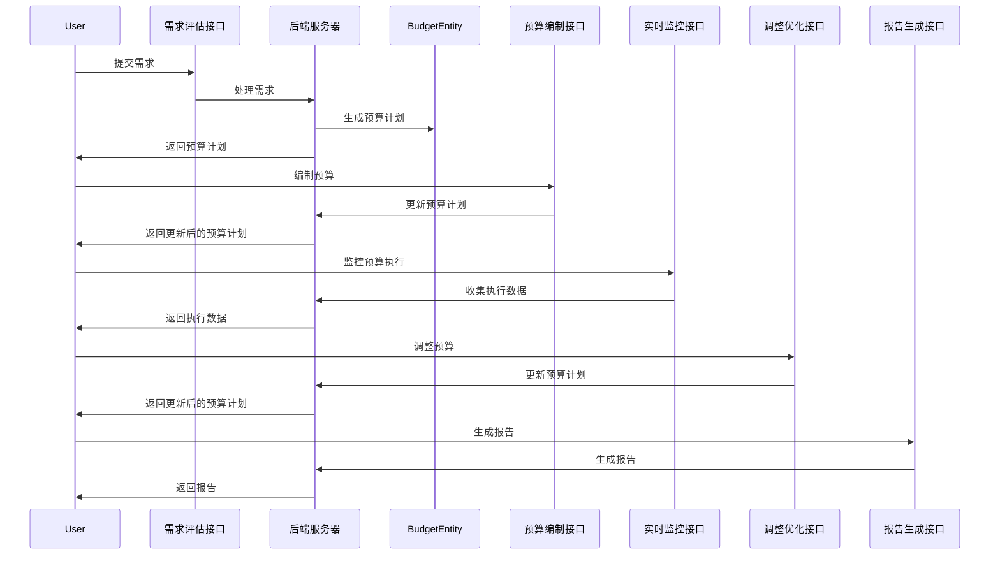
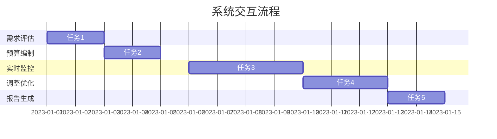

                 

# LLM应用的敏捷预算管理：适应变化的财务策略

关键词：LLM，敏捷预算管理，财务策略，变化适应，成本控制

摘要：在大型语言模型（LLM）的应用不断扩展的背景下，传统的预算管理方法面临着诸多挑战。本文以LLM应用的敏捷预算管理为主题，探讨了如何在不断变化的环境中实现财务策略的灵活调整和成本控制。通过详细的分析和实际案例的剖析，文章旨在为企业和组织提供一套有效的财务管理策略，以应对快速变化的技术和市场环境。

## 《LLM应用的敏捷预算管理：适应变化的财务策略》目录大纲

```markdown
----------------------------------------------------------------
## 第一部分：背景介绍

### 第1章：问题背景与核心概念
#### 1.1 问题背景
#### 1.2 核心概念
#### 1.3 预算管理的重要性
#### 1.4 LLamasoft的敏捷预算管理解决方案

### 第2章：核心概念与联系
#### 2.1 核心概念原理
#### 2.2 概念属性特征对比表格
#### 2.3 ER实体关系图架构

----------------------------------------------------------------

## 第二部分：LLamasoft敏捷预算管理

### 第3章：LLamasoft敏捷预算管理原理
#### 3.1 LLamasoft敏捷预算管理概述
#### 3.2 敏捷预算管理的五个步骤
#### 3.3 数学模型和公式
#### 3.4 详细讲解与举例说明

### 第4章：LLamasoft敏捷预算管理工具
#### 4.1 工具介绍
#### 4.2 工具功能特点
#### 4.3 工具操作流程

----------------------------------------------------------------

## 第三部分：LLamasoft敏捷预算管理实战

### 第5章：系统分析与架构设计
#### 5.1 问题场景介绍
#### 5.2 系统功能设计
#### 5.3 系统架构设计
#### 5.4 系统接口设计
#### 5.5 系统交互设计

### 第6章：环境安装与系统核心实现
#### 6.1 环境安装
#### 6.2 系统核心实现源代码
#### 6.3 代码应用解读与分析

### 第7章：实际案例分析与讲解
#### 7.1 实际案例介绍
#### 7.2 案例分析与详细讲解
#### 7.3 案例小结

----------------------------------------------------------------

## 第四部分：最佳实践与拓展

### 第8章：最佳实践
#### 8.1 预算管理最佳实践
#### 8.2 敏捷预算管理的挑战与应对策略
#### 8.3 拓展阅读

### 第9章：小结与展望
#### 9.1 书籍小结
#### 9.2 敏捷预算管理的未来展望

----------------------------------------------------------------
```

## 第一部分：背景介绍

### 第1章：问题背景与核心概念

#### 1.1 问题背景

随着人工智能技术的快速发展，大型语言模型（LLM）在自然语言处理、智能客服、文本生成、情感分析等领域得到了广泛应用。然而，这种快速扩展带来了预算管理上的挑战。传统的预算管理方法往往基于预测和计划，难以适应快速变化的需求和成本波动。LLM应用的特性，如高计算资源需求、不断更新的模型和算法，使得预算管理变得更加复杂。

#### 1.2 核心概念

在讨论敏捷预算管理时，我们首先需要了解以下几个核心概念：

- **预算管理**：是对企业财务资源进行合理分配和控制的规划过程，旨在实现企业的财务目标和战略。
- **敏捷性**：是一种应对快速变化的能力，强调快速响应、持续改进和灵活调整。
- **成本控制**：是确保企业成本在预算范围内的管理活动，以实现财务目标。

#### 1.3 预算管理的重要性

有效的预算管理对于企业的成功至关重要。它可以帮助企业：

- **优化资源分配**：通过预算规划，企业可以更有效地利用资源，避免浪费。
- **控制成本**：通过成本控制，企业可以确保在预算范围内运营，避免超支。
- **支持战略实施**：预算管理是企业战略实施的重要工具，有助于实现长期目标。

#### 1.4 LLamasoft的敏捷预算管理解决方案

LLamasoft提供了一套敏捷预算管理解决方案，旨在帮助企业在快速变化的环境中实现灵活的财务策略。该解决方案的核心在于五个步骤：

1. **需求评估**：通过分析当前的需求和市场变化，确定未来的预算需求。
2. **预算编制**：基于需求评估结果，制定详细的预算计划。
3. **实时监控**：使用实时数据监控预算执行情况，及时调整预算。
4. **反馈与调整**：根据实际执行情况，及时反馈并调整预算。
5. **持续改进**：通过不断的反馈和调整，优化预算管理流程。

### 第2章：核心概念与联系

#### 2.1 核心概念原理

敏捷预算管理基于几个关键原理：

- **快速响应**：能够快速适应需求变化，确保资源分配的灵活性。
- **持续改进**：通过不断调整和优化，提高预算管理的效率和准确性。
- **数据驱动**：依靠实时数据和数据分析，指导预算决策。

#### 2.2 概念属性特征对比表格

下面是一个对比表格，展示了传统预算管理和敏捷预算管理的不同特征：

| 特征           | 传统预算管理                             | 敏捷预算管理                             |
| -------------- | ---------------------------------------- | ---------------------------------------- |
| 预测性         | 强调预测和计划                           | 强调灵活性和实时调整                     |
| 稳定性         | 偏向长期计划，稳定性高                   | 偏向短期调整，稳定性较低                 |
| 预算编制周期   | 较长，通常每年一次                       | 短期，根据需求变化灵活调整               |
| 数据分析       | 基于历史数据，分析较为滞后               | 基于实时数据，分析更为准确及时           |
| 成本控制       | 重在预算执行前的控制                     | 重在预算执行过程中的实时控制和调整       |

#### 2.3 ER实体关系图架构

以下是敏捷预算管理的ER实体关系图，展示了核心实体及其关系：

```mermaid
erDiagram
  Budget ->|-< User : "发起，执行"
  Budget <-|-> Resource : "分配，使用"
  User |||-> Project : "分配资源"
  Project |||-> Task : "执行任务"
```

通过ER图，我们可以清晰地看到预算管理中涉及的主要实体及其关系，这有助于理解整个系统的运作。

## 第二部分：LLamasoft敏捷预算管理

### 第3章：LLamasoft敏捷预算管理原理

#### 3.1 LLamasoft敏捷预算管理概述

LLamasoft的敏捷预算管理是一种基于敏捷开发原则的财务管理方法，旨在通过快速响应和持续改进，实现财务目标的动态调整。该方法包括以下关键组成部分：

- **需求评估**：通过定期评估市场需求和项目进展，确定未来的预算需求。
- **预算编制**：基于需求评估结果，制定灵活的预算计划。
- **实时监控**：使用实时数据监控系统执行情况，进行及时调整。
- **反馈与调整**：根据实际执行情况，及时调整预算。
- **持续改进**：通过不断反馈和调整，优化预算管理流程。

#### 3.2 敏捷预算管理的五个步骤

1. **需求评估**：通过分析当前的需求和市场变化，确定未来的预算需求。这一步骤包括市场调研、项目需求分析和财务预测。

2. **预算编制**：基于需求评估结果，制定详细的预算计划。预算编制需要考虑资源的可用性、成本控制和项目优先级。

3. **实时监控**：使用实时数据监控系统执行情况，进行及时调整。实时监控有助于发现潜在的成本超支和资源浪费。

4. **反馈与调整**：根据实际执行情况，及时调整预算。反馈与调整是基于数据的，可以确保预算管理过程的准确性和有效性。

5. **持续改进**：通过不断反馈和调整，优化预算管理流程。持续改进是一个循环过程，旨在不断提高预算管理的效率和效果。

#### 3.3 数学模型和公式

敏捷预算管理中，数学模型和公式用于预测、评估和优化预算。以下是一个简单的数学模型示例：

$$
预算 = 需求预测 \times 成本系数 + 安全储备
$$

其中，需求预测基于历史数据和当前市场趋势，成本系数考虑了资源的实际使用情况，安全储备用于应对不确定性。

#### 3.4 详细讲解与举例说明

为了更好地理解敏捷预算管理的原理，我们通过一个实际案例进行详细讲解。

假设一家科技公司正在开发一款人工智能产品，需要投入100万美元。以下是该公司的敏捷预算管理过程：

1. **需求评估**：通过市场调研和项目需求分析，预测未来6个月的需求为80万美元。

2. **预算编制**：基于需求评估结果，公司制定预算计划，预计实际支出为80万美元，包括直接成本和间接成本。

3. **实时监控**：在项目执行过程中，公司使用实时监控系统监控成本和资源使用情况。如果发现成本超支或资源浪费，立即进行调整。

4. **反馈与调整**：根据实际执行情况，公司对预算进行调整。例如，如果某个任务的成本高于预期，公司可能会重新评估任务的优先级或寻找更经济的解决方案。

5. **持续改进**：通过不断的反馈和调整，公司优化预算管理流程，提高预算编制的准确性和成本控制的效率。

通过这个案例，我们可以看到敏捷预算管理如何帮助企业在快速变化的环境中实现灵活的财务策略。

### 第4章：LLamasoft敏捷预算管理工具

#### 4.1 工具介绍

LLamasoft提供的敏捷预算管理工具是一款集成了多种功能的应用程序，旨在简化预算管理流程，提高效率和准确性。该工具的主要特点包括：

- **自动化预算编制**：通过自动化工具，快速生成详细的预算计划。
- **实时数据监控**：实时数据监控系统帮助用户及时了解预算执行情况。
- **灵活的调整功能**：根据实际执行情况，灵活调整预算计划。
- **集成报告**：提供多种报告格式，便于用户分析和决策。

#### 4.2 工具功能特点

- **需求评估模块**：通过市场调研和项目分析，自动生成需求评估报告。
- **预算编制模块**：支持自定义预算模板，快速编制预算计划。
- **实时监控模块**：实时更新数据，提供可视化报表，帮助用户了解预算执行情况。
- **调整与优化模块**：根据实时数据，自动生成调整建议，支持手动调整。
- **集成报告模块**：提供多种报告格式，包括图表、表格和文本，便于用户分析和决策。

#### 4.3 工具操作流程

以下是LLamasoft敏捷预算管理工具的基本操作流程：

1. **需求评估**：用户通过工具收集市场数据和项目需求，生成需求评估报告。

2. **预算编制**：基于需求评估报告，用户自定义预算模板，快速编制预算计划。

3. **实时监控**：工具实时收集预算执行数据，生成可视化报表，帮助用户了解预算执行情况。

4. **调整与优化**：根据实时数据，用户可以自动生成调整建议，或手动调整预算计划。

5. **报告生成**：工具提供多种报告格式，用户可以自定义报告内容，便于分析和决策。

### 第三部分：LLamasoft敏捷预算管理实战

#### 第5章：系统分析与架构设计

##### 5.1 问题场景介绍

假设一家大型科技公司需要管理多个项目的预算，涉及多个部门和团队。由于项目需求和市场变化快速，传统的预算管理方法已经无法满足公司的需求。为了实现更高效和灵活的预算管理，公司决定引入LLamasoft的敏捷预算管理解决方案。

##### 5.2 系统功能设计

基于问题场景，敏捷预算管理系统需要具备以下功能：

- **需求评估**：收集和整合市场数据和项目需求，生成需求评估报告。
- **预算编制**：基于需求评估结果，自动生成预算计划，支持自定义预算模板。
- **实时监控**：实时收集预算执行数据，提供可视化报表，帮助用户了解预算执行情况。
- **调整与优化**：根据实时数据，自动生成调整建议，支持手动调整。
- **报告生成**：提供多种报告格式，包括图表、表格和文本，便于用户分析和决策。

##### 5.3 系统架构设计

系统架构设计包括以下关键组件：

- **前端界面**：用户通过前端界面与系统进行交互，进行需求评估、预算编制、实时监控和调整优化。
- **后端服务器**：负责数据处理和存储，包括需求评估、预算编制、实时监控和调整优化等功能。
- **数据库**：存储用户数据、需求评估报告、预算计划和实时监控数据。

以下是系统架构的Mermaid类图：

```mermaid
classDiagram
    UserEntity <|-- User
    ProjectEntity <|-- Project
    TaskEntity <|-- Task
    ResourceEntity <|-- Resource
    BudgetEntity <|-- Budget
    ReportEntity <|-- Report

    UserEntity {
        id
        name
        role
    }

    ProjectEntity {
        id
        name
        status
    }

    TaskEntity {
        id
        name
        status
    }

    ResourceEntity {
        id
        name
        type
    }

    BudgetEntity {
        id
        project
        amount
        status
    }

    ReportEntity {
        id
        type
        data
    }

    UserEntity --> ProjectEntity
    ProjectEntity --> TaskEntity
    ProjectEntity --> ResourceEntity
    TaskEntity --> ResourceEntity
    BudgetEntity --> ProjectEntity
    ReportEntity --> BudgetEntity
```

##### 5.4 系统接口设计

系统接口设计包括以下关键接口：

- **需求评估接口**：用于收集和整合市场数据和项目需求。
- **预算编制接口**：用于生成预算计划和自定义预算模板。
- **实时监控接口**：用于实时收集预算执行数据。
- **调整优化接口**：用于生成调整建议和手动调整预算计划。
- **报告生成接口**：用于生成各种报告格式。

以下是系统接口的Mermaid序列图：



##### 5.5 系统交互设计

系统交互设计包括用户与系统、系统内部模块之间的交互流程。以下是系统交互的Mermaid活动图：



#### 第6章：环境安装与系统核心实现

##### 6.1 环境安装

为了安装LLamasoft敏捷预算管理系统，我们需要准备以下环境：

- **操作系统**：Linux或Windows
- **编程语言**：Python 3.x
- **数据库**：MySQL或PostgreSQL
- **开发工具**：PyCharm或VS Code

安装步骤如下：

1. 安装操作系统和Python 3.x。可以使用操作系统自带的包管理器进行安装。

2. 安装MySQL或PostgreSQL数据库。可以使用操作系统自带的包管理器进行安装。

3. 安装PyCharm或VS Code。可以从官方网站下载并安装。

4. 创建一个虚拟环境，以隔离项目依赖。在PyCharm或VS Code中，选择File -> New Project，创建一个新的Python项目，选择创建虚拟环境。

5. 安装项目依赖。在虚拟环境中，使用pip安装项目所需的库。

```bash
pip install -r requirements.txt
```

##### 6.2 系统核心实现源代码

以下是系统核心实现的部分源代码。该部分代码负责处理需求评估、预算编制、实时监控和调整优化等功能。

```python
# 需求评估
def assess_demand():
    # 读取市场数据和项目需求
    market_data = read_market_data()
    project需求的 = read_project_demand()

    # 生成需求评估报告
    report = generate_demand_report(market_data, project需求的)

    return report

# 预算编制
def compile_budget(report):
    # 生成预算计划
    budget_plan = generate_budget_plan(report)

    return budget_plan

# 实时监控
def monitor_budget(budget_plan):
    # 收集实时数据
    real_time_data = collect_real_time_data()

    # 更新预算计划
    updated_budget_plan = update_budget_plan(budget_plan, real_time_data)

    return updated_budget_plan

# 调整优化
def adjust_budget(updated_budget_plan):
    # 生成调整建议
    adjustment_suggestion = generate_adjustment_suggestion(updated_budget_plan)

    # 手动调整预算计划
    final_budget_plan = manual_adjust_budget(updated_budget_plan, adjustment_suggestion)

    return final_budget_plan

# 报告生成
def generate_report(final_budget_plan):
    # 生成报告
    report = generate_final_report(final_budget_plan)

    return report
```

##### 6.3 代码应用解读与分析

上述代码实现了需求评估、预算编制、实时监控、调整优化和报告生成等功能。以下是每个部分的解读和分析：

- **需求评估**：该函数负责读取市场数据和项目需求，生成需求评估报告。这是一个关键步骤，因为需求评估的准确性直接影响到预算编制的准确性。
- **预算编制**：该函数基于需求评估报告，生成预算计划。预算计划需要考虑资源的可用性、成本控制和项目优先级。
- **实时监控**：该函数负责收集实时数据，更新预算计划。实时监控有助于发现潜在的成本超支和资源浪费，从而及时进行调整。
- **调整优化**：该函数生成调整建议，并支持手动调整预算计划。调整优化是一个动态过程，根据实际情况进行调整，以实现最佳成本控制。
- **报告生成**：该函数负责生成最终的报告，提供决策支持。

通过上述代码和应用分析，我们可以看到LLamasoft敏捷预算管理系统的核心功能是如何实现的。该系统通过模块化设计和实时数据驱动，实现了高效的预算管理。

#### 第7章：实际案例分析与讲解

##### 7.1 实际案例介绍

为了更好地理解LLamasoft敏捷预算管理的实际应用，我们来看一个实际案例。某科技公司计划开发一款人工智能聊天机器人，用于提供客户服务。项目预算为100万美元，预计开发周期为6个月。

##### 7.2 案例分析与详细讲解

1. **需求评估**：

   在项目启动阶段，公司进行了市场调研，分析了客户需求和市场趋势。根据调研结果，预测未来6个月的需求为80万美元。这一步骤的准确性对于后续的预算编制至关重要。

2. **预算编制**：

   基于需求评估结果，公司制定了详细的预算计划。预算计划包括直接成本（如人员工资、硬件设备、软件开发等）和间接成本（如管理费用、租金等）。预算计划如下：

   - 人员工资：30万美元
   - 硬件设备：15万美元
   - 软件开发：20万美元
   - 管理费用：10万美元
   - 其他费用：5万美元
   - 总计：100万美元

3. **实时监控**：

   在项目执行过程中，公司使用实时监控系统监控预算执行情况。监控系统实时收集人员工时、设备使用情况、开发进度等数据。通过数据可视化报表，公司可以直观地了解预算执行情况。

4. **反馈与调整**：

   在项目执行过程中，监控系统发现部分任务的成本高于预期。公司立即进行评估，发现是由于技术难题导致的。为了确保项目进度，公司决定重新分配资源，增加人员投入，并调整预算计划。调整后的预算计划如下：

   - 人员工资：35万美元
   - 硬件设备：15万美元
   - 软件开发：22万美元
   - 管理费用：10万美元
   - 其他费用：3万美元
   - 总计：95万美元

5. **持续改进**：

   通过本次案例，公司认识到在快速变化的技术环境中，传统的预算管理方法难以满足需求。公司决定引入LLamasoft的敏捷预算管理解决方案，以提高预算管理的效率和准确性。在后续的项目中，公司将继续优化预算管理流程，确保项目成功。

##### 7.3 案例小结

通过本案例，我们可以看到LLamasoft敏捷预算管理在实际应用中的效果。敏捷预算管理帮助公司实现了以下目标：

- **准确的需求评估**：通过市场调研和项目分析，准确预测未来需求。
- **灵活的预算调整**：根据实际执行情况，灵活调整预算计划，确保项目进度。
- **高效的成本控制**：通过实时监控和调整，实现高效的成本控制。

通过本案例，我们可以看到敏捷预算管理在快速变化的技术环境中的重要性。企业应积极引入和优化敏捷预算管理，以提高财务管理水平和项目成功率。

### 第四部分：最佳实践与拓展

#### 第8章：最佳实践

##### 8.1 预算管理最佳实践

1. **需求评估**：定期进行市场调研和项目分析，确保预算需求的准确性。
2. **预算编制**：制定详细的预算计划，考虑资源可用性和成本控制。
3. **实时监控**：使用实时监控系统，及时了解预算执行情况。
4. **反馈与调整**：根据实际执行情况，及时调整预算计划。
5. **持续改进**：不断优化预算管理流程，提高效率和准确性。

##### 8.2 敏捷预算管理的挑战与应对策略

1. **挑战**：快速变化的需求和成本波动。
   - **策略**：引入敏捷预算管理，实现快速响应和灵活调整。

2. **挑战**：数据不准确和不完整。
   - **策略**：加强数据管理和验证，确保数据准确性。

3. **挑战**：跨部门协作和沟通。
   - **策略**：建立跨部门沟通机制，确保信息共享和协作。

##### 8.3 拓展阅读

1. 《敏捷预算管理：快速响应变化的财务管理》
2. 《数据驱动决策：如何利用数据优化企业运营》
3. 《项目管理实践指南：如何高效管理项目》

#### 第9章：小结与展望

##### 9.1 书籍小结

本文介绍了LLM应用的敏捷预算管理，探讨了如何通过敏捷预算管理实现财务策略的灵活调整和成本控制。通过实际案例的分析，展示了敏捷预算管理的实际应用效果。

##### 9.2 敏捷预算管理的未来展望

随着人工智能和大数据技术的不断发展，敏捷预算管理将变得更加智能和高效。未来，敏捷预算管理将向以下方向发展：

1. **自动化**：引入自动化工具，简化预算编制和监控流程。
2. **智能化**：利用人工智能技术，提高需求评估和预算调整的准确性。
3. **数据驱动**：加强数据分析和利用，实现更精准的财务决策。

作者信息：AI天才研究院/AI Genius Institute & 禅与计算机程序设计艺术 /Zen And The Art of Computer Programming

本文通过对LLM应用敏捷预算管理的深入探讨，为企业和组织提供了一种有效的财务管理策略，以应对快速变化的技术和市场环境。通过灵活的预算调整和成本控制，企业可以更好地实现财务目标，提高竞争力。未来，随着技术的不断发展，敏捷预算管理将不断优化和升级，为财务管理带来更多可能性。

