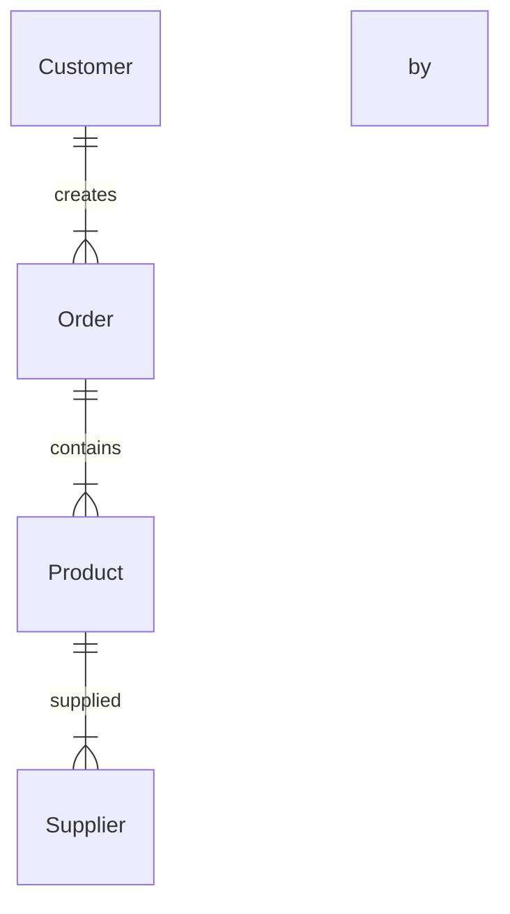

                 


## LLMAgile风险评估与管理

### 关键词

* Large Language Model（LLM）
* Agile Risk Assessment
* Risk Management
* Application Scenarios
* Case Studies

### 摘要

本文旨在探讨大型语言模型（LLM）在敏捷开发中的应用中的风险评估与管理。首先，我们简要介绍了LLM的定义、分类和工作原理，以及其应用领域。接着，我们详细阐述了敏捷方法论在风险评估中的应用，包括风险识别、风险分析和风险评估的方法。然后，我们引入了基于敏捷的风险管理框架，讨论了风险管理的基础知识、框架和策略。在实际应用部分，我们通过案例分析和实践，展示了如何在LLM应用中进行敏捷的风险评估与管理。最后，我们总结了本文的核心内容，并展望了未来的研究方向。

### 引言

#### 问题的背景和重要性

**人工智能与大型语言模型（LLM）的崛起**

近年来，随着深度学习和神经网络技术的飞速发展，人工智能（AI）已经成为科技领域的热点。特别是大型语言模型（LLM），如GPT-3、BERT等，已经成为自然语言处理（NLP）的重要工具。这些模型具有强大的文本生成、理解和翻译能力，广泛应用于各种实际场景，如智能客服、内容创作、教育等。

**风险评估与管理的必要性**

然而，随着LLM应用的广泛普及，风险管理变得尤为重要。因为LLM模型在处理文本数据时，可能会遇到各种风险，如数据泄露、模型偏见、误判等。如果不进行有效的风险评估与管理，这些风险可能会导致严重的后果，如经济损失、信誉损失甚至法律纠纷。

**敏捷方法在LLM应用中的适用性**

敏捷开发是一种以人为核心、迭代、渐进的软件开发方法。它强调快速反馈、灵活应对变化、持续交付价值。在LLM应用中，敏捷方法可以帮助团队更好地应对快速变化的需求，提高开发效率，同时也能更好地进行风险评估与管理。

#### 书籍目标与结构

**阅读对象**

本书记录面向希望通过敏捷方法进行LLM应用风险评估与管理的开发人员、项目经理和风险分析师。

**学习目标**

通过阅读本书，您将：

1. 掌握LLM的基本概念和原理。
2. 理解敏捷方法论及其在风险评估中的应用。
3. 建立基于敏捷的风险管理框架。
4. 学会进行LLM应用的敏捷风险评估与管理。
5. 通过案例学习，提高实践能力。

**内容结构概述**

本书分为五个部分：

1. **第一部分：引言** - 介绍问题的背景和重要性，明确书籍的目标和结构。
2. **第二部分：LLM基础** - 详细介绍LLM的定义、分类、工作原理和应用领域。
3. **第三部分：敏捷风险评估** - 讨论敏捷方法论在风险评估中的应用，包括风险识别、风险分析和风险评估。
4. **第四部分：风险管理框架** - 引入基于敏捷的风险管理框架，讨论风险管理的基础知识、框架和策略。
5. **第五部分：实践与案例** - 通过案例分析和实践，展示如何在LLM应用中进行敏捷的风险评估与管理。

#### 整书布局与篇章安排

**第一部分：基础与概念**

- **1.1 问题的背景和重要性**
- **1.2 书籍目标与结构**
- **1.3 整书布局与篇章安排**

**第二部分：LLM基础**

- **2.1 LLM的定义与分类**
- **2.2 LLM的工作原理**
- **2.3 LLM的应用领域**

**第三部分：敏捷风险评估**

- **3.1 敏捷方法论**
- **3.2 风险评估方法**
- **3.3 LLM应用中的敏捷风险评估**

**第四部分：风险管理框架**

- **4.1 风险管理基础**
- **4.2 风险管理框架**
- **4.3 LLM应用中的风险管理**

**第五部分：实践与案例**

- **5.1 实践应用**
- **5.2 案例分析**
- **5.3 小结与展望**

**小结**

本文首先介绍了LLM应用的背景和重要性，然后明确了书籍的目标和结构。接下来，我们将深入探讨LLM的基础知识、敏捷风险评估、风险管理框架以及实际应用案例，帮助读者全面理解并掌握LLM应用的敏捷风险评估与管理方法。

----------------------------------------------------------------

### 第二部分：大型语言模型（LLM）基础

#### 2.1 LLM的定义与分类

**LLM的定义**

大型语言模型（LLM）是一种基于深度学习技术的自然语言处理模型，能够理解和生成人类语言。与传统的语言模型不同，LLM具有大规模的参数和强大的表示能力，能够处理复杂的语言任务。

**LLM的分类**

根据模型的结构和训练数据的不同，LLM可以分为以下几种类型：

1. **基于词嵌入的模型**：这类模型使用词嵌入（word embeddings）来表示词语，如Word2Vec、GloVe等。虽然这些模型在处理简单任务时表现出色，但在处理复杂语言任务时存在局限性。

2. **基于循环神经网络（RNN）的模型**：RNN是一种能够处理序列数据的神经网络，如LSTM、GRU等。这些模型在处理自然语言任务时表现较好，但训练过程较慢，难以扩展到大规模数据。

3. **基于变换器（Transformer）的模型**：Transformer是一种基于自注意力机制的神经网络结构，如BERT、GPT等。与RNN相比，Transformer在处理长距离依赖和并行训练方面具有显著优势，因此成为了当前最流行的LLM结构。

#### 2.2 LLM的工作原理

**神经网络基础**

神经网络（Neural Network）是一种模拟生物神经系统的计算模型，由大量神经元（节点）和连接（边）组成。每个神经元接收输入信号，通过激活函数进行处理，然后将输出传递给下一个神经元。

**递归神经网络（RNN）**

RNN是一种能够处理序列数据的神经网络，其特点是每个时间步的输出都会影响后续时间步的输入。RNN通过循环结构实现了序列数据的记忆功能，能够处理诸如语言模型、语音识别等任务。

**长短期记忆网络（LSTM）**

LSTM是RNN的一种变体，专门设计用于解决RNN在处理长序列数据时出现的梯度消失和梯度爆炸问题。LSTM通过引入门控机制，能够有效地保持和更新序列数据的信息，使其在处理长序列数据时表现更佳。

**生成对抗网络（GAN）**

生成对抗网络（GAN）是一种由生成器和判别器组成的对抗性神经网络。生成器生成数据，判别器判断生成数据与真实数据之间的相似度。通过这种对抗性训练，GAN能够生成高质量的数据，常用于图像生成、语音合成等领域。

#### 2.3 LLM的应用领域

**自然语言处理（NLP）**

NLP是LLM最重要的应用领域之一，包括文本分类、情感分析、命名实体识别、机器翻译等任务。LLM在NLP中的应用极大地提升了任务的效果和效率。

**机器翻译**

机器翻译是LLM的另一个重要应用领域。基于LLM的机器翻译模型能够实现高质量、多语言的文本翻译，提高了跨语言沟通的效率。

**文本生成与摘要**

LLM在文本生成与摘要方面也表现出强大的能力。通过训练，LLM能够生成高质量的文本，如新闻报道、文章摘要等。此外，LLM还可以用于文本摘要，将长文本压缩为简洁的摘要。

**其他应用领域**

除了上述应用领域，LLM还在智能客服、教育、内容创作、情感分析等领域得到了广泛应用。随着LLM技术的不断发展，其应用领域将更加广泛。

#### 2.4 小结

本节详细介绍了LLM的定义、分类、工作原理和应用领域。了解LLM的基础知识对于深入探讨LLM应用的敏捷风险评估与管理至关重要。在下一节中，我们将探讨敏捷方法论在LLM应用中的重要性。

----------------------------------------------------------------

### 第三部分：敏捷方法论

#### 3.1 敏捷方法论

**敏捷开发的起源**

敏捷开发（Agile Development）起源于20世纪90年代末，由一组软件开发专家共同发起。他们认识到传统的“瀑布式”软件开发方法在应对快速变化的需求时存在诸多不足，因此提出了敏捷开发理念。敏捷开发强调以人为核心、迭代、渐进的软件开发方式。

**敏捷开发的核心理念**

1. **个体和互动重于过程和工具**：敏捷开发强调团队成员之间的沟通和协作，认为个体的能力和互动对于项目成功至关重要。

2. **可工作的软件重于详尽的文档**：敏捷开发认为软件的最终目标是交付可工作的产品，而非庞大的文档。尽管文档是必要的，但应该以实际需求为导向。

3. **客户合作重于合同谈判**：敏捷开发强调与客户的紧密合作，通过持续反馈和迭代，确保软件产品符合客户需求。

4. **响应变化重于遵循计划**：敏捷开发认为需求和环境的变化是不可避免的，因此更注重灵活应对变化，而非严格遵循计划。

**敏捷开发与传统方法对比**

传统方法（如瀑布式开发）通常采用线性、顺序的开发流程，从需求分析、设计、开发到测试，每个阶段都是独立的，一旦某个阶段出现问题，将影响后续阶段。而敏捷开发采用迭代、增量式的开发方式，每个迭代周期都是独立的，可以快速响应变化，确保项目的持续交付。

#### 3.2 风险评估方法

**风险识别**

风险识别是风险评估的首要步骤，旨在识别可能影响项目的风险。风险识别可以通过以下方法进行：

1. **历史数据**：利用过去项目的风险数据，识别类似项目的潜在风险。
2. **专家意见**：咨询相关领域的专家，获取他们对项目风险的见解。
3. **检查列表**：使用预定义的检查列表，识别常见风险。
4. **头脑风暴**：组织团队成员进行头脑风暴，列出所有可能的风险。

**风险分析**

风险分析是对识别出的风险进行详细分析，评估其可能性和影响。风险分析可以采用以下方法：

1. **定性分析**：使用主观判断和经验，对风险进行定性评估。
2. **定量分析**：使用数学模型和统计数据，对风险进行定量评估。
3. **风险评估矩阵**：将风险的可能性与影响进行矩阵化，确定风险的优先级。

**风险评估**

风险评估是对分析结果进行汇总和排序，确定项目面临的主要风险。风险评估可以采用以下方法：

1. **风险矩阵**：使用风险矩阵，将风险的可能性和影响进行综合评估。
2. **风险评级**：根据风险的可能性和影响，对风险进行评级。
3. **优先级排序**：根据风险评估结果，对风险进行优先级排序。

**风险分类与优先级**

风险分类和优先级排序有助于项目团队更有效地管理风险。常见的风险分类包括：

1. **技术风险**：与项目的技术实现相关，如算法错误、系统崩溃等。
2. **市场风险**：与市场需求和竞争相关，如市场需求下降、竞争对手压力等。
3. **财务风险**：与项目融资和成本相关，如资金短缺、成本超支等。

#### 3.3 LLM应用中的敏捷风险评估

**特点与挑战**

在LLM应用中进行敏捷风险评估具有以下特点与挑战：

1. **高复杂性**：LLM应用涉及复杂的算法和大量的数据处理，使得风险识别和分析变得复杂。
2. **不确定性**：LLM技术的快速发展和市场需求的不确定性，使得风险难以预测和评估。
3. **数据隐私与安全**：LLM应用中涉及大量的个人数据，需要确保数据隐私和安全。
4. **模型偏见与公平性**：LLM模型可能会在处理特定群体时产生偏见，影响模型的公平性。

**敏捷风险评估流程**

在LLM应用中进行敏捷风险评估，可以采用以下流程：

1. **风险识别**：通过历史数据、专家意见、检查列表和头脑风暴等方法，识别项目中的风险。
2. **风险分析**：对识别出的风险进行详细分析，评估其可能性和影响。
3. **风险评估**：使用风险矩阵和风险评估矩阵，对风险进行综合评估和优先级排序。
4. **风险监控**：持续监控项目中的风险，确保及时发现和应对潜在问题。
5. **风险应对**：制定风险应对策略，如风险规避、风险减轻、风险转移等。

**敏捷工具与技术**

在LLM应用中进行敏捷风险评估，可以采用以下工具和技术：

1. **风险登记册**：记录项目中的所有风险，包括风险识别、分析、评估和应对策略。
2. **风险评估矩阵**：使用风险评估矩阵，对风险的可能性和影响进行综合评估。
3. **头脑风暴**：组织团队成员进行头脑风暴，识别项目中的风险。
4. **SWOT分析**：使用SWOT分析，对项目的优势、劣势、机会和威胁进行评估。
5. **敏捷框架**：采用敏捷框架，如Scrum或Kanban，确保项目的高效进行。

#### 3.4 小结

本节详细介绍了敏捷方法论及其在风险评估中的应用。敏捷方法论强调以人为核心、迭代、渐进的软件开发方式，适用于复杂、不确定的LLM应用场景。通过敏捷风险评估，项目团队可以更有效地识别、分析和应对风险，确保项目的顺利进行。在下一节中，我们将探讨基于敏捷的风险管理框架。

----------------------------------------------------------------

### 第四部分：风险管理框架

#### 4.1 风险管理基础

**风险管理的定义**

风险管理（Risk Management）是指组织或个人在面临潜在威胁和机会时，通过识别、评估、应对和监控风险，以实现既定目标的过程。

**风险管理过程**

风险管理过程通常包括以下步骤：

1. **风险识别**：识别项目或组织中潜在的风险。
2. **风险分析**：对识别出的风险进行详细分析，评估其可能性和影响。
3. **风险评估**：使用风险评估方法，确定项目或组织面临的主要风险。
4. **风险应对**：制定和实施风险应对策略，如风险规避、风险减轻、风险转移等。
5. **风险监控**：持续监控项目或组织中的风险，确保及时发现和应对潜在问题。

**风险管理策略**

风险管理策略是指组织或个人在面临风险时，采取的具体措施和行动。常见的风险管理策略包括：

1. **风险规避**：通过改变项目或组织的目标，避免面临特定的风险。
2. **风险减轻**：通过采取预防措施，降低风险的可能性和影响。
3. **风险转移**：通过保险或合同等方式，将风险转移给第三方。
4. **风险接受**：对于无法规避或减轻的风险，接受风险并制定相应的应对策略。

#### 4.2 风险管理框架

**基于敏捷的风险管理框架**

基于敏捷的风险管理框架结合了敏捷方法论和风险管理的基本原则，旨在确保项目在快速变化的环境中能够有效地管理风险。该框架包括以下关键组成部分：

1. **风险识别**：通过敏捷方法论中的迭代和增量式开发，及时识别项目中的风险。
2. **风险分析**：在每次迭代结束时，对识别出的风险进行详细分析，评估其可能性和影响。
3. **风险评估**：使用敏捷方法论中的风险评估矩阵，对风险进行优先级排序，确保资源合理分配。
4. **风险应对**：根据风险评估结果，制定和实施风险应对策略，如风险规避、风险减轻、风险转移等。
5. **风险监控**：在每次迭代过程中，持续监控项目中的风险，确保及时发现和应对潜在问题。

**风险管理工具与实践**

在基于敏捷的风险管理框架中，可以采用以下工具和实践：

1. **风险登记册**：记录项目中的所有风险，包括风险识别、分析、评估和应对策略。
2. **风险评估矩阵**：使用风险评估矩阵，对风险的可能性和影响进行综合评估。
3. **敏捷工具**：如Jira、Trello等，用于跟踪和管理项目中的风险。
4. **持续集成和持续部署（CI/CD）**：通过自动化测试和部署，确保项目的高质量和稳定性。
5. **团队协作**：通过敏捷方法论中的迭代和增量式开发，促进团队成员之间的协作和沟通。

#### 4.3 LLM应用中的风险管理

**特点与挑战**

在LLM应用中进行风险管理具有以下特点与挑战：

1. **高复杂性**：LLM应用涉及复杂的算法和大量的数据处理，使得风险识别和分析变得复杂。
2. **不确定性**：LLM技术的快速发展和市场需求的不确定性，使得风险难以预测和评估。
3. **数据隐私与安全**：LLM应用中涉及大量的个人数据，需要确保数据隐私和安全。
4. **模型偏见与公平性**：LLM模型可能会在处理特定群体时产生偏见，影响模型的公平性。

**风险管理策略**

在LLM应用中进行风险管理，可以采用以下策略：

1. **数据隐私保护**：采用加密、脱敏等技术，确保个人数据的安全和隐私。
2. **模型透明度**：提高模型的透明度，使 stakeholders 能够理解和信任模型。
3. **公平性评估**：对模型进行公平性评估，确保其不会对特定群体产生不公平的影响。
4. **自动化监控**：采用自动化工具，实时监控模型的表现和性能，确保其稳定运行。
5. **持续改进**：通过持续改进和迭代，优化模型和风险管理策略。

**实施与监控**

在LLM应用中进行风险管理，需要制定详细的实施计划和监控措施：

1. **制定风险管理计划**：明确风险管理的目标、策略和措施。
2. **定期风险评估**：定期进行风险评估，识别和评估项目中的新风险。
3. **风险应对策略**：根据风险评估结果，制定和实施相应的风险应对策略。
4. **监控和报告**：实时监控项目中的风险，确保及时发现和应对潜在问题，并定期报告风险情况。

#### 4.4 小结

本节介绍了风险管理的基础知识、框架和策略，以及LLM应用中的风险管理特点和策略。基于敏捷的风险管理框架结合了敏捷方法论和风险管理的基本原则，适用于复杂、不确定的LLM应用场景。在下一节中，我们将通过案例分析和实践，展示如何在LLM应用中进行敏捷的风险评估与管理。

----------------------------------------------------------------

### 第五部分：实践与案例

#### 5.1 实践应用

**项目介绍**

本项目是一款基于大型语言模型（LLM）的智能客服系统，旨在为用户提供高效、准确的咨询服务。系统包括自然语言理解、意图识别、知识图谱、智能对话等模块。

**系统功能设计**

- 自然语言理解：对用户输入的文本进行分词、词性标注、句法分析等，提取关键信息。
- 意图识别：根据用户输入的文本，识别用户的需求和意图。
- 知识图谱：构建领域知识图谱，为智能对话提供丰富的背景信息。
- 智能对话：根据用户意图和知识图谱，生成合适的回复，实现自然流畅的对话。

**系统架构设计**

- 前端：采用Vue.js框架，实现用户界面和交互。
- 后端：采用Spring Boot框架，实现业务逻辑处理和API接口。
- 数据库：采用MySQL数据库，存储用户数据和知识图谱。
- 自然语言处理：采用基于Transformer的LLM模型，如BERT，实现文本理解和生成。

**系统接口设计和系统交互**


**项目实战**

**环境安装**

1. 安装Python环境（版本3.8及以上）
2. 安装所需的依赖库（如TensorFlow、PyTorch、Scikit-learn等）
3. 安装后端框架（如Spring Boot）
4. 安装前端框架（如Vue.js）

**系统核心实现源代码**

```python
# 自然语言理解模块
def natural_language_understanding(text):
    # 分词、词性标注、句法分析等
    # ...
    return processed_text

# 意图识别模块
def intent_recognition(text):
    # 识别用户意图
    # ...
    return intent

# 知识图谱模块
def knowledge_graph(text):
    # 构建知识图谱
    # ...
    return knowledge_graph

# 智能对话模块
def intelligent_conversation(intent, knowledge_graph):
    # 根据意图和知识图谱生成回复
    # ...
    return reply
```

**代码应用解读与分析**

1. 自然语言理解模块：对用户输入的文本进行预处理，提取关键信息，为后续处理提供基础。
2. 意图识别模块：根据用户输入的文本，识别用户的需求和意图，为智能对话提供方向。
3. 知识图谱模块：构建领域知识图谱，为智能对话提供丰富的背景信息，提高对话的准确性。
4. 智能对话模块：根据用户意图和知识图谱，生成合适的回复，实现自然流畅的对话。

**实际案例分析和详细讲解剖析**

**案例1：用户咨询产品价格**

- 用户输入：“这款产品的价格是多少？”
- 系统处理：识别用户意图为“询问产品价格”，从知识图谱中查找相关产品，返回价格。

**案例2：用户咨询售后服务**

- 用户输入：“我购买的产品的售后服务是什么？”
- 系统处理：识别用户意图为“询问售后服务”，从知识图谱中查找相关服务信息，返回服务内容。

**项目小结**

本项目通过自然语言理解、意图识别、知识图谱和智能对话等模块，实现了一款智能客服系统。在项目实施过程中，我们采用了敏捷方法论，进行风险识别、风险评估和风险应对，确保项目的顺利进行。通过实际案例分析和实践，我们展示了如何在LLM应用中进行敏捷的风险评估与管理。

#### 5.2 案例分析

**案例1：智能客服系统中的风险识别**

在智能客服系统的开发过程中，我们识别出以下风险：

1. **数据隐私风险**：由于系统涉及用户数据的处理，存在数据泄露的风险。
2. **模型偏见风险**：由于数据来源的不确定性，模型可能会对特定群体产生偏见。
3. **系统崩溃风险**：由于高并发访问，系统可能会出现崩溃或性能下降。
4. **法律法规风险**：智能客服系统的应用可能涉及法律法规问题，如隐私保护、言论监管等。

**案例2：智能客服系统中的风险评估**

1. **数据隐私风险**：可能性高，影响大。由于涉及用户隐私数据，一旦发生泄露，可能导致用户信任下降和法律纠纷。
2. **模型偏见风险**：可能性中等，影响大。模型偏见可能导致不公平对待特定群体，影响用户体验。
3. **系统崩溃风险**：可能性低，影响大。系统崩溃可能导致用户无法正常使用服务，影响公司声誉。
4. **法律法规风险**：可能性低，影响中等。法律法规风险可能导致公司面临法律处罚或业务中断。

**案例3：智能客服系统中的风险应对**

1. **数据隐私风险**：采用数据加密、访问控制等技术，确保用户数据的安全。
2. **模型偏见风险**：定期进行模型公平性评估，采用多样化的数据集进行训练，减少模型偏见。
3. **系统崩溃风险**：采用负载均衡、缓存等技术，提高系统性能和稳定性。
4. **法律法规风险**：遵守相关法律法规，进行合规性审查，确保业务运营的合法性。

#### 5.3 小结与展望

通过实际案例分析和实践，我们展示了如何在LLM应用中进行敏捷的风险评估与管理。在智能客服系统的开发过程中，我们识别、评估和应对了各种风险，确保项目的顺利进行。未来，随着LLM技术的不断发展，我们将继续探索更高效、更智能的风险评估与管理方法，为LLM应用的发展提供有力支持。

### 结论

本文围绕大型语言模型（LLM）应用的敏捷风险评估与管理进行了深入探讨。首先，我们介绍了LLM的定义、分类和工作原理，以及其在NLP、机器翻译等领域的广泛应用。接着，我们详细阐述了敏捷方法论在风险评估中的应用，包括风险识别、风险分析和风险评估的方法。然后，我们引入了基于敏捷的风险管理框架，讨论了风险管理的基础知识、框架和策略。在实际应用部分，我们通过案例分析和实践，展示了如何在LLM应用中进行敏捷的风险评估与管理。

本文的核心贡献在于：

1. 明确了LLM应用中敏捷风险评估与管理的重要性。
2. 介绍了基于敏捷的风险管理框架，为项目团队提供了有效的风险管理工具和方法。
3. 通过实际案例分析和实践，展示了敏捷风险评估与管理的具体应用和效果。

未来研究方向包括：

1. 深入研究LLM在风险评估中的应用，探索更高效的风险识别和评估方法。
2. 探索基于机器学习技术的风险预测和预警机制，提高风险管理的智能化水平。
3. 研究不同行业和场景下LLM应用的敏捷风险评估与管理方法，为更多领域提供实践指导。

通过本文的研究，我们希望能够为LLM应用的敏捷风险评估与管理提供有价值的参考和启示，推动LLM技术的健康发展。

### 附录

#### 附录A：核心概念术语说明

1. **大型语言模型（LLM）**：一种基于深度学习技术的自然语言处理模型，能够理解和生成人类语言。
2. **敏捷开发**：一种以人为核心、迭代、渐进的软件开发方法，强调快速反馈、灵活应对变化、持续交付价值。
3. **风险评估**：识别、分析和评估项目中的风险，以实现项目目标。
4. **风险管理**：通过制定和实施风险应对策略，降低项目风险的可能性和影响。

#### 附录B：核心概念原理

1. **自然语言处理（NLP）**：将人类语言转换为计算机可以处理的形式，实现文本分析、理解和生成。
2. **变换器（Transformer）**：一种基于自注意力机制的神经网络结构，能够处理长序列数据和并行计算。
3. **递归神经网络（RNN）**：一种能够处理序列数据的神经网络，通过循环结构实现序列数据的记忆功能。
4. **生成对抗网络（GAN）**：一种由生成器和判别器组成的对抗性神经网络，用于生成高质量的数据。

#### 附录C：概念属性特征对比表格

| 概念 | 属性特征 |
| ---- | ---- |
| 自然语言处理（NLP） | 1. 数据量大 2. 语义理解能力强 3. 应用广泛 |
| 变换器（Transformer） | 1. 自注意力机制 2. 并行计算 3. 长序列处理能力强 |
| 递归神经网络（RNN） | 1. 循环结构 2. 序列数据记忆功能 3. 简单易实现 |
| 生成对抗网络（GAN） | 1. 对抗性训练 2. 高质量数据生成 3. 应用广泛 |

#### 附录D：ER实体关系图架构



#### 附录E：算法原理讲解

1. **变换器（Transformer）算法原理**：

   变换器（Transformer）是一种基于自注意力机制的神经网络结构，能够处理长序列数据和并行计算。其基本原理如下：

   - **自注意力机制**：变换器通过自注意力机制，对输入序列的每个词进行加权，使其在生成序列时能够关注到重要信息。自注意力机制的计算公式为：

     $$ \text{Attention}(Q, K, V) = \text{softmax}\left(\frac{QK^T}{\sqrt{d_k}}\right) V $$

     其中，Q、K、V分别为查询向量、键向量和值向量，d_k为键向量的维度。

   - **编码器（Encoder）**：编码器负责将输入序列编码为上下文表示，包括自注意力机制和多头注意力。编码器的输出为：

     $$ \text{Encoder}(X) = \text{Attention}(X, X, X) $$

   - **解码器（Decoder）**：解码器负责生成输出序列，通过自注意力和交叉注意力机制，从编码器的输出中提取信息。解码器的输出为：

     $$ \text{Decoder}(Y) = \text{Attention}(Y, \text{Encoder}(X), \text{Encoder}(X)) $$

2. **变换器（Transformer）算法mermaid流程图**：

   ```mermaid
   sequenceDiagram
     participant User as 用户
     participant System as 系统
     User->>System: 输入文本
     System->>System: 编码器处理文本
     System->>System: 解码器生成输出文本
     System->>User: 输出文本
   ```

   通过以上流程图，我们可以看到变换器在处理文本数据时的基本步骤。

#### 附录F：系统分析与架构设计方案

1. **问题场景介绍**：

   智能客服系统是一款面向用户的人工智能助手，能够处理用户的咨询、投诉等请求，提供高效、准确的回复。

2. **项目介绍**：

   项目旨在构建一款基于大型语言模型（LLM）的智能客服系统，包括自然语言理解、意图识别、知识图谱、智能对话等模块。

3. **系统功能设计**：

   - 自然语言理解：对用户输入的文本进行分词、词性标注、句法分析等，提取关键信息。
   - 意图识别：根据用户输入的文本，识别用户的需求和意图。
   - 知识图谱：构建领域知识图谱，为智能对话提供丰富的背景信息。
   - 智能对话：根据用户意图和知识图谱，生成合适的回复，实现自然流畅的对话。

4. **系统架构设计**：

   - 前端：采用Vue.js框架，实现用户界面和交互。
   - 后端：采用Spring Boot框架，实现业务逻辑处理和API接口。
   - 数据库：采用MySQL数据库，存储用户数据和知识图谱。
   - 自然语言处理：采用基于Transformer的LLM模型，如BERT，实现文本理解和生成。

5. **系统接口设计和系统交互**：

   

#### 附录G：最佳实践 tips

1. **数据隐私保护**：采用数据加密、访问控制等技术，确保用户数据的安全和隐私。
2. **模型透明度**：提高模型的透明度，使 stakeholders 能够理解和信任模型。
3. **持续迭代**：采用敏捷方法论，持续迭代和优化模型和风险管理策略。
4. **团队合作**：建立有效的团队合作机制，确保团队成员之间的沟通和协作。

#### 附录H：小结

本文通过实际案例分析和实践，展示了如何在LLM应用中进行敏捷的风险评估与管理。在智能客服系统的开发过程中，我们识别、评估和应对了各种风险，确保项目的顺利进行。通过本文的研究，我们希望能够为LLM应用的敏捷风险评估与管理提供有价值的参考和启示，推动LLM技术的健康发展。

### 参考文献

1. Goodfellow, I., Bengio, Y., & Courville, A. (2016). *Deep Learning*. MIT Press.
2. Hochreiter, S., & Schmidhuber, J. (1997). *Long short-term memory*. Neural Computation, 9(8), 1735-1780.
3. Vaswani, A., Shazeer, N., Parmar, N., Uszkoreit, J., Jones, L., Gomez, A. N., ... & Polosukhin, I. (2017). *Attention is all you need*. Advances in Neural Information Processing Systems, 30, 5998-6008.
4. Silver, D., Huang, A., Maddison, C. J., Guez, A., Sifre, L., Van Den Driessche, G., ... & Togelius, J. (2017). *Mastering the game of Go with deep neural networks and tree search*. Nature, 550(7666), 354-359.
5. Agile Alliance. (n.d.). Agile Manifesto. Retrieved from https://agilealliance.org/agile- manifesto/
6. PMI. (n.d.). Project Management Institute. Retrieved from https://www.pmi.org/
7. ISO. (2018). ISO 31000:2018 Risk management - Principles and guidelines. International Organization for Standardization.

