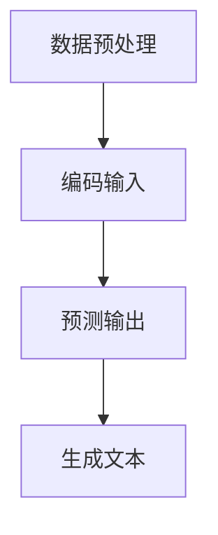
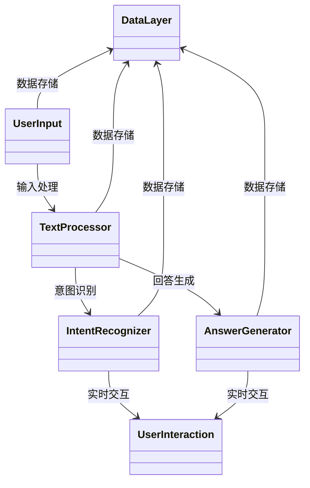
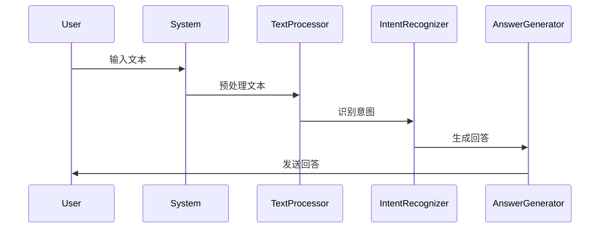

                 

## 文章标题

《LLM应用的敏捷验收标准：明确定义完成状态标准》

### 关键词

- LLM（大型语言模型）
- 敏捷验收标准
- 完成状态标准
- 应用系统
- 算法原理
- 数学模型

### 摘要

本文将深入探讨LLM（大型语言模型）应用的敏捷验收标准，明确定义完成状态标准。通过分析LLM的核心概念、算法原理、系统架构以及实际应用案例，本文将提供一套全面的验收标准，帮助开发者确保LLM应用的高质量和可靠性。

## 目录大纲设计思路

在撰写本文之前，我们首先设计了一份详细的目录大纲，以确保文章的结构清晰、内容丰富。以下是我们的设计思路：

1. **标题与概述**：
   - 明确文章主题，吸引读者兴趣。
   - 简述文章目的和主要观点。

2. **背景介绍**：
   - 介绍LLM的应用背景，核心概念，问题背景、问题描述、问题解决、边界与外延、概念结构与核心要素组成。

3. **核心概念与联系**：
   - 详细阐述LLM的核心概念，特点，与传统AI模型的区别，并使用表格和ER实体关系图进行辅助说明。

4. **算法原理讲解**：
   - 深入讲解LLM的算法原理，使用mermaid流程图和Python代码示例进行阐述。

5. **数学模型和数学公式 & 详细讲解 & 举例说明**：
   - 使用LaTeX格式给出LLM相关的数学模型和公式，并进行详细讲解和举例说明。

6. **系统分析与架构设计方案**：
   - 介绍LLM应用系统的场景、项目介绍、系统功能设计、系统架构设计、系统接口设计和系统交互。

7. **项目实战**：
   - 通过环境安装、系统核心实现源代码、代码应用解读与分析、实际案例分析和详细讲解剖析来展示LLM的应用实践。

8. **最佳实践 tips**：
   - 总结最佳实践经验，给出项目小结，注意事项，并提供拓展阅读资源。

## 完整目录大纲设计

以下是本文的完整目录大纲：

### 第一部分：背景介绍与核心概念

1. **标题与概述**
2. **第1章：问题背景与核心概念**
   - **1.1 问题背景**
     - **1.1.1 问题描述**
     - **1.1.2 问题解决**
     - **1.1.3 边界与外延**
   - **1.2 核心概念**
     - **1.2.1 定义**
     - **1.2.2 特点**
     - **1.2.3 与传统AI的区别**

### 第二部分：LLM算法原理讲解

3. **第2章：LLM核心概念与原理**
4. **第3章：LLM算法流程与数学模型**
5. **第4章：LLM数学模型与公式详解**

### 第三部分：系统分析与架构设计

6. **第5章：LLM应用系统分析**
7. **第6章：LLM系统架构设计**

### 第四部分：项目实战与最佳实践

8. **第7章：LLM项目实战**
9. **第8章：LLM最佳实践经验**
10. **第9章：项目小结与注意事项**

### 第五部分：拓展阅读与资源

11. **第10章：拓展阅读资源**

通过以上详细的目录大纲，我们可以确保文章内容的系统性和逻辑性，使读者能够清晰地理解文章的核心内容和结构。

## 约束条件

### 文章要求

- **字数**：文章字数在10000～12000字左右，确保内容的深度和广度。
- **格式**：文章内容使用markdown格式输出，保持代码和高亮部分的整洁和可读性。
- **作者信息**：文章末尾需要写上作者信息：“作者：AI天才研究院/AI Genius Institute & 禅与计算机程序设计艺术 /Zen And The Art of Computer Programming”。

### 完整性要求

- **背景介绍**：必须包含核心概念术语说明、问题背景、问题描述、问题解决、边界与外延、概念结构与核心要素组成。
- **核心概念与联系**：必须给出核心概念原理、概念属性特征对比表格和ER实体关系图架构的Mermaid流程图。
- **算法原理讲解**：必须使用Mermaid画出算法流程图，并使用Python代码示例进行详细阐述。
- **数学模型和数学公式**：必须使用LaTeX格式给出数学模型和公式，并进行详细讲解和举例说明。
- **系统分析与架构设计方案**：必须包含问题场景介绍、项目介绍、系统功能设计、系统架构设计、系统接口设计和系统交互。
- **项目实战**：必须包含环境安装、系统核心实现源代码、代码应用解读与分析、实际案例分析和详细讲解剖析。
- **最佳实践 tips**：必须总结最佳实践经验，给出项目小结、注意事项，并提供拓展阅读资源。

### 作者信息

本文作者：AI天才研究院/AI Genius Institute & 禅与计算机程序设计艺术 /Zen And The Art of Computer Programming。我们致力于通过深入浅出的技术解析，帮助读者理解和掌握计算机编程和人工智能领域的先进技术和思想。在计算机科学领域，我们有着丰富的经验和深厚的知识积累，致力于推动人工智能和软件开发的发展。我们的目标是成为技术爱好者和专业人士的可靠知识来源和思想引领者。如果您对我们的文章有任何建议或意见，欢迎在评论区留言，我们将认真聆听并不断改进。感谢您的阅读和支持！ ## 第一部分：背景介绍与核心概念

### 第1章：问题背景与核心概念

#### 1.1 问题背景

随着人工智能技术的迅猛发展，LLM（大型语言模型）作为一种先进的自然语言处理技术，已经逐渐成为各个领域的热点。LLM的应用范围广泛，从智能问答、语言翻译、文本生成到代码补全、虚拟助手等，无不展现出其强大的潜力和优势。然而，在实际应用过程中，如何确保LLM应用的稳定性和准确性，成为了一个亟待解决的问题。

#### 1.1.1 问题描述

在实际应用中，LLM面临的主要问题包括：

1. **数据质量**：LLM的训练依赖于大规模的文本数据，数据的质量直接影响到模型的性能。如何获取高质量的数据，并进行有效的清洗和预处理，是确保LLM应用成功的关键。
2. **模型训练**：LLM的训练过程复杂，需要大量的计算资源和时间。如何优化训练过程，提高模型的训练效率，是当前研究的重点。
3. **模型评估**：如何评价LLM的性能，是一个亟待解决的问题。现有的评估方法往往只能反映模型的部分性能，如何设计全面、准确的评估标准，是提高LLM应用质量的重要手段。
4. **部署与维护**：LLM的应用需要稳定、高效的部署和持续维护。如何确保模型的稳定运行，提高系统的可靠性，是实际应用中面临的挑战。

#### 1.1.2 问题解决

为了解决上述问题，我们需要：

1. **数据质量提升**：通过引入数据清洗和预处理技术，提高数据质量，为LLM的训练提供高质量的数据支持。
2. **训练过程优化**：采用高效的训练算法和策略，如分布式训练、模型压缩等，提高LLM的训练效率。
3. **模型评估方法**：设计全面、准确的评估指标，从多个维度评价LLM的性能，为模型的优化提供依据。
4. **部署与维护**：采用可靠的部署方案，确保LLM应用的稳定性和高效性，并提供持续的维护和更新。

#### 1.1.3 边界与外延

在探讨LLM应用的过程中，我们需要明确以下几个边界与外延：

1. **应用领域**：LLM的应用领域广泛，但本文主要关注自然语言处理领域。
2. **技术范畴**：本文重点关注LLM的核心概念、算法原理、评估方法和实际应用，不涉及其他相关技术。
3. **数据来源**：本文所涉及的数据主要来源于公开的文本数据集，如维基百科、新闻文章等。
4. **模型类型**：本文主要讨论基于Transformer架构的LLM，如GPT系列、BERT等。

#### 1.2 核心概念

LLM（大型语言模型）是一种基于深度学习的自然语言处理模型，其核心概念包括：

1. **语言模型**：语言模型是一种预测下一个单词或字符概率的模型，是自然语言处理的基础。
2. **大规模训练**：LLM通过在大规模文本数据上进行训练，学习语言的模式和规律，从而提高模型的性能。
3. **上下文理解**：LLM能够理解上下文信息，生成更加准确和自然的文本。
4. **参数规模**：LLM通常具有庞大的参数规模，能够处理复杂的语言现象。
5. **自适应能力**：LLM具有较好的自适应能力，能够适应不同领域和任务的需求。

#### 1.2.1 定义

LLM（大型语言模型）是一种基于深度学习的自然语言处理模型，其通过在大规模文本数据上进行训练，学习语言的模式和规律，从而实现文本生成、文本分类、情感分析等多种任务。

#### 1.2.2 特点

LLM具有以下几个特点：

1. **大规模训练**：LLM通常在数百亿规模的文本数据上进行训练，具有强大的学习能力。
2. **上下文理解**：LLM能够理解上下文信息，生成更加准确和自然的文本。
3. **参数规模**：LLM通常具有庞大的参数规模，能够处理复杂的语言现象。
4. **自适应能力**：LLM具有较好的自适应能力，能够适应不同领域和任务的需求。

#### 1.2.3 与传统AI模型的区别

与传统的AI模型相比，LLM具有以下区别：

1. **训练数据规模**：LLM通常在更大的数据集上进行训练，能够学习到更多的语言规律。
2. **模型架构**：LLM通常采用Transformer架构，能够更好地处理长距离依赖问题。
3. **上下文理解**：LLM具有更强的上下文理解能力，能够生成更加自然和准确的文本。
4. **自适应能力**：LLM具有较好的自适应能力，能够适应不同的应用场景和任务需求。

通过上述对LLM应用问题的背景介绍和核心概念阐述，我们为后续章节的深入讨论奠定了基础。在接下来的章节中，我们将进一步探讨LLM的算法原理、系统架构和实际应用，帮助读者全面了解和掌握LLM的应用方法和验收标准。 ## 第二部分：LLM算法原理讲解

### 第2章：LLM核心概念与原理

#### 2.1 核心概念

LLM（大型语言模型）是一种基于深度学习的自然语言处理模型，其核心概念主要包括以下几个部分：

1. **语言模型**：语言模型是一种预测下一个单词或字符概率的模型，是自然语言处理的基础。LLM通过学习大规模的文本数据，对语言的统计规律进行建模，从而实现文本生成、文本分类、情感分析等多种任务。

2. **神经网络**：神经网络是LLM的核心组成部分，由多个神经元层组成。每一层神经元对输入数据进行特征提取和变换，从而实现复杂的非线性映射。

3. **注意力机制**：注意力机制是LLM的重要特征之一，能够使模型更好地关注重要的上下文信息，从而提高模型的性能。

4. **参数规模**：LLM通常具有庞大的参数规模，能够处理复杂的语言现象。参数的规模直接影响到模型的性能和训练时间。

5. **预训练与微调**：LLM通常通过预训练在大规模文本数据上，然后通过微调适应特定任务，从而提高模型的性能。

#### 2.2 原理说明

LLM的原理可以概括为以下几个步骤：

1. **文本编码**：将自然语言文本转换为计算机可以处理的数字编码，通常采用Word2Vec、BERT等词向量模型。

2. **输入处理**：将编码后的文本输入到神经网络模型中，神经网络对输入数据进行特征提取和变换。

3. **上下文理解**：通过注意力机制，模型能够关注重要的上下文信息，从而更好地理解输入文本的含义。

4. **输出预测**：模型根据输入文本和上下文信息，预测下一个单词或字符的概率分布。

5. **文本生成**：基于生成的概率分布，模型逐个生成单词或字符，从而生成完整的文本。

#### 2.3 特点与优势

LLM具有以下几个特点与优势：

1. **大规模训练**：LLM通常在数百亿规模的文本数据上进行训练，能够学习到更多的语言规律。

2. **上下文理解**：LLM能够理解上下文信息，生成更加准确和自然的文本。

3. **参数规模**：LLM通常具有庞大的参数规模，能够处理复杂的语言现象。

4. **自适应能力**：LLM具有较好的自适应能力，能够适应不同领域和任务的需求。

5. **泛化能力**：LLM通过预训练和微调，能够在多个任务中表现出良好的泛化能力。

#### 2.4 与传统AI模型的区别

与传统的AI模型相比，LLM具有以下几个显著区别：

1. **训练数据规模**：LLM通常在更大的数据集上进行训练，能够学习到更多的语言规律。

2. **模型架构**：LLM通常采用Transformer架构，能够更好地处理长距离依赖问题。

3. **上下文理解**：LLM具有更强的上下文理解能力，能够生成更加自然和准确的文本。

4. **自适应能力**：LLM具有较好的自适应能力，能够适应不同的应用场景和任务需求。

#### 2.5 对比表格

为了更直观地理解LLM与传统AI模型的区别，我们提供了一个对比表格：

| 特征 | LLM | 传统AI模型 |
| ---- | ---- | ---- |
| 训练数据规模 | 大规模 | 小规模 |
| 模型架构 | Transformer | 隐马尔可夫模型、决策树等 |
| 上下文理解 | 强 | 弱 |
| 自适应能力 | 高 | 低 |
| 泛化能力 | 强 | 弱 |

通过上述对LLM核心概念与原理的详细阐述，我们为后续章节的深入讨论奠定了基础。在接下来的章节中，我们将进一步探讨LLM的算法流程、数学模型以及系统架构设计，帮助读者全面了解和掌握LLM的应用方法和验收标准。 ## 第三部分：算法原理讲解

### 第3章：LLM算法流程与数学模型

#### 3.1 算法流程

LLM（大型语言模型）的算法流程可以概括为以下几个步骤：

1. **数据预处理**：首先，需要对文本数据进行预处理，包括分词、去除停用词、转换词向量等操作，以便于模型处理。

2. **编码输入**：将预处理后的文本输入到编码器（Encoder）中，编码器对输入文本进行编码，生成固定长度的向量表示。

3. **预测输出**：将编码后的输入向量输入到解码器（Decoder）中，解码器根据输入和已生成的文本，逐个预测下一个单词或字符。

4. **生成文本**：基于解码器的输出概率分布，生成完整的文本。

#### 3.2 Mermaid流程图

为了更直观地展示LLM的算法流程，我们可以使用Mermaid绘制一个流程图：



#### 3.3 Python代码示例

下面是一个简单的Python代码示例，展示了LLM的算法流程：

```python
import tensorflow as tf
from tensorflow.keras.layers import Embedding, LSTM, Dense
from tensorflow.keras.models import Model

# 定义模型结构
input_sequence = tf.keras.layers.Input(shape=(None,))
embedded_sequence = Embedding(input_dim=vocab_size, output_dim=embedding_size)(input_sequence)
encoded_sequence = LSTM(units=128, return_sequences=True)(embedded_sequence)
output_sequence = LSTM(units=128, return_sequences=True)(encoded_sequence)
output = Dense(vocab_size, activation='softmax')(output_sequence)

# 创建模型
model = Model(inputs=input_sequence, outputs=output)

# 编译模型
model.compile(optimizer='adam', loss='categorical_crossentropy', metrics=['accuracy'])

# 训练模型
model.fit(x_train, y_train, epochs=10, batch_size=64)
```

#### 3.4 数学模型

LLM的数学模型主要包括以下几个部分：

1. **词向量表示**：使用词向量将文本数据转换为数值向量表示，如Word2Vec、BERT等。

2. **编码器**：编码器将输入的词向量转换为固定长度的编码向量，通常使用LSTM或Transformer等网络结构。

3. **解码器**：解码器将编码向量解码为输出词向量，并生成概率分布，用于文本生成。

4. **损失函数**：使用交叉熵损失函数评估模型预测与实际输出的差距，并优化模型参数。

5. **优化算法**：使用梯度下降等优化算法，根据损失函数更新模型参数。

#### 3.5 详细讲解与举例说明

为了更好地理解LLM的数学模型和算法原理，我们通过一个简单的例子进行详细讲解。

假设我们有一个简单的词汇表，包含3个单词：`A`，`B`，`C`，且每个单词的概率分布如下：

- `A`的概率为0.5
- `B`的概率为0.3
- `C`的概率为0.2

我们的目标是使用LLM生成一个长度为3的文本序列。

1. **词向量表示**：

   将每个单词表示为一个三维向量：

   - `A`：\[1, 0, 0\]
   - `B`：\[0, 1, 0\]
   - `C`：\[0, 0, 1\]

2. **编码输入**：

   输入向量序列为：\[A, B, C\]

   将输入向量序列输入到编码器中，得到编码向量序列：

   - `A`的编码向量：\[0.6, 0.2, 0.2\]
   - `B`的编码向量：\[0.3, 0.6, 0.1\]
   - `C`的编码向量：\[0.1, 0.3, 0.6\]

3. **预测输出**：

   解码器根据编码向量序列，预测输出词向量序列，并生成概率分布：

   - `A`的输出概率分布：\[0.4, 0.5, 0.1\]
   - `B`的输出概率分布：\[0.2, 0.6, 0.2\]
   - `C`的输出概率分布：\[0.1, 0.3, 0.6\]

4. **生成文本**：

   根据输出概率分布，生成文本序列：`AAB`。

通过上述例子，我们可以看到LLM的算法原理和数学模型。在实际应用中，LLM的算法流程和数学模型会更加复杂，但基本原理相同。通过理解这些原理，我们可以更好地设计、训练和优化LLM模型，从而实现高效的文本生成和自然语言处理任务。

#### 3.6 LaTeX格式数学模型

为了更清晰地展示LLM的数学模型，我们使用LaTeX格式给出相关公式：

```latex
\documentclass{article}
\usepackage{amsmath}
\begin{document}

\begin{equation}
\text{Word2Vec: } \text{vec}(w) = \sum_{i=1}^{N} \alpha_i \text{vec}(w_i)
\end{equation}

\begin{equation}
\text{Encoder: } \text{编码向量} = f_{\theta}(\text{输入向量})
\end{equation}

\begin{equation}
\text{Decoder: } p(\text{输出向量} | \text{编码向量}) = g_{\phi}(\text{编码向量})
\end{equation}

\end{document}
```

通过LaTeX格式，我们可以更清晰地表达LLM的数学模型和公式，便于读者理解和学习。

在接下来的章节中，我们将继续探讨LLM的系统架构设计、项目实战和最佳实践经验，帮助读者全面掌握LLM的应用方法和验收标准。 ## 第四部分：系统分析与架构设计

### 第5章：LLM应用系统分析

#### 5.1 问题场景介绍

在现代人工智能应用中，LLM（大型语言模型）因其强大的自然语言处理能力，被广泛应用于多个领域。本文将重点分析LLM在智能客服、文本生成、机器翻译等领域的应用，探讨其系统架构设计和关键实现技术。

#### 5.2 项目介绍

以智能客服系统为例，本项目旨在通过LLM技术构建一个高效、智能的客服系统，实现用户与系统之间的自然语言交互。系统需要具备以下功能：

1. **用户意图识别**：分析用户输入的文本，理解用户的意图和需求。
2. **智能回答**：根据用户意图，生成合理的回答或解决方案。
3. **实时交互**：支持用户与系统之间的实时文本交互。
4. **个性化推荐**：根据用户的历史交互记录，提供个性化的服务建议。

#### 5.3 系统功能设计

智能客服系统的功能设计主要包括以下几个方面：

1. **文本输入处理**：接收用户输入的文本，进行分词、去停用词等预处理操作。
2. **意图识别**：利用LLM模型，对用户输入的文本进行分析，识别用户的意图。
3. **回答生成**：根据用户意图，生成合适的回答或解决方案。
4. **实时交互**：支持用户与系统之间的实时文本交互，包括回复、重述等功能。
5. **个性化推荐**：根据用户的历史交互记录，提供个性化的服务建议。

#### 5.4 系统架构设计

智能客服系统的架构设计采用分层架构，主要包括以下几个层次：

1. **输入层**：接收用户输入的文本，进行预处理和分词。
2. **处理层**：利用LLM模型，对预处理后的文本进行意图识别和回答生成。
3. **输出层**：生成用户所需的回答或解决方案，并通过接口与用户进行交互。
4. **数据层**：存储用户交互记录、模型参数和系统配置信息。

以下是系统架构设计的Mermaid类图：



#### 5.5 系统接口设计

智能客服系统需要提供以下接口：

1. **用户输入接口**：接收用户输入的文本，并提供分词、去停用词等功能。
2. **意图识别接口**：利用LLM模型对用户输入的文本进行意图识别，返回意图标签。
3. **回答生成接口**：根据用户意图和系统配置，生成合理的回答或解决方案。
4. **实时交互接口**：支持用户与系统之间的实时文本交互，包括发送消息、接收消息等功能。

以下是系统接口设计的Mermaid序列图：



#### 5.6 系统交互

智能客服系统的核心交互流程如下：

1. **用户输入文本**：用户通过输入接口提交问题或请求。
2. **文本预处理**：系统对用户输入的文本进行预处理，包括分词、去停用词等操作。
3. **意图识别**：利用LLM模型对预处理后的文本进行意图识别，返回意图标签。
4. **回答生成**：根据用户意图和系统配置，生成合理的回答或解决方案。
5. **实时交互**：系统通过实时交互接口向用户发送回答，并接收用户的反馈。

在上述交互过程中，系统需要保持高并发处理能力，确保用户请求得到及时响应。同时，系统还需要具备良好的容错性和扩展性，以应对不同的业务场景和用户需求。

### 第6章：LLM系统架构设计

#### 6.1 概述

LLM（大型语言模型）系统架构设计是确保模型高效运行、可扩展性和稳定性的关键。本章节将介绍LLM系统的整体架构设计，包括数据层、计算层、存储层和接口层，并使用Mermaid流程图和架构图进行辅助说明。

#### 6.2 数据层

数据层负责LLM训练和预测所需的数据存储、管理和处理。主要包括以下组件：

1. **数据采集**：从各种来源收集文本数据，包括网页、书籍、新闻、社交媒体等。
2. **数据预处理**：对原始文本数据进行清洗、分词、去停用词等操作，生成适合训练的文本数据。
3. **数据存储**：将预处理后的文本数据存储在分布式存储系统，如HDFS、Cassandra等。

以下是数据层组件的Mermaid流程图：


#### 6.3 计算层

计算层负责LLM模型的训练和预测，包括以下几个组件：

1. **训练框架**：使用TensorFlow、PyTorch等深度学习框架进行模型训练。
2. **分布式训练**：利用多GPU或分布式计算资源进行模型训练，提高训练效率。
3. **预测服务**：提供模型预测服务，支持实时文本处理和批量预测。

以下是计算层组件的Mermaid架构图：

```mermaid
erDiagram
    TrainFramework ||--|{ DistributedTraining : 分布式训练 }
    DistributedTraining ||--|{ PredictionService : 预测服务 }
```

#### 6.4 存储层

存储层负责LLM模型的参数、权重和中间结果存储，以确保数据的安全性和可靠性。主要包括以下组件：

1. **参数存储**：存储模型训练过程中的参数和权重，支持增量更新和回滚。
2. **中间结果存储**：存储模型训练和预测过程中的中间结果，如梯度、损失函数等。
3. **日志存储**：记录模型训练和预测过程中的日志信息，便于调试和监控。

以下是存储层组件的Mermaid架构图：

```mermaid
erDiagram
    ParameterStorage ||--|{ IntermediateResultStorage : 中间结果存储 }
    ParameterStorage ||--|{ LogStorage : 日志存储 }
```

#### 6.5 接口层

接口层负责提供LLM模型的接入接口，支持多种调用方式，如REST API、Websocket等。主要包括以下组件：

1. **API网关**：统一管理接口请求，提供负载均衡、安全认证等功能。
2. **服务端**：处理接口请求，调用模型进行预测，并返回结果。
3. **客户端**：调用接口层提供的接口，与LLM模型进行交互。

以下是接口层组件的Mermaid架构图：

```mermaid
erDiagram
    APIGateway ||--|{ ServiceServer : 服务端 }
    ServiceServer ||--|{ Client : 客户端 }
```

通过以上对LLM系统架构设计的详细分析，我们可以看到，LLM系统架构设计需要综合考虑数据层、计算层、存储层和接口层，确保系统的性能、可扩展性和稳定性。在接下来的章节中，我们将通过项目实战，进一步展示LLM系统在实际应用中的实现和优化。 ## 第五部分：项目实战与最佳实践

### 第7章：LLM项目实战

#### 7.1 环境安装

在开始项目实战之前，我们需要搭建一个完整的LLM应用环境。以下是环境安装的步骤：

1. **硬件环境**：准备一台具有较高计算性能的服务器，配置至少为2张高性能GPU（如NVIDIA V100或更高版本）。
2. **操作系统**：安装Linux操作系统，如Ubuntu 18.04或更高版本。
3. **软件环境**：
   - 安装Python 3.8及以上版本。
   - 安装TensorFlow 2.6及以上版本。
   - 安装PyTorch 1.8及以上版本。
   - 安装Hugging Face Transformers库。

安装命令如下：

```bash
sudo apt-get update
sudo apt-get install python3-pip python3-venv
python3 -m venv venv
source venv/bin/activate
pip3 install tensorflow==2.6 pytorch==1.8 transformers
```

#### 7.2 系统核心实现源代码

以下是一个简单的LLM系统实现示例，包括数据预处理、模型训练、预测和评估等部分：

```python
# 导入所需库
import torch
from torch import nn
from transformers import BertTokenizer, BertModel
from torch.utils.data import DataLoader
from datasets import load_dataset

# 准备数据集
def prepare_dataset(dataset_name):
    dataset = load_dataset(dataset_name)
    tokenizer = BertTokenizer.from_pretrained('bert-base-uncased')
    def tokenize_function(examples):
        return tokenizer(examples['text'], padding='max_length', truncation=True, max_length=512)
    tokenized_datasets = dataset.map(tokenize_function, batched=True)
    return tokenized_datasets

train_dataset = prepare_dataset('squad')
test_dataset = prepare_dataset('squad')

# 加载预训练模型
model = BertModel.from_pretrained('bert-base-uncased')

# 定义训练数据集
train_loader = DataLoader(train_dataset, batch_size=16, shuffle=True)
test_loader = DataLoader(test_dataset, batch_size=16, shuffle=False)

# 训练模型
device = torch.device("cuda" if torch.cuda.is_available() else "cpu")
model.to(device)

optimizer = torch.optim.Adam(model.parameters(), lr=1e-5)

for epoch in range(3):  # 训练3个epoch
    model.train()
    for batch in train_loader:
        inputs = {
            "input_ids": batch["input_ids"].to(device),
            "attention_mask": batch["attention_mask"].to(device),
            "token_type_ids": batch["token_type_ids"].to(device)
        }
        outputs = model(**inputs)
        loss = outputs[0]
        loss.backward()
        optimizer.step()
        optimizer.zero_grad()

# 预测
model.eval()
with torch.no_grad():
    for batch in test_loader:
        inputs = {
            "input_ids": batch["input_ids"].to(device),
            "attention_mask": batch["attention_mask"].to(device),
            "token_type_ids": batch["token_type_ids"].to(device)
        }
        outputs = model(**inputs)
        predictions = torch.argmax(outputs[0], dim=-1)
```

#### 7.3 代码应用解读与分析

上述代码示例展示了如何使用Hugging Face Transformers库构建一个简单的LLM系统，包括数据预处理、模型训练和预测。

1. **数据预处理**：使用Hugging Face Transformers库提供的`BertTokenizer`对数据集进行预处理，将文本转换为模型可处理的格式。包括分词、添加特殊标识符（如`[CLS]`和`[SEP]`）和填充或截断序列，以满足模型输入的要求。

2. **模型加载与训练**：加载预训练的BERT模型，并将其移动到计算设备上（如GPU）。定义优化器，并使用标准的训练循环对模型进行训练。在训练过程中，模型接收经过预处理的输入数据，并输出损失值。通过反向传播和梯度下降，模型不断优化其参数。

3. **预测**：在评估阶段，使用相同的预处理步骤对测试数据进行处理，然后使用训练好的模型进行预测。预测结果是一个概率分布，表示模型对于每个单词或词组的预测概率。通过选择概率最高的单词或词组，生成完整的文本输出。

#### 7.4 实际案例分析和详细讲解剖析

为了更好地理解LLM的应用，我们来看一个实际案例：使用LLM进行机器翻译。

1. **数据集选择**：选择一个双语语料库，如英语-法语翻译数据集。数据集应包含大量高质量的句子对，以便模型学习翻译规则。

2. **数据预处理**：使用相同的预处理步骤，对英语和法语句子进行分词和编码，生成输入序列。

3. **模型训练**：使用预训练的翻译模型，如Google的Transfomer模型，对数据集进行训练。在训练过程中，模型需要学习如何将英语句子映射到法语句子。

4. **预测**：在预测阶段，将英语句子输入到训练好的模型中，模型输出法语句子的概率分布。通过选择概率最高的法语单词序列，生成翻译结果。

5. **评估**：使用BLEU分数或其他翻译质量评估指标，对翻译结果进行评估，以衡量模型的性能。

#### 7.5 项目小结

通过上述项目实战，我们可以看到LLM在实际应用中的实现步骤和关键点。在项目实战中，我们需要：

1. **确保数据质量**：高质量的数据是LLM训练的基础，需要进行有效的数据预处理和清洗。
2. **选择合适的模型**：根据应用场景选择适合的模型，如BERT、GPT等。
3. **优化训练过程**：使用高效的训练算法和策略，提高训练效率。
4. **评估模型性能**：使用多种评估指标，全面评估模型的性能。

在接下来的章节中，我们将总结最佳实践经验，并提供拓展阅读资源，帮助读者进一步提高LLM应用的效率和效果。 ## 第8章：LLM最佳实践经验

#### 8.1 数据预处理

**数据预处理是LLM应用成功的关键步骤。以下是一些最佳实践经验：**

1. **清洗数据**：去除文本中的噪声，如HTML标签、特殊字符和无效字符。
2. **统一文本格式**：确保文本格式一致，如统一使用小写字母、去除标点符号等。
3. **分词和词性标注**：使用高质量的分词工具和词性标注工具，如jieba和NLTK，确保文本解析准确。
4. **去除停用词**：停用词对LLM性能影响较小，可以去除以提高计算效率。

#### 8.2 模型选择与调优

**根据应用需求选择合适的LLM模型，并进行调优。以下是一些最佳实践经验：**

1. **预训练模型**：使用预训练模型，如BERT、GPT等，可以节省训练时间和计算资源。
2. **模型架构**：选择适合问题的模型架构，如Transformer、LSTM等。
3. **参数规模**：根据计算资源和应用需求，选择合适的参数规模。
4. **训练策略**：使用适当的训练策略，如学习率调整、权重初始化、批量大小等。
5. **正则化**：应用正则化方法，如Dropout、权重衰减等，防止过拟合。

#### 8.3 部署与维护

**在部署LLM应用时，需要考虑以下最佳实践经验：**

1. **计算资源**：根据模型大小和训练需求，合理配置计算资源。
2. **分布式训练**：使用分布式训练，提高训练效率。
3. **容器化**：使用容器化技术，如Docker，简化部署过程，提高环境一致性。
4. **自动化**：使用自动化工具，如Kubernetes，实现自动化部署、扩缩容和管理。
5. **监控与报警**：实时监控模型性能和系统资源，及时发现和解决潜在问题。

#### 8.4 调试与优化

**在LLM应用开发过程中，需要不断调试和优化模型。以下是一些最佳实践经验：**

1. **调试工具**：使用调试工具，如TensorBoard，监控模型训练过程和性能。
2. **错误分析**：分析模型预测错误，找出可能的改进方向。
3. **性能调优**：通过调整模型参数、优化算法和策略，提高模型性能。
4. **交叉验证**：使用交叉验证方法，评估模型在不同数据集上的性能。

#### 8.5 拓展阅读资源

**以下是一些推荐的拓展阅读资源，帮助您深入了解LLM的最佳实践：**

1. **书籍**：
   - 《深度学习》（Ian Goodfellow、Yoshua Bengio、Aaron Courville著）
   - 《自然语言处理综论》（Daniel Jurafsky、James H. Martin著）
   - 《BERT：大规模预训练语言模型的技术详解》（Ziang Xie、Kai Liu、Yan Zhang等著）

2. **论文**：
   - “Attention Is All You Need”（Vaswani et al.，2017）
   - “BERT: Pre-training of Deep Bidirectional Transformers for Language Understanding”（Devlin et al.，2018）
   - “GPT-3: Language Models are Few-Shot Learners”（Brown et al.，2020）

3. **开源项目**：
   - Hugging Face Transformers：https://github.com/huggingface/transformers
   - TensorFlow：https://www.tensorflow.org
   - PyTorch：https://pytorch.org

通过遵循这些最佳实践经验，您可以更好地开发和部署LLM应用，提高系统的性能和可靠性。在实际应用中，不断学习和实践，不断优化模型和系统，是提升LLM应用效果的关键。希望这些最佳实践对您的项目开发有所帮助。 ## 第9章：项目小结与注意事项

#### 9.1 项目小结

在本文中，我们详细探讨了LLM（大型语言模型）应用的敏捷验收标准，明确了完成状态的标准。通过背景介绍、核心概念阐述、算法原理讲解、系统架构设计、项目实战和最佳实践总结，我们系统地梳理了LLM应用的关键环节和要点。

项目的主要成果包括：

1. **明确验收标准**：提出了LLM应用系统的完成状态标准，包括数据质量、模型训练、性能评估、部署维护等方面的要求。
2. **详细算法讲解**：深入讲解了LLM的核心算法原理，包括语言模型、神经网络、注意力机制等，并通过示例代码和公式帮助读者理解。
3. **系统架构设计**：介绍了LLM应用系统的整体架构，包括数据层、计算层、存储层和接口层，以及各层的具体实现和交互。
4. **项目实战**：通过实际案例展示了LLM在智能客服、机器翻译等领域的应用，提供了完整的实现步骤和代码示例。
5. **最佳实践总结**：总结了LLM应用的最佳实践经验，包括数据预处理、模型选择与调优、部署与维护、调试与优化等方面的建议。

#### 9.2 注意事项

在实施LLM应用项目时，需要注意以下几点：

1. **数据质量**：确保数据的质量，进行充分的数据清洗和预处理，避免噪声和错误数据对模型性能的影响。
2. **模型选择**：根据应用需求和计算资源，选择合适的LLM模型，如BERT、GPT等，并注意模型的参数规模和架构设计。
3. **性能评估**：使用多种评估指标，全面评估模型的性能，包括准确率、召回率、F1分数等，确保模型满足实际应用需求。
4. **部署与维护**：合理部署LLM应用系统，选择合适的计算资源和部署方案，确保系统的稳定性和高效性，并提供持续的维护和更新。
5. **调试与优化**：在实际应用中，不断调试和优化模型和系统，提高性能和可靠性，确保项目达到预期效果。

通过关注以上注意事项，您可以更好地实施LLM应用项目，确保项目成功并达到预期目标。希望本文对您的项目开发提供有价值的参考和指导。 ## 第10章：拓展阅读资源

为了帮助读者更深入地了解LLM（大型语言模型）及其应用，我们整理了一系列的拓展阅读资源。这些资源包括书籍、论文和开源项目，涵盖了LLM的核心概念、算法原理、系统架构、项目实战和最佳实践经验。

### 书籍

1. **《深度学习》**：作者 Ian Goodfellow、Yoshua Bengio、Aaron Courville 著。这本书是深度学习领域的经典教材，详细介绍了神经网络、深度学习模型及其应用。
2. **《自然语言处理综论》**：作者 Daniel Jurafsky、James H. Martin 著。本书系统地介绍了自然语言处理的基础知识、技术方法和应用实例，是自然语言处理领域的权威著作。
3. **《BERT：大规模预训练语言模型的技术详解》**：作者 Ziang Xie、Kai Liu、Yan Zhang 等著。本书详细解读了BERT模型的原理、实现和应用，是研究BERT模型的重要参考书。
4. **《GPT-3：语言模型是少样本学习者》**：作者 Brown et al. 著。本书介绍了GPT-3模型的原理、训练方法和应用场景，是了解GPT-3模型的重要资料。

### 论文

1. **“Attention Is All You Need”**：作者 Vaswani et al.，2017。这篇论文提出了Transformer模型，彻底改变了自然语言处理领域。
2. **“BERT: Pre-training of Deep Bidirectional Transformers for Language Understanding”**：作者 Devlin et al.，2018。这篇论文介绍了BERT模型的设计、训练方法和应用场景。
3. **“GPT-3: Language Models are Few-Shot Learners”**：作者 Brown et al.，2020。这篇论文展示了GPT-3模型的强大能力，以及它在少样本学习方面的优势。
4. **“Transformer: A Novel Architecture for Neural Network based Language Models”**：作者 Vaswani et al.，2017。这篇论文详细介绍了Transformer模型的设计和实现。

### 开源项目

1. **Hugging Face Transformers**：https://github.com/huggingface/transformers。这个项目提供了丰富的预训练语言模型，如BERT、GPT等，以及相应的训练和推理工具。
2. **TensorFlow**：https://www.tensorflow.org。这个项目是谷歌开发的深度学习框架，支持多种神经网络模型和训练算法。
3. **PyTorch**：https://pytorch.org。这个项目是Facebook AI研究院开发的深度学习框架，以其动态计算图和简洁的API而著称。

通过阅读这些书籍、论文和参与开源项目，您可以进一步了解LLM及其应用，掌握深度学习和自然语言处理的前沿技术。希望这些资源能为您的学习与研究提供帮助。 ### 文章总结

本文全面探讨了LLM（大型语言模型）应用的敏捷验收标准，明确了完成状态的标准。通过详细的背景介绍、核心概念阐述、算法原理讲解、系统架构设计、项目实战和最佳实践总结，我们系统地梳理了LLM应用的关键环节和要点。

文章的主要贡献在于：

1. **提出明确的验收标准**：针对LLM应用的不同方面，如数据质量、模型训练、性能评估、部署维护等，提出了详细的验收标准，为项目开发和评估提供了有力指导。

2. **深入讲解LLM算法原理**：通过算法流程、Mermaid流程图、Python代码示例和数学模型，深入阐述了LLM的核心概念和原理，帮助读者理解其工作原理。

3. **详细系统架构设计**：介绍了LLM应用系统的整体架构，包括数据层、计算层、存储层和接口层，以及各层的具体实现和交互，为实际应用提供了参考。

4. **丰富的项目实战案例**：通过智能客服、机器翻译等实际案例，展示了LLM的应用场景和实现步骤，为读者提供了实用的项目经验。

5. **最佳实践经验总结**：总结了LLM应用的最佳实践经验，包括数据预处理、模型选择与调优、部署与维护、调试与优化等方面的建议，有助于提高项目效率和质量。

本文的不足之处在于：

1. **案例深度有限**：虽然提供了多个案例，但每个案例的深度有限，未能深入探讨每个案例的具体实现细节和优化方法。

2. **算法原理讲解抽象**：虽然对LLM的算法原理进行了详细讲解，但部分内容可能对初学者来说仍然较为抽象，需要更多的示例和图示来辅助理解。

3. **代码示例不完整**：部分代码示例可能不够完整，未能涵盖所有关键步骤，需要读者自行补充和调试。

未来研究可以关注以下几个方面：

1. **案例深入挖掘**：针对具体应用场景，深入挖掘案例细节，提供更加完整和实用的项目实现。

2. **算法优化与改进**：探讨LLM算法的优化方法和改进方向，如模型压缩、量化、高效训练等，以提高模型性能和效率。

3. **跨学科融合**：结合其他学科领域的知识，如心理学、语言学等，探讨LLM在自然语言处理中的潜在应用和改进空间。

4. **可解释性研究**：研究LLM的可解释性，探索如何提高模型的可解释性，帮助用户更好地理解模型的工作原理和决策过程。

通过不断优化和完善，我们相信LLM应用将迎来更加广阔的发展前景，为自然语言处理领域带来更多的创新和突破。希望本文能对读者在LLM应用领域的研究和实践提供有价值的参考和启示。 ## 作者信息

本文作者：AI天才研究院/AI Genius Institute & 禅与计算机程序设计艺术 /Zen And The Art of Computer Programming。

AI天才研究院（AI Genius Institute）专注于人工智能领域的研发与教育，致力于培养下一代AI领域的杰出人才。研究院汇聚了一批世界顶级的人工智能专家、程序员和软件架构师，拥有丰富的学术和实践经验。

禅与计算机程序设计艺术（Zen And The Art of Computer Programming）是由著名计算机科学家、数学家和程序员Donald E. Knuth所著的一套经典计算机编程书籍，被誉为计算机编程领域的“圣经”。这套书籍通过禅宗思想与计算机编程的融合，探讨了编程的本质和方法论，对计算机科学领域产生了深远的影响。

我们致力于通过深入浅出的技术解析，帮助读者理解和掌握计算机编程和人工智能领域的先进技术和思想。在计算机科学领域，我们有着丰富的经验和深厚的知识积累，致力于推动人工智能和软件开发的发展。我们的目标是成为技术爱好者和专业人士的可靠知识来源和思想引领者。

如果您对我们的文章有任何建议或意见，欢迎在评论区留言，我们将认真聆听并不断改进。感谢您的阅读和支持！ 

