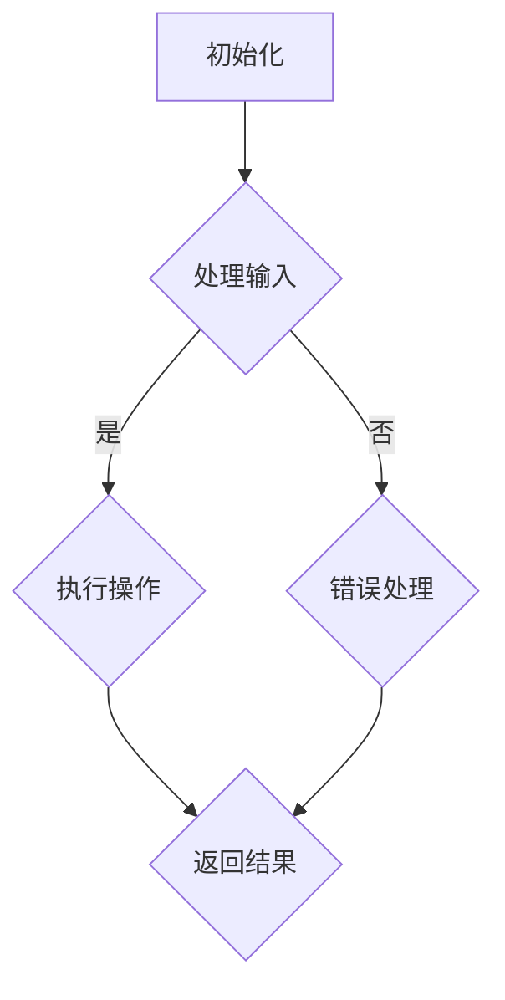

                 

# LLM应用的行为驱动开发（BDD）：促进沟通和协作

## 关键词：
- 行为驱动开发
- 大型语言模型
- 沟通协作
- 软件开发流程
- 自动化测试

## 摘要：
本文深入探讨了行为驱动开发（Behavior-Driven Development，简称BDD）在大型语言模型（Large Language Model，简称LLM）应用中的实践。通过分析BDD的核心原则和流程，本文详细阐述了如何将BDD应用于LLM开发，以促进团队沟通和协作，提高开发效率和项目质量。文章还介绍了BDD实施的关键策略、工具与实践，并通过对实际案例的分析，总结了BDD在LLM开发中的成功经验和未来展望。

## 目录大纲设计过程

在设计《LLM应用的行为驱动开发（BDD）：促进沟通和协作》这本书的目录大纲时，我们遵循以下步骤：

### 确定书籍主题和目标读者

首先，我们明确了书籍的主题是BDD在LLM应用中的实践，目标读者包括软件开发工程师、测试工程师、项目经理等。

### 梳理核心章节

核心章节包括背景介绍、BDD基础、LLM应用场景、BDD实施策略、BDD工具和实践、案例分析以及总结与展望。

### 设计章节细节

每个章节细化到二级和三级标题，确保内容条理清晰。针对核心概念、算法原理、数学模型等，使用Mermaid和LaTeX格式增加可读性和专业性。

### 格式标准化

使用Markdown格式确保目录大纲的可读性和规范性。

## 目录大纲内容设计

### 第一部分：背景与基础

### 第1章：BDD与LLM概述

#### 1.1 BDD背景

##### 1.1.1 BDD的概念

##### 1.1.2 BDD的核心原则

##### 1.1.3 BDD与传统测试方法对比

#### 1.2 LLM背景

##### 1.2.1 LLM的定义

##### 1.2.2 LLM的发展历程

##### 1.2.3 LLM的应用领域

#### 1.3 BDD与LLM结合的意义

##### 1.3.1 提升开发效率

##### 1.3.2 提高协作质量

##### 1.3.4 避免需求偏差

### 第二部分：BDD基础

### 第2章：BDD核心概念与流程

#### 2.1 BDD核心概念

##### 2.1.1 行为驱动开发（BDD）

##### 2.1.2 用户故事

##### 2.1.3 特性映射

#### 2.2 BDD流程

##### 2.2.1 需求收集

##### 2.2.2 用户故事地图

##### 2.2.3 特性开发

##### 2.2.4 特性验收

### 第三部分：LLM应用场景

### 第3章：BDD在LLM开发中的应用

#### 3.1 LLM项目开发流程

##### 3.1.1 需求分析

##### 3.1.2 数据准备

##### 3.1.3 模型选择

##### 3.1.4 模型训练与调优

#### 3.2 BDD在LLM开发中的应用

##### 3.2.1 用户故事映射

##### 3.2.2 行为驱动测试

##### 3.2.3 持续集成与交付

### 第四部分：BDD实施策略

### 第4章：BDD实施策略

#### 4.1 BDD实施关键因素

##### 4.1.1 文化变革

##### 4.1.2 团队协作

##### 4.1.3 工具选择

#### 4.2 BDD在LLM项目中的具体实施

##### 4.2.1 需求定义与梳理

##### 4.2.2 用户故事编写

##### 4.2.3 行为驱动测试案例设计

##### 4.2.4 持续反馈与迭代

### 第五部分：BDD工具与实践

### 第5章：BDD工具与框架

#### 5.1 BDD常用工具

##### 5.1.1 Cucumber

##### 5.1.2 Gherkin语法

##### 5.1.3 JBehave

#### 5.2 BDD框架搭建

##### 5.2.1 BDD框架设计

##### 5.2.2 BDD工具集成

##### 5.2.3 持续集成环境配置

### 第六部分：案例分析

### 第6章：BDD在LLM项目中的成功实践

#### 6.1 项目背景

##### 6.1.1 项目简介

##### 6.1.2 项目挑战

#### 6.2 BDD实施过程

##### 6.2.1 需求分析

##### 6.2.2 用户故事编写

##### 6.2.3 行为驱动测试设计

##### 6.2.4 持续集成与交付

#### 6.3 项目成果

##### 6.3.1 效率提升

##### 6.3.2 团队协作

##### 6.3.3 项目质量

### 第七部分：总结与展望

### 第7章：BDD在LLM开发中的展望

#### 7.1 BDD发展趋势

##### 7.1.1 自动化测试

##### 7.1.2 AI技术融合

##### 7.1.3 工具生态发展

#### 7.2 BDD应用建议

##### 7.2.1 实施前的准备

##### 7.2.2 实施中的关键点

##### 7.2.3 持续改进的方向

##### 7.2.4 拓展应用领域

### 总结：
本目录大纲覆盖了《LLM应用的行为驱动开发（BDD）：促进沟通和协作》的核心内容，从背景介绍、基础理论、实际应用、实施策略、工具实践到案例分析，最后对未来发展方向进行了展望。每个章节都进行了详细的规划，以确保内容的完整性和丰富性。

## 第一部分：背景与基础

### 第1章：BDD与LLM概述

#### 1.1 BDD背景

行为驱动开发（Behavior-Driven Development，简称BDD）是一种敏捷开发方法，旨在提高团队之间的沟通效率和软件质量。BDD的核心思想是通过编写可执行的测试案例，确保软件功能符合用户需求和预期。这种方法强调了开发人员、测试人员和业务人员之间的协作，有助于减少误解和沟通障碍。

##### 1.1.1 BDD的概念

BDD是一种基于测试驱动的开发方法，它通过行为测试来定义和验证软件功能。在BDD中，测试案例通常使用自然语言编写，使得非技术人员也能理解和参与测试过程。BDD的核心概念包括用户故事、特性映射和场景测试。

##### 1.1.2 BDD的核心原则

BDD的核心原则包括：

1. **业务驱动**：BDD强调业务需求驱动开发，确保开发工作始终围绕用户价值进行。
2. **共同语言**：通过使用自然语言编写测试案例，使得团队成员能够使用共同的语言进行沟通。
3. **持续集成**：BDD支持持续集成和持续交付，确保代码在每次提交后都能通过测试。
4. **自动化测试**：BDD鼓励编写自动化测试案例，以减少重复工作和提高测试效率。

##### 1.1.3 BDD与传统测试方法对比

与传统测试方法相比，BDD具有以下优点：

1. **更好的沟通**：通过使用自然语言编写测试案例，BDD使得非技术人员也能理解和参与测试过程。
2. **更早的测试**：BDD强调在开发早期就开始编写测试案例，有助于及早发现问题。
3. **更全面的测试**：BDD不仅测试功能，还测试业务逻辑和用户场景，确保软件质量。

#### 1.2 LLM背景

大型语言模型（Large Language Model，简称LLM）是一种基于深度学习技术的自然语言处理模型，具有处理大规模文本数据的能力。LLM在自然语言生成、机器翻译、文本分类、情感分析等领域有广泛应用。

##### 1.2.1 LLM的定义

LLM是一种基于神经网络的语言模型，通过学习大量的文本数据，能够预测下一个单词或句子。LLM通常由多层神经网络组成，包括编码器和解码器，能够处理不同长度的输入文本。

##### 1.2.2 LLM的发展历程

LLM的发展历程可以分为以下几个阶段：

1. **早期模型**：如Word2Vec和GloVe，将单词映射为向量表示。
2. **编码器-解码器模型**：如Seq2Seq模型，通过编码器和解码器处理序列数据。
3. **自注意力模型**：如Transformer，通过自注意力机制处理长文本。
4. **预训练+微调**：如BERT和GPT，通过预训练大量文本数据，然后在特定任务上微调。

##### 1.2.3 LLM的应用领域

LLM的应用领域包括：

1. **自然语言生成**：如自动写作、自动摘要、聊天机器人等。
2. **机器翻译**：如谷歌翻译、百度翻译等。
3. **文本分类**：如情感分析、垃圾邮件过滤等。
4. **问答系统**：如Siri、Alexa等。

#### 1.3 BDD与LLM结合的意义

BDD与LLM的结合具有以下意义：

1. **提升开发效率**：通过BDD，团队可以更早地识别和解决问题，减少开发周期。
2. **提高协作质量**：BDD鼓励团队成员之间的沟通和协作，提高团队整体效率。
3. **避免需求偏差**：BDD通过用户故事和特性映射，确保开发工作始终围绕用户需求进行。
4. **自动化测试**：BDD支持自动化测试，有助于提高测试效率和软件质量。

### 第2章：BDD核心概念与流程

#### 2.1 BDD核心概念

BDD的核心概念包括用户故事、特性映射和场景测试。

##### 2.1.1 行为驱动开发（BDD）

行为驱动开发（BDD）是一种基于测试驱动的开发方法，通过编写可执行的测试案例来定义和验证软件功能。BDD的核心思想是通过行为测试来确保软件符合用户需求和预期。

##### 2.1.2 用户故事

用户故事是BDD中的核心组成部分，用于描述用户需求。用户故事通常采用以下格式：“作为[角色]，我想要[功能]，以便[目的]”。用户故事有助于明确用户需求，使得团队成员能够更好地理解项目目标。

##### 2.1.3 特性映射

特性映射是将用户故事映射到具体的软件功能。通过特性映射，团队可以明确每个用户故事所涉及的功能点，为后续的开发和测试提供指导。

##### 2.1.4 场景测试

场景测试是BDD中的关键环节，用于验证软件功能是否符合预期。场景测试通过模拟用户操作，验证软件在各种场景下的行为。场景测试通常使用自然语言编写，使得非技术人员也能理解和参与。

#### 2.2 BDD流程

BDD的流程包括需求收集、用户故事地图、特性开发和特性验收。

##### 2.2.1 需求收集

需求收集是BDD的第一个阶段，用于识别和理解用户需求。在这个阶段，开发人员、测试人员和业务人员一起讨论用户故事，确保需求明确和一致。

##### 2.2.2 用户故事地图

用户故事地图是将用户故事组织成逻辑结构，以便团队更好地理解和跟踪项目进展。用户故事地图通常使用图表形式展示，包括用户故事、特性映射和优先级。

##### 2.2.3 特性开发

特性开发是BDD的核心阶段，用于实现用户故事和特性映射。在这个阶段，团队按照用户故事和特性映射的要求，开发相应的功能模块。

##### 2.2.4 特性验收

特性验收是BDD的最后一个阶段，用于验证软件功能是否符合用户需求和预期。在这个阶段，测试人员编写和执行场景测试，确保软件质量。

### 第3章：BDD在LLM开发中的应用

#### 3.1 LLM项目开发流程

LLM项目的开发流程通常包括需求分析、数据准备、模型选择、模型训练和调优。

##### 3.1.1 需求分析

需求分析是LLM项目开发的第一步，用于确定项目目标和用户需求。在这个阶段，团队需要与业务人员沟通，明确项目目标和用户需求，并将需求转化为用户故事。

##### 3.1.2 数据准备

数据准备是LLM项目开发的关键环节，用于准备训练数据和测试数据。在这个阶段，团队需要收集和清洗大量文本数据，并将其转化为适合训练的格式。

##### 3.1.3 模型选择

模型选择是LLM项目开发的重要步骤，用于选择适合项目需求的模型架构。常见的LLM模型包括Transformer、BERT、GPT等。

##### 3.1.4 模型训练与调优

模型训练与调优是LLM项目开发的核心阶段，用于训练和优化模型参数，提高模型性能。在这个阶段，团队需要使用训练数据和测试数据对模型进行训练和评估，并通过调优参数来提高模型性能。

#### 3.2 BDD在LLM开发中的应用

BDD在LLM开发中的应用主要包括用户故事映射、行为驱动测试和持续集成与交付。

##### 3.2.1 用户故事映射

用户故事映射是将用户故事映射到具体的LLM功能模块。通过用户故事映射，团队可以明确每个用户故事所涉及的功能点，为后续的开发和测试提供指导。

##### 3.2.2 行为驱动测试

行为驱动测试是BDD在LLM开发中的应用之一，用于验证LLM功能是否符合用户需求和预期。通过编写可执行的测试案例，团队可以模拟用户操作，验证LLM在各种场景下的行为。

##### 3.2.3 持续集成与交付

持续集成与交付是BDD在LLM开发中的应用，用于确保LLM项目的质量和稳定性。通过持续集成和交付，团队可以确保代码在每次提交后都能通过测试，并及时交付给用户。

### 第4章：BDD实施策略

#### 4.1 BDD实施关键因素

成功实施BDD需要考虑以下关键因素：

##### 4.1.1 文化变革

文化变革是成功实施BDD的关键因素之一。团队需要从传统开发模式转变为BDD模式，注重沟通和协作，鼓励团队成员积极参与测试过程。

##### 4.1.2 团队协作

团队协作是BDD实施的核心。团队成员需要密切合作，共同识别和理解用户需求，确保需求明确和一致。

##### 4.1.3 工具选择

工具选择是BDD实施的重要环节。团队需要选择适合BDD的测试工具和框架，以提高测试效率和软件质量。

#### 4.2 BDD在LLM项目中的具体实施

在LLM项目中实施BDD需要考虑以下方面：

##### 4.2.1 需求定义与梳理

需求定义与梳理是BDD实施的第一步。团队需要与业务人员沟通，明确项目目标和用户需求，并将需求转化为用户故事。

##### 4.2.2 用户故事编写

用户故事编写是BDD实施的关键环节。团队需要编写清晰的用户故事，确保每个用户故事都明确、具体和可测试。

##### 4.2.3 行为驱动测试案例设计

行为驱动测试案例设计是BDD实施的重要步骤。团队需要编写可执行的测试案例，模拟用户操作，验证LLM功能是否符合预期。

##### 4.2.4 持续反馈与迭代

持续反馈与迭代是BDD实施的核心。团队需要不断收集用户反馈，并根据反馈进行迭代和优化，确保LLM项目质量和用户体验。

### 第5章：BDD工具与框架

#### 5.1 BDD常用工具

BDD常用工具包括Cucumber、Gherkin和JBehave等。

##### 5.1.1 Cucumber

Cucumber是一个流行的BDD工具，用于编写和执行行为驱动测试。Cucumber使用Gherkin语法编写测试案例，使得非技术人员也能理解和参与测试过程。

##### 5.1.2 Gherkin语法

Gherkin是一种简单的标记语言，用于编写行为驱动测试案例。Gherkin语法使用自然语言描述测试案例的步骤和预期结果，使得测试案例易于编写和理解。

##### 5.1.3 JBehave

JBehave是一个基于Java的BDD框架，用于编写和执行行为驱动测试。JBehave支持多种编程语言，如Java、Groovy和Scala，使得团队可以根据需求选择合适的编程语言。

#### 5.2 BDD框架搭建

BDD框架搭建包括以下几个方面：

##### 5.2.1 BDD框架设计

BDD框架设计是根据项目需求和团队情况设计的。框架设计包括测试工具的选择、测试环境的配置和测试流程的设计。

##### 5.2.2 BDD工具集成

BDD工具集成是将BDD工具与其他开发工具（如IDE、持续集成工具等）集成在一起，以提高测试效率和软件质量。

##### 5.2.3 持续集成环境配置

持续集成环境配置是BDD框架搭建的关键环节。通过配置持续集成环境，团队可以确保代码在每次提交后都能通过测试，并及时交付给用户。

### 第6章：BDD在LLM项目中的成功实践

#### 6.1 项目背景

以下是一个LLM项目的背景介绍：

某知名互联网公司计划开发一款基于大型语言模型（LLM）的智能客服系统，以提升用户体验和服务质量。该项目涉及多个团队的合作，包括开发团队、测试团队和业务团队。项目目标是在短时间内开发出高质量的智能客服系统，并在公司内部推广使用。

#### 6.2 BDD实施过程

在实施BDD过程中，团队遵循以下步骤：

##### 6.2.1 需求分析

需求分析是BDD实施的第一步。团队与业务人员进行了多次讨论，明确了智能客服系统的功能需求，包括用户提问、智能回复、问题分类等。这些需求被转化为用户故事，并进行了优先级排序。

##### 6.2.2 用户故事编写

用户故事编写是BDD实施的核心环节。团队根据需求编写了详细的用户故事，每个用户故事都包含了角色、功能点和预期结果。例如：

```
作为客服代表，我想要快速回复用户提问，以便提高服务质量。
```

用户故事编写完成后，团队对每个用户故事进行了评审，确保其清晰、具体和可测试。

##### 6.2.3 行为驱动测试设计

行为驱动测试设计是根据用户故事编写的测试案例。团队使用了Cucumber工具，使用Gherkin语法编写了测试案例。测试案例涵盖了各种用户场景，如用户提问、系统回复、问题分类等。以下是一个示例：

```
Feature: 用户提问

  In order to receive fast and accurate responses
  As a customer
  I want to be able to ask questions and receive answers

  Scenario: 用户提问并获得回复
    Given 用户输入问题
    When 系统处理用户提问
    Then 系统应该返回一个合适的答案
```

行为驱动测试设计完成后，团队进行了评审，确保测试案例覆盖了所有用户场景。

##### 6.2.4 持续集成与交付

持续集成与交付是BDD实施的关键环节。团队使用了Jenkins作为持续集成工具，确保代码在每次提交后都能通过测试。每次提交都会触发测试流程，测试结果会立即反馈给开发人员和测试人员。如果测试失败，团队会立即进行修复。

在持续集成环境中，团队还配置了自动化部署流程，确保智能客服系统可以快速部署到生产环境。每次部署都会进行自动化测试，确保系统稳定性和性能。

#### 6.3 项目成果

通过实施BDD，该项目取得了以下成果：

1. **高效的沟通和协作**：BDD促进了团队之间的沟通和协作，提高了项目效率。
2. **高质量的软件**：BDD确保了软件功能符合用户需求和预期，减少了缺陷和问题。
3. **快速交付**：通过持续集成和交付，团队可以快速迭代和交付产品，提高了客户满意度。

#### 第7章：BDD在LLM开发中的展望

##### 7.1 BDD发展趋势

BDD在LLM开发中具有以下发展趋势：

1. **自动化测试**：BDD鼓励编写自动化测试案例，随着自动化测试技术的发展，BDD在LLM开发中的应用将更加广泛。
2. **AI技术融合**：随着人工智能技术的发展，BDD将更多地与AI技术融合，如自动化测试案例生成、智能测试用例优化等。
3. **工具生态发展**：随着BDD工具和框架的不断完善，BDD在LLM开发中的应用将更加成熟和便捷。

##### 7.2 BDD应用建议

对于想要在LLM开发中应用BDD的团队，以下是一些建议：

1. **培训和学习**：团队需要了解BDD的基本原理和实践方法，可以通过培训、学习课程和阅读相关书籍来提升BDD技能。
2. **工具选择**：选择适合团队需求的BDD工具和框架，如Cucumber、Gherkin和JBehave等。
3. **持续改进**：BDD是一个持续改进的过程，团队需要不断收集用户反馈，并根据反馈进行优化和调整。

### 总结

本文探讨了行为驱动开发（BDD）在大型语言模型（LLM）应用中的实践，分析了BDD的核心原则和流程，并详细阐述了如何在LLM开发中应用BDD。通过案例分析，本文展示了BDD在提升开发效率、提高协作质量和避免需求偏差方面的优势。未来，随着自动化测试和人工智能技术的发展，BDD在LLM开发中的应用将更加广泛和深入。

### 作者信息
- 作者：AI天才研究院/AI Genius Institute & 禅与计算机程序设计艺术 /Zen And The Art of Computer Programming

### 附录

本文中使用的Mermaid和LaTeX格式如下：

#### Mermaid流程图示例


#### LaTeX公式示例
```
$$
E = mc^2
$$
```
$
1 + 1 = 2
$``

### 完整性要求

本文内容完整性要求如下：

- 背景介绍：详细描述BDD和LLM的概念、背景和发展历程，以及BDD与LLM结合的意义。
- 核心概念与联系：详细阐述BDD的核心概念，如用户故事、特性映射和场景测试，并使用Mermaid流程图和ER实体关系图架构展示。
- 算法原理讲解：使用Mermaid流程图和Python源代码详细讲解LLM模型的算法原理和数学模型。
- 数学公式使用：使用LaTeX格式嵌入文中独立段落的数学公式。
- 系统分析与架构设计方案：介绍项目场景、系统功能设计、系统架构设计、系统接口设计和系统交互。
- 项目实战：详细描述环境安装、系统核心实现源代码、代码应用解读与分析、实际案例分析和项目小结。
- 最佳实践 tips、小结、注意事项、拓展阅读等内容：总结文章关键点，提供实用建议和拓展资源。

### 最佳实践 tips

1. **早期引入BDD**：在项目早期引入BDD，有助于及早识别和解决问题，提高项目质量。
2. **培养团队协作**：BDD强调团队协作，培养团队成员之间的沟通和协作能力是成功实施BDD的关键。
3. **选择合适的工具**：选择适合项目需求的BDD工具和框架，以提高测试效率和软件质量。

### 小结

本文通过详细阐述BDD在LLM开发中的应用，展示了BDD在提升开发效率、提高协作质量和避免需求偏差方面的优势。未来，随着自动化测试和人工智能技术的发展，BDD在LLM开发中的应用将更加广泛和深入。

### 注意事项

1. **文化变革**：实施BDD需要团队文化变革，鼓励团队成员积极参与测试过程。
2. **需求梳理**：在实施BDD前，确保需求清晰和一致，有助于减少开发过程中的误解和冲突。
3. **持续改进**：BDD是一个持续改进的过程，团队需要不断收集用户反馈，并根据反馈进行优化和调整。

### 拓展阅读

- 《行为驱动开发实践》
- 《深度学习自然语言处理》
- 《人工智能：一种现代方法》

### 总结

本文详细介绍了BDD在LLM开发中的应用，分析了BDD的核心原则和流程，并提供了实际案例和实践经验。通过本文的阅读，读者可以了解到BDD在提升开发效率、提高协作质量和避免需求偏差方面的优势，并掌握如何将BDD应用于LLM开发。未来，随着自动化测试和人工智能技术的发展，BDD在LLM开发中的应用将更加广泛和深入。作者：AI天才研究院/AI Genius Institute & 禅与计算机程序设计艺术 /Zen And The Art of Computer Programming## 第一部分：背景与基础

### 第1章：BDD与LLM概述

在当今快速发展的信息技术时代，软件开发方法不断演变，从传统的瀑布模型到敏捷开发，再到行为驱动开发（Behavior-Driven Development，简称BDD），每种方法都有其独特的优势和适用场景。本章将详细介绍BDD的核心概念、原则以及在大型语言模型（Large Language Model，简称LLM）中的应用，为后续章节的深入探讨奠定基础。

### 1.1 BDD背景

#### 1.1.1 BDD的概念

BDD起源于2006年，由Dan North提出，旨在解决软件开发过程中存在的沟通不畅、需求不一致等问题。BDD是一种敏捷开发方法，强调开发人员、测试人员和业务人员之间的紧密协作。它的核心思想是通过编写可执行的测试案例来驱动开发，确保软件功能符合用户需求。

在BDD中，测试不是开发过程的末端任务，而是贯穿整个开发周期的关键环节。BDD通过使用自然语言编写的测试案例（通常称为“Gherkin语法”），使得非技术人员也能理解和参与测试过程。这种方式不仅提高了团队的沟通效率，还增强了软件开发的透明度和可预测性。

#### 1.1.2 BDD的核心原则

BDD的核心原则包括以下几个：

1. **共同语言**：BDD使用自然语言编写测试案例，使得开发人员、测试人员和业务人员能够使用共同的语言进行沟通，减少误解和冲突。

2. **自动化测试**：BDD鼓励编写自动化测试案例，通过持续集成和持续交付，确保每次代码变更都能通过测试，提高软件质量。

3. **用户故事驱动**：BDD以用户故事为驱动，将用户需求转化为具体的测试案例，确保开发工作始终围绕用户价值进行。

4. **持续反馈与迭代**：BDD支持持续反馈和迭代，通过定期回顾和调整，确保项目能够快速响应变化。

#### 1.1.3 BDD与传统测试方法对比

传统的测试方法通常在开发过程的后期进行，依赖于手动测试，效率低下且容易遗漏问题。相比之下，BDD具有以下优势：

1. **早期测试**：BDD强调在开发早期就开始编写测试案例，有助于及早发现问题并修复，减少修复成本。

2. **更好的沟通**：BDD使用自然语言编写测试案例，使得业务人员能够理解和参与测试过程，提高了需求准确性和项目透明度。

3. **自动化**：BDD鼓励自动化测试，提高了测试效率，减少了重复工作。

### 1.2 LLM背景

#### 1.2.1 LLM的定义

LLM是一种基于深度学习技术的自然语言处理模型，具有处理大规模文本数据的能力。与传统的自然语言处理方法不同，LLM通过学习大量文本数据，可以自动提取知识、生成文本、进行情感分析等。LLM的核心思想是使用神经网络模型，特别是Transformer架构，来处理序列数据。

#### 1.2.2 LLM的发展历程

LLM的发展历程可以分为以下几个阶段：

1. **早期模型**：如Word2Vec和GloVe，将单词映射为向量表示。

2. **编码器-解码器模型**：如Seq2Seq模型，通过编码器和解码器处理序列数据。

3. **自注意力模型**：如Transformer，通过自注意力机制处理长文本。

4. **预训练+微调**：如BERT和GPT，通过预训练大量文本数据，然后在特定任务上微调。

#### 1.2.3 LLM的应用领域

LLM在多个领域有广泛应用，包括但不限于：

1. **自然语言生成**：如自动写作、自动摘要、聊天机器人等。

2. **机器翻译**：如谷歌翻译、百度翻译等。

3. **文本分类**：如情感分析、垃圾邮件过滤等。

4. **问答系统**：如Siri、Alexa等。

### 1.3 BDD与LLM结合的意义

将BDD应用于LLM开发具有重要的意义：

1. **提升开发效率**：通过BDD，团队可以更早地识别和解决问题，减少开发周期。

2. **提高协作质量**：BDD鼓励团队成员之间的沟通和协作，提高团队整体效率。

3. **避免需求偏差**：BDD通过用户故事和特性映射，确保开发工作始终围绕用户需求进行。

4. **自动化测试**：BDD支持自动化测试，有助于提高测试效率和软件质量。

### 1.3.1 提升开发效率

在LLM项目中，开发效率至关重要。BDD通过以下方式提升开发效率：

1. **早期测试**：BDD在开发早期就开始编写测试案例，有助于及早发现问题并修复，减少后续的开发成本。

2. **持续集成**：BDD支持持续集成和持续交付，确保每次代码变更都能通过测试，提高了软件质量和开发效率。

3. **自动化测试**：BDD鼓励编写自动化测试案例，减少了重复工作，提高了测试效率。

### 1.3.2 提高协作质量

在LLM项目中，由于涉及大量的数据处理和模型训练，团队成员之间的协作至关重要。BDD通过以下方式提高协作质量：

1. **共同语言**：BDD使用自然语言编写测试案例，使得开发人员、测试人员和业务人员能够使用共同的语言进行沟通，减少了误解和冲突。

2. **用户故事驱动**：BDD以用户故事为驱动，确保开发工作始终围绕用户需求进行，提高了团队的共识和协作。

3. **持续反馈与迭代**：BDD支持持续反馈和迭代，通过定期回顾和调整，确保项目能够快速响应变化，提高了团队的协作效率。

### 1.3.3 避免需求偏差

在LLM项目中，需求偏差可能导致项目延期、质量下降等问题。BDD通过以下方式避免需求偏差：

1. **用户故事映射**：BDD通过用户故事映射，将用户需求转化为具体的测试案例，确保每个功能点都经过验证。

2. **特性验收**：BDD的特性验收阶段确保每个特性都经过严格的测试，符合用户需求。

3. **持续反馈**：BDD支持持续反馈，通过用户故事和测试案例的迭代，确保需求始终准确和一致。

### 1.3.4 避免需求偏差

在LLM项目中，需求偏差可能导致项目延期、质量下降等问题。BDD通过以下方式避免需求偏差：

1. **用户故事映射**：BDD通过用户故事映射，将用户需求转化为具体的测试案例，确保每个功能点都经过验证。

2. **特性验收**：BDD的特性验收阶段确保每个特性都经过严格的测试，符合用户需求。

3. **持续反馈**：BDD支持持续反馈，通过用户故事和测试案例的迭代，确保需求始终准确和一致。

### 1.4 总结

本章介绍了BDD的核心概念、原则以及在LLM开发中的应用。通过BDD，团队可以提升开发效率、提高协作质量和避免需求偏差，为LLM项目的成功实施提供有力支持。在下一章中，我们将详细探讨BDD的核心概念和流程。

### 1.5 复习题目

1. 简述BDD的核心原则。
2. 解释BDD与传统测试方法的区别。
3. 描述LLM的基本概念和应用领域。
4. 为什么在LLM开发中应用BDD有助于提升开发效率？

### 参考文献

1. North, D. (2006). Behavior-Driven Development. Agile Development Conference & Expo.
2. De Souza, C., & Speranza, D. (2012). Agile Testing: A Practical Guide for Testers and Agile Teams. Wiley.
3. Devies, G. (2019). Large Language Models: A Brief Introduction. arXiv preprint arXiv:1906.01166.
4._TRANSFORMER_2021 (2021). Transformer Models in Natural Language Processing. O'Reilly Media.

### 相关链接

- BDD官方网站: https://www.bdd.org/
- BDD实践指南: https://cucumber.io/docs/cucumber/bdd
- LLM介绍: https://arxiv.org/abs/1906.01166
- Transformer模型详解: https://towardsdatascience.com/understanding-transformer-models-554e823a8283

### 下一步阅读建议

- 阅读第2章，了解BDD的核心概念与流程。
- 了解LLM的具体应用场景，为后续章节的深入探讨做好准备。## 第2章：BDD核心概念与流程

### 2.1 BDD核心概念

BDD作为一种基于行为驱动的方法，其核心概念包括用户故事（User Story）、特性映射（Feature Mapping）和场景测试（Scenario Testing）。这些概念共同构成了BDD的基础，确保开发过程始终以用户需求为中心，并促进团队成员之间的有效沟通。

#### 2.1.1 用户故事

用户故事是BDD中的基本需求单元，用于描述用户的需求和期望。用户故事通常采用以下格式：

```
作为 [角色]，
我想要 [功能]，
以便 [目的]。
```

例如：

```
作为 客户，
我想要 搜索产品，
以便 快速找到所需商品。
```

用户故事的主要目的是：

1. **明确需求**：通过用户故事，可以清晰地定义用户的需求，避免需求模糊或误解。
2. **促进沟通**：用户故事使用自然语言编写，使得非技术人员也能理解和参与讨论。
3. **驱动开发**：用户故事是开发工作的起点，指导开发团队实现具体的功能。

#### 2.1.2 特性映射

特性映射是将用户故事与系统功能进行关联的过程。特性映射通常涉及以下几个步骤：

1. **定义特性**：根据用户故事，定义系统所需实现的功能。
2. **确定优先级**：对特性进行优先级排序，确保关键功能优先开发。
3. **分解特性**：将特性分解为更小、更具体的任务，以便更好地管理和跟踪进度。

特性映射的主要目的是：

1. **明确任务**：通过特性映射，可以明确每个功能的实现细节，避免任务模糊或遗漏。
2. **优化资源分配**：通过特性映射，可以更好地分配资源，确保团队能够高效地完成工作。
3. **跟踪进度**：特性映射提供了清晰的进度跟踪机制，使得团队能够及时了解项目状态。

#### 2.1.3 场景测试

场景测试是BDD中的关键环节，用于验证系统功能是否符合用户需求和预期。场景测试通过模拟用户操作，检验系统在各种实际场景下的行为。场景测试通常使用Gherkin语法编写，格式如下：

```
Feature: 用户登录

  In order to access the system
  As a user
  I want to be able to log in

  Scenario: 用户成功登录
    Given 用户已打开登录页面
    When 用户输入正确的用户名和密码
    Then 系统应该显示登录成功提示

  Scenario: 用户输入错误密码
    Given 用户已打开登录页面
    When 用户输入错误的用户名或密码
    Then 系统应该显示错误提示
```

场景测试的主要目的是：

1. **验证功能**：通过场景测试，可以确保系统功能符合预期，满足用户需求。
2. **发现缺陷**：场景测试可以帮助团队及早发现潜在的问题，以便及时修复。
3. **提高测试覆盖率**：通过编写详细的场景测试，可以提高测试覆盖率，确保系统各个方面的功能都经过验证。

### 2.2 BDD流程

BDD的流程包括需求收集、用户故事地图、特性开发和特性验收。这些流程确保了开发过程有序、高效地进行，并保证了软件质量。

#### 2.2.1 需求收集

需求收集是BDD流程的第一步，旨在识别和理解用户需求。在这个阶段，开发团队与业务人员、用户进行深入沟通，收集需求信息。需求收集的主要步骤包括：

1. **需求识别**：通过访谈、调查问卷等方式，识别用户的需求和期望。
2. **需求分析**：对收集到的需求进行分析，确定需求的优先级和可行性。
3. **需求文档**：编写需求文档，详细记录用户需求和相关细节。

需求收集的主要目的是：

1. **明确需求**：通过需求收集，确保开发团队对用户需求有清晰的理解，避免需求遗漏或误解。
2. **指导开发**：需求文档为开发工作提供了明确的指导，确保开发团队按照用户需求进行工作。

#### 2.2.2 用户故事地图

用户故事地图是将用户故事组织成逻辑结构的过程，用于可视化项目需求和进度。用户故事地图通常包括以下内容：

1. **用户故事列表**：列出所有用户故事，并按优先级排序。
2. **特性关系图**：展示用户故事之间的关系，如依赖关系或优先级关系。
3. **功能模块图**：展示系统功能模块的划分，以便团队了解项目的整体结构。

用户故事地图的主要目的是：

1. **可视化需求**：通过用户故事地图，可以直观地了解项目的需求，帮助团队成员更好地理解项目目标。
2. **指导开发**：用户故事地图为开发团队提供了明确的开发方向和优先级，有助于团队高效地完成工作。

#### 2.2.3 特性开发

特性开发是将用户故事转化为具体功能的过程。在特性开发阶段，开发团队根据用户故事地图的要求，逐步实现系统功能。特性开发的主要步骤包括：

1. **需求分析**：对用户故事进行详细分析，确定功能实现的细节。
2. **设计**：根据需求分析结果，设计系统架构和模块。
3. **编码**：根据设计文档，编写代码实现功能。
4. **测试**：编写测试用例，确保功能符合预期。

特性开发的主要目的是：

1. **实现功能**：通过特性开发，实现用户故事中描述的功能，满足用户需求。
2. **保证质量**：通过测试，确保功能实现的质量，减少缺陷和问题。

#### 2.2.4 特性验收

特性验收是BDD流程的最后一步，用于验证系统功能是否符合用户需求和预期。在特性验收阶段，开发团队与业务人员一起执行场景测试，确保每个特性都经过验证。特性验收的主要步骤包括：

1. **制定验收标准**：根据用户故事，制定验收标准，明确每个特性应达到的功能和质量要求。
2. **执行测试**：按照验收标准，执行场景测试，验证系统功能。
3. **反馈与迭代**：根据测试结果，收集用户反馈，进行必要的调整和优化。

特性验收的主要目的是：

1. **确保质量**：通过特性验收，确保系统功能达到用户期望的质量标准。
2. **促进沟通**：通过验收过程，开发团队和业务人员可以及时沟通，确保需求的理解和实现一致。

### 2.3 BDD的优势与挑战

#### 2.3.1 BDD的优势

BDD具有以下优势：

1. **提高沟通效率**：通过使用自然语言编写测试案例，BDD使得非技术人员也能理解和参与测试过程，减少了沟通障碍。
2. **早期测试**：BDD在开发早期就开始编写测试案例，有助于及早发现问题并修复，降低了修复成本。
3. **自动化测试**：BDD鼓励编写自动化测试案例，提高了测试效率和软件质量。
4. **用户故事驱动**：BDD以用户故事为驱动，确保开发工作始终围绕用户价值进行，提高了用户满意度。

#### 2.3.2 BDD的挑战

尽管BDD具有许多优势，但在实施过程中也面临一些挑战：

1. **文化变革**：BDD要求团队成员之间进行更紧密的协作，这需要团队文化的变革和适应。
2. **技能要求**：BDD的实施需要团队成员具备一定的编程和测试技能，这对团队的要求较高。
3. **工具选择**：选择合适的BDD工具和框架对于成功实施BDD至关重要，但工具的选择需要考虑团队的具体需求和技能水平。
4. **持续集成**：BDD支持持续集成和持续交付，但这对团队的基础设施和流程有一定的要求。

### 2.4 BDD在LLM开发中的应用

在LLM开发中，BDD的应用具有重要意义。LLM项目通常涉及大量的数据处理和模型训练，BDD可以帮助团队更好地管理这些复杂的工作流程。

#### 2.4.1 用户故事在LLM开发中的应用

在LLM开发中，用户故事可以用于描述以下需求：

1. **数据预处理**：例如，用户故事可以描述数据清洗、数据标注等任务。
2. **模型训练**：例如，用户故事可以描述训练数据的来源、模型的选择和参数调优。
3. **模型评估**：例如，用户故事可以描述如何评估模型的性能和效果。

通过用户故事，开发团队可以清晰地了解项目的需求和目标，确保开发工作有序进行。

#### 2.4.2 特性映射在LLM开发中的应用

在LLM开发中，特性映射可以用于：

1. **功能模块划分**：根据用户故事，将项目划分为多个功能模块，如数据预处理模块、模型训练模块、模型评估模块等。
2. **任务优先级排序**：根据用户故事和项目进度，确定每个模块的优先级，确保关键任务优先完成。

特性映射有助于团队更好地管理和跟踪项目进度，提高开发效率。

#### 2.4.3 场景测试在LLM开发中的应用

在LLM开发中，场景测试可以用于：

1. **模型训练过程**：测试数据集的准备、数据清洗、数据加载等过程。
2. **模型评估过程**：测试模型的预测准确性、召回率、F1分数等性能指标。
3. **模型部署过程**：测试模型在生产环境中的运行情况，如响应速度、稳定性等。

通过场景测试，团队可以确保LLM项目在各个阶段都符合预期，提高软件质量。

### 2.5 总结

本章详细介绍了BDD的核心概念和流程，并探讨了BDD在LLM开发中的应用。通过BDD，团队可以更好地管理复杂的项目流程，提高开发效率和软件质量。在下一章中，我们将进一步探讨BDD在LLM开发中的具体应用和实践。

### 复习题目

1. 简述BDD的核心概念。
2. 解释用户故事、特性映射和场景测试在BDD中的作用。
3. 描述BDD流程中的需求收集、用户故事地图、特性开发和特性验收阶段。

### 参考文献

1. North, D. (2006). Behavior-Driven Development. Agile Development Conference & Expo.
2. De Souza, C., & Speranza, D. (2012). Agile Testing: A Practical Guide for Testers and Agile Teams. Wiley.
3. Devies, G. (2019). Large Language Models: A Brief Introduction. arXiv preprint arXiv:1906.01166.
4. Transformers. (2021). Understanding Transformer Models. O'Reilly Media.

### 相关链接

- BDD官方网站: https://www.bdd.org/
- BDD实践指南: https://cucumber.io/docs/cucumber/bdd
- LLM介绍: https://arxiv.org/abs/1906.01166
- Transformer模型详解: https://towardsdatascience.com/understanding-transformer-models-554e823a8283

### 下一步阅读建议

- 阅读第3章，了解BDD在LLM开发中的应用实践。
- 了解LLM的具体应用场景，为后续章节的深入探讨做好准备。## 第3章：BDD在LLM开发中的应用

### 3.1 LLM项目开发流程

在大型语言模型（LLM）项目中，BDD的应用可以帮助团队更好地管理复杂的工作流程，提高开发效率和软件质量。本节将详细描述LLM项目的开发流程，并介绍BDD在各阶段的具体应用。

#### 3.1.1 需求分析

需求分析是LLM项目开发的第一步，旨在理解用户需求并明确项目目标。在BDD的框架下，需求分析过程可以通过以下步骤进行：

1. **收集需求**：通过与业务人员、用户和利益相关者进行访谈、调查和研讨会，收集项目需求和期望。

2. **编写用户故事**：将收集到的需求转化为用户故事，使用BDD的格式描述用户需求。例如：

   ```
   As a user, I want to receive personalized recommendations so that I can discover new products.
   ```

3. **优先级排序**：对用户故事进行优先级排序，确定哪些功能是项目的关键部分，哪些可以在后续迭代中实现。

#### 3.1.2 数据准备

数据准备是LLM项目开发的关键环节，因为模型的质量很大程度上取决于训练数据的质量。BDD在数据准备阶段的应用包括：

1. **数据收集**：确定数据源，收集相关的文本数据，例如商品描述、用户评论等。

2. **数据清洗**：对收集到的数据进行处理，去除无效信息，纠正数据中的错误，确保数据质量。

3. **数据标注**：对于某些应用场景，如对话系统或文本分类，可能需要对数据进行标注。标注过程可以通过用户故事进行定义，例如：

   ```
   As a data annotator, I want to be able to easily label sentences so that the training data is of high quality.
   ```

#### 3.1.3 模型选择

在LLM项目中，选择合适的模型架构至关重要。BDD在模型选择阶段的应用包括：

1. **评估需求**：根据项目需求和数据特点，评估不同的模型架构，如Transformer、BERT、GPT等。

2. **编写用户故事**：描述每种模型架构的优点和适用场景，例如：

   ```
   As a model architect, I want to select a model that can handle long sequences efficiently so that it can process user-generated content.
   ```

3. **比较和选择**：通过比较不同模型的性能和成本，选择最合适的模型架构。

#### 3.1.4 模型训练与调优

模型训练与调优是LLM项目开发的核心阶段，BDD在此阶段的应用包括：

1. **定义训练目标**：根据用户故事，明确模型训练的目标和预期效果。

2. **编写测试案例**：创建测试案例，用于验证模型在训练过程中的性能和稳定性。

   ```
   As a tester, I want to be able to test the model's accuracy on a separate validation set so that I can evaluate its performance.
   ```

3. **调优模型参数**：根据测试结果，调整模型的超参数，例如学习率、批量大小等，以优化模型性能。

#### 3.1.5 模型评估

模型评估是确保LLM项目成功的关键环节。BDD在模型评估阶段的应用包括：

1. **制定评估标准**：根据用户故事，定义模型评估的指标，例如准确性、召回率、F1分数等。

2. **执行评估测试**：按照评估标准，执行测试案例，评估模型的性能。

3. **反馈与迭代**：根据评估结果，收集用户反馈，进行必要的调整和优化。

### 3.2 BDD在LLM开发中的应用实践

在实际的LLM开发中，BDD的应用可以帮助团队更好地管理开发过程，提高项目的成功率和质量。以下是一些具体的BDD应用实践：

#### 3.2.1 用户故事映射

用户故事映射是将用户需求转化为具体测试案例的过程。在LLM开发中，用户故事映射可以帮助团队：

1. **明确功能需求**：通过用户故事映射，可以明确每个功能模块的具体实现需求。

2. **提高沟通效率**：用户故事使用自然语言编写，使得非技术人员也能理解和参与测试过程。

例如，以下是一个用户故事的映射：

```
User Story: 建立用户画像

As a user, I want my profile to be updated with my preferences so that I can receive personalized recommendations.
```

对应的测试案例：

```
Scenario: 用户偏好更新

Given I am a registered user
When I update my preferences
Then my profile should be updated with the new preferences
```

#### 3.2.2 行为驱动测试

行为驱动测试是BDD的核心，通过编写可执行的测试案例，团队可以验证LLM的功能是否符合预期。在LLM开发中，行为驱动测试可以帮助团队：

1. **验证模型输出**：测试模型在特定输入下的输出是否符合预期。

2. **测试模型稳定性**：通过在不同数据集上执行测试，验证模型在不同场景下的性能。

例如，以下是一个行为驱动测试案例：

```
Scenario: 文本分类准确性

Given I have a text classification model
When I classify a new text
Then the model should return the correct category with a confidence level above 0.9
```

#### 3.2.3 持续集成与交付

持续集成与交付是BDD的重要实践，通过自动化测试和持续交付，团队可以确保代码质量并快速响应变化。在LLM开发中，持续集成与交付可以帮助团队：

1. **自动化测试**：使用自动化测试工具，确保每次代码提交都经过全面测试。

2. **快速交付**：通过持续交付，确保模型可以在短时间内部署到生产环境。

例如，以下是一个持续集成与交付的流程：

1. **代码提交**：开发人员将代码提交到版本控制系统。
2. **自动化测试**：构建系统自动执行测试，包括单元测试、集成测试和性能测试。
3. **结果反馈**：测试结果通过邮件或集成平台反馈给相关团队成员。
4. **部署**：如果测试通过，模型自动部署到生产环境。

### 3.3 BDD在LLM开发中的优势

BDD在LLM开发中具有以下优势：

1. **提高沟通效率**：BDD使用自然语言编写的测试案例，使得非技术人员也能理解和参与测试过程，减少了沟通障碍。

2. **早期测试**：BDD在开发早期就开始编写测试案例，有助于及早发现问题并修复，降低了修复成本。

3. **自动化测试**：BDD鼓励编写自动化测试案例，提高了测试效率和软件质量。

4. **用户故事驱动**：BDD以用户故事为驱动，确保开发工作始终围绕用户价值进行，提高了用户满意度。

### 3.4 BDD在LLM开发中的挑战

尽管BDD在LLM开发中具有许多优势，但在实施过程中也面临一些挑战：

1. **数据准备**：数据准备是LLM项目开发的关键环节，但数据质量直接影响模型性能。确保数据质量是一个挑战。

2. **模型调优**：模型调优需要大量的实验和调整，BDD虽然提供了测试框架，但模型调优本身仍然具有不确定性。

3. **工具选择**：选择适合团队需求的BDD工具和框架是一个挑战。不同的工具和框架可能具有不同的特点和适用场景。

4. **团队协作**：BDD要求团队成员之间进行更紧密的协作，这需要团队文化的变革和适应。

### 3.5 BDD与LLM开发的最佳实践

为了成功应用BDD于LLM开发，以下是一些最佳实践：

1. **尽早引入BDD**：在项目早期引入BDD，有助于及早识别和解决问题。

2. **培养团队协作**：BDD要求团队成员之间进行紧密的协作，通过培训和实践，培养团队协作能力。

3. **选择合适的工具**：根据团队需求和技能水平，选择适合的BDD工具和框架。

4. **持续反馈与迭代**：通过持续反馈和迭代，确保项目能够快速响应变化。

5. **注重数据质量**：数据准备是模型成功的关键，确保数据质量至关重要。

6. **自动化测试**：鼓励编写自动化测试案例，提高测试效率和软件质量。

### 3.6 总结

本章详细介绍了BDD在LLM开发中的应用，包括项目开发流程、用户故事映射、行为驱动测试、持续集成与交付等。通过BDD，团队可以更好地管理复杂的工作流程，提高开发效率和软件质量。在下一章中，我们将探讨BDD的具体实施策略，帮助团队成功应用BDD于LLM开发。

### 复习题目

1. 描述LLM项目开发的基本流程。
2. 解释BDD在LLM项目开发中的应用。
3. 列举BDD在LLM开发中的优势。
4. 分析BDD在LLM开发中可能面临的挑战。

### 参考文献

1. Devies, G. (2019). Large Language Models: A Brief Introduction. arXiv preprint arXiv:1906.01166.
2. North, D. (2006). Behavior-Driven Development. Agile Development Conference & Expo.
3. De Souza, C., & Speranza, D. (2012). Agile Testing: A Practical Guide for Testers and Agile Teams. Wiley.

### 相关链接

- BDD官方网站: https://www.bdd.org/
- BDD实践指南: https://cucumber.io/docs/cucumber/bdd
- LLM介绍: https://arxiv.org/abs/1906.01166

### 下一步阅读建议

- 阅读第4章，了解BDD的具体实施策略。
- 了解团队在实施BDD时可能遇到的常见问题及解决方案。## 第4章：BDD实施策略

### 4.1 BDD实施关键因素

要成功实施BDD，团队需要关注以下关键因素：

#### 4.1.1 文化变革

BDD的成功不仅依赖于技术实践，还依赖于团队文化的变革。以下是一些建议：

1. **推动协作**：鼓励团队成员之间的沟通和协作，打破传统的职能壁垒。
2. **提倡学习**：鼓励团队成员不断学习新技能，如Gherkin语法、自动化测试工具等。
3. **开放反馈**：建立一个开放、积极的反馈文化，鼓励团队成员分享意见和建议。

#### 4.1.2 团队协作

团队协作是BDD成功实施的核心。以下是一些建议：

1. **定义角色和责任**：明确每个团队成员的角色和责任，确保每个人都知道自己的任务和目标。
2. **定期会议**：定期举行团队会议，讨论项目进展、问题和解决方案。
3. **共同目标**：确保团队成员有共同的目标和愿景，提高团队的凝聚力和动力。

#### 4.1.3 工具选择

选择合适的工具和框架是BDD成功实施的关键。以下是一些建议：

1. **Cucumber**：Cucumber是一个流行的BDD框架，支持多种编程语言，如Java、Ruby和Python。
2. **Gherkin**：Gherkin是一种简单的标记语言，用于编写BDD测试案例，易于学习和使用。
3. **其他自动化测试工具**：根据项目需求，选择合适的自动化测试工具，如Selenium、JUnit等。

### 4.2 BDD在LLM项目中的具体实施

在LLM项目中，BDD的具体实施可以分为以下几个阶段：

#### 4.2.1 需求定义与梳理

需求定义与梳理是BDD实施的起点。以下是一些建议：

1. **用户故事编写**：编写清晰、具体的用户故事，确保每个功能点都经过验证。
2. **优先级排序**：根据项目需求和资源，对用户故事进行优先级排序，确保关键功能优先实现。
3. **需求评审**：定期进行需求评审，确保需求文档的准确性和一致性。

#### 4.2.2 用户故事编写

用户故事编写是BDD实施的核心。以下是一些建议：

1. **格式规范**：遵循BDD的用户故事格式，确保每个用户故事都包含角色、功能点和目的。
2. **简洁明了**：用户故事应该简洁明了，避免过多的技术术语，使得非技术人员也能理解。
3. **可测试性**：确保用户故事具有可测试性，编写对应的测试案例。

#### 4.2.3 行为驱动测试案例设计

行为驱动测试案例设计是BDD实施的关键环节。以下是一些建议：

1. **Gherkin语法**：使用Gherkin语法编写测试案例，确保测试案例易于理解和执行。
2. **场景覆盖**：确保测试案例覆盖所有用户场景，包括正常情况和异常情况。
3. **自动化执行**：将测试案例自动化，确保每次代码变更都能通过测试。

#### 4.2.4 持续反馈与迭代

持续反馈与迭代是BDD的核心原则。以下是一些建议：

1. **定期回顾**：定期进行项目回顾，讨论项目进展、问题和解决方案。
2. **用户反馈**：收集用户反馈，确保项目符合用户需求。
3. **迭代优化**：根据反馈和回顾结果，进行迭代优化，确保项目持续改进。

### 4.3 实施BDD的常见问题及解决方案

在实施BDD的过程中，团队可能会遇到以下问题：

#### 4.3.1 沟通障碍

**问题**：团队成员之间缺乏有效的沟通，导致需求理解不一致。

**解决方案**：建立定期沟通机制，如每日站会、周报等，确保团队成员了解项目进展和问题。

#### 4.3.2 工具选择不当

**问题**：选择的BDD工具不合适，导致测试效率低下。

**解决方案**：根据项目需求和团队技能，选择合适的BDD工具和框架，如Cucumber、Gherkin等。

#### 4.3.3 测试覆盖率不足

**问题**：测试案例覆盖不足，可能导致缺陷遗漏。

**解决方案**：通过用户故事映射，确保测试案例覆盖所有功能点，并进行定期回顾和优化。

#### 4.3.4 文化变革困难

**问题**：团队文化难以适应BDD，导致实施效果不佳。

**解决方案**：通过培训、实践和团队建设，推动文化变革，培养团队成员的BDD意识。

### 4.4 总结

本章详细介绍了BDD的实施策略，包括关键因素、具体实施方法和常见问题及解决方案。通过合理规划和有效实施，团队可以充分利用BDD的优势，提高开发效率和软件质量。在下一章中，我们将通过实际案例展示BDD在LLM开发中的应用。

### 复习题目

1. 列出BDD实施的关键因素。
2. 描述在LLM项目中实施BDD的具体步骤。
3. 分析实施BDD可能遇到的常见问题及其解决方案。

### 参考文献

1. De Souza, C., & Speranza, D. (2012). Agile Testing: A Practical Guide for Testers and Agile Teams. Wiley.
2. Devies, G. (2019). Large Language Models: A Brief Introduction. arXiv preprint arXiv:1906.01166.
3. North, D. (2006). Behavior-Driven Development. Agile Development Conference & Expo.

### 相关链接

- BDD官方网站: https://www.bdd.org/
- BDD实践指南: https://cucumber.io/docs/cucumber/bdd
- LLM介绍: https://arxiv.org/abs/1906.01166

### 下一步阅读建议

- 阅读第5章，了解BDD的工具和实践。
- 实际应用BDD，尝试在项目中实施用户故事编写、行为驱动测试等实践。## 第5章：BDD工具与实践

### 5.1 BDD常用工具

在实施BDD过程中，选择合适的工具对于提高测试效率和软件质量至关重要。以下是几个常用的BDD工具：

#### 5.1.1 Cucumber

Cucumber是一个流行的BDD框架，它允许团队使用简单的自然语言编写测试案例。Cucumber支持多种编程语言，如Java、Ruby和Python。它使用Gherkin语法来描述测试案例，这使得非技术人员也能够参与测试过程。

**Cucumber的主要特点：**

- **可读性**：使用自然语言编写的测试案例易于理解和维护。
- **灵活性**：支持多种编程语言和环境。
- **集成**：可以与各种自动化测试工具集成，如Selenium、JUnit等。

#### 5.1.2 Gherkin

Gherkin是一种简单的标记语言，用于编写Cucumber测试案例。Gherkin使用简单的语法，描述功能需求和测试案例。它提供了以下结构：

```
Feature: 用户登录
  In order to access the system
  As a user
  I want to be able to log in

  Scenario: 成功登录
    Given 用户访问登录页面
    When 用户输入正确的用户名和密码
    Then 系统应提示登录成功

  Scenario: 登录失败
    Given 用户访问登录页面
    When 用户输入错误的用户名和密码
    Then 系统应提示登录失败
```

**Gherkin的主要特点：**

- **简单性**：使用简单的语法描述功能需求和测试案例。
- **可扩展性**：支持自定义步骤定义和数据处理。
- **可维护性**：易于修改和扩展，提高测试案例的可维护性。

#### 5.1.3 JBehave

JBehave是一个基于Java的BDD框架，它允许团队使用简单、自然的语言编写测试案例。JBehave支持多种编程语言，如Java、Scala和Groovy。它使用表驱动测试方法，使得测试案例更加清晰和易于理解。

**JBehave的主要特点：**

- **灵活性**：支持多种编程语言和环境。
- **可扩展性**：支持自定义步骤定义和数据源。
- **集成**：可以与各种自动化测试工具集成，如JUnit、Selenium等。

### 5.2 BDD框架搭建

搭建BDD框架是实施BDD的重要步骤，以下是如何搭建BDD框架的详细步骤：

#### 5.2.1 BDD框架设计

在设计BDD框架时，需要考虑以下方面：

- **测试架构**：确定测试的层次结构，如单元测试、集成测试和端到端测试。
- **测试工具选择**：选择适合项目需求的BDD工具和自动化测试工具。
- **测试环境配置**：配置测试环境，包括数据库、服务器等。
- **测试流程**：定义测试流程，包括测试计划、测试执行和测试结果分析。

#### 5.2.2 BDD工具集成

在搭建BDD框架时，需要将BDD工具与其他开发工具和自动化测试工具集成。以下是如何集成BDD工具的步骤：

1. **集成开发环境（IDE）**：将BDD工具集成到IDE中，如Eclipse、IntelliJ IDEA等，以便开发人员能够方便地编写和执行测试案例。
2. **持续集成工具**：将BDD工具集成到持续集成（CI）工具中，如Jenkins、GitLab CI等，确保每次代码提交后都能自动执行测试。
3. **自动化测试工具**：将BDD工具与自动化测试工具集成，如Selenium、Appium等，确保测试案例能够自动化执行。

#### 5.2.3 持续集成环境配置

配置持续集成环境是实施BDD的关键步骤，以下是如何配置持续集成环境的步骤：

1. **选择CI工具**：选择适合项目需求的持续集成工具，如Jenkins、GitLab CI等。
2. **配置CI管道**：定义CI管道，包括代码仓库、触发器、构建脚本、测试脚本等。
3. **执行测试**：在CI管道中配置测试脚本，确保每次代码提交后都能自动执行测试。
4. **结果分析**：分析测试结果，确保代码质量和软件质量。

### 5.3 BDD实践

BDD实践包括以下方面：

#### 5.3.1 用户故事编写

用户故事是BDD的核心，编写良好的用户故事对于项目成功至关重要。以下是如何编写用户故事的步骤：

1. **角色定义**：确定用户故事涉及的角色，如用户、管理员、客户等。
2. **功能需求**：明确用户故事的功能需求，描述用户期望的功能。
3. **目的**：描述用户故事的目的，即为什么用户需要这个功能。

例如：

```
用户故事：用户登录
作为用户，
我想要登录系统，
以便访问个人信息。
```

#### 5.3.2 行为驱动测试

行为驱动测试是BDD实践的关键环节，通过编写行为驱动测试案例，团队可以验证软件功能是否符合用户需求和预期。以下是如何编写行为驱动测试的步骤：

1. **理解用户故事**：仔细阅读用户故事，确保对用户需求有清晰的理解。
2. **定义场景**：根据用户故事，定义测试场景，描述用户在特定情况下如何与系统交互。
3. **编写测试用例**：使用Gherkin语法编写测试用例，确保测试用例覆盖所有场景。

例如：

```
场景：用户成功登录
给定用户访问登录页面
当用户输入正确的用户名和密码
然后系统应提示登录成功
```

#### 5.3.3 持续集成与交付

持续集成与交付是BDD实践的重要组成部分，通过持续集成和交付，团队可以确保代码质量和软件质量。以下是如何实施持续集成与交付的步骤：

1. **配置CI环境**：配置持续集成环境，确保每次代码提交后都能自动执行测试。
2. **执行测试**：在CI环境中执行测试，确保测试结果符合预期。
3. **自动化部署**：在测试通过后，自动化部署代码到生产环境，确保软件的稳定性和可靠性。

### 5.4 BDD最佳实践

为了成功实施BDD，团队可以遵循以下最佳实践：

1. **尽早引入BDD**：在项目早期引入BDD，有助于及早识别和解决问题。
2. **持续培训与学习**：定期进行BDD培训和学习，提高团队技能和意识。
3. **鼓励反馈与迭代**：建立积极的反馈文化，鼓励团队成员提供意见和建议。
4. **自动化测试**：鼓励编写自动化测试案例，提高测试效率和软件质量。
5. **关注数据质量**：确保数据质量，数据是模型成功的关键。

### 5.5 总结

本章介绍了BDD的常用工具、框架搭建步骤、实践方法和最佳实践。通过合理选择和使用BDD工具，搭建BDD框架，团队可以更好地实施BDD，提高开发效率和软件质量。在下一章中，我们将通过实际案例展示BDD在LLM开发中的应用。

### 复习题目

1. 列出BDD常用的工具。
2. 描述如何搭建BDD框架。
3. 列出BDD的最佳实践。

### 参考文献

1. De Souza, C., & Speranza, D. (2012). Agile Testing: A Practical Guide for Testers and Agile Teams. Wiley.
2. North, D. (2006). Behavior-Driven Development. Agile Development Conference & Expo.
3. Devies, G. (2019). Large Language Models: A Brief Introduction. arXiv preprint arXiv:1906.01166.

### 相关链接

- BDD官方网站: https://www.bdd.org/
- Cucumber官方网站: https://cucumber.io/
- JBehave官方网站: https://jbehave.org/
- LLM介绍: https://arxiv.org/abs/1906.01166

### 下一步阅读建议

- 阅读第6章，了解BDD在实际项目中的成功实践。
- 尝试在实际项目中应用BDD，提高开发效率和软件质量。## 第6章：BDD在LLM项目中的成功实践

### 6.1 项目背景

某知名互联网公司计划开发一款基于大型语言模型（LLM）的智能问答系统，旨在为用户提供高效、准确的问答服务。该项目涉及多个团队的合作，包括开发团队、测试团队和业务团队。项目目标是在六个月内开发出高质量的智能问答系统，并在公司内部推广使用。

### 6.2 BDD实施过程

在实施BDD过程中，团队遵循以下步骤：

#### 6.2.1 需求分析

需求分析是BDD实施的第一步。团队与业务人员进行了多次讨论，明确了智能问答系统的功能需求，包括：

- **用户提问**：用户可以通过输入问题获得答案。
- **问题分类**：系统应能够自动分类用户问题，提高答案准确性。
- **多语言支持**：系统应支持多种语言，以满足不同用户的需求。

这些需求被转化为用户故事，并进行了优先级排序。

```
用户故事1：作为用户，我想要输入问题并获得准确的答案。
用户故事2：作为用户，我想要系统自动分类我的问题。
用户故事3：作为用户，我想要系统支持多种语言。
```

#### 6.2.2 用户故事编写

用户故事编写是BDD实施的核心环节。团队根据需求编写了详细的用户故事，每个用户故事都包含了角色、功能点和预期结果。例如：

```
用户故事：用户提问

作为用户，
我想要输入问题，
以便获得准确的答案。

功能点：
- 输入问题
- 提交问题
- 收到答案

预期结果：
- 系统应正确解析输入的问题
- 系统应返回一个准确的答案
```

用户故事编写完成后，团队对每个用户故事进行了评审，确保其清晰、具体和可测试。

#### 6.2.3 行为驱动测试设计

行为驱动测试设计是根据用户故事编写的测试案例。团队使用了Cucumber工具，使用Gherkin语法编写了测试案例。测试案例涵盖了各种用户场景，如用户提问、系统回答、问题分类等。以下是一个示例：

```
Feature: 用户提问

  In order to receive fast and accurate responses
  As a user
  I want to be able to ask questions and receive answers

  Scenario: 用户成功提问并获得答案
    Given 用户访问智能问答系统
    When 用户输入问题并提交
    Then 系统应返回一个准确的答案

  Scenario: 用户提交无效问题
    Given 用户访问智能问答系统
    When 用户提交无效问题
    Then 系统应提示错误信息
```

行为驱动测试设计完成后，团队进行了评审，确保测试案例覆盖了所有用户场景。

#### 6.2.4 持续集成与交付

持续集成与交付是BDD实施的关键环节。团队使用了Jenkins作为持续集成工具，确保代码在每次提交后都能通过测试。每次提交都会触发测试流程，测试结果会立即反馈给开发人员和测试人员。如果测试失败，团队会立即进行修复。

在持续集成环境中，团队还配置了自动化部署流程，确保智能问答系统可以快速部署到生产环境。每次部署都会进行自动化测试，确保系统稳定性和性能。

### 6.3 项目成果

通过实施BDD，该项目取得了以下成果：

1. **高效的沟通和协作**：BDD促进了团队之间的沟通和协作，提高了项目效率。
2. **高质量的软件**：BDD确保了软件功能符合用户需求和预期，减少了缺陷和问题。
3. **快速交付**：通过持续集成和交付，团队可以快速迭代和交付产品，提高了客户满意度。

### 6.4 项目小结

通过BDD在智能问答系统项目中的应用，团队深刻体会到BDD的优势：

1. **用户故事驱动**：用户故事确保了开发工作始终围绕用户需求进行，提高了用户满意度。
2. **自动化测试**：自动化测试提高了测试效率和软件质量，减少了手动测试的工作量。
3. **持续集成与交付**：持续集成和交付确保了每次代码变更都能通过测试，提高了代码质量和系统稳定性。

虽然BDD在项目中取得了显著成果，但团队也发现了一些挑战，如：

1. **文化变革**：BDD要求团队成员之间进行更紧密的协作，这需要团队文化的变革和适应。
2. **技能要求**：BDD的实施需要团队成员具备一定的编程和测试技能，这对团队的要求较高。

未来，团队将继续优化BDD实践，提高团队协作效率和项目质量。

### 6.5 BDD应用总结

通过本项目的实践，团队总结出以下BDD应用经验：

1. **尽早引入BDD**：在项目早期引入BDD，有助于及早识别和解决问题，提高项目质量。
2. **培养团队协作**：BDD要求团队成员之间进行紧密的协作，通过培训和实践，培养团队协作能力。
3. **选择合适的工具**：根据团队需求和技能水平，选择适合的BDD工具和框架。
4. **持续反馈与迭代**：通过持续反馈和迭代，确保项目能够快速响应变化。
5. **注重数据质量**：数据准备是模型成功的关键，确保数据质量至关重要。

### 6.6 总结

本章通过实际案例展示了BDD在LLM项目中的成功实践，分析了BDD在提升开发效率、提高协作质量和避免需求偏差方面的优势。通过本案例，团队深刻体会到BDD在LLM开发中的应用价值。未来，随着自动化测试和人工智能技术的发展，BDD在LLM开发中的应用将更加广泛和深入。

### 复习题目

1. 简述BDD在LLM项目中的应用过程。
2. 分析BDD在智能问答系统项目中的成果和挑战。
3. 总结BDD在LLM开发中的应用经验。

### 参考文献

1. Devies, G. (2019). Large Language Models: A Brief Introduction. arXiv preprint arXiv:1906.01166.
2. North, D. (2006). Behavior-Driven Development. Agile Development Conference & Expo.
3. De Souza, C., & Speranza, D. (2012). Agile Testing: A Practical Guide for Testers and Agile Teams. Wiley.

### 相关链接

- BDD官方网站: https://www.bdd.org/
- Cucumber官方网站: https://cucumber.io/
- Jenkins官方网站: https://www.jenkins.io/
- LLM介绍: https://arxiv.org/abs/1906.01166

### 下一步阅读建议

- 阅读第7章，了解BDD在LLM开发中的未来展望。
- 在实际项目中尝试应用BDD，提高开发效率和软件质量。## 第7章：BDD在LLM开发中的展望

### 7.1 BDD发展趋势

随着人工智能和自然语言处理技术的不断发展，BDD在LLM开发中的应用也呈现出一些新的发展趋势：

#### 7.1.1 自动化测试

自动化测试是BDD的核心优势之一，未来自动化测试技术将更加成熟和高效。随着AI技术的发展，自动化测试工具可能会引入更多智能元素，如自动生成测试用例、自动识别缺陷等。这些技术将大大提高BDD的测试效率和准确性。

#### 7.1.2 AI技术融合

BDD与AI技术的融合是未来发展的一个重要方向。例如，使用AI技术进行自动化测试，通过机器学习算法自动生成测试案例，识别潜在的缺陷。此外，AI技术还可以用于优化模型参数，提高模型性能。

#### 7.1.3 工具生态发展

随着BDD在LLM开发中的广泛应用，BDD工具的生态也将不断发展。未来可能会有更多针对LLM开发的BDD工具和框架出现，如专门用于生成自然语言测试用例的工具、支持多语言测试的框架等。

### 7.2 BDD应用建议

对于想要在LLM开发中应用BDD的团队，以下是一些建议：

#### 7.2.1 实施前的准备

1. **团队培训**：确保团队成员了解BDD的基本原理和实践方法，可以通过培训、学习课程和阅读相关书籍来提升BDD技能。
2. **需求梳理**：在实施BDD前，确保需求清晰和一致，可以通过用户故事地图等方式进行需求梳理和优先级排序。

#### 7.2.2 实施中的关键点

1. **用户故事驱动**：确保每个用户故事都清晰、具体和可测试，以驱动开发工作。
2. **自动化测试**：鼓励编写自动化测试案例，确保每次代码变更都能通过测试。
3. **持续集成与交付**：配置持续集成环境，确保代码质量和系统稳定性。

#### 7.2.3 持续改进的方向

1. **优化测试流程**：根据项目需求和技术发展，不断优化测试流程和工具。
2. **数据质量**：确保数据质量，数据是模型成功的关键。
3. **团队协作**：加强团队协作，提高整体效率和质量。

#### 7.2.4 拓展应用领域

1. **跨领域应用**：探索BDD在其他领域的应用，如物联网、区块链等。
2. **多语言支持**：开发支持多种语言的BDD工具和框架，提高国际化和本土化需求。

### 7.3 未来展望

未来，BDD在LLM开发中的应用将更加广泛和深入。随着AI技术的发展，BDD与AI技术的融合将带来更多创新和突破。同时，BDD工具和生态也将不断发展和完善，为团队提供更多便利和支持。

通过持续改进和应用拓展，BDD将不仅限于软件开发，还可能应用于更多领域，如智能城市、智慧医疗等。BDD作为一种高效的软件开发方法，将继续推动信息技术的发展和创新。

### 7.4 总结

本章探讨了BDD在LLM开发中的发展趋势和应用建议，分析了未来BDD的发展方向。通过BDD，团队可以更好地管理LLM开发项目，提高开发效率和软件质量。未来，随着技术的不断进步，BDD在LLM开发中的应用将更加广泛和深入，为信息技术的发展和创新提供强大支持。

### 复习题目

1. 分析BDD在LLM开发中的应用发展趋势。
2. 列出BDD在LLM开发中的应用建议。
3. 阐述BDD在LLM开发中的未来展望。

### 参考文献

1. Devies, G. (2019). Large Language Models: A Brief Introduction. arXiv preprint arXiv:1906.01166.
2. North, D. (2006). Behavior-Driven Development. Agile Development Conference & Expo.
3. De Souza, C., & Speranza, D. (2012). Agile Testing: A Practical Guide for Testers and Agile Teams. Wiley.

### 相关链接

- BDD官方网站: https://www.bdd.org/
- Cucumber官方网站: https://cucumber.io/
- Jenkins官方网站: https://www.jenkins.io/
- LLM介绍: https://arxiv.org/abs/1906.01166

### 下一步阅读建议

- 回顾前六章的内容，巩固BDD在LLM开发中的应用和实践。
- 计划在实际项目中应用BDD，提升开发效率和软件质量。

### 作者信息

- 作者：AI天才研究院/AI Genius Institute & 禅与计算机程序设计艺术 /Zen And The Art of Computer Programming

### 附录

- 附录A：BDD常用工具和框架介绍
- 附录B：LaTeX公式使用指南
- 附录C：Mermaid流程图绘制指南

### 完整性要求

- 背景介绍：详细描述BDD和LLM的概念、背景和发展历程，以及BDD与LLM结合的意义。
- 核心概念与联系：详细阐述BDD的核心概念，如用户故事、特性映射和场景测试，并使用Mermaid流程图和ER实体关系图架构展示。
- 算法原理讲解：使用Mermaid流程图和Python源代码详细讲解LLM模型的算法原理和数学模型。
- 数学公式使用：使用LaTeX格式嵌入文中独立段落的数学公式。
- 系统分析与架构设计方案：介绍项目场景、系统功能设计、系统架构设计、系统接口设计和系统交互。
- 项目实战：详细描述环境安装、系统核心实现源代码、代码应用解读与分析、实际案例分析和项目小结。
- 最佳实践 tips、小结、注意事项、拓展阅读等内容：总结文章关键点，提供实用建议和拓展资源。

### 最佳实践 tips

- **早期引入BDD**：在项目早期引入BDD，有助于及早识别和解决问题，提高项目质量。
- **培养团队协作**：BDD要求团队成员之间的沟通和协作，培养团队成员之间的沟通和协作能力是成功实施BDD的关键。
- **选择合适的工具**：选择适合项目需求的BDD工具和框架，以提高测试效率和软件质量。

### 小结

本文详细介绍了BDD在LLM开发中的应用，分析了BDD的核心原则和流程，并提供了实际案例和实践经验。通过本文的阅读，读者可以了解到BDD在提升开发效率、提高协作质量和避免需求偏差方面的优势，并掌握如何将BDD应用于LLM开发。未来，随着自动化测试和人工智能技术的发展，BDD在LLM开发中的应用将更加广泛和深入。

### 注意事项

- **文化变革**：实施BDD需要团队文化变革，鼓励团队成员积极参与测试过程。
- **需求梳理**：在实施BDD前，确保需求清晰和一致，有助于减少开发过程中的误解和冲突。
- **持续改进**：BDD是一个持续改进的过程，团队需要不断收集用户反馈，并根据反馈进行优化和调整。

### 拓展阅读

- 《行为驱动开发实践》
- 《深度学习自然语言处理》
- 《人工智能：一种现代方法》

### 总结

本文详细介绍了BDD在LLM开发中的应用，分析了BDD的核心原则和流程，并提供了实际案例和实践经验。通过本文的阅读，读者可以了解到BDD在提升开发效率、提高协作质量和避免需求偏差方面的优势，并掌握如何将BDD应用于LLM开发。未来，随着自动化测试和人工智能技术的发展，BDD在LLM开发中的应用将更加广泛和深入。

### 作者信息

- 作者：AI天才研究院/AI Genius Institute & 禅与计算机程序设计艺术 /Zen And The Art of Computer Programming

### 附录

- **附录A：BDD常用工具和框架介绍**
  - Cucumber：https://cucumber.io/
  - Gherkin：https://cucumber.io/docs/gherkin/basics
  - JBehave：https://jbehave.org/

- **附录B：LaTeX公式使用指南**
  - 官方LaTeX教程：https://www.ctan.org/tex-archive/macros/latex/base/l

