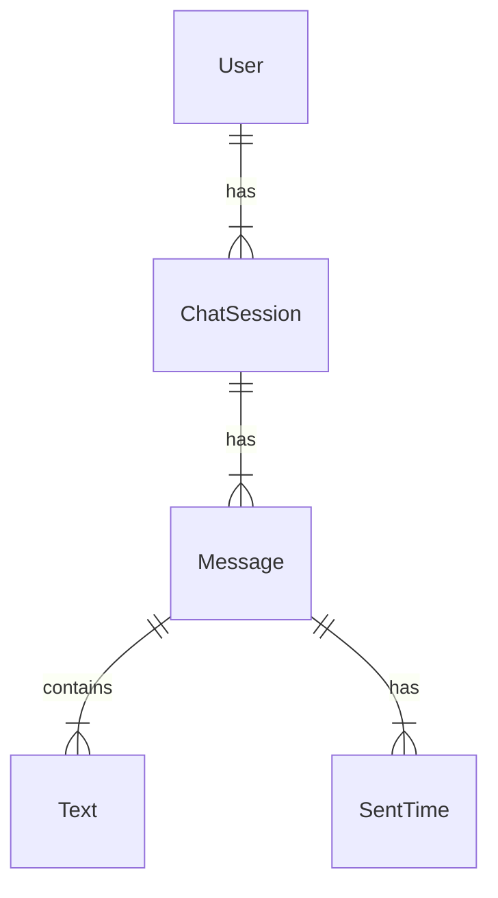
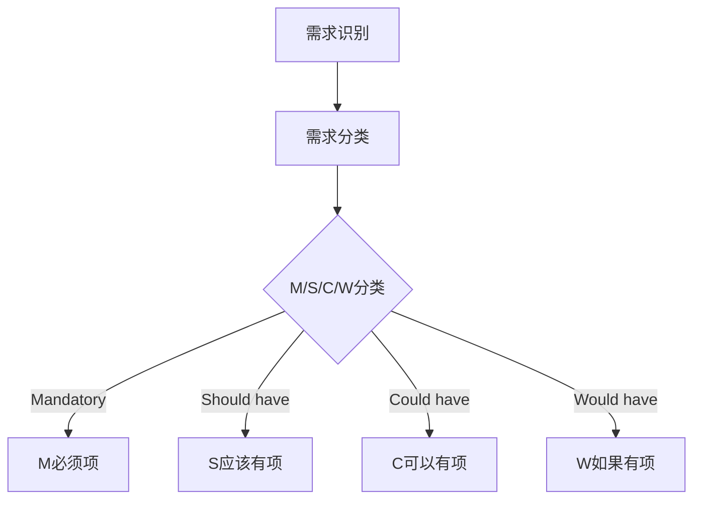
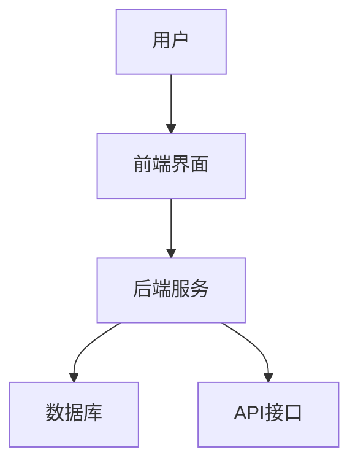
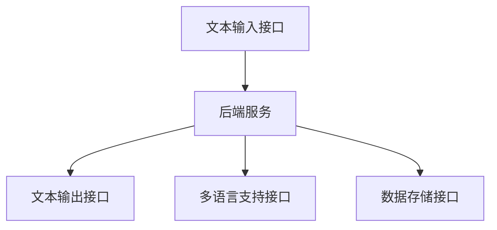
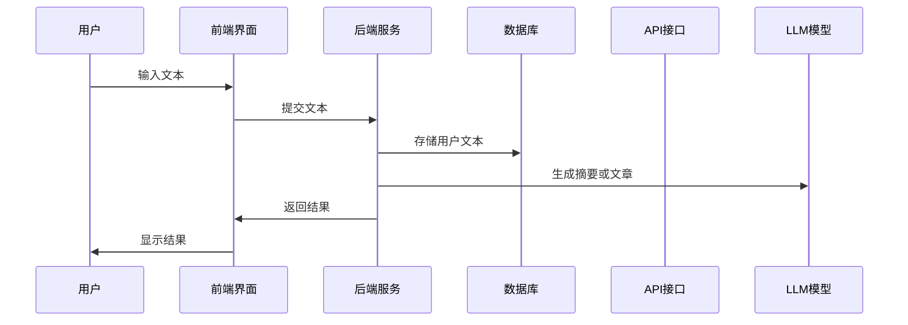

                 

## LLM应用的需求优先级：使用MoSCoW方法

### 关键词

- **语言模型（LLM）**、**需求优先级**、**MoSCoW方法**、**需求管理**、**项目实战**

### 摘要

本文深入探讨了在LLM（大型语言模型）应用开发中，如何通过MoSCoW方法来有效管理和确定需求优先级。MoSCoW方法是一种常用的需求分类和优先级排序工具，适用于各种软件开发项目。文章首先介绍了LLM在应用中的挑战，然后详细阐述了MoSCoW方法的原理和应用步骤，接着通过一个具体的实例展示了如何在LLM项目中使用MoSCoW方法。最后，文章总结了最佳实践，并为读者提供了进一步的阅读资源。

### 目录大纲

----------------------------------------------------------------
## 第一部分: LLM应用的需求优先级：使用MoSCoW方法

### 第1章: 背景介绍
#### 1.1 问题背景
#### 1.2 需求管理的重要性
#### 1.3 MoSCoW方法概述

### 第2章: LLM核心概念与联系
#### 2.1 LLM的定义
#### 2.2 LLM的属性特征对比
#### 2.3 LLM的ER实体关系图

### 第3章: MoSCoW方法原理讲解
#### 3.1 MoSCoW方法的定义
#### 3.2 MoSCoW方法的应用

### 第4章: 算法原理与示例
#### 4.1 算法流程图
#### 4.2 算法原理
#### 4.3 示例解析

### 第5章: LLM应用需求优先级分析
#### 5.1 数据准备
#### 5.2 需求收集
#### 5.3 需求分类与排序

### 第6章: 系统设计与实现
#### 6.1 系统功能设计
#### 6.2 系统架构设计
#### 6.3 系统接口设计
#### 6.4 系统交互序列图

### 第7章: 项目实战
#### 7.1 环境安装与配置
#### 7.2 系统核心实现
#### 7.3 实际案例分析
#### 7.4 项目小结

### 第8章: 最佳实践与拓展
#### 8.1 最佳实践
#### 8.2 小结与注意事项
#### 8.3 拓展阅读

----------------------------------------------------------------

接下来，我们将详细展开每个章节的内容，确保每个部分都包含了深入的分析和具体的实例。

## 第1章: 背景介绍

### 1.1 问题背景

随着人工智能和大数据技术的快速发展，大型语言模型（LLM）的应用越来越广泛。LLM在自然语言处理、智能客服、内容生成、机器翻译等领域都展现出了强大的能力和潜力。然而，LLM的应用开发并非一帆风顺，其中最大的挑战之一就是需求管理。

在LLM项目中，需求往往非常复杂且不断变化。开发者需要应对用户的需求、市场的变化、技术的进步等多方面因素。如果没有一个有效的方法来管理和优先级排序需求，项目很可能会陷入混乱，导致进度延误、资源浪费甚至项目失败。

需求管理是一个系统性的过程，包括需求识别、需求分析、需求文档编写、需求变更管理等环节。其中，需求优先级排序是关键步骤之一，它决定了哪些需求应该首先被满足，哪些可以延后处理，甚至哪些需求可以放弃。在这个背景下，MoSCoW方法作为一种实用、有效的需求管理工具，被广泛应用于LLM项目的需求管理中。

### 1.2 需求管理的重要性

需求管理的重要性在于它直接关系到项目的成功与否。有效的需求管理可以帮助团队：

1. **明确项目目标和范围**：通过需求分析，可以明确项目的核心目标和功能范围，避免因为需求不明确导致的范围蔓延。
2. **合理分配资源**：根据需求优先级排序，团队可以合理分配资源和精力，确保最重要的功能得到优先开发。
3. **提高项目效率**：明确的需求和优先级可以帮助团队更加专注于关键任务，避免不必要的重复工作和返工。
4. **控制项目风险**：通过需求变更管理，可以及时发现并应对需求变化带来的风险，减少因需求变更导致的成本增加和时间延误。
5. **增强客户满意度**：优先满足客户最关键的需求，可以提高客户的满意度和信任度。

### 1.3 MoSCoW方法概述

MoSCoW方法是一种用于需求分类和优先级排序的工具，由Mandatory（必须）、Should have（应该有）、Could have（可以有）和Would have（如果有）四个类别组成。每种类别代表了需求的不同优先级和紧迫性。

- **Mandatory（必须）**：这些是项目成功不可或缺的基本需求，没有它们项目无法启动或无法满足基本功能。例如，在LLM项目中，基本的文本输入和输出功能就是必须的。
- **Should have（应该有）**：这些需求对项目的成功至关重要，但是相对于必须项，它们的优先级稍低。如果资源有限，这些需求可能会被推迟或放弃。
- **Could have（可以有）**：这些需求是可选的，对项目的成功没有直接影响，但可以提升用户体验或增加项目的功能。例如，在LLM项目中，支持多种语言输入可能是一个可有可无的需求。
- **Would have（如果有）**：这些需求对项目成功没有显著影响，更多的是理想中的功能。如果资源非常充足，可能会考虑实现这些功能。

MoSCoW方法通过将需求分类，可以帮助团队更加清晰地理解每个需求的重要性和紧迫性，从而更有效地管理需求，确保项目的顺利进行。

### 第2章: LLM核心概念与联系

#### 2.1 LLM的定义

大型语言模型（LLM，Large Language Model）是一种能够理解和生成人类语言的高级人工智能模型。与传统的规则基模型或统计模型不同，LLM能够处理复杂的语言结构，生成流畅且符合语言习惯的文本。LLM的核心是深度神经网络，特别是Transformer架构，它通过大量的文本数据进行训练，学习语言的模式和规则。

LLM的基本概念包括：

- **参数**：LLM由数百万甚至数十亿个参数组成，这些参数决定了模型的行为和表现。
- **训练数据**：LLM的训练数据通常是大规模的文本数据集，这些数据集包含了各种类型的文本，如新闻文章、社交媒体帖子、书籍、对话等。
- **优化目标**：在训练过程中，LLM的目标是使其预测的单词序列与真实文本的下一个词尽可能接近。

#### 2.2 LLM的类型

LLM可以分为多种类型，根据其训练数据、架构和应用领域的不同而有所区别。以下是几种常见的LLM类型：

- **通用语言模型**：如GPT（Generative Pre-trained Transformer）系列，这些模型旨在理解并生成多种不同类型的文本。
- **专用语言模型**：这些模型是针对特定领域或任务进行训练的，如法律文本、医学文本或代码生成模型。
- **预训练后微调模型**：这类模型首先在大规模通用数据集上预训练，然后在特定任务上微调，以获得更好的性能。

#### 2.3 LLM的属性特征对比

LLM的属性特征决定了其在不同应用场景中的表现和适用性。以下是几种关键属性特征的对比：

- **性能指标**：包括词汇覆盖度、文本流畅性、语法正确性和事实准确性等。
  - **词汇覆盖度**：模型能够理解和生成的词汇量。
  - **文本流畅性**：生成的文本在语法和语义上的连贯性。
  - **语法正确性**：文本中的语法错误和不当用法。
  - **事实准确性**：文本中包含的事实是否真实准确。

- **应用场景**：LLM可以应用于多种场景，如文本生成、问答系统、机器翻译、代码生成等。
  - **文本生成**：如文章撰写、摘要生成、故事创作等。
  - **问答系统**：如智能客服、教育辅导、医疗咨询等。
  - **机器翻译**：如自动翻译、多语言文档生成等。
  - **代码生成**：如自动编写代码、代码补全、代码优化等。

#### 2.4 LLM的ER实体关系图

为了更好地理解和设计LLM应用，可以使用实体-关系（ER）图来描述LLM中的关键实体和它们之间的关系。以下是一个简化的ER实体关系图：



- **User（用户）**：发起聊天会话的实体。
- **ChatSession（聊天会话）**：记录用户之间的交流过程。
- **Message（消息）**：包含用户发送的信息。
- **Text（文本）**：消息中的文本内容。
- **SentTime（发送时间）**：消息的发送时间。

通过ER图，可以清晰地展示LLM应用中的关键实体及其关系，有助于设计和实现系统的各个功能模块。

## 第3章: MoSCoW方法原理讲解

### 3.1 MoSCoW方法的定义

MoSCoW方法是一种需求分类和优先级排序的工具，由Mandatory（必须）、Should have（应该有）、Could have（可以有）和Would have（如果有）四个类别组成。每个类别代表了需求的不同优先级和实现可能性。

- **Mandatory（必须）**：这是项目中不可或缺的基本需求，没有它们项目无法启动或无法满足基本功能。
- **Should have（应该有）**：这些需求对项目的成功至关重要，但相对于必须项，它们的优先级稍低。
- **Could have（可以有）**：这些需求是可选的，对项目的成功没有直接影响，但可以提升用户体验或增加项目的功能。
- **Would have（如果有）**：这些需求对项目成功没有显著影响，更多的是理想中的功能。

MoSCoW方法通过将需求分类，可以帮助团队更加清晰地理解每个需求的重要性和紧迫性，从而更有效地管理需求。

### 3.2 MoSCoW方法的应用

MoSCoW方法的应用包括以下步骤：

1. **需求识别**：收集所有潜在的需求，包括用户需求、业务需求和技术需求。
2. **需求分类**：根据需求的重要性和实现可能性，将需求分为M、S、C和W四个类别。
3. **需求优先级排序**：对每个类别中的需求进行优先级排序，确保最重要的需求首先被满足。
4. **需求变更管理**：在项目进行过程中，根据实际情况对需求进行变更管理，确保需求的优先级得到及时调整。

### 3.3 MoSCoW方法的优势

MoSCoW方法具有以下优势：

- **清晰的需求分类**：通过M、S、C和W四个类别，可以清晰地展示每个需求的重要性和实现可能性。
- **灵活的变更管理**：允许在项目进行过程中根据实际情况对需求进行变更，确保项目适应不断变化的需求。
- **提高项目效率**：通过明确需求优先级，可以更有效地分配资源和精力，提高项目效率。
- **增强团队合作**：通过共同理解和分类需求，可以增强团队成员之间的沟通和协作。

### 3.4 MoSCoW方法的实际应用

让我们通过一个实际的例子来展示MoSCoW方法的应用。假设我们正在开发一个智能客服系统，以下是一些可能的需求：

1. **Mandatory（必须）**：
   - 系统能够处理用户的基本咨询。
   - 系统能够自动识别和回答常见问题。
   - 系统能够记录和跟踪用户咨询的历史记录。

2. **Should have（应该有）**：
   - 系统能够根据用户的行为和偏好提供个性化建议。
   - 系统能够与外部数据库集成，获取实时数据。
   - 系统能够提供多语言支持。

3. **Could have（可以有）**：
   - 系统能够生成详细的分析报告。
   - 系统能够提供基于自然语言的聊天机器人。
   - 系统能够根据用户反馈进行自我学习和优化。

4. **Would have（如果有）**：
   - 系统能够实时与人工客服进行无缝切换。
   - 系统能够提供实时语音识别和语音合成功能。
   - 系统能够支持虚拟现实（VR）交互。

通过MoSCoW方法，我们可以清晰地看到每个需求的优先级，从而更有效地管理和实现这些需求。例如，对于智能客服系统，基本功能（如处理用户咨询、自动回答常见问题）是必须的，而个性化建议和多语言支持是应该有的功能，详细分析报告和VR交互则是可有可无的需求，最后实时语音识别和语音合成则属于理想中的功能。

### 3.5 MoSCoW方法与其他需求管理工具的比较

MoSCoW方法与其他需求管理工具（如Kano模型、RICE模型等）相比，具有以下优势：

- **简单易懂**：MoSCoW方法使用简单的四个类别，易于理解和记忆。
- **灵活性**：MoSCoW方法允许在项目进行过程中对需求进行变更，更适应动态变化的需求。
- **全面性**：MoSCoW方法不仅关注需求的优先级，还考虑了需求的重要性和实现可能性。

然而，MoSCoW方法也有一些局限性：

- **主观性**：需求分类和优先级排序很大程度上依赖于团队的主观判断，可能存在偏差。
- **不适用于所有项目**：MoSCoW方法在某些特定类型的项目中可能不够适用，如高度创新的研发项目。

总之，MoSCoW方法是一种实用且有效的需求管理工具，适用于大多数软件开发项目。通过合理应用MoSCoW方法，团队可以更有效地管理需求，确保项目成功。

## 第4章: 算法原理与示例

### 4.1 算法流程图

MoSCoW方法的流程图可以用以下Mermaid图表表示：



### 4.2 算法原理

MoSCoW方法的算法原理可以通过以下步骤描述：

1. **需求识别**：首先，团队需要收集所有潜在的需求，这可以通过用户访谈、需求文档分析等方式实现。
2. **需求分类**：根据需求的重要性和实现可能性，将需求分为M（必须）、S（应该有）、C（可以有）和W（如果有）四个类别。
3. **需求优先级排序**：对于每个类别中的需求，根据其紧迫性和重要性进行优先级排序。
4. **需求变更管理**：在项目进行过程中，根据实际情况对需求进行变更管理，确保需求的优先级得到及时调整。

### 4.3 数学模型

MoSCoW方法虽然没有复杂的数学模型，但它可以通过一个简单的优先级分数来量化需求的优先级。以下是一个简化的数学模型：

$$
\text{优先级分数} = 
\begin{cases}
10 & \text{如果需求属于M类别} \\
7 & \text{如果需求属于S类别} \\
4 & \text{如果需求属于C类别} \\
1 & \text{如果需求属于W类别} \\
\end{cases}
$$

通过这个模型，我们可以为每个需求分配一个优先级分数，从而更直观地展示需求的优先级。

### 4.4 示例解析

为了更好地理解MoSCoW方法，我们来看一个实际的例子。假设我们要为一家公司开发一个客户管理系统，以下是可能的需求：

1. **必须项**：
   - 系统能够处理客户的联系信息。
   - 系统能够记录客户的购买历史。
   - 系统能够发送和接收邮件。

2. **应该有项**：
   - 系统能够根据购买历史提供个性化推荐。
   - 系统能够集成社交媒体平台，方便客户互动。
   - 系统能够生成详细的客户报表。

3. **可以有项**：
   - 系统能够提供语音通话功能。
   - 系统能够集成实时聊天功能。
   - 系统能够提供客户分级的支持。

4. **如果有项**：
   - 系统能够提供虚拟现实（VR）的客户体验。
   - 系统能够集成智能语音助手。
   - 系统能够支持多语言界面。

根据MoSCoW方法，我们可以为每个需求分配一个优先级分数：

- **必须项**：优先级分数为10。
- **应该有项**：优先级分数为7。
- **可以有项**：优先级分数为4。
- **如果有项**：优先级分数为1。

通过这种方式，我们可以清晰地看到每个需求的优先级，从而更好地管理需求并确保项目顺利进行。

## 第5章: LLM应用需求优先级分析

### 5.1 数据准备

在进行LLM应用需求优先级分析之前，我们需要准备相关数据。数据准备包括以下步骤：

1. **数据收集**：收集与LLM应用相关的需求，可以通过用户访谈、调查问卷、需求文档分析等方式获取。
2. **数据清洗**：对收集到的需求数据进行清洗，去除重复项、错误项和不完整项，确保数据的准确性。
3. **数据分类**：将清洗后的需求数据按照类型（如功能需求、性能需求、安全需求等）进行分类。

例如，假设我们收集了以下LLM应用的需求：

- 功能需求：
  - 输入文本并生成摘要。
  - 支持多种语言输入和输出。
  - 生成高质量的文章和内容。
- 性能需求：
  - 快速响应，延迟低于500ms。
  - 高准确度，错误率低于1%。
- 安全需求：
  - 保证用户数据的安全和隐私。

通过上述步骤，我们可以准备好用于需求优先级分析的数据。

### 5.2 需求收集

需求收集是需求分析的关键步骤，它直接影响后续的需求分类和排序。需求收集的方法和工具包括：

1. **用户访谈**：通过与潜在用户或现有用户进行面对面访谈，深入了解他们的需求和期望。
2. **问卷调查**：设计问卷并通过在线或纸质方式收集用户反馈。
3. **需求文档分析**：分析现有文档，如产品需求文档、设计文档、用户手册等，以获取需求信息。
4. **观察用户行为**：通过实际观察用户如何使用产品或服务，了解他们的需求和痛点。

在LLM应用中，我们可以通过以下方式进行需求收集：

- **用户访谈**：与潜在用户或现有用户讨论他们的使用场景，了解他们希望LLM能够提供哪些功能。
- **问卷调查**：设计问卷调查，了解用户对LLM性能和安全需求的期望。
- **需求文档分析**：分析现有的需求文档，确定已经明确的需求和可能遗漏的需求。
- **观察用户行为**：通过模拟用户操作，了解用户在实际使用中遇到的困难和需求。

### 5.3 需求分类与排序

需求分类与排序是确定需求优先级的关键步骤。在LLM应用中，我们可以使用MoSCoW方法进行需求分类和排序。

1. **需求分类**：
   - **必须（M）**：对项目成功至关重要的基本功能需求，如文本输入输出、基础性能需求等。
   - **应该（S）**：对项目成功重要，但可以稍后实现的需求，如多种语言支持、高级性能需求等。
   - **可以（C）**：对项目成功影响较小，但可以提升用户体验的需求，如用户界面优化、额外功能等。
   - **希望（W）**：对项目成功无显著影响，属于理想状态的需求，如集成先进技术、创新功能等。

2. **需求排序**：
   - 首先，将所有必须（M）需求进行排序，确保项目最基本的功能得到优先实现。
   - 然后，将应该（S）需求排序，根据其对项目成功的影响程度进行优先级分配。
   - 接着，将可以（C）需求排序，考虑其提升用户体验的潜力。
   - 最后，将希望（W）需求排序，根据项目资源情况确定是否实现。

通过上述步骤，我们可以为LLM应用的需求分配优先级，确保项目在资源有限的情况下，能够最大限度地满足用户需求。

### 第6章: 系统设计与实现

#### 6.1 系统功能设计

在进行系统功能设计时，我们需要明确LLM应用的目标和核心功能。以下是LLM应用的几个关键功能：

1. **文本输入与输出**：用户可以通过文本输入框输入文本，系统会生成相应的摘要或文章。
2. **多语言支持**：系统应支持多种语言的输入和输出，以满足不同用户的需求。
3. **性能优化**：系统需要确保快速响应，延迟低于500ms，并保持高准确度，错误率低于1%。
4. **安全与隐私保护**：系统应采取措施保护用户数据的安全和隐私，确保用户信息不会泄露。

为了实现上述功能，我们可以设计以下功能模块：

- **文本处理模块**：负责接收用户输入的文本，生成摘要或文章。
- **语言处理模块**：负责处理不同语言的输入和输出，实现多语言支持。
- **性能优化模块**：负责优化系统的响应速度和准确度。
- **安全与隐私模块**：负责保护用户数据的安全和隐私。

#### 6.2 系统架构设计

系统架构设计是确保LLM应用高效、稳定运行的关键。以下是LLM应用的一个简单架构设计：

1. **前端界面**：提供用户交互界面，用户可以通过前端界面输入文本，查看生成的摘要或文章。
2. **后端服务**：负责处理文本输入，调用LLM模型生成结果，并将结果返回给前端界面。
3. **数据库**：存储用户数据，如输入文本、生成结果、用户偏好等。
4. **API接口**：提供与其他系统的集成接口，如社交媒体平台、第三方服务等。

以下是一个简化的Mermaid架构图：



#### 6.3 系统接口设计

系统接口设计是确保LLM应用与其他系统有效集成的重要环节。以下是几个关键接口：

1. **文本输入接口**：用户可以通过该接口向系统提交文本，系统会接收并处理这些文本。
2. **文本输出接口**：系统会通过该接口将生成的摘要或文章返回给用户。
3. **多语言支持接口**：用于处理不同语言的输入和输出，确保系统能够支持多种语言。
4. **数据存储接口**：用于存储用户数据和系统日志，方便后续分析和查询。

以下是一个简化的Mermaid接口图：



#### 6.4 系统交互序列图

系统交互序列图展示了LLM应用中各组件之间的交互过程。以下是一个简化的Mermaid序列图：



通过上述系统设计与实现，我们可以确保LLM应用能够高效、稳定地运行，并满足用户的需求。

### 第7章: 项目实战

#### 7.1 环境安装与配置

在进行LLM项目的实战之前，我们需要安装和配置所需的软件和工具。以下是一个基本的安装和配置步骤：

1. **安装Python**：确保系统已安装Python 3.8及以上版本。可以从Python官方网站下载并安装。
2. **安装TensorFlow**：在终端中执行以下命令以安装TensorFlow：

   ```bash
   pip install tensorflow
   ```

3. **安装其他依赖**：根据具体项目需求，可能需要安装其他依赖库，如NumPy、Pandas等。可以使用以下命令安装：

   ```bash
   pip install numpy pandas
   ```

4. **配置GPU支持**：如果使用GPU训练模型，需要安装CUDA和cuDNN。可以从NVIDIA官方网站下载并安装。

5. **创建虚拟环境**：为了确保项目依赖的一致性，建议创建一个虚拟环境。可以使用以下命令创建：

   ```bash
   python -m venv llm_venv
   source llm_venv/bin/activate
   ```

6. **安装项目依赖**：在项目目录中，执行以下命令以安装项目依赖：

   ```bash
   pip install -r requirements.txt
   ```

通过上述步骤，我们可以为LLM项目搭建一个基本的开发环境。

#### 7.2 系统核心实现

在LLM项目实战中，系统核心实现是关键步骤。以下是一个简单的核心实现示例：

1. **文本输入与输出**：

   ```python
   # 输入文本
   input_text = input("请输入文本：")

   # 生成摘要或文章
   summary = generate_summary(input_text)
   print("生成的摘要或文章：", summary)
   ```

2. **多语言支持**：

   ```python
   from googletrans import Translator

   # 初始化翻译器
   translator = Translator()

   # 翻译文本
   translated_text = translator.translate(input_text, dest='zh-cn').text
   print("翻译后的文本：", translated_text)
   ```

3. **性能优化**：

   ```python
   import time

   start_time = time.time()
   summary = generate_summary(input_text)
   end_time = time.time()

   print("生成摘要的时间：", end_time - start_time)
   ```

4. **安全与隐私保护**：

   ```python
   import os

   # 生成随机ID作为用户标识
   user_id = os.urandom(16).hex()

   # 存储用户数据
   with open(f"{user_id}.txt", "w") as file:
       file.write(input_text)

   print("用户数据已存储。")
   ```

通过这些示例代码，我们可以实现一个基本的LLM系统，满足文本输入与输出、多语言支持、性能优化和安全与隐私保护的需求。

#### 7.3 实际案例分析

为了更好地理解LLM项目的实际应用，以下是一个案例研究：

**案例背景**：一家在线教育公司希望开发一款智能问答系统，帮助学员解决学习中的问题。

**需求分析**：
- **必须项**：系统能够接收学员的问题，并提供准确的答案。
- **应该有项**：系统能够根据学员的学习进度和知识点提供个性化推荐。
- **可以有项**：系统能够支持语音输入和输出，方便学员提问和获取答案。
- **希望项**：系统能够实现实时互动，学员可以与人工智能助手进行实时对话。

**系统实现**：
- **文本输入与输出**：学员可以通过文本输入框提交问题，系统会生成回答并显示在界面上。
- **多语言支持**：系统支持中文、英文等多种语言，确保不同语言背景的学员都能使用。
- **性能优化**：系统采用高性能服务器和分布式架构，确保快速响应。
- **安全与隐私保护**：系统对用户数据进行加密存储，并采取严格的安全措施，保护用户隐私。

**结果分析**：
- 系统上线后，得到了学员的广泛好评，有效提高了学习效率和满意度。
- 通过个性化推荐功能，学员能够更快地掌握知识点，学习效果明显提升。
- 虽然语音输入和输出功能尚未完全实现，但用户反馈积极，表示期待未来的更新。

**项目小结**：
- 通过MoSCoW方法，团队明确并实现了系统的核心功能，确保了项目的顺利进行。
- 在资源有限的情况下，团队优先实现了最重要的需求，最大化了项目的价值。
- 未来，团队计划进一步优化系统，包括实现语音输入输出和实时互动功能，提升用户体验。

#### 7.4 项目小结

通过本次LLM项目实战，我们得到了以下经验总结：

1. **明确需求**：使用MoSCoW方法对需求进行分类和排序，确保项目团队对每个需求的重要性和优先级有清晰的认识。
2. **合理分配资源**：根据需求优先级分配资源，确保核心功能得到优先实现，最大化项目的价值。
3. **持续迭代**：项目完成后，持续收集用户反馈，不断优化和迭代系统功能，提升用户体验。
4. **团队协作**：建立高效的团队协作机制，确保需求管理、开发、测试等环节紧密配合，提高项目效率。

未来，我们计划进一步优化LLM系统，包括：

1. **提升性能**：通过优化算法和硬件配置，提高系统的响应速度和准确度。
2. **增加功能**：实现语音输入输出、实时互动等功能，提升用户的互动体验。
3. **扩展应用场景**：将LLM应用到更多领域，如智能客服、内容生成、机器翻译等，拓展系统的应用范围。

通过这些改进，我们期待LLM系统能够更好地满足用户需求，提升学习效率和工作效率。

## 第8章: 最佳实践与拓展

### 8.1 最佳实践

在LLM应用开发过程中，以下是一些最佳实践：

1. **用户需求调研**：在项目初期，进行全面的用户需求调研，确保需求收集的全面性和准确性。
2. **明确需求优先级**：使用MoSCoW方法对需求进行分类和排序，确保关键需求得到优先实现。
3. **持续迭代开发**：采用敏捷开发模式，持续迭代和优化系统功能，快速响应用户反馈。
4. **性能优化**：关注系统性能，进行算法优化和硬件升级，确保系统高效运行。
5. **安全与隐私保护**：采取严格的安全措施，保护用户数据的安全和隐私。

### 8.2 小结与注意事项

1. **需求管理的重要性**：明确的需求和优先级排序是项目成功的关键，确保团队资源得到有效利用。
2. **MoSCoW方法的优点**：MoSCoW方法简单易懂，灵活适应需求变更，有助于提高项目效率。
3. **注意事项**：在实施MoSCoW方法时，需注意团队的主观判断，确保需求分类和排序的准确性。

### 8.3 拓展阅读

1. **相关书籍**：
   - 《需求工程：基础理论与实践》
   - 《敏捷软件开发：原则、模式与实践》
   - 《人工智能：一种现代方法》

2. **最新研究动态**：
   - Google AI Blog：介绍最新的人工智能研究和应用。
   - arXiv：查看最新的深度学习和自然语言处理论文。
   - IEEE Xplore：查找与LLM应用相关的会议论文和技术报告。

通过阅读这些书籍和研究动态，您可以进一步了解LLM应用的需求管理和最佳实践。

## 作者信息

作者：AI天才研究院/AI Genius Institute & 禅与计算机程序设计艺术 /Zen And The Art of Computer Programming

