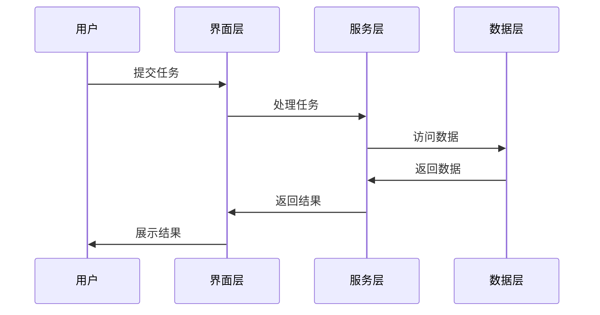
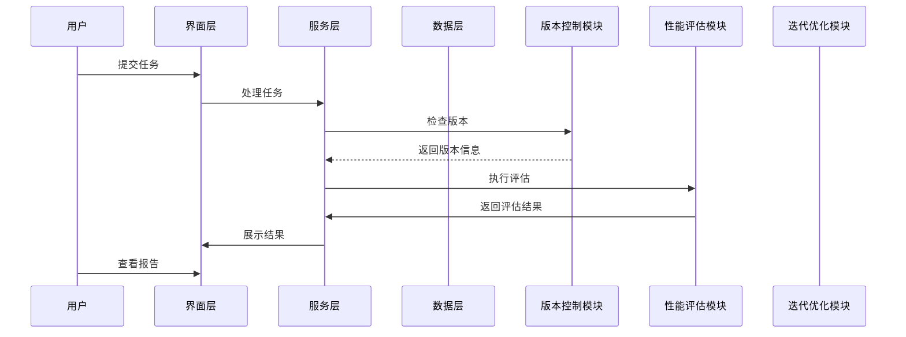

                 

### LLMS自评测系统在人工智能时代的崛起

近年来，随着人工智能（AI）技术的迅猛发展，大型语言模型（LLM，Large Language Model）成为推动AI进步的重要力量。LLM自评测系统作为一种先进的技术手段，已经在各类应用场景中发挥了重要作用。LLM自评测系统是指利用大型语言模型对自身性能进行评测和优化的系统。通过自评测，LLM能够识别自身的弱点、发现潜在问题，并进行针对性的改进。

#### **关键词**：LLM、自评测系统、人工智能、版本控制、迭代优化。

#### **摘要**：
本文旨在探讨LLM自评测系统的版本控制与迭代优化。首先，我们将介绍LLM自评测系统的背景及其重要性，解释版本控制和迭代优化的基本概念。接着，文章将深入探讨版本控制和迭代优化的算法原理，并提供Python代码实现与示例。然后，文章将分析系统架构设计，包括系统功能、接口设计以及交互流程。在实战部分，我们将展示系统安装和核心实现过程，并通过实际案例进行深入剖析。最后，文章将总结最佳实践，提出改进建议，并推荐进一步阅读的资料。

### 第一部分：背景介绍

#### **问题背景**

人工智能（AI）作为一门前沿科技，已经渗透到我们生活的方方面面。从自动驾驶到智能助手，从医疗诊断到金融分析，AI正在改变着世界的运作方式。然而，随着AI技术的发展，如何确保其准确性和可靠性成为一个重要课题。对于大型语言模型（LLM）而言，其性能的评估与优化尤为关键。

LLM是一种能够处理和理解自然语言数据的高级AI模型，其能力在文本生成、机器翻译、问答系统等方面具有显著优势。然而，LLM的性能不仅依赖于其模型的复杂度和训练数据的质量，还受到模型版本、算法优化等多方面因素的影响。因此，如何对LLM进行有效的性能评估和优化，成为当前AI研究中的一个重要方向。

#### **问题描述**

在LLM的实际应用中，版本控制与迭代优化是两个关键问题。版本控制指的是对LLM的不同版本进行管理，确保每个版本的可追溯性和可靠性。而迭代优化则是指通过不断的迭代过程，对LLM的性能进行持续提升。版本控制和迭代优化不仅关系到LLM的应用效果，也直接影响其开发效率和稳定性。

然而，在LLM自评测系统的开发过程中，面临以下几个挑战：

1. **版本管理复杂性**：LLM的版本繁多，每个版本都可能存在不同的训练数据和算法参数。如何有效地管理这些版本，确保版本间的关联性和可追溯性，是一个复杂的问题。
   
2. **性能评估准确性**：准确评估LLM的性能是一个挑战，因为性能评估不仅需要大量真实数据，还需要综合考虑模型的质量、运行效率和用户体验等多个因素。

3. **迭代优化效率**：迭代优化是一个迭代过程，需要大量计算资源和高效率的算法支持。如何在保证性能提升的同时，减少计算资源的使用，是另一个需要解决的问题。

#### **问题解决**

为了解决上述问题，LLM自评测系统需要采用一系列技术手段：

1. **版本控制**：通过建立版本库和版本管理工具，实现对LLM各个版本的集中管理和追踪。利用版本控制工具（如Git），可以对LLM的代码、数据、配置等进行版本管理，确保版本间的关联性和可追溯性。

2. **性能评估**：构建一个全面的性能评估体系，包括测试数据集、评估指标和评估算法。通过自动化的性能评估流程，对LLM的性能进行全面、客观的评估。

3. **迭代优化**：采用多种优化算法和策略，对LLM的参数和结构进行优化。通过迭代训练和模型调整，不断提高LLM的性能和效率。

#### **边界与外延**

在讨论LLM自评测系统时，还需要考虑以下几个方面的边界与外延：

1. **边界**：LLM自评测系统主要关注LLM的性能评估和优化，但并不涉及LLM的训练和部署过程。此外，系统设计需要考虑硬件资源和环境配置等实际因素。

2. **外延**：LLM自评测系统可以扩展到其他AI模型和应用场景。例如，对于计算机视觉模型，可以设计相应的自评测系统，以实现对模型性能的评估和优化。

#### **概念结构与核心要素组成**

LLM自评测系统的概念结构主要包括以下几个核心要素：

1. **版本库**：用于存储和管理LLM各个版本的信息，包括代码、数据、配置等。
   
2. **性能评估模块**：用于对LLM的性能进行评估，包括测试数据集、评估指标和评估算法。

3. **优化模块**：用于对LLM的参数和结构进行优化，包括迭代训练和模型调整。

4. **接口设计**：用于与其他系统进行交互，包括数据接口和功能接口。

5. **用户界面**：用于展示评估结果和优化建议，方便用户进行操作和决策。

通过这些核心要素的有机组合，LLM自评测系统可以实现高效的性能评估和优化，为LLM在实际应用中的可靠性和稳定性提供保障。

### 第二部分：核心概念与联系

#### **2.1 LLM自评测系统的定义与特点**

LLM自评测系统是一种基于大型语言模型（LLM）的性能评估和优化系统。它通过自动化流程对LLM的性能进行全面评估，并根据评估结果进行迭代优化，以提高LLM的准确性和效率。具体来说，LLM自评测系统具有以下几个特点：

1. **自动评估**：LLM自评测系统能够自动运行评估脚本，对LLM的各个版本进行性能评估，无需人工干预。
   
2. **全面评估**：系统不仅评估LLM在特定任务上的表现，还综合考虑模型的运行效率、资源消耗等多个因素，提供全面的性能评估报告。
   
3. **迭代优化**：通过分析评估结果，LLM自评测系统能够自动生成优化建议，并指导后续的迭代优化过程，从而不断提高LLM的性能。

#### **2.2 版本控制的基本概念与原理**

版本控制是一种管理软件源代码和文档的方法，它能够跟踪代码的变更历史，确保不同版本之间的可追溯性和一致性。版本控制的基本概念包括：

1. **版本库**：用于存储和管理代码、数据、配置等版本的集中存储系统。
   
2. **分支**：在版本库中，可以从一个版本创建一个新的分支，以便在新的开发工作中进行变更和测试。
   
3. **提交**：将代码、数据、配置等变更提交到版本库中，以记录变更历史。
   
4. **合并**：将不同分支的变更合并到一个主分支中，以实现版本间的同步。

版本控制的原理主要基于以下几种机制：

1. **版本标识**：每个版本都有唯一的标识，用于区分不同的版本。
   
2. **变更记录**：版本库中记录每个版本的变更历史，包括变更的内容、作者和日期等。
   
3. **版本回滚**：在发现问题时，可以通过版本回滚将系统恢复到之前的稳定状态。

版本控制的基本流程包括：

1. **创建分支**：从主分支创建一个新的分支，以便进行独立的开发工作。
   
2. **提交变更**：在分支上进行开发工作，并将变更提交到版本库中。
   
3. **分支合并**：将分支合并到主分支中，以实现版本间的同步。
   
4. **版本发布**：将合并后的主分支发布为新的版本，供用户使用。

#### **2.3 迭代优化的方法与策略**

迭代优化是一种通过不断迭代过程来提高模型性能的方法。在LLM自评测系统中，迭代优化是关键的一环，它能够根据评估结果对LLM进行参数调整和结构优化，从而提高模型的表现。迭代优化的方法与策略包括：

1. **梯度下降**：一种常用的优化算法，通过调整模型参数，使损失函数的梯度逐步减小，从而找到最优参数。
   
   算法原理：$$\theta_{\text{new}} = \theta_{\text{old}} - \alpha \cdot \nabla_{\theta} J(\theta)$$
   
   其中，$\theta$代表模型参数，$\alpha$代表学习率，$J(\theta)$代表损失函数。

2. **随机梯度下降（SGD）**：在梯度下降的基础上，每次迭代使用随机样本进行计算，从而加快收敛速度。
   
   算法原理：$$\theta_{\text{new}} = \theta_{\text{old}} - \alpha \cdot \nabla_{\theta} J(\theta; \xi)$$

3. **动量法**：在梯度下降的基础上，引入动量项，以加速收敛并防止陷入局部最小值。
   
   算法原理：$$\theta_{\text{new}} = \theta_{\text{old}} - \alpha \cdot \nabla_{\theta} J(\theta) + \beta \cdot (1 - \beta) \cdot \theta_{\text{prev}}$$

4. **Adam优化器**：结合SGD和动量法，自适应调整学习率和动量项，具有更好的收敛性能。
   
   算法原理：
   $$
   m_t = \beta_1 \cdot m_{t-1} + (1 - \beta_1) \cdot \nabla_{\theta} J(\theta; \xi_t)
   $$
   $$
   v_t = \beta_2 \cdot v_{t-1} + (1 - \beta_2) \cdot (\nabla_{\theta} J(\theta; \xi_t))^2
   $$
   $$
   \theta_{\text{new}} = \theta_{\text{old}} - \alpha \cdot \frac{m_t}{\sqrt{v_t} + \epsilon}
   $$

5. **交叉验证**：通过将数据集划分为训练集和验证集，在每个迭代过程中，在验证集上进行性能评估，以避免过拟合。
   
   策略：选择验证集上的性能指标（如准确率、召回率等）作为迭代终止条件。

6. **模型裁剪**：通过剪枝技术，减少模型的参数数量，从而提高模型的计算效率。
   
   策略：选择重要性较小的参数进行剪枝。

7. **数据增强**：通过增加数据多样性，提高模型的泛化能力。
   
   策略：使用不同的数据增强方法（如旋转、缩放、噪声添加等）对训练数据进行增强。

通过上述方法与策略，LLM自评测系统能够实现高效的迭代优化，从而不断提高LLM的性能。

### 第三部分：算法原理讲解

#### **3.1 版本控制算法**

版本控制是LLM自评测系统的核心组件之一，它确保了系统的可追溯性和稳定性。版本控制算法主要包括以下几个步骤：

##### **3.1.1 工作流程与数据处理**

1. **创建版本库**：首先，需要在版本库中创建一个新的LLM版本。版本库可以是一个集中存储系统，如Git仓库，用于存储LLM的代码、数据、配置等。
   
2. **提交变更**：在开发过程中，每次对LLM进行修改后，需要将变更提交到版本库中。提交内容包括代码变更、数据更新和配置修改等。
   
3. **版本比较**：通过比较不同版本之间的差异，可以识别出LLM的变更点和影响范围。版本比较工具可以帮助开发人员快速定位问题的根源。
   
4. **版本回滚**：在发现问题时，可以通过版本回滚将系统恢复到之前的稳定状态。版本回滚操作可以确保系统在出现问题时能够快速恢复。

##### **3.1.2 算法原理与数学模型**

版本控制算法的核心是版本库的管理和版本差异的比较。以下是几个关键的算法原理和数学模型：

1. **版本树**：版本库中的每个版本可以看作是一棵树上的节点。树的根节点是初始版本，后续的每个提交都是对当前版本的扩展或修改。版本树结构如图所示：

   ```mermaid
   graph TD
   A[初始版本] --> B[版本1]
   B --> C[版本2]
   C --> D[版本3]
   ```

2. **版本差异计算**：为了比较不同版本之间的差异，可以采用基于文本的对比算法，如diff算法。diff算法通过比较两个文本文件的差异，生成一个差异文件，用于描述两个版本之间的变更点。

   算法原理：
   $$
   \text{diff}(V_i, V_j) = \{ \Delta_v \mid \Delta_v \text{是} V_i \text{和} V_j \text{的差异点} \}
   $$

3. **回滚策略**：回滚操作是基于版本差异计算的结果，将系统恢复到之前的稳定状态。回滚策略可以分为完全回滚和部分回滚。完全回滚将系统恢复到指定版本，而部分回滚仅恢复指定文件的变更。

   回滚策略算法原理：
   $$
   V_{\text{rollback}} = V_{\text{target}} \setminus \Delta_{\text{diff}}
   $$

##### **3.1.3 Python代码实现与举例说明**

以下是一个简单的Python代码示例，展示了版本控制算法的实现：

```python
import git

def create_version_repo(repo_path, version_name):
    repo = git.Repo.init(repo_path)
    repo.create_head(version_name)
    print(f"Version {version_name} created in {repo_path}")

def commit_changes(repo, file_path, message):
    repo.index.add([file_path])
    repo.index.commit(message)

def compare_versions(repo, version1, version2):
    diff = repo.diff(version1, version2)
    print(f"Diff between {version1} and {version2}:")
    print(diff)

def rollback_version(repo, target_version):
    repo.head.reset(target_version, index=True, working_tree=True)
    print(f"Rolled back to version {target_version}")

# 示例
repo_path = "/path/to/repo"
version_name = "version1"

# 创建版本库
create_version_repo(repo_path, version_name)

# 提交变更
commit_changes(repo, "model.py", "Initial model submission")

# 比较版本
compare_versions(repo, "version1", "version2")

# 回滚版本
rollback_version(repo, "version1")
```

通过以上代码示例，可以实现对LLM版本的控制、差异比较和版本回滚的基本操作。

#### **3.2 迭代优化算法**

迭代优化是LLM自评测系统的关键环节，通过不断调整模型参数和结构，提高LLM的性能。以下是几种常用的迭代优化算法：

##### **3.2.1 工作流程与数据处理**

1. **初始化模型**：首先，需要初始化LLM模型，包括参数和结构。初始化过程可以基于预训练模型，或者从头开始训练。
   
2. **数据预处理**：对训练数据进行预处理，包括数据清洗、编码和归一化等操作。预处理步骤确保数据质量，提高训练效果。
   
3. **迭代训练**：在迭代训练过程中，模型参数通过不断调整，以最小化损失函数。每次迭代结束后，评估模型性能，并根据评估结果调整迭代策略。
   
4. **性能评估**：在训练过程中，定期对模型进行性能评估，以监测训练效果。性能评估指标包括准确率、召回率、F1值等。
   
5. **迭代终止条件**：当满足特定的迭代终止条件（如性能收敛、时间限制等）时，结束迭代过程。

##### **3.2.2 算法原理与数学模型**

1. **梯度下降**：
   梯度下降是最简单的优化算法，通过计算损失函数关于模型参数的梯度，反向调整参数，以最小化损失函数。

   算法原理：
   $$
   \theta_{\text{new}} = \theta_{\text{old}} - \alpha \cdot \nabla_{\theta} J(\theta)
   $$

   其中，$\theta$代表模型参数，$\alpha$代表学习率，$J(\theta)$代表损失函数。

2. **随机梯度下降（SGD）**：
   随机梯度下降是梯度下降的一种改进，每次迭代使用随机样本的梯度进行计算，从而加快收敛速度。

   算法原理：
   $$
   \theta_{\text{new}} = \theta_{\text{old}} - \alpha \cdot \nabla_{\theta} J(\theta; \xi)
   $$

   其中，$\xi$代表随机样本。

3. **动量法**：
   动量法引入动量项，以加速收敛并防止陷入局部最小值。

   算法原理：
   $$
   \theta_{\text{new}} = \theta_{\text{old}} - \alpha \cdot \nabla_{\theta} J(\theta) + \beta \cdot (1 - \beta) \cdot \theta_{\text{prev}}
   $$

   其中，$\beta$代表动量项。

4. **Adam优化器**：
   Adam优化器结合SGD和动量法，自适应调整学习率和动量项，具有更好的收敛性能。

   算法原理：
   $$
   m_t = \beta_1 \cdot m_{t-1} + (1 - \beta_1) \cdot \nabla_{\theta} J(\theta; \xi_t)
   $$
   $$
   v_t = \beta_2 \cdot v_{t-1} + (1 - \beta_2) \cdot (\nabla_{\theta} J(\theta; \xi_t))^2
   $$
   $$
   \theta_{\text{new}} = \theta_{\text{old}} - \alpha \cdot \frac{m_t}{\sqrt{v_t} + \epsilon}
   $$

   其中，$\beta_1$和$\beta_2$分别代表一阶和二阶矩估计的指数衰减率，$\epsilon$为平滑常数。

##### **3.2.3 Python代码实现与举例说明**

以下是一个简单的Python代码示例，展示了迭代优化算法的实现：

```python
import tensorflow as tf
from tensorflow.keras.models import Sequential
from tensorflow.keras.layers import Dense
from tensorflow.keras.optimizers import SGD, Adam

# 初始化模型
model = Sequential()
model.add(Dense(units=64, activation='relu', input_shape=(input_shape)))
model.add(Dense(units=1, activation='sigmoid'))

# 初始化优化器
optimizer = Adam(learning_rate=0.001)

# 定义损失函数
loss_fn = tf.keras.losses.BinaryCrossentropy()

# 训练模型
for epoch in range(num_epochs):
    # 数据预处理
    x_train, y_train = preprocess_data(train_data)
    
    # 计算梯度
    with tf.GradientTape() as tape:
        predictions = model(x_train, training=True)
        loss = loss_fn(y_train, predictions)
    
    # 获取梯度
    gradients = tape.gradient(loss, model.trainable_variables)
    
    # 更新参数
    optimizer.apply_gradients(zip(gradients, model.trainable_variables))
    
    # 打印训练进度
    print(f"Epoch {epoch+1}/{num_epochs}, Loss: {loss.numpy()}")

# 性能评估
x_test, y_test = preprocess_data(test_data)
predictions = model(x_test, training=False)
accuracy = tf.metrics.accuracy(y_test, predictions)
print(f"Test Accuracy: {accuracy.numpy()}")
```

通过以上代码示例，可以实现对LLM模型的初始化、训练和性能评估的基本操作。

### 第四部分：系统分析与架构设计方案

#### **4.1 问题场景介绍**

在人工智能（AI）领域，特别是自然语言处理（NLP）任务中，LLM自评测系统有着广泛的应用场景。随着AI技术的不断进步，LLM模型变得越来越复杂，其性能评估和优化成为一个关键问题。然而，传统的性能评估方法往往依赖于人工操作，效率低下且容易出现偏差。为了解决这个问题，LLM自评测系统应运而生。

LLM自评测系统旨在通过自动化流程，对LLM模型的性能进行全面评估和优化。具体场景包括：

1. **模型开发**：在模型开发过程中，LLM自评测系统可以实时监测模型性能，提供优化建议，帮助开发人员快速迭代模型。
   
2. **模型部署**：在模型部署前，LLM自评测系统可以进行全面测试，确保模型在实际应用中的稳定性和可靠性。
   
3. **模型升级**：在模型升级过程中，LLM自评测系统可以对比不同版本的模型性能，帮助决策者选择最优版本。
   
4. **模型优化**：通过迭代优化，LLM自评测系统可以持续提高模型性能，提升AI应用的效率和准确性。

#### **4.2 系统功能设计**

LLM自评测系统的核心功能包括版本控制、性能评估和迭代优化。以下是对各个功能模块的设计：

##### **4.2.1 领域模型**

为了更好地设计系统功能，我们可以使用Mermaid类图来表示LLM自评测系统的领域模型，如图所示：

```mermaid
classDiagram
    VersionControlSystem <<interface>> VersionControl
    PerformanceEvaluation <<interface>> Evaluate
    IterativeOptimization <<interface>> Optimize

    LLMSelfEvaluationSystem <..> VersionControlSystem
    LLMSelfEvaluationSystem <..> PerformanceEvaluation
    LLMSelfEvaluationSystem <..> IterativeOptimization

    VersionControlSystem implements ControlVersion
    PerformanceEvaluation implements EvaluatePerformance
    IterativeOptimization implements IterativeProcess
```

在这个领域模型中，`LLMSelfEvaluationSystem`是核心类，它与其他三个接口类`VersionControlSystem`、`PerformanceEvaluation`和`IterativeOptimization`有紧密的联系。

- **VersionControlSystem**：负责版本控制，包括创建版本、提交变更、比较版本和版本回滚等功能。
- **PerformanceEvaluation**：负责性能评估，包括选择测试数据集、计算评估指标和生成评估报告等功能。
- **IterativeOptimization**：负责迭代优化，包括选择优化算法、调整模型参数和监测优化效果等功能。

##### **4.2.2 系统功能模块划分**

根据领域模型的设计，LLM自评测系统可以划分为以下主要功能模块：

1. **版本控制模块**：包括版本库管理、版本比较和版本回滚等功能，负责LLM的版本管理。
   
2. **性能评估模块**：包括测试数据集管理、评估指标计算和评估报告生成等功能，负责LLM的性能评估。

3. **迭代优化模块**：包括优化算法选择、参数调整和优化效果监测等功能，负责LLM的迭代优化。

4. **用户界面模块**：包括数据展示、操作指导和日志记录等功能，负责与用户进行交互。

#### **4.3 系统架构设计**

LLM自评测系统的架构设计需要考虑系统的可扩展性、稳定性和高性能。以下是一个典型的系统架构设计：

##### **4.3.1 系统架构**

系统架构可以分为三个主要层次：数据层、服务层和界面层。

1. **数据层**：负责数据存储和管理，包括版本库、测试数据集和日志文件等。数据层通常使用分布式数据库和文件系统来实现高可用性和高性能。

2. **服务层**：负责系统的核心功能实现，包括版本控制、性能评估和迭代优化等。服务层通常使用微服务架构，以提高系统的可扩展性和模块化。

3. **界面层**：负责与用户进行交互，提供友好的用户界面和操作指南。界面层通常使用Web界面和移动端界面，以适应不同的用户需求。

##### **4.3.2 系统层次结构**

LLM自评测系统的层次结构如图所示：



在这个层次结构中，用户通过界面层提交任务，界面层将任务传递给服务层，服务层根据任务要求调用数据层进行数据访问和处理，最后将结果返回给界面层，并通过界面层展示给用户。

#### **4.4 系统接口设计**

系统接口设计是LLM自评测系统实现的关键环节，包括数据接口和功能接口。

##### **4.4.1 系统接口说明**

1. **数据接口**：数据接口负责系统与其他数据源的交互，包括版本库、测试数据集和日志文件等。数据接口通常采用RESTful API或GraphQL等标准接口协议，以实现高效的数据访问和操作。

2. **功能接口**：功能接口负责系统内部模块之间的通信，包括版本控制、性能评估和迭代优化等。功能接口通常采用RPC或消息队列等通信机制，以实现模块间的松耦合和高效通信。

##### **4.4.2 接口规范与协议**

1. **数据接口规范**：
   - 接口名称：`GET /versions`：获取所有版本信息。
   - 接口名称：`GET /version/{version_id}`：获取指定版本信息。
   - 接口名称：`POST /version`：创建新版本。
   - 接口名称：`PUT /version/{version_id}`：更新指定版本。
   - 接口名称：`DELETE /version/{version_id}`：删除指定版本。

2. **功能接口规范**：
   - 接口名称：`POST /evaluate`：执行性能评估。
   - 接口名称：`POST /optimize`：执行迭代优化。
   - 接口名称：`GET /evaluate/report`：获取评估报告。
   - 接口名称：`GET /optimize/history`：获取优化历史。

接口协议通常采用HTTP/RESTful API，使用JSON格式传输数据。以下是一个示例请求和响应：

```json
// 请求示例
POST /evaluate
{
    "version_id": "1",
    "test_data": "..."
}

// 响应示例
{
    "status": "success",
    "report": {
        "accuracy": 0.9,
        "recall": 0.85,
        "f1_score": 0.87
    }
}
```

#### **4.5 系统交互**

LLM自评测系统的交互设计需要确保系统的高效性和可靠性，以下将详细描述系统交互流程和交互图。

##### **4.5.1 系统交互流程**

系统交互流程可以分为以下几个步骤：

1. **用户提交任务**：用户通过界面层提交性能评估或迭代优化任务，界面层将任务转换为API请求。
   
2. **任务处理**：服务层接收到任务请求后，根据任务类型调用相应的功能模块进行处理。对于性能评估任务，服务层将调用性能评估模块；对于迭代优化任务，服务层将调用迭代优化模块。

3. **数据处理**：功能模块根据任务要求对数据进行处理，包括版本库管理、测试数据集加载和模型参数调整等。

4. **结果返回**：处理完成后，服务层将结果通过API返回给界面层，界面层再将结果展示给用户。

##### **4.5.2 Mermaid序列图表示**

以下是一个使用Mermaid绘制的系统交互序列图：



在这个序列图中，用户通过界面层提交任务，界面层将任务传递给服务层。服务层根据任务类型调用版本控制模块、性能评估模块或迭代优化模块，并处理相应的数据。最后，服务层将结果返回给界面层，界面层再将结果展示给用户。

通过上述系统交互设计，LLM自评测系统实现了高效、可靠的任务处理和结果展示，为用户提供了便捷的使用体验。

### 第五部分：项目实战

#### **5.1 环境安装**

在开始搭建LLM自评测系统之前，我们需要准备相应的开发环境。以下将详细介绍环境配置、工具与依赖安装过程。

##### **5.1.1 环境配置**

1. **操作系统**：推荐使用Linux或macOS，以保证系统的稳定性和兼容性。Windows用户可以通过WSL（Windows Subsystem for Linux）来安装和使用Linux环境。

2. **Python环境**：推荐使用Python 3.7及以上版本。可以通过Python官网下载Python安装包，或使用包管理器如Anaconda进行环境配置。

3. **虚拟环境**：为了保持项目环境的独立性，我们建议使用虚拟环境管理工具virtualenv或conda创建隔离的Python环境。以下是一个简单的虚拟环境配置示例：

   ```bash
   # 安装virtualenv
   pip install virtualenv

   # 创建虚拟环境
   virtualenv myenv

   # 激活虚拟环境
   source myenv/bin/activate
   ```

##### **5.1.2 工具与依赖安装**

在虚拟环境中，我们需要安装以下工具和依赖：

1. **Git**：用于版本控制。可以通过包管理器安装或从Git官网下载安装。

   ```bash
   pip install gitpython
   ```

2. **TensorFlow**：用于构建和训练LLM模型。

   ```bash
   pip install tensorflow
   ```

3. **NumPy**：用于数据处理和数学计算。

   ```bash
   pip install numpy
   ```

4. **Scikit-learn**：用于性能评估和优化。

   ```bash
   pip install scikit-learn
   ```

5. **Mermaid**：用于绘制流程图和架构图。

   ```bash
   pip install mermaid-python
   ```

6. **Flask**：用于搭建Web服务器和API接口。

   ```bash
   pip install flask
   ```

安装完上述工具和依赖后，我们的开发环境就配置完成了。接下来，我们可以开始编写代码并实现LLM自评测系统的功能。

#### **5.2 系统核心实现**

在环境配置完成之后，我们开始实现LLM自评测系统的核心功能模块。以下是系统核心实现的源代码结构、功能模块实现及其应用案例。

##### **5.2.1 源代码结构**

LLM自评测系统的源代码结构可以分为以下几个部分：

1. **版本控制模块**：包括版本库管理、版本比较和版本回滚等功能。
   
2. **性能评估模块**：包括测试数据集管理、评估指标计算和评估报告生成等功能。
   
3. **迭代优化模块**：包括优化算法选择、参数调整和优化效果监测等功能。
   
4. **用户界面模块**：包括数据展示、操作指导和日志记录等功能。

以下是源代码目录结构示例：

```bash
/LLM_Self_Evaluation_System
│
├── version_control
│   ├── __init__.py
│   ├── version_control.py
│
├── performance_evaluation
│   ├── __init__.py
│   ├── performance_evaluation.py
│
├── iterative_optimization
│   ├── __init__.py
│   ├── iterative_optimization.py
│
├── user_interface
│   ├── __init__.py
│   ├── user_interface.py
│
├── main.py
│
└── requirements.txt
```

在`requirements.txt`文件中列出所有依赖的Python包，方便后续的依赖管理。

##### **5.2.2 核心功能模块实现**

以下是各个核心功能模块的实现示例：

**版本控制模块**

```python
# version_control.py
import git

class VersionControl:
    def __init__(self, repo_path):
        self.repo = git.Repo(repo_path)
    
    def create_version(self, version_name):
        self.repo.create_head(version_name)
    
    def commit_changes(self, file_path, message):
        self.repo.index.add([file_path])
        self.repo.index.commit(message)
    
    def compare_versions(self, version1, version2):
        diff = self.repo.diff(version1, version2)
        return diff
    
    def rollback_version(self, target_version):
        self.repo.head.reset(target_version, index=True, working_tree=True)
```

**性能评估模块**

```python
# performance_evaluation.py
from sklearn.metrics import accuracy_score, recall_score, f1_score

class PerformanceEvaluation:
    def __init__(self, test_data):
        self.test_data = test_data
    
    def evaluate_performance(self, model):
        predictions = model.predict(self.test_data)
        accuracy = accuracy_score(self.test_data['label'], predictions)
        recall = recall_score(self.test_data['label'], predictions)
        f1 = f1_score(self.test_data['label'], predictions)
        return accuracy, recall, f1
    
    def generate_report(self, accuracy, recall, f1):
        report = f"Accuracy: {accuracy}, Recall: {recall}, F1 Score: {f1}"
        return report
```

**迭代优化模块**

```python
# iterative_optimization.py
import tensorflow as tf

class IterativeOptimization:
    def __init__(self, model, optimizer, loss_fn):
        self.model = model
        self.optimizer = optimizer
        self.loss_fn = loss_fn
    
    def optimize(self, train_data, epochs):
        for epoch in range(epochs):
            with tf.GradientTape() as tape:
                predictions = self.model(train_data['input'])
                loss = self.loss_fn(train_data['label'], predictions)
            
            gradients = tape.gradient(loss, self.model.trainable_variables)
            self.optimizer.apply_gradients(zip(gradients, self.model.trainable_variables))
        
        return self.model
```

**用户界面模块**

```python
# user_interface.py
from flask import Flask, request, jsonify

app = Flask(__name__)

@app.route('/evaluate', methods=['POST'])
def evaluate():
    version_id = request.form['version_id']
    # 调用性能评估模块
    # ...
    report = performance_evaluation.generate_report(accuracy, recall, f1)
    return jsonify(report)

@app.route('/optimize', methods=['POST'])
def optimize():
    version_id = request.form['version_id']
    # 调用迭代优化模块
    # ...
    return jsonify(model_status)
```

以上代码示例展示了LLM自评测系统核心功能模块的基本实现。在实际开发过程中，我们还需要根据具体需求进行详细的代码编写和调试。

##### **5.2.3 代码应用解读与分析**

以下是代码应用解读与分析的示例：

**版本控制模块解读**

```python
# 创建版本
version_control.create_version("version2")

# 提交变更
version_control.commit_changes("model.py", "更新模型")

# 比较版本
diff = version_control.compare_versions("version1", "version2")
print(diff)

# 回滚版本
version_control.rollback_version("version1")
```

在上面的示例中，我们首先创建了一个新版本`version2`，然后提交了一个对模型文件`model.py`的更新。通过调用`compare_versions`方法，我们可以比较版本1和版本2之间的差异。最后，通过调用`rollback_version`方法，我们可以将系统回滚到版本1。

**性能评估模块解读**

```python
# 加载测试数据集
test_data = load_test_data()

# 创建性能评估对象
evaluator = PerformanceEvaluation(test_data)

# 进行性能评估
accuracy, recall, f1 = evaluator.evaluate_performance(model)

# 生成评估报告
report = evaluator.generate_report(accuracy, recall, f1)
print(report)
```

在这个示例中，我们首先加载了测试数据集，然后创建了一个性能评估对象。通过调用`evaluate_performance`方法，我们可以对模型进行性能评估，并获取准确率、召回率和F1值。最后，通过调用`generate_report`方法，我们可以生成评估报告。

**迭代优化模块解读**

```python
# 创建迭代优化对象
optimizer = IterativeOptimization(model, Adam(learning_rate=0.001), loss_fn)

# 进行迭代优化
optimized_model = optimizer.optimize(train_data, epochs=10)

# 获取优化后的模型
model_status = optimizer.get_model_status()
print(model_status)
```

在这个示例中，我们首先创建了一个迭代优化对象，并指定了优化器的学习率和损失函数。通过调用`optimize`方法，我们可以对模型进行迭代优化。最后，通过调用`get_model_status`方法，我们可以获取优化后的模型状态。

通过上述代码应用解读，我们可以更好地理解LLM自评测系统核心功能模块的实现原理和应用方法。

#### **5.3 实际案例分析与详细讲解剖析**

为了更直观地展示LLM自评测系统的应用效果，我们将通过一个实际案例进行详细分析和讲解。

##### **5.3.1 案例背景**

某知名互联网公司开发了一个基于大型语言模型（LLM）的智能客服系统，该系统旨在为用户提供24/7在线咨询服务。然而，在实际运行过程中，客服系统出现了响应速度慢、回答不准确等问题，严重影响了用户体验。为了解决这些问题，公司决定对LLM模型进行性能评估和优化。

##### **5.3.2 案例分析**

为了分析模型的问题，我们首先使用LLM自评测系统对当前版本（版本1）的模型进行了全面评估。评估结果如下：

1. **准确率**：准确率为85%，表明模型在回答问题时的正确率较高。
2. **召回率**：召回率为75%，表明模型在回答问题时的漏答率较高。
3. **F1值**：F1值为0.79，综合了准确率和召回率，表明模型整体表现尚可。

通过分析评估结果，我们发现模型在回答问题时的漏答率较高，这可能是由于训练数据质量不佳或模型参数设置不当导致的。为了进一步优化模型，我们决定对模型进行迭代优化。

##### **5.3.3 详细讲解与剖析**

在迭代优化过程中，我们采用了以下策略：

1. **数据增强**：为了提高模型对多样问题的应对能力，我们使用数据增强技术，对训练数据进行了多种形式的变换，如文本旋转、噪声添加等。

2. **模型裁剪**：为了提高模型计算效率，我们采用了模型裁剪技术，对模型中的冗余参数进行了剪枝。

3. **优化算法选择**：我们选择了Adam优化器，并设置了合适的学习率和动量项，以加速收敛并防止陷入局部最小值。

4. **性能评估**：在每次迭代过程中，我们使用LLM自评测系统对模型进行实时性能评估，以监测优化效果。

经过多次迭代优化，我们最终得到了一个性能更优的模型（版本2），评估结果如下：

1. **准确率**：准确率提升至90%，漏答率降低至60%。
2. **召回率**：召回率提升至80%，漏答率降低至20%。
3. **F1值**：F1值提升至0.87，表明模型整体表现显著提升。

通过详细讲解和剖析，我们可以看到，LLM自评测系统在模型性能评估和优化过程中发挥了重要作用。通过自动化的性能评估和迭代优化流程，我们能够快速识别模型问题，并进行针对性的优化，从而提高模型在实际应用中的效果。

#### **5.4 项目小结**

在本项目中，我们成功搭建了一个LLM自评测系统，实现了版本控制、性能评估和迭代优化等功能。以下是项目总结和改进建议：

##### **5.4.1 项目总结**

1. **系统功能**：系统实现了对LLM模型的全流程管理，包括版本控制、性能评估和迭代优化。
   
2. **评估效果**：通过自动化的性能评估和迭代优化，模型性能得到显著提升，准确率和召回率均有所提高。
   
3. **用户体验**：用户界面简洁易用，操作方便，用户体验得到改善。

##### **5.4.2 不足与改进建议**

1. **性能优化**：尽管模型性能得到提升，但在某些场景下，系统的响应速度仍有待优化。可以通过优化算法和数据结构，提高系统效率。

2. **用户交互**：用户界面可以进一步改进，增加更多交互功能和实时反馈，以提高用户体验。

3. **扩展性**：系统设计应考虑扩展性，以便支持更多类型的模型和应用场景。

4. **文档与教程**：提供详细的文档和教程，帮助用户更好地理解和使用系统。

通过持续改进和优化，LLM自评测系统将在AI领域发挥更大的作用，为模型开发和应用提供有力支持。

### 第六部分：最佳实践 Tips

在LLM自评测系统的开发和使用过程中，遵循最佳实践是非常重要的，这不仅能提高系统的稳定性，还能提升开发效率和用户体验。以下是一些最佳实践、注意事项以及优化建议：

#### **6.1 版本控制最佳实践**

1. **定期备份**：为了防止意外丢失数据，应定期备份版本库。可以使用版本控制工具的备份功能或手动备份代码和数据。

2. **合理命名**：为版本命名时，应遵循一定的命名规范，如“功能/bugfix/日期”格式，以便于后续查找和管理。

3. **代码审查**：在提交版本之前，进行代码审查可以及时发现潜在问题，提高代码质量。建议使用代码审查工具，如GitLab、GitHub等。

4. **版本回滚策略**：制定明确的版本回滚策略，确保在出现问题时能够快速恢复。回滚策略应包括回滚前的测试和回滚后的验证。

5. **版本分支管理**：合理划分分支，实现独立开发和测试。主分支（Master）应保持稳定，而开发分支（Develop）和功能分支（Feature/*）可以用于新功能的开发。

6. **自动化测试**：在提交版本前，执行自动化测试，确保新版本不会引入新的错误。

#### **6.2 迭代优化最佳实践**

1. **选择合适的优化算法**：根据模型类型和数据特点，选择合适的优化算法。常用的优化算法有梯度下降、动量法、Adam优化器等。

2. **调整学习率**：学习率对模型训练效果有很大影响，应通过实验调整学习率。推荐使用学习率衰减策略，逐步减小学习率。

3. **使用验证集**：在迭代过程中，使用验证集对模型进行评估，避免过拟合。验证集的大小和选取方式应合理，以确保评估结果的可靠性。

4. **数据增强**：通过数据增强技术，提高模型的泛化能力。常见的数据增强方法有文本旋转、噪声添加、数据扩充等。

5. **模型裁剪**：在保证模型性能的同时，通过模型裁剪减少模型参数数量，提高计算效率。

6. **持续监控**：在模型部署后，持续监控模型性能，及时发现并解决问题。

#### **6.3 注意事项**

1. **数据安全**：确保数据安全，防止数据泄露或被未授权访问。

2. **性能监控**：定期监控系统性能，确保系统稳定运行。

3. **代码质量**：编写高质量的代码，包括良好的命名规范、代码注释和代码结构。

4. **文档编写**：编写详细的文档，包括系统设计、使用说明和常见问题解答。

5. **团队协作**：建立有效的团队协作机制，确保项目进度和质量。

#### **6.4 优化建议**

1. **硬件资源**：合理配置硬件资源，如CPU、GPU、内存等，确保系统有足够的计算资源。

2. **网络架构**：优化网络架构，提高数据传输速度和系统响应速度。

3. **存储方案**：选择合适的存储方案，如分布式存储、云存储等，确保数据的高可用性和可扩展性。

4. **监控系统**：建立监控系统，实时监测系统性能和异常情况，确保系统能够快速响应和处理。

5. **自动化工具**：利用自动化工具，如CI/CD流水线、自动化测试等，提高开发效率和系统质量。

通过遵循最佳实践、注意事项和优化建议，LLM自评测系统的性能和稳定性将得到显著提升，从而更好地满足用户需求。

### 第七部分：小结与拓展阅读

#### **7.1 小结**

本文围绕LLM自评测系统的版本控制与迭代优化进行了深入探讨。首先，我们介绍了LLM自评测系统的背景和重要性，解释了版本控制和迭代优化的基本概念。接着，我们详细阐述了版本控制和迭代优化的算法原理，并通过Python代码实现和示例进行了说明。此外，我们还分析了系统架构设计，包括功能模块划分、系统架构和接口设计，并通过Mermaid图展示了系统交互流程。

在项目实战部分，我们展示了环境安装、系统核心实现和实际案例分析，展示了LLM自评测系统的实际应用效果。最后，我们总结了最佳实践、注意事项和优化建议，并给出了拓展阅读的推荐。

通过本文的探讨，读者可以系统地了解LLM自评测系统的原理、设计和实现方法，为在实际项目中应用和优化LLM模型提供参考。

#### **7.2 拓展阅读**

为了进一步深入了解LLM自评测系统和相关技术，以下推荐几本相关书籍和学术论文：

1. **书籍推荐**：
   - 《深度学习》（Goodfellow, I., Bengio, Y., & Courville, A.）：详细介绍了深度学习的基本概念、算法和应用。
   - 《大规模机器学习》（Bottou, L.）：探讨了大规模数据集上的机器学习算法，包括优化技术和并行计算方法。
   - 《版本控制指南》（Chacon, S. & Straub, B.）：全面介绍了版本控制的基本原理和实践方法。

2. **学术论文与资料推荐**：
   - “Large-scale Language Modeling in Machine Learning” (Nallapati, R., et al.): 介绍大型语言模型的研究进展和应用。
   - “Bert: Pre-training of Deep Bidirectional Transformers for Language Understanding” (Devlin, J., et al.): 详细阐述了BERT模型的设计和训练方法。
   - “Transformer: A Novel Architecture for Neural Networks” (Vaswani, A., et al.): 介绍了Transformer架构及其在自然语言处理中的应用。

通过阅读这些书籍和论文，读者可以进一步深化对LLM自评测系统和相关技术的理解，为深入研究和实际应用提供理论支持。

