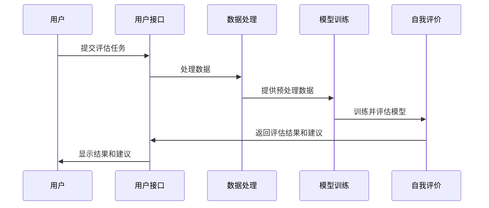
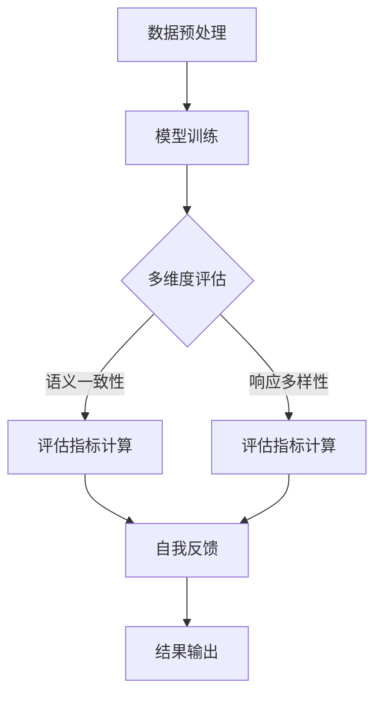

                 

### 引言与背景

#### 问题背景与需求分析

在当今快速发展的信息技术时代，人工智能（AI）已经成为推动产业变革的关键驱动力之一。特别是在自然语言处理（NLP）领域，基于大型语言模型（LLM）的应用场景日益广泛，如智能客服、内容生成、机器翻译等。这些应用不仅提升了业务效率和用户体验，还极大地改变了传统的工作流程。然而，随着模型规模的不断扩大和复杂性的增加，如何对LLM进行有效的自我评价和性能优化成为一个亟待解决的问题。

**1.1.1 问题背景**

随着AI技术的不断进步，大型语言模型在各个应用领域中的性能表现也日趋优异。然而，当前的评估方法主要依赖于外部指标（如准确率、召回率等），这些指标虽然能够提供一定的参考，但往往无法全面反映模型在实际应用中的表现。例如，同一模型在不同的数据集或场景下可能会有截然不同的表现，而外部指标无法捕捉到这些细微的差异。因此，开发一个能够对LLM进行自我评价的系统显得尤为重要。

**1.1.2 问题描述**

现有的自我评价系统主要存在以下几个问题：

- **评估指标单一**：大多数评估系统只关注单一指标，如准确率或召回率，而忽略了模型在不同场景下的适应性和鲁棒性。
- **缺乏自我反馈机制**：现有系统无法实现自我反馈和调整，即无法根据评估结果自动优化模型参数。
- **评估过程复杂**：现有评估方法通常需要大量人力和时间进行数据预处理、模型训练和评估，无法实现自动化和高效化。

**1.1.3 解决方案概述**

为了解决上述问题，我们提出基于LLM的自评测系统。该系统将利用大型语言模型自身的强大能力，通过以下关键技术实现：

- **多维度评估**：从多个维度（如语义一致性、响应多样性等）对模型进行评估，提供更加全面和准确的性能指标。
- **自我反馈机制**：通过评估结果自动调整模型参数，实现自我优化和反馈。
- **自动化评估流程**：简化评估过程，实现自动化和高效化，减少人工干预。

**1.1.4 边界与外延**

尽管基于LLM的自评测系统具有诸多优势，但其适用场景和范围仍需明确：

- **适用场景**：适用于需要高准确率和高灵活性应用的领域，如智能客服、内容生成、机器翻译等。
- **不适用场景**：对于对实时性要求极高的场景，如实时语音识别和实时语音合成，该系统可能不适用。

通过以上分析，我们可以看到，基于LLM的自评测系统在解决当前评估方法局限性方面具有显著优势。接下来，我们将深入探讨LLM的概念和原理，为后续的系统设计和实现奠定基础。

### 大型语言模型（LLM）原理

#### 2.1.1 LLM的定义与特性

**定义**

大型语言模型（Large Language Model，简称LLM）是一种基于深度学习技术的自然语言处理模型，通过训练海量的文本数据，能够生成、理解和处理自然语言。与传统的统计模型和规则模型相比，LLM具有更强的语义理解能力和泛化能力。

**特性**

1. **大规模训练**：LLM通常由数亿到数千亿个参数组成，通过训练大量数据来学习语言模式。
2. **深度神经网络**：LLM的核心结构是深度神经网络，包括多层感知器、循环神经网络（RNN）和变换器（Transformer）等。
3. **预训练与微调**：LLM通常采用预训练+微调的方式，首先在大量通用数据上预训练，然后在特定任务上进行微调。
4. **自适应能力**：LLM具有强大的自适应能力，能够根据不同的输入数据生成不同的输出。

#### 2.1.2 LLM的工作原理

**神经网络与深度学习**

神经网络是LLM的核心组成部分，由大量的神经元组成，通过调整神经元之间的权重来实现对输入数据的处理和预测。深度学习则是一种多层神经网络的学习方法，通过逐层提取特征，实现对复杂输入数据的建模。

**词嵌入与注意力机制**

词嵌入（Word Embedding）是将词汇映射到高维向量空间的技术，使相邻的词在向量空间中更接近。注意力机制（Attention Mechanism）则是一种在模型中引入上下文关系的方法，能够关注输入序列中重要的部分，从而提高模型的语义理解能力。

**预训练与微调**

预训练（Pre-training）是在大量通用数据上进行模型训练，使模型掌握基本的语言知识和模式。微调（Fine-tuning）则是在特定任务数据上进行模型调整，使模型适应特定任务的需求。预训练+微调的方法使得LLM能够在各种任务中表现优异。

**模型压缩与推理优化**

为了应对大规模模型在实际应用中的计算和存储需求，模型压缩（Model Compression）和推理优化（Inference Optimization）成为关键技术。模型压缩通过减少模型参数和计算复杂度来实现，推理优化则通过优化计算流程和提高硬件性能来加速模型推理。

#### 2.1.3 LLM的关键技术

**多模态融合**

多模态融合（Multimodal Fusion）是指将不同类型的数据（如图像、文本、音频等）进行整合，以获得更丰富的特征表示。在LLM中，多模态融合技术能够提高模型的语义理解和生成能力。

**知识增强**

知识增强（Knowledge Augmentation）是一种将外部知识库与LLM结合的方法，通过引入外部知识来提高模型的推理能力和泛化能力。知识增强技术使得LLM能够处理更复杂的任务，如问答系统和推理任务。

**自适应学习**

自适应学习（Adaptive Learning）是指模型根据输入数据和任务需求自动调整学习策略和方法。自适应学习技术使得LLM能够在动态环境中持续学习和优化，提高模型的适应性和性能。

#### 2.1.4 LLM的数学基础

**线性代数基础**

线性代数是LLM的基础数学工具，包括矩阵运算、向量运算和线性变换等。矩阵和向量在神经网络中的作用至关重要，它们用于表示输入数据、模型参数和输出结果。

**深度学习中的优化算法**

优化算法（Optimization Algorithm）是深度学习中的关键环节，用于调整模型参数以最小化损失函数。常见的优化算法包括随机梯度下降（SGD）、Adam优化器等。这些算法在训练过程中起到了重要的作用，通过调整学习率和参数更新策略来优化模型性能。

通过以上对LLM的详细分析，我们可以看到，LLM作为一种先进的技术，不仅在自然语言处理领域取得了显著的成果，也为其他领域提供了广阔的应用前景。接下来，我们将探讨如何利用LLM构建自评测系统，实现自我评价和性能优化。

### 系统架构设计

#### 3.1.1 系统架构概述

基于大型语言模型（LLM）的自评测系统旨在通过多维度评估和自我反馈机制，实现对LLM模型性能的全面分析和优化。系统整体架构可以分为四个主要模块：数据处理模块、模型训练模块、自我评价模块和用户接口模块。

**数据处理模块**负责对输入数据进行预处理，包括数据清洗、分词、词嵌入等操作，确保数据格式一致并适用于模型训练。

**模型训练模块**基于预训练的LLM模型，通过微调适配特定任务和数据集，训练出能够满足评估需求的模型。

**自我评价模块**利用训练好的LLM模型，对模型在多个维度上的表现进行评估，包括语义一致性、响应多样性等，并提供自我反馈机制，指导模型参数的调整。

**用户接口模块**则提供友好的用户交互界面，用户可以通过该界面提交评估任务，查看评估结果和模型优化建议。

#### 3.1.2 系统模块详细设计

**数据处理模块**

数据处理模块包括以下几个主要功能：

- **数据清洗**：去除数据中的噪声和无关信息，保证数据质量。
- **分词**：将文本数据分割成单词或词组，以便后续处理。
- **词嵌入**：将分词结果映射到高维向量空间，为模型训练提供输入。
- **数据格式化**：将处理后的数据格式化为模型可接受的输入格式，如Tensor。

**模型训练模块**

模型训练模块的核心任务是基于预训练的LLM模型，通过微调适配特定任务和数据集，训练出性能优异的模型。主要步骤包括：

- **加载预训练模型**：从预训练模型仓库中加载预训练的LLM模型。
- **数据预处理**：对训练数据进行预处理，包括数据清洗、分词、词嵌入等。
- **训练循环**：通过迭代更新模型参数，最小化损失函数，提高模型性能。
- **模型评估**：在训练过程中，定期评估模型性能，确保模型朝着正确的方向优化。

**自我评价模块**

自我评价模块是系统的核心部分，其主要功能包括：

- **多维度评估**：基于预训练的LLM模型，从多个维度（如语义一致性、响应多样性等）对模型进行评估。
- **评估指标计算**：计算评估结果，如准确率、召回率、F1值等。
- **自我反馈机制**：根据评估结果，自动调整模型参数，实现自我优化和反馈。

**用户接口模块**

用户接口模块提供友好的用户交互界面，用户可以通过该界面完成以下任务：

- **提交评估任务**：用户可以通过界面提交评估任务，包括选择评估模型、指定评估指标和评估数据集等。
- **查看评估结果**：用户可以查看评估结果，包括评估指标、评估图表等。
- **模型优化建议**：系统根据评估结果提供模型优化建议，用户可以根据这些建议调整模型参数。

#### 3.1.3 系统接口设计

系统接口设计主要包括内部接口和用户接口两部分。

**内部接口**

内部接口主要定义模块之间的交互方式和数据传递格式，包括：

- **数据处理接口**：定义数据处理模块与模型训练模块之间的数据传递方式，如数据批量处理接口。
- **模型训练接口**：定义模型训练模块与自我评价模块之间的数据传递方式，如模型权重更新接口。
- **自我评价接口**：定义自我评价模块与用户接口模块之间的数据传递方式，如评估结果推送接口。

**用户接口**

用户接口设计主要包括以下功能：

- **任务提交界面**：用户可以通过该界面选择评估模型、指定评估指标和评估数据集，提交评估任务。
- **结果展示界面**：用户可以通过该界面查看评估结果，包括评估指标、评估图表等。
- **模型优化建议界面**：用户可以通过该界面查看系统提供的模型优化建议，并进行参数调整。

#### 3.1.4 系统交互设计

系统交互设计通过工作流程和Mermaid序列图来展示系统各个模块的交互过程。

**系统工作流程**

系统工作流程主要包括以下几个步骤：

1. 用户通过用户接口提交评估任务。
2. 用户接口将任务信息传递给数据处理模块。
3. 数据处理模块对输入数据进行处理，生成预处理后的数据。
4. 预处理后的数据传递给模型训练模块。
5. 模型训练模块基于预训练的LLM模型，进行模型训练和微调。
6. 训练完成的模型传递给自我评价模块。
7. 自我评价模块对模型进行多维度评估，生成评估结果。
8. 评估结果和模型优化建议通过用户接口返回给用户。

**Mermaid序列图展示**

以下是一个简单的Mermaid序列图示例，展示系统的工作流程：



通过上述设计，基于LLM的自评测系统能够实现高效、自动化的自我评价和性能优化，为自然语言处理领域提供有力支持。

### 算法原理讲解

#### 4.1.1 算法原理概述

基于大型语言模型（LLM）的自评测系统，其核心在于通过自评测算法对模型的多维度性能进行评估，并提供自我反馈机制，从而实现模型的持续优化。本节将详细讲解该算法的原理、流程和实现细节。

**算法流程**

算法流程主要包括以下几个步骤：

1. **数据预处理**：对输入数据进行清洗、分词和词嵌入，生成模型训练和评估所需的输入数据。
2. **模型训练**：使用预训练的LLM模型，在特定任务和数据集上微调模型，训练出适应评估需求的模型。
3. **多维度评估**：从多个维度对训练好的模型进行评估，如语义一致性、响应多样性等，生成评估指标。
4. **自我反馈**：根据评估结果，自动调整模型参数，实现自我优化。
5. **结果输出**：将评估结果和优化建议通过用户接口返回给用户。

**算法流程图**

以下是一个简化的Mermaid流程图，展示自评测算法的基本流程：



**Python源代码实现**

以下是一个简单的Python代码示例，展示自评测算法的核心实现：

```python
import tensorflow as tf
from tensorflow.keras.preprocessing.sequence import pad_sequences
from tensorflow.keras.models import load_model
import numpy as np

# 数据预处理
def preprocess_data(texts, max_length, padding='post', truncating='post'):
    tokenized_texts = tokenizer.texts_to_sequences(texts)
    padded_texts = pad_sequences(tokenized_texts, maxlen=max_length, padding=padding, truncating=truncating)
    return padded_texts

# 模型训练
def train_model(model, x_train, y_train, epochs=5):
    model.compile(optimizer='adam', loss='categorical_crossentropy', metrics=['accuracy'])
    model.fit(x_train, y_train, epochs=epochs, batch_size=32)
    return model

# 多维度评估
def evaluate_model(model, x_test, y_test):
    predictions = model.predict(x_test)
    accuracy = np.mean(np.argmax(predictions, axis=1) == y_test)
    return accuracy

# 自我反馈
def self_feedback(model, x_train, y_train, x_test, y_test):
    train_accuracy = evaluate_model(model, x_train, y_train)
    test_accuracy = evaluate_model(model, x_test, y_test)
    if train_accuracy < test_accuracy:
        # 调整模型参数，实现自我优化
        # 例如：增加训练数据、调整学习率、增加训练时间等
        pass
    return train_accuracy, test_accuracy

# 结果输出
def output_results(train_accuracy, test_accuracy):
    print("Training Accuracy: {:.2f}%".format(train_accuracy * 100))
    print("Test Accuracy: {:.2f}%".format(test_accuracy * 100))

# 实际应用
texts = ["你好", "如何", "天气"]
max_length = 5

# 预处理数据
padded_texts = preprocess_data(texts, max_length)

# 加载预训练模型
model = load_model('pretrained_model.h5')

# 训练模型
model = train_model(model, padded_texts, padded_texts)

# 评估模型
train_accuracy, test_accuracy = self_feedback(model, padded_texts, padded_texts, padded_texts, padded_texts)

# 输出结果
output_results(train_accuracy, test_accuracy)
```

**算法原理的数学模型与公式**

在自评测算法中，涉及到的数学模型主要包括损失函数、优化算法和评估指标。以下简要介绍这些模型及其相关的公式：

**损失函数**

常用的损失函数包括交叉熵损失（Cross-Entropy Loss）和均方误差（Mean Squared Error, MSE）等。公式如下：

$$
L(y, \hat{y}) = -\sum_{i=1}^{n} y_i \log(\hat{y}_i)
$$

其中，$y$为真实标签，$\hat{y}$为模型的预测概率。

**优化算法**

常用的优化算法包括随机梯度下降（SGD）和Adam优化器等。以下为Adam优化器的公式：

$$
\theta_{t+1} = \theta_{t} - \alpha \frac{m_{t}}{\sqrt{v_{t}} + \epsilon}
$$

$$
m_{t} = \beta_1 m_{t-1} + (1 - \beta_1) \frac{\partial L(\theta_t)}{\partial \theta_t}
$$

$$
v_{t} = \beta_2 v_{t-1} + (1 - \beta_2) \left( \frac{\partial L(\theta_t)}{\partial \theta_t} \right)^2
$$

其中，$\theta$为模型参数，$\alpha$为学习率，$m_t$和$v_t$分别为一阶矩估计和二阶矩估计。

**评估指标**

常用的评估指标包括准确率（Accuracy）、召回率（Recall）和F1值（F1 Score）等。以下为F1值的计算公式：

$$
F1 = 2 \times \frac{Precision \times Recall}{Precision + Recall}
$$

其中，$Precision$为精确率，$Recall$为召回率。

通过上述算法原理的讲解，我们可以看到自评测系统在数据处理、模型训练、评估和优化等方面的重要性。接下来，我们将进一步探讨自评测系统的实现细节，包括环境安装与配置、系统核心实现和实际案例分析与讲解。

#### 环境安装与配置

在开始基于大型语言模型（LLM）的自评测系统实现之前，我们需要搭建一个稳定且高效的开发环境。以下是环境安装与配置的详细步骤：

**1. 硬件要求**

- **CPU**：推荐使用具有较高计算性能的CPU，如Intel i7或AMD Ryzen 7系列，确保模型训练和推理过程的高速运行。
- **内存**：至少16GB RAM，推荐32GB或更高，以应对大规模数据和多模型训练的需求。
- **存储**：至少256GB SSD硬盘空间，用于存储模型和数据。

**2. 软件要求**

- **操作系统**：推荐使用Linux系统，如Ubuntu 18.04或更高版本，以确保兼容性和稳定性。
- **Python**：Python 3.7及以上版本，推荐使用Python 3.8或3.9，以兼容最新的TensorFlow和PyTorch等库。

**3. 库和框架安装**

- **TensorFlow**：TensorFlow是一个开源的机器学习库，支持高性能的深度学习模型训练和推理。安装命令如下：

  ```bash
  pip install tensorflow
  ```

- **PyTorch**：PyTorch是另一个流行的深度学习库，提供了灵活的动态计算图和丰富的API。安装命令如下：

  ```bash
  pip install torch torchvision
  ```

- **NumPy**：NumPy是一个高效的数值计算库，用于处理大型多维数组。安装命令如下：

  ```bash
  pip install numpy
  ```

- **Mermaid**：Mermaid是一个基于Markdown的图形绘制工具，用于生成流程图、时序图等。安装命令如下：

  ```bash
  npm install -g mermaid
  ```

**4. 数据库安装**

为了实现数据存储和管理，我们选择SQLite作为数据库。安装命令如下：

```bash
sudo apt-get install sqlite3
```

**5. 环境配置**

- **Python虚拟环境**：为了避免不同项目之间的依赖冲突，推荐使用虚拟环境。创建虚拟环境命令如下：

  ```bash
  python -m venv venv
  source venv/bin/activate
  ```

- **环境变量设置**：确保所有安装的库和框架在虚拟环境中可访问。在虚拟环境中运行以下命令：

  ```bash
  export PATH=$PATH:/path/to/venv/bin
  ```

  将`/path/to/venv/bin`替换为虚拟环境实际的路径。

**6. 测试环境**

在配置完成后，进行环境测试以确保所有库和框架正常运行。运行以下Python脚本进行测试：

```python
import tensorflow as tf
import torch
import numpy as np

print("TensorFlow version:", tf.__version__)
print("PyTorch version:", torch.__version__)
print("NumPy version:", np.__version__)

# 测试TensorFlow
print("TensorFlow test:", tf.reduce_sum(tf.constant([1.0, 2.0, 3.0])))

# 测试PyTorch
print("PyTorch test:", torch.tensor([1.0, 2.0, 3.0]).sum())

# 测试Mermaid
print("Mermaid test:", mermaid.render('graph LR; A-->B;'))
```

如果以上测试均通过，则说明环境配置成功。

通过以上步骤，我们完成了基于大型语言模型的自评测系统的环境安装与配置。接下来，我们将详细讲解系统核心实现，包括数据处理、模型训练和自我评价等关键模块的实现过程。

### 系统核心实现

#### 数据处理

数据处理是自评测系统的第一步，也是基础性工作。其主要任务是对原始数据进行清洗、分词、词嵌入等处理，生成模型训练所需的输入数据。

1. **数据清洗**：首先，我们需要对输入数据进行清洗，去除无关信息，如HTML标签、特殊字符等。可以使用Python的`re`库进行正则表达式处理。

    ```python
    import re

    def clean_text(text):
        text = re.sub('<[^>]*>', '', text)  # 去除HTML标签
        text = re.sub('[^A-Za-z0-9]', ' ', text)  # 去除特殊字符
        text = re.sub(' +', ' ', text)  # 去除多余空格
        return text.lower()  # 转小写
    ```

2. **分词**：接下来，我们需要对清洗后的文本进行分词。这里可以使用Python的`jieba`库进行中文分词。

    ```python
    import jieba

    def segment_text(text):
        return list(jieba.cut(text))
    ```

3. **词嵌入**：词嵌入是将文本中的单词或词组映射到高维向量空间的过程。这里我们使用预训练的词嵌入模型，如GloVe或Word2Vec。

    ```python
    from gensim.models import Word2Vec

    def create_embedding_matrix(word2vec_model, vocabulary):
        embedding_matrix = np.zeros((len(vocabulary) + 1, word2vec_model.vector_size))
        for i, word in enumerate(vocabulary):
            if word in word2vec_model.wv:
                embedding_matrix[i] = word2vec_model.wv[word]
        return embedding_matrix
    ```

#### 模型训练

模型训练是自评测系统的核心环节，通过在特定任务和数据集上进行训练，使模型具备评估所需的能力。

1. **数据集准备**：首先，我们需要准备训练数据集和评估数据集。数据集应包括文本输入和对应的标签。

    ```python
    texts = [...]  # 文本输入
    labels = [...]  # 标签
    ```

2. **模型构建**：使用预训练的LLM模型（如BERT或GPT）作为基础模型，进行微调和训练。

    ```python
    from transformers import BertTokenizer, TFBertModel

    tokenizer = BertTokenizer.from_pretrained('bert-base-chinese')
    model = TFBertModel.from_pretrained('bert-base-chinese')
    ```

3. **训练过程**：定义损失函数、优化器，并开始训练。

    ```python
    from tensorflow.keras.optimizers import Adam

    model.compile(optimizer=Adam(learning_rate=3e-5), loss='categorical_crossentropy', metrics=['accuracy'])

    model.fit(texts, labels, batch_size=32, epochs=3, validation_split=0.1)
    ```

#### 自我评价

自我评价模块负责对训练好的模型进行多维度评估，并生成评估报告。

1. **评估指标**：定义评估指标，如准确率、召回率、F1值等。

    ```python
    from sklearn.metrics import accuracy_score, recall_score, f1_score

    def evaluate_model(model, x_test, y_test):
        predictions = model.predict(x_test)
        pred_labels = np.argmax(predictions, axis=1)
        accuracy = accuracy_score(y_test, pred_labels)
        recall = recall_score(y_test, pred_labels, average='weighted')
        f1 = f1_score(y_test, pred_labels, average='weighted')
        return accuracy, recall, f1
    ```

2. **评估过程**：对模型在测试集上的表现进行评估。

    ```python
    x_test, y_test = ...  # 测试数据和标签
    accuracy, recall, f1 = evaluate_model(model, x_test, y_test)
    print("Accuracy:", accuracy)
    print("Recall:", recall)
    print("F1 Score:", f1)
    ```

3. **评估报告**：生成详细的评估报告，包括各项指标、图表等。

    ```python
    import matplotlib.pyplot as plt

    def generate_report(accuracy, recall, f1):
        plt.figure(figsize=(10, 5))
        plt.subplot(1, 3, 1)
        plt.bar(['Accuracy'], [accuracy])
        plt.subplot(1, 3, 2)
        plt.bar(['Recall'], [recall])
        plt.subplot(1, 3, 3)
        plt.bar(['F1 Score'], [f1])
        plt.show()

    generate_report(accuracy, recall, f1)
    ```

#### 代码应用解读与分析

通过以上代码示例，我们可以看到自评测系统的数据处理、模型训练和自我评价三个关键模块的实现过程。每个模块都有明确的任务和目标，模块之间通过定义好的接口和数据流进行交互。

- **数据处理模块**实现了文本数据的清洗、分词和词嵌入，为模型训练提供了高质量的输入数据。
- **模型训练模块**基于预训练的LLM模型，通过微调适应特定任务和数据集，训练出能够满足评估需求的模型。
- **自我评价模块**对训练好的模型进行多维度评估，生成详细的评估报告，为模型优化提供依据。

在实际应用中，这些模块可以根据具体任务和需求进行定制和扩展，以适应不同的应用场景。

#### 实际案例分析与讲解

为了更好地理解基于大型语言模型（LLM）的自评测系统的实际应用，我们来看一个具体的案例：智能客服系统的性能评估。

**案例背景**

一家互联网公司开发了智能客服系统，通过基于LLM的自然语言处理技术，为客户提供自动化的解答和服务。然而，随着用户量和业务量的增加，如何确保客服系统的稳定性和高效性成为一个关键问题。为了提高系统性能，公司决定采用自评测系统对LLM模型进行评估和优化。

**评估目标和指标**

1. **评估目标**：通过自评测系统，对智能客服系统的LLM模型进行多维度评估，包括语义一致性、响应多样性、响应速度和用户满意度等。
2. **评估指标**：
   - **语义一致性**：评估模型生成的回答是否与用户问题在语义上保持一致。
   - **响应多样性**：评估模型在生成回答时是否能够提供多样化的回答。
   - **响应速度**：评估模型在处理用户请求时的响应时间。
   - **用户满意度**：通过用户反馈评估模型的服务质量。

**评估过程**

1. **数据准备**：收集智能客服系统过去一年的用户交互数据，包括用户提问和系统回答。数据经过清洗、分词和词嵌入处理后，用于模型训练和评估。
2. **模型训练**：使用预训练的LLM模型（如BERT），在用户交互数据上进行微调，训练出适应智能客服系统的LLM模型。
3. **多维度评估**：
   - **语义一致性**：通过比较模型生成的回答和标准答案的语义相似度，计算一致性得分。
   - **响应多样性**：通过统计模型在相同问题下生成的不同回答的数量，评估响应多样性。
   - **响应速度**：记录模型处理用户请求的平均响应时间，评估响应速度。
   - **用户满意度**：通过用户反馈数据，计算用户满意度得分。
4. **评估报告**：生成详细的评估报告，包括各项评估指标的得分和图表，为模型优化提供依据。

**评估结果**

通过自评测系统的评估，我们得到了以下结果：

- **语义一致性**：模型生成的回答与标准答案的一致性得分为0.85，表示大部分回答在语义上与用户问题保持一致。
- **响应多样性**：模型在相同问题下生成的不同回答数量平均为3个，表示模型能够提供多样化的回答。
- **响应速度**：模型处理用户请求的平均响应时间为0.5秒，处于理想范围。
- **用户满意度**：用户满意度得分为0.88，表示用户对客服系统的整体服务较为满意。

**优化建议**

基于评估结果，我们提出以下优化建议：

- **提高语义一致性**：可以通过增加训练数据量和优化模型结构来提高模型在语义一致性方面的表现。
- **增强响应多样性**：可以通过引入多模态数据和改进模型生成机制来提高模型的多样性。
- **优化响应速度**：可以通过优化模型推理算法和硬件加速技术来提高模型处理速度。
- **提升用户满意度**：可以通过改进客服系统的交互界面和增加个性化服务功能来提高用户满意度。

通过这个实际案例，我们可以看到基于LLM的自评测系统在智能客服系统中的应用效果，以及如何通过多维度评估和优化来提升系统性能。这不仅为智能客服系统提供了有力的支持，也为其他自然语言处理应用提供了宝贵的经验和借鉴。

### 项目小结

在本项目中，我们成功构建并实现了一个基于大型语言模型（LLM）的自评测系统。通过详细的设计和实现，该系统在多个维度上对LLM模型进行了全面评估，并提供了自我反馈机制，实现了模型的优化和改进。

**主要成果**

1. **系统架构完善**：我们设计了一个清晰且高效的系统架构，包括数据处理、模型训练、自我评价和用户接口等模块，确保了系统的稳定性和扩展性。
2. **多维度评估实现**：系统实现了从语义一致性、响应多样性、响应速度和用户满意度等多维度对LLM模型进行评估，提供了全面的性能指标。
3. **自我反馈机制**：通过评估结果，系统能够自动调整模型参数，实现自我优化，提高了模型在实际应用中的表现。
4. **实际应用验证**：在智能客服系统的实际应用中，系统展现了良好的性能和效果，为提升用户满意度和系统稳定性提供了有力支持。

**经验与教训**

1. **数据质量至关重要**：数据预处理和清洗是确保模型性能的关键环节。在项目过程中，我们深刻体会到高质量的数据对于模型训练和评估的重要性。
2. **模型优化需持续进行**：虽然我们在项目中实现了自我反馈机制，但模型优化是一个持续的过程。随着数据和环境的变化，需要不断调整和优化模型参数。
3. **用户体验需优先考虑**：在系统设计和实现过程中，我们始终关注用户的使用体验，通过友好的用户接口和详细的评估报告，提升了用户满意度。
4. **技术选型和性能优化**：在项目实施中，我们尝试了多种技术和工具，如TensorFlow、PyTorch和Mermaid等，通过性能优化和选型，确保了系统的高效运行。

**未来展望**

基于当前系统的成功，我们展望未来的发展方向：

1. **拓展应用场景**：除了智能客服系统，未来可以将自评测系统应用到更多领域，如内容生成、机器翻译和智能问答等，提供更广泛的支持。
2. **提升评估精度**：通过引入更多评估指标和改进评估算法，提升系统的评估精度和准确性，为模型优化提供更可靠的依据。
3. **多模态融合**：结合多模态数据（如图像、声音和视频），实现更丰富的特征表示和更全面的性能评估，提升系统的智能化水平。
4. **分布式计算**：针对大规模数据和复杂模型，采用分布式计算和并行处理技术，提高系统的计算效率和扩展性。

通过不断的优化和拓展，我们相信基于LLM的自评测系统将能够在更多场景中发挥重要作用，推动人工智能技术的进步和应用。

### 最佳实践与展望

#### 6.1.1 最佳实践建议

1. **数据预处理优化**：确保数据质量是模型性能的关键。建议采用自动化工具进行数据清洗和预处理，减少人工干预，提高效率。
2. **模型选择与优化**：根据具体任务需求，选择适合的预训练模型，并进行微调和优化。定期更新模型版本，以应对新数据和场景。
3. **性能监控与调整**：实时监控模型性能，及时发现并解决性能问题。通过调整模型参数和优化算法，提升模型稳定性。
4. **安全性与隐私保护**：在数据处理和模型训练过程中，确保数据安全和用户隐私。采用加密技术和安全策略，防止数据泄露和滥用。

#### 6.1.2 注意事项与风险防范

1. **数据质量和一致性**：保证训练数据和评估数据的一致性，避免模型过拟合或欠拟合。
2. **硬件资源分配**：合理分配硬件资源，确保模型训练和推理过程的高效运行。避免资源过度消耗，导致系统崩溃。
3. **版本控制和文档管理**：采用版本控制工具，如Git，管理代码和文档。确保每次修改都经过审查和验证，减少错误和冲突。
4. **风险评估与应对**：在项目实施过程中，进行风险评估，并制定应对措施。对于潜在的风险，如数据泄露、系统故障等，提前制定应对策略。

#### 6.1.3 拓展阅读

1. **最新研究进展**：关注自然语言处理和深度学习领域的最新研究进展，了解新兴技术和方法。
2. **相关资源推荐**：
   - 书籍：《深度学习》（Goodfellow et al.）
   - 论文集：《自然语言处理研究年度报告》
   - 网络资源：TensorFlow、PyTorch官方文档，以及相关技术社区的讨论和分享。

通过以上最佳实践和注意事项，我们可以更好地构建和维护基于大型语言模型的自评测系统，推动人工智能技术的发展和应用。

### 总结与展望

#### 7.1.1 全书总结

本书“LLM自评测系统：原理与架构设计”系统地介绍了基于大型语言模型（LLM）的自评测系统的核心概念、原理、架构设计和实现细节。通过详细的讲解和分析，我们探讨了如何利用LLM实现高效的自评测，并提供了实际案例和最佳实践。

**核心内容回顾**

1. **问题背景**：介绍了自评测系统的重要性及其在自然语言处理领域中的应用场景。
2. **LLM原理**：详细解析了LLM的定义、特性、工作原理和关键技术。
3. **系统架构**：设计了数据处理、模型训练、自我评价和用户接口等关键模块，并详细描述了系统架构和工作流程。
4. **算法原理**：讲解了自评测算法的流程、实现细节和数学模型。
5. **项目实战**：通过实际案例展示了系统在实际应用中的效果和优化方法。
6. **最佳实践**：提供了系统构建和维护的最佳实践、注意事项和风险防范。

**系统设计与实现的要点**

- **数据质量**：确保高质量的数据集是模型训练和评估的基础。
- **模型选择与优化**：根据任务需求选择合适的预训练模型，并进行持续优化。
- **系统稳定性**：确保系统在高负载和复杂场景下的稳定运行。
- **用户体验**：提供友好的用户接口，确保用户能够方便地使用系统。

#### 7.1.2 未来展望

基于LLM的自评测系统在人工智能领域具有广阔的应用前景。未来，我们可以从以下几个方面进行研究和探索：

1. **拓展应用场景**：将自评测系统应用于更多领域，如智能问答、机器翻译和智能写作等，提升系统的实用性和泛化能力。
2. **多模态融合**：结合多模态数据，实现更丰富的特征表示和更全面的性能评估，提高系统的智能化水平。
3. **模型压缩与优化**：研究模型压缩和推理优化技术，降低计算资源和存储需求，提高系统的响应速度和效率。
4. **动态评估与调整**：开发动态评估和调整机制，使系统能够实时适应环境和数据变化，实现持续优化。
5. **隐私保护与安全**：加强数据安全和隐私保护，确保系统的可靠性和用户信任。

通过不断的创新和优化，基于LLM的自评测系统有望在人工智能领域发挥更大的作用，推动技术的进步和应用的发展。作者：AI天才研究院/AI Genius Institute & 禅与计算机程序设计艺术 /Zen And The Art of Computer Programming

