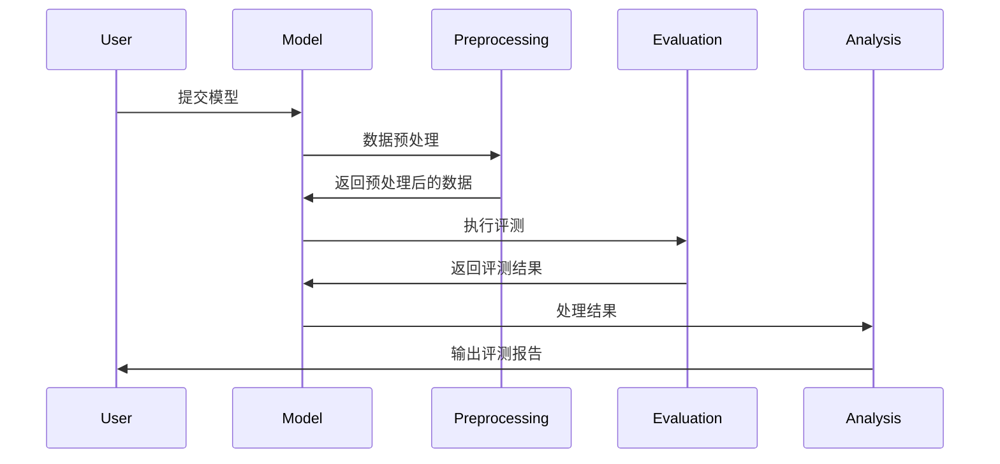
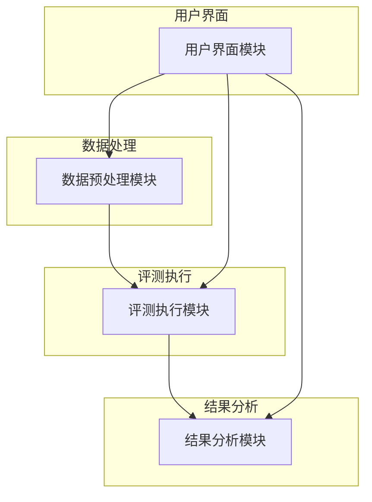

                 


### 第1章：大模型评测概述

#### 1.1 大模型发展的背景

随着人工智能技术的飞速发展，深度学习模型逐渐成为许多领域的核心驱动力。特别是在自然语言处理（NLP）、计算机视觉（CV）和推荐系统等领域，大型神经网络模型如BERT、GPT和ResNet等取得了显著的成功。这些模型通过在海量数据上进行训练，能够实现前所未有的性能和表现。然而，随着模型规模的不断扩大，如何有效地评估和比较这些大型模型的效果成为一个亟待解决的问题。

#### 1.2 大模型评测的必要性

大模型评测的必要性主要体现在以下几个方面：

1. **性能评估**：通过评测，可以客观地评估模型在特定任务上的性能，为模型选择提供依据。
2. **优化指导**：评测结果可以指导模型优化，帮助研究人员找出模型存在的问题和改进方向。
3. **公平竞争**：在学术界和工业界，模型评测是衡量研究成果和产品竞争力的重要标准。
4. **数据质量控制**：评测过程中需要使用高质量的数据集，这有助于提高数据集的统一性和标准化。

#### 1.3 大模型评测的挑战与问题

尽管大模型评测的重要性不言而喻，但同时也面临着一系列挑战和问题：

1. **数据多样性和质量**：大模型训练数据往往需要涵盖多种场景和情境，数据质量的高低直接影响到评测结果的可靠性。
2. **评测效率与成本**：大规模模型的评测通常需要大量计算资源，如何提高评测效率和降低成本是一个重要问题。
3. **结果客观性与可解释性**：如何保证评测结果的客观性和可解释性，避免主观偏见，是评测过程中需要关注的关键点。
4. **评测标准统一性**：不同领域、不同任务之间的评测标准存在差异，如何实现评测标准的统一性是一个挑战。

在接下来的章节中，我们将详细探讨大模型评测的核心概念、方法、自动化评测系统的构建与实施流程，以及评测结果的分析与优化策略。

### 第2章：大模型评测核心概念

#### 2.1 评测指标与评估方法

大模型评测的指标和方法是评估模型性能的核心。以下是一些常见的评测指标和方法：

1. **准确率（Accuracy）**：准确率是评估分类模型性能的基本指标，表示模型正确分类的样本数占总样本数的比例。其计算公式为：
   $$
   \text{Accuracy} = \frac{\text{正确分类的样本数}}{\text{总样本数}}
   $$

2. **召回率（Recall）**：召回率是评估模型在正类样本上的表现，表示模型正确召回的正类样本数与实际正类样本数的比例。其计算公式为：
   $$
   \text{Recall} = \frac{\text{正确召回的正类样本数}}{\text{实际正类样本数}}
   $$

3. **精确率（Precision）**：精确率是评估模型在负类样本上的表现，表示模型正确召回的正类样本数与召回的正类样本数的比例。其计算公式为：
   $$
   \text{Precision} = \frac{\text{正确召回的正类样本数}}{\text{召回的正类样本数}}
   $$

4. **F1分数（F1 Score）**：F1分数是准确率、召回率和精确率的综合指标，其计算公式为：
   $$
   \text{F1 Score} = 2 \times \frac{\text{Precision} \times \text{Recall}}{\text{Precision} + \text{Recall}}
   $$

5. **ROC曲线与AUC值**：ROC曲线（Receiver Operating Characteristic Curve）是评估二分类模型性能的重要工具，AUC值（Area Under Curve）表示ROC曲线下方的面积，AUC值越大，模型性能越好。

#### 2.2 数据集与样本选择

数据集和样本选择是影响评测结果的重要因素。以下是一些关于数据集和样本选择的关键点：

1. **数据集的类型与来源**：数据集可以分为公共数据集和私有数据集，公共数据集如ImageNet、CIFAR-10等，私有数据集由特定领域或机构提供。数据集的选择应考虑数据量、数据质量、多样性等因素。

2. **样本选择的重要性与策略**：样本选择应覆盖模型需要处理的各种场景和情境。常见的策略包括随机抽样、分层抽样和基于先验知识的抽样等。

#### 2.3 评测流程与步骤

大模型评测通常包括以下步骤：

1. **评测前准备**：包括数据预处理、模型准备、评测环境配置等。
2. **评测执行**：执行模型评测，记录评测结果。
3. **评测结果处理与反馈**：对评测结果进行统计和分析，生成评测报告，为模型优化提供依据。

### 核心概念与联系

为了更好地理解大模型评测的核心概念，我们可以通过以下Mermaid ER实体关系图来展示各个概念之间的联系：

```mermaid
erDiagram
    Model ||--o> Dataset : 使用
    Model ||--o> EvaluationMetric : 评估
    Dataset ||--|> Preprocessing : 预处理
    EvaluationMetric ||--|> Calculation : 计算
    Model ||--|> Optimization : 优化
```

在此图中，`Model` 代表大模型，`Dataset` 代表数据集，`EvaluationMetric` 代表评测指标，`Preprocessing` 代表数据预处理，`Calculation` 代表评测计算，`Optimization` 代表模型优化。

### 小结

本章介绍了大模型评测的核心概念，包括评测指标、数据集和样本选择、评测流程等。通过核心概念的联系图，我们可以更清晰地理解这些概念之间的关系。在接下来的章节中，我们将进一步探讨大模型评测的方法与工具，以及自动化评测系统的设计与实现。

### 第3章：大模型评测方法与工具

#### 3.1 评测方法

大模型评测的方法多种多样，可以根据任务类型、数据特性等选择合适的方法。以下是一些常见的大模型评测方法：

1. **分类评测**：适用于分类任务，如文本分类、图像分类等。常用的评测指标包括准确率、召回率、精确率和F1分数。
2. **回归评测**：适用于回归任务，如房价预测、股票价格预测等。常用的评测指标包括均方误差（MSE）、均方根误差（RMSE）和平均绝对误差（MAE）。
3. **生成模型评测**：适用于生成任务，如图像生成、文本生成等。常用的评测指标包括频率匹配（Frequency Matching）、多样性（Diversity）和一致性（Consistency）。

每种评测方法都有其适用的场景和优缺点，需要根据具体任务选择合适的方法。

#### 3.2 评测工具

大模型评测工具是进行评测的关键，以下是一些常用的评测工具：

1. **开源评测工具**：如TensorFlow Model Optimization Tool (TF-MOT)、PyTorch Metrics等，它们提供了丰富的评测功能，方便用户进行模型评测。
2. **商业评测工具**：如Google's Model花园、IBM Watson Studio等，这些工具通常集成了更多的功能和优化，适用于企业级应用。
3. **自定义评测工具**：用户可以根据具体需求开发自定义评测工具，以适应特定的评测需求。

#### 3.3 评测框架设计与实现

评测框架是大模型评测的基础，它将评测过程中的各个环节整合在一起，提高评测的效率和质量。以下是一个简单的评测框架设计与实现步骤：

1. **需求分析**：明确评测任务的需求，包括任务类型、数据特性、评测指标等。
2. **框架设计**：设计评测框架的架构，包括数据预处理、评测执行、结果处理和分析等模块。
3. **实现核心模块**：
   - 数据预处理模块：负责对数据进行清洗、格式转换等预处理操作。
   - 评测执行模块：负责执行具体的评测方法，计算评测指标。
   - 结果处理和分析模块：负责对评测结果进行统计和分析，生成评测报告。
4. **接口设计与实现**：设计用户接口和内部接口，实现评测框架的功能。

### 系统架构设计与实现

为了更好地理解评测框架的设计与实现，我们可以通过以下Mermaid类图和序列图来展示系统架构：

**Mermaid 类图：**

```mermaid
classDiagram
    Preprocessing <<interface>>
    Evaluation <<interface>>
    Analysis <<interface>>

    Model -> Preprocessing : 数据预处理
    Model -> Evaluation : 评测执行
    Model -> Analysis : 结果处理

    Preprocessing <- Dataset : 数据源
    Evaluation <- Model : 模型输入
    Analysis <- Evaluation : 评测结果
```

**Mermaid 序列图：**



在此图中，`Model` 代表大模型，`Preprocessing` 代表数据预处理模块，`Evaluation` 代表评测执行模块，`Analysis` 代表结果处理和分析模块。用户通过提交模型，经过数据预处理、评测执行和结果处理，最终得到评测报告。

### 小结

本章介绍了大模型评测的方法与工具，包括分类评测、回归评测和生成模型评测等。同时，还介绍了评测工具的选择和评测框架的设计与实现。通过类图和序列图，我们能够更清晰地理解评测框架的架构和实现过程。在接下来的章节中，我们将探讨自动化评测系统的具体实施流程和案例。

### 第4章：自动化评测系统设计与实现

#### 4.1 系统设计原则与架构

自动化评测系统的设计原则包括可靠性、高效性、可扩展性和易维护性。系统架构应包括以下几个核心模块：

1. **数据预处理模块**：负责处理输入数据，包括数据清洗、格式转换、数据增强等。
2. **评测执行模块**：负责执行具体的评测算法，计算评测指标。
3. **结果分析模块**：负责分析评测结果，生成评测报告。
4. **用户界面模块**：提供用户交互界面，方便用户提交模型、查看评测结果等。

以下是一个简单的系统架构图：



#### 4.2 核心模块设计

**数据预处理模块**：该模块负责处理输入数据，包括数据清洗、格式转换和数据增强等。具体设计包括：

- **数据清洗**：去除数据中的噪声和异常值，保证数据质量。
- **格式转换**：将不同来源和格式的数据转换为统一的格式，方便后续处理。
- **数据增强**：通过数据增强技术，增加数据多样性，提高模型泛化能力。

**评测执行模块**：该模块负责执行具体的评测算法，计算评测指标。具体设计包括：

- **评测算法选择**：根据任务类型选择合适的评测算法，如分类评测、回归评测等。
- **评测指标计算**：计算评测指标，如准确率、召回率、精确率和F1分数等。
- **并行处理**：利用多线程或分布式计算技术，提高评测效率。

**结果分析模块**：该模块负责分析评测结果，生成评测报告。具体设计包括：

- **结果可视化**：使用图表和图形展示评测结果，方便用户直观理解。
- **报告生成**：生成详细的评测报告，包括评测指标、分析结果和优化建议等。

**用户界面模块**：该模块提供用户交互界面，方便用户提交模型、查看评测结果等。具体设计包括：

- **用户注册与登录**：用户注册、登录和权限管理。
- **模型提交**：用户可以上传模型，并设置评测参数。
- **结果查看**：用户可以查看评测结果，包括评测报告和分析图表。

#### 4.3 系统接口设计与实现

**用户接口**：用户接口的设计应简洁明了，提供方便用户使用的操作界面。具体设计包括：

- **模型提交界面**：用户可以选择模型文件，设置评测参数，提交评测任务。
- **评测结果界面**：用户可以查看评测结果，包括评测指标、分析图表和评测报告。

**内部接口**：内部接口的设计应保证模块之间的数据传递和功能调用。具体设计包括：

- **数据预处理接口**：数据预处理模块与其他模块之间的数据传递接口。
- **评测执行接口**：评测执行模块与其他模块之间的数据传递接口。
- **结果分析接口**：结果分析模块与其他模块之间的数据传递接口。

### 小结

本章介绍了自动化评测系统的设计原则和架构，以及核心模块的设计和系统接口的实现。通过系统架构图和接口设计，我们可以清晰地了解系统的工作流程和模块之间的关系。在接下来的章节中，我们将探讨评测系统的实施流程和实际案例，进一步验证系统的有效性。

