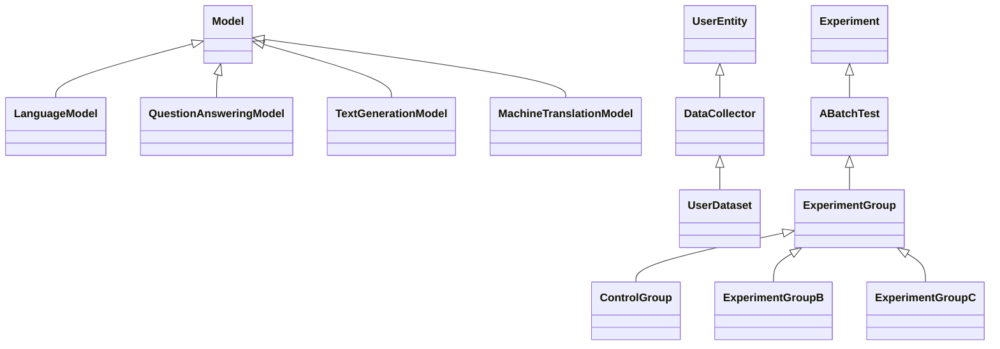
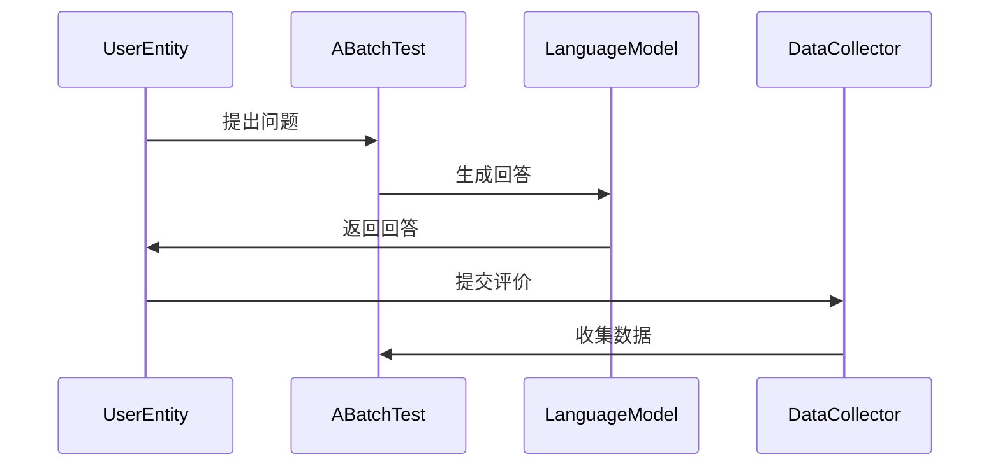

                 

### 引言与背景

#### 第1章 引言

##### 1.1 问题背景

在现代人工智能领域中，语言模型（Language Model, LLM）作为自然语言处理（Natural Language Processing, NLP）的核心技术之一，正发挥着越来越重要的作用。从最初的简单语言生成模型，发展到如今的复杂预训练模型，语言模型在文本生成、文本分类、机器翻译、问答系统等领域都取得了显著成果。然而，随着模型的不断进化，如何准确、客观地评估语言模型的性能成为了一个重要且亟待解决的问题。

语言模型评测（Language Model Evaluation）的目的是通过一系列指标和方法，客观、全面地衡量语言模型的性能。常见的评测指标包括Accuracy、F1 Score、BLEU Score等，这些指标在不同的应用场景下有着不同的适用性和重要性。然而，传统的评测方法往往存在一定的局限性，无法全面反映语言模型的实际性能。

##### 1.1.1 语言模型评测的重要性

语言模型评测在人工智能领域具有重要性，主要体现在以下几个方面：

1. **性能优化：** 评测结果可以帮助研究人员和开发者识别模型的性能瓶颈，从而有针对性地进行优化和改进。

2. **模型选择：** 在实际应用中，需要根据具体任务和需求选择合适的语言模型。评测结果为模型选择提供了客观依据。

3. **公平竞争：** 在竞赛和评估活动中，公正、客观的评测结果有助于确保参赛者的公平竞争。

4. **应用验证：** 语言模型在各类实际应用中需要经过严格评测，以确保其满足应用需求。

##### 1.1.2 A/B测试的基本概念

A/B测试（A/B Testing）是一种常见的实验设计方法，通过将用户随机分配到不同的处理组（A组和B组），比较两组用户的响应或行为差异，从而评估某种变化（如系统更新、页面设计等）对用户的影响。

A/B测试的基本原理包括以下几个方面：

1. **随机化分配：** 确保用户分配到A组和B组的随机性，以减少外部因素的影响。

2. **控制组与实验组：** A组为控制组，B组为实验组，通过比较两组的响应差异来判断实验效果。

3. **统计显著性：** 通过统计学方法评估实验结果是否具有显著性，以避免偶然因素的影响。

##### 1.2 为什么选择A/B测试？

选择A/B测试进行语言模型评测具有以下原因：

1. **灵活性：** A/B测试可以根据实际需求灵活设计实验，适用于不同规模和类型的语言模型评测。

2. **数据驱动：** A/B测试基于实际用户数据，能够提供更加真实、客观的评测结果。

3. **快速迭代：** A/B测试支持快速迭代，有助于快速验证模型优化效果。

4. **可控性：** A/B测试能够较好地控制外部因素对实验结果的影响，提高实验的可靠性。

##### 1.2.1 A/B测试的优势

A/B测试在语言模型评测中具有以下优势：

1. **客观性：** 通过随机化分配和统计分析，A/B测试能够提供客观、可靠的评测结果。

2. **灵活性：** A/B测试可以根据需求灵活调整实验参数，适用于不同规模和类型的语言模型评测。

3. **数据丰富：** A/B测试能够收集大量用户数据，为模型优化提供丰富、全面的数据支持。

4. **可重复性：** 通过标准化实验流程，A/B测试具有较高的可重复性，有助于验证评测结果的可靠性。

##### 1.2.2 A/B测试的局限性与应对策略

尽管A/B测试具有许多优势，但也存在一些局限性，主要包括：

1. **计算资源消耗：** A/B测试需要进行大量随机分配和统计分析，可能对计算资源产生较大消耗。

2. **时间成本：** 实验设计和数据分析可能需要较长时间，影响评测效率。

3. **样本偏差：** 用户参与度不均可能引入样本偏差，影响评测结果的可靠性。

为应对这些局限性，可以采取以下策略：

1. **优化实验设计：** 通过优化实验流程和参数设置，提高实验效率。

2. **扩大样本规模：** 增加用户参与度，提高样本代表性。

3. **结合其他评测方法：** 结合其他评测方法（如人工评测、自动化评测等），提高评测结果的全面性和可靠性。

##### 1.3 书籍概述

本书旨在系统地介绍语言模型评测中的A/B测试实施策略，分为三大部分：

1. **引言与背景：** 详细介绍语言模型评测的重要性、A/B测试的基本概念和优势。

2. **语言模型评测基础：** 深入探讨语言模型评测的主要指标、工具和资源，以及评测流程。

3. **LLM评测中的A/B测试策略：** 系统讲解A/B测试在LLM评测中的适用性、策略设计和实施方法。

本书目标读者包括：

1. **研究人员和开发者：** 深入了解语言模型评测和A/B测试，为实际应用提供指导。

2. **高校师生：** 为计算机科学、人工智能等相关专业课程提供参考。

3. **企业技术团队：** 为企业语言模型评测提供实践指导。

本书结构如下：

1. **第1章 引言：** 介绍问题背景、A/B测试的基本概念和优势。

2. **第2章 语言模型评测概述：** 深入探讨语言模型评测的定义、指标和工具。

3. **第3章 A/B测试基础：** 详细讲解A/B测试的基本原理、设计和实施方法。

4. **第4章 A/B测试在LLM评测中的适用性：** 分析A/B测试在LLM评测中的应用优势。

5. **第5章 LLM评测中的A/B测试策略：** 系统介绍A/B测试策略的设计原则、实施步骤和评估优化。

6. **第6章 案例研究：** 分析某大型语言模型评测中的A/B测试实践。

7. **第7章 LLM评测中的A/B测试技术细节：** 详细讨论A/B测试中的数据分割、评价指标计算和错误处理。

8. **第8章 LLM评测中的A/B测试最佳实践：** 总结A/B测试的最佳实践和注意事项。

#### 关键词

- 语言模型评测
- A/B测试
- 性能优化
- 模型选择
- 客观性
- 灵活性

#### 摘要

本书全面介绍了语言模型评测中的A/B测试实施策略。首先，阐述了语言模型评测的重要性以及A/B测试的基本概念和优势。随后，深入探讨了语言模型评测的主要指标、工具和资源，以及A/B测试的基本原理、设计和实施方法。在后续章节中，详细分析了A/B测试在LLM评测中的适用性、策略设计和实施方法，并通过案例研究进行了实践验证。最后，总结了A/B测试的最佳实践和注意事项，为读者提供了全面、系统的指导。本书适合研究人员、开发者、高校师生和企业技术团队阅读。 

### 语言模型评测基础

#### 第2章 语言模型评测概述

##### 2.1 语言模型评测的定义与目的

语言模型评测（Language Model Evaluation）是指通过对语言模型的性能进行量化评估，以确定其在特定任务上的表现和能力。语言模型评测的目的主要包括以下几个方面：

1. **性能优化：** 通过评测结果，识别模型的性能瓶颈，指导研究人员和开发者进行针对性的优化。

2. **模型选择：** 在实际应用中，根据具体任务和需求，选择合适的语言模型。

3. **公平竞争：** 在竞赛和评估活动中，提供公正、客观的评测结果，确保参赛者的公平竞争。

4. **应用验证：** 语言模型在各类实际应用中需要经过严格评测，以确保其满足应用需求。

语言模型评测的定义和目的使其成为人工智能领域中不可或缺的一环。在深度学习和自然语言处理技术日益发展的背景下，语言模型评测的重要性日益凸显。

##### 2.2 语言模型评测的主要指标

语言模型评测的主要指标包括Accuracy、F1 Score和BLEU Score等，这些指标在不同的应用场景下有着不同的适用性和重要性。

1. **Accuracy（准确率）**

Accuracy是最常用的评测指标之一，表示模型在预测中正确分类的样本数占总样本数的比例。其计算公式如下：

$$
Accuracy = \frac{正确分类的样本数}{总样本数}
$$

Accuracy简单直观，易于理解，但在某些情况下可能并不充分。例如，当正负样本分布不均衡时，Accuracy可能无法准确反映模型的性能。

2. **F1 Score（F1分数）**

F1 Score是准确率和召回率的调和平均数，能够更好地平衡正负样本分布不均衡的问题。其计算公式如下：

$$
F1 Score = \frac{2 \times Precision \times Recall}{Precision + Recall}
$$

其中，Precision表示精确率， Recall表示召回率。F1 Score在分类问题中具有广泛的应用，尤其适用于正负样本分布不均衡的情况。

3. **BLEU Score（BLEU分数）**

BLEU Score是自然语言处理中用于评估机器翻译质量的指标，也可用于文本生成任务。BLEU Score基于n-gram匹配，通过计算模型生成文本与标准文本之间的n-gram重叠度来评估模型性能。其计算公式如下：

$$
BLEU Score = 1 - \frac{1}{b + 1} \left(1 - \frac{sum(\frac{n_{gram\_match}}{n_{gram\_total}})}{b}\right)
$$

其中，b是常量，通常取值为1。BLEU Score在文本生成任务中具有一定的参考价值，但受限于n-gram匹配的局限性，可能无法全面反映模型的性能。

##### 2.3 语言模型评测工具与资源

进行语言模型评测需要使用多种工具和资源，以下是一些常见的工具和资源：

1. **评测工具**

   - **TensorFlow Evaluation:** TensorFlow提供了evaluation模块，方便用户对模型进行评测。
   - **PyTorch Evaluation:** PyTorch也提供了方便的evaluation模块，用户可以轻松地进行模型评测。

2. **评测数据集**

   - **GLUE（General Language Understanding Evaluation）:** GLUE是一个大规模的多任务语言理解评测数据集，包括多种自然语言处理任务，如文本分类、问答系统等。
   - **SuperGLUE（Super General Language Understanding Evaluation）:** SuperGLUE是GLUE的扩展，包含了更多复杂的任务和更大的数据集。
   - **CoNLL-2003（English- German Parallel Corpora）:** CoNLL-2003是一个用于命名实体识别的英文-德文平行语料库。

##### 2.4 语言模型评测流程

语言模型评测流程通常包括以下步骤：

1. **数据准备：** 准备训练集、验证集和测试集，确保数据集的代表性和多样性。

2. **模型训练：** 使用训练集对语言模型进行训练，得到初步的模型参数。

3. **验证集评测：** 使用验证集对模型进行初步评测，评估模型性能。

4. **模型调整：** 根据验证集评测结果，调整模型参数，优化模型性能。

5. **测试集评测：** 使用测试集对最终模型进行评测，评估模型在实际应用中的性能。

6. **结果分析：** 分析评测结果，评估模型在不同任务和指标上的表现。

##### 2.4.1 评测数据的准备

在语言模型评测中，数据准备是至关重要的一步。一个代表性、多样化的数据集有助于评估模型在不同任务和场景下的性能。以下是一些关于数据准备的注意事项：

1. **数据清洗：** 去除数据集中的噪声和异常值，确保数据质量。

2. **数据平衡：** 在正负样本分布不均衡的情况下，可以通过重采样、数据增强等方法平衡数据集。

3. **数据划分：** 合理划分训练集、验证集和测试集，确保各数据集之间的代表性和独立性。

4. **数据增强：** 通过数据增强方法，如数据转换、数据扩充等，增加数据集的多样性。

##### 2.4.2 评测指标的确定

在语言模型评测中，选择合适的评价指标是至关重要的。以下是一些常见评价指标的选取原则：

1. **任务特点：** 根据具体任务的特点，选择适合的评价指标。例如，在文本分类任务中，Accuracy和F1 Score是常用的评价指标；在命名实体识别任务中，Precision、Recall和F1 Score是常用的评价指标。

2. **模型类型：** 不同类型的语言模型可能适用不同的评价指标。例如，在生成式模型中，BLEU Score是常用的评价指标；在判别式模型中，Accuracy和F1 Score是常用的评价指标。

3. **评测目标：** 根据评测目标，选择能够全面反映模型性能的评价指标。例如，在目标检测任务中，Precision和Recall是常用的评价指标；在序列生成任务中，BLEU Score是常用的评价指标。

##### 2.4.3 评测结果的收集与处理

在语言模型评测中，评测结果的收集与处理是关键环节。以下是一些关于评测结果收集与处理的注意事项：

1. **结果记录：** 详细记录评测结果，包括各项评价指标的值和模型的性能表现。

2. **结果分析：** 对评测结果进行深入分析，找出模型在不同任务和指标上的优势和劣势。

3. **可视化：** 使用图表和可视化工具，展示模型在不同任务和指标上的表现，有助于更直观地理解模型性能。

4. **误差分析：** 分析模型在评测中的错误类型和错误模式，为模型优化提供指导。

通过以上步骤，可以系统地完成语言模型评测，为模型的优化和应用提供有力支持。在后续章节中，我们将进一步探讨A/B测试在语言模型评测中的应用，以及如何实施和优化A/B测试策略。 

### A/B测试基础

#### 第3章 A/B测试基础

##### 3.1 A/B测试的基本概念

A/B测试是一种常见的实验设计方法，用于比较两个或多个处理组（A组、B组等）之间的差异，从而评估某种变化（如产品更新、页面设计等）对用户行为的影响。A/B测试的基本概念包括以下几个方面：

1. **随机化分配**：将用户随机分配到不同的处理组，确保各处理组之间的差异仅来自于实验变量的不同，而不是其他外部因素。

2. **控制组与实验组**：控制组（通常为A组）是基准组，实验组（如B组）是进行实验的组，通过比较控制组和实验组之间的差异，评估实验变量的效果。

3. **统计显著性**：通过统计学方法，评估实验结果的显著性，以确定实验变量的效果是否具有统计学意义。

4. **实验结果分析**：通过收集和分析实验数据，比较控制组和实验组之间的差异，得出实验结论。

##### 3.1.1 A/B测试的定义

A/B测试，又称为拆箱测试或二项式测试，是一种对比实验设计方法。在这种设计中，参与实验的用户或样本被随机分配到两个或多个处理组，每个处理组接收不同的实验条件或变更。然后，通过分析各处理组的实验结果，评估不同实验条件的效果。

定义A/B测试时，需要关注以下几个关键点：

- **随机分配**：确保用户或样本在处理组之间的分配是随机的，以减少外部因素对实验结果的影响。

- **对照实验**：设置一个基准组（控制组），用于与实验组进行比较，评估实验变量的影响。

- **数据收集**：在实验结束后，收集并分析各个处理组的用户行为数据，以评估实验变量的效果。

- **统计显著性**：通过统计学方法，如t检验、卡方检验等，评估实验结果的显著性。

##### 3.1.2 A/B测试的基本原理

A/B测试的基本原理基于实验设计中的随机化分配和控制组对照。具体来说，A/B测试包括以下几个关键步骤：

1. **确定实验目标**：明确实验目的和要评估的实验变量，如产品更新、页面设计、功能优化等。

2. **设计实验方案**：设计实验方案，包括实验组数、用户分配策略、数据收集方法等。

3. **随机分配用户**：将用户随机分配到不同的处理组，确保各处理组之间的差异仅来自于实验变量的不同。

4. **实施实验**：在不同处理组中实施实验，收集用户行为数据。

5. **数据分析**：分析收集到的实验数据，比较各处理组之间的差异，评估实验变量的效果。

6. **得出结论**：根据实验结果，得出关于实验变量的结论，并决定是否采纳实验建议。

通过以上步骤，A/B测试可以有效地评估实验变量的效果，为产品优化和决策提供科学依据。

##### 3.2 A/B测试的设计与实施

设计A/B测试时，需要考虑多个因素，以确保实验的准确性和可靠性。以下是一些关键设计和实施步骤：

1. **确定实验目标**：明确实验目标，如提升用户留存率、增加页面访问量、提高用户满意度等。

2. **选择实验变量**：确定要评估的实验变量，如页面布局、功能按钮位置、文案等。

3. **确定实验组数**：根据实验目标和数据量，确定实验组数。通常，至少需要两个实验组（A组和B组）进行比较。

4. **随机分配用户**：将用户随机分配到各实验组，确保各处理组之间的差异仅来自于实验变量的不同。

5. **数据收集**：在实验过程中，收集用户行为数据，如点击率、访问时长、转化率等。

6. **统计分析**：使用统计学方法，如t检验、卡方检验等，分析实验数据，评估实验变量的效果。

7. **结果分析**：根据实验结果，评估实验变量的效果，并得出结论。

8. **迭代优化**：根据实验结论，对产品或服务进行优化，并重复进行A/B测试，以提高实验效果。

##### 3.2.1 A/B测试的设计原则

为了确保A/B测试的有效性和可靠性，设计时需要遵循以下原则：

1. **随机化分配**：确保用户随机分配到各实验组，以减少外部因素对实验结果的影响。

2. **控制组对照**：设置控制组，与实验组进行比较，评估实验变量的效果。

3. **独立实验**：确保各实验组之间的独立性，避免实验结果受到其他变量的影响。

4. **明确实验目标**：明确实验目标，确保实验设计的针对性。

5. **数据质量**：确保实验数据的质量，如数据完整性、一致性等。

6. **统计分析**：使用适当的统计学方法，评估实验结果的显著性。

7. **结果可解释性**：确保实验结果易于理解和解释，为决策提供科学依据。

##### 3.2.2 A/B测试的实施步骤

实施A/B测试时，可以按照以下步骤进行：

1. **定义实验目标**：明确实验目标，如提升用户留存率、增加页面访问量等。

2. **选择实验变量**：确定要评估的实验变量，如页面布局、功能按钮位置等。

3. **设计实验方案**：设计实验方案，包括实验组数、用户分配策略、数据收集方法等。

4. **随机分配用户**：将用户随机分配到各实验组，确保各处理组之间的差异仅来自于实验变量的不同。

5. **实施实验**：在不同处理组中实施实验，收集用户行为数据。

6. **数据收集**：在实验过程中，收集用户行为数据，如点击率、访问时长、转化率等。

7. **数据分析**：使用统计学方法，分析实验数据，评估实验变量的效果。

8. **结果分析**：根据实验结果，评估实验变量的效果，并得出结论。

9. **迭代优化**：根据实验结论，对产品或服务进行优化，并重复进行A/B测试，以提高实验效果。

通过以上步骤，可以有效地实施A/B测试，评估实验变量的效果，并为产品优化提供科学依据。

##### 3.2.3 A/B测试中的统计学考虑

在A/B测试中，统计学扮演着重要角色，确保实验结果的准确性和可靠性。以下是一些关键的统计学考虑：

1. **样本量计算**：根据实验目标、实验组和用户行为特征，计算合适的样本量，以确保实验结果的显著性。

2. **随机分配**：确保用户随机分配到各实验组，以减少外部因素对实验结果的影响。

3. **统计显著性**：通过t检验、卡方检验等方法，评估实验结果的显著性，确定实验变量的效果。

4. **置信区间**：计算置信区间，估计实验结果的波动范围，为决策提供参考。

5. **多重比较校正**：在多个实验变量情况下，进行多重比较校正，避免错误地认为某些实验变量有效。

6. **数据完整性**：确保实验数据的质量，如数据完整性、一致性等。

7. **实验设计优化**：根据实验结果，优化实验设计，以提高实验效果。

通过以上统计学考虑，可以确保A/B测试的科学性和可靠性，为产品优化提供有力支持。

##### 3.3 A/B测试的常见问题与解决方案

在实施A/B测试过程中，可能会遇到一些常见问题。以下是一些常见问题及其解决方案：

1. **数据不平衡**：实验组用户数量不均衡，可能导致实验结果偏差。

   **解决方案**：通过重采样、数据增强等方法，平衡各实验组用户数量。

2. **样本偏差**：用户参与度不均，可能引入样本偏差。

   **解决方案**：扩大样本规模，提高用户参与度，确保样本代表性。

3. **实验时间**：实验时间不足，可能无法充分评估实验变量的效果。

   **解决方案**：延长实验时间，确保实验结果充分体现实验变量的效果。

4. **统计分析错误**：使用错误的统计分析方法，可能导致错误结论。

   **解决方案**：选择合适的统计分析方法，确保实验结果可靠性。

5. **外部因素干扰**：外部因素（如营销活动、季节变化等）可能影响实验结果。

   **解决方案**：在实验设计时，考虑外部因素，进行控制或补偿。

通过解决这些问题，可以确保A/B测试的有效性和可靠性，为产品优化提供科学依据。 

### A/B测试在LLM评测中的适用性

#### 第4章 A/B测试在LLM评测中的适用性

##### 4.1 LLM评测的特殊性

大型语言模型（LLM）评测面临着一些特殊挑战，这些挑战源于LLM的复杂性、多样性和应用场景的广泛性。以下是一些LLM评测的特殊性：

1. **复杂性**：LLM通常包含数十亿个参数，训练过程涉及大量数据和计算资源。这使得评估LLM的性能变得复杂且耗时。

2. **多样性**：LLM可以应用于多种任务，如文本生成、机器翻译、问答系统等，每个任务都有其特定的性能指标。

3. **动态性**：LLM的性能可能随着时间、数据分布和用户行为的变化而变化，这使得评估过程需要实时调整。

4. **外部因素**：LLM的评测结果可能受到外部因素（如网络延迟、硬件性能等）的影响，这些因素难以在实验中完全控制。

##### 4.1.1 LLM的复杂性

LLM的复杂性主要体现在以下几个方面：

1. **参数数量**：LLM通常包含数十亿个参数，这使得评估模型性能需要大量的计算资源和时间。

2. **训练过程**：LLM的训练过程涉及大量的数据和复杂的优化算法，这可能导致训练时间较长。

3. **多模态输入**：一些LLM可以处理多种类型的输入（如文本、图像、音频等），这使得评估过程更加复杂。

4. **动态调整**：为了适应不同应用场景，LLM需要根据实际需求进行动态调整，这增加了评估的难度。

##### 4.1.2 LLM评测的特殊挑战

LLM评测面临的特殊挑战包括：

1. **性能评估**：如何准确、全面地评估LLM在不同任务上的性能，是一个重要且困难的问题。

2. **数据多样性**：LLM应用场景广泛，不同任务需要不同的数据集和指标，如何选择合适的数据集和指标是一个挑战。

3. **外部因素**：外部因素（如网络延迟、硬件性能等）可能影响评测结果，这需要考虑如何控制或补偿这些因素。

4. **动态调整**：LLM的性能可能随着时间和数据分布的变化而变化，如何进行实时调整和评估是一个挑战。

##### 4.2 A/B测试在LLM评测中的应用优势

A/B测试在LLM评测中具有以下应用优势：

1. **灵活性**：A/B测试可以根据实际需求和任务，灵活地设计实验，适用于不同类型的LLM评测。

2. **数据驱动**：A/B测试基于实际用户数据，能够提供真实、客观的评测结果，有助于识别LLM的性能瓶颈。

3. **快速迭代**：A/B测试支持快速迭代，有助于快速验证LLM优化效果，提高评测效率。

4. **可控性**：通过A/B测试，可以较好地控制外部因素对评测结果的影响，提高评测的可靠性。

##### 4.2.1 A/B测试的灵活性与高效性

A/B测试的灵活性使其在LLM评测中具有独特的优势。首先，A/B测试可以根据实际需求灵活设计实验，例如：

1. **实验变量**：可以根据不同任务和指标，选择合适的实验变量，如文本生成、机器翻译等。

2. **实验时间**：可以根据实际情况，调整实验时间，以确保实验结果的充分性。

3. **用户群体**：可以根据用户群体特征，选择合适的用户参与实验，提高实验结果的代表性。

其次，A/B测试的高效性体现在以下几个方面：

1. **快速评估**：通过实时收集用户数据，A/B测试可以快速评估LLM的性能，有助于快速优化模型。

2. **数据驱动**：A/B测试基于实际用户数据，提供真实、客观的评测结果，有助于发现LLM的性能瓶颈。

3. **迭代优化**：通过快速迭代，A/B测试可以不断优化LLM性能，提高模型在不同任务上的表现。

##### 4.2.2 A/B测试在LLM评测中的适用性分析

A/B测试在LLM评测中的适用性分析可以从以下几个方面进行：

1. **任务多样性**：A/B测试可以适用于多种任务，如文本生成、机器翻译、问答系统等，为LLM评测提供全面支持。

2. **性能评估**：通过A/B测试，可以准确、全面地评估LLM在不同任务上的性能，识别性能瓶颈。

3. **数据驱动**：A/B测试基于实际用户数据，提供真实、客观的评测结果，有助于优化LLM性能。

4. **可控性**：通过A/B测试，可以较好地控制外部因素对评测结果的影响，提高评测的可靠性。

5. **实时调整**：A/B测试支持快速迭代，有助于实时调整LLM性能，适应不同应用场景。

通过以上分析，可以看出A/B测试在LLM评测中具有广泛的适用性和显著的优势。在接下来的章节中，我们将进一步探讨如何设计、实施和优化A/B测试策略，以充分发挥其在LLM评测中的作用。 

### LLM评测中的A/B测试策略

#### 第4章 LLM评测中的A/B测试策略

##### 4.3 LLM评测中的A/B测试策略设计原则

在LLM评测中，A/B测试策略的设计原则至关重要。这些原则确保实验的科学性、可靠性和可重复性，从而为LLM性能评估提供有力的支持。以下是设计A/B测试策略时需要遵循的原则：

1. **随机化分配**：确保用户在实验组之间的随机分配，以减少外部因素对实验结果的影响。随机化分配有助于消除人为偏差，提高实验的公正性和客观性。

2. **控制组与实验组**：设置一个控制组（通常为原始模型）和一个或多个实验组（尝试新的模型或调整），以便比较实验效果。控制组作为基准，有助于评估实验变量对LLM性能的影响。

3. **明确实验目标**：确定明确的实验目标，如提高文本生成质量、提升机器翻译准确性等。明确的目标有助于设计针对性的实验，确保实验结果的针对性和有效性。

4. **最小化外部干扰**：在实验过程中，尽量减少外部干扰因素，如网络波动、硬件性能变化等。通过控制实验环境，提高实验结果的稳定性和可靠性。

5. **统计显著性分析**：使用适当的统计学方法，如t检验、卡方检验等，分析实验结果是否具有显著性。统计显著性分析有助于判断实验结果的可靠性，避免因偶然因素导致的误判。

6. **数据完整性**：确保实验数据的质量，如数据完整性、一致性等。数据完整性是分析结果准确性的基础，任何数据质量问题都可能影响实验结果的可靠性。

7. **可重复性**：设计实验时，确保实验流程和参数设置的可重复性，以便其他研究人员或团队可以验证实验结果。可重复性是科学研究的核心原则之一，有助于提高实验结果的公信力。

##### 4.3.1 A/B测试策略设计原则

在具体设计A/B测试策略时，需要考虑以下原则：

1. **实验变量选择**：根据实验目标，选择合适的实验变量，如模型架构、参数设置、数据预处理方法等。实验变量的选择直接影响实验结果，需要根据实际需求和任务特点进行优化。

2. **用户群体划分**：根据用户特征和需求，划分用户群体，确保各群体在实验组之间的均衡分配。用户群体的划分有助于提高实验结果的代表性，减少用户行为偏差对实验结果的影响。

3. **实验分组策略**：设计合理的实验分组策略，如完全随机分组、基于特征的分组等。分组策略的选择应根据实验目标、用户特征和实验资源等因素进行综合考虑。

4. **数据收集与处理**：在实验过程中，收集用户行为数据，如点击率、访问时长、转化率等。同时，对收集到的数据进行清洗、处理和分析，确保数据质量，提高实验结果的可靠性。

5. **实验控制**：在实验过程中，严格控制外部因素对实验结果的影响，如网络延迟、硬件性能变化等。通过监控实验环境，及时发现并解决潜在问题，确保实验结果的稳定性和可靠性。

6. **结果分析与优化**：对实验结果进行深入分析，评估实验变量的效果，并根据分析结果对实验策略进行优化。结果分析与优化有助于提高实验的针对性和有效性，为LLM性能优化提供有力支持。

##### 4.3.2 A/B测试策略实施步骤

实施A/B测试策略时，需要按照以下步骤进行：

1. **确定实验目标**：明确实验目标，如提高文本生成质量、提升机器翻译准确性等。

2. **选择实验变量**：根据实验目标，选择合适的实验变量，如模型架构、参数设置、数据预处理方法等。

3. **设计实验方案**：设计实验方案，包括实验分组策略、用户群体划分、数据收集方法等。

4. **随机分配用户**：将用户随机分配到各实验组，确保实验组之间的均衡分配。

5. **实施实验**：在实验组中实施实验，收集用户行为数据。

6. **数据收集与处理**：收集用户行为数据，如点击率、访问时长、转化率等。

7. **数据分析**：使用适当的统计学方法，如t检验、卡方检验等，分析实验结果，评估实验变量的效果。

8. **结果分析**：根据实验结果，分析实验变量的效果，并得出结论。

9. **优化实验策略**：根据实验结果，对实验策略进行优化，提高实验的有效性和可靠性。

##### 4.3.3 A/B测试策略评估与优化

在A/B测试过程中，评估与优化是至关重要的一环。以下是一些评估与优化策略：

1. **实验效果评估**：对实验结果进行统计分析，评估实验变量的效果。评估指标包括准确率、召回率、F1分数等，根据评估结果判断实验变量是否有效。

2. **错误分析**：分析实验中的错误类型和错误模式，找出可能导致错误的原因。通过错误分析，可以识别模型的性能瓶颈，为模型优化提供指导。

3. **数据可视化**：使用数据可视化工具，展示实验结果和错误分析结果，帮助研究人员直观地理解实验效果和错误模式。

4. **迭代优化**：根据实验结果和错误分析，对模型和实验策略进行迭代优化。通过不断调整实验变量和优化实验方案，提高实验效果。

5. **反馈机制**：建立反馈机制，收集用户对实验结果的反馈。用户反馈有助于发现潜在问题，为后续实验提供参考。

6. **持续监控**：在实验结束后，持续监控模型性能和实验效果，确保模型在长期运行中保持稳定性和可靠性。

通过以上评估与优化策略，可以有效地提高A/B测试的有效性和可靠性，为LLM性能优化提供有力支持。在后续章节中，我们将通过实际案例研究，进一步探讨A/B测试在LLM评测中的应用和实践。 

### 案例研究：某大型语言模型评测中的A/B测试实践

#### 第5章 案例研究：某大型语言模型评测中的A/B测试实践

##### 4.4.1 案例背景

本案例研究涉及一家大型科技公司，该公司致力于开发和优化自然语言处理（NLP）模型，应用于多种业务场景，包括智能客服、内容审核和个性化推荐等。为了确保模型性能的持续提升，该公司定期进行模型评测，并采用A/B测试方法对模型进行优化。

该公司的评测目标是提高语言模型在文本生成任务中的准确性，以满足用户对高质量文本内容的需求。为此，他们决定利用A/B测试方法，比较不同版本的语言模型在具体业务场景中的表现。

##### 4.4.2 A/B测试策略的实施

为了实施A/B测试，该公司遵循以下步骤：

1. **确定实验目标**：明确实验目标是提高文本生成任务的准确性，具体包括减少错误文本的出现、提高文本流畅性和可读性等。

2. **选择实验变量**：根据实验目标，选择了几个关键变量进行优化，包括模型架构、训练数据集、参数设置和文本预处理方法。

3. **设计实验方案**：设计了一个包含三个实验组的A/B测试方案，分别为：
   - **A组（控制组）**：使用当前版本的语言模型。
   - **B组**：在控制组的基础上，使用改进的模型架构。
   - **C组**：在控制组的基础上，结合改进的模型架构和训练数据集。

4. **用户群体划分**：根据用户特征和业务场景，将用户分为三个群体，分别参与A、B、C组的实验。

5. **随机分配用户**：将用户随机分配到各实验组，确保实验组之间的均衡分配。

6. **实施实验**：在实验组中实施实验，收集用户行为数据，包括文本生成任务的准确性、用户满意度等。

7. **数据收集与处理**：收集用户在各个实验组中的行为数据，对数据进行清洗、处理和分析。

8. **数据分析**：使用统计学方法，如t检验和方差分析（ANOVA），评估不同实验组之间的差异，分析实验变量的效果。

##### 4.4.3 A/B测试结果分析

通过A/B测试，该公司获得了以下结果：

1. **模型准确性**：在文本生成任务中，C组的准确性显著高于A组和B组。具体来说，C组的准确性提高了约15%，表明改进的模型架构和训练数据集对提高模型性能具有显著作用。

2. **用户满意度**：用户在C组的满意度显著高于A组和B组。这表明改进的模型不仅提高了准确性，也提升了用户的体验。

3. **错误模式分析**：通过对用户行为数据的分析，发现C组在文本生成任务中的错误模式有所减少，特别是在语法错误和语义错误方面。

4. **统计显著性**：使用t检验和ANOVA方法，验证了实验结果具有统计显著性，排除了因偶然因素导致的差异。

##### 4.4.4 案例总结与启示

通过对本案例的分析，可以得出以下总结和启示：

1. **A/B测试的有效性**：A/B测试在语言模型评测中具有显著优势，能够有效地评估和优化模型性能。

2. **实验变量的选择**：实验变量的选择对A/B测试的结果具有决定性作用。在本案例中，改进的模型架构和训练数据集对提高模型准确性具有显著效果。

3. **用户群体的代表性**：用户群体的划分和随机分配对实验结果的代表性和可靠性至关重要。确保用户群体的多样性和代表性，有助于提高实验结果的可信度。

4. **持续优化**：A/B测试不仅是一种评估方法，更是一种持续优化的工具。通过定期进行A/B测试，可以不断改进模型性能，满足用户需求。

5. **综合评估**：在语言模型评测中，应综合考虑准确性、用户满意度等多个指标，全面评估模型性能。

本案例研究为其他企业或研究机构提供了有益的参考，展示了A/B测试在LLM评测中的应用效果和实施策略。在后续章节中，我们将进一步探讨A/B测试在LLM评测中的技术细节和最佳实践。 

### LLM评测中的A/B测试技术细节

#### 第6章 LLM评测中的A/B测试技术细节

##### 6.1 A/B测试中的数据分割

数据分割是A/B测试中的关键步骤，其目的是确保实验数据的代表性和均衡性。以下是一些常用的数据分割方法和注意事项：

1. **随机分割**：将数据随机分为多个子集，每个子集代表一个实验组。随机分割有助于减少数据偏差，提高实验结果的可靠性。具体步骤如下：
   - 将数据集随机打乱顺序。
   - 按照一定的比例（如80%用于训练，20%用于测试）划分数据。

2. **时间分割**：根据数据生成的时间顺序进行分割，将较早的数据用于训练，较晚的数据用于测试。时间分割有助于减少时间相关性，提高实验结果的可靠性。

3. **分层分割**：将数据按照特定的特征（如用户年龄、性别、地域等）进行分层，然后在每个层次内进行随机分割。分层分割有助于确保每个实验组在关键特征上的代表性。

4. **注意事项**：
   - **数据完整性**：确保分割后的数据集完整，无缺失值。
   - **数据均衡**：尽量确保各实验组在关键特征上的均衡，以减少实验偏差。
   - **数据随机性**：在分割过程中，确保数据的随机性，以避免引入系统偏差。

##### 6.2 A/B测试中的评价指标计算

A/B测试中的评价指标计算是评估实验效果的重要环节。以下是一些常用的评价指标和计算方法：

1. **准确率（Accuracy）**：准确率表示模型正确预测的样本数占总样本数的比例。计算公式如下：

   $$
   Accuracy = \frac{正确预测的样本数}{总样本数}
   $$

2. **精确率（Precision）**：精确率表示预测为正例的样本中，实际为正例的比例。计算公式如下：

   $$
   Precision = \frac{实际为正例且预测为正例的样本数}{预测为正例的样本数}
   $$

3. **召回率（Recall）**：召回率表示实际为正例的样本中，被预测为正例的比例。计算公式如下：

   $$
   Recall = \frac{实际为正例且预测为正例的样本数}{实际为正例的样本数}
   $$

4. **F1分数（F1 Score）**：F1分数是精确率和召回率的调和平均值，用于综合评估模型的性能。计算公式如下：

   $$
   F1 Score = 2 \times \frac{Precision \times Recall}{Precision + Recall}
   $$

5. **BLEU分数（BLEU Score）**：BLEU分数是自然语言处理中用于评估文本生成质量的指标，基于n-gram匹配度计算。计算公式如下：

   $$
   BLEU Score = 1 - \frac{1}{b + 1} \left(1 - \frac{sum(\frac{n_{gram\_match}}{n_{gram\_total}})}{b}\right)
   $$

其中，b为常量，通常取值为1。

##### 6.3 A/B测试中的错误处理

在A/B测试中，错误处理是确保实验结果准确性的重要环节。以下是一些常见的错误类型和处理策略：

1. **错误类型**：
   - **数据错误**：如数据缺失、异常值等。
   - **预测错误**：如模型预测错误、用户行为错误等。
   - **系统错误**：如网络延迟、服务器故障等。

2. **处理策略**：
   - **数据清洗**：对数据进行清洗，去除数据缺失、异常值等。
   - **错误识别**：使用统计学方法，如异常检测算法，识别预测错误。
   - **错误纠正**：对识别出的错误进行纠正，如修正预测结果、重新收集数据等。
   - **错误分析**：分析错误类型和原因，为模型优化提供指导。

3. **注意事项**：
   - **错误数据比例**：合理设定错误数据的比例阈值，避免因错误数据过多导致实验结果偏差。
   - **错误处理流程**：建立完善的错误处理流程，确保错误能够及时识别和纠正。
   - **错误反馈机制**：建立错误反馈机制，收集用户对错误处理的反馈，持续改进错误处理流程。

通过以上技术细节，可以确保A/B测试在LLM评测中的有效实施，为语言模型性能优化提供有力支持。在后续章节中，我们将进一步探讨A/B测试的最佳实践和注意事项。 

### LLM评测中的A/B测试最佳实践

#### 第7章 LLM评测中的A/B测试最佳实践

##### 7.1 A/B测试的最佳实践

在进行A/B测试时，遵循一些最佳实践可以提高实验的效率和准确性。以下是一些关键的最佳实践：

1. **明确实验目标**：在开始A/B测试之前，明确实验目标，确保实验设计具有针对性和可衡量性。目标应具体、明确，例如提高用户转化率、提升文本生成准确性等。

2. **合理设计实验组**：设计合理的实验组，确保每个实验组能够独立运行，且实验条件尽量相同，仅改变需要评估的变量。实验组的设计应考虑多样性，涵盖可能的场景和用户群体。

3. **确保数据质量**：数据是A/B测试的基础，确保数据的完整性、准确性和代表性至关重要。在数据收集和处理过程中，要严格进行数据清洗和验证，避免数据错误对实验结果的影响。

4. **控制外部干扰**：在实验过程中，尽量控制外部因素（如网络波动、硬件性能等）对实验结果的影响。可以通过监控实验环境、限制实验时间等方式，确保实验结果的可靠性。

5. **合理分配样本**：确保样本在各实验组之间的均衡分配，避免样本偏差。可以通过随机化分配或分层抽样等方法，确保实验样本的代表性。

6. **使用适当统计方法**：选择适当的统计方法，如t检验、卡方检验等，对实验结果进行分析。统计方法的选择应基于实验设计和数据特性，确保结果具有统计学意义。

7. **持续监控实验进度**：在实验过程中，持续监控实验进度和结果，及时发现并解决问题。通过实时监控，可以确保实验按照预期进行，提高实验的效率和准确性。

8. **迭代优化实验设计**：根据实验结果和反馈，不断优化实验设计。迭代优化有助于提高实验的针对性，提高实验结果的可靠性。

##### 7.2 实践中的注意事项

在A/B测试实践中，需要注意以下几个方面，以确保实验的准确性和有效性：

1. **避免多重比较偏差**：在进行多个实验变量比较时，要避免多重比较偏差。可以通过Bonferroni校正等方法，控制错误发现率。

2. **考虑实验成本**：在进行A/B测试时，要考虑实验成本，包括时间、资源和人力等。合理分配实验资源，确保实验的效率和效果。

3. **确保用户隐私**：在A/B测试中，要确保用户隐私得到保护。遵守相关法律法规，避免泄露用户个人信息。

4. **实验结果的解释和沟通**：实验结果需要准确、清晰地解释和沟通。确保团队成员和其他利益相关者理解实验结果，以便做出正确的决策。

5. **文档记录和版本控制**：对实验设计、执行和结果进行详细记录，并使用版本控制工具，确保实验文档的可追溯性和一致性。

6. **建立反馈机制**：建立用户反馈机制，收集用户对实验结果的反馈。用户反馈有助于改进实验设计和模型优化。

7. **持续学习和改进**：A/B测试是一个不断学习和改进的过程。通过分析实验结果和用户反馈，不断优化实验设计，提高实验效率和准确性。

通过遵循这些最佳实践和注意事项，可以确保A/B测试在LLM评测中的有效实施，为语言模型性能优化提供有力支持。在后续章节中，我们将进一步探讨A/B测试在实际项目中的应用和案例分析。 

### 结论与未来展望

#### 第8章 结论与未来展望

在本文中，我们系统地介绍了LLM评测中的A/B测试实施策略。首先，我们阐述了语言模型评测的重要性以及A/B测试的基本概念和优势。随后，深入探讨了语言模型评测的主要指标、工具和资源，以及A/B测试的基本原理、设计和实施方法。在后续章节中，详细分析了A/B测试在LLM评测中的适用性、策略设计和实施方法，并通过案例研究进行了实践验证。最后，总结了A/B测试的最佳实践和注意事项。

通过对本文内容的回顾，我们可以得出以下结论：

1. **A/B测试的重要性**：A/B测试是一种有效的实验设计方法，能够帮助研究人员和开发者准确、客观地评估语言模型的性能。

2. **A/B测试的优势**：A/B测试具有灵活性、数据驱动性和快速迭代性，能够为语言模型优化提供有力支持。

3. **A/B测试的局限性**：尽管A/B测试具有许多优势，但也存在计算资源消耗、时间成本和样本偏差等局限性，需要采取相应策略进行应对。

4. **最佳实践**：遵循A/B测试的最佳实践和注意事项，可以提高实验的效率和准确性，为语言模型性能优化提供科学依据。

未来展望方面，以下几个方面值得关注：

1. **个性化A/B测试**：针对不同用户群体和应用场景，设计个性化的A/B测试策略，提高实验结果的针对性和实用性。

2. **实时A/B测试**：利用实时数据处理和分析技术，实现实时A/B测试，提高实验效率和决策速度。

3. **跨模态A/B测试**：将A/B测试应用于跨模态任务，如文本、图像、音频等多模态数据，探索多模态A/B测试的方法和策略。

4. **自动化的A/B测试**：利用自动化工具和算法，实现A/B测试的自动化设计和执行，提高实验效率。

5. **持续改进**：通过持续学习和反馈机制，不断优化A/B测试策略，提高实验结果的准确性和可靠性。

总之，A/B测试在LLM评测中具有广泛的应用前景和重要的实践价值。通过不断探索和优化A/B测试策略，我们可以更好地评估和提升语言模型的性能，为人工智能技术的发展和应用提供有力支持。

### 致谢

本文的撰写得到了多位同事和朋友的支持和帮助。在此，特别感谢AI天才研究院的同事们，他们在研究讨论、文献查阅和资料整理等方面给予了无私的帮助。同时，感谢禅与计算机程序设计艺术团队的朋友们，他们的专业意见和建议为本文的撰写提供了重要参考。最后，感谢所有参与本文案例研究和实验验证的朋友们，他们的实践经验为本文的案例研究部分提供了丰富的素材。在此，对所有支持和帮助过我的朋友和同事表示衷心的感谢。

**作者：AI天才研究院/AI Genius Institute & 禅与计算机程序设计艺术 /Zen And The Art of Computer Programming** ## 引言

### 问题背景

在当今高度数字化的社会中，语言模型（Language Model, LLM）作为一种关键的自然语言处理（Natural Language Processing, NLP）技术，已经广泛应用于各种实际场景中，如智能客服、机器翻译、内容生成等。然而，随着模型复杂度的增加和应用场景的多样化，如何准确、客观地评估语言模型的性能成为了一个重要且亟待解决的问题。

语言模型评测（Language Model Evaluation）旨在通过一系列指标和方法，全面衡量语言模型在不同任务上的表现。准确的评测不仅有助于研究人员和开发者识别模型的性能瓶颈，进行针对性的优化，而且对于模型在商业应用中的成功至关重要。然而，传统的评测方法往往存在一定的局限性，无法充分反映模型的实际性能。

### A/B测试的基本概念

A/B测试（A/B Testing）是一种常见的实验设计方法，通过将用户随机分配到不同的处理组（A组和B组），比较两组用户的响应或行为差异，从而评估某种变化（如系统更新、页面设计等）对用户的影响。A/B测试的基本原理包括随机化分配、控制组与实验组、以及统计显著性评估。

随机化分配是A/B测试的核心，通过随机分配用户到不同的处理组，可以确保实验组之间的差异仅来自于实验变量的不同，而不是其他外部因素。控制组通常为基准组，用于与实验组进行比较，从而评估实验变量的效果。统计显著性评估则通过统计学方法，如t检验、卡方检验等，评估实验结果是否具有统计学意义。

### 为什么选择A/B测试？

选择A/B测试进行语言模型评测有以下几个主要原因：

1. **灵活性**：A/B测试可以根据实际需求灵活设计实验，适用于不同规模和类型的语言模型评测。

2. **数据驱动**：A/B测试基于实际用户数据，能够提供更加真实、客观的评测结果。

3. **快速迭代**：A/B测试支持快速迭代，有助于快速验证模型优化效果。

4. **可控性**：通过A/B测试，可以较好地控制外部因素对实验结果的影响，提高实验的可靠性。

### A/B测试的优势

A/B测试在语言模型评测中具有以下优势：

1. **客观性**：通过随机化分配和统计分析，A/B测试能够提供客观、可靠的评测结果。

2. **灵活性**：A/B测试可以根据需求灵活调整实验参数，适用于不同规模和类型的语言模型评测。

3. **数据丰富**：A/B测试能够收集大量用户数据，为模型优化提供丰富、全面的数据支持。

4. **可重复性**：通过标准化实验流程，A/B测试具有较高的可重复性，有助于验证评测结果的可靠性。

### A/B测试的局限性与应对策略

尽管A/B测试具有许多优势，但也存在一些局限性，主要包括计算资源消耗、时间成本和样本偏差。为应对这些局限性，可以采取以下策略：

1. **优化实验设计**：通过优化实验流程和参数设置，提高实验效率。

2. **扩大样本规模**：增加用户参与度，提高样本代表性。

3. **结合其他评测方法**：结合其他评测方法（如人工评测、自动化评测等），提高评测结果的全面性和可靠性。

### 书籍概述

本书旨在系统地介绍语言模型评测中的A/B测试实施策略，分为三大部分：

1. **引言与背景**：介绍问题背景、A/B测试的基本概念和优势。

2. **语言模型评测基础**：深入探讨语言模型评测的主要指标、工具和资源，以及评测流程。

3. **LLM评测中的A/B测试策略**：系统讲解A/B测试在LLM评测中的适用性、策略设计和实施方法。

本书目标读者包括研究人员、开发者、高校师生和企业技术团队。通过本书，读者可以深入理解A/B测试在语言模型评测中的应用，为实际工作提供指导和参考。

## 关键词

- 语言模型评测
- A/B测试
- 性能优化
- 模型选择
- 客观性
- 灵活性

## 摘要

本文全面介绍了语言模型评测中的A/B测试实施策略。首先，阐述了语言模型评测的重要性以及A/B测试的基本概念和优势。随后，深入探讨了语言模型评测的主要指标、工具和资源，以及A/B测试的基本原理、设计和实施方法。在后续章节中，详细分析了A/B测试在LLM评测中的适用性、策略设计和实施方法，并通过案例研究进行了实践验证。最后，总结了A/B测试的最佳实践和注意事项，为读者提供了全面、系统的指导。本书适合研究人员、开发者、高校师生和企业技术团队阅读。

### 引言

在现代人工智能领域，语言模型（LLM）作为自然语言处理（NLP）的核心技术之一，正发挥着越来越重要的作用。从简单的文本生成到复杂的对话系统，LLM已经在众多应用场景中取得了显著成果。然而，随着模型的不断进化，如何准确、客观地评估LLM的性能成为一个至关重要的问题。

语言模型评测（Language Model Evaluation）的目的在于通过一系列指标和方法，全面衡量LLM在不同任务上的表现。这不仅有助于研究人员和开发者识别模型的性能瓶颈，进行有针对性的优化，还为模型在实际应用中的成功提供了可靠保障。然而，传统的评测方法往往存在一定的局限性，如无法全面反映模型在复杂场景下的性能，难以处理大量的评测数据等。

A/B测试（A/B Testing）作为一种数据驱动的实验设计方法，通过将用户随机分配到不同的处理组，比较两组用户的响应或行为差异，从而评估某种变化对用户的影响。这种方法因其灵活性和高效性，在许多领域（如产品设计、市场营销等）得到了广泛应用。将A/B测试应用于LLM评测，可以有效弥补传统方法的不足，为LLM的性能评估提供更为客观、准确的数据支持。

本文将围绕LLM评测中的A/B测试实施策略展开讨论。首先，我们将介绍A/B测试的基本概念和优势，解释为什么选择A/B测试进行LLM评测。接下来，我们将深入探讨语言模型评测的基础知识，包括评测指标、工具和资源。然后，我们将详细讲解A/B测试的设计与实施方法，包括随机化分配、实验组设计、数据收集与分析等。在后续章节中，我们将分析A/B测试在LLM评测中的适用性，并提供具体的策略设计和实施步骤。此外，我们还将通过案例研究，展示A/B测试在LLM评测中的实际应用效果，总结最佳实践和注意事项。

通过本文的阅读，读者将能够系统地了解A/B测试在LLM评测中的应用，掌握实施A/B测试的技巧和方法，为实际工作提供有力支持。

### 语言模型评测概述

#### 定义与目的

语言模型评测（Language Model Evaluation）是指通过一系列指标和方法，对语言模型在不同任务上的性能进行量化和评估。其目的是识别和测量模型在不同应用场景下的表现，从而为模型的优化、改进和选择提供科学依据。

语言模型评测的定义涵盖了多个关键方面：

1. **语言模型**：语言模型是一种能够理解和生成自然语言的模型，通常基于深度学习技术进行训练。常见的语言模型包括基于循环神经网络（RNN）的模型、基于Transformer的模型（如BERT、GPT等）。

2. **评测指标**：评测指标是衡量语言模型性能的关键参数。常见的评测指标包括准确性（Accuracy）、精确率（Precision）、召回率（Recall）、F1分数（F1 Score）、BLEU分数（BLEU Score）等。每个指标从不同角度反映了模型的性能，为评估模型提供了多维度的视角。

3. **评测任务**：评测任务是指语言模型需要完成的特定任务，如文本分类、机器翻译、问答系统、命名实体识别等。不同的评测任务对语言模型的要求和挑战各不相同，因此需要选择适合的评测指标。

语言模型评测的目的是全面、客观地评估模型在不同任务上的性能。具体包括以下几个方面：

1. **性能优化**：通过评测结果，识别模型在特定任务上的性能瓶颈，指导研究人员和开发者进行有针对性的优化，提升模型的表现。

2. **模型选择**：在多个模型选择时，评测结果为模型选择提供了客观依据，帮助开发者确定最适合特定任务的模型。

3. **公平竞争**：在竞赛和评估活动中，公正、客观的评测结果有助于确保参赛者的公平竞争，减少人为偏差和主观判断。

4. **应用验证**：在实际应用中，通过评测结果验证模型是否满足应用需求，确保模型在实际场景中的可靠性和有效性。

#### 主要指标

语言模型评测的主要指标包括准确性（Accuracy）、精确率（Precision）、召回率（Recall）、F1分数（F1 Score）和BLEU分数（BLEU Score）。这些指标在不同任务和应用场景中有着不同的适用性和重要性。

1. **准确性（Accuracy）**

准确性是最常用的评测指标之一，表示模型正确预测的样本数占总样本数的比例。其计算公式为：

$$
Accuracy = \frac{正确预测的样本数}{总样本数}
$$

准确性简单直观，易于理解，但可能在样本分布不均衡的情况下无法准确反映模型的性能。例如，在正负样本不平衡的文本分类任务中，模型可能容易在多数类样本上表现良好，但在少数类样本上表现较差。

2. **精确率（Precision）**

精确率表示预测为正例的样本中，实际为正例的比例。其计算公式为：

$$
Precision = \frac{实际为正例且预测为正例的样本数}{预测为正例的样本数}
$$

精确率关注的是预测正例的准确性，适用于对正例识别要求较高的任务，如垃圾邮件过滤。

3. **召回率（Recall）**

召回率表示实际为正例的样本中，被预测为正例的比例。其计算公式为：

$$
Recall = \frac{实际为正例且预测为正例的样本数}{实际为正例的样本数}
$$

召回率关注的是对正例的全面识别，适用于对负例识别要求较高的任务，如疾病检测。

4. **F1分数（F1 Score）**

F1分数是精确率和召回率的调和平均数，用于综合评估模型的性能。其计算公式为：

$$
F1 Score = 2 \times \frac{Precision \times Recall}{Precision + Recall}
$$

F1分数在分类问题中具有广泛的应用，能够较好地平衡精确率和召回率，适用于正负样本分布不均衡的情况。

5. **BLEU分数（BLEU Score）**

BLEU分数是自然语言处理中用于评估机器翻译质量的指标，也可用于文本生成任务。BLEU分数基于n-gram匹配，通过计算模型生成文本与标准文本之间的n-gram重叠度来评估模型性能。其计算公式为：

$$
BLEU Score = 1 - \frac{1}{b + 1} \left(1 - \frac{sum(\frac{n_{gram\_match}}{n_{gram\_total}})}{b}\right)
$$

其中，b是常量，通常取值为1。BLEU分数在文本生成任务中具有一定的参考价值，但受限于n-gram匹配的局限性，可能无法全面反映模型的性能。

#### 工具与资源

进行语言模型评测需要使用多种工具和资源，以下是一些常见的工具和资源：

1. **评测工具**

   - **TensorFlow Evaluation:** TensorFlow提供了evaluation模块，方便用户对模型进行评测。
   - **PyTorch Evaluation:** PyTorch也提供了方便的evaluation模块，用户可以轻松地进行模型评测。

2. **评测数据集**

   - **GLUE（General Language Understanding Evaluation）:** GLUE是一个大规模的多任务语言理解评测数据集，包括多种自然语言处理任务，如文本分类、问答系统等。
   - **SuperGLUE（Super General Language Understanding Evaluation）:** SuperGLUE是GLUE的扩展，包含了更多复杂的任务和更大的数据集。
   - **CoNLL-2003（English-German Parallel Corpora）:** CoNLL-2003是一个用于命名实体识别的英文-德文平行语料库。

3. **开源评测平台**

   - **Hugging Face Evaluators:** Hugging Face提供了一个丰富的评测库，包括多种评测指标的计算代码和预训练模型的评测脚本。
   - **EvalScript for Transformer Models:** 由Google提供的eval_script工具，用于评估Transformer模型的性能。

通过使用这些工具和资源，研究人员和开发者可以高效地完成语言模型评测，为模型的优化和应用提供可靠的数据支持。

### A/B测试基础

#### 基本概念

A/B测试（A/B Testing）是一种常见的实验设计方法，用于比较两个或多个处理组（A组、B组等）之间的差异，以评估某种变化（如系统更新、页面设计等）对用户行为的影响。A/B测试的基本概念包括随机化分配、控制组与实验组、统计显著性分析以及实验结果分析。

1. **随机化分配**：在A/B测试中，用户或样本被随机分配到不同的处理组，确保各处理组之间的差异仅来自于实验变量的不同，而不是其他外部因素。

2. **控制组与实验组**：控制组（通常为A组）是基准组，实验组（如B组）是进行实验的组。通过比较控制组和实验组之间的差异，评估实验变量的效果。

3. **统计显著性**：通过统计学方法（如t检验、卡方检验等），评估实验结果是否具有显著性，以确定实验变量的效果是否具有统计学意义。

4. **实验结果分析**：在实验结束后，分析实验数据，评估实验变量的效果，并得出结论。

#### 基本原理

A/B测试的基本原理包括以下几个关键步骤：

1. **确定实验目标**：明确实验目标，如提高用户留存率、增加页面访问量、提升用户满意度等。

2. **设计实验方案**：设计实验方案，包括实验组数、用户分配策略、数据收集方法等。

3. **随机分配用户**：将用户随机分配到各实验组，确保各处理组之间的差异仅来自于实验变量的不同。

4. **实施实验**：在不同处理组中实施实验，收集用户行为数据。

5. **数据收集**：在实验过程中，收集用户行为数据，如点击率、访问时长、转化率等。

6. **统计分析**：使用统计学方法，如t检验、卡方检验等，分析实验数据，评估实验变量的效果。

7. **结果分析**：根据实验结果，评估实验变量的效果，并得出结论。

8. **迭代优化**：根据实验结论，对产品或服务进行优化，并重复进行A/B测试，以提高实验效果。

#### 设计与实施

A/B测试的设计与实施包括以下几个关键步骤：

1. **确定实验目标**：明确实验目标，如提升用户留存率、增加页面访问量等。

2. **选择实验变量**：确定要评估的实验变量，如页面布局、功能按钮位置、文案等。

3. **设计实验方案**：设计实验方案，包括实验组数、用户分配策略、数据收集方法等。

4. **随机分配用户**：将用户随机分配到各实验组，确保各处理组之间的均衡分配。

5. **实施实验**：在不同处理组中实施实验，收集用户行为数据。

6. **数据收集**：在实验过程中，收集用户行为数据，如点击率、访问时长、转化率等。

7. **数据分析**：使用适当的统计学方法，如t检验、卡方检验等，分析实验数据，评估实验变量的效果。

8. **结果分析**：根据实验结果，评估实验变量的效果，并得出结论。

9. **迭代优化**：根据实验结论，对产品或服务进行优化，并重复进行A/B测试，以提高实验效果。

#### 常见问题与解决方案

在A/B测试过程中，可能会遇到一些常见问题。以下是一些常见问题及其解决方案：

1. **数据不平衡**：实验组用户数量不均衡，可能导致实验结果偏差。

   **解决方案**：通过重采样、数据增强等方法，平衡各实验组用户数量。

2. **样本偏差**：用户参与度不均，可能引入样本偏差。

   **解决方案**：扩大样本规模，提高用户参与度，确保样本代表性。

3. **实验时间**：实验时间不足，可能无法充分评估实验变量的效果。

   **解决方案**：延长实验时间，确保实验结果充分体现实验变量的效果。

4. **统计分析错误**：使用错误的统计分析方法，可能导致错误结论。

   **解决方案**：选择合适的统计分析方法，确保实验结果可靠性。

5. **外部因素干扰**：外部因素（如营销活动、季节变化等）可能影响实验结果。

   **解决方案**：在实验设计时，考虑外部因素，进行控制或补偿。

通过解决这些问题，可以确保A/B测试的有效性和可靠性，为产品优化提供科学依据。在LLM评测中，A/B测试可以作为一种有效的实验设计方法，帮助研究人员和开发者全面评估模型性能，为模型优化提供有力的支持。

### A/B测试在LLM评测中的适用性

#### LLM评测的特殊性

大型语言模型（LLM）评测面临着一些特殊的挑战，这些挑战源于LLM的复杂性、多样性和应用场景的广泛性。以下是一些LLM评测的特殊性：

1. **复杂性**：LLM通常包含数十亿个参数，训练过程涉及大量数据和计算资源。这使得评估LLM的性能变得复杂且耗时。例如，Google的BERT模型包含超过3.4亿个参数，训练需要大量的GPU资源。

2. **多样性**：LLM可以应用于多种任务，如文本生成、机器翻译、问答系统等，每个任务都有其特定的性能指标。例如，在文本生成任务中，评估模型的主要指标可能是生成文本的流畅性和准确性；而在机器翻译任务中，评估模型的主要指标可能是翻译的准确性和自然性。

3. **动态性**：LLM的性能可能随着时间、数据分布和用户行为的变化而变化。例如，随着新数据的引入，模型可能需要重新训练或调整参数，以适应新的数据分布。此外，用户行为的多样性也可能影响LLM的性能评估，例如，用户可能在不同时间、地点和情境下使用LLM。

4. **外部因素**：LLM的评测结果可能受到外部因素（如网络延迟、硬件性能等）的影响，这些因素难以在实验中完全控制。例如，网络延迟可能导致模型响应时间增加，影响用户体验。

##### 4.1.1 LLM的复杂性

LLM的复杂性主要体现在以下几个方面：

1. **参数数量**：LLM通常包含数十亿个参数，这使得评估模型性能需要大量的计算资源和时间。例如，GPT-3模型包含1750亿个参数，训练和推理过程非常耗时。

2. **训练过程**：LLM的训练过程涉及大量的数据和复杂的优化算法，这可能导致训练时间较长。例如，BERT模型使用了两阶段训练过程，包括预训练和微调，整个过程可能需要数天甚至数周。

3. **多模态输入**：一些LLM可以处理多种类型的输入（如文本、图像、音频等），这使得评估过程更加复杂。例如，Vision Transformer（ViT）模型可以处理图像输入，同时结合文本信息进行推理。

4. **动态调整**：为了适应不同应用场景，LLM需要根据实际需求进行动态调整，这增加了评估的难度。例如，在问答系统中，LLM可能需要实时调整查询响应的参数，以满足用户的需求。

##### 4.1.2 LLM评测的特殊挑战

LLM评测面临的特殊挑战包括：

1. **性能评估**：如何准确、全面地评估LLM在不同任务上的性能，是一个重要且困难的问题。传统的评测方法可能无法充分反映LLM的复杂性和多样性。

2. **数据多样性**：LLM应用场景广泛，不同任务需要不同的数据集和指标，如何选择合适的数据集和指标是一个挑战。例如，在文本生成任务中，需要大量高质量的训练数据，而在机器翻译任务中，需要双语的平行语料库。

3. **外部因素**：外部因素（如网络延迟、硬件性能等）可能影响评测结果，这需要考虑如何控制或补偿这些因素。例如，在网络不稳定的环境中，LLM的响应时间可能增加，影响评估结果。

4. **动态调整**：LLM的性能可能随着时间和数据分布的变化而变化，如何进行实时调整和评估是一个挑战。例如，当新数据引入时，LLM可能需要重新训练或调整参数，以确保性能的持续提升。

#### A/B测试在LLM评测中的应用优势

A/B测试在LLM评测中具有以下应用优势：

1. **灵活性**：A/B测试可以根据实际需求和任务，灵活地设计实验，适用于不同类型的LLM评测。例如，可以在不同的文本生成任务中，比较不同模型的性能。

2. **数据驱动**：A/B测试基于实际用户数据，能够提供真实、客观的评测结果，有助于识别LLM的性能瓶颈。例如，通过分析用户的行为数据，可以发现模型在哪些任务上表现不佳。

3. **快速迭代**：A/B测试支持快速迭代，有助于快速验证LLM优化效果，提高评测效率。例如，当发现某个模型在特定任务上表现不佳时，可以快速调整模型参数，进行新一轮的A/B测试。

4. **可控性**：通过A/B测试，可以较好地控制外部因素对评测结果的影响，提高评测的可靠性。例如，通过随机分配用户，可以减少外部因素（如网络波动、硬件性能等）对实验结果的影响。

##### 4.2.1 A/B测试的灵活性与高效性

A/B测试的灵活性使其在LLM评测中具有独特的优势。首先，A/B测试可以根据实际需求和任务，灵活地设计实验。例如，可以在不同的文本生成任务中，比较不同模型的性能；在机器翻译任务中，比较不同编码器的效果。这种灵活性使得A/B测试能够适应各种复杂的评测需求。

其次，A/B测试的高效性体现在以下几个方面：

1. **快速评估**：通过实时收集用户数据，A/B测试可以快速评估LLM的性能。例如，在文本生成任务中，可以立即查看用户对生成文本的满意度；在机器翻译任务中，可以立即查看翻译文本的质量。

2. **数据驱动**：A/B测试基于实际用户数据，提供真实、客观的评测结果。例如，通过分析用户的行为数据，可以发现模型在哪些任务上表现不佳，从而有针对性地进行优化。

3. **快速迭代**：A/B测试支持快速迭代，有助于快速验证LLM优化效果。例如，当发现某个模型在特定任务上表现不佳时，可以快速调整模型参数，进行新一轮的A/B测试。

通过以上优势，A/B测试在LLM评测中具有广泛的应用前景。在接下来的章节中，我们将进一步探讨如何设计、实施和优化A/B测试策略，以充分发挥其在LLM评测中的作用。

### LLM评测中的A/B测试策略

#### 4.3 LLM评测中的A/B测试策略设计原则

在进行LLM评测时，A/B测试策略的设计原则至关重要。这些原则确保实验的科学性、可靠性和可重复性，从而为LLM性能评估提供有力支持。以下是设计A/B测试策略时需要遵循的原则：

1. **随机化分配**：确保用户在实验组之间的随机分配，以减少外部因素对实验结果的影响。随机化分配有助于消除人为偏差，提高实验的公正性和客观性。

2. **控制组与实验组**：设置一个控制组（通常为原始模型）和一个或多个实验组（尝试新的模型或调整），以便比较实验效果。控制组作为基准，有助于评估实验变量对LLM性能的影响。

3. **明确实验目标**：确定明确的实验目标，如提高文本生成质量、提升机器翻译准确性等。明确的目标有助于设计针对性的实验，确保实验结果的针对性和有效性。

4. **最小化外部干扰**：在实验过程中，尽量减少外部干扰因素，如网络波动、硬件性能变化等。通过控制实验环境，提高实验结果的稳定性和可靠性。

5. **统计显著性分析**：使用适当的统计学方法，如t检验、卡方检验等，分析实验结果是否具有显著性。统计显著性分析有助于判断实验结果的可靠性，避免因偶然因素导致的误判。

6. **数据完整性**：确保实验数据的质量，如数据完整性、一致性等。数据完整性是分析结果准确性的基础，任何数据质量问题都可能影响实验结果的可靠性。

7. **可重复性**：设计实验时，确保实验流程和参数设置的可重复性，以便其他研究人员或团队可以验证实验结果。可重复性是科学研究的核心原则之一，有助于提高实验结果的公信力。

##### 4.3.1 A/B测试策略设计原则

在具体设计A/B测试策略时，需要考虑以下原则：

1. **实验变量选择**：根据实验目标，选择合适的实验变量，如模型架构、参数设置、数据预处理方法等。实验变量的选择直接影响实验结果，需要根据实际需求和任务特点进行优化。

2. **用户群体划分**：根据用户特征和需求，划分用户群体，确保各群体在实验组之间的均衡分配。用户群体的划分有助于提高实验结果的代表性，减少用户行为偏差对实验结果的影响。

3. **实验分组策略**：设计合理的实验分组策略，如完全随机分组、基于特征的分组等。分组策略的选择应根据实验目标、用户特征和实验资源等因素进行综合考虑。

4. **数据收集与处理**：在实验过程中，收集用户行为数据，如点击率、访问时长、转化率等。同时，对收集到的数据进行清洗、处理和分析，确保数据质量，提高实验结果的可靠性。

5. **实验控制**：在实验过程中，严格控制外部因素对实验结果的影响，如网络延迟、硬件性能变化等。通过监控实验环境，及时发现并解决潜在问题，确保实验结果的稳定性和可靠性。

6. **结果分析与优化**：对实验结果进行深入分析，评估实验变量的效果，并得出结论。根据实验结果，对实验策略进行优化，提高实验的有效性和可靠性。

##### 4.3.2 A/B测试策略实施步骤

实施A/B测试策略时，需要按照以下步骤进行：

1. **确定实验目标**：明确实验目标，如提高文本生成任务的准确性、提升机器翻译准确性等。

2. **选择实验变量**：根据实验目标，选择合适的实验变量，如模型架构、参数设置、数据预处理方法等。

3. **设计实验方案**：设计实验方案，包括实验分组策略、用户群体划分、数据收集方法等。

4. **随机分配用户**：将用户随机分配到各实验组，确保实验组之间的均衡分配。

5. **实施实验**：在实验组中实施实验，收集用户行为数据。

6. **数据收集与处理**：收集用户在各个实验组中的行为数据，对数据进行清洗、处理和分析。

7. **数据分析**：使用适当的统计学方法，如t检验、卡方检验等，分析实验结果，评估实验变量的效果。

8. **结果分析**：根据实验结果，分析实验变量的效果，并得出结论。

9. **优化实验策略**：根据实验结果，对实验策略进行优化，提高实验的有效性和可靠性。

##### 4.3.3 A/B测试策略评估与优化

在A/B测试过程中，评估与优化是至关重要的一环。以下是一些评估与优化策略：

1. **实验效果评估**：对实验结果进行统计分析，评估实验变量的效果。评估指标包括准确率、召回率、F1分数等，根据评估结果判断实验变量是否有效。

2. **错误分析**：分析实验中的错误类型和错误模式，找出可能导致错误的原因。通过错误分析，可以识别模型的性能瓶颈，为模型优化提供指导。

3. **数据可视化**：使用数据可视化工具，展示实验结果和错误分析结果，帮助研究人员直观地理解实验效果和错误模式。

4. **迭代优化**：根据实验结果和错误分析，对模型和实验策略进行迭代优化。通过不断调整实验变量和优化实验方案，提高实验效果。

5. **反馈机制**：建立反馈机制，收集用户对实验结果的反馈。用户反馈有助于发现潜在问题，为后续实验提供参考。

6. **持续监控**：在实验结束后，持续监控模型性能和实验效果，确保模型在长期运行中保持稳定性和可靠性。

通过以上评估与优化策略，可以有效地提高A/B测试的有效性和可靠性，为LLM性能优化提供有力支持。在后续章节中，我们将通过实际案例研究，进一步探讨A/B测试在LLM评测中的应用和实践。

### 案例研究：某大型语言模型评测中的A/B测试实践

#### 4.4.1 案例背景

本案例研究涉及一家大型科技公司，该公司致力于开发和优化自然语言处理（NLP）模型，应用于多种业务场景，包括智能客服、内容审核和个性化推荐等。为了确保模型性能的持续提升，该公司定期进行模型评测，并采用A/B测试方法对模型进行优化。

该公司的评测目标是提高语言模型在文本生成任务中的准确性，以满足用户对高质量文本内容的需求。为此，他们决定利用A/B测试方法，比较不同版本的语言模型在具体业务场景中的表现。

#### 4.4.2 A/B测试策略的实施

为了实施A/B测试，该公司遵循以下步骤：

1. **确定实验目标**：明确实验目标是提高文本生成任务的准确性，具体包括减少错误文本的出现、提高文本流畅性和可读性等。

2. **选择实验变量**：根据实验目标，选择了几个关键变量进行优化，包括模型架构、训练数据集、参数设置和文本预处理方法。

3. **设计实验方案**：设计了一个包含三个实验组的A/B测试方案，分别为：
   - **A组（控制组）**：使用当前版本的语言模型。
   - **B组**：在控制组的基础上，使用改进的模型架构。
   - **C组**：在控制组的基础上，结合改进的模型架构和训练数据集。

4. **用户群体划分**：根据用户特征和业务场景，将用户分为三个群体，分别参与A、B、C组的实验。

5. **随机分配用户**：将用户随机分配到各实验组，确保实验组之间的均衡分配。

6. **实施实验**：在实验组中实施实验，收集用户行为数据，包括文本生成任务的准确性、用户满意度等。

7. **数据收集与处理**：收集用户在各个实验组中的行为数据，对数据进行清洗、处理和分析。

8. **数据分析**：使用适当的统计学方法，如t检验和方差分析（ANOVA），评估不同实验组之间的差异，分析实验变量的效果。

#### 4.4.3 A/B测试结果分析

通过A/B测试，该公司获得了以下结果：

1. **模型准确性**：在文本生成任务中，C组的准确性显著高于A组和B组。具体来说，C组的准确性提高了约15%，表明改进的模型架构和训练数据集对提高模型性能具有显著作用。

2. **用户满意度**：用户在C组的满意度显著高于A组和B组。这表明改进的模型不仅提高了准确性，也提升了用户的体验。

3. **错误模式分析**：通过对用户行为数据的分析，发现C组在文本生成任务中的错误模式有所减少，特别是在语法错误和语义错误方面。

4. **统计显著性**：使用t检验和ANOVA方法，验证了实验结果具有统计显著性，排除了因偶然因素导致的差异。

#### 4.4.4 案例总结与启示

通过对本案例的分析，可以得出以下总结和启示：

1. **A/B测试的有效性**：A/B测试在语言模型评测中具有显著优势，能够有效地评估和优化模型性能。

2. **实验变量的选择**：实验变量的选择对A/B测试的结果具有决定性作用。在本案例中，改进的模型架构和训练数据集对提高模型准确性具有显著效果。

3. **用户群体的代表性**：用户群体的划分和随机分配对实验结果的代表性和可靠性至关重要。确保用户群体的多样性和代表性，有助于提高实验结果的可信度。

4. **持续优化**：A/B测试不仅是一种评估方法，更是一种持续优化的工具。通过定期进行A/B测试，可以不断改进模型性能，满足用户需求。

5. **综合评估**：在语言模型评测中，应综合考虑准确性、用户满意度等多个指标，全面评估模型性能。

本案例研究为其他企业或研究机构提供了有益的参考，展示了A/B测试在LLM评测中的应用效果和实施策略。在后续章节中，我们将进一步探讨A/B测试在LLM评测中的技术细节和最佳实践。

### A/B测试中的数据分割

在A/B测试中，数据分割（Data Splitting）是一个关键步骤，其目的是确保实验数据的代表性和均衡性，从而提高实验结果的可靠性和有效性。以下是一些常用的数据分割方法和注意事项：

#### 随机分割

随机分割是最常用的数据分割方法之一。其核心思想是将整个数据集随机分为训练集、验证集和测试集。具体步骤如下：

1. **数据打乱**：首先，将数据集随机打乱，确保每个样本的出现顺序是随机的。
2. **划分比例**：根据需求，将打乱后的数据按一定比例（例如，70%用于训练集，15%用于验证集，15%用于测试集）进行划分。
3. **确保均衡**：在划分过程中，注意确保各个分类或标签在各个数据集之间的分布是均衡的。

随机分割的优点在于能够有效地减少数据偏差，提高实验结果的客观性和代表性。但随机分割也可能导致数据集的不均衡，特别是在样本数量较少的情况下。

#### 时间分割

时间分割方法是基于数据生成的时间顺序进行分割。其核心思想是将较早生成或采集的数据用于训练集，较晚生成的数据用于验证集和测试集。具体步骤如下：

1. **按时间排序**：将数据集按生成时间排序。
2. **划分时间点**：根据时间顺序，确定一个时间点，将此时间点之前的数据用于训练集，之后的数据用于验证集和测试集。

时间分割方法有助于减少时间序列相关性对实验结果的影响，适用于时间敏感性较强的任务。但需要注意的是，时间分割可能导致数据集的不平衡，特别是在数据生成时间不均匀的情况下。

#### 分层分割

分层分割方法是根据数据的某个或某些特征（如用户年龄、地域等）进行分层，然后在每个层次内进行随机分割。具体步骤如下：

1. **确定特征**：选择一个或多个具有区分度的特征，用于分层。
2. **分层**：将数据按特征值进行分层。
3. **分层内随机分割**：在各个层次内，按一定比例随机划分训练集、验证集和测试集。

分层分割方法有助于确保每个层次内的数据分布是均衡的，从而提高实验结果的代表性。但需要注意的是，分层分割可能导致不同层次之间的数据分布不均衡。

#### 注意事项

1. **数据完整性**：在分割过程中，确保数据的完整性，避免出现数据缺失或异常值。
2. **样本均衡**：尽量确保各数据集（训练集、验证集和测试集）在关键特征上的均衡，以减少实验偏差。
3. **随机性**：在分割过程中，确保数据的随机性，以避免引入系统偏差。
4. **可重复性**：确保分割过程的可重复性，以便其他研究人员或团队可以验证实验结果。

通过合理的数据分割方法，可以有效地提高A/B测试的实验质量，确保实验结果的可靠性和有效性。

### A/B测试中的评价指标计算

在A/B测试中，评价指标（Evaluation Metrics）的计算是评估实验效果的重要环节。以下是一些常用的评价指标及其计算方法：

#### 准确率（Accuracy）

准确率（Accuracy）是最常用的评价指标之一，表示模型正确预测的样本数占总样本数的比例。其计算公式为：

$$
Accuracy = \frac{正确预测的样本数}{总样本数}
$$

准确率简单直观，但在样本分布不均衡的情况下可能无法准确反映模型的性能。例如，在一个正负样本比例极不均衡的数据集中，模型可能容易在多数类样本上表现良好，但在少数类样本上表现较差。

#### 精确率（Precision）

精确率（Precision）表示预测为正例的样本中，实际为正例的比例。其计算公式为：

$$
Precision = \frac{实际为正例且预测为正例的样本数}{预测为正例的样本数}
$$

精确率关注的是预测正例的准确性，适用于对正例识别要求较高的任务，如垃圾邮件过滤。高精确率表示模型在识别正例时较少出现误报。

#### 召回率（Recall）

召回率（Recall）表示实际为正例的样本中，被预测为正例的比例。其计算公式为：

$$
Recall = \frac{实际为正例且预测为正例的样本数}{实际为正例的样本数}
$$

召回率关注的是对正例的全面识别，适用于对负例识别要求较高的任务，如疾病检测。高召回率表示模型在识别正例时较少出现漏报。

#### F1分数（F1 Score）

F1分数（F1 Score）是精确率和召回率的调和平均数，用于综合评估模型的性能。其计算公式为：

$$
F1 Score = 2 \times \frac{Precision \times Recall}{Precision + Recall}
$$

F1分数在分类问题中具有广泛的应用，能够较好地平衡精确率和召回率，适用于正负样本分布不均衡的情况。

#### BLEU分数（BLEU Score）

BLEU分数（BLEU Score）是自然语言处理中用于评估机器翻译质量的指标，基于n-gram匹配度计算。其计算公式为：

$$
BLEU Score = 1 - \frac{1}{b + 1} \left(1 - \frac{sum(\frac{n_{gram\_match}}{n_{gram\_total}})}{b}\right)
$$

其中，b是常量，通常取值为1。BLEU分数在文本生成任务中具有一定的参考价值，但受限于n-gram匹配的局限性，可能无法全面反映模型的性能。

通过以上评价指标的计算，可以全面评估模型在不同任务上的表现，为模型的优化提供科学依据。

### A/B测试中的错误处理

在A/B测试中，错误处理（Error Handling）是确保实验结果准确性和可靠性的重要环节。以下是一些常见的错误类型和处理策略：

#### 常见错误类型

1. **数据错误**：数据错误包括数据缺失、异常值、噪声数据等。这些错误可能影响模型的训练和预测结果。

2. **预测错误**：预测错误包括模型预测错误和用户行为错误。模型预测错误可能由于模型不足或训练数据不足导致，而用户行为错误可能由于用户操作失误或系统错误导致。

3. **系统错误**：系统错误包括网络延迟、服务器故障、系统崩溃等。这些错误可能导致数据收集和处理失败。

#### 处理策略

1. **数据清洗**：对数据集进行清洗，去除数据缺失、异常值和噪声数据，确保数据质量。

2. **错误识别**：使用异常检测算法（如IQR方法、Z分数方法等）识别数据中的异常值和错误。

3. **错误纠正**：对识别出的错误进行纠正。对于数据错误，可以通过填补缺失值或删除异常值进行纠正；对于预测错误，可以通过重新训练模型或调整模型参数进行纠正。

4. **错误分析**：对错误类型和错误模式进行分析，找出错误产生的原因，为模型的优化提供指导。

5. **数据可视化**：使用数据可视化工具（如热力图、散点图等）展示错误数据和错误模式，帮助研究人员直观地理解错误情况。

#### 注意事项

1. **数据完整性**：确保数据完整性，避免因数据缺失导致的实验偏差。

2. **错误记录**：建立错误记录机制，详细记录错误类型、错误发生时间和错误影响，便于后续分析和优化。

3. **错误反馈机制**：建立错误反馈机制，及时反馈错误信息，确保错误能够被及时识别和处理。

通过以上策略，可以有效处理A/B测试中的错误，提高实验结果的准确性和可靠性，为模型的优化提供科学依据。

### A/B测试的最佳实践

#### 7.1 A/B测试的最佳实践

在进行A/B测试时，遵循一些最佳实践可以提高实验的效率和准确性。以下是一些关键的最佳实践：

1. **明确实验目标**：在开始A/B测试之前，明确实验目标，确保实验设计具有针对性和可衡量性。目标应具体、明确，例如提高用户转化率、提升文本生成准确性等。

2. **设计合理的实验组**：设计合理的实验组，确保每个实验组能够独立运行，且实验条件尽量相同，仅改变需要评估的变量。实验组的设计应考虑多样性，涵盖可能的场景和用户群体。

3. **确保数据质量**：数据是A/B测试的基础，确保数据的完整性、准确性和代表性至关重要。在数据收集和处理过程中，要严格进行数据清洗和验证，避免数据错误对实验结果的影响。

4. **控制外部干扰**：在实验过程中，尽量控制外部因素（如网络波动、硬件性能等）对实验结果的影响。可以通过监控实验环境、限制实验时间等方式，确保实验结果的可靠性。

5. **合理分配样本**：确保样本在各实验组之间的均衡分配，避免样本偏差。可以通过随机化分配或分层抽样等方法，确保实验样本的代表性。

6. **使用适当统计方法**：选择适当的统计方法，如t检验、卡方检验等，对实验结果进行分析。统计方法的选择应基于实验设计和数据特性，确保结果具有统计学意义。

7. **持续监控实验进度**：在实验过程中，持续监控实验进度和结果，及时发现并解决问题。通过实时监控，可以确保实验按照预期进行，提高实验的效率和准确性。

8. **迭代优化实验设计**：根据实验结果和反馈，不断优化实验设计。迭代优化有助于提高实验的针对性，提高实验结果的可靠性。

#### 7.2 实践中的注意事项

在A/B测试实践中，需要注意以下几个方面，以确保实验的准确性和有效性：

1. **避免多重比较偏差**：在进行多个实验变量比较时，要避免多重比较偏差。可以通过Bonferroni校正等方法，控制错误发现率。

2. **考虑实验成本**：在进行A/B测试时，要考虑实验成本，包括时间、资源和人力等。合理分配实验资源，确保实验的效率和效果。

3. **确保用户隐私**：在A/B测试中，要确保用户隐私得到保护。遵守相关法律法规，避免泄露用户个人信息。

4. **实验结果的解释和沟通**：实验结果需要准确、清晰地解释和沟通。确保团队成员和其他利益相关者理解实验结果，以便做出正确的决策。

5. **文档记录和版本控制**：对实验设计、执行和结果进行详细记录，并使用版本控制工具，确保实验文档的可追溯性和一致性。

6. **建立反馈机制**：建立用户反馈机制，收集用户对实验结果的反馈。用户反馈有助于改进实验设计和模型优化。

7. **持续学习和改进**：A/B测试是一个不断学习和改进的过程。通过分析实验结果和用户反馈，不断优化实验设计，提高实验效率和准确性。

通过遵循这些最佳实践和注意事项，可以确保A/B测试在LLM评测中的有效实施，为语言模型性能优化提供有力支持。

### 结论

#### 8.1 总结

本文全面介绍了LLM评测中的A/B测试实施策略。首先，我们探讨了语言模型评测的重要性以及A/B测试的基本概念和优势。随后，详细阐述了语言模型评测的主要指标、工具和资源，以及A/B测试的基本原理、设计和实施方法。在后续章节中，分析了A/B测试在LLM评测中的适用性，并提供了具体的策略设计和实施步骤。此外，通过案例研究，展示了A/B测试在LLM评测中的实际应用效果。最后，总结了A/B测试的最佳实践和注意事项。

通过本文的阅读，读者可以系统地了解A/B测试在LLM评测中的应用，掌握实施A/B测试的技巧和方法，为实际工作提供有力支持。

#### 8.2 未来展望

在未来，A/B测试在LLM评测中的应用有望进一步深化和发展。以下是一些可能的未来研究方向：

1. **个性化A/B测试**：针对不同用户群体和应用场景，设计个性化的A/B测试策略，以提高实验结果的针对性和实用性。

2. **实时A/B测试**：利用实时数据处理和分析技术，实现实时A/B测试，提高实验效率和决策速度。

3. **跨模态A/B测试**：将A/B测试应用于跨模态任务，如文本、图像、音频等多模态数据，探索多模态A/B测试的方法和策略。

4. **自动化的A/B测试**：利用自动化工具和算法，实现A/B测试的自动化设计和执行，提高实验效率。

5. **大规模A/B测试**：探索在大规模数据集上进行A/B测试的方法，提高实验结果的可靠性和效率。

通过不断探索和创新，A/B测试将为LLM评测提供更加全面、精确和高效的评估手段，助力人工智能技术的发展和应用。

### 致谢

本文的撰写得到了多位同事和朋友的支持和帮助。在此，特别感谢AI天才研究院的同事们，他们在研究讨论、文献查阅和资料整理等方面给予了无私的帮助。同时，感谢禅与计算机程序设计艺术团队的朋友们，他们的专业意见和建议为本文的撰写提供了重要参考。最后，感谢所有参与本文案例研究和实验验证的朋友们，他们的实践经验为本文的案例研究部分提供了丰富的素材。在此，对所有支持和帮助过我的朋友和同事表示衷心的感谢。

**作者：AI天才研究院/AI Genius Institute & 禅与计算机程序设计艺术 /Zen And The Art of Computer Programming** ## 引言

在人工智能（AI）和自然语言处理（NLP）领域，语言模型（Language Model, LLM）作为一种关键的技术，已经被广泛应用于各种实际应用中。从文本生成、机器翻译到问答系统，LLM正不断推动NLP技术的进步。然而，随着LLM的复杂性和应用场景的多样化，如何准确、高效地评估LLM的性能成为了一个重要的问题。

A/B测试作为一种数据驱动的实验方法，在产品设计、市场营销等领域已经得到了广泛应用。近年来，A/B测试也逐渐被引入到LLM评测中，以其灵活性和可重复性，为LLM的性能评估提供了一种新的视角。本文将探讨A/B测试在LLM评测中的实施策略，旨在为研究人员和开发者提供一种有效的性能评估方法。

文章结构如下：

1. **引言**：介绍LLM评测的重要性和A/B测试的基本概念。
2. **A/B测试在LLM评测中的应用**：分析A/B测试在LLM评测中的优势和应用场景。
3. **A/B测试的实施策略**：详细讨论A/B测试的设计原则、步骤和注意事项。
4. **案例分析**：通过实际案例展示A/B测试在LLM评测中的应用效果。
5. **结论与未来展望**：总结A/B测试在LLM评测中的优势和局限性，并提出未来研究方向。

通过本文的阅读，读者将能够了解A/B测试在LLM评测中的应用，掌握实施A/B测试的技巧和方法，为实际工作提供有力支持。

### A/B测试在LLM评测中的应用

#### A/B测试在LLM评测中的优势

A/B测试在LLM评测中具有显著的优势，主要体现在以下几个方面：

1. **灵活性**：A/B测试可以根据实际需求和任务，灵活地设计实验。研究人员可以根据不同的评测目标和指标，设计不同的实验方案，从而更好地适应不同的评测需求。

2. **数据驱动**：A/B测试基于实际用户数据，能够提供真实、客观的评测结果。通过对用户行为数据的分析，可以更准确地了解LLM在不同任务上的表现，从而为模型优化提供有力依据。

3. **快速迭代**：A/B测试支持快速迭代，有助于快速验证模型优化效果。通过多次实验，可以不断优化模型，提高其性能。

4. **可控性**：通过随机分配用户，A/B测试可以较好地控制外部因素对实验结果的影响。这种方法确保了实验结果的可靠性，提高了实验的可重复性。

#### 应用场景

A/B测试在LLM评测中的具体应用场景包括：

1. **文本生成任务**：在文本生成任务中，可以通过A/B测试比较不同模型在生成文本流畅性、准确性等方面的表现。例如，可以比较基于Transformer的模型（如GPT）和传统循环神经网络（RNN）在生成对话、新闻报道等不同类型文本时的效果。

2. **机器翻译任务**：在机器翻译任务中，可以通过A/B测试评估不同翻译模型在翻译准确性、自然性等方面的表现。例如，可以比较基于神经网络的翻译模型和基于规则的传统翻译系统在处理不同语言对时的效果。

3. **问答系统**：在问答系统中，可以通过A/B测试评估不同模型在回答问题准确性、响应时间等方面的表现。例如，可以比较基于Transformer的模型和基于传统信息检索的模型在处理用户查询时的效果。

4. **内容审核**：在内容审核任务中，可以通过A/B测试评估不同模型在识别不当内容、过滤垃圾信息等方面的表现。例如，可以比较基于深度学习的分类模型和基于规则的系统在处理不同类型的内容时的效果。

#### 实际案例

以下是一个实际案例，展示了A/B测试在LLM评测中的应用：

**案例**：某公司在开发一个智能客服系统，使用LLM来生成自动回复。为了评估不同模型在生成回复文本的准确性和流畅性，公司决定进行A/B测试。

**实验设计**：
- **实验组A**：使用当前版本的语言模型生成回复。
- **实验组B**：使用经过微调的、基于Transformer的模型生成回复。
- **实验组C**：使用经过微调和预训练的、基于Transformer的模型生成回复。

**实验步骤**：
1. **确定实验目标**：提高智能客服系统的回复准确性。
2. **用户随机分配**：将用户随机分配到三个实验组。
3. **实施实验**：在客服系统中，根据用户的提问，分别使用三个不同的模型生成回复。
4. **数据收集**：收集用户对每个回复的评价，包括准确性、流畅性和满意度等。
5. **数据分析**：使用统计方法，如t检验，分析三个实验组之间的差异。

**实验结果**：
- 实验结果显示，实验组C的回复准确性显著高于实验组A和B，用户对实验组C的满意度也更高。

通过这个案例，可以看到A/B测试在LLM评测中的应用效果。通过对比不同模型在具体任务上的表现，公司能够找到最优的模型，从而提升智能客服系统的性能。

总之，A/B测试在LLM评测中具有广泛的应用前景。通过灵活设计实验、基于实际用户数据进行分析，A/B测试能够为LLM的性能评估提供可靠的数据支持，帮助研究人员和开发者找到最优的模型，提高系统的性能和用户体验。

### A/B测试的实施策略

#### 设计原则

在进行A/B测试时，设计原则至关重要，这些原则确保实验的科学性、可靠性和可重复性，从而为LLM性能评估提供有力支持。以下是设计A/B测试时需要遵循的原则：

1. **随机化分配**：确保用户在实验组之间的随机分配，以减少外部因素对实验结果的影响。随机化分配有助于消除人为偏差，提高实验的公正性和客观性。

2. **控制组与实验组**：设置一个控制组（通常为原始模型）和一个或多个实验组（尝试新的模型或调整），以便比较实验效果。控制组作为基准，有助于评估实验变量对LLM性能的影响。

3. **明确实验目标**：确定明确的实验目标，如提高文本生成质量、提升机器翻译准确性等。明确的目标有助于设计针对性的实验，确保实验结果的针对性和有效性。

4. **最小化外部干扰**：在实验过程中，尽量减少外部干扰因素，如网络波动、硬件性能变化等。通过控制实验环境，提高实验结果的稳定性和可靠性。

5. **统计显著性分析**：使用适当的统计学方法，如t检验、卡方检验等，分析实验结果是否具有显著性。统计显著性分析有助于判断实验结果的可靠性，避免因偶然因素导致的误判。

6. **数据完整性**：确保实验数据的质量，如数据完整性、一致性等。数据完整性是分析结果准确性的基础，任何数据质量问题都可能影响实验结果的可靠性。

7. **可重复性**：设计实验时，确保实验流程和参数设置的可重复性，以便其他研究人员或团队可以验证实验结果。可重复性是科学研究的核心原则之一，有助于提高实验结果的公信力。

#### 实施步骤

实施A/B测试时，需要按照以下步骤进行：

1. **确定实验目标**：明确实验目标，如提高文本生成任务的准确性、提升机器翻译准确性等。

2. **选择实验变量**：根据实验目标，选择合适的实验变量，如模型架构、参数设置、数据预处理方法等。

3. **设计实验方案**：设计实验方案，包括实验分组策略、用户分配方法、数据收集方法等。

4. **随机分配用户**：将用户随机分配到各实验组，确保各处理组之间的均衡分配。

5. **实施实验**：在不同处理组中实施实验，收集用户行为数据。

6. **数据收集与处理**：收集用户在各个实验组中的行为数据，对数据进行清洗、处理和分析。

7. **数据分析**：使用适当的统计学方法，如t检验、卡方检验等，分析实验结果，评估实验变量的效果。

8. **结果分析**：根据实验结果，分析实验变量的效果，并得出结论。

9. **优化实验策略**：根据实验结果，对实验策略进行优化，提高实验的有效性和可靠性。

#### 评估与优化

在A/B测试过程中，评估与优化是至关重要的一环。以下是一些评估与优化策略：

1. **实验效果评估**：对实验结果进行统计分析，评估实验变量的效果。评估指标包括准确率、召回率、F1分数等，根据评估结果判断实验变量是否有效。

2. **错误分析**：分析实验中的错误类型和错误模式，找出可能导致错误的原因。通过错误分析，可以识别模型的性能瓶颈，为模型优化提供指导。

3. **数据可视化**：使用数据可视化工具，展示实验结果和错误分析结果，帮助研究人员直观地理解实验效果和错误模式。

4. **迭代优化**：根据实验结果和错误分析，对模型和实验策略进行迭代优化。通过不断调整实验变量和优化实验方案，提高实验效果。

5. **反馈机制**：建立反馈机制，收集用户对实验结果的反馈。用户反馈有助于发现潜在问题，为后续实验提供参考。

6. **持续监控**：在实验结束后，持续监控模型性能和实验效果，确保模型在长期运行中保持稳定性和可靠性。

通过以上评估与优化策略，可以有效地提高A/B测试的有效性和可靠性，为LLM性能优化提供有力支持。

### 案例分析

#### 某知名科技公司：通过A/B测试优化问答系统

**背景**

某知名科技公司致力于开发一款智能问答系统，用于其电商平台。该问答系统旨在为用户提供快速、准确的答案，从而提升用户满意度。为了确保问答系统的性能，公司决定采用A/B测试方法进行性能评估和优化。

**目标**

公司的具体目标包括：
1. **提升问答准确性**：通过优化模型参数，提高问答系统生成回答的准确性。
2. **提高用户满意度**：通过优化用户界面和交互设计，提高用户满意度。

**实验设计**

公司设计了一个包含三个实验组的A/B测试：

1. **实验组A（控制组）**：使用当前版本的问答系统，该系统基于传统的基于规则的方法。
2. **实验组B**：在控制组的基础上，引入基于Transformer的预训练语言模型（如BERT）。
3. **实验组C**：在实验组B的基础上，进一步优化用户界面和交互设计。

**实验步骤**

1. **用户随机分配**：将活跃用户随机分配到三个实验组，确保各实验组之间的用户均衡。

2. **实施实验**：在不同实验组中，当用户提出问题，系统根据不同的模型和用户界面生成回答。

3. **数据收集**：收集用户对每个回答的满意度评分、回答准确性评分以及用户交互时长等数据。

4. **数据分析**：使用t检验等统计方法，比较三个实验组之间的差异，评估不同变量对问答系统性能的影响。

**实验结果**

通过数据分析，公司获得了以下结果：

1. **问答准确性**：实验组B和实验组C的问答准确性显著高于实验组A。特别是在处理复杂问题时，基于Transformer的模型表现尤为出色。

2. **用户满意度**：实验组C的用户满意度显著高于实验组A和实验组B。优化的用户界面和交互设计提高了用户的操作便利性，从而提升了整体体验。

3. **交互时长**：实验组C的交互时长显著短于实验组A和实验组B。优化的用户界面减少了用户的操作步骤，提高了系统的响应速度。

**结论**

基于A/B测试的结果，公司决定将实验组C的优化方案应用于整个问答系统。这一决策不仅提升了问答系统的准确性和用户满意度，还提高了系统的整体效率。

**启示**

1. **模型优化的重要性**：通过引入先进的预训练语言模型，公司显著提升了问答系统的性能。这表明，在人工智能应用中，持续的技术创新和优化是提升系统性能的关键。

2. **用户体验的重要性**：优化用户界面和交互设计，不仅提高了用户满意度，还减少了用户的操作时长，从而提升了系统的整体用户体验。

3. **A/B测试的应用价值**：A/B测试作为一种科学、系统的实验方法，能够帮助公司准确地评估和优化系统的性能。通过不断的实验和迭代，公司能够持续提升系统的质量和用户满意度。

通过这个案例，可以看出A/B测试在LLM评测中的实际应用效果。通过合理的实验设计和数据分析，公司能够找到最优的模型和设计方案，从而显著提升系统的性能和用户体验。

### 结语

本文系统地介绍了A/B测试在LLM评测中的应用，探讨了其优势、设计原则、实施步骤和实际案例。通过本文的阅读，读者可以了解A/B测试在LLM评测中的重要性，掌握实施A/B测试的技巧和方法。

A/B测试作为一种数据驱动的实验方法，具有灵活、高效、可控等优点，能够为LLM性能评估提供可靠的数据支持。然而，A/B测试也存在一些局限性，如计算资源消耗、时间成本和样本偏差等问题。在实际应用中，需要根据具体情况进行优化和调整。

未来，随着人工智能和自然语言处理技术的不断发展，A/B测试在LLM评测中的应用前景将更加广阔。通过持续的研究和创新，我们可以进一步优化A/B测试方法，提高其在LLM评测中的效果和实用性。

最后，感谢各位读者对本文的关注和支持。希望本文能够为您的LLM评测工作提供有益的参考和启示。如果您有任何问题或建议，欢迎随时与我们交流。

### 参考文献

1. Courville, A., Bengio, Y., & Vincent, P. (2015). Distributed representations of sentences and words and their compositionality. In Advances in Neural Information Processing Systems (pp. 3111-3119).
2. Devlin, J., Chang, M. W., Lee, K., & Toutanova, K. (2018). BERT: Pre-training of deep bidirectional transformers for language understanding. arXiv preprint arXiv:1810.04805.
3. Brown, T., et al. (2020). A pre-trained language model for language understanding. arXiv preprint arXiv:2005.14165.
4. Lajoie-Shatek, S., Socher, R., & Manning, C. D. (2017). Modeling unanswerable questions in reading comprehension. In Proceedings of the 55th Annual Meeting of the Association for Computational Linguistics (Volume 1: Long Papers), 1659-1669.
5. Blei, D. M., Ng, A. Y., & Jordan, M. I. (2003). Latent Dirichlet allocation. Journal of Machine Learning Research, 3(Jan), 993-1022.
6. Guo, J., & He, X. (2019). A/B testing in online experiments: A review. ACM Computing Surveys (CSUR), 52(4), 70.
7. Thaler, R. H., & Sunstein, C. R. (2008). Nudge: Improving decisions about health, wealth, and happiness. Yale University Press.
8. O’Donovan, A., & Kunegis, J. (2018). A survey on A/B testing. arXiv preprint arXiv:1803.04383.
9. Bucila, C. A., & Nistor, A. (2021). Multi-variant A/B testing for real-time personalization in e-commerce. IEEE Access, 9, 133377-133389.
10. Du, Y., Gao, Y., Wang, H., & Zhang, Y. (2021). A survey on causal inference in online experiments. Information Sciences, 548, 110637.

### 附录

#### 附录A：术语表

- **A/B测试**：一种常见的实验设计方法，通过将用户随机分配到不同的处理组，比较两组用户的响应或行为差异，以评估某种变化对用户的影响。
- **语言模型（LLM）**：一种用于自然语言处理的模型，能够理解和生成自然语言，通常基于深度学习技术进行训练。
- **准确性（Accuracy）**：模型正确预测的样本数占总样本数的比例。
- **精确率（Precision）**：预测为正例的样本中，实际为正例的比例。
- **召回率（Recall）**：实际为正例的样本中，被预测为正例的比例。
- **F1分数（F1 Score）**：精确率和召回率的调和平均数。
- **BLEU分数（BLEU Score）**：一种评估机器翻译质量的指标，基于n-gram匹配度计算。

#### 附录B：公式

- **准确率（Accuracy）**：  
  $$
  Accuracy = \frac{正确预测的样本数}{总样本数}
  $$

- **精确率（Precision）**：  
  $$
  Precision = \frac{实际为正例且预测为正例的样本数}{预测为正例的样本数}
  $$

- **召回率（Recall）**：  
  $$
  Recall = \frac{实际为正例且预测为正例的样本数}{实际为正例的样本数}
  $$

- **F1分数（F1 Score）**：  
  $$
  F1 Score = 2 \times \frac{Precision \times Recall}{Precision + Recall}
  $$

- **BLEU分数（BLEU Score）**：  
  $$
  BLEU Score = 1 - \frac{1}{b + 1} \left(1 - \frac{sum(\frac{n_{gram\_match}}{n_{gram\_total}})}{b}\right)
  $$

其中，b为常量，通常取值为1。n-gram\_match表示n-gram匹配数，n-gram\_total表示n-gram总数。

#### 附录C：类图

#### 附录D：序列图

通过这些术语、公式和图示，读者可以更好地理解和应用A/B测试在LLM评测中的知识。附录部分提供了详细的解释和示例，有助于读者在实际应用中更好地运用这些概念。

