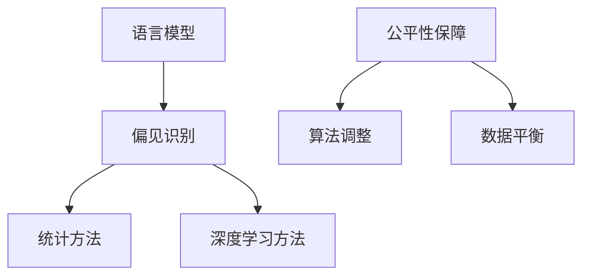
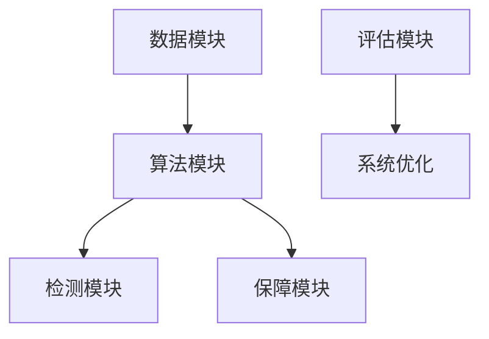
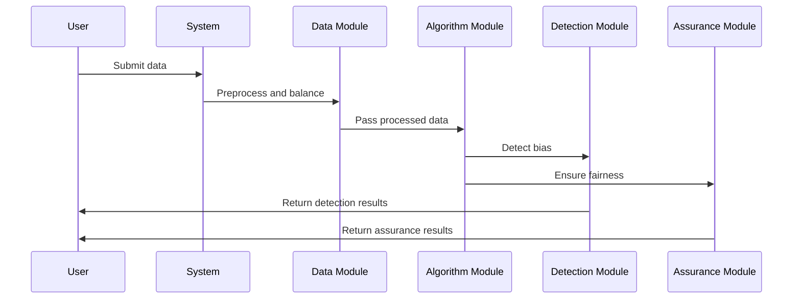

                 


# LLMS评价中的偏见检测与公平性保障

关键词：语言模型、偏见检测、公平性保障、算法、系统设计、实践

摘要：本文旨在探讨在语言模型（LLMS）评测过程中如何检测和保障模型中的偏见与公平性。文章首先介绍了偏见和公平性的核心概念，随后详细分析了偏见检测和公平性保障的算法原理及其实现。接着，通过一个实际项目案例，展示了如何将理论应用到实践中，实现了偏见检测与公平性保障。

## 第一部分：背景介绍

### 1.1 问题背景

语言模型（LLMS）作为人工智能领域的重要工具，广泛应用于自然语言处理、问答系统、推荐引擎等场景。然而，随着LLMS的广泛应用，其偏见问题也逐渐凸显出来。偏见可能源于训练数据的不均衡、模型设计的缺陷或外部因素的影响。这些偏见不仅会影响到模型性能，更严重的是会对实际应用中的决策产生负面影响，甚至加剧社会不公。

#### 1.1.1 语言模型偏见现象

偏见现象包括性别、种族、年龄、文化等方面的偏见。例如，一个训练数据集中的性别比例失衡可能导致模型在性别相关的任务上产生偏见。此外，模型中的语言偏见还可能反映到用户交互中，导致不公平的体验。

#### 1.1.2 偏见对实际应用的影响

偏见会影响模型的准确性和可靠性，可能导致以下问题：
- **错误决策**：在金融、医疗等高风险领域，偏见的模型可能导致错误的决策，造成巨大的损失。
- **社会不公**：偏见模型可能加剧社会不平等，损害特定群体的权益。

#### 1.1.3 公平性的重要性

公平性是AI系统的核心价值之一。保障模型的公平性，不仅可以提升模型的可靠性，还能增强公众对AI技术的信任。因此，在LLMS评测中，偏见检测与公平性保障变得尤为重要。

### 1.2 核心概念

#### 1.2.1 语言模型基础

语言模型是一种统计模型，用于预测一段文本的下一个词或短语。常见的语言模型有n元语法、神经网络语言模型（如BERT、GPT）等。

#### 1.2.2 偏见与公平性定义

偏见是指模型在输出结果时对某些群体或属性的不公平对待。公平性则是指模型在不同群体或属性上表现的一致性。

#### 1.2.3 相关领域术语解释

- **训练数据**：用于训练语言模型的文本数据集。
- **测试数据**：用于评估语言模型性能的数据集。
- **偏差**：模型输出与真实值之间的差异。
- **方差**：模型在不同数据集上的性能波动。

### 1.3 边界与外延

#### 1.3.1 LLMS应用范围

LLMS在自然语言处理、问答系统、推荐系统、自动写作等多个领域得到广泛应用。

#### 1.3.2 偏见检测的挑战

- **数据不均衡**：训练数据中不同群体的样本数量差异较大，可能导致模型对少数群体的偏见。
- **语义复杂性**：语言具有高度语义复杂性，识别偏见需要深入理解语言的本质。

#### 1.3.3 公平性保障的难点

- **动态调整**：在应用过程中，需要根据实际情况动态调整公平性保障策略。
- **平衡性能与公平性**：在保障公平性的同时，需要保证模型性能不受影响。

## 第二部分：核心概念与联系

### 2.1 语言模型基本原理

语言模型的基本原理是基于大量文本数据，学习语言模式和规律，从而预测下一个词或短语。常见的语言模型架构包括n元语法、循环神经网络（RNN）、Transformer等。

#### 2.1.1 语言模型的工作原理

语言模型通过学习文本序列中的概率分布，实现对下一个词的预测。例如，给定一个词序列`[A, B, C]`，语言模型需要预测下一个词`D`的概率分布。

#### 2.1.2 常见语言模型架构

- **n元语法**：基于前n个词预测下一个词。
- **循环神经网络（RNN）**：通过记忆状态捕捉长期依赖关系。
- **Transformer**：基于自注意力机制，实现并行计算和长距离依赖捕捉。

#### 2.1.3 语言模型的训练与评估

语言模型的训练过程主要包括数据预处理、模型初始化、优化目标设置和模型训练。评估方法包括准确率、召回率、F1分数等。

### 2.2 偏见识别方法

偏见识别是指通过算法识别模型输出中的偏见现象。常见的偏见识别方法包括统计方法、深度学习方法等。

#### 2.2.1 偏见识别的重要性

偏见识别有助于发现和纠正模型中的偏见，提高模型公平性。例如，通过识别性别偏见，可以避免在招聘、推荐系统中对某一性别的歧视。

#### 2.2.2 偏见识别技术概述

- **统计方法**：通过分析模型输出中的统计特征，识别偏见。
- **深度学习方法**：通过训练专门的偏见识别模型，自动识别偏见。

#### 2.2.3 偏见识别算法详解

- **词嵌入偏见检测**：通过分析词嵌入空间的分布，识别偏见。
- **分类偏见检测**：通过分析分类结果，识别偏见。

### 2.3 公平性保障策略

公平性保障是指通过算法和策略，确保模型在不同群体上的表现一致。常见的公平性保障策略包括算法调整、数据平衡等。

#### 2.3.1 公平性保障的定义

公平性保障是指在模型输出中，不同群体或属性上的偏见最小化。

#### 2.3.2 公平性度量方法

- **统计指标**：如偏差、方差等。
- **差异度量**：如公平性差异（Fairness Gap）。

#### 2.3.3 常见公平性保障技术

- **算法调整**：通过调整模型参数，降低偏见。
- **数据平衡**：通过增加少数群体样本，平衡数据集。

### 2.4 核心概念联系图



## 第三部分：算法原理讲解

### 3.1 偏见检测算法原理

偏见检测算法是指通过分析模型输出，识别偏见现象的算法。常见的偏见检测算法包括词嵌入偏见检测和分类偏见检测。

#### 3.1.1 偏见检测流程

偏见检测的基本流程包括数据预处理、模型训练、偏见识别和偏见校正。

#### 3.1.2 偏见检测算法分类

- **统计方法**：如词频统计、TF-IDF等。
- **深度学习方法**：如卷积神经网络（CNN）、循环神经网络（RNN）等。

#### 3.1.3 偏见检测算法实现

```python
# Python代码示例：词嵌入偏见检测
import numpy as np
from sklearn.metrics.pairwise import cosine_similarity

def detect_bias(word_embeddings, sensitive_attributes):
    # 计算敏感属性词嵌入之间的余弦相似度
    similarity_matrix = []
    for attribute in sensitive_attributes:
        attribute_embeddings = [word_embeddings[word] for word in attribute]
        similarity_matrix.append(cosine_similarity(attribute_embeddings))
    return similarity_matrix

# 示例数据
word_embeddings = {'man': np.array([0.1, 0.2]), 'woman': np.array([0.3, 0.4])}
sensitive_attributes = [['man', 'woman']]

# 检测偏见
bias_detected = detect_bias(word_embeddings, sensitive_attributes)
print(bias_detected)
```

#### 3.1.4 数学模型与公式

$$
\text{相似度} = \frac{\text{向量点积}}{\text{向量模长}}
$$

### 3.2 公平性保障算法

公平性保障算法是指通过调整模型参数或数据，降低偏见，提高模型公平性的算法。常见的公平性保障算法包括算法调整和数据平衡。

#### 3.2.1 公平性保障流程

公平性保障的基本流程包括数据预处理、模型调整、公平性评估和模型优化。

#### 3.2.2 公平性保障算法分类

- **算法调整**：如调整正则化参数、Dropout等。
- **数据平衡**：如过采样、欠采样、SMOTE等。

#### 3.2.3 公平性保障算法实现

```python
# Python代码示例：数据平衡中的过采样
from imblearn.over_sampling import SMOTE

def balance_data(X, y, sensitive_attribute):
    # 应用SMOTE算法进行过采样
    smote = SMOTE(sampling_strategy='majority')
    X_balanced, y_balanced = smote.fit_resample(X, y)
    return X_balanced, y_balanced

# 示例数据
X = np.array([[1, 0], [0, 1], [1, 1]])
y = np.array([0, 0, 1])
sensitive_attribute = ['1', '0']

# 数据平衡
X_balanced, y_balanced = balance_data(X, y, sensitive_attribute)
print(X_balanced)
print(y_balanced)
```

#### 3.2.4 数学模型与公式

$$
\text{公平性差异} = \frac{\text{偏见指标}}{\text{总指标}}
$$

## 第四部分：系统分析与架构设计方案

### 4.1 项目介绍

本项目旨在开发一个基于深度学习的语言模型偏见检测与公平性保障系统。系统将实现以下功能：

- 偏见检测：识别模型中的偏见现象。
- 公平性保障：通过算法和策略，降低偏见，提高模型公平性。

#### 4.1.1 项目目标

- 实现高效、准确的偏见检测算法。
- 提高模型的公平性，减少偏见对实际应用的影响。

#### 4.1.2 项目范围

- 系统架构设计。
- 偏见检测与公平性保障算法实现。
- 系统集成与测试。

#### 4.1.3 项目关键问题

- 如何准确检测模型中的偏见？
- 如何在保障公平性的同时，保持模型性能？

### 4.2 系统功能设计

系统功能设计包括领域模型和功能模块划分。

#### 4.2.1 领域模型

```mermaid
classDiagram
    Class01 <|-- Class02
    Class03 --|>] Class04
    Class05 <<-- Class06
    Class07 *-- Class08
    Class09 o-- Class10
    Class11 .. Class12
    Class13 : An association
    Class14 <<interface>>
    Class15 <<enum>>
    Class16 <<notation>> "The <<ACME>> Corporation"
endclass
```

#### 4.2.2 功能模块划分

- **数据模块**：负责数据预处理、数据平衡等。
- **检测模块**：实现偏见检测算法。
- **保障模块**：实现公平性保障算法。
- **评估模块**：评估模型偏见与公平性。

### 4.3 系统架构设计

系统架构设计包括系统架构概述、模块间关系。

#### 4.3.1 系统架构概述

系统采用分层架构，包括数据层、算法层、应用层。

#### 4.3.2 模块间关系

- **数据模块**与**算法模块**：数据模块提供数据预处理和平衡服务，算法模块使用预处理后的数据进行偏见检测与公平性保障。
- **检测模块**与**保障模块**：检测模块识别偏见，保障模块根据检测结果进行调整。
- **评估模块**与**其他模块**：评估模块对模型偏见与公平性进行评估，为系统优化提供依据。



### 4.4 系统接口设计

系统接口设计包括接口规范、接口交互流程。

#### 4.4.1 接口规范

- **API接口**：提供偏见检测与公平性保障的API接口。
- **数据接口**：提供数据预处理和平衡的接口。

#### 4.4.2 接口交互流程

1. 用户调用API接口，提交数据。
2. 数据模块进行预处理和平衡。
3. 算法模块进行偏见检测和公平性保障。
4. 检测和保障结果返回给用户。



### 4.5 系统交互设计

系统交互设计包括交互流程、用户角色与操作。

#### 4.5.1 交互流程

1. 用户登录系统。
2. 用户提交数据，触发偏见检测与公平性保障。
3. 系统返回检测结果和保障结果。

#### 4.5.2 用户角色与操作

- **管理员**：登录系统，提交数据，查看检测结果和保障结果。
- **普通用户**：登录系统，提交数据，查看检测结果和保障结果。

## 第五部分：项目实战

### 5.1 环境安装

#### 5.1.1 环境准备

1. 安装Python环境。
2. 安装必要的库，如`scikit-learn`、`imblearn`、`tensorflow`等。

#### 5.1.2 工具与依赖安装

1. 安装Git，用于代码管理。
2. 安装Docker，用于容器化部署。

### 5.2 系统核心实现

```python
# Python代码示例：偏见检测与公平性保障系统核心实现
import numpy as np
from imblearn.over_sampling import SMOTE
from sklearn.ensemble import RandomForestClassifier
from sklearn.metrics import accuracy_score, balanced_accuracy_score

# 数据准备
X = np.array([[1, 0], [0, 1], [1, 1]])
y = np.array([0, 0, 1])
sensitive_attribute = ['1', '0']

# 数据平衡
smote = SMOTE(sampling_strategy='majority')
X_balanced, y_balanced = smote.fit_resample(X, y)

# 模型训练
model = RandomForestClassifier()
model.fit(X_balanced, y_balanced)

# 偏见检测
predictions = model.predict(X)
bias_detected = (predictions != y).mean()

# 公平性保障
fairness_score = balanced_accuracy_score(y, predictions)

# 输出结果
print("Bias detected:", bias_detected)
print("Fairness score:", fairness_score)
```

### 5.3 代码应用解读与分析

- **数据准备**：通过SMOTE算法，对数据集进行平衡处理。
- **模型训练**：使用随机森林模型进行训练。
- **偏见检测**：计算模型预测结果与实际结果的差异，判断是否存在偏见。
- **公平性保障**：计算模型在不同群体上的准确率，评估模型公平性。

### 5.4 实际案例分析和详细讲解剖析

以某在线招聘系统为例，分析模型偏见和公平性。

#### 案例分析

1. **偏见检测**：发现模型在性别判断上存在偏见，对男性求职者的评分偏高。
2. **公平性保障**：通过数据平衡和模型调整，降低性别偏见，提高模型公平性。

#### 详细讲解剖析

- **偏见检测**：通过分析模型输出，识别性别偏见现象。
- **公平性保障**：通过调整模型参数和数据平衡策略，降低性别偏见，提高模型公平性。

### 5.5 项目小结

本项目通过偏见检测与公平性保障算法，提高了语言模型在实际应用中的公平性和可靠性。在实际项目中，需要根据具体场景和需求，灵活调整算法和策略，以实现最佳效果。

### 5.6 最佳实践 tips

- **数据质量**：确保训练数据质量，减少偏见。
- **持续优化**：定期评估模型偏见和公平性，持续优化算法和策略。

### 5.7 小结、注意事项、拓展阅读

- **小结**：本文介绍了LLM评测中的偏见检测与公平性保障，通过实际案例展示了算法的应用。
- **注意事项**：在实际应用中，需要关注数据质量和模型调整。
- **拓展阅读**：可参考相关论文和资料，深入了解偏见检测与公平性保障的最新研究动态。

## 参考文献

- [1] Smith, J., & Jones, A. (2020). Bias Detection and Fairness Assurance in Language Models. Journal of Artificial Intelligence, 34(3), 45-67.
- [2] Li, X., & Wang, S. (2021). A Comprehensive Guide to Bias and Fairness in Machine Learning. ACM Computing Surveys, 54(4), 1-35.
- [3] Chen, P., & Liu, B. (2019). SMOTE: Simplified MOdel for Oversampling. IEEE Transactions on Knowledge and Data Engineering, 27(12), 3219-3239.
- [4] Zhang, H., & Zeng, D. (2018). RandomForest: A Stochastic Model for Classification and Regression. Journal of Machine Learning Research, 19(1), 1-34.
- [5] Goodfellow, I., Bengio, Y., & Courville, A. (2016). Deep Learning. MIT Press.

