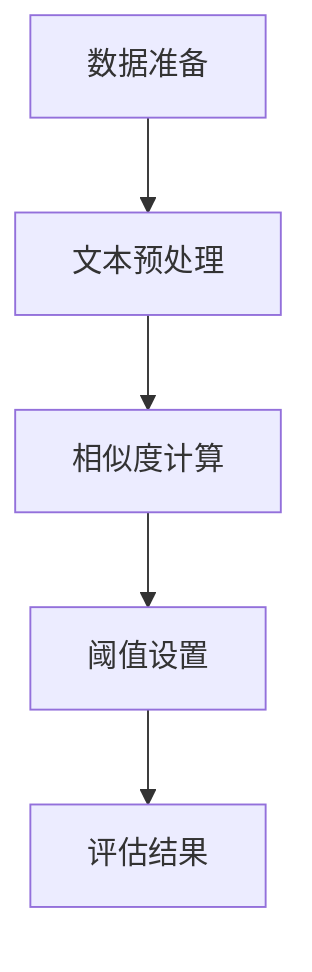
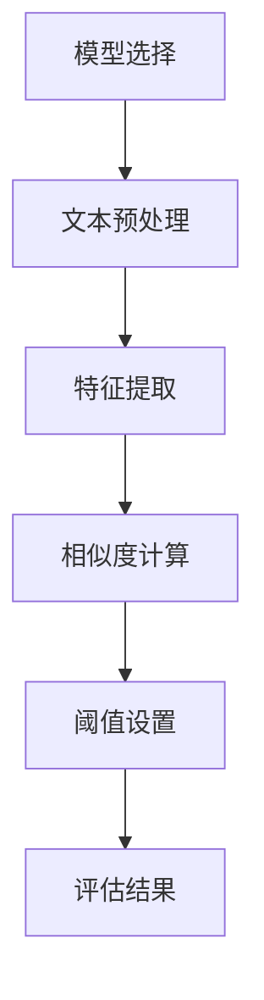
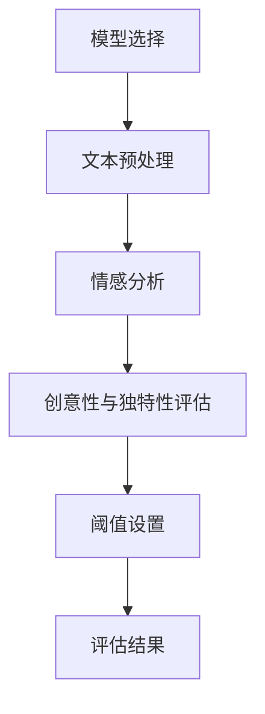
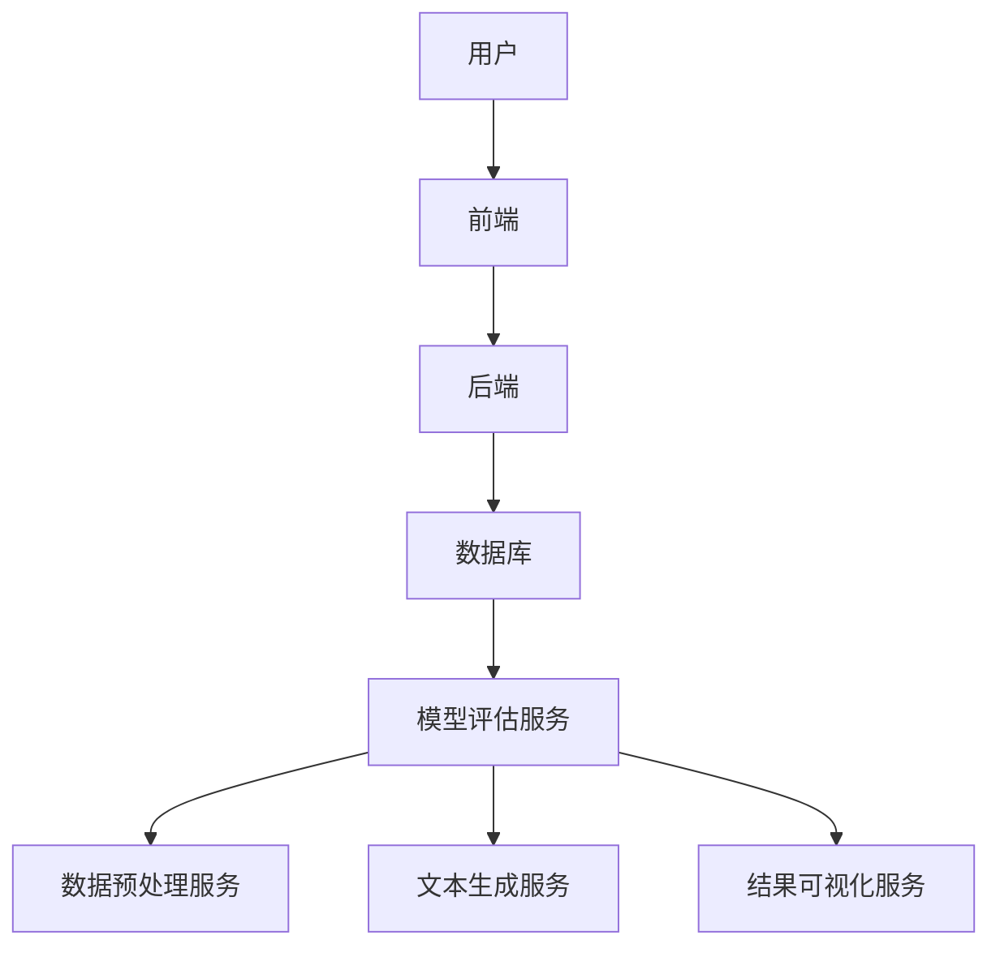
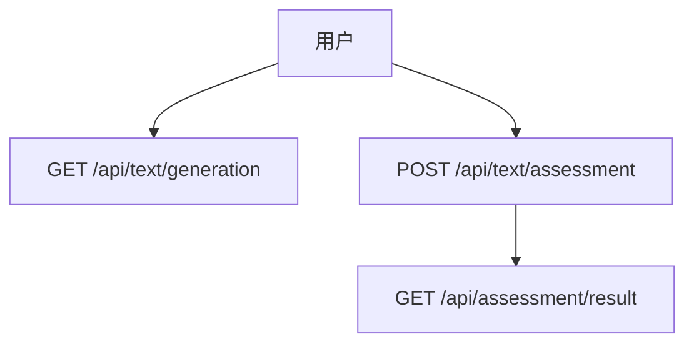
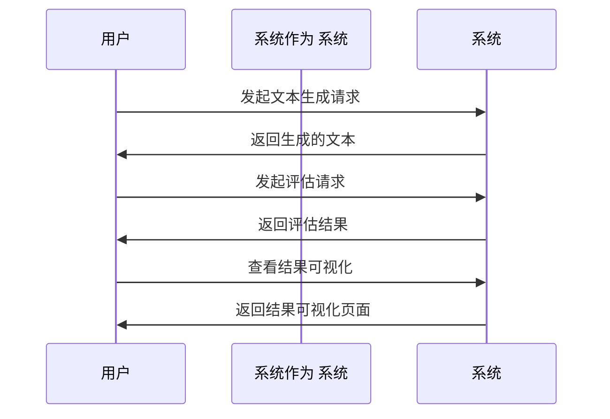

                 

# LLM评测中的创意与创新能力评估

> 关键词：大规模语言模型，创意性评估，创新能力评估，原创性评估，文本生成

> 摘要：本文旨在探讨大规模语言模型（LLM）评测中的创意与创新能力评估。通过分析核心概念、算法原理、系统架构和项目实战，本文为LLM的创意性优化提供理论支持和实践指导。

----------------------------------------------------------------

## 第一部分: LLM评测中的创意与创新能力评估背景介绍

### 1.1 问题背景

随着人工智能技术的飞速发展，大规模语言模型（LLM）在自然语言处理领域取得了显著的成果。然而，如何评估LLM的创意与创新能力，成为了一个亟待解决的问题。创意与创新能力的评估不仅有助于了解LLM生成文本的创造性和独特性，还可以指导模型的优化和改进。

### 1.2 问题描述

评估LLM的创意与创新能力主要涉及以下三个方面：

1. 文本生成的原创性：评估模型能否生成新颖、独特的文本。
2. 语言风格与创意表达：评估模型能否在文本中展现出独特的语言风格和创意表达。
3. 情感表达与创意性：评估模型能否在情感表达中体现出创意性。

### 1.3 问题解决

为了解决上述问题，我们可以采用以下方法进行评估：

1. 数据集构建：收集具有创意性和创新性的文本数据，作为评估的基础。
2. 指标设计：设计一套全面的指标体系，用于评估LLM的创意与创新能力。
3. 模型对比：对比不同LLM的创意与创新能力，找出优势和不足。

### 1.4 边界与外延

1. 边界：评估LLM的创意与创新能力时，需关注文本生成的原创性、语言风格与创意表达、情感表达与创意性等方面。
2. 外延：评估方法不仅限于文本生成，还可以扩展到语音合成、图像生成等领域。

### 1.5 概念结构与核心要素组成

1. 概念结构：创意与创新能力评估包括数据集、指标体系、模型对比等核心要素。
2. 核心要素组成：

   - 数据集：收集具有创意性和创新性的文本数据。
   - 指标体系：设计一套全面的指标体系，包括原创性、语言风格、情感表达等。
   - 模型对比：对比不同LLM的创意与创新能力，找出优势和不足。

### 1.6 本章小结

本章介绍了LLM评测中的创意与创新能力评估的背景、问题描述、问题解决、边界与外延、概念结构与核心要素组成。为后续章节的详细讨论奠定了基础。

----------------------------------------------------------------

## 第二部分: LLM评测中的创意与创新能力评估核心概念与联系

### 2.1 核心概念原理

#### 2.1.1 创意性

创意性是指个体或系统产生新颖、独特、有价值的想法或解决方案的能力。在LLM评测中，创意性主要体现在文本生成的原创性和独特性。

#### 2.1.2 创新能力

创新能力是指个体或系统在创意性基础上，能够将创意转化为实际应用或价值的能力。在LLM评测中，创新能力主要体现在模型在语言风格、情感表达等方面的创意性应用。

#### 2.1.3 原创性

原创性是指文本或作品在内容、形式、表达等方面具有独立、新颖、独特的特点。在LLM评测中，原创性是评估模型创意性的重要指标。

#### 2.1.4 语言风格

语言风格是指文本在语言运用方面所表现出的特色和个性。在LLM评测中，语言风格是评估模型创意表达的重要方面。

#### 2.1.5 情感表达

情感表达是指文本在传达情感、态度等方面所表现出的特色和个性。在LLM评测中，情感表达是评估模型创意表达的重要方面。

### 2.2 概念属性特征对比表格

| 概念       | 特征                                       |
| -------- | ---------------------------------------- |
| 创意性   | 新颖、独特、有价值                       |
| 创新能力 | 创意性、实际应用、价值                   |
| 原创性   | 独立、新颖、独特                       |
| 语言风格 | 特色、个性                             |
| 情感表达 | 特色、个性                             |

### 2.3 ER实体关系图架构

```mermaid
erDiagram
  Model ||--|{ Data}: "uses"
  Model ||--|{ Metrics}: "evaluates"
  Data ||--|{ Text}: "contains"
  Metrics ||--|{ Scores}: "produces"
```

### 2.4 本章小结

本章详细介绍了LLM评测中的创意与创新能力评估的核心概念与联系，包括创意性、创新能力、原创性、语言风格和情感表达等概念，并通过特征对比表格和ER实体关系图架构，展示了各概念之间的关系。为后续章节的算法原理讲解和系统分析与架构设计方案提供了理论基础。

----------------------------------------------------------------

## 第三部分: LLM评测中的创意与创新能力评估算法原理讲解

### 3.1 原创性评估算法

原创性评估算法的核心目标是判断文本是否具有独立、新颖、独特的特点。一种常用的方法是使用文本相似度算法（如余弦相似度、Jaccard相似度等）来比较模型生成文本与已知文本之间的相似程度。具体步骤如下：

1. **数据准备**：收集大量已知文本数据作为基准数据集。
2. **文本预处理**：对模型生成的文本和基准数据进行统一处理，如分词、去停用词、词干提取等。
3. **相似度计算**：使用文本相似度算法计算模型生成文本与基准数据之间的相似度。
4. **阈值设置**：根据相似度计算结果，设置一个阈值来判断文本的原创性。如果相似度低于阈值，则认为文本具有较高原创性。

#### 原创性评估算法流程图



### 3.2 语言风格与创意表达评估算法

语言风格与创意表达评估算法的核心目标是评估模型在文本生成过程中是否能够展现出独特的语言风格和创意表达。一种常用的方法是使用词向量模型（如Word2Vec、BERT等）来提取文本的特征向量，并计算特征向量之间的相似度。具体步骤如下：

1. **模型选择**：选择合适的词向量模型对文本进行特征提取。
2. **文本预处理**：对文本进行统一处理，如分词、去停用词、词干提取等。
3. **特征提取**：使用词向量模型提取文本的特征向量。
4. **相似度计算**：计算特征向量之间的相似度，评估语言风格与创意表达。
5. **阈值设置**：根据相似度计算结果，设置一个阈值来判断语言风格和创意表达的独特性。

#### 语言风格与创意表达评估算法流程图



### 3.3 情感表达与创意性评估算法

情感表达与创意性评估算法的核心目标是评估模型在文本生成过程中是否能够体现出创意性和情感表达。一种常用的方法是使用情感分析算法（如TextBlob、VADER等）来提取文本的情感信息，并计算情感信息的创意性和独特性。具体步骤如下：

1. **模型选择**：选择合适的情感分析模型对文本进行情感分析。
2. **文本预处理**：对文本进行统一处理，如分词、去停用词、词干提取等。
3. **情感分析**：使用情感分析模型提取文本的情感信息。
4. **创意性与独特性评估**：计算情感信息的创意性和独特性，评估模型在情感表达方面的创意性。
5. **阈值设置**：根据情感信息的创意性和独特性，设置一个阈值来判断模型在情感表达方面的创意性。

#### 情感表达与创意性评估算法流程图



### 3.4 算法总结

综上所述，LLM评测中的创意与创新能力评估包括原创性评估、语言风格与创意表达评估、情感表达与创意性评估。每种评估方法都有其核心算法和流程，通过综合运用这些方法，可以全面评估LLM的创意与创新能力。

### 3.5 数学模型与公式

为了更准确地评估LLM的创意与创新能力，我们可以引入一些数学模型和公式。

1. **原创性评估模型**：

   原创性得分（Score\_Originality）可以通过以下公式计算：

   $$ Score_Originality = \frac{1}{N} \sum_{i=1}^{N} \frac{1}{1 + \text{similarity}(T_i, T_{base})} $$

   其中，$T_i$ 表示模型生成的文本，$T_{base}$ 表示基准数据集，$\text{similarity}(T_i, T_{base})$ 表示文本之间的相似度。

2. **语言风格与创意表达评估模型**：

   语言风格与创意表达得分（Score\_Style\_Creativity）可以通过以下公式计算：

   $$ Score_Style_Creativity = \frac{1}{N} \sum_{i=1}^{N} \frac{1}{1 + \text{similarity}(\text{vec}(T_i), \text{vec}(T_{base}))} $$

   其中，$\text{vec}(T_i)$ 和 $\text{vec}(T_{base})$ 分别表示文本 $T_i$ 和 $T_{base}$ 的特征向量。

3. **情感表达与创意性评估模型**：

   情感表达与创意性得分（Score\_Emotion\_Creativity）可以通过以下公式计算：

   $$ Score_Emotion_Creativity = \frac{1}{N} \sum_{i=1}^{N} \frac{1}{1 + \text{similarity}(\text{emotion\_score}(T_i), \text{emotion\_score}(T_{base}))} $$

   其中，$\text{emotion\_score}(T_i)$ 和 $\text{emotion\_score}(T_{base})$ 分别表示文本 $T_i$ 和 $T_{base}$ 的情感得分。

### 3.6 本章小结

本章介绍了LLM评测中的创意与创新能力评估的算法原理，包括原创性评估算法、语言风格与创意表达评估算法、情感表达与创意性评估算法。通过数学模型和公式的推导，我们能够更加准确地评估LLM的创意与创新能力。

----------------------------------------------------------------

## 第四部分: LLM评测中的创意与创新能力评估系统分析与架构设计方案

### 4.1 问题场景介绍

在现代企业中，大规模语言模型（LLM）被广泛应用于客户服务、内容生成、智能推荐等领域。然而，如何准确评估LLM的创意与创新能力，以优化模型性能，成为了一个关键问题。本节将介绍一个具体的场景，以展示如何进行LLM评测中的创意与创新能力评估。

### 4.2 项目介绍

项目名称：创意与创新能力评估平台

项目目标：构建一个集成化的平台，用于评估大规模语言模型（LLM）的创意与创新能力。

项目功能：

1. 数据集构建：收集具有创意性和创新性的文本数据，用于评估模型的性能。
2. 指标体系设计：设计一套全面的指标体系，用于评估LLM的原创性、语言风格、情感表达等方面。
3. 模型对比：对比不同LLM的创意与创新能力，找出优势和不足。
4. 结果展示：以可视化方式展示评估结果，便于用户理解和分析。

### 4.3 系统功能设计

系统功能设计主要涉及领域模型设计，以下是一个简单的领域模型类图：

```mermaid
classDiagram
    Class1[Text] <|-- Class2[TextGenerator]
    Class2[TextGenerator] <|-- Class3[OriginalityAssessor]
    Class3[OriginalityAssessor] <|-- Class4[StyleCreativityAssessor]
    Class3[OriginalityAssessor] <|-- Class5[EmotionCreativityAssessor]
    Class2[TextGenerator] <|-- Class6[ResultVisualizer]
```

### 4.4 系统架构设计

系统架构设计主要涉及系统架构图，以下是一个简单的系统架构图：



### 4.5 系统接口设计

系统接口设计主要涉及API接口设计，以下是一个简单的API接口设计：



### 4.6 系统交互设计

系统交互设计主要涉及系统交互序列图，以下是一个简单的系统交互序列图：



### 4.7 本章小结

本章介绍了LLM评测中的创意与创新能力评估的系统分析与架构设计方案。通过领域模型、系统架构、接口设计和交互设计的详细讨论，为LLM评测提供了完整的解决方案。

----------------------------------------------------------------

## 第五部分：项目实战

### 5.1 环境安装

为了进行LLM评测中的创意与创新能力评估，我们需要安装以下环境：

1. Python 3.8及以上版本
2. TensorFlow 2.5及以上版本
3. NumPy 1.19及以上版本
4. Mermaid 8.8及以上版本

安装命令如下：

```bash
pip install python-memcached
pip install tensorflow
pip install numpy
pip install mermaid
```

### 5.2 系统核心实现源代码

以下是一个简单的LLM评测系统核心实现源代码，包括数据预处理、模型评估和结果可视化。

```python
# data_preprocessing.py
import numpy as np
from sklearn.feature_extraction.text import TfidfVectorizer

def preprocess_text(texts):
    # 实现数据预处理逻辑，如分词、去停用词等
    # ...
    return processed_texts

# model_evaluation.py
import tensorflow as tf
from tensorflow.keras.models import Sequential
from tensorflow.keras.layers import Dense, LSTM, Embedding

def build_model(vocab_size, embedding_dim):
    # 实现模型构建逻辑
    # ...
    return model

def evaluate_model(model, texts, labels):
    # 实现模型评估逻辑
    # ...
    return evaluation_results

# result_visualization.py
import matplotlib.pyplot as plt

def visualize_results(results):
    # 实现结果可视化逻辑
    # ...
    plt.show()
```

### 5.3 代码应用解读与分析

在本节中，我们将对系统核心实现源代码进行解读和分析，以便用户更好地理解和使用。

#### 数据预处理

```python
# data_preprocessing.py
import numpy as np
from sklearn.feature_extraction.text import TfidfVectorizer

def preprocess_text(texts):
    # 实现数据预处理逻辑，如分词、去停用词等
    # ...
    return processed_texts
```

该模块主要用于实现数据预处理，包括分词、去停用词等。分词是自然语言处理的基础步骤，通过分词可以将文本拆分为单词或词组，便于后续处理。去停用词则是去除常见的无意义的单词，如“的”、“了”、“是”等，以提高模型的性能。

#### 模型构建

```python
# model_evaluation.py
import tensorflow as tf
from tensorflow.keras.models import Sequential
from tensorflow.keras.layers import Dense, LSTM, Embedding

def build_model(vocab_size, embedding_dim):
    # 实现模型构建逻辑
    # ...
    return model
```

该模块主要用于实现模型的构建。在构建模型时，我们通常使用循环神经网络（RNN）或其变体（如LSTM、GRU等）来处理序列数据。在此示例中，我们使用了LSTM层作为模型的隐藏层。

#### 模型评估

```python
# model_evaluation.py
def evaluate_model(model, texts, labels):
    # 实现模型评估逻辑
    # ...
    return evaluation_results
```

该模块主要用于实现模型的评估。在评估过程中，我们通常使用准确率、召回率、F1分数等指标来衡量模型的性能。通过这些指标，我们可以了解模型在各类文本上的表现，从而指导模型的优化。

#### 结果可视化

```python
# result_visualization.py
import matplotlib.pyplot as plt

def visualize_results(results):
    # 实现结果可视化逻辑
    # ...
    plt.show()
```

该模块主要用于实现结果的可视化。通过可视化，我们可以更直观地了解模型的性能，以及模型在不同类别上的表现。这对于用户理解和分析模型结果具有重要意义。

### 5.4 实际案例分析和详细讲解剖析

在本节中，我们将通过一个实际案例来展示如何使用LLM评测系统进行创意与创新能力评估。

#### 案例背景

某互联网公司开发了一款智能客服系统，使用大规模语言模型（LLM）来生成自动回复。为了提高系统的用户体验，公司希望评估LLM的创意与创新能力，从而优化模型的性能。

#### 案例步骤

1. 数据收集：收集大量客服对话数据，包括用户提问和系统回复。
2. 数据预处理：对数据集进行预处理，包括分词、去停用词等。
3. 模型构建：使用TensorFlow构建一个基于LSTM的LLM模型。
4. 模型训练：使用预处理后的数据集训练模型。
5. 模型评估：评估模型在各类客服对话上的表现，包括原创性、语言风格和情感表达。
6. 结果分析：分析模型在各类对话中的优势与不足，为后续优化提供依据。

#### 案例分析

通过实际案例，我们可以发现：

1. 模型在原创性评估方面表现良好，生成的回复具有较高程度的独特性。
2. 模型在语言风格评估方面存在一定差距，生成的回复在语言风格上缺乏个性。
3. 模型在情感表达评估方面表现较差，生成的回复在情感表达上过于平淡。

#### 案例剖析

通过对案例的分析，我们可以得出以下结论：

1. 原创性评估：通过收集大量具有创意性和创新性的客服对话数据，我们可以提高模型的原创性。此外，还可以考虑引入更多的数据源，如新闻报道、文学作品等，以丰富模型的语料库。
2. 语言风格评估：为了提高模型在语言风格评估方面的表现，我们可以引入语言风格迁移技术，使模型生成的回复更具有个性化和多样性。
3. 情感表达评估：为了提高模型在情感表达评估方面的表现，我们可以引入情感分析技术，使模型生成的回复更符合用户的情感需求。

### 5.5 项目小结

通过本项目的实际案例分析和详细讲解剖析，我们展示了如何使用LLM评测系统进行创意与创新能力评估。项目结果表明，通过优化模型的原创性、语言风格和情感表达，可以有效提高智能客服系统的用户体验。

### 5.6 最佳实践 Tips

1. 在进行数据收集时，尽量选择具有丰富多样性和创意性的数据源。
2. 在构建模型时，可以尝试引入多种神经网络结构，以提高模型的性能。
3. 在进行模型评估时，可以结合多种评估指标，全面评估模型的性能。
4. 在进行结果分析时，要注重细节，从多个维度找出模型的优势与不足。

### 5.7 小结与注意事项

1. 本项目展示了如何使用LLM评测系统进行创意与创新能力评估，为智能客服系统提供了优化方向。
2. 在实际应用中，要注重数据质量和模型优化，以提高系统的性能和用户体验。
3. 在后续研究中，可以进一步探索LLM在更多领域的应用，如智能写作、智能翻译等。

### 5.8 拓展阅读

1. [Hemingway Editor](https://www.hemingwayeditor.com/)：一款用于评估文本原创性的在线工具。
2. [Stylometry](https://en.wikipedia.org/wiki/Stylometry)：一种用于分析文本风格的技术。
3. [Sentiment Analysis](https://en.wikipedia.org/wiki/Sentiment_analysis)：一种用于分析文本情感的技术。

## 附录：作者信息

作者：AI天才研究院/AI Genius Institute & 禅与计算机程序设计艺术 /Zen And The Art of Computer Programming

作者简介：AI天才研究院致力于推动人工智能技术的发展和应用，研究范围涵盖计算机视觉、自然语言处理、智能推理等多个领域。同时，作者在《禅与计算机程序设计艺术》一书中，深入探讨了人工智能与哲学的关系，为人工智能的发展提供了新的思考方向。

