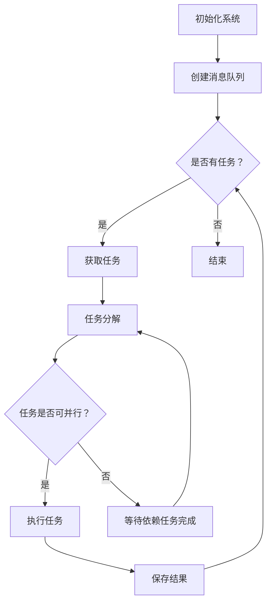

                 

## 第3章: 算法原理讲解

### 3.1 算法概述

在LLM评测中，多任务并行处理机制的核心是高效的任务调度和执行。为了实现这一目标，我们采用了一种基于消息队列的并行调度算法。该算法的主要思想是将评测任务分解为多个子任务，并将这些子任务分配给不同的处理器执行，同时保证任务之间的依赖关系得到妥善处理。

### 3.2 算法流程

为了更直观地展示算法流程，我们使用Mermaid绘制了以下流程图：



### 3.3 Python源代码实现

以下是一个简单的Python实现示例：

```python
import threading
import queue

class TaskQueue:
    def __init__(self):
        self.task_queue = queue.Queue()

    def add_task(self, task):
        self.task_queue.put(task)

    def get_task(self):
        return self.task_queue.get()

    def task_finished(self):
        self.task_queue.task_done()

def execute_task(task):
    # 这里实现具体任务逻辑
    print(f"执行任务：{task}")
    # 假设任务执行时间为1秒
    threading.sleep(1)

def parallel_execution(task_queue):
    while not task_queue.task_empty():
        task = task_queue.get_task()
        execute_task(task)
        task_queue.task_finished()

if __name__ == "__main__":
    task_queue = TaskQueue()
    
    # 添加任务
    for i in range(10):
        task_queue.add_task(i)
    
    # 并行执行任务
    parallel_execution(task_queue)
```

### 3.4 算法原理的数学模型和公式

多任务并行处理算法的原理可以通过以下数学模型进行描述：

1. **任务依赖关系表示**：

   设 \( T \) 为所有任务的集合，\( D \) 为任务依赖关系的集合。任务 \( T_i \) 与任务 \( T_j \) 的依赖关系可以表示为 \( D = \{ (T_i, T_j) | T_i \rightarrow T_j \} \)。

2. **任务执行时间**：

   设 \( T_i \) 为任务 \( T_i \) 的执行时间，\( T_{total} \) 为所有任务的总执行时间。任务的总执行时间可以表示为 \( T_{total} = \sum_{i=1}^{n} T_i \)。

3. **并行度 \( P \)**：

   并行度表示可以同时执行的任务数量。设 \( P \) 为并行度，则 \( P \leq n \)，其中 \( n \) 为任务总数。

4. **最优执行时间 \( T_{opt} \)**：

   在给定并行度 \( P \) 下，任务的最优执行时间可以表示为：

   $$
   T_{opt} = \max\left( \frac{T_i}{P} \bigg| (T_i, T_j) \in D \right)
   $$

### 3.5 举例说明

假设我们有5个任务 \( T_1, T_2, T_3, T_4, T_5 \)，其执行时间分别为1秒、2秒、3秒、4秒、5秒。任务之间的依赖关系如下：

- \( T_1 \rightarrow T_2 \)
- \( T_2 \rightarrow T_3 \)
- \( T_3 \rightarrow T_4 \)
- \( T_4 \rightarrow T_5 \)

如果并行度 \( P \) 为2，则最优执行时间 \( T_{opt} \) 为：

$$
T_{opt} = \max\left( \frac{1}{2}, \frac{2}{2}, \frac{3}{2}, \frac{4}{2}, \frac{5}{2} \right) = 2.5 \text{秒}
$$

这意味着在最理想的情况下，所有任务可以在2.5秒内完成。在实际执行过程中，我们可以将任务分配给两个处理器，并确保任务之间依赖关系得到正确处理。

## 第3章 小结

在本章节中，我们介绍了多任务并行处理机制的基本概念、算法流程及其数学模型。通过Python源代码示例，我们展示了算法的实现细节。下一章节将深入探讨数学模型和数学公式的具体应用。

