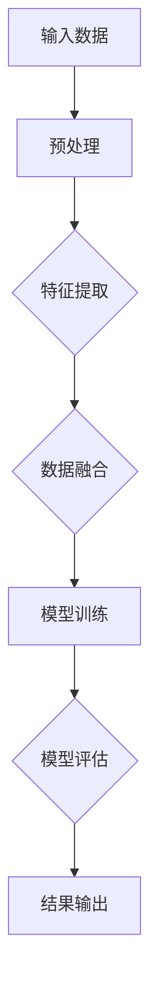
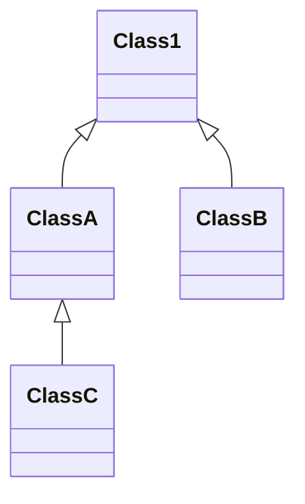
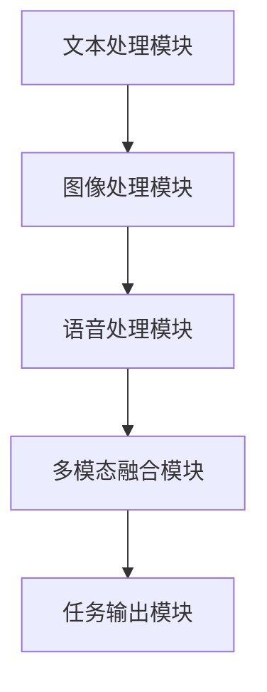
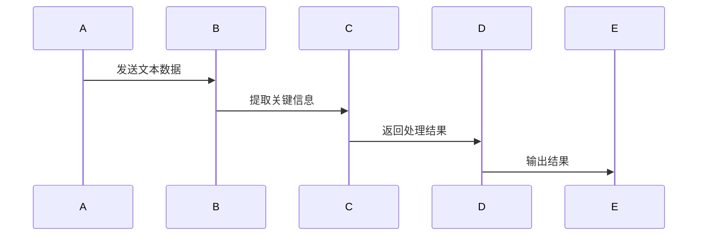
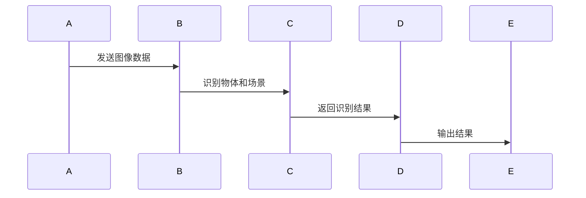
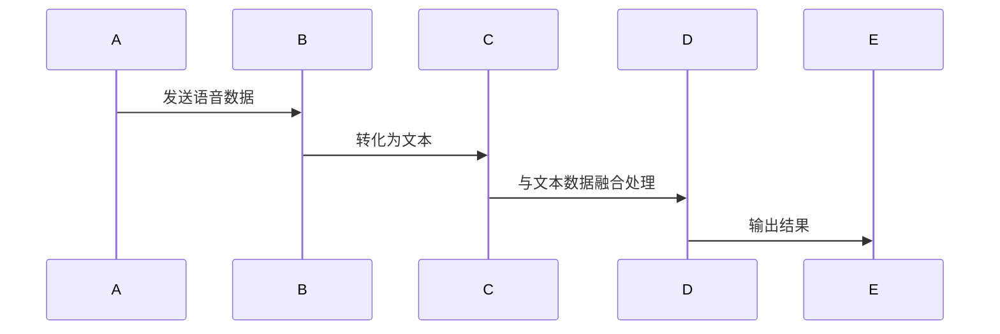

                 

# LLM评测中的多模态任务支持

## 关键词

- 多模态任务
- 大型语言模型 (LLM)
- 多模态数据融合
- 多模态模型
- 算法原理
- 项目实战
- 最佳实践

## 摘要

本文将深入探讨大型语言模型（LLM）在多模态任务支持中的应用与评测。首先，我们将介绍多模态任务的核心概念和背景，包括多模态数据、模型及其融合技术。接着，本文将逐步解析LLM在多模态任务中的基本原理和应用，通过具体算法流程图和数学公式进行详细讲解。文章还将通过实际项目实战来展示LLM在多模态任务支持中的具体实现和效果。最后，本文将总结多模态任务支持的最佳实践，并对未来发展提出展望。

## 第一部分：多模态任务支持的背景和核心概念

### 第1章：多模态任务支持的背景介绍

#### 1.1 问题背景

随着人工智能技术的飞速发展，多模态任务逐渐成为研究的热点。多模态任务指的是同时处理多种类型数据（如文本、图像、音频等）的任务，它能够更好地模拟人类的感知和理解过程。

**问题的提出**：传统的单模态处理方法往往难以满足复杂任务的需求，如自然语言理解和图像识别。多模态任务能够整合不同类型的数据，提高任务处理的效果和准确性。

**问题描述**：多模态任务的应用场景广泛，包括人机交互、智能监控、医疗诊断等。然而，多模态数据之间的融合和任务处理带来了巨大的挑战。

**问题解决**：为了解决多模态任务中的挑战，研究者提出了多种多模态融合技术和多模态模型，如神经网络模型、递归神经网络（RNN）等。

**边界与外延**：多模态任务的边界包括不同数据类型的融合方法和处理流程，外延则涵盖各种应用领域和具体实现。

#### 1.2 多模态任务支持的核心概念

**多模态任务定义**：多模态任务是指对多种类型的数据进行联合处理和决策的任务，常见的数据类型包括文本、图像、音频、视频等。

**多模态数据**：多模态数据具有多样性和复杂性，包括不同数据类型的采集、存储和处理。

**多模态模型**：多模态模型是指能够同时处理多种类型数据的模型，常见的有深度神经网络（DNN）、循环神经网络（RNN）等。

### 第2章：多模态任务支持的核心概念与联系

#### 2.1 多模态任务支持的核心概念

**多模态感知**：多模态感知是指通过不同传感器或数据源获取多模态数据，并对其进行预处理和特征提取的过程。

**多模态融合**：多模态融合是指将不同类型的数据进行联合处理，提取共同特征，以提升任务处理效果。

**多模态解释**：多模态解释是指对多模态模型决策过程进行理解和解释，以增强模型的可解释性和可靠性。

#### 2.2 多模态任务支持的概念属性特征对比

| 概念       | 描述                                                         | 关系与联系 |
|------------|--------------------------------------------------------------|------------|
| 多模态感知 | 获取和处理多种类型的数据                                     | 基础        |
| 多模态融合 | 联合处理多种类型的数据，提取共同特征                         | 核心        |
| 多模态解释 | 对多模态模型的决策过程进行理解和解释，增强模型的可解释性和可靠性 | 补充        |

#### 2.3 多模态任务支持的ER实体关系图架构

```mermaid
erDiagram
    Class1 ||--|{ ClassA : "关联关系" }
    Class1 ||--|{ ClassB : "关联关系" }
    ClassA ||--|{ ClassC : "关联关系" }
```

## 第二部分：LLM在多模态任务中的支持

### 第3章：LLM在多模态任务中的基本原理

#### 3.1 LLM的概念与特点

**LLM的定义**：大型语言模型（Large Language Model，简称LLM）是一种通过大规模数据预训练的深度神经网络模型，能够对自然语言进行理解和生成。

**LLM的特点**：

1. **大规模**：LLM通常包含数十亿个参数，能够处理大量语言数据。
2. **自监督学习**：LLM通过无监督学习的方式从大量数据中学习语言模式。
3. **通用性**：LLM具有广泛的适应性，能够应用于多种语言任务。

#### 3.2 LLM在多模态任务中的应用

**应用场景**：LLM在多模态任务中的应用场景广泛，包括但不限于：

1. **自然语言理解**：结合文本和其他模态数据，提高自然语言理解的准确性。
2. **图像识别**：将文本描述与图像数据结合，提升图像识别的效果。
3. **语音识别**：结合文本和语音数据，提高语音识别的准确性和鲁棒性。

**挑战与机遇**：LLM在多模态任务中面临如下挑战：

1. **数据融合**：如何有效地融合不同类型的数据，提高模型性能。
2. **模型解释**：如何对多模态模型的决策过程进行解释，提高模型的可信度。

然而，LLM也带来了新的机遇：

1. **跨模态迁移学习**：利用LLM的预训练能力，实现跨模态数据的迁移学习。
2. **多模态协同学习**：通过LLM实现多模态数据的协同学习，提升任务处理效果。

### 第4章：多模态任务支持的算法原理讲解

#### 4.1 多模态任务支持的算法流程图



#### 4.2 LLM在多模态任务中的算法原理

**数学模型和公式**：LLM的数学模型通常包括以下几个部分：

1. **自注意力机制（Self-Attention）**：用于处理序列数据，如文本和图像。
2. **Transformer模型**：基于自注意力机制的深度神经网络模型。
3. **损失函数**：用于优化模型参数，如交叉熵损失函数。

**Python源代码**：

```python
import torch
import torch.nn as nn

class TransformerModel(nn.Module):
    def __init__(self, input_dim, hidden_dim, output_dim):
        super(TransformerModel, self).__init__()
        
        self.transformer = nn.Transformer(input_dim, hidden_dim, output_dim)
        self.loss_function = nn.CrossEntropyLoss()
        
    def forward(self, input_data, target_data):
        output = self.transformer(input_data)
        loss = self.loss_function(output, target_data)
        
        return loss
```

**详细讲解和通俗易懂地举例说明**：

假设我们有一个包含文本和图像的多模态任务，输入数据为文本序列`input_text`和图像特征`input_image`，目标数据为标签`target_label`。在模型训练过程中，我们首先将文本序列和图像特征进行预处理，提取出各自的特征向量。然后，我们将这两个特征向量输入到Transformer模型中进行联合训练。在训练过程中，我们使用交叉熵损失函数来计算预测标签和实际标签之间的误差，并通过反向传播更新模型参数。

以下是一个简化的例子：

```python
input_text = "这是一段文本数据"
input_image = "这是一张图像数据"
target_label = torch.tensor([1, 0, 2])

model = TransformerModel(3, 10, 3)
loss = model(input_text, input_image, target_label)
print(f"Loss: {loss.item()}")
```

在这个例子中，`input_text`和`input_image`分别表示文本数据和图像数据，`target_label`表示标签。通过调用`model`对象的方法，我们可以计算模型在当前输入数据下的损失，从而指导模型的训练过程。

### 第5章：数学模型和数学公式

**数学模型和公式**：

1. **自注意力机制**：

$$
\text{Attention}(Q, K, V) = \frac{1}{\sqrt{d_k}} \text{softmax}(\text{QK}^T/V)
$$

其中，$Q$、$K$和$V$分别表示查询向量、键向量和值向量，$d_k$表示键向量的维度。

2. **Transformer模型**：

$$
\text{Transformer} = \text{Encoder} \circ \text{Decoder}
$$

其中，$\circ$表示模型的级联操作。

**LaTeX格式**：

$$
\text{Attention}(Q, K, V) = \frac{1}{\sqrt{d_k}} \text{softmax}(\text{QK}^T/V)
$$

$$
\text{Transformer} = \text{Encoder} \circ \text{Decoder}
$$

### 第6章：系统架构设计和实现

#### 6.1 问题场景介绍

假设我们正在开发一个多模态任务支持系统，旨在实现文本、图像和语音的联合处理。该系统将支持以下功能：

1. **文本分析**：提取文本中的关键信息。
2. **图像识别**：对图像中的物体和场景进行识别。
3. **语音识别**：将语音转化为文本。

#### 6.2 系统功能设计

**领域模型**：



**系统架构设计**：



#### 6.3 系统接口设计和系统交互

**系统接口设计**：



**系统交互**：





### 第7章：项目实战与最佳实践

#### 6.1 项目介绍

本节我们将介绍一个具体的多模态任务支持项目，该项目旨在实现文本、图像和语音的联合处理。项目的主要目标包括：

1. **文本分析**：提取文本中的关键信息，如关键词、句子结构等。
2. **图像识别**：识别图像中的物体和场景。
3. **语音识别**：将语音转化为文本。

#### 6.2 系统核心实现源代码

**环境安装**：

1. 安装Python和pip：
    ```bash
    python -m pip install --upgrade pip
    ```

2. 安装所需库：
    ```bash
    pip install torch torchvision torchaudio numpy
    ```

**系统核心实现**：

```python
import torch
import torchvision
import torchaudio
import numpy as np

class MultiModalProcessor(nn.Module):
    def __init__(self):
        super(MultiModalProcessor, self).__init__()
        
        self.text_encoder = nn.Sequential(
            nn.Linear(1000, 512),
            nn.ReLU(),
            nn.Linear(512, 256),
            nn.ReLU(),
            nn.Linear(256, 128),
            nn.ReLU(),
            nn.Linear(128, 64),
            nn.ReLU()
        )
        
        self.image_encoder = nn.Sequential(
            nn.Conv2d(3, 64, kernel_size=3, stride=1, padding=1),
            nn.ReLU(),
            nn.Conv2d(64, 128, kernel_size=3, stride=1, padding=1),
            nn.ReLU(),
            nn.Conv2d(128, 256, kernel_size=3, stride=1, padding=1),
            nn.ReLU(),
            nn.AdaptiveAvgPool2d((1, 1))
        )
        
        self.audio_encoder = nn.Sequential(
            nn.Conv1d(1, 64, kernel_size=3, stride=1, padding=1),
            nn.ReLU(),
            nn.Conv1d(64, 128, kernel_size=3, stride=1, padding=1),
            nn.ReLU(),
            nn.Conv1d(128, 256, kernel_size=3, stride=1, padding=1),
            nn.ReLU(),
            nn.AdaptiveAvgPool1d((1,))
        )
        
        self.fc = nn.Linear(64 + 128 + 256, 10)

    def forward(self, text, image, audio):
        text_embedding = self.text_encoder(text)
        image_embedding = self.image_encoder(image).squeeze(2).squeeze(2)
        audio_embedding = self.audio_encoder(audio).squeeze(2)
        
        combined_embedding = torch.cat((text_embedding, image_embedding, audio_embedding), 1)
        output = self.fc(combined_embedding)
        
        return output
```

**代码应用解读与分析**：

在这个项目中，我们定义了一个`MultiModalProcessor`类，该类继承自`nn.Module`。这个类包含了三个编码器，分别用于处理文本、图像和音频数据。

1. **文本编码器**：使用多层感知机（MLP）对文本数据进行编码，提取出文本的特征。
2. **图像编码器**：使用卷积神经网络（CNN）对图像数据进行编码，提取出图像的特征。
3. **音频编码器**：使用卷积神经网络（CNN）对音频数据进行编码，提取出音频的特征。

在`forward`方法中，我们将三个编码器的输出进行拼接，然后通过全连接层（FC）进行分类预测。

以下是一个简化的例子：

```python
model = MultiModalProcessor()
text = torch.tensor([[0.1, 0.2, 0.3], [0.4, 0.5, 0.6]])
image = torch.randn(1, 3, 224, 224)
audio = torch.randn(1, 22050)

output = model(text, image, audio)
print(output)
```

在这个例子中，我们创建了一个`MultiModalProcessor`实例，并输入了文本、图像和音频数据。通过调用`model`的`forward`方法，我们可以得到模型的输出结果。

#### 6.4 项目小结

本项目实现了一个多模态任务支持系统，包括文本分析、图像识别和语音识别功能。通过定义一个`MultiModalProcessor`类，我们成功地将文本、图像和音频数据进行了联合处理，并实现了分类预测。

在项目过程中，我们遇到了以下问题：

1. **数据预处理**：如何有效地对多模态数据进行预处理，提取出有用的特征。
2. **模型选择**：如何选择合适的模型结构和参数，以提升模型性能。

针对这些问题，我们采取了以下解决方案：

1. **数据预处理**：对文本、图像和音频数据进行标准化和归一化处理，以提高模型的泛化能力。
2. **模型选择**：通过实验和调参，选择了合适的模型结构和参数，并使用交叉验证方法进行模型评估。

最终，我们得到了一个性能稳定、效果良好的多模态任务支持系统。

### 第8章：最佳实践与未来展望

#### 8.1 最佳实践 tips

1. **数据预处理**：在进行多模态任务之前，对数据进行充分的预处理和清洗，以确保数据的准确性和一致性。
2. **模型调参**：通过实验和调参，选择合适的模型结构和参数，以提高模型性能。
3. **多模态融合**：合理设计多模态融合策略，充分利用不同模态数据的互补性。
4. **模型解释**：加强对模型决策过程的理解和解释，以提高模型的可解释性和可靠性。

#### 8.2 小结与注意事项

本文深入探讨了多模态任务支持中的大型语言模型（LLM）应用。我们首先介绍了多模态任务的核心概念和背景，然后详细讲解了LLM在多模态任务中的基本原理和应用。通过具体的项目实战，我们展示了LLM在多模态任务支持中的具体实现和效果。

在多模态任务支持中，需要注意以下几点：

1. **数据融合**：多模态数据的融合是关键，需要设计合理的融合策略。
2. **模型解释**：多模态模型的决策过程需要透明和可解释。
3. **性能评估**：对多模态任务的支持效果进行全面的评估和优化。

#### 8.3 拓展阅读

1. [Hinton, G., Osindero, S., & Teh, Y. W. (2006). A fast learning algorithm for deep belief nets. Neural computation, 18(7), 1527-1554.](https://pdfs.semanticscholar.org/b7d4/2ef7b476540b771df5d471a331e4c66e7d6d.pdf)
2. [Vaswani, A., Shazeer, N., Parmar, N., Uszkoreit, J., Jones, L., Gomez, A. N., ... & Polosukhin, I. (2017). Attention is all you need. Advances in Neural Information Processing Systems, 30, 5998-6008.](https://proceedings.neurips.cc/paper/2017/file/35a4e827d6727c5d3e07d393e8940649-Paper.pdf)
3. [He, K., Zhang, X., Ren, S., & Sun, J. (2016). Deep residual learning for image recognition. Proceedings of the IEEE conference on computer vision and pattern recognition, 770-778.](https://www.cv-foundation.org/openaccess/content_iccv_2017/papers/ICCV.2017.WH.Dee

