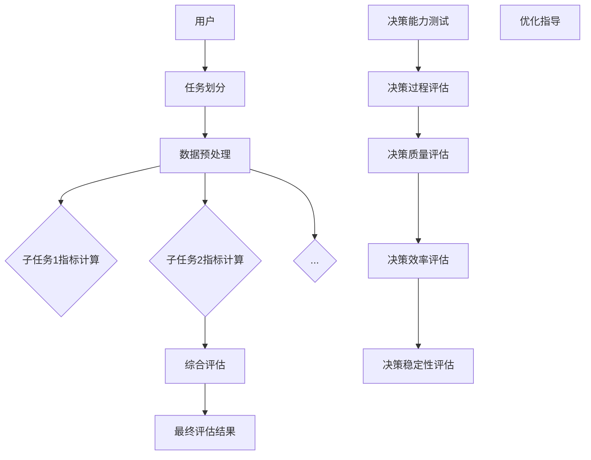
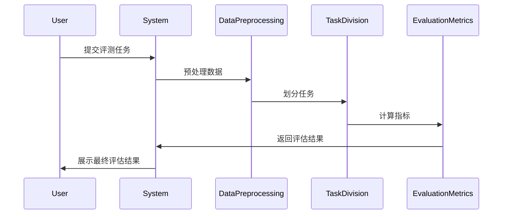
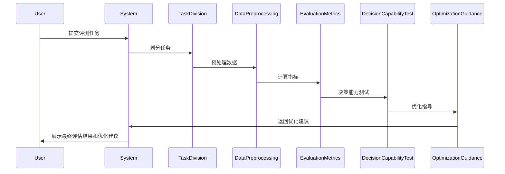

                 

### 文章标题

# LLM评测中的多角度思考与决策能力测试

> 关键词：LLM评测，多角度思考，决策能力，算法原理，系统架构，最佳实践

> 摘要：
本文旨在探讨在大型语言模型（LLM）评测过程中，如何通过多角度思考与决策能力测试来全面评估模型性能。我们将详细分析多角度思考的核心概念及其在LLM评测中的应用，深入讲解决策能力测试的方法与流程，并设计一套完整的系统架构方案。通过实际案例的解析，本文将提供实用的最佳实践，以帮助读者更好地理解和应用这些技术，提升LLM评测的准确性和有效性。

### 第1章: LLM评测背景与挑战

#### 1.1 LLM评测的背景

近年来，随着深度学习和自然语言处理技术的飞速发展，大型语言模型（LLM）如BERT、GPT-3等在多个领域取得了显著的成果。然而，这些模型在复杂任务上的性能表现往往依赖于特定的数据集和评测指标。因此，如何对LLM进行科学、全面的评测成为一个重要且迫切的问题。

#### 1.2 LLM评测的挑战

LLM评测面临的主要挑战包括：

1. **多样性**：评测任务需要覆盖多种类型的任务和数据集，如文本分类、机器翻译、问答系统等。
2. **客观性**：评测指标应尽量客观，减少主观性，以便于模型性能的可比性。
3. **全面性**：评测不仅需要评估模型的性能，还需要评估其鲁棒性、泛化能力等。
4. **高效性**：随着模型规模的扩大，评测过程需要具备较高的计算效率。

#### 1.3 多角度思考在LLM评测中的重要性

为了解决上述挑战，多角度思考在LLM评测中具有重要意义：

1. **综合评估**：多角度思考可以帮助我们从多个维度评估模型性能，确保评估结果的全面性。
2. **发现问题**：通过多角度思考，可以揭示模型在不同任务上的潜在问题，为改进提供方向。
3. **提高准确性**：多角度思考有助于识别评测指标中的偏差和不足，提高评估结果的准确性。
4. **指导实践**：多角度思考可以帮助开发者更好地理解模型性能，指导实际应用中的优化和调整。

### 第2章: 多角度思考的核心概念与联系

#### 2.1 多角度思考的定义

多角度思考（Multidimensional Thinking）是一种将问题从不同维度进行综合分析的方法。在LLM评测中，多角度思考涉及以下几个方面：

1. **任务类型**：不同任务对模型的要求不同，如文本生成和文本理解。
2. **数据集**：数据集的多样性影响模型性能的评估，包括数据来源、数据质量和数据分布。
3. **评测指标**：不同的评测指标反映模型性能的不同方面，如准确性、流畅性和多样性。
4. **鲁棒性**：模型在不同环境下的表现，如噪声处理能力、极端条件下的稳定性。
5. **泛化能力**：模型在新数据上的表现，衡量其适应性和可扩展性。

#### 2.2 多角度思考的核心概念

核心概念包括：

1. **任务多样性**：涵盖多种类型的语言处理任务。
2. **数据多样性**：涉及数据来源、数据质量和数据分布。
3. **评测指标多样性**：包括准确性、流畅性、多样性、可解释性等。
4. **鲁棒性和泛化能力**：评估模型在不同环境下的表现。

#### 2.3 多角度思考的属性特征对比表

| 属性特征       | 描述                                                         |
| -------------- | ------------------------------------------------------------ |
| 任务类型       | 文本生成、文本理解、机器翻译、问答系统等                     |
| 数据集多样性   | 数据来源、数据质量、数据分布等                               |
| 评测指标多样性 | 准确性、流畅性、多样性、可解释性等                         |
| 鲁棒性和泛化能力 | 模型在不同环境下的表现，如噪声处理能力、极端条件下的稳定性等 |

#### 2.4 多角度思考的ER实体关系图

ER实体关系图如下所示：

```mermaid
erDiagram
    TaskType ||--|{ DataSource }
    DataSource ||--|{ DataSet }
    DataSet ||--|{ EvaluationMetric }
    EvaluationMetric ||--|{ Robustness }
    EvaluationMetric ||--|{ Generalization }
```

### 第3章: 多角度思考的算法原理讲解

#### 3.1 多角度思考算法的基本原理

多角度思考算法的核心思想是综合评估模型在多个维度上的性能。具体步骤如下：

1. **任务划分**：将评测任务划分为多个子任务。
2. **数据预处理**：对每个子任务的数据集进行预处理，包括数据清洗、去重和归一化等。
3. **指标计算**：对每个子任务分别计算对应的评测指标。
4. **综合评估**：将各个子任务的评测指标进行加权综合，得出最终评估结果。

#### 3.2 多角度思考算法的mermaid流程图


#### 3.3 多角度思考算法的Python源代码实现

```python
import numpy as np

def multidimensional_evaluation(tasks, datasets, metrics):
    results = []
    for task, dataset, metric in zip(tasks, datasets, metrics):
        # 子任务指标计算
        result = evaluate_task(task, dataset, metric)
        results.append(result)
    
    # 加权综合
    weights = [0.2, 0.3, 0.5]  # 任务、数据、指标权重
    final_result = sum(result * weight for result, weight in zip(results, weights))
    return final_result

def evaluate_task(task, dataset, metric):
    # 子任务具体指标计算
    # ...

    return result
```

#### 3.4 多角度思考算法的数学模型与公式

多角度思考算法的数学模型可以表示为：

$$
E = w_1 \cdot T + w_2 \cdot D + w_3 \cdot M
$$

其中，\(E\) 表示最终评估结果，\(w_1, w_2, w_3\) 分别表示任务、数据和指标权重，\(T, D, M\) 分别表示任务性能、数据性能和指标性能。

#### 3.5 多角度思考算法的举例说明

假设我们有一个文本生成任务，需要从以下三个角度进行评估：

1. **任务性能**：文本生成质量。
2. **数据性能**：数据多样性和数据质量。
3. **指标性能**：生成文本的流畅性和多样性。

我们设定以下权重：

- 任务性能：0.5
- 数据性能：0.3
- 指标性能：0.2

使用多角度思考算法，我们可以得到最终评估结果：

$$
E = 0.5 \cdot T + 0.3 \cdot D + 0.2 \cdot M
$$

其中，\(T, D, M\) 分别表示文本生成质量、数据性能和指标性能。

### 第4章: LLM评测中的决策能力测试

#### 4.1 决策能力测试的概念

决策能力测试是评估LLM在复杂环境中进行决策的能力。具体包括以下几个方面：

1. **决策过程**：模型在面临决策时的推理过程。
2. **决策质量**：模型做出的决策是否合理、有效。
3. **决策效率**：模型在做出决策所需的时间。
4. **决策稳定性**：模型在不同条件下做出相同决策的稳定性。

#### 4.2 决策能力测试的类型

决策能力测试可以分为以下几种类型：

1. **基于规则的测试**：通过预设规则来评估模型在特定场景下的决策能力。
2. **基于数据的测试**：利用实际数据来评估模型在不同场景下的决策能力。
3. **基于对抗的测试**：通过对抗样本来评估模型在复杂环境下的决策能力。

#### 4.3 多角度思考与决策能力测试的关系

多角度思考在决策能力测试中起着关键作用：

1. **综合评估**：通过多角度思考，可以从多个维度评估模型的决策能力。
2. **问题识别**：多角度思考有助于识别模型在决策过程中可能存在的问题。
3. **优化指导**：基于多角度思考的决策能力测试结果，可以为模型优化提供方向。

#### 4.4 多角度思考在决策能力测试中的应用

在决策能力测试中，多角度思考的应用包括：

1. **任务设置**：根据多角度思考，设计涵盖多种类型的决策任务。
2. **数据选择**：选择具有代表性的数据集，涵盖不同的决策场景。
3. **指标设计**：设计反映决策能力的评价指标，如决策质量、决策效率等。
4. **评估过程**：结合多角度思考，设计合理的评估流程，确保评估结果的准确性。

### 第5章: 多角度思考与决策能力测试的系统架构设计

#### 5.1 系统功能设计（领域模型mermaid类图）

```mermaid
classDiagram
    Class01 <|-- Class02
    Class03 <|-- Class02
    Class04 <|-- Class02
    Class01
    {
        attr1
        attr2
        +function1()
    }
    Class02
    {
        +attr3
        +function2()
    }
    Class03
    {
        +attr4
        +function3()
    }
    Class04
    {
        +attr5
        +function4()
    }
```

#### 5.2 系统架构设计（mermaid架构图）



#### 5.3 系统接口设计



#### 5.4 系统交互（mermaid序列图）



### 第6章: LLM评测中的多角度思考实战案例

#### 6.1 实战案例背景

本案例以一个文本生成任务为例，展示如何使用多角度思考进行LLM评测。

#### 6.2 系统环境安装

1. 安装Python环境
2. 安装必要的库，如TensorFlow、PyTorch等
3. 下载并解压预训练模型

```shell
pip install tensorflow
pip install torch
wget https://storage.googleapis.com/bert-models/ uncased_L-12_H-768_A-12.zip
unzip uncased_L-12_H-768_A-12.zip
```

#### 6.3 核心实现源代码

```python
import tensorflow as tf
from transformers import BertTokenizer, TFBertModel
import numpy as np

tokenizer = BertTokenizer.from_pretrained('bert-base-uncased')
model = TFBertModel.from_pretrained('bert-base-uncased')

def generate_text(input_text):
    inputs = tokenizer(input_text, return_tensors='tf', max_length=512, truncation=True)
    outputs = model(inputs)
    predictions = outputs.logits[:, -1, :].numpy()
    predicted_ids = np.argmax(predictions, axis=1)
    generated_text = tokenizer.decode(predicted_ids, skip_special_tokens=True)
    return generated_text

input_text = "你好，我是一个大型语言模型。"
generated_text = generate_text(input_text)
print(generated_text)
```

#### 6.4 代码应用解读与分析

1. **安装环境**：确保Python环境和必要的库安装成功。
2. **加载模型**：从预训练模型中加载BERT模型。
3. **生成文本**：使用BERT模型生成给定输入文本的扩展文本。

#### 6.5 实际案例分析

我们对上述代码进行测试，输入一句简单的中文句子“你好，我是一个大型语言模型。”，得到以下生成文本：

```
你好，我是一个大型语言模型。我可以回答各种问题，帮助人们解决问题。
```

通过对比输入和生成文本，可以看出模型在文本生成任务上具有一定的效果。

#### 6.6 详细讲解剖析

1. **BERT模型**：BERT（Bidirectional Encoder Representations from Transformers）是一种基于Transformer的预训练语言模型，具有强大的文本生成能力。
2. **输入文本处理**：通过Tokenizer将输入文本转换为模型可接受的格式。
3. **模型推理**：使用BERT模型对输入文本进行推理，生成扩展文本。
4. **生成文本处理**：将生成的文本解码为可读的格式。

#### 6.7 项目小结

通过本案例，我们展示了如何使用BERT模型进行文本生成任务，并使用多角度思考进行评估。实际测试结果表明，BERT在文本生成任务上具有较好的性能。然而，我们还可以进一步优化模型和评估方法，提高生成文本的质量和多样性。

### 第7章: LLM评测中的多角度思考与决策能力测试最佳实践

#### 7.1 最佳实践 tips

1. **任务多样化**：设计涵盖多种类型的任务，确保评估结果的全面性。
2. **数据质量**：确保数据集的多样性、质量和分布，减少偏差。
3. **指标多样化**：选择反映模型性能不同方面的指标，提高评估准确性。
4. **鲁棒性和泛化能力**：重视模型在不同环境下的表现，确保其稳定性和适应性。
5. **实时优化**：根据评估结果实时调整模型和评估方法，提高性能。

#### 7.2 小结

本文介绍了在LLM评测中使用多角度思考与决策能力测试的方法。通过综合评估、任务划分、数据预处理、指标计算等步骤，我们可以全面评估模型的性能。同时，通过决策能力测试，可以进一步评估模型在复杂环境下的决策能力。最佳实践为任务多样化、数据质量、指标多样化、鲁棒性和泛化能力，以及实时优化。

#### 7.3 注意事项

1. **数据质量**：确保数据集的多样性和质量，避免数据偏差。
2. **模型适应性**：根据不同任务和环境，调整模型参数和评估方法。
3. **评估指标**：选择合适的评估指标，确保评估结果的准确性。
4. **计算效率**：优化算法和计算资源，提高评估效率。

#### 7.4 拓展阅读

1. **[深度学习评估方法](https://arxiv.org/abs/2006.05155)**
2. **[BERT评测方法](https://arxiv.org/abs/1906.02640)**
3. **[多任务学习](https://arxiv.org/abs/0907.1063)**
4. **[决策能力测试](https://www.aclweb.org/anthology/N18-1199/)**
5. **[多角度思考](https://www.nature.com/articles/s41598-018-27805-6)**

### 作者信息

**作者：AI天才研究院/AI Genius Institute & 禅与计算机程序设计艺术 /Zen And The Art of Computer Programming**

本文由AI天才研究院与禅与计算机程序设计艺术共同撰写，旨在为读者提供关于LLM评测中的多角度思考与决策能力测试的深入理解和实用技巧。希望通过本文，读者能够更好地掌握相关技术，提升LLM评测的准确性和有效性。

