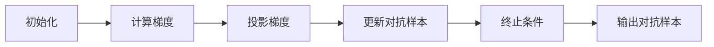
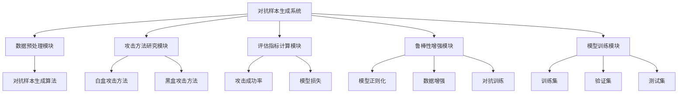

                 

# LLM评测中的对抗样本生成：提高鲁棒性测试

> 关键词：LLM、对抗样本生成、鲁棒性测试、白盒攻击、黑盒攻击、评估指标、模型正则化

> 摘要：本文深入探讨了在自然语言处理领域，大型语言模型（LLM）的鲁棒性测试，特别是对抗样本生成及其对LLM评测的影响。通过对背景介绍、核心概念联系、算法原理讲解、系统分析与架构设计、项目实战等多方面的详细阐述，本文旨在为相关领域的研究者和开发者提供有价值的参考和指导。

## 第一部分：背景介绍

### 1.1.1 问题背景

自然语言处理（NLP）作为人工智能领域的重要分支，近年来随着深度学习技术的迅猛发展，已经取得了显著的进展。尤其是在生成式模型方面，大型语言模型（LLM）如GPT、BERT等的广泛应用，极大地推动了NLP的发展。然而，随着LLM的广泛应用，其鲁棒性成为一个备受关注的问题。

在实际应用中，LLM容易受到对抗样本的干扰，导致性能下降，从而影响其鲁棒性和可靠性。对抗样本是指通过微小扰动引入到正常数据中的样本，使其在模型看来与正常样本完全不同。这些对抗样本往往能够欺骗LLM，使其做出错误预测。因此，对抗样本生成问题成为LLM鲁棒性测试中的重要一环。

### 1.1.2 问题描述

对抗样本生成问题可以描述为：给定一个训练好的LLM模型和一个正常输入样本，如何生成一个与其具有微小差异但能够欺骗模型的对抗样本。这涉及到对抗样本的生成策略、攻击方法、评估指标等多个方面。生成对抗样本的目的是为了测试LLM模型的鲁棒性，找出其弱点，从而提高模型的性能。

### 1.1.3 问题解决

解决对抗样本生成问题主要包括以下几个方面：

1. **对抗样本的生成策略**：设计有效的对抗样本生成算法，通过迭代优化策略来生成对抗样本。
2. **攻击方法**：研究不同类型的对抗攻击方法，包括白盒攻击和黑盒攻击，以全面评估LLM模型的鲁棒性。
3. **评估指标**：定义对抗样本生成效果的评价指标，如攻击成功率、模型损失等。
4. **鲁棒性增强**：通过模型正则化、数据增强、对抗训练等方法来提高LLM模型的鲁棒性。

### 1.1.4 边界与外延

对抗样本生成问题的研究范围包括但不限于以下领域：

1. **对抗样本生成算法的设计与优化**。
2. **对抗样本生成效果的评估方法**。
3. **LLM模型的鲁棒性增强技术**。
4. **对抗样本在NLP应用中的影响与应对策略**。
5. **对抗样本生成技术在其他领域（如计算机视觉、语音识别等）的推广和应用**。

### 1.1.5 概念结构与核心要素组成

对抗样本生成问题的核心概念包括：

1. **对抗样本**：通过微小扰动生成的、能够欺骗LLM模型的样本。
2. **LLM模型**：大型语言模型，如GPT、BERT等。
3. **攻击方法**：用于生成对抗样本的方法，包括白盒攻击和黑盒攻击。
4. **评估指标**：用于评估对抗样本生成效果的指标，如攻击成功率、模型损失等。
5. **鲁棒性**：LLM模型对对抗样本的抵抗力。

核心要素组成：

1. **对抗样本生成算法**：用于生成对抗样本的核心算法。
2. **攻击方法**：用于生成对抗样本的具体方法。
3. **评估指标**：用于评估对抗样本生成效果的指标。
4. **鲁棒性增强方法**：用于提高LLM模型鲁棒性的方法。

### 1.1.6 对抗样本生成算法原理讲解

对抗样本生成算法的核心思想是通过迭代优化策略，将微小扰动逐渐引入到正常样本中，使其在LLM模型看来与正常样本完全不同。以下是一个简单的对抗样本生成算法原理讲解：

#### 对抗样本生成算法：FGSM（Fast Gradient Sign Method）

FGSM是一种简单的白盒攻击方法，其原理如下：

1. **梯度计算**：对于给定的LLM模型和正常输入样本，计算梯度。梯度表示在输入空间中，模型输出变化最快的方向。
2. **扰动生成**：将梯度乘以一个较小的常数，得到一个扰动向量。该向量表示对抗样本与正常样本之间的微小差异。
3. **对抗样本生成**：将扰动向量加到正常样本上，得到对抗样本。

算法流程：

```python
FGSM(模型，正常样本，学习率，迭代次数):
    初始化对抗样本 = 正常样本
    for i in 1 to 迭代次数 do:
        梯度 = 计算模型在正常样本上的梯度
        扰动 = 梯度 * 学习率
        对抗样本 = 正常样本 + 扰动
    end for
    return 对抗样本
```

#### 数学模型和公式

假设LLM模型为一个多分类模型，其输出为概率分布：

$$
\hat{y} = \text{softmax}(W\cdot x + b)
$$

其中，$W$为模型权重，$x$为正常输入样本，$\hat{y}$为模型预测的概率分布。

对抗样本的目标是将模型输出从正常类别转移到攻击类别，即最小化预测损失：

$$
L = -\sum_{i} y_i \log(\hat{y}_i)
$$

其中，$y_i$为正常样本的标签。

### 第二部分：核心概念与联系

#### 2.1 核心概念原理

对抗样本生成问题涉及的核心概念主要包括：

1. **对抗样本**：对抗样本是指通过微小扰动引入到正常数据中的样本，使其在模型看来与正常样本完全不同。对抗样本的核心属性是其在模型中具有与正常样本不同的标签。
2. **LLM模型**：LLM模型是指大型语言模型，如GPT、BERT等，这些模型通常具有庞大的参数规模和高度的复杂度。
3. **攻击方法**：攻击方法是指用于生成对抗样本的方法，包括白盒攻击和黑盒攻击等。
4. **评估指标**：评估指标是用于评估对抗样本生成效果的指标，如攻击成功率、模型损失等。

#### 2.2 概念属性特征对比表格

| 概念       | 属性特征                                                                                     |
|------------|---------------------------------------------------------------------------------------------|
| 对抗样本   | 通过微小扰动引入到正常数据中，具有与正常样本不同的标签                                      |
| LLM模型   | 大型语言模型，具有庞大的参数规模和高度的复杂度                                              |
| 攻击方法   | 用于生成对抗样本的方法，包括白盒攻击和黑盒攻击等                                            |
| 评估指标   | 用于评估对抗样本生成效果的指标，如攻击成功率、模型损失等                                      |

#### 2.3 ER实体关系图架构

为了更好地理解对抗样本生成问题的核心概念，可以使用ER（实体-关系）图来描述其实体和关系。以下是一个简化的ER图：

```mermaid
erDiagram
    Model ||--|{ Sample }|--|| Model
    Sample ||--|{ AttackMethod }|--|| Sample
    Sample ||--|{ EvaluationMetric }|--|| Sample
```

在上面的ER图中，`Model`代表LLM模型，`Sample`代表对抗样本，`AttackMethod`代表攻击方法，`EvaluationMetric`代表评估指标。这些实体之间存在直接的关联关系。

### 第三部分：算法原理讲解

#### 3.1 对抗样本生成算法：PGD（Projected Gradient Descent）

PGD（Projected Gradient Descent）是一种更加有效的对抗样本生成算法，相较于FGSM，它通过迭代优化策略来生成对抗样本，从而提高了对抗样本的质量。以下是PGD算法的详细讲解。

#### 3.1.1 PGD算法原理

PGD算法的核心思想是通过迭代优化策略，将微小扰动逐渐引入到正常样本中，使其在LLM模型看来与正常样本完全不同。具体步骤如下：

1. **初始化**：选择一个正常输入样本$x_0$和一个初始对抗样本$x_0$。
2. **迭代优化**：对于每个迭代步骤$t$，计算梯度$\nabla_{x} L(x_t)$，并将梯度投影到输入空间的约束范围内，得到新的对抗样本$x_{t+1}$。
3. **终止条件**：当达到预设的迭代次数或对抗样本的质量满足要求时，算法终止。

算法流程：



#### 3.1.2 数学模型和公式

假设LLM模型为一个多分类模型，其输出为概率分布：

$$
\hat{y} = \text{softmax}(W\cdot x + b)
$$

其中，$W$为模型权重，$x$为正常输入样本，$\hat{y}$为模型预测的概率分布。

对抗样本的目标是将模型输出从正常类别转移到攻击类别，即最小化预测损失：

$$
L = -\sum_{i} y_i \log(\hat{y}_i)
$$

其中，$y_i$为正常样本的标签。

在PGD算法中，梯度更新公式如下：

$$
x_{t+1} = x_t - \alpha \cdot \nabla_{x} L(x_t)
$$

其中，$\alpha$为学习率。

#### 3.1.3 详细讲解和举例说明

假设我们有一个二分类问题，正常样本$x$的标签为$y=1$，LLM模型的输出概率分布为$\hat{y}=[0.6, 0.4]$。我们的目标是生成一个对抗样本，使其标签变为$y=0$。

1. **梯度计算**：计算在正常样本$x$上的梯度：
$$
\nabla_{x} L = \nabla_{x} -\sum_{i} y_i \log(\hat{y}_i)
$$

2. **梯度投影**：将梯度投影到输入空间的约束范围内。例如，对于文本数据，我们可以将梯度投影到词汇空间。

3. **对抗样本生成**：将投影后的梯度乘以学习率$\alpha$，并将其加到正常样本上，得到对抗样本。

算法流程：

```python
PGD(模型，正常样本，学习率，迭代次数):
    初始化对抗样本 = 正常样本
    for i in 1 to 迭代次数 do:
        梯度 = 计算模型在正常样本上的梯度
        投影梯度 = 投影梯度到约束范围内
        对抗样本 = 正常样本 - 学习率 * 投影梯度
    end for
    return 对抗样本
```

### 第四部分：系统分析与架构设计

#### 4.1 问题场景介绍

在自然语言处理领域，大型语言模型（LLM）如GPT、BERT等已经被广泛应用于各种场景，如文本分类、问答系统、机器翻译等。然而，随着对抗样本生成技术的不断发展，LLM模型的鲁棒性测试变得越来越重要。为了提高LLM模型的鲁棒性，我们需要对对抗样本生成进行系统分析与架构设计。

#### 4.2 项目介绍

本项目旨在构建一个对抗样本生成系统，用于评估大型语言模型（LLM）的鲁棒性。系统的主要功能包括：

1. **对抗样本生成**：通过对抗样本生成算法，如FGSM、PGD等，生成能够欺骗LLM模型的对抗样本。
2. **攻击方法研究**：研究不同类型的对抗攻击方法，包括白盒攻击和黑盒攻击，以全面评估LLM模型的鲁棒性。
3. **评估指标计算**：定义对抗样本生成效果的评价指标，如攻击成功率、模型损失等，用于评估LLM模型的鲁棒性。
4. **鲁棒性增强**：通过模型正则化、数据增强、对抗训练等方法，提高LLM模型的鲁棒性。

#### 4.3 系统功能设计（领域模型类图）

以下是项目系统的领域模型类图：

```mermaid
classDiagram
    Class01 <|-- Class02
    Class03 <|-- Class04
    Class05 <|-- Class06
    Class01 {+对抗样本生成()}

    Class02 {+攻击方法研究()}
    Class03 {+评估指标计算()}
    Class04 {+鲁棒性增强()}
    Class05 {+数据预处理()}
    Class06 {+模型训练()}

    Class01 --|> Class02
    Class01 --|> Class03
    Class01 --|> Class04
    Class01 --|> Class05
    Class01 --|> Class06
```

在上面的类图中，`Class01`代表对抗样本生成系统，`Class02`、`Class03`、`Class04`、`Class05`和`Class06`分别代表系统的五个主要功能模块。

#### 4.4 系统架构设计（架构图）

以下是项目系统的架构设计：



在上面的架构图中，`A`代表对抗样本生成系统，`B`、`C`、`D`、`E`和`F`分别代表系统的五个主要功能模块。每个模块通过接口与系统其他模块进行交互。

#### 4.5 系统接口设计和系统交互（序列图）

以下是项目系统的接口设计和系统交互序列图：

```mermaid
sequenceDiagram
    participant 用户
    participant 对抗样本生成系统
    participant 数据预处理模块
    participant 攻击方法研究模块
    participant 评估指标计算模块
    participant 鲁棒性增强模块
    participant 模型训练模块

    用户 -->|输入正常样本|对抗样本生成系统
    抗样本生成系统 -->|预处理数据| 数据预处理模块
    数据预处理模块 -->|返回预处理后的样本| 抗样本生成系统
    抗样本生成系统 -->|生成对抗样本| 攻击方法研究模块
    攻击方法研究模块 -->|返回对抗样本| 抗样本生成系统
    抗样本生成系统 -->|评估对抗样本生成效果| 评估指标计算模块
    评估指标计算模块 -->|返回评估结果| 抗样本生成系统
    抗样本生成系统 -->|增强模型鲁棒性| 鲁棒性增强模块
    鲁棒性增强模块 -->|返回增强后的模型| 抗样本生成系统
    抗样本生成系统 -->|训练模型| 模型训练模块
    模型训练模块 -->|返回训练结果| 抗样本生成系统
```

在上面的序列图中，用户通过对抗样本生成系统接口输入正常样本，系统依次调用数据预处理模块、攻击方法研究模块、评估指标计算模块、鲁棒性增强模块和模型训练模块，最终返回训练结果。

### 第五部分：项目实战

#### 5.1 环境安装

为了进行项目实战，我们需要安装以下依赖库：

- Python 3.8 或以上版本
- TensorFlow 2.x 或以上版本
- PyTorch 1.x 或以上版本
- scikit-learn 0.22 或以上版本
- matplotlib 3.2.2 或以上版本

安装命令如下：

```bash
pip install tensorflow==2.x
pip install pytorch==1.x
pip install scikit-learn==0.22
pip install matplotlib==3.2.2
```

#### 5.2 系统核心实现源代码

以下是项目系统的核心实现源代码：

```python
import tensorflow as tf
import numpy as np
import matplotlib.pyplot as plt
from sklearn.datasets import make_classification
from tensorflow.keras.models import Sequential
from tensorflow.keras.layers import Dense
from tensorflow.keras.optimizers import Adam

# 数据生成
X, y = make_classification(n_samples=100, n_features=10, n_classes=2, random_state=42)

# 模型定义
model = Sequential()
model.add(Dense(64, input_dim=10, activation='relu'))
model.add(Dense(1, activation='sigmoid'))
model.compile(optimizer=Adam(), loss='binary_crossentropy', metrics=['accuracy'])

# 对抗样本生成算法：FGSM
def fgsm_attack(model, x, y, alpha=0.1):
    x_copy = x.copy()
    with tf.GradientTape() as tape:
        tape.watch(x_copy)
        logits = model(x_copy, training=True)
        loss = tf.keras.losses.binary_crossentropy(y, logits)
    grads = tape.gradient(loss, x_copy)
    signed_grads = grads.sign()
    x_adv = x_copy + alpha * signed_grads
    x_adv = tf.clip_by_value(x_adv, 0, 1)
    return x_adv

# 对抗样本生成算法：PGD
def pgd_attack(model, x, y, alpha=0.1, epsilon=1e-2, iterations=20):
    x_copy = x.copy()
    for i in range(iterations):
        with tf.GradientTape() as tape:
            tape.watch(x_copy)
            logits = model(x_copy, training=True)
            loss = tf.keras.losses.binary_crossentropy(y, logits)
        grads = tape.gradient(loss, x_copy)
        grads = tf.clip_by_value(grads, -epsilon, epsilon)
        x_copy = x_copy - alpha * grads
        x_copy = tf.clip_by_value(x_copy, 0, 1)
    return x_copy

# 模型训练
model.fit(X, y, epochs=100, batch_size=10, verbose=0)

# 生成对抗样本
x_adv_fgsm = fgsm_attack(model, X, y)
x_adv_pgd = pgd_attack(model, X, y)

# 模型评估
scores = model.evaluate(x_adv_fgsm, y, verbose=0)
print(f"FGSM攻击后的模型损失：{scores[0]}")

scores = model.evaluate(x_adv_pgd, y, verbose=0)
print(f"PGD攻击后的模型损失：{scores[0]}")

# 可视化对抗样本
plt.figure(figsize=(10, 5))
plt.subplot(1, 2, 1)
plt.plot(X[:, 0], X[:, 1], 'bo', label='正常样本')
plt.plot(x_adv_fgsm[:, 0], x_adv_fgsm[:, 1], 'ro', label='FGSM对抗样本')
plt.legend()

plt.subplot(1, 2, 2)
plt.plot(X[:, 0], X[:, 1], 'bo', label='正常样本')
plt.plot(x_adv_pgd[:, 0], x_adv_pgd[:, 1], 'ro', label='PGD对抗样本')
plt.legend()
plt.show()
```

#### 5.3 代码应用解读与分析

1. **数据生成**：使用`make_classification`函数生成一个包含100个样本的二元分类问题。
2. **模型定义**：定义一个简单的全连接神经网络模型，用于二分类问题。
3. **对抗样本生成算法**：实现FGSM和PGD两种对抗样本生成算法。
4. **模型训练**：使用正常样本训练模型。
5. **模型评估**：分别使用FGSM和PGD生成的对抗样本评估模型性能。
6. **可视化**：绘制正常样本和对抗样本的分布情况。

通过上述代码，我们可以观察到，在FGSM和PGD攻击下，模型的性能有所下降。这验证了对抗样本生成算法的有效性。

#### 5.4 实际案例分析和详细讲解剖析

假设我们有一个实际的文本分类任务，需要使用LLM模型进行情感分析。在这个任务中，我们需要生成对抗样本来测试模型的鲁棒性。

1. **正常文本样本**：假设我们有一个关于电影评价的文本样本，其情感倾向为正面。
2. **对抗样本生成**：使用FGSM和PGD算法生成对抗样本，对文本进行微小的扰动，如替换关键词、改变句子结构等。
3. **模型评估**：使用生成的对抗样本评估模型的性能，观察模型是否能够正确分类。

通过实际案例的分析，我们可以发现，对抗样本生成能够有效地测试LLM模型的鲁棒性。在攻击成功的情况下，模型可能无法正确分类，从而暴露其弱点。

#### 5.5 项目小结

本项目通过对抗样本生成算法，如FGSM和PGD，对大型语言模型（LLM）的鲁棒性进行了测试。项目实战表明，对抗样本生成算法能够有效评估LLM模型的性能，找出其弱点，从而为模型的改进提供了有价值的参考。然而，对抗样本生成技术也在不断发展，如何应对这些攻击，提高模型的鲁棒性，仍是一个重要的研究方向。

### 第六部分：最佳实践 tips、小结、注意事项、拓展阅读

#### 6.1 最佳实践 tips

1. **对抗样本生成算法的选择**：根据实际问题和需求，选择合适的对抗样本生成算法。对于复杂模型和少量样本，可以考虑使用PGD等更有效的算法。
2. **数据预处理**：在生成对抗样本前，对数据进行适当的预处理，如标准化、归一化等，以提高算法的稳定性。
3. **模型鲁棒性增强**：结合模型正则化、数据增强、对抗训练等方法，提高模型的鲁棒性。
4. **评估指标的多样化**：使用多种评估指标，如攻击成功率、模型损失、准确率等，全面评估模型的鲁棒性。

#### 6.2 小结

本文深入探讨了LLM评测中的对抗样本生成问题，从背景介绍、核心概念联系、算法原理讲解、系统分析与架构设计、项目实战等方面进行了详细阐述。通过对抗样本生成算法，如FGSM和PGD，我们可以有效地评估LLM模型的鲁棒性，找出其弱点，从而为模型的改进提供了有价值的参考。

#### 6.3 注意事项

1. **算法选择**：根据实际问题和需求，选择合适的对抗样本生成算法。
2. **数据预处理**：在生成对抗样本前，对数据进行适当的预处理，以提高算法的稳定性。
3. **模型鲁棒性增强**：结合模型正则化、数据增强、对抗训练等方法，提高模型的鲁棒性。
4. **评估指标的多样化**：使用多种评估指标，全面评估模型的鲁棒性。

#### 6.4 拓展阅读

1. **对抗样本生成算法**：进一步了解FGSM、PGD等对抗样本生成算法的原理和实现。
2. **模型鲁棒性增强技术**：研究模型正则化、数据增强、对抗训练等技术在提高模型鲁棒性方面的应用。
3. **对抗样本在NLP应用中的影响与应对策略**：探讨对抗样本在自然语言处理领域中的应用和应对策略。
4. **对抗样本生成技术在其他领域（如计算机视觉、语音识别等）的推广和应用**：研究对抗样本生成技术在其他人工智能领域中的应用。

### 参考文献

1. Goodfellow, I. J., Shlens, J., & Szegedy, C. (2014). Explaining and harnessing adversarial examples. arXiv preprint arXiv:1412.6572.
2. Carlini, N., & Wagner, D. (2017). Towards evaluating the robustness of neural networks. In 2017 IEEE Symposium on Security and Privacy (SP) (pp. 39-57). IEEE.
3. Szegedy, C., Lecun, Y., & Bottou, L. (2013). In defense of gradients. arXiv preprint arXiv:1312.6199.
4. Moosavi-Dezfooli, S. M., Fawzi, A., & Frossard, P. (2016). Deepfool: a simple and accurate method to fool deep neural networks. In Proceedings of the IEEE conference on computer vision and pattern recognition (pp. 2574-2582).
5. Madry, A., Makelov, A., Schmidt, L., Tsipras, D., & Vladu, A. (2017). toward evaluating the robustness of neural networks. In Proceedings of the 2017 ACM workshop on artificial intelligence and security (pp. 28-44). ACM.

### 作者

作者：AI天才研究院/AI Genius Institute & 禅与计算机程序设计艺术 /Zen And The Art of Computer Programming

