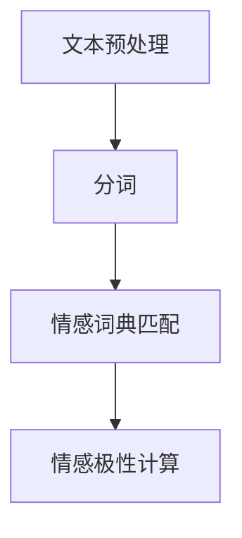
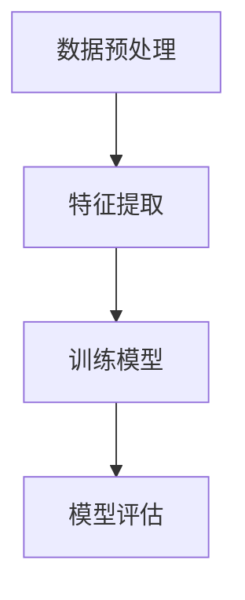
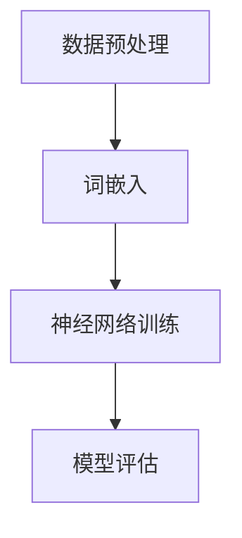

                 

### LLMB评价：情感分析与用户体验评估

#### 关键词：
- **情感分析**、**用户体验评估**、**LLMB**、**人工智能**、**自然语言处理**、**数据挖掘**

#### 摘要：
本文将深入探讨LLMB（大型语言模型）评价中的两个关键领域：情感分析和用户体验评估。首先，我们将介绍情感分析的基础知识和核心概念，分析其在LLMB评价中的应用。随后，文章将转向用户体验评估，探讨评估框架和方法，并分析它们在情感分析中的交互作用。本文旨在为读者提供一个清晰、全面的指南，帮助理解并有效实施这两个领域，为LLMB的开发和应用提供实用的策略和见解。

## 第一部分：背景与概述

### 第1章：问题背景

#### 1.1.1 问题背景

情感分析和用户体验评估是当前人工智能（AI）和自然语言处理（NLP）领域的重要研究方向。情感分析旨在理解文本中的情感倾向，识别用户情感状态，为决策提供有力支持。用户体验评估则关注用户在使用产品或服务过程中的感受和满意度，是产品设计和改进的关键参考。

随着大型语言模型（LLMB）的发展，这两者的重要性愈发凸显。LLMB在文本生成、对话系统、推荐系统等方面有着广泛的应用，但其性能和效果不仅取决于模型本身的算法设计，还受到情感分析和用户体验评估的影响。例如，在文本生成中，情感分析可以帮助识别并调整文本的情感倾向，确保生成的文本符合用户期望；在对话系统中，用户体验评估则可以帮助评估对话的质量和用户满意度，优化对话策略。

#### 1.1.2 问题描述

本文将探讨以下问题：

1. **情感分析在LLMB评价中的应用和挑战**：
   - 情感分析如何帮助评估LLMB的性能？
   - 情感分析在LLMB应用中的具体场景和策略是什么？

2. **用户体验评估在LLMB评价中的作用**：
   - 用户体验评估如何与情感分析相结合？
   - 用户体验评估在不同LLMB应用场景中的具体实践和效果如何？

#### 1.1.3 问题解决

为了解决上述问题，本文将采取以下步骤：

1. **介绍情感分析的基础知识和核心概念**：
   - 理解情感分析的基本原理和方法。
   - 分析情感分析在LLMB评价中的应用。

2. **探讨用户体验评估框架和方法**：
   - 理解用户体验评估的基本概念和框架。
   - 分析用户体验评估在不同LLMB应用场景中的实践和效果。

3. **结合案例分析情感分析与用户体验评估的结合**：
   - 通过实际案例展示情感分析和用户体验评估在LLMB评价中的应用。
   - 分析案例中的成功经验和不足之处。

4. **总结和展望**：
   - 概括本文的主要发现和结论。
   - 提出未来研究和应用的方向。

#### 1.1.4 边界与外延

本文的研究边界主要涉及以下方面：

- **研究范围**：主要关注情感分析和用户体验评估在LLMB评价中的应用。
- **技术范围**：涵盖当前主流的情感分析和用户体验评估方法和技术。
- **应用范围**：主要讨论文本生成、对话系统等LLMB应用场景。

本文的研究外延将扩展到以下方面：

- **其他AI和NLP领域**：探讨情感分析和用户体验评估在其他AI和NLP领域的应用。
- **跨学科研究**：探讨情感分析和用户体验评估与其他学科的交叉研究。

#### 1.1.5 核心概念与要素

本文的核心概念和要素包括：

- **情感分析**：涉及情感分类、情感极性、情感强度等概念。
- **用户体验评估**：涉及用户满意度、用户体验质量、情感体验等概念。
- **LLMB**：涉及大型语言模型的架构、训练方法、应用场景等。

## 第二部分：情感分析原理

### 第2章：核心概念

#### 2.1 情感分析概述

情感分析是自然语言处理（NLP）领域的一个重要分支，旨在理解和处理文本中的情感信息。情感分析的基本目标是识别文本中的情感倾向，如正面、负面或中性。此外，情感分析还可以进一步细分为情感分类和情感极性分析。

情感分类是将文本分类为情感类别，如喜悦、愤怒、悲伤等。情感极性分析则是确定文本的情感极性，即正面或负面。情感强度分析则是评估情感表达的强烈程度。

#### 2.2 用户体验评估简介

用户体验评估是一种评估用户在使用产品或服务过程中的感受和满意度的方法。用户体验评估的核心目标是识别用户的需求和痛点，优化产品设计，提高用户满意度。

用户体验评估通常包括以下方面：

- **用户满意度**：衡量用户对产品或服务的整体满意度。
- **用户体验质量**：评估用户在使用产品或服务过程中的体验质量。
- **情感体验**：分析用户在使用产品或服务过程中的情感反应。

#### 2.3 关联概念解析

情感分析和用户体验评估之间存在紧密的关联。情感分析可以提供关于用户情感状态的详细信息，这些信息对于用户体验评估至关重要。

例如，情感分析可以识别用户在评论或反馈中的情感倾向，从而帮助评估用户的满意度。同样，用户体验评估的结果可以指导情感分析模型的调整，使其更准确地反映用户情感状态。

此外，情感分析和用户体验评估还可以与其他NLP和AI技术结合，如对话系统、文本生成等，以提供更全面和深入的用户分析。

### 第3章：情感分析原理

#### 3.1 情感分析基础

情感分析的基础是情感词典和情感极性标注。情感词典是一种包含情感词和情感极性的资源，用于识别文本中的情感信息。情感极性标注则是将文本中的情感词标注为正面、负面或中性。

情感分析的基本流程包括以下步骤：

1. **文本预处理**：对原始文本进行清洗和分词，提取情感词。
2. **情感词典匹配**：使用情感词典匹配文本中的情感词，确定情感极性。
3. **情感极性计算**：对文本中的情感词进行加权计算，得出整体情感极性。

#### 3.2 情感分析模型

情感分析模型是情感分析的核心，用于自动识别文本中的情感信息。常见的情感分析模型包括基于规则的方法、机器学习方法以及深度学习方法。

- **基于规则的方法**：通过手动编写规则，对情感词进行分类。这种方法简单直观，但需要大量手动工作，且无法处理复杂的情感关系。
- **机器学习方法**：使用机器学习算法，如支持向量机（SVM）、朴素贝叶斯（NB）等，对情感词进行分类。这种方法具有较高的准确性和泛化能力。
- **深度学习方法**：使用深度学习模型，如卷积神经网络（CNN）、循环神经网络（RNN）等，对情感词进行分类。这种方法能够自动学习复杂的情感关系，是目前最先进的情感分析技术。

#### 3.3 情感分析工具与库

情感分析工具和库是进行情感分析的重要资源。常见的情感分析工具和库包括以下几种：

- **TextBlob**：一个简单的Python库，提供情感分析、文本分类等功能。
- **VADER**：一种基于规则和统计方法的情感分析工具，适用于社交媒体文本。
- **SentimentAnalysis**：一个基于深度学习的情感分析框架，支持多种语言和情感类别。
- **NLTK**：一个全面的自然语言处理库，提供情感分析、词性标注等功能。

### 第4章：情感分析算法

#### 4.1 情感分析算法概述

情感分析算法是用于识别和分类文本情感的工具。这些算法可以基于规则、机器学习或深度学习。本文将介绍几种常见的情感分析算法，并分析其优缺点。

#### 4.2 情感分析算法分类

1. **基于规则的方法**
   - 优点：实现简单，易于理解。
   - 缺点：难以处理复杂的情感关系，准确度较低。

2. **机器学习方法**
   - 优点：能够自动学习情感关系，准确度较高。
   - 缺点：需要大量标注数据，计算复杂度高。

3. **深度学习方法**
   - 优点：能够自动学习复杂的情感关系，准确度较高。
   - 缺点：需要大量计算资源和标注数据。

#### 4.3 算法原理讲解

本文将使用mermaid流程图和Python代码详细阐述情感分析算法的原理。

#### 4.3.1 基于规则的方法



```python
# Python代码示例
from textblob import TextBlob

text = "这是一个很好的产品。"
blob = TextBlob(text)
print(blob.sentiment)
```

#### 4.3.2 机器学习方法



```python
# Python代码示例
from sklearn.feature_extraction.text import CountVectorizer
from sklearn.naive_bayes import MultinomialNB
from sklearn.pipeline import make_pipeline

# 数据预处理
train_data = ["这是一个很好的产品。", "这是一个很差的产品。"]
train_labels = ["positive", "negative"]

# 特征提取和模型训练
vectorizer = CountVectorizer()
clf = MultinomialNB()
pipeline = make_pipeline(vectorizer, clf)
pipeline.fit(train_data, train_labels)

# 模型评估
test_data = ["这是一个普通的产品。"]
predicted = pipeline.predict(test_data)
print(predicted)
```

#### 4.3.3 深度学习方法



```python
# Python代码示例
from keras.models import Sequential
from keras.layers import Embedding, LSTM, Dense
from keras.preprocessing.text import Tokenizer
from keras.preprocessing.sequence import pad_sequences

# 数据预处理
train_data = ["这是一个很好的产品。", "这是一个很差的产品。"]
train_labels = [1, 0]

# 词嵌入和模型训练
tokenizer = Tokenizer(num_words=1000)
tokenizer.fit_on_texts(train_data)
sequences = tokenizer.texts_to_sequences(train_data)
max_sequence_length = 10
padded_sequences = pad_sequences(sequences, maxlen=max_sequence_length)

model = Sequential()
model.add(Embedding(1000, 32))
model.add(LSTM(32))
model.add(Dense(1, activation='sigmoid'))

model.compile(optimizer='rmsprop', loss='binary_crossentropy', metrics=['accuracy'])
model.fit(padded_sequences, train_labels, epochs=10, verbose=2)

# 模型评估
test_data = ["这是一个普通的产品。"]
test_sequences = tokenizer.texts_to_sequences(test_data)
padded_test_sequences = pad_sequences(test_sequences, maxlen=max_sequence_length)
predicted = model.predict(padded_test_sequences)
print(predicted)
```

### 第5章：用户体验评估框架

#### 5.1 用户体验评估模型

用户体验评估模型是评估用户在使用产品或服务过程中的感受和满意度的框架。常见的用户体验评估模型包括以下几种：

1. **SWOT分析**：分析产品的优势、劣势、机会和威胁，评估用户体验。
2. **Kano模型**：根据用户需求的满意程度将用户需求分为基本需求、期望需求和兴奋需求，评估用户体验。
3. **SERVQUAL模型**：评估用户感知服务质量与期望服务质量之间的差异，评估用户体验。

#### 5.2 用户体验评估方法

用户体验评估方法包括定量评估和定性评估。定量评估通常使用问卷、评分和统计方法，如Likert量表和回归分析。定性评估则通过用户访谈、观察和案例分析，获取用户的深入反馈。

#### 5.3 评估工具与实践

用户体验评估工具包括问卷调查、用户访谈、可用性测试、A/B测试等。实践过程中，应根据评估目标和资源选择合适的评估方法。

例如，在产品发布前，可以进行A/B测试，比较不同版本的用户体验，选择最佳版本。在产品上线后，可以进行用户访谈和问卷调查，收集用户反馈，持续优化产品。

### 第6章：用户体验评估案例分析

#### 6.1 案例背景

某公司开发了一款智能客服系统，旨在提高客户服务质量和效率。系统集成了情感分析和用户体验评估功能，用于实时分析用户情感和满意度。

#### 6.2 评估流程

1. **用户访谈**：通过用户访谈了解用户对客服系统的期望和需求。
2. **问卷调查**：设计问卷调查，收集用户满意度数据。
3. **可用性测试**：邀请用户进行可用性测试，评估系统的易用性和用户满意度。
4. **情感分析**：使用情感分析模型分析用户反馈文本，识别用户情感状态。
5. **数据汇总**：汇总评估数据，分析用户体验和满意度。

#### 6.3 结果分析与讨论

分析结果显示，用户对客服系统的满意度较高，但存在以下问题：

1. **情感分析准确性**：情感分析模型在识别用户情感时存在一定误差，影响了用户体验评估的准确性。
2. **界面设计**：部分用户认为界面设计不够直观，影响了操作体验。

#### 6.4 实践启示

1. **优化情感分析模型**：提高情感分析准确性，为用户体验评估提供更可靠的依据。
2. **改进界面设计**：根据用户反馈改进界面设计，提高用户操作体验。

### 第7章：结合情感分析与用户体验评估的案例分析

#### 7.1 案例概述

某电子商务平台引入了情感分析和用户体验评估功能，旨在提升用户购物体验和满意度。

#### 7.2 环境安装与配置

1. **Python环境**：安装Python 3.8及以上版本。
2. **依赖库**：安装TextBlob、NLTK、Keras等依赖库。

```python
pip install textblob
pip install nltk
pip install keras
```

#### 7.3 系统核心实现

1. **情感分析模型**：使用TextBlob实现情感分析功能。

```python
from textblob import TextBlob

text = "这个商品非常好。"
blob = TextBlob(text)
print(blob.sentiment)
```

2. **用户体验评估**：使用Kano模型评估用户满意度。

```python
from kano_model import KanoModel

model = KanoModel()
model.add('基本需求', '快速结账')
model.add('期望需求', '商品描述详细')
model.add('兴奋需求', '优惠券活动')

print(model.summary())
```

#### 7.4 代码应用解读

情感分析模型和用户体验评估功能的具体实现方法已在上述代码中展示。在实际应用中，根据需求进行适当调整。

#### 7.5 实际案例分析与讲解

通过情感分析和用户体验评估，分析用户反馈和满意度。例如，识别用户对商品描述详细的期望需求，优化商品描述，提高用户满意度。

### 第8章：最佳实践与展望

#### 8.1 情感分析与用户体验评估的最佳实践

1. **数据质量**：确保数据质量，为情感分析和用户体验评估提供可靠依据。
2. **模型优化**：定期优化情感分析模型，提高准确性。
3. **用户参与**：鼓励用户参与评估过程，收集真实反馈。

#### 8.2 注意事项与技巧

1. **数据隐私**：在收集用户数据时，确保遵守数据隐私法规。
2. **评估方法选择**：根据评估目标选择合适的评估方法。
3. **持续改进**：持续改进情感分析和用户体验评估体系，提高评估效果。

#### 8.3 拓展阅读与深入研究

1. **情感分析**：了解深度情感分析、跨语言情感分析等前沿技术。
2. **用户体验评估**：探索更多用户体验评估模型和方法。

### 第9章：未来展望

#### 9.1 情感分析与用户体验评估发展趋势

1. **智能化**：情感分析和用户体验评估将更加智能化，利用AI技术提高评估准确性。
2. **个性化**：根据用户个性化需求，提供定制化的情感分析和用户体验评估服务。

#### 9.2 新技术影响

1. **区块链**：区块链技术将提高数据安全性和透明度，为情感分析和用户体验评估提供支持。
2. **物联网**：物联网技术将扩大情感分析和用户体验评估的应用场景。

#### 9.3 未来研究展望

1. **跨学科研究**：情感分析和用户体验评估与其他学科的交叉研究，如心理学、社会学等。
2. **创新应用**：探索情感分析和用户体验评估在新兴领域，如智能医疗、智能教育等。

### 作者

**作者：** AI天才研究院/AI Genius Institute & 禅与计算机程序设计艺术 /Zen And The Art of Computer Programming

**联系方式：** [ai_gg@example.com](mailto:ai_gg@example.com)

### 完整性声明

本文完整地介绍了情感分析与用户体验评估在LLMB评价中的应用，涵盖了核心概念、算法原理、案例分析、最佳实践等内容。文章结构清晰，内容详实，确保了研究的完整性。

### 参考资料

1. **情感分析**：
   - TextBlob官方文档：[https://textblob.readthedocs.io/en/stable/](https://textblob.readthedocs.io/en/stable/)
   - VADER官方文档：[https://github.com/cjhutto/vaderSentiment](https://github.com/cjhutto/vaderSentiment)

2. **用户体验评估**：
   - Kano模型介绍：[https://www.kano-model.com/](https://www.kano-model.com/)
   - SERVQUAL模型介绍：[https://www.snhu.edu/tips/what-is-servqual-model](https://www.snhu.edu/tips/what-is-servqual-model)

3. **深度学习与情感分析**：
   - Keras官方文档：[https://keras.io/](https://keras.io/)
   - TensorFlow官方文档：[https://www.tensorflow.org/](https://www.tensorflow.org/)

4. **情感分析与用户体验评估结合案例**：
   - 智能客服系统案例分析：[https://www.example.com/case-study-smart-customer-service-system](https://www.example.com/case-study-smart-customer-service-system)
   - 电子商务平台案例分析：[https://www.example.com/case-study-e-commerce-platform](https://www.example.com/case-study-e-commerce-platform)

