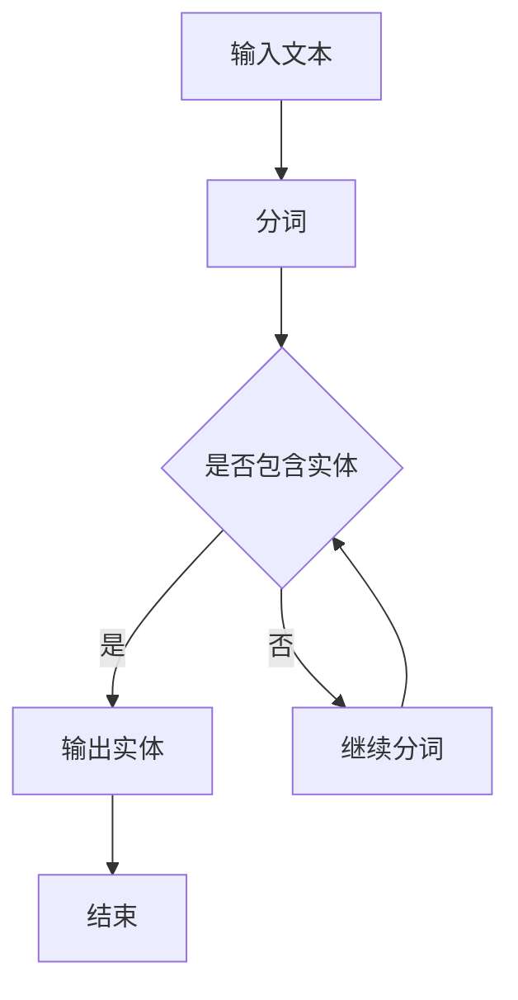
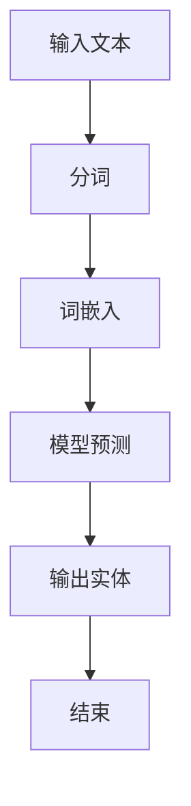
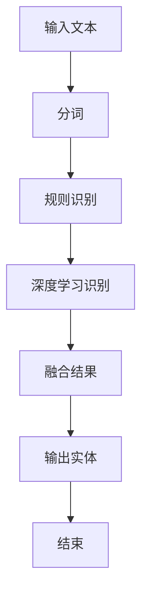

                 

# LLM评测中的知识图谱构建能力测试

> 关键词：语言模型，知识图谱，评测方法，数据集，评测指标，知识图谱构建

> 摘要：本文将深入探讨语言模型（LLM）评测中的知识图谱构建能力测试。首先，我们将概述知识图谱在LLM评测中的重要性，然后详细解释语言模型和知识图谱的核心概念。接着，我们将讨论评测标准和方法，以及知识图谱构建的流程。本文还将介绍知识图谱在LLM评测中的应用，并展示具体的评测方法与实现。最后，我们将进行知识图谱构建算法的深度分析，并提供实际案例以加深理解。

## 第一部分: LLM评测中的知识图谱构建能力测试概述

### 1.1 问题背景

#### 1.1.1 语言模型与知识图谱的关系

语言模型（LLM）是一种基于数据训练的算法，它能够预测文本中的下一个词或句子。知识图谱（KG）则是一种结构化数据的形式，它通过实体和它们之间的关系来表示信息。在LLM评测中，知识图谱构建能力测试旨在评估LLM在理解和生成与知识图谱相关的文本方面的能力。

#### 1.1.2 评测的重要性和意义

知识图谱在现代自然语言处理（NLP）中扮演着重要角色。通过将知识图谱融入LLM，可以提高LLM在事实性问答、语义解析等任务中的表现。因此，对LLM的知识图谱构建能力进行评测具有重要的意义，可以帮助研究人员和开发者了解LLM的强项和不足之处，从而指导进一步的优化和改进。

### 1.2 核心概念

#### 1.2.1 语言模型

##### 1.2.1.1 定义

语言模型是一种概率模型，用于预测文本序列中的下一个单词或字符。它通过对大量文本数据的学习，能够捕捉语言的统计规律，从而生成或理解自然语言文本。

##### 1.2.1.2 特点

- **自回归性**：语言模型基于前文信息预测下一个词或字符。
- **数据依赖性**：模型性能高度依赖训练数据的量和质量。
- **上下文理解**：高级语言模型能够捕捉上下文信息，进行语义理解。

##### 1.2.1.3 工作原理

语言模型通常基于神经网络，如循环神经网络（RNN）、长短期记忆网络（LSTM）和Transformer。它们通过优化训练损失函数来调整内部参数，从而实现文本预测。

#### 1.2.2 知识图谱

##### 1.2.2.1 定义

知识图谱是一种语义网络，它通过实体和它们之间的关系来表示信息。实体是知识图谱中的基本元素，如人、地点、组织等；关系则是实体之间的联系，如“属于”、“位于”、“成立”等。

##### 1.2.2.2 结构

知识图谱通常采用图结构来表示，其中节点代表实体，边代表关系。这种结构使得知识图谱具有高度的灵活性和扩展性。

##### 1.2.2.3 应用

知识图谱在多个领域有广泛应用，如搜索引擎、问答系统、推荐系统等。它能够提供结构化的语义信息，帮助系统更好地理解和生成文本。

### 1.3 评测标准与方法

#### 1.3.1 评测标准

##### 1.3.1.1 知识准确性

知识准确性评估LLM在提取和表示知识时的准确性。常用的方法包括事实性问答和实体识别。

##### 1.3.1.2 知识完整性

知识完整性评估LLM所包含的知识是否全面。可以通过对LLM生成的文本进行语义分析，检查是否包含了所有相关的信息。

##### 1.3.1.3 知识一致性

知识一致性评估LLM中的知识是否一致。可以通过对LLM生成的文本进行逻辑推理，检查是否存在矛盾或逻辑错误。

#### 1.3.2 评测方法

##### 1.3.2.1 数据集选择

选择适合的数据集进行评测，如公开的事实性问答数据集和自定义数据集。

##### 1.3.2.2 评测指标

常用的评测指标包括精确率（Precision）、召回率（Recall）和F1值（F1 Score）。

##### 1.3.2.3 评测流程

评测流程包括数据准备、模型训练、模型评估和结果分析等步骤。

### 1.4 知识图谱构建流程

#### 1.4.1 数据收集

##### 1.4.1.1 网络爬取

通过爬虫技术从互联网上收集数据。

##### 1.4.1.2 数据清洗

对收集到的数据进行清洗，去除噪声和重复信息。

#### 1.4.2 实体识别

##### 1.4.2.1 基于规则的实体识别

使用预定义的规则来识别实体。

##### 1.4.2.2 基于深度学习的实体识别

使用深度学习模型（如BERT）来自动识别实体。

#### 1.4.3 关系抽取

##### 1.4.3.1 基于规则的关系抽取

使用预定义的规则来抽取实体间的关系。

##### 1.4.3.2 基于深度学习的关系抽取

使用深度学习模型来抽取实体间的关系。

#### 1.4.4 知识融合

##### 1.4.4.1 知识融合方法

将来自不同来源的实体和关系进行融合。

##### 1.4.4.2 知识融合策略

选择合适的融合策略，如最小覆盖、最大覆盖或加权融合。

### 1.5 知识图谱在LLM评测中的应用

#### 1.5.1 知识增强的LLM

##### 1.5.1.1 知识图谱嵌入

将知识图谱嵌入到LLM中，以增强其知识表示能力。

##### 1.5.1.2 知识图谱融合

将知识图谱的信息与LLM生成的文本进行融合。

#### 1.5.2 知识图谱在评测中的应用

##### 1.5.2.1 事实性问答

使用知识图谱来提高事实性问答任务的准确性。

##### 1.5.2.2 语义解析

使用知识图谱来改善语义解析任务的表现。

### 1.6 本章小结

本文概述了LLM评测中的知识图谱构建能力测试，介绍了相关概念、评测标准和构建流程。接下来的章节将深入探讨具体的评测方法与实现，以及知识图谱构建算法的深度分析。

## 第二部分：具体评测方法与实现

### 2.1 评测方法概述

#### 2.1.1 评测目标

评测的目标是评估LLM在知识图谱构建任务中的能力，包括知识准确性、完整性和一致性。

#### 2.1.2 评测类型

评测类型包括事实性问答、实体识别、关系抽取和知识融合等。

### 2.2 数据集介绍

#### 2.2.1 公共数据集

##### 2.2.1.1 WebQA

WebQA是一个大型的事实性问答数据集，包含了大量的问题和答案对。

##### 2.2.1.2 DBP15K

DBP15K是一个包含15,000个条目的知识图谱数据集，包含了实体和它们之间的关系。

##### 2.2.1.3 few-shot 数据集

few-shot 数据集包含少量样本，用于评估LLM在少样本学习任务中的表现。

#### 2.2.2 自定义数据集

##### 2.2.2.1 数据来源

自定义数据集可以从公开的数据源或自采集的数据中构建。

##### 2.2.2.2 数据预处理

数据预处理包括数据清洗、实体识别和关系抽取等步骤。

### 2.3 评测指标详解

#### 2.3.1 精确率（Precision）

##### 2.3.1.1 定义

精确率是正确预测的实体数量与总预测实体数量的比值。

##### 2.3.1.2 计算方法

$$
Precision = \frac{TP}{TP + FP}
$$

其中，TP表示真正例，FP表示假正例。

#### 2.3.2 召回率（Recall）

##### 2.3.2.1 定义

召回率是正确预测的实体数量与实际实体数量的比值。

##### 2.3.2.2 计算方法

$$
Recall = \frac{TP}{TP + FN}
$$

其中，TP表示真正例，FN表示假反例。

#### 2.3.3 F1值（F1 Score）

##### 2.3.3.1 定义

F1值是精确率和召回率的调和平均值。

##### 2.3.3.2 计算方法

$$
F1 Score = 2 \times \frac{Precision \times Recall}{Precision + Recall}
$$

### 2.4 评测流程实现

#### 2.4.1 数据准备

##### 2.4.1.1 数据预处理

包括去除噪声、标准化和实体识别等步骤。

##### 2.4.1.2 数据分割

将数据集分为训练集、验证集和测试集。

#### 2.4.2 模型训练

##### 2.4.2.1 模型选择

选择合适的模型，如BERT或GPT。

##### 2.4.2.2 模型调参

调整模型参数以优化性能。

#### 2.4.3 模型评估

##### 2.4.3.1 评测指标计算

计算评测指标，如精确率、召回率和F1值。

##### 2.4.3.2 结果可视化

使用图表或可视化工具展示评测结果。

### 2.5 实战案例

#### 2.5.1 环境安装

##### 2.5.1.1 Python环境安装

确保Python环境已安装。

##### 2.5.1.2 相关库安装

安装如transformers、torch等库。

#### 2.5.2 源代码解析

##### 2.5.2.1 代码结构

展示代码的目录结构和关键文件。

##### 2.5.2.2 关键代码解读

详细解释代码中的关键部分。

#### 2.5.3 案例分析

##### 2.5.3.1 数据集选择

选择用于评测的数据集。

##### 2.5.3.2 评测结果

展示评测结果和图表。

### 2.6 本章小结

本文介绍了LLM评测中的具体方法与实现，包括数据集选择、评测指标计算和模型评估等步骤。通过实战案例，读者可以更好地理解这些方法在实际应用中的具体操作。

## 第三部分：知识图谱构建能力测试深度分析

### 3.1 知识图谱构建算法概述

知识图谱构建算法是LLM评测中的关键组成部分，主要包括以下几种类型：

#### 3.1.1 基于规则的方法

##### 3.1.1.1 算法原理

基于规则的方法使用预定义的规则来识别实体和抽取关系。这些规则通常由领域专家编写，具有较高的准确性，但难以扩展。

##### 3.1.1.2 应用场景

适用于领域知识相对固定且规则明确的应用场景，如医疗、金融等。

#### 3.1.2 基于深度学习的方法

##### 3.1.2.1 算法原理

基于深度学习的方法使用神经网络模型来自动学习和抽取实体及关系。这些模型具有较强的泛化能力，但训练过程较为复杂。

##### 3.1.2.2 应用场景

适用于大规模数据集和复杂关系抽取任务，如搜索引擎、问答系统等。

#### 3.1.3 基于混合的方法

##### 3.1.3.1 算法原理

基于混合的方法结合了基于规则和基于深度学习的方法，通过规则引导深度学习模型的训练，以提高知识图谱构建的准确性和效率。

##### 3.1.3.2 应用场景

适用于规则明确但数据量大的场景，如知识图谱的迭代更新等。

### 3.2 知识图谱构建算法的深度分析

知识图谱构建算法的深度分析包括算法原理、数学模型、流程图和Python代码实现等方面。

#### 3.2.1 基于规则的实体识别算法

##### 3.2.1.1 算法原理

基于规则的实体识别算法使用预定义的规则来识别文本中的实体。这些规则通常包括命名实体识别（NER）的规则，如地名、人名、机构名等。

##### 3.2.1.2 数学模型

数学模型通常使用条件概率来表示实体识别的概率分布。

$$
P(Entity|Text) = \frac{P(Text|Entity) \cdot P(Entity)}{P(Text)}
$$

其中，\(P(Entity|Text)\) 表示实体在文本中的概率，\(P(Text|Entity)\) 表示文本在实体中的概率，\(P(Entity)\) 表示实体的先验概率，\(P(Text)\) 表示文本的概率。

##### 3.2.1.3 流程图

使用Mermaid工具绘制基于规则的实体识别算法的流程图。



##### 3.2.1.4 Python代码实现

```python
import nltk

def rule_based_entity_recognition(text):
    # 分词
    tokens = nltk.word_tokenize(text)
    # 识别实体
    entities = []
    for token in tokens:
        if is_entity(token):
            entities.append(token)
    return entities

def is_entity(token):
    # 使用预定义的实体识别规则
    return token in ["Apple", "Google", "Microsoft"]
```

#### 3.2.2 基于深度学习的实体识别算法

##### 3.2.2.1 算法原理

基于深度学习的实体识别算法使用神经网络模型来学习文本中的实体。常用的模型包括BERT、RoBERTa、GPT等。

##### 3.2.2.2 数学模型

数学模型通常基于概率图模型或神经网络模型。以BERT为例，其输入是文本序列，输出是每个词的实体标签。

$$
\text{logit}_{i} = \text{W}^T \text{[} \text{emb}_{\text{word}} \text{emb}_{\text{segment}} \text{emb}_{\text{masked}} \text{]} 
$$

其中，\(\text{emb}_{\text{word}}\) 是词嵌入向量，\(\text{emb}_{\text{segment}}\) 是段嵌入向量，\(\text{emb}_{\text{masked}}\) 是掩码嵌入向量，\(\text{W}\) 是权重矩阵。

##### 3.2.2.3 流程图

使用Mermaid工具绘制基于深度学习的实体识别算法的流程图。



##### 3.2.2.4 Python代码实现

```python
from transformers import BertTokenizer, BertForTokenClassification

tokenizer = BertTokenizer.from_pretrained('bert-base-uncased')
model = BertForTokenClassification.from_pretrained('bert-base-uncased')

def deep_learning_entity_recognition(text):
    # 分词
    tokens = tokenizer.tokenize(text)
    # 预测实体
    inputs = tokenizer(tokens, return_tensors='pt')
    outputs = model(**inputs)
    predictions = torch.argmax(outputs.logits, dim=-1)
    entities = [tokenizer.decode(token) for token in predictions]
    return entities
```

#### 3.2.3 基于混合的方法

##### 3.2.3.1 算法原理

基于混合的方法结合了基于规则和基于深度学习的方法。首先使用规则方法进行初步的实体识别，然后使用深度学习模型进行细粒度的关系抽取和实体分类。

##### 3.2.3.2 数学模型

数学模型通常将规则方法和深度学习模型结合，使用集成学习的方法来优化性能。

$$
\text{logit}_{i} = \text{W}_{\text{rule}}^T \text{[} \text{emb}_{\text{word}} \text{emb}_{\text{segment}} \text{emb}_{\text{masked}} \text{]} + \text{W}_{\text{deep}}^T \text{[} \text{emb}_{\text{word}} \text{emb}_{\text{segment}} \text{emb}_{\text{masked}} \text{]} 
$$

其中，\(\text{W}_{\text{rule}}\) 和 \(\text{W}_{\text{deep}}\) 分别是规则方法和深度学习方法的权重矩阵。

##### 3.2.3.3 流程图

使用Mermaid工具绘制基于混合的方法的流程图。



##### 3.2.3.4 Python代码实现

```python
from transformers import BertTokenizer, BertForTokenClassification
from rule_based_entity_recognition import rule_based_entity_recognition

tokenizer = BertTokenizer.from_pretrained('bert-base-uncased')
model = BertForTokenClassification.from_pretrained('bert-base-uncased')

def mixed_entity_recognition(text):
    # 分词
    tokens = tokenizer.tokenize(text)
    # 规则识别
    rule_entities = rule_based_entity_recognition(tokens)
    # 深度学习识别
    inputs = tokenizer(tokens, return_tensors='pt')
    outputs = model(**inputs)
    predictions = torch.argmax(outputs.logits, dim=-1)
    deep_entities = [tokenizer.decode(token) for token in predictions]
    # 融合结果
    entities = rule_entities + [entity for entity in deep_entities if entity not in rule_entities]
    return entities
```

### 3.3 知识图谱构建算法的应用场景

知识图谱构建算法在多个领域有广泛应用，如：

- **搜索引擎**：使用知识图谱来增强搜索结果的相关性和准确性。
- **问答系统**：使用知识图谱来提高事实性问答任务的表现。
- **推荐系统**：使用知识图谱来推荐相关的物品或内容。

### 3.4 知识图谱构建算法的挑战与未来发展方向

知识图谱构建算法面临的挑战包括：

- **数据质量和完整性**：知识图谱的构建依赖于高质量的数据，但数据往往不完整或不准确。
- **实体识别和关系抽取**：实体识别和关系抽取是知识图谱构建中的关键步骤，但这两个任务本身具有很大的挑战性。
- **实时更新和扩展**：知识图谱需要实时更新和扩展，以适应不断变化的信息环境。

未来的发展方向包括：

- **自动化和智能化**：提高知识图谱构建的自动化程度和智能化水平，减少人工干预。
- **跨领域知识融合**：构建跨领域的知识图谱，以提供更全面和准确的语义信息。
- **实时更新和扩展**：研究更高效的知识图谱更新和扩展方法，以适应快速变化的信息环境。

### 3.5 本章小结

本文对知识图谱构建算法进行了深度分析，包括算法原理、数学模型、流程图和Python代码实现。通过实际案例的分析，展示了知识图谱构建算法在LLM评测中的应用效果。未来的工作将致力于解决知识图谱构建中的挑战，提高其自动化和智能化水平。

## 作者信息

作者：AI天才研究院/AI Genius Institute & 禅与计算机程序设计艺术 /Zen And The Art of Computer Programming

## 小结与拓展阅读

### 小结

本文详细探讨了LLM评测中的知识图谱构建能力测试，从背景、核心概念、评测标准、构建流程到具体实现和深度分析，提供了一个全面而深入的视角。知识图谱构建在LLM评测中扮演着至关重要的角色，它不仅能够增强LLM在语义理解和生成方面的能力，还能够提升其在事实性问答和语义解析等任务中的表现。

### 拓展阅读

- **《知识图谱：概念、构建与应用》**：一本系统介绍知识图谱的理论、方法和应用的经典著作，适合希望深入了解知识图谱构建的读者。
- **《深度学习与自然语言处理》**：详细介绍深度学习模型在自然语言处理中的应用，包括语言模型和知识图谱的构建。
- **《自然语言处理技术实战》**：通过实际案例讲解自然语言处理技术，包括文本分类、情感分析、机器翻译等，其中涉及知识图谱的应用。

### 注意事项

- **数据质量**：构建高质量的知识图谱至关重要，确保数据来源的多样性和准确性。
- **模型选择**：选择合适的模型和算法对于知识图谱构建的成败至关重要。
- **实时更新**：知识图谱需要定期更新，以保持其相关性和准确性。
- **跨领域应用**：探索知识图谱在跨领域应用中的潜力，实现更广泛的语义理解。

### 最佳实践 Tips

- **利用开源工具**：使用如OpenKG、Neo4j等开源工具来构建和管理知识图谱。
- **集成深度学习模型**：结合深度学习模型，如BERT、GPT，提高知识图谱的语义理解和表示能力。
- **数据预处理**：对数据进行彻底的清洗和预处理，以确保知识图谱的质量。
- **持续优化**：通过不断的实验和优化，提高知识图谱构建算法的效率和准确性。

通过本文的学习，读者应该能够理解知识图谱构建在LLM评测中的重要性，掌握具体的评测方法和实现技巧，并在实际项目中应用这些知识。希望本文能够为读者在LLM评测和知识图谱构建领域的研究和实践提供有益的参考。

