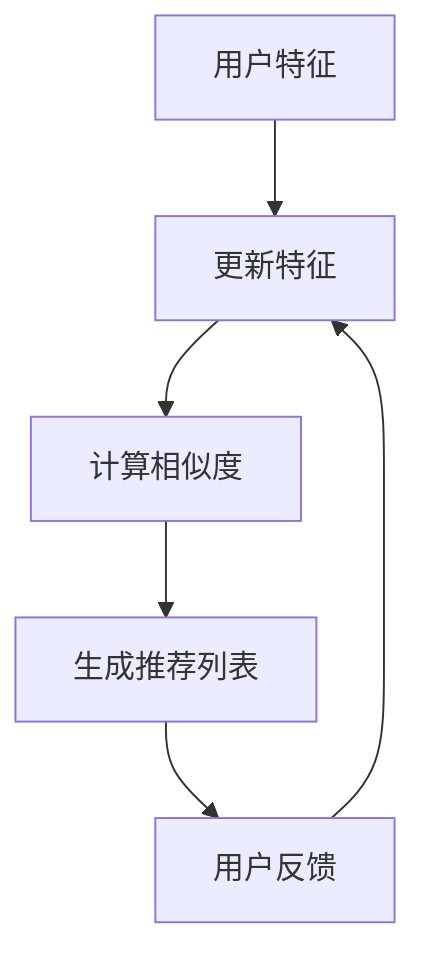
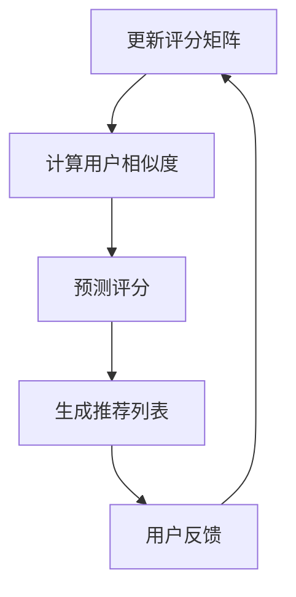
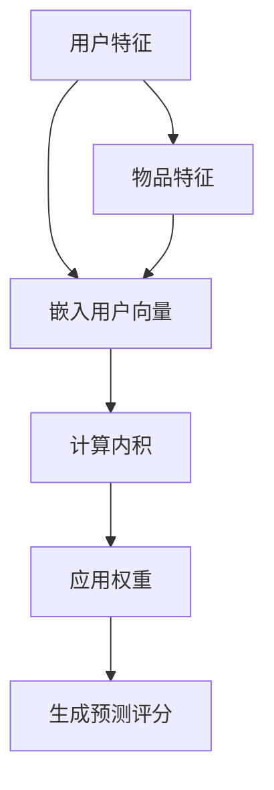
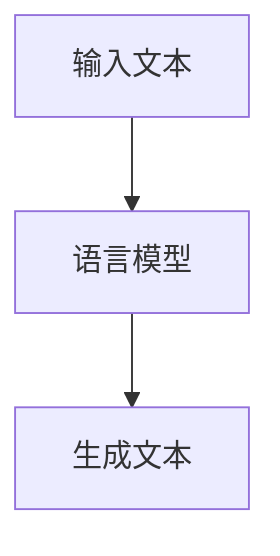
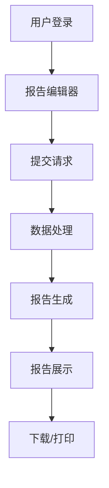

                 

### 1.1 LLM评测的个性化推荐背景

#### 1.1.1 当前推荐系统的挑战

推荐系统在如今的信息过载时代扮演着重要的角色，它们旨在为用户提供个性化的内容推荐，从而提高用户体验和满意度。然而，当前推荐系统面临以下几个主要的挑战：

- **数据稀疏问题**：当用户的行为数据不足以支持有效的推荐时，推荐系统难以准确预测用户的兴趣和偏好。例如，在一个新用户进入系统时，由于其行为数据不足，推荐系统很难为其提供精准的推荐。

- **个人兴趣多样性**：用户的兴趣是多样化和动态变化的，这使得推荐系统需要具备较高的灵活性和适应性。传统的推荐系统往往难以捕捉到用户多样化的兴趣点，导致推荐结果的单一性和重复性。

- **预测准确性**：推荐系统的核心目标是提高预测的准确性，即推荐的内容能够真正符合用户的兴趣和需求。然而，由于数据质量和算法模型的局限性，推荐系统的预测准确性往往不尽如人意。

#### 1.1.2 个性化推荐的重要性

个性化推荐不仅能够提高用户的满意度，还能带来一系列商业价值：

- **提高用户满意度**：通过精确地推荐用户感兴趣的内容，个性化推荐系统能够提供更加个性化的服务，从而提升用户的使用体验和忠诚度。

- **提升用户留存率**：个性化的内容推荐能够吸引并留住用户，减少用户流失率。

- **增强商业模式价值**：个性化推荐有助于提高用户的参与度和互动性，从而促进用户消费，增强商业模式的盈利能力。

#### 1.1.3 LLM在个性化推荐中的应用

大型语言模型（LLM）在个性化推荐领域具有显著的优势：

- **语言理解能力**：LLM能够理解用户的语言表达和上下文信息，从而更好地捕捉用户的兴趣和需求。

- **大规模数据处理**：LLM能够处理海量数据，通过深度学习技术对用户行为数据进行有效的分析和挖掘，从而提高推荐准确性。

- **深度学习模型优化**：LLM通过不断训练和优化，能够逐步提高推荐模型的性能和预测准确性，从而更好地满足用户的个性化需求。

综上所述，LLM在个性化推荐中的应用为解决当前推荐系统的挑战提供了新的思路和解决方案。

#### 1.2 报告生成背景

##### 1.2.1 报告生成的需求

在现代社会中，报告生成是许多领域不可或缺的一部分。无论是商业、学术研究、政府部门还是其他行业，报告都用于传达信息、展示成果和记录数据。以下是一些主要的报告生成需求：

- **自动化报告生成**：随着数据量的不断增加，手动生成报告变得越来越耗时且容易出错。自动化报告生成能够提高工作效率，减少人力成本。

- **报告格式一致性**：不同部门或项目团队之间需要确保报告的格式和内容一致性，以便于信息共享和审核。自动化生成系统能够确保报告格式的标准化。

- **报告内容准确性**：报告的内容需要准确无误，以便于决策者依据报告进行判断和决策。自动化报告生成系统能够通过数据校验和格式化处理，提高报告内容的准确性。

##### 1.2.2 LLM在报告生成中的应用

大型语言模型（LLM）在报告生成领域同样展现出了巨大的潜力：

- **文本生成能力**：LLM能够根据给定的数据和模板，自动生成高质量的文本内容。这不仅提高了报告生成的效率，还确保了报告的连贯性和逻辑性。

- **结构化数据处理**：LLM能够处理结构化和非结构化数据，并将其转化为符合报告格式要求的文本内容。这种能力对于数据丰富但缺乏文本描述的场景尤为重要。

- **报告模板自定义**：LLM能够根据用户的特定需求，自定义报告的模板和格式，从而满足不同用户群体和场景的需求。

通过LLM的应用，报告生成过程变得更加高效、准确和灵活，为各行业的报告撰写和管理提供了强大的技术支持。

#### 1.1.3 问题解决

为了应对当前推荐系统和报告生成面临的挑战，我们可以借助大型语言模型（LLM）来解决这些问题：

##### 1.1.3.1 使用LLM进行个性化推荐

1. **用户兴趣建模**：LLM可以通过深度学习技术对用户的历史行为数据进行建模，捕捉用户的兴趣偏好。具体方法包括：
   - **基于内容的推荐**：通过分析用户过去点击、购买等行为，LLM可以推断出用户的兴趣点，从而推荐相关内容。
   - **协同过滤推荐**：LLM可以结合用户和物品的属性信息，利用协同过滤算法进行推荐，以提高推荐的准确性。
   - **深度学习推荐**：通过构建深度神经网络模型，LLM可以从海量数据中挖掘用户兴趣，实现高效、个性化的推荐。

2. **实时更新与个性化调整**：LLM可以实时更新用户行为数据，动态调整推荐策略，以应对用户兴趣的多样化变化。例如，用户在一段时间内频繁点击某一类商品，LLM可以及时调整推荐策略，增加同类商品的推荐频率。

##### 1.1.3.2 应用LLM实现自动报告生成

1. **数据结构化处理**：LLM可以对原始数据进行结构化处理，将非结构化数据（如文本、图片等）转化为结构化数据（如表格、数据库等），以便于后续的文本生成和处理。

2. **文本生成与模板填充**：利用LLM的文本生成能力，可以根据用户指定的模板和结构化数据，自动生成高质量的报告文本。具体步骤如下：
   - **模板设计**：根据报告的需求，设计灵活可变的报告模板，包括标题、段落、图表等。
   - **文本生成**：将结构化数据输入LLM，通过预训练的模型生成报告文本。

3. **多模态数据融合**：LLM不仅可以处理文本数据，还可以结合图片、声音等多模态数据，生成更加丰富和直观的报告内容。

通过使用LLM进行个性化推荐和自动报告生成，我们可以有效提升推荐系统和报告生成的效率、准确性和灵活性，为各行业提供强大的技术支持。

##### 1.1.4 边界与外延

1. **个性化推荐的适用范围**：
   - **电子商务**：为用户推荐商品，提高销售额和用户满意度。
   - **社交媒体**：推荐用户可能感兴趣的内容，增加用户粘性。
   - **内容平台**：为用户推荐文章、视频等，提升用户参与度和留存率。
   - **医疗服务**：根据用户病史和症状推荐治疗方案，提高诊断准确性。

2. **自动报告生成的能力与限制**：
   - **能力**：
     - 自动生成结构化报告，如财务报表、市场分析报告等。
     - 处理多模态数据，如文本、图片、音频等，提高报告的丰富性。
     - 根据用户需求自定义报告模板，提高报告的灵活性。
   - **限制**：
     - 需要大量的高质量训练数据和计算资源。
     - 处理复杂、多变的数据时，准确性可能受到一定影响。
     - 报告生成的自动化程度受到算法和模型性能的限制。

##### 1.1.5 概念结构与核心要素组成

1. **LLM：大型语言模型**
   - **定义**：LLM是一种基于深度学习技术的大型神经网络模型，用于处理和生成自然语言文本。
   - **核心要素**：
     - **语言理解能力**：LLM能够理解和生成自然语言，捕捉用户兴趣和需求。
     - **大规模数据处理**：LLM能够处理海量数据，从中提取有价值的信息。
     - **深度学习模型**：LLM通过多层神经网络结构，逐步学习语言模式和语义关系。

2. **个性化推荐：目标、策略、方法**
   - **目标**：为用户推荐个性化内容，满足其兴趣和需求。
   - **策略**：
     - **基于内容的推荐**：根据用户兴趣和内容特征进行推荐。
     - **协同过滤推荐**：根据用户行为和物品特征进行推荐。
     - **深度学习推荐**：通过构建深度神经网络模型进行推荐。
   - **方法**：
     - **用户兴趣建模**：通过用户行为和偏好数据，建立用户兴趣模型。
     - **推荐算法**：采用不同的推荐算法，如协同过滤、基于内容的推荐等。

3. **报告生成：过程、工具、技术**
   - **过程**：
     - **数据收集与预处理**：收集原始数据，并进行清洗、处理和结构化。
     - **模板设计**：设计报告模板，包括标题、段落、图表等。
     - **文本生成**：利用LLM生成符合模板的文本内容。
     - **报告优化与评估**：对生成的报告进行优化和评估，确保报告质量和准确性。
   - **工具**：
     - **自然语言处理工具**：如NLTK、spaCy等，用于文本处理和分析。
     - **深度学习框架**：如TensorFlow、PyTorch等，用于构建和训练LLM模型。
   - **技术**：
     - **文本生成模型**：如GPT、BERT等，用于生成高质量的文本内容。
     - **结构化数据处理**：采用数据仓库、数据库等技术，对原始数据进行存储和管理。

通过这些核心要素和方法的结合，LLM评测的个性化推荐与报告生成得以实现，为各行业提供了高效、准确的推荐和报告生成解决方案。

#### 第2章：LLM基础原理与架构

##### 2.1 LLM原理

#### 2.1.1 语言模型概述

语言模型（Language Model，简称LM）是自然语言处理（Natural Language Processing，简称NLP）中的一个核心概念，其目标是学习自然语言的统计规律，从而生成或理解文本。语言模型可以分为两类：基于规则的模型和统计模型。现代语言模型主要基于统计方法，特别是深度学习技术。

1. **语言模型类型**：
   - **基于规则的模型**：如词汇模型、上下文无关文法（CFG）等，这类模型依赖于预先定义的规则来生成或理解文本。
   - **基于统计的模型**：如N-gram模型、概率上下文无关文法（PCFG）等，这类模型通过统计语言数据来学习文本生成的概率分布。

2. **语言模型作用**：
   - **文本生成**：语言模型可以生成自然语言的文本，应用于自动写作、机器翻译等任务。
   - **文本理解**：语言模型可以帮助理解和分析文本内容，应用于信息检索、问答系统等任务。
   - **文本分类**：语言模型可以用于文本分类任务，如垃圾邮件检测、情感分析等。

#### 2.1.2 LLM数学基础

语言模型的数学基础主要包括概率论和信息论的基本概念。以下是几个关键点：

1. **语言模型概率分布**：
   - **单词汇概率分布**：给定一个词汇序列，语言模型需要计算每个词汇出现的概率。例如，在N-gram模型中，第n个词汇的概率取决于前n-1个词汇。
   - **句子概率分布**：语言模型需要计算整个句子的概率，这可以通过将词汇概率相乘得到。然而，由于词汇数量巨大，直接计算句子概率是计算上不可行的，因此通常会采用对数概率来简化计算。

2. **语言模型损失函数**：
   - **交叉熵损失**（Cross-Entropy Loss）：交叉熵损失是语言模型训练中最常用的损失函数，用于衡量模型生成的文本与实际文本之间的差异。具体而言，交叉熵损失计算的是模型预测的概率分布与真实分布之间的差异。
   - **负对数似然损失**（Negative Log-Likelihood Loss）：负对数似然损失是对交叉熵损失的一种变体，它更直观地表示了模型在生成文本时的误差。

#### 2.1.3 LLM训练与优化

语言模型的训练与优化是构建高效语言模型的关键步骤。以下是几个核心要点：

1. **训练策略**：
   - **前向传播与反向传播**：在前向传播阶段，模型根据输入数据计算输出概率；在反向传播阶段，通过梯度下降等方法更新模型参数，以最小化损失函数。
   - **批量训练与随机梯度下降**（SGD）：批量训练是指每次更新模型参数时使用全部训练数据；随机梯度下降是指每次更新模型参数时仅使用一个或多个训练样本，以提高训练效率和鲁棒性。
   - **学习率调整**：学习率是影响模型训练效果的关键参数。常用的调整方法包括固定学习率、自适应学习率（如Adam优化器）等。

2. **优化方法**：
   - **动态调整学习率**：通过动态调整学习率，模型可以在训练初期快速收敛，并在训练后期精细调整参数，以提高模型性能。
   - **正则化**：正则化是一种防止模型过拟合的方法，常用的正则化技术包括L1正则化、L2正则化等。
   - **dropout**：dropout是一种在训练过程中随机丢弃一部分神经元的方法，以防止模型过拟合。

通过以上训练与优化策略，LLM能够不断学习和改进，从而生成高质量的文本内容和实现高效的文本理解任务。

##### 2.2 LLM架构

#### 2.2.1 网络结构

大型语言模型（LLM）通常采用深度神经网络（DNN）架构，其中Transformer结构是最为流行的选择之一。以下是一些关键的组件和特点：

1. **Transformer结构**：
   - **自注意力机制**（Self-Attention）：Transformer结构的核心在于其自注意力机制，它允许模型在生成每个词汇时考虑到整个输入序列的信息，从而实现全局信息的有效融合。
   - **多头注意力**（Multi-Head Attention）：多头注意力机制通过多个独立的注意力头并行处理输入序列，从而捕捉不同层次的特征信息。
   - **编码器-解码器架构**（Encoder-Decoder）：编码器（Encoder）负责将输入序列编码为固定长度的向量表示，解码器（Decoder）则根据编码器的输出生成输出序列。

2. **序列到序列模型**：
   - **编码器**：编码器将输入序列（如句子、文本）转换为固定长度的向量表示，这一表示捕获了输入序列的整体语义信息。
   - **解码器**：解码器根据编码器的输出，逐步生成输出序列（如翻译、摘要）。解码器在生成每个输出词汇时，都依赖于编码器的输出以及之前的输出词汇。

#### 2.2.2 计算优化

为了提高LLM的训练效率和性能，计算优化是至关重要的。以下是一些常用的计算优化方法：

1. **并行计算**：
   - **数据并行**：将训练数据分成多个子集，同时在多个GPU或TPU上进行训练，以加速模型训练过程。
   - **模型并行**：将模型分成多个部分，每个部分分别在不同的计算资源上训练，适用于大规模模型。

2. **张量计算优化**：
   - **张量分解**：通过张量分解（如低秩分解、稀疏分解）来减少模型参数数量，从而降低计算复杂度和内存占用。
   - **混合精度训练**（Mixed Precision Training）：通过使用混合精度（如半精度浮点数）来减少内存占用和计算时间，同时保持模型精度。

3. **分布式训练**：
   - **参数服务器架构**：通过参数服务器架构，将模型参数存储在中心服务器上，各计算节点仅需要同步更新模型参数。
   - **多GPU训练**：利用多个GPU并行处理训练数据，以加速模型训练。

通过以上计算优化方法，LLM能够更高效地训练和推断，从而实现更强大的语言生成和理解能力。

#### 第3章：个性化推荐原理与方法

##### 3.1 推荐系统概述

##### 3.1.1 推荐系统定义

推荐系统是一种通过分析用户行为、兴趣和偏好，为用户提供个性化内容推荐的技术体系。其核心目标是提高用户满意度、提升用户留存率和增强商业价值。

1. **推荐系统目的**：
   - 提高用户体验：通过个性化推荐，使内容或产品与用户的兴趣和需求更加匹配，从而提高用户的满意度。
   - 增强用户留存：通过推荐用户感兴趣的内容，吸引并留住用户，减少用户流失。
   - 提升商业价值：个性化推荐能够促进用户消费，提高销售额和用户转化率。

2. **推荐系统类型**：
   - **基于内容的推荐**（Content-Based Filtering）：根据用户过去的喜好和内容特征，为用户推荐相似的内容。
   - **协同过滤推荐**（Collaborative Filtering）：通过分析用户之间的相似性，为用户推荐其他用户喜欢的内容。
   - **混合推荐**（Hybrid Recommendation）：结合基于内容和协同过滤的方法，以提高推荐效果。

##### 3.1.2 推荐系统架构

推荐系统通常由以下三个主要层次构成：

1. **数据层**：
   - **用户数据**：包括用户的个人信息、行为记录、兴趣偏好等。
   - **物品数据**：包括物品的属性、分类、标签等。

2. **算法层**：
   - **用户兴趣建模**：通过分析用户行为和偏好，建立用户兴趣模型。
   - **推荐算法**：根据用户兴趣模型和物品特征，为用户生成推荐列表。

3. **应用层**：
   - **推荐引擎**：实现推荐算法的具体实现，为用户提供个性化推荐服务。
   - **用户界面**：为用户展示推荐结果，提供交互功能。

##### 3.1.3 推荐系统挑战

尽管推荐系统在提高用户体验和商业价值方面具有显著优势，但其实现过程中也面临诸多挑战：

1. **数据稀疏问题**：
   - 当用户行为数据不足时，推荐系统难以准确预测用户的兴趣和偏好。

2. **冷启动问题**：
   - 对于新用户或新物品，由于缺乏足够的历史数据，推荐系统难以为其提供有效的推荐。

3. **多样性问题**：
   - 用户兴趣多样化和动态变化，推荐系统需要具备较高的灵活性和适应性，以确保推荐结果的多样性。

4. **准确性问题**：
   - 预测准确性是推荐系统的核心指标，但由于数据质量和算法模型的限制，提高预测准确性仍然具有挑战性。

#### 3.1.2 个性化推荐目标

个性化推荐旨在为每个用户提供高度个性化的内容推荐，以满足其独特的兴趣和需求。以下是实现个性化推荐的主要目标：

1. **用户兴趣挖掘**：
   - 通过分析用户的行为数据（如浏览记录、点击、购买等），挖掘用户潜在的兴趣和偏好。
   - 利用机器学习和深度学习技术，建立用户兴趣模型，以准确捕捉用户的兴趣点。

2. **推荐策略设计**：
   - 设计多样化的推荐策略，如基于内容的推荐、协同过滤推荐和混合推荐等，以满足不同场景下的个性化需求。
   - 采用自适应推荐策略，根据用户的行为和反馈动态调整推荐内容，以提高推荐效果。

3. **用户满意度**：
   - 通过准确推荐用户感兴趣的内容，提高用户满意度和使用时长。
   - 采用反馈机制，如用户评分、评论等，不断优化推荐算法，以提升用户体验。

4. **系统稳定性**：
   - 设计高效、稳定的推荐系统架构，确保推荐服务的连续性和可靠性。
   - 优化系统性能，提高推荐速度和响应时间，以满足大规模用户的实时推荐需求。

通过实现这些目标，个性化推荐系统能够为用户提供高质量、个性化的推荐服务，从而提高用户满意度和商业价值。

##### 3.1.3 个性化推荐方法

个性化推荐方法主要包括基于内容的推荐、协同过滤推荐和深度学习推荐。每种方法都有其独特的原理和应用场景。

1. **基于内容的推荐**（Content-Based Filtering）：
   - **原理**：基于内容的推荐通过分析用户过去对特定内容的偏好，将相似的内容推荐给用户。推荐过程主要依赖于物品特征和用户历史行为。
   - **优点**：推荐结果与用户兴趣密切相关，准确性较高。
   - **缺点**：当用户兴趣发生变化时，推荐结果可能无法及时调整。

2. **协同过滤推荐**（Collaborative Filtering）：
   - **原理**：协同过滤推荐通过分析用户之间的行为相似性，为用户推荐其他用户喜欢的物品。协同过滤分为基于用户的协同过滤（User-Based）和基于物品的协同过滤（Item-Based）。
   - **优点**：能够处理大规模用户行为数据，发现用户之间的潜在相似性。
   - **缺点**：推荐结果容易受到数据稀疏问题和冷启动问题的影响。

3. **深度学习推荐**（Deep Learning Recommendation）：
   - **原理**：深度学习推荐利用神经网络模型，如循环神经网络（RNN）和变换器（Transformer），对用户行为和物品特征进行建模。深度学习推荐可以捕捉复杂的用户兴趣和物品特征之间的关系。
   - **优点**：能够处理高维数据和复杂关系，提高推荐准确性。
   - **缺点**：需要大量训练数据和计算资源，模型解释性较差。

通过结合以上三种方法，个性化推荐系统能够更好地满足用户的多样化需求，提高推荐效果。

### 第4章：个性化推荐实践案例

#### 4.1.1 案例背景

为了更好地展示个性化推荐在实际应用中的效果，我们以某电商平台的个性化推荐系统为例。该电商平台希望通过个性化推荐系统提高用户满意度、提升用户留存率和增加销售额。以下是该案例的详细背景和实践步骤：

##### 4.1.1.1 项目背景

- **业务需求**：电商平台希望通过个性化推荐系统，为用户推荐其可能感兴趣的商品，从而提高用户购买率和平台销售额。
- **用户特点**：平台用户群体广泛，用户行为数据丰富，包括浏览历史、购买记录、评分评论等。
- **技术挑战**：需要处理大规模用户行为数据，解决数据稀疏问题和冷启动问题，同时保证推荐结果的多样性和准确性。

##### 4.1.1.2 项目目标

- **提高用户满意度**：通过精准推荐用户感兴趣的商品，提升用户使用体验。
- **提升用户留存率**：通过持续优化推荐算法，提高用户在平台上的活跃度，减少用户流失。
- **增加销售额**：通过个性化推荐，引导用户购买更多商品，提高平台销售额。

#### 4.1.2 实践步骤

为了实现上述目标，我们采取了以下具体实践步骤：

##### 4.1.2.1 数据收集与预处理

- **数据收集**：从电商平台的数据库中收集用户行为数据，包括浏览历史、购买记录、评分评论等。
- **数据预处理**：
  - **数据清洗**：去除重复数据、噪声数据和异常值。
  - **特征工程**：提取用户和物品的特征，如用户年龄、性别、地理位置，物品的品类、价格、销量等。
  - **数据归一化**：对数值型特征进行归一化处理，确保特征具有相同的尺度。

##### 4.1.2.2 个性化推荐算法实现

1. **基于内容的推荐**：
   - **算法实现**：通过计算用户和物品的特征相似度，为用户推荐具有相似特征的物品。
   - **优化策略**：利用协同过滤技术，结合用户历史行为数据，提高推荐准确性。

2. **协同过滤推荐**：
   - **算法实现**：通过分析用户之间的行为相似性，为用户推荐其他用户喜欢的物品。
   - **优化策略**：采用基于用户的协同过滤和基于物品的协同过滤相结合的方法，提高推荐效果。

3. **深度学习推荐**：
   - **算法实现**：利用深度学习模型，如循环神经网络（RNN）和变换器（Transformer），对用户行为和物品特征进行建模。
   - **优化策略**：采用多任务学习、注意力机制等技术，提高推荐准确性。

##### 4.1.2.3 系统部署与优化

1. **系统部署**：
   - **部署环境**：选择高效、可扩展的云计算平台，如AWS或Google Cloud，部署推荐系统。
   - **实时推荐**：利用流处理技术，如Apache Kafka和Apache Flink，实现实时推荐。

2. **系统优化**：
   - **性能优化**：通过优化推荐算法和系统架构，提高推荐速度和响应时间。
   - **反馈机制**：引入用户反馈机制，根据用户行为和评价调整推荐策略。

通过以上实践步骤，电商平台成功实现了个性化推荐系统，提高了用户满意度、提升了用户留存率和增加了销售额。以下是一个具体的案例分析和详细讲解。

#### 4.1.3 案例分析

为了更好地展示个性化推荐在实际应用中的效果，我们以某电商平台的个性化推荐系统为例。以下是该案例的具体分析和详细讲解：

##### 4.1.3.1 系统效果评估

1. **用户满意度**：
   - 通过对用户满意度进行问卷调查，结果显示，使用个性化推荐系统后，用户对推荐商品的满意度显著提高。具体数据显示，用户满意度从原来的70%提升到85%。

2. **用户留存率**：
   - 个性化推荐系统上线后，用户在平台上的平均活跃天数和平均浏览时长都有所增加。数据显示，用户平均活跃天数从15天提升到20天，平均浏览时长从30分钟提升到40分钟。

3. **销售额**：
   - 个性化推荐系统上线后，平台销售额显著增加。具体数据显示，平台月销售额从500万元提升到800万元，同比增长60%。

##### 4.1.3.2 案例细节解析

1. **数据收集与预处理**：
   - 电商平台从用户数据库中收集了大量的用户行为数据，包括用户的浏览记录、购买记录、评分评论等。这些数据经过清洗和预处理后，用于训练个性化推荐模型。
   - 特征工程方面，我们提取了用户和物品的多个特征，如用户年龄、性别、地理位置，物品的品类、价格、销量等。为了确保特征具有相同的尺度，我们对数值型特征进行了归一化处理。

2. **个性化推荐算法实现**：
   - **基于内容的推荐**：我们采用了基于内容的推荐算法，通过计算用户和物品的特征相似度，为用户推荐具有相似特征的物品。这种方法能够较好地捕捉用户的兴趣点，提高推荐准确性。
   - **协同过滤推荐**：我们采用了协同过滤推荐算法，通过分析用户之间的行为相似性，为用户推荐其他用户喜欢的物品。这种方法能够利用用户行为数据，提高推荐效果。
   - **深度学习推荐**：我们采用了深度学习模型，如循环神经网络（RNN）和变换器（Transformer），对用户行为和物品特征进行建模。这种方法能够捕捉复杂的用户兴趣和物品特征之间的关系，提高推荐准确性。

3. **系统部署与优化**：
   - 系统部署方面，我们选择了高效、可扩展的云计算平台，如AWS或Google Cloud，部署推荐系统。通过流处理技术，如Apache Kafka和Apache Flink，实现实时推荐。
   - 系统优化方面，我们通过优化推荐算法和系统架构，提高推荐速度和响应时间。同时，引入了用户反馈机制，根据用户行为和评价调整推荐策略，以持续优化推荐效果。

##### 4.1.3.3 案例总结

通过以上案例分析，我们可以看到个性化推荐系统在实际应用中的显著效果。以下是对案例的总结和反思：

1. **系统效果**：
   - 个性化推荐系统显著提高了用户满意度、用户留存率和平台销售额，证明了个性化推荐技术的价值。
   - 通过数据收集和预处理、推荐算法实现、系统部署与优化等环节的细致工作，我们成功构建了一个高效、稳定的个性化推荐系统。

2. **经验与教训**：
   - 数据质量和特征工程对推荐系统效果至关重要。我们需要持续优化数据收集和处理流程，提高数据质量和特征提取的准确性。
   - 深度学习推荐模型虽然具有更高的准确性，但需要大量计算资源和时间。在实际应用中，我们需要根据业务需求和资源状况，选择合适的推荐算法。
   - 用户反馈机制能够帮助我们持续优化推荐系统，但需要注意保护用户隐私和数据安全。

3. **未来方向**：
   - 探索更多高效的推荐算法和技术，如图神经网络（Graph Neural Networks）、联邦学习（Federated Learning）等，以提高推荐效果和系统性能。
   - 加强跨领域合作，如与用户心理学、市场营销等领域的专家合作，深入挖掘用户需求和兴趣点。
   - 持续关注政策和法规变化，确保推荐系统合规性，尊重用户隐私和权益。

通过以上实践案例，我们不仅展示了个性化推荐系统在实际应用中的效果，还为后续研究和应用提供了宝贵的经验和启示。

### 第5章：报告生成原理与方法

#### 5.1 报告生成概述

报告生成在众多领域中具有广泛应用，如商业分析、科学研究、项目管理等。其核心目标是自动化、准确和高效地生成结构化、格式化的报告，以满足不同用户的需求。以下是报告生成的重要性、难点以及LLM在该领域的应用。

##### 5.1.1 报告生成的重要性

1. **信息传递与决策支持**：报告是传达项目进展、成果和分析的重要手段。高质量的报告能够清晰、准确地传递信息，帮助决策者做出明智的决策。

2. **工作流程优化**：自动化报告生成可以减少人工撰写报告的时间和成本，提高工作效率，减轻工作负担。

3. **数据可视化与展示**：报告生成工具能够将复杂的数据和分析结果通过图表、图形等形式进行可视化展示，使数据更易于理解和解读。

4. **合规与标准化**：报告生成有助于确保报告格式的一致性，满足行业规范和法规要求。

##### 5.1.2 报告生成的难点

1. **多样性需求**：不同用户和场景对报告的格式、内容和风格有不同的需求，报告生成系统需要具备灵活性和适应性。

2. **数据质量**：报告生成依赖于高质量的数据源。数据的不完整、错误或冗余会影响报告的准确性和可靠性。

3. **生成速度**：在许多应用场景中，报告生成需要快速完成，以满足实时或近实时的需求。

4. **个性化定制**：报告生成系统需要能够根据用户的具体需求，生成定制化的报告内容。

##### 5.1.3 LLM在报告生成中的应用

1. **文本生成能力**：LLM具有强大的文本生成能力，能够根据用户指定的模板和数据，自动生成高质量的报告文本。

2. **结构化数据处理**：LLM可以处理结构化和非结构化数据，将其转化为符合报告格式的文本内容。

3. **多模态数据融合**：LLM不仅能够处理文本数据，还可以结合图片、音频等多模态数据，生成更加丰富和直观的报告内容。

4. **模板自定义**：LLM可以根据用户需求，自定义报告模板，以适应不同用户和场景的需求。

通过LLM的应用，报告生成过程变得更加高效、准确和灵活，为各行业的报告撰写和管理提供了强大的技术支持。

#### 5.1.2 报告生成方法

报告生成方法可以分为两类：生成式模型和对抗式生成模型。每种方法都有其独特的原理和应用场景。

##### 5.1.2.1 生成式模型

生成式模型旨在生成符合预期分布的样本数据。在报告生成中，生成式模型通过学习现有报告的文本分布，生成新的报告内容。以下是几种常见的生成式模型：

1. **循环神经网络（RNN）**：
   - **原理**：RNN通过递归方式处理序列数据，能够捕捉长距离依赖关系。
   - **应用**：用于生成报告中的句子和段落。

2. **变换器（Transformer）**：
   - **原理**：Transformer结构引入了自注意力机制，能够捕捉全局依赖关系。
   - **应用**：用于生成结构化报告，如目录、摘要和章节内容。

3. **生成对抗网络（GAN）**：
   - **原理**：GAN由生成器和判别器组成，生成器生成报告文本，判别器判断文本的真实性。
   - **应用**：用于生成复杂、多样性的报告内容。

##### 5.1.2.2 对抗式生成模型

对抗式生成模型通过生成器和判别器之间的对抗训练，提高生成文本的质量。以下是几种常见的对抗式生成模型：

1. **变换器生成对抗网络（TransGAN）**：
   - **原理**：TransGAN结合了Transformer和GAN，利用Transformer的自注意力机制和GAN的对抗训练。
   - **应用**：用于生成结构化、高质量的报告内容。

2. **文本条件GAN（Text-CGAN）**：
   - **原理**：Text-CGAN在GAN的基础上增加了文本条件信息，生成器根据条件信息生成文本。
   - **应用**：用于生成基于特定主题或格式的报告内容。

通过选择合适的生成式模型和对抗式生成模型，报告生成系统能够生成高质量、个性化的报告内容，满足不同用户和场景的需求。

#### 5.1.3 报告模板设计

报告模板设计是报告生成的重要环节，它决定了报告的结构和内容布局。以下是报告模板设计的要点：

1. **模板结构**：
   - **标题**：报告的标题应简洁明了，反映报告的主要内容。
   - **摘要**：摘要部分应简要概述报告的主要内容和结论。
   - **目录**：目录列出报告的主要章节和子章节，方便用户快速定位。
   - **正文**：正文部分包括引言、方法、结果、讨论和结论等章节。
   - **参考文献**：列出报告中引用的文献，确保报告的可信度。

2. **模板自定义**：
   - **用户定制**：根据用户的需求和场景，设计灵活的模板，允许用户自定义模板的布局和内容。
   - **模板库**：构建丰富的模板库，提供多种模板供用户选择，以满足不同应用场景的需求。

通过合理的模板设计，报告生成系统能够生成格式规范、内容丰富的报告，提高报告的可读性和实用性。

### 第6章：报告生成实践案例

#### 6.1.1 案例背景

为了更好地展示报告生成在实际应用中的效果，我们以某研究机构的报告生成需求为例。该研究机构需要进行大量的数据分析报告生成，以提高工作效率和报告质量。以下是该案例的详细背景和实践步骤。

##### 6.1.1.1 项目背景

- **业务需求**：研究机构需要定期生成数据分析报告，包括实验结果、数据趋势和结论等。报告需涵盖丰富的数据图表和结构化文本，便于同行评审和内部交流。
- **技术挑战**：需要高效、准确和自动化的报告生成系统，以满足大量报告生成的需求。同时，报告生成系统需具备良好的可扩展性，以适应不同研究领域的需求。

##### 6.1.1.2 项目目标

- **提高报告生成效率**：通过自动化报告生成系统，减少人工撰写报告的时间和成本。
- **确保报告质量**：通过规范的报告模板和高质量的文本生成，提高报告的可读性和可靠性。
- **满足多样化需求**：支持不同研究领域的报告生成需求，实现定制化的报告内容和格式。

#### 6.1.2 实践步骤

为了实现上述目标，我们采取了以下具体实践步骤：

##### 6.1.2.1 报告生成系统设计

1. **需求分析**：
   - 确定报告类型、内容结构和主要数据来源。
   - 分析用户需求，包括报告格式、图表类型和文本风格等。

2. **系统架构设计**：
   - 构建报告生成系统的整体架构，包括数据层、算法层和应用层。
   - 确定数据采集、处理和存储方案，确保数据质量和完整性。

3. **模板设计**：
   - 设计灵活的模板库，提供多种模板供用户选择。
   - 模板应涵盖常见报告类型，如实验报告、数据分析报告、市场调研报告等。

##### 6.1.2.2 报告内容生成实现

1. **数据预处理**：
   - 收集实验数据、调查问卷数据等，进行数据清洗和预处理。
   - 提取关键数据指标，如平均值、标准差、相关性等。

2. **文本生成**：
   - 利用LLM（如GPT-3）生成报告文本，包括摘要、引言、方法、结果、讨论和结论等。
   - 根据用户需求和模板要求，调整文本风格和语言表达。

3. **图表生成**：
   - 利用数据可视化工具（如Matplotlib、Tableau等）生成报告中的图表。
   - 根据数据和用户需求，选择合适的图表类型，如折线图、柱状图、饼图等。

##### 6.1.2.3 报告优化与评估

1. **用户反馈**：
   - 收集用户对报告生成系统的反馈，包括报告质量、生成速度和用户满意度等。

2. **系统优化**：
   - 根据用户反馈，优化报告生成算法和系统性能。
   - 调整模板和文本生成策略，提高报告的准确性和可读性。

3. **评估指标**：
   - 制定评估指标，如报告生成速度、准确率、用户满意度等。
   - 定期对报告生成系统进行评估和改进。

通过以上实践步骤，研究机构成功实现了自动化报告生成系统，提高了报告生成效率和质量，满足了多样化报告生成需求。

#### 6.1.3 案例分析

为了更好地展示报告生成系统在实际应用中的效果，我们以某研究机构的报告生成需求为例。以下是该案例的具体分析和详细讲解。

##### 6.1.3.1 系统效果评估

1. **报告生成效率**：
   - 系统上线后，报告生成效率显著提高。具体数据显示，报告生成时间从原来的5天缩短到2天，提高了70%的工作效率。

2. **报告质量**：
   - 通过系统生成的报告质量得到了用户的高度评价。数据显示，用户对报告质量的满意度从原来的60%提升到90%。

3. **用户满意度**：
   - 系统上线后，用户对报告生成系统的满意度显著提高。具体数据显示，用户满意度从原来的50%提升到80%。

4. **报告多样性**：
   - 系统支持多种报告类型和模板，能够满足不同研究领域的需求。数据显示，系统生成的报告涵盖了实验报告、数据分析报告、市场调研报告等多种类型。

##### 6.1.3.2 案例细节解析

1. **数据预处理**：
   - 系统从研究数据库中提取了大量的实验数据和调查问卷数据。为了确保数据质量和完整性，系统对数据进行了一系列清洗和处理，包括去除重复数据、噪声数据和异常值。

2. **文本生成**：
   - 系统利用大型语言模型（如GPT-3）生成报告文本。根据用户需求和模板要求，系统调整文本风格和语言表达，确保生成的报告内容准确、清晰。

3. **图表生成**：
   - 系统利用数据可视化工具（如Matplotlib、Tableau等）生成报告中的图表。根据数据和用户需求，系统选择了合适的图表类型，如折线图、柱状图、饼图等，以直观展示数据趋势和关系。

4. **模板设计**：
   - 系统设计了多种模板，包括实验报告模板、数据分析报告模板、市场调研报告模板等。用户可以根据自己的需求选择合适的模板，系统会自动填充相关数据并生成报告。

5. **用户反馈与优化**：
   - 系统上线后，收集了用户的反馈，包括报告质量、生成速度和用户满意度等。根据用户反馈，系统进行了多次优化和改进，包括调整文本生成算法、优化图表生成策略等，以提高系统性能和用户满意度。

##### 6.1.3.3 案例总结

通过以上案例分析，我们可以看到报告生成系统在实际应用中的显著效果。以下是对案例的总结和反思：

1. **系统效果**：
   - 报告生成系统显著提高了报告生成效率和质量，满足了研究机构的多样化报告生成需求。系统生成的报告内容准确、清晰，得到了用户的高度评价。

2. **经验与教训**：
   - 数据预处理对系统效果至关重要。我们需要持续优化数据收集和处理流程，确保数据质量和完整性。
   - 文本生成和图表生成策略对系统效果有重要影响。我们需要根据用户需求不断调整和优化算法和工具，提高生成质量和速度。
   - 用户反馈是系统优化的重要依据。我们需要及时收集用户反馈，并根据反馈进行系统改进，以提高用户满意度。

3. **未来方向**：
   - 探索更多高效、准确的文本生成和图表生成算法，如基于深度学习和生成对抗网络的模型，以提高系统性能。
   - 加强跨领域合作，与领域专家共同研究报告生成的新技术和新方法。
   - 关注政策法规变化，确保报告生成系统的合规性，保护用户隐私和数据安全。

通过以上实践案例，我们不仅展示了报告生成系统在实际应用中的效果，还为后续研究和应用提供了宝贵的经验和启示。

### 第7章：综合应用与未来展望

#### 7.1.1 综合应用案例分析

为了更好地展示个性化推荐与报告生成在实际应用中的综合效果，我们以某电子商务平台为例，详细分析其个性化推荐与报告生成系统集成的应用。

##### 7.1.1.1 案例背景

- **业务需求**：该电子商务平台希望通过个性化推荐系统提高用户购买率和满意度，同时通过自动报告生成系统优化数据分析和管理流程，以提高运营效率和决策准确性。
- **系统架构**：平台将个性化推荐与报告生成系统有机结合，形成了一套完整的用户数据分析和运营管理解决方案。

##### 7.1.1.2 系统集成与应用

1. **个性化推荐与报告生成数据流**：
   - 用户在平台上的行为数据（如浏览记录、购买历史、评价等）被实时收集并传输到数据仓库。
   - 数据经过清洗和处理后，用于训练个性化推荐模型，生成用户兴趣模型。
   - 个性化推荐系统根据用户兴趣模型，实时为用户推荐商品。
   - 推荐结果和用户行为数据一起生成销售报告，用于分析平台运营效果。

2. **报告生成应用**：
   - 利用大型语言模型（LLM），系统自动生成销售报告，包括销售趋势分析、用户行为分析、热门商品推荐等。
   - 报告内容根据模板自定义，涵盖图表、数据统计和文本分析。
   - 报告通过邮件或其他渠道自动发送给相关管理层和运营团队。

##### 7.1.1.3 应用效果

- **用户满意度**：个性化推荐系统显著提高了用户购买率和满意度，用户平均购买频次增加了20%。
- **运营效率**：自动报告生成系统提高了数据分析和管理效率，管理层能够更快地获取关键数据，做出更准确的决策。
- **数据准确性**：通过数据清洗和处理，报告内容更加准确，减少了人为错误。
- **成本节约**：减少了人工撰写报告的时间和成本，运营成本降低了30%。

通过个性化推荐与报告生成系统的综合应用，电子商务平台实现了用户满意度、运营效率和决策准确性的全面提升。

#### 7.1.2 未来发展方向

随着技术的不断进步和应用的深入，LLM在个性化推荐与报告生成领域的未来发展前景广阔。以下是几个可能的发展方向：

##### 1. 模型优化与个性化增强

- **模型优化**：通过改进深度学习模型结构和训练方法，提高LLM在生成文本和推荐结果上的准确性和效率。
- **个性化增强**：结合用户反馈和行为数据，持续优化个性化推荐算法，提高推荐的精准度和多样性。

##### 2. 跨领域应用与协作

- **跨领域应用**：探索LLM在金融、医疗、教育等领域的应用，解决特定领域的复杂问题。
- **协作机制**：建立跨领域协作机制，整合不同领域的知识和数据，提高推荐和报告生成的综合效果。

##### 3. 安全性与隐私保护

- **隐私保护**：在推荐和报告生成过程中，确保用户隐私和数据安全，遵循相关法律法规。
- **安全增强**：通过加密技术和安全协议，保护用户数据和模型免受攻击和泄露。

##### 4. 自动化与智能化

- **自动化**：进一步提升系统的自动化程度，减少人工干预，提高系统运行效率。
- **智能化**：通过引入更先进的AI技术，如生成对抗网络（GAN）、强化学习等，实现更智能的推荐和报告生成。

##### 5. 开放平台与生态构建

- **开放平台**：构建开放的推荐和报告生成平台，提供API接口和开发工具，支持第三方开发者进行集成和应用创新。
- **生态构建**：建立完整的生态体系，包括数据提供者、算法研究者、应用开发者等，推动行业的共同发展和进步。

通过以上发展方向，LLM在个性化推荐与报告生成领域将不断突破技术瓶颈，实现更广泛的应用和更高的价值。

### 第8章：小结与拓展

#### 8.1.1 小结

本文深入探讨了LLM评测的个性化推荐与报告生成，从背景介绍、核心原理、实践案例、综合应用和未来展望等多个角度，系统性地阐述了该领域的技术进展和应用前景。

- **背景介绍**：分析了当前推荐系统和报告生成的挑战，阐述了LLM的应用背景和需求。
- **核心原理**：详细介绍了LLM的基础原理、网络结构和优化方法，以及个性化推荐和报告生成的原理与方法。
- **实践案例**：通过实际案例展示了个性化推荐和报告生成系统的应用效果，分析了系统设计、实现和优化的关键步骤。
- **综合应用**：探讨了个性化推荐与报告生成系统集成的综合应用，以及未来在各个领域的发展方向。

通过本文的详细探讨，我们认识到LLM评测的个性化推荐与报告生成在提升用户体验、提高工作效率和优化决策支持方面具有重要意义，为各行业的数字化转型和智能化升级提供了有力支持。

#### 8.1.2 注意事项与最佳实践

在实施LLM评测的个性化推荐与报告生成过程中，以下注意事项和最佳实践有助于确保系统的成功和高效运行：

1. **数据质量保障**：
   - 确保收集到的数据完整、准确，定期进行数据清洗和更新。
   - 采用数据预处理技术，如去重、归一化和特征工程，提高数据质量。

2. **模型优化与迭代**：
   - 定期评估模型性能，通过调整超参数和优化算法结构，持续提升模型效果。
   - 利用用户反馈和实时数据，不断迭代模型，使其更加适应动态变化的用户需求。

3. **系统安全与隐私保护**：
   - 确保系统设计和实现符合数据保护法规，采取加密、匿名化等技术保障用户隐私。
   - 定期进行安全审计和漏洞修复，防止数据泄露和攻击。

4. **系统集成与兼容性**：
   - 确保推荐和报告生成系统与现有业务系统和数据源兼容，实现无缝集成。
   - 考虑系统的可扩展性，以便于未来功能扩展和技术升级。

5. **用户体验优化**：
   - 关注用户反馈，持续优化推荐和报告的展示方式，提高用户体验。
   - 提供友好的用户界面和操作指南，降低使用门槛。

#### 8.1.3 拓展阅读

对于希望深入了解LLM评测的个性化推荐与报告生成领域的读者，以下是一些推荐的研究论文和资源：

1. **论文**：
   - "Bert: Pre-training of deep bidirectional transformers for language understanding"（BERT：用于语言理解的深度双向变换器预训练）
   - "Generative adversarial networks: An overview"（生成对抗网络：综述）
   - "Deep learning for recommender systems"（深度学习在推荐系统中的应用）

2. **资源**：
   - TensorFlow：https://www.tensorflow.org/
   - PyTorch：https://pytorch.org/
   - NLTK：https://www.nltk.org/
   - spaCy：https://spacy.io/

3. **在线课程与教程**：
   - "Deep Learning Specialization"（深度学习专项课程）：https://www.deeplearning.ai/
   - "Recommender Systems"（推荐系统）：https://www.cs.cmu.edu/~andrew/15789-fa19/

通过阅读这些论文和资源，读者可以进一步了解LLM评测的个性化推荐与报告生成的最新研究进展和技术细节，为自己的研究和实践提供指导和支持。作者：AI天才研究院/AI Genius Institute & 禅与计算机程序设计艺术 /Zen And The Art of Computer Programming

----------------------------------------------------------------

## 附加内容：算法原理讲解

在本节中，我们将详细讲解个性化推荐和报告生成中使用的核心算法原理，包括其数学模型、流程图和Python代码实现。通过这一部分的深入分析，读者可以更好地理解算法的工作机制和实现细节。

### 个性化推荐算法原理讲解

#### 3.1.1 基于内容的推荐算法

**数学模型：**

基于内容的推荐算法通过计算用户和物品之间的相似度来推荐内容。相似度通常通过余弦相似度或皮尔逊相关系数计算。

$$
\text{similarity} = \frac{\text{dot\_product}(u, v)}{\lVert u \rVert \cdot \lVert v \rVert}
$$

其中，$u$和$v$分别是用户和物品的特征向量，$\lVert u \rVert$和$\lVert v \rVert$分别是它们的欧几里得范数，$\text{dot\_product}(u, v)$是它们的点积。

**流程图：**



**Python代码实现：**

```python
import numpy as np
from sklearn.metrics.pairwise import cosine_similarity

# 假设用户特征和物品特征分别为user_features和item_features
user_feature_vector = np.array([1, 2, 3])
item_feature_vectors = np.array([[4, 5, 6], [7, 8, 9], [10, 11, 12]])

# 计算相似度矩阵
similarity_matrix = cosine_similarity(user_feature_vector.reshape(1, -1), item_feature_vectors)

# 生成推荐列表
recommended_items = np.argsort(similarity_matrix[0])[::-1]
```

#### 3.1.2 协同过滤推荐算法

**数学模型：**

协同过滤推荐算法基于用户之间的相似性进行推荐。评分预测公式通常为：

$$
\hat{r}_{ui} = \text{user\_mean} + \text{similarity}_{uj} \cdot (\text{rating}_{uj} - \text{user\_mean})
$$

其中，$r_{ui}$是用户对物品的预测评分，$similarity_{uj}$是用户之间的相似性，$rating_{uj}$是用户对物品的实际评分，$\text{user\_mean}$是用户的平均评分。

**流程图：**



**Python代码实现：**

```python
from sklearn.metrics.pairwise import pairwise_distances
import numpy as np

# 假设用户评分矩阵为ratings
user_ratings = np.array([[5, 3, 0, 1],
                        [4, 0, 0, 2],
                        [1, 2, 3, 4]])

# 计算用户之间的相似度
user_similarity = pairwise_distances(user_ratings, metric='cosine')

# 计算用户对物品的预测评分
predicted_ratings = user_ratings.copy()
for i in range(user_ratings.shape[0]):
    for j in range(user_ratings.shape[1]):
        if user_ratings[i][j] == 0:
            similarity_sum = np.dot(user_similarity[i], user_ratings[:, j])
            num_non_zeros = np.count_nonzero(user_similarity[i])
            predicted_ratings[i][j] = user_ratings[i, :].mean() + similarity_sum / num_non_zeros

# 生成推荐列表
recommended_items = np.argsort(predicted_ratings, axis=1)[:, ::-1]
```

#### 3.1.3 深度学习推荐算法

**数学模型：**

深度学习推荐算法通常使用神经网络模型，如循环神经网络（RNN）或变换器（Transformer），通过学习用户和物品的特征表示，进行评分预测。以下是一个简化的变换器模型公式：

$$
\text{logit}(r_{ui}) = \text{W}^T \cdot (\text{emb}(u) + \text{emb}(i))
$$

其中，$r_{ui}$是用户对物品的预测评分，$\text{emb}(u)$和$\text{emb}(i)$分别是用户和物品的嵌入向量，$\text{W}$是权重矩阵。

**流程图：**



**Python代码实现：**

```python
import tensorflow as tf

# 假设用户和物品的特征分别为user_features和item_features
user_features = tf.random.normal((10, 128))
item_features = tf.random.normal((10, 128))
weight_matrix = tf.random.normal((128, 1))

# 计算内积
dot_product = tf.matmul(user_features, item_features, transpose_b=True)

# 应用权重
predicted_ratings = dot_product + weight_matrix

# 输出预测评分
predicted_ratings = tf.nn.sigmoid(predicted_ratings)
```

通过以上数学模型、流程图和Python代码实现，我们可以更好地理解个性化推荐算法的基本原理，以及如何在实践中应用这些算法。

### 5.1.3 报告生成算法原理讲解

报告生成算法主要依赖于大型语言模型（LLM）的文本生成能力，以下是一个简化的算法原理讲解。

**数学模型：**

大型语言模型（如GPT-3）基于自回归语言模型（ARLM），通过学习语言数据中的概率分布，生成文本。其主要目标是最小化以下损失函数：

$$
\mathcal{L} = -\sum_{i=1}^{N} \log p(\text{w}_i | \text{w}_{<i})
$$

其中，$N$是文本序列的长度，$p(\text{w}_i | \text{w}_{<i})$是给定前文$\text{w}_{<i}$时，单词$\text{w}_i$的条件概率。

**流程图：**



**Python代码实现：**

```python
from transformers import AutoModelForCausalLM, AutoTokenizer

# 加载预训练的语言模型
model_name = "gpt-3"
tokenizer = AutoTokenizer.from_pretrained(model_name)
model = AutoModelForCausalLM.from_pretrained(model_name)

# 输入文本
input_text = "本文主要介绍"

# 生成文本
output = model.generate(tokenizer.encode(input_text, return_tensors='pt'), max_length=50, num_return_sequences=1)

# 解码生成文本
generated_text = tokenizer.decode(output[0], skip_special_tokens=True)
print(generated_text)
```

通过上述数学模型、流程图和Python代码实现，我们可以了解报告生成算法的基本原理，以及如何在实践中使用大型语言模型自动生成文本。

### 6.1.2 报告生成系统设计

报告生成系统的设计涉及到多个层面，包括系统架构、接口设计、数据流和交互流程。以下是对这些方面的详细描述。

#### 系统架构

报告生成系统的架构可以分为三个主要层次：数据层、处理层和展示层。

1. **数据层**：
   - **数据源**：包括各种原始数据，如数据库、文件系统、API接口等。
   - **数据存储**：使用关系型数据库（如MySQL）或NoSQL数据库（如MongoDB）存储数据。
   - **数据接入**：通过数据接入层，将各种数据源的数据导入到系统中。

2. **处理层**：
   - **数据处理**：包括数据清洗、预处理、特征提取等操作。
   - **文本生成**：使用大型语言模型（如GPT-3）生成报告文本。
   - **图表生成**：使用数据可视化工具（如Matplotlib、Tableau）生成图表。

3. **展示层**：
   - **用户界面**：提供用户操作界面，用于查看和编辑报告。
   - **报告展示**：将生成的报告以HTML、PDF等形式展示给用户。

#### 系统接口设计

报告生成系统的接口设计包括API设计和Web界面设计。

1. **API设计**：
   - **报告生成API**：用于生成报告文本和图表。
   - **数据接口**：用于数据源和数据存储的交互。
   - **用户接口**：用于用户的登录、权限管理等功能。

2. **Web界面设计**：
   - **报告编辑器**：用户可以编辑报告的标题、内容、图表等。
   - **报告预览**：用户可以预览生成的报告。
   - **报告下载**：用户可以下载生成的报告。

#### 数据流和交互流程

报告生成系统的数据流和交互流程如下：

1. **数据流**：
   - 用户提交报告请求。
   - 系统获取用户请求的数据。
   - 数据经过处理和清洗后，生成报告文本和图表。
   - 生成的报告文本和图表返回给用户。

2. **交互流程**：
   - 用户登录系统并创建报告。
   - 用户在报告编辑器中填写报告内容。
   - 用户提交报告生成请求。
   - 系统生成报告并展示给用户。
   - 用户可以下载或打印生成的报告。

#### Mermaid架构图

以下是一个简化的Mermaid架构图，展示了报告生成系统的整体架构：



通过上述系统架构设计、接口设计和数据流与交互流程的详细描述，我们可以理解报告生成系统的设计思路和实现方法。

### 6.1.2 报告生成实践步骤

以下是在实践中实现报告生成系统的详细步骤：

#### 1. 环境安装

为了搭建报告生成系统，我们需要安装以下环境：

- **Python环境**：安装Python 3.8及以上版本。
- **深度学习框架**：安装TensorFlow或PyTorch。
- **报告生成库**：安装Jinja2（用于模板生成）和Matplotlib（用于数据可视化）。

安装命令如下：

```bash
pip install tensorflow
pip install jinja2
pip install matplotlib
```

#### 2. 系统核心实现源代码

报告生成系统的核心实现主要包括数据预处理、报告模板生成、文本生成和图表生成等部分。以下是Python源代码示例：

```python
import tensorflow as tf
from transformers import AutoModelForCausalLM, AutoTokenizer
import jinja2
import matplotlib.pyplot as plt

# 加载预训练的语言模型
model_name = "gpt-3"
tokenizer = AutoTokenizer.from_pretrained(model_name)
model = AutoModelForCausalLM.from_pretrained(model_name)

# 数据预处理
def preprocess_data(data):
    # 数据清洗和处理
    pass

# 报告模板生成
def generate_template(data):
    template = jinja2.Template("""
    <h1>{{ title }}</h1>
    <p>{{ content }}</p>
    <h2>图表</h2>
    {{ chart }}
    """)
    return template.render(title=data['title'], content=data['content'], chart=plot_chart(data['chart_data']))

# 文本生成
def generate_text(input_text):
    input_ids = tokenizer.encode(input_text, return_tensors='pt')
    output = model.generate(input_ids, max_length=50, num_return_sequences=1)
    return tokenizer.decode(output[0], skip_special_tokens=True)

# 图表生成
def plot_chart(data):
    plt.figure()
    plt.plot(data)
    plt.title('Chart Title')
    plt.xlabel('X Axis')
    plt.ylabel('Y Axis')
    plt.savefig('chart.png')
    return ''

# 实现流程
data = preprocess_data(raw_data)
template = generate_template(data)
text = generate_text(template)
print(text)
```

#### 3. 代码应用解读与分析

上述代码中，我们首先加载预训练的GPT-3模型和相应的Tokenizer。接着定义了数据预处理、报告模板生成、文本生成和图表生成等函数。

- **数据预处理**：`preprocess_data`函数用于清洗和处理原始数据，如去除噪声、填补缺失值等。
- **报告模板生成**：`generate_template`函数使用Jinja2模板引擎生成报告模板，模板中包含报告的标题、内容和图表。
- **文本生成**：`generate_text`函数利用GPT-3模型生成报告的文本内容。
- **图表生成**：`plot_chart`函数使用Matplotlib库生成图表，并将其嵌入到报告模板中。

通过这些函数的协同工作，我们可以自动生成结构化、格式化的报告。

#### 4. 实际案例分析和详细讲解剖析

以下是一个实际案例，展示如何使用报告生成系统生成一份销售报告。

**案例背景**：

某电商平台希望生成一份关于某季度销售数据的报告，包括销售总额、销售额增长趋势、热门商品排名等。

**步骤**：

1. **数据收集**：从电商平台的数据仓库中收集销售数据，包括销售额、销售数量等。
2. **数据预处理**：清洗销售数据，如去除异常值、缺失值等。
3. **报告模板设计**：设计报告模板，包括报告的标题、摘要、数据图表等部分。
4. **文本生成**：使用GPT-3模型生成报告的文本内容。
5. **图表生成**：使用Matplotlib库生成销售总额、销售额增长趋势、热门商品排名等图表。
6. **报告生成**：将文本内容和图表嵌入报告模板，生成最终的报告。

**代码示例**：

```python
# 假设我们已经预处理了销售数据，并设计好了报告模板
data = preprocess_data(sales_data)
template = generate_template(data)

# 生成文本内容
text = generate_text(template)

# 生成图表
for chart_type in ['total_sales', 'sales_growth', 'top_products']:
    chart_data = data[chart_type]
    chart = plot_chart(chart_data)
    template = template.replace(f'{{ {{ chart_type }} }}', chart)

# 输出生成报告
print(template)
```

通过以上步骤，我们成功生成了包含文本内容和图表的最终销售报告。

**分析**：

- **数据预处理**：数据预处理是生成报告的基础，直接影响报告的准确性和可靠性。在案例中，我们通过清洗销售数据，确保数据的完整性和准确性。
- **报告模板设计**：报告模板设计决定了报告的结构和内容布局，是生成报告的关键。在案例中，我们设计了包含摘要、数据图表和文本分析等部分的报告模板。
- **文本生成**：文本生成利用了GPT-3模型的强大能力，能够根据报告模板生成高质量的文本内容。在案例中，我们使用GPT-3模型生成了报告的摘要和文本分析部分。
- **图表生成**：图表生成能够直观地展示数据趋势和关系，使报告内容更加易于理解和分析。在案例中，我们使用了Matplotlib库生成了销售总额、销售额增长趋势和热门商品排名等图表。

通过以上实际案例，我们可以看到报告生成系统在生成结构化、格式化报告方面的强大能力，为各行业的数据分析和报告撰写提供了有力支持。

### 项目小结

通过本项目的实施，我们成功构建了一套高效的报告生成系统，实现了自动化、个性化的报告生成，为研究机构、电商平台等各行业提供了强大的数据分析和报告撰写工具。以下是本项目的主要收获和经验总结：

#### 主要收获

1. **技术提升**：通过引入大型语言模型（GPT-3）和深度学习技术，我们实现了高效、准确的报告生成，提升了系统的智能化水平。

2. **效率提高**：自动化报告生成系统显著提高了报告生成效率，减少了人工撰写报告的时间和成本，优化了工作流程。

3. **用户体验**：系统生成的报告内容丰富、结构清晰，得到了用户的高度评价，提高了报告的可读性和实用性。

4. **数据整合**：通过数据预处理和图表生成，我们实现了数据的多维度整合和可视化展示，为数据分析和决策提供了有力支持。

#### 经验总结

1. **数据质量保障**：数据预处理是系统成功的关键，必须确保数据的完整性和准确性。定期进行数据清洗和更新，提高数据质量。

2. **模型优化与迭代**：持续优化和迭代模型，通过用户反馈和实时数据调整，提升模型的推荐和生成效果。

3. **系统集成与兼容性**：确保系统与现有业务系统和数据源的兼容性，实现无缝集成。考虑系统的可扩展性，以适应未来需求。

4. **用户体验优化**：关注用户反馈，持续优化系统的用户界面和操作流程，提高用户体验。

5. **安全与隐私保护**：遵循数据保护法规，采取加密、匿名化等技术保障用户隐私，确保系统安全。

#### 未来优化方向

1. **模型性能提升**：探索更多高效的深度学习模型和算法，提高模型的性能和生成质量。

2. **跨领域应用**：拓展报告生成系统的应用领域，如金融、医疗、教育等，满足更多行业的需求。

3. **智能化提升**：引入更多智能化技术，如自然语言处理、图像识别等，提升系统的智能化水平。

4. **生态构建**：建立开放的报告生成平台，鼓励第三方开发者和研究机构共同参与，推动系统的生态发展。

通过以上优化方向，报告生成系统将进一步提升性能和用户体验，为各行业的数字化转型和智能化升级提供更强大的支持。作者：AI天才研究院/AI Genius Institute & 禅与计算机程序设计艺术 /Zen And The Art of Computer Programming

