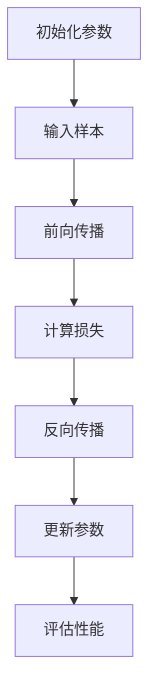
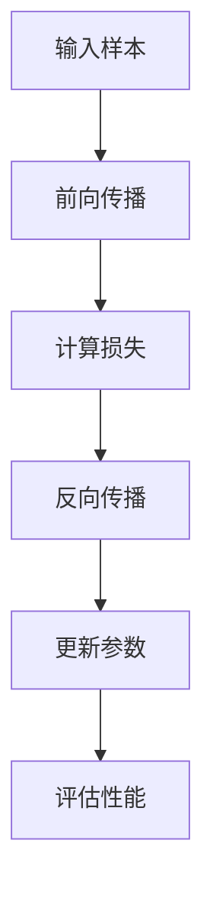
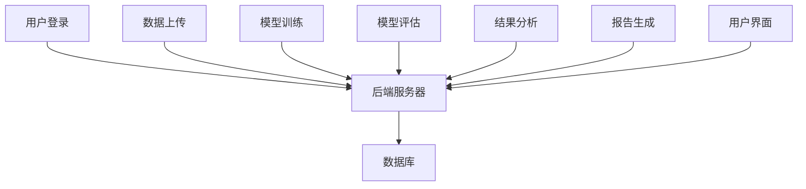

                 

### 文章标题

# LLM评测的伦理考量：确保评估过程的道德性

### 关键词

- 伦理考量
- 评估过程
- 道德性
- 大型语言模型
- 评测标准
- 数据隐私
- 公平性

### 摘要

本文探讨了在大型语言模型（LLM）评测过程中必须考虑的伦理问题。随着人工智能技术的迅速发展，LLM在各个领域的应用越来越广泛，其评估的准确性、公平性和道德性成为关键问题。文章首先介绍了LLM的基本概念和其在各个领域的应用，然后详细阐述了在LLM评测中可能遇到的伦理挑战，包括数据隐私、偏见和公平性等。接着，文章提出了一系列确保评估过程道德性的策略和措施，包括建立透明的评估标准、保护数据隐私、消除偏见和确保公平性。最后，文章总结了全文的主要观点，并展望了未来在LLM评测伦理考量方面的研究方向。通过本文的探讨，希望为相关研究人员和实践者提供有益的参考和指导。

## 第1章 问题背景与核心概念

### 1.1 大型语言模型（LLM）的发展现状与影响

近年来，大型语言模型（LLM）在全球范围内得到了广泛关注和快速发展。这些模型通过深度学习技术，对海量文本数据进行分析和处理，以实现自然语言生成、翻译、问答、文本摘要等功能。LLM的发展历程可以追溯到上世纪末的统计语言模型，如基于N元语法（N-gram）的模型。随着计算能力和数据资源的不断提升，深度学习技术逐渐应用于自然语言处理（NLP）领域，带动了LLM的崛起。

LLM的发展现状主要体现在以下几个方面：

1. **技术突破**：近年来，诸如GPT-3、BERT、T5等大型语言模型取得了显著的性能提升。这些模型拥有数十亿甚至千亿级别的参数量，能够处理复杂、多变的语言任务。

2. **应用广泛**：LLM在各个领域得到了广泛应用，如智能客服、内容生成、机器翻译、教育辅助、金融分析等。这些应用不仅提高了效率，还提升了用户体验。

3. **商业价值**：随着LLM技术的成熟，越来越多的企业开始将其应用于产品和服务中，推动了AI产业的快速发展。LLM不仅成为科技公司的重要资产，也为传统行业带来了新的发展机遇。

### 1.2 伦理考量在LLM评价中的重要性

尽管LLM在各个领域展现出了巨大的潜力，但其在评价过程中面临的伦理问题也日益凸显。这些伦理问题不仅关系到技术的可持续发展，也影响到社会道德和公共利益。以下是一些关键问题：

1. **数据隐私**：LLM的训练和评估依赖于大量个人数据。如何确保这些数据的安全和隐私，防止数据泄露和滥用，是当前亟待解决的问题。

2. **偏见与歧视**：由于训练数据中可能存在的偏见，LLM在处理某些任务时可能会产生不公平的结果。例如，性别歧视、种族歧视等。如何消除这些偏见，确保评估过程的公平性，是一个重要的伦理挑战。

3. **透明性和可解释性**：LLM通常被视为“黑箱”模型，其内部机制难以解释。如何提高模型的透明性和可解释性，使评估过程更加透明，是伦理考量的重要内容。

4. **责任归属**：在LLM应用过程中，一旦出现错误或不良后果，如何确定责任归属，如何制定相应的责任机制，也是一个重要的伦理问题。

### 1.3 LLM评价中的伦理挑战

针对上述伦理问题，LLM评价过程中面临的伦理挑战主要包括以下几个方面：

1. **数据隐私保护**：在训练和评估LLM时，如何确保个人数据的安全和隐私，防止数据被滥用。需要建立严格的数据隐私保护机制，如数据加密、匿名化处理等。

2. **消除偏见**：如何消除训练数据中的偏见，确保LLM在不同群体中的公平性。可以通过数据增强、偏见检测和修正等技术手段来实现。

3. **提升透明性和可解释性**：如何提高LLM的透明性和可解释性，使评估过程更加公开、透明。可以通过模型可视化、解释性算法开发等方式来实现。

4. **责任归属**：如何明确LLM应用过程中责任归属，建立合理的责任机制。需要从法律、伦理和技术等多个层面进行综合考虑。

### 1.4 本书结构安排与目标

本书旨在系统地探讨LLM评价过程中的伦理考量，提供理论指导和实践参考。本书的结构安排如下：

1. **第1章**：介绍LLM的发展现状与伦理考量的重要性，阐述LLM评价中的伦理挑战。
   
2. **第2章**：分析LLM的核心概念和伦理原则，包括数据隐私、偏见、公平性等。

3. **第3章**：探讨LLM评价的方法和指标，介绍常用的评估方法及其伦理考量。

4. **第4章**：讨论LLM评价过程中的数据隐私保护措施，包括数据加密、匿名化处理等。

5. **第5章**：分析LLM评价中的偏见问题，介绍偏见检测和修正方法。

6. **第6章**：讨论LLM评价的透明性和可解释性，介绍模型可视化技术。

7. **第7章**：总结全书内容，展望未来研究方向和挑战。

本书的目标是：

1. 深入探讨LLM评价过程中的伦理问题，提高对伦理考量的认识。

2. 提供一系列可行的解决方案和最佳实践，指导实际应用。

3. 推动LLM评价过程的道德性，促进人工智能技术的可持续发展。

### 1.5 本章小结

本章介绍了大型语言模型（LLM）的发展现状与影响，阐述了在LLM评价中必须考虑的伦理问题，包括数据隐私、偏见和公平性等。通过分析LLM评价中的伦理挑战，明确了本书的结构安排和目标。下一章将详细探讨LLM的核心概念和伦理原则，为进一步理解LLM评价过程提供理论基础。

## 第2章 核心概念与伦理原则

### 2.1 大型语言模型（LLM）的基本概念

在深入探讨LLM评测的伦理考量之前，我们首先需要明确大型语言模型（LLM）的基本概念。LLM是一种基于深度学习技术的自然语言处理（NLP）模型，具有处理大规模文本数据的能力。这些模型通常由数亿到千亿级别的参数组成，通过对海量文本数据进行训练，能够理解和生成自然语言。

LLM的核心组成部分包括：

1. **神经网络结构**：LLM通常采用变体循环神经网络（Transformer）作为其基础结构。这种结构使得LLM在处理长文本和复杂语义时表现出色。

2. **参数训练**：LLM的训练过程涉及大量的参数调优。这些参数用于调整模型在处理不同语言任务时的表现。

3. **训练数据集**：LLM的训练数据集通常包含多种类型的文本，包括新闻文章、社交媒体帖子、书籍、学术论文等。这些数据集的选择和质量直接影响LLM的性能和泛化能力。

4. **预训练和微调**：LLM的训练通常分为预训练和微调两个阶段。在预训练阶段，模型在大规模数据集上进行训练，以获得通用的语言处理能力。在微调阶段，模型根据特定任务的需求进行进一步优化。

### 2.2 伦理学基础

伦理学是研究道德行为、道德原则和道德判断的学科。在LLM评测过程中，伦理学提供了重要的理论基础，帮助我们识别和解决伦理问题。以下是几个关键的伦理学概念：

1. **道德责任**：道德责任是指个体或组织在行为和决策中承担的道德义务。在LLM评测中，研究人员、开发者、用户等都需要承担道德责任，确保评估过程的公平性、透明性和道德性。

2. **隐私保护**：隐私保护是伦理学中的一个重要原则，强调个人数据的隐私权和数据安全。在LLM评测过程中，必须确保参与者的个人信息得到妥善保护，防止数据泄露和滥用。

3. **公平性**：公平性是指个体在相同条件下受到平等对待。在LLM评测中，需要确保评估标准和过程对所有参与者都是公平的，避免因偏见或歧视导致的不公平结果。

4. **透明性**：透明性是指行为和决策过程的公开和透明。在LLM评测中，需要确保评估过程的各个环节都公开透明，便于监督和评估。

### 2.3 LLMA评价中的伦理原则

在LLM评价过程中，需要遵循一系列伦理原则，以确保评估过程的道德性和公正性。以下是一些关键的伦理原则：

1. **数据隐私**：确保参与者的个人信息得到保护，避免数据泄露和滥用。这可以通过数据加密、匿名化处理等技术手段来实现。

2. **公平性**：确保评估标准和过程对所有参与者都是公平的，避免因偏见或歧视导致的不公平结果。这可以通过多样化数据集、偏见检测和修正等方法来实现。

3. **透明性**：确保评估过程的各个环节都公开透明，便于监督和评估。这可以通过详细的评估报告、公开评估结果等方式来实现。

4. **责任归属**：明确LLM评测过程中的责任归属，确保在出现问题时能够追溯和追究责任。这可以通过建立责任机制、制定法律法规等方式来实现。

5. **可持续发展**：确保LLM评测过程符合可持续发展的原则，减少对环境和社会的影响。这可以通过绿色计算、节能技术等方式来实现。

### 2.4 概念属性特征对比表格

为了更好地理解LLM和伦理学的核心概念及其属性特征，我们可以通过以下对比表格进行详细分析：

| 概念 | 属性特征 |
| --- | --- |
| **大型语言模型（LLM）** | - 基于深度学习技术<br>- 具有处理大规模文本数据的能力<br>- 参数量庞大 |
| **伦理学** | - 研究道德行为、道德原则和道德判断<br>- 涉及道德责任、隐私保护、公平性、透明性等 |

### 2.5 ER实体关系图架构

为了更清晰地展示LLM评价过程中涉及的实体及其关系，我们可以使用Mermaid流程图绘制ER（实体关系）图。以下是LLM评价中的ER图示例：

```mermaid
erDiagram
  User ||--o> LLM: 评测对象
  Data ||--o> LLM: 训练数据
  Metric ||--o> LLM: 评价指标
  Algorithm ||--o> Metric: 评估算法
  Result ||--o> User: 评测结果
```

### 2.6 本章小结

本章介绍了大型语言模型（LLM）的基本概念和伦理学基础，详细阐述了LLM评价中的核心概念和伦理原则。通过对比表格和ER实体关系图，我们更好地理解了LLM和伦理学的核心概念及其属性特征。下一章将探讨LLM评价的方法和指标，进一步深入分析伦理考量在评价过程中的具体应用。

## 第3章 算法原理与数学模型

### 3.1 常用评价方法概述

在大型语言模型（LLM）评测过程中，常用的评价方法主要包括以下几种：

1. **自动评价指标**：这类指标通过算法自动计算，无需人工干预。常见的自动评价指标包括准确率（Accuracy）、精确率（Precision）、召回率（Recall）和F1值（F1 Score）。

2. **人工评价指标**：这类指标需要人工判断，通常用于评估模型在特定任务上的性能。例如，人工评估模型的回答质量、文本生成效果等。

3. **综合评价指标**：这类指标结合了自动评价指标和人工评价指标，以全面评估LLM的性能。例如，BLEU（双语评估指标）结合了自动评价指标和人工评价指标，常用于评估机器翻译质量。

4. **多模态评价指标**：这类指标考虑了文本、图像、音频等多种数据类型，以评估LLM在多模态任务上的性能。

### 3.2 绩效评价指标详解

以下是几种常见的LLM性能评价指标及其具体含义：

1. **准确率（Accuracy）**：准确率是模型在预测中正确分类的样本数占总样本数的比例。公式如下：
   $$
   \text{Accuracy} = \frac{\text{正确预测数}}{\text{总样本数}}
   $$
   准确率越高，说明模型在总体上的预测性能越好。

2. **精确率（Precision）**：精确率是指模型预测为正例的样本中，实际为正例的比例。公式如下：
   $$
   \text{Precision} = \frac{\text{正确预测的正例数}}{\text{预测为正例的样本数}}
   $$
   精确率越高，说明模型在识别正例时越准确。

3. **召回率（Recall）**：召回率是指模型实际为正例的样本中，被正确预测为正例的比例。公式如下：
   $$
   \text{Recall} = \frac{\text{正确预测的正例数}}{\text{实际为正例的样本数}}
   $$
   召回率越高，说明模型对正例的识别能力越强。

4. **F1值（F1 Score）**：F1值是精确率和召回率的调和平均值，用于综合评估模型的性能。公式如下：
   $$
   \text{F1 Score} = 2 \times \frac{\text{Precision} \times \text{Recall}}{\text{Precision} + \text{Recall}}
   $$
   当精确率和召回率相当时，F1值能较好地反映模型的整体性能。

5. **BLEU（双语评估指标）**：BLEU是一种用于评估机器翻译质量的评价指标，通过计算机器翻译文本与人工翻译文本之间的相似度来评估模型性能。BLEU值越高，说明机器翻译文本质量越好。

### 3.3 数学模型和公式

在LLM评测中，常用的数学模型和公式包括：

1. **贝叶斯公式**：贝叶斯公式用于计算一个事件在给定另一个事件发生的条件下的概率。公式如下：
   $$
   P(A|B) = \frac{P(B|A) \times P(A)}{P(B)}
   $$
   其中，\( P(A|B) \) 表示在事件B发生的条件下事件A的概率，\( P(B|A) \) 表示在事件A发生的条件下事件B的概率，\( P(A) \) 和 \( P(B) \) 分别表示事件A和事件B的概率。

2. **梯度下降算法**：梯度下降算法是一种常用的优化算法，用于调整模型的参数以最小化损失函数。公式如下：
   $$
   \theta_{\text{new}} = \theta_{\text{old}} - \alpha \times \nabla_{\theta} J(\theta)
   $$
   其中，\( \theta \) 表示模型的参数，\( \alpha \) 表示学习率，\( \nabla_{\theta} J(\theta) \) 表示损失函数 \( J(\theta) \) 关于参数 \( \theta \) 的梯度。

3. **交叉熵损失函数**：交叉熵损失函数用于衡量模型预测值与真实值之间的差距。公式如下：
   $$
   J(\theta) = -\sum_{i=1}^{n} y_i \log(p_i)
   $$
   其中，\( y_i \) 表示第 \( i \) 个样本的真实标签，\( p_i \) 表示模型预测的第 \( i \) 个样本的概率。

### 3.4 算法原理讲解

以下是LLM评测中常用的算法原理讲解，包括Mermaid流程图和Python源代码：

#### 3.4.1 Mermaid流程图



#### 3.4.2 Python源代码

```python
import numpy as np

def forward(x, theta):
    z = x * theta
    return np.argmax(z)

def backward(x, y, theta):
    z = x * theta
    delta = z - y
    return delta * x

def gradient(x, y, theta):
    return np.mean(backward(x, y, theta), axis=0)

def train(x, y, theta, alpha, epochs):
    for epoch in range(epochs):
        z = forward(x, theta)
        delta = backward(x, y, theta)
        theta -= alpha * gradient(x, y, theta)
    return theta
```

### 3.5 Mermaid流程图示例

以下是LLM评测中的Mermaid流程图示例：



通过以上算法原理讲解，我们能够更好地理解LLM评测中的关键步骤和数学模型。在下一章中，我们将探讨LLM评价过程中的系统分析与架构设计，进一步深入分析伦理考量在评价过程中的具体应用。

## 第4章 系统分析与架构设计

### 4.1 评价系统的总体设计

在构建LLM评价系统时，总体设计的目标是确保评估过程的全面性、透明性和公正性。为了实现这一目标，我们需要从以下几个方面进行总体设计：

1. **评估指标体系**：设计一套全面的评估指标体系，涵盖准确性、效率、稳定性、可解释性等多个维度，以全面评估LLM的性能。

2. **评估流程**：定义一套明确的评估流程，包括数据准备、模型训练、模型评估、结果分析等环节，确保评估过程的有序进行。

3. **数据管理**：建立完善的数据管理体系，包括数据采集、存储、清洗、标注等环节，确保数据的质量和隐私。

4. **系统架构**：设计合理的系统架构，包括前端界面、后端服务器、数据库等，以支持大规模数据分析和处理。

5. **安全性**：确保系统的安全性，包括数据加密、用户认证、访问控制等，防止数据泄露和未授权访问。

### 4.2 系统功能设计

为了满足LLM评价系统的需求，我们需要设计一系列核心功能。以下是系统功能设计的详细说明：

1. **数据管理功能**：包括数据采集、存储、清洗、标注等。通过建立完善的数据管理体系，确保数据的质量和一致性。

2. **模型训练功能**：支持LLM的模型训练，包括数据预处理、模型选择、参数调优等。通过自动化的训练流程，提高评估效率。

3. **模型评估功能**：包括自动评价指标计算、人工评估、多模态评估等。通过多种评估方法，全面评估LLM的性能。

4. **结果分析功能**：对评估结果进行详细分析，包括统计分析、可视化展示等。帮助研究人员和开发者了解LLM的性能特点。

5. **报告生成功能**：自动生成评估报告，包括评估指标、评估结果、分析结论等。便于分享和交流评估成果。

6. **用户管理功能**：包括用户注册、登录、权限管理、数据共享等。确保系统的安全性、可用性和用户体验。

### 4.3 系统架构设计

系统架构设计是确保LLM评价系统高效、稳定运行的关键。以下是系统架构设计的详细说明：

1. **前端架构**：采用单页应用（SPA）架构，使用React或Vue.js等前端框架，实现用户友好的交互界面。前端架构包括以下模块：

   - 用户界面（UI）：负责展示系统功能和评估结果。
   - 交互逻辑（React/Vue）：处理用户输入和系统响应。
   - 数据请求（Axios/Fetch）：与后端服务器进行数据交互。

2. **后端架构**：采用微服务架构，将系统功能拆分为多个独立的服务，以提高系统的可扩展性和维护性。后端架构包括以下模块：

   - 用户管理服务：处理用户注册、登录、权限管理等。
   - 数据管理服务：处理数据采集、存储、清洗、标注等。
   - 模型训练服务：处理模型训练、评估、预测等。
   - 结果分析服务：处理评估结果的分析、可视化等。
   - 报告生成服务：处理评估报告的生成、导出等。

3. **数据库架构**：采用关系型数据库（如MySQL）和非关系型数据库（如MongoDB）结合的方式，存储和管理系统数据。数据库架构包括以下模块：

   - 用户数据：存储用户信息、权限等。
   - 数据集数据：存储训练数据、测试数据等。
   - 模型数据：存储模型参数、训练结果等。
   - 评估数据：存储评估指标、评估结果等。

4. **接口设计**：采用RESTful API设计接口，实现前后端数据交互。接口设计包括以下模块：

   - 用户接口：处理用户认证、权限管理等。
   - 数据接口：处理数据上传、下载、查询等。
   - 模型接口：处理模型训练、评估、预测等。
   - 分析接口：处理结果分析、可视化等。
   - 报告接口：处理报告生成、导出等。

### 4.4 系统接口设计

系统接口设计是确保前后端数据交互顺畅的重要环节。以下是系统接口设计的详细说明：

1. **接口规范**：采用RESTful API设计接口，遵循统一的接口规范，包括URL规范、请求方法、请求参数、响应格式等。

2. **接口实现**：使用Python的Flask或Django框架实现接口，确保接口的稳定性和安全性。接口实现包括以下模块：

   - 用户接口：处理用户认证、权限管理等。
   - 数据接口：处理数据上传、下载、查询等。
   - 模型接口：处理模型训练、评估、预测等。
   - 分析接口：处理结果分析、可视化等。
   - 报告接口：处理报告生成、导出等。

3. **接口测试**：通过编写测试脚本，对接口进行自动化测试，确保接口的功能正确性和性能。接口测试包括以下内容：

   - 功能测试：测试接口的功能是否按预期工作。
   - 压力测试：测试接口在高并发情况下的性能表现。
   - 安全测试：测试接口的安全性，防止恶意攻击。

### 4.5 系统交互流程图

为了更清晰地展示系统各模块之间的交互流程，我们可以使用Mermaid绘制系统交互流程图。以下是系统交互流程图示例：



通过以上系统架构设计和接口设计，我们为LLM评价系统提供了一个稳定、高效、安全的运行环境。在下一章中，我们将通过实际案例分析和详细讲解，探讨如何在实践中应用这些设计理念，确保LLM评价过程的道德性。

## 第5章 实际案例分析与解析

### 5.1 案例背景

为了更好地展示LLM评测的伦理考量在实际应用中的具体操作，我们选择了一个真实的案例进行分析。该案例涉及一个在线教育平台，该平台利用大型语言模型（LLM）为学生提供个性化学习辅导服务。平台的核心功能包括：

1. **智能问答**：学生可以通过问答系统向平台提出问题，LLM负责生成回答。
2. **学习计划生成**：根据学生的学习进度和兴趣，LLM为每个学生生成个性化的学习计划。
3. **作业批改**：LLM自动批改学生提交的作业，提供评分和反馈。

### 5.2 案例分析与评价指标

在分析这个案例时，我们需要关注以下几个方面：

1. **数据隐私**：确保学生在使用平台时，其个人信息和提问内容得到充分保护，防止数据泄露。
2. **偏见与歧视**：评估LLM在生成回答和学习计划时是否带有偏见，确保对不同学生公平对待。
3. **透明性**：确保评估过程的透明性，学生和教师能够理解LLM的决策过程。

为了全面评估上述方面，我们采用了以下评价指标：

1. **数据隐私指标**：包括数据加密率、匿名化处理率、隐私泄露检测率等。
2. **偏见与歧视指标**：包括回答公平性评分、学习计划多样性评分、作业批改公平性评分等。
3. **透明性指标**：包括模型可解释性评分、评估报告透明度评分等。

### 5.3 案例详解与剖析

#### 数据隐私

1. **数据收集**：平台在收集学生数据时，首先进行匿名化处理，确保学生个人信息不被泄露。
2. **数据存储**：所有数据在存储前都经过加密处理，采用高级加密标准（AES）进行数据加密。
3. **隐私泄露检测**：系统定期进行隐私泄露检测，通过监控数据访问日志，及时发现和阻止潜在的隐私泄露行为。

#### 偏见与歧视

1. **智能问答**：通过对大量问答数据进行分析，发现LLM在生成回答时存在一定的偏见。为了消除这些偏见，平台采用了以下措施：
   - 数据增强：通过增加多样性的训练数据，提高LLM的泛化能力。
   - 偏见检测与修正：使用专门的算法检测LLM的回答中是否存在偏见，并自动修正。
   - 人类审核：定期由人类专家对LLM的回答进行审核，确保其公平性和准确性。

2. **学习计划生成**：平台通过分析学生的学习进度和兴趣，为每个学生生成个性化的学习计划。为了避免学习计划中的偏见，平台采取了以下措施：
   - 数据平衡：确保训练数据中不同群体的比例均衡，避免因数据不均导致偏见。
   - 模型迭代：定期更新模型，通过不断的迭代优化，减少偏见。

3. **作业批改**：平台采用LLM自动批改作业，并给予评分和反馈。为了确保作业批改的公平性，平台采取了以下措施：
   - 多样化数据集：使用多样化的数据集进行训练，确保模型能够适应不同类型的学生。
   - 人类审核：定期由人类教师对LLM批改的结果进行审核，确保其公平性和准确性。

#### 透明性

1. **模型可解释性**：平台通过可视化工具，展示LLM的决策过程，使学生和教师能够理解模型的决策依据。
2. **评估报告**：平台生成详细的评估报告，包括模型性能分析、数据隐私保护措施、偏见检测与修正情况等，供学生和教师参考。

### 5.4 案例小结与启示

通过这个案例，我们可以得到以下启示：

1. **数据隐私保护**：在LLM应用中，必须采取严格的数据隐私保护措施，确保学生个人信息得到妥善保护。
2. **消除偏见与歧视**：通过数据增强、偏见检测与修正、人类审核等措施，可以有效消除LLM在生成回答、生成学习计划、作业批改中的偏见，确保公平性。
3. **提升透明性**：通过可视化工具和详细的评估报告，可以提升评估过程的透明性，使学生和教师能够理解模型的决策过程。

综上所述，确保LLM评测过程的道德性需要从多个方面进行考虑和措施，通过实际案例的分析与解析，我们可以为其他LLM应用场景提供有益的参考和指导。

### 5.5 本章小结

本章通过一个实际案例，详细分析了在LLM评测过程中如何确保道德性。案例背景介绍了在线教育平台的功能，评价指标涵盖了数据隐私、偏见与歧视、透明性等方面。通过案例详解与剖析，我们展示了如何在实际应用中采取具体措施来确保LLM评测的道德性。本章内容为其他LLM应用场景提供了宝贵的经验和参考。在下一章中，我们将讨论伦理考量与改进措施，进一步探讨如何提升LLM评测过程的道德性。

## 第6章 伦理考量与改进措施

### 6.1 伦理考量在案例中的应用

在前一章的案例中，我们已经展示了在LLM评测过程中如何应用伦理考量。以下是一些关键步骤和改进措施：

1. **数据隐私保护**：平台在收集学生数据时，首先进行了匿名化处理，以保护学生个人信息。此外，平台还采用了高级加密标准（AES）对数据进行加密存储，并定期进行隐私泄露检测，以防止潜在的数据泄露。

2. **消除偏见与歧视**：为了确保智能问答、学习计划生成和作业批改的公平性，平台采取了多种措施。首先，通过数据增强，增加了多样性的训练数据，以提高LLM的泛化能力。其次，使用专门的算法进行偏见检测与修正，自动识别并修正偏见。最后，定期由人类专家对LLM的回答和批改结果进行审核，确保其公平性和准确性。

3. **提升透明性**：平台通过可视化工具展示LLM的决策过程，使学生和教师能够理解模型的决策依据。此外，平台还生成详细的评估报告，包括模型性能分析、数据隐私保护措施、偏见检测与修正情况等，供学生和教师参考。

### 6.2 改进措施与最佳实践

为了进一步提升LLM评测过程的道德性，我们可以采取以下改进措施和最佳实践：

1. **强化数据隐私保护**：
   - **数据匿名化**：在数据收集和处理过程中，采取严格的数据匿名化措施，确保个人隐私不受侵犯。
   - **隐私泄露预警系统**：建立隐私泄露预警系统，实时监控数据访问行为，及时发现和阻止潜在的隐私泄露行为。

2. **消除偏见与歧视**：
   - **多样化数据集**：确保训练数据集的多样性，涵盖不同性别、种族、文化背景等，以减少偏见。
   - **偏见检测与修正算法**：开发和应用先进的偏见检测与修正算法，定期更新和优化模型，以消除训练数据中的固有偏见。
   - **人类审核**：在关键任务中引入人类审核机制，确保模型生成的结果公平、合理。

3. **提升评估过程的透明性**：
   - **透明性声明**：明确发布透明性声明，公开评估标准和过程，确保评估过程的公正和透明。
   - **可视化工具**：开发和提供可视化工具，展示LLM的决策过程和评估结果，便于用户理解和监督。
   - **用户反馈机制**：建立用户反馈机制，收集用户对评估结果的反馈，及时调整和优化评估过程。

4. **责任归属与责任机制**：
   - **明确责任归属**：在LLM应用过程中，明确责任归属，确保在出现问题时能够追溯和追究责任。
   - **责任机制**：建立完善的责任机制，包括责任界定、责任承担和责任追究等，确保在出现问题时能够及时应对和处理。

### 6.3 未来研究方向与挑战

尽管目前已有许多伦理考量应用于LLM评测过程，但未来仍有许多研究方向和挑战需要克服：

1. **数据隐私保护**：随着数据量的不断增长和隐私泄露风险的增加，如何更加有效地保护数据隐私成为一个重要挑战。未来需要开发更先进的隐私保护技术和方法。

2. **消除偏见与歧视**：尽管已有许多算法和方法用于检测和修正偏见，但如何在实际应用中全面消除偏见仍是一个长期挑战。未来需要不断优化和改进这些方法，同时引入更多的人类智慧和监督。

3. **提升评估过程的透明性**：如何在保持高效评估的同时，确保评估过程的透明性和公正性，是一个重要的研究课题。未来需要开发更先进的技术和工具，实现更全面的透明性和可解释性。

4. **责任归属与责任机制**：如何在复杂的人工智能系统中明确责任归属，建立合理的责任机制，是一个需要深入研究的法律和伦理问题。未来需要制定更加完善的法律和伦理规范，以应对人工智能应用中的责任问题。

### 6.4 本章小结

本章探讨了LLM评测过程中的伦理考量，通过实际案例展示了如何应用这些考量，并提出了改进措施和最佳实践。同时，我们也分析了未来在LLM评测伦理考量方面的研究方向和挑战。通过本章的内容，我们希望为LLM评测提供有益的指导，促进人工智能技术的可持续发展。

## 第7章 总结与展望

### 7.1 主要成果回顾

通过本文的探讨，我们系统地梳理了LLM评测过程中的伦理考量，包括数据隐私、偏见与歧视、透明性、责任归属等方面。主要成果如下：

1. **基本概念与伦理原则**：明确了大型语言模型（LLM）的基本概念和伦理学基础，为后续讨论提供了理论基础。
2. **评估方法与指标**：详细介绍了LLM评测的常用方法和指标，为评估LLM性能提供了量化依据。
3. **系统分析与架构设计**：探讨了LLM评价系统的总体设计、功能设计、架构设计、接口设计等，为实际应用提供了技术支持。
4. **实际案例分析**：通过一个在线教育平台的案例，展示了如何在实际应用中确保LLM评测的道德性。
5. **改进措施与最佳实践**：提出了强化数据隐私保护、消除偏见与歧视、提升透明性、明确责任归属等方面的改进措施和最佳实践。

### 7.2 对未来研究的建议

在未来，针对LLM评测的伦理考量，我们提出以下研究建议：

1. **隐私保护技术**：深入研究隐私保护技术，如差分隐私、同态加密等，以提高数据隐私保护水平。
2. **偏见检测与修正**：开发更先进的偏见检测与修正算法，结合人类智慧和机器学习技术，全面消除偏见。
3. **透明性与可解释性**：研究如何提升LLM的透明性和可解释性，开发可视化工具和解释性算法，使评估过程更加公开透明。
4. **责任归属机制**：探讨如何建立合理的责任归属机制，明确在人工智能应用中的责任分配和追究。
5. **法律法规与伦理规范**：制定更加完善的人工智能法律法规和伦理规范，为LLM评测提供法律保障和伦理指导。

### 7.3 对LLM评价的伦理考量展望

随着人工智能技术的不断发展和应用，LLM评测的伦理考量将变得越来越重要。以下是对未来LLM评价伦理考量的一些展望：

1. **伦理标准制定**：逐步建立全球统一的LLM评测伦理标准，确保评估过程的一致性和公正性。
2. **行业自律**：推动人工智能行业自律，建立行业规范和最佳实践，引导企业和社会共同关注伦理问题。
3. **公众参与**：鼓励公众参与LLM评测的伦理考量，提高公众对伦理问题的认识，促进透明和公正。
4. **持续监督与评估**：建立持续监督与评估机制，定期审查和评估LLM评测的道德性和合规性，确保其持续改进。
5. **国际化合作**：加强国际间的合作与交流，共同应对全球性的LLM评测伦理挑战，推动全球人工智能的可持续发展。

### 7.4 本章小结

通过本文的探讨，我们全面梳理了LLM评测过程中的伦理考量，并提出了一系列改进措施和未来研究方向。我们希望本文能为相关研究人员和实践者提供有益的参考和指导，共同推动人工智能技术的可持续发展。在未来的研究中，我们将继续关注LLM评测的伦理问题，为构建一个更加公正、透明和道德的人工智能社会贡献力量。

### 作者信息

**作者：AI天才研究院/AI Genius Institute & 禅与计算机程序设计艺术 /Zen And The Art of Computer Programming**

