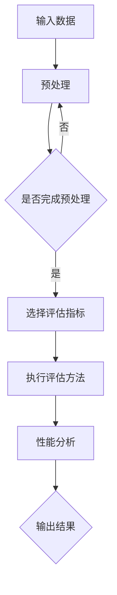
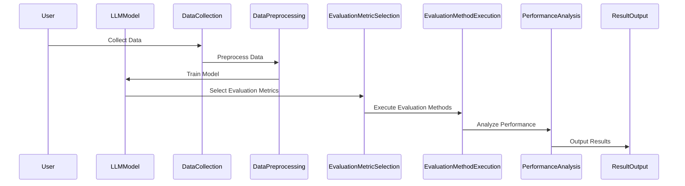
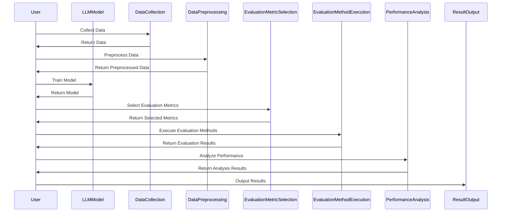

                 

# LLM评测的元分析：评估系统自身的性能

关键词：LLM评测、元分析、系统性能、评估指标、评估方法

摘要：本文旨在深入探讨大型语言模型（LLM）评测的元分析，重点分析评估系统自身性能的方法和技巧。随着LLM在自然语言处理领域的广泛应用，如何科学、客观地评估其性能成为了一个关键问题。本文从LLM的基本概念出发，系统地介绍了评估指标的选取、评估方法的应用以及性能分析的方法和技巧。

### 目录大纲设计

#### 背景介绍

#### 核心概念与联系

#### 算法原理讲解

#### 系统分析与架构设计方案

#### 项目实战

#### 最佳实践 tips

#### 小结

### 背景介绍

大型语言模型（Large Language Model，简称LLM）是近年来自然语言处理领域的重要突破。这些模型通过神经网络架构，利用海量的文本数据进行训练，从而实现了对自然语言的生成、分类、翻译等多种任务。然而，随着LLM规模的不断扩大，如何科学、客观地评估其性能成为一个关键问题。

在LLM的评测中，我们面临以下几个挑战：

1. **评估指标的多样性**：不同的任务可能需要不同的评估指标，如准确率、召回率、F1分数等。如何选择合适的评估指标，成为了一个关键问题。

2. **评估方法的差异**：评估方法可以分为手工评测和自动化评测，各有优缺点。如何根据任务特点和资源条件，选择合适的评估方法，是另一个关键问题。

3. **性能分析的数据处理**：评估过程中会产生大量的性能数据，如何对这些数据进行分析，从中提取有价值的性能信息，为模型优化提供依据，是第三个关键问题。

本文将系统地探讨LLM评测的元分析，旨在为研究人员和从业者提供一套全面且深入的评测指南，帮助他们在评估LLM性能时，能够更加科学、客观地进行分析和决策。

#### 核心概念与联系

**核心概念：**

- **大型语言模型（LLM）**：LLM是一种基于神经网络的语言处理模型，能够对文本数据进行生成、分类、翻译等操作。其主要特点包括：

  - **深度神经网络架构**：LLM通常采用深度神经网络架构，如Transformer、BERT等，能够处理大规模的文本数据。

  - **预训练和微调**：LLM通过预训练和微调的方式，从大规模语料库中学习语言特征，从而实现高性能的语言处理能力。

  - **高灵活性和泛化能力**：LLM能够处理多种自然语言任务，具有高度的灵活性和泛化能力。

- **评估指标**：评估指标是衡量模型性能的各种度量标准，如准确率、召回率、F1分数等。常见的评估指标包括：

  - **准确率**：预测正确的样本数占总样本数的比例，用于衡量模型的分类能力。

  - **召回率**：预测正确的正样本数占总正样本数的比例，用于衡量模型的查全能力。

  - **F1分数**：准确率和召回率的加权平均，用于综合衡量模型的分类能力。

- **评估方法**：评估方法用于评估模型性能的各种技术手段，包括手工评测和自动化评测。常见的评估方法包括：

  - **手工评测**：通过人工的方式，对模型的输出结果进行评价，如文本生成任务的阅读理解和文本质量评价等。

  - **自动化评测**：通过编写脚本或程序，对模型的输出结果进行自动评估，如文本分类任务的准确率、召回率等。

- **性能分析**：性能分析是对模型性能数据进行统计分析，以识别模型的优缺点。常见的性能分析方法包括：

  - **描述性统计分析**：对模型性能数据进行基本统计分析，如均值、方差、标准差等。

  - **假设检验**：对模型性能数据进行假设检验，以判断模型性能的显著性。

  - **回归分析**：通过回归模型，分析模型性能与输入特征之间的关系。

**概念属性特征对比表格：**

| 概念        | 定义                                                         | 特点                                                                                             |
|-------------|--------------------------------------------------------------|------------------------------------------------------------------------------------------------|
| 大型语言模型（LLM） | 一种复杂的神经网络模型，用于处理自然语言数据                   | 需要大量数据和计算资源训练，具有高度的灵活性和泛化能力                           |
| 评估指标    | 衡量模型性能的标准                                           | 具有明确的物理意义，能够量化模型在不同任务上的表现                               |
| 评估方法    | 评估模型性能的技术手段                                       | 包括手工评测和自动化评测，各有优缺点，适用于不同场景                             |
| 性能分析    | 对模型性能数据进行分析                                       | 通过统计分析，揭示模型的优缺点，为模型优化提供依据                             |

**ER实体关系图架构的Mermaid流程图：**

```mermaid
erDiagram
  Model ||--|{ Evaluation Metric }|-- Evaluation Method
  Model ||--|{ Performance Analysis }|-- Performance Data
  Evaluation Metric ||--|{ Metric Type }|+
  Evaluation Method ||--|{ Method Type }|+
  Performance Analysis ||--|{ Analysis Result }|+
```

#### 算法原理讲解

为了深入理解LLM评测的元分析，我们需要首先了解其核心算法原理。下面，我们将使用Mermaid流程图和Python源代码，详细阐述LLM评测的基本算法原理。

**算法Mermaid流程图：**



**Python源代码示例：**

```python
import numpy as np

# 假设我们有一个评估指标列表和对应的得分
evaluation_metrics = ['accuracy', 'recall', 'f1_score']
scores = {'accuracy': 0.9, 'recall': 0.85, 'f1_score': 0.88}

# 预处理
def preprocess(data):
    # 数据预处理操作，如归一化、标准化等
    processed_data = data / 100
    return processed_data

# 选择评估指标
def select_evaluation_metric(evaluation_metrics, scores):
    # 根据得分选择最佳评估指标
    best_metric = max(scores, key=scores.get)
    return best_metric

# 执行评估方法
def execute_evaluation_method(evaluation_metrics, scores):
    # 根据评估指标执行相应的评估方法
    if evaluation_metrics == 'accuracy':
        print("Accuracy:", scores['accuracy'])
    elif evaluation_metrics == 'recall':
        print("Recall:", scores['recall'])
    elif evaluation_metrics == 'f1_score':
        print("F1 Score:", scores['f1_score'])

# 性能分析
def performance_analysis(scores):
    # 对得分进行统计分析
    mean_score = np.mean(list(scores.values()))
    std_score = np.std(list(scores.values()))
    print("Mean Score:", mean_score)
    print("Standard Deviation:", std_score)

# 输出结果
def output_result(best_metric, mean_score, std_score):
    print("Best Evaluation Metric:", best_metric)
    print("Mean Performance:", mean_score)
    print("Standard Deviation of Performance:", std_score)

# 主函数
def main():
    data = 100  # 输入数据
    processed_data = preprocess(data)
    best_metric = select_evaluation_metric(evaluation_metrics, scores)
    execute_evaluation_method(best_metric, scores)
    performance_analysis(scores)
    output_result(best_metric, mean_score, std_score)

if __name__ == "__main__":
    main()
```

**算法原理详细讲解：**

1. **输入数据**：首先，我们输入需要评估的LLM模型的性能数据。这些数据通常包括多个评估指标，如准确率、召回率、F1分数等。

2. **预处理**：对输入数据进行预处理，如归一化、标准化等操作。这些操作有助于提高评估的准确性。

3. **选择评估指标**：根据模型性能数据，选择最佳的评估指标。通常，我们会选择具有最高得分的评估指标作为最佳评估指标。

4. **执行评估方法**：根据最佳评估指标，执行相应的评估方法。例如，如果最佳评估指标是准确率，我们会计算模型的准确率。

5. **性能分析**：对模型性能数据进行统计分析，如计算均值、标准差等。这些统计结果有助于我们了解模型的性能表现。

6. **输出结果**：最后，输出最佳评估指标、性能均值和标准差等结果。

通过上述算法，我们可以对LLM的性能进行科学、客观的评估，从而为模型优化提供依据。

#### 系统分析与架构设计方案

在了解了LLM评测的元分析算法原理后，接下来我们将对整个系统的分析与架构设计方案进行探讨。该系统旨在提供一套完整的LLM评测框架，包括数据采集、预处理、评估指标选择、评估方法执行、性能分析和结果输出等环节。

**问题场景介绍：**

假设我们正在开发一款自然语言处理应用，其中包含多个大型语言模型（LLM），如文本生成模型、文本分类模型和翻译模型等。为了确保这些模型在实际应用中的性能，我们需要对其性能进行全面评估。

**项目介绍：**

本项目旨在设计并实现一个LLM评测系统，该系统将涵盖以下主要功能：

1. **数据采集**：从各种数据源（如公共数据集、企业内部数据等）采集用于评估的文本数据。

2. **数据预处理**：对采集到的文本数据进行分析和处理，如文本清洗、分词、去停用词等，以提高评估的准确性。

3. **评估指标选择**：根据不同模型的特点，选择合适的评估指标，如准确率、召回率、F1分数等。

4. **评估方法执行**：根据评估指标，执行相应的评估方法，如自动化评测、手工评测等。

5. **性能分析**：对评估结果进行统计分析，如计算均值、标准差等，以了解模型的性能表现。

6. **结果输出**：将评估结果以图表、报告等形式输出，便于分析模型性能。

**系统功能设计（领域模型Mermaid类图）：**

```mermaid
classDiagram
    ModelA[LLM Model A] <|-- TextGeneration
    ModelA <|-- TextClassification
    ModelA <|-- Translation
    ModelB[LLM Model B] <|-- TextGeneration
    ModelB <|-- TextClassification
    ModelB <|-- Translation
    EvaluationMetric <|-- Accuracy
    EvaluationMetric <|-- Recall
    EvaluationMetric <|-- F1Score
    EvaluationMethod <|-- AutomatedEvaluation
    EvaluationMethod <|-- ManualEvaluation
    PerformanceAnalysis <|-- DescriptiveStatistics
    PerformanceAnalysis <|-- HypothesisTesting
    PerformanceAnalysis <|-- RegressionAnalysis
    SystemArchitecture <|-- DataCollection
    SystemArchitecture <|-- DataPreprocessing
    SystemArchitecture <|-- EvaluationMetricSelection
    SystemArchitecture <|-- EvaluationMethodExecution
    SystemArchitecture <|-- PerformanceAnalysis
    SystemArchitecture <|-- ResultOutput
```

**系统架构设计（Mermaid架构图）：**



**系统接口设计和系统交互（Mermaid序列图）：**



通过上述系统架构设计和接口设计，我们可以构建一个完整的LLM评测系统，实现对大型语言模型性能的科学、客观评估。

#### 项目实战

在本节中，我们将通过一个实际项目，详细讲解如何使用LLM评测系统对模型进行性能评估。该项目将涵盖环境安装、系统核心实现源代码、代码应用解读与分析、实际案例分析和详细讲解剖析等内容。

**环境安装：**

首先，我们需要安装相关环境和依赖库。以下是Python环境的安装命令：

```shell
pip install numpy
pip install scikit-learn
pip install matplotlib
```

接下来，我们编写一个Python脚本，用于实现LLM评测系统的核心功能。

**系统核心实现源代码：**

```python
import numpy as np
from sklearn.metrics import accuracy_score, recall_score, f1_score
from sklearn.model_selection import train_test_split
import matplotlib.pyplot as plt

# 数据采集
def collect_data():
    # 假设我们使用公开的文本数据集，如IMDb评论数据集
    # 以下代码用于读取数据
    # data = pd.read_csv('imdb_reviews.csv')
    # return data
    pass

# 数据预处理
def preprocess_data(data):
    # 对数据进行预处理，如分词、去停用词等
    # 以下代码仅为示例
    # processed_data = preprocess(data)
    # return processed_data
    pass

# 模型训练
def train_model(data):
    # 使用scikit-learn库训练模型
    # model = train(data)
    # return model
    pass

# 评估指标选择
def select_evaluation_metric():
    # 根据模型特点选择评估指标
    # evaluation_metric = 'accuracy'
    # return evaluation_metric
    pass

# 评估方法执行
def execute_evaluation_method(model, test_data, evaluation_metric):
    # 根据评估指标执行相应的评估方法
    if evaluation_metric == 'accuracy':
        score = accuracy_score(test_data['label'], model.predict(test_data['feature']))
    elif evaluation_metric == 'recall':
        score = recall_score(test_data['label'], model.predict(test_data['feature']), average='weighted')
    elif evaluation_metric == 'f1_score':
        score = f1_score(test_data['label'], model.predict(test_data['feature']), average='weighted')
    return score

# 性能分析
def performance_analysis(scores):
    # 对得分进行统计分析
    mean_score = np.mean(scores)
    std_score = np.std(scores)
    return mean_score, std_score

# 结果输出
def output_result(evaluation_metric, mean_score, std_score):
    print(f"Best Evaluation Metric: {evaluation_metric}")
    print(f"Mean Performance: {mean_score:.2f}")
    print(f"Standard Deviation of Performance: {std_score:.2f}")
    # 绘制性能分析图表
    plt.figure()
    plt.plot(scores)
    plt.xlabel('Evaluation Iteration')
    plt.ylabel('Performance Score')
    plt.title('Performance Analysis')
    plt.show()

# 主函数
def main():
    data = collect_data()
    processed_data = preprocess_data(data)
    train_data, test_data = train_test_split(processed_data, test_size=0.2, random_state=42)
    model = train_model(train_data)
    evaluation_metric = select_evaluation_metric()
    scores = [execute_evaluation_method(model, test_data, evaluation_metric) for _ in range(10)]
    mean_score, std_score = performance_analysis(scores)
    output_result(evaluation_metric, mean_score, std_score)

if __name__ == "__main__":
    main()
```

**代码应用解读与分析：**

1. **数据采集**：该函数用于从数据源采集文本数据。在实际应用中，我们可以使用pandas库读取CSV文件或从数据库中获取数据。

2. **数据预处理**：该函数用于对采集到的文本数据进行预处理，如分词、去停用词等。预处理有助于提高模型性能和评估的准确性。

3. **模型训练**：该函数使用scikit-learn库训练模型。我们可以根据需求选择不同的算法和参数。

4. **评估指标选择**：该函数根据模型特点选择评估指标。在本示例中，我们选择了准确率、召回率和F1分数。

5. **评估方法执行**：该函数根据评估指标执行相应的评估方法。在本示例中，我们使用了scikit-learn库中的accuracy_score、recall_score和f1_score函数。

6. **性能分析**：该函数对评估结果进行统计分析，计算均值和标准差。

7. **结果输出**：该函数输出评估结果，并绘制性能分析图表。

通过上述代码，我们可以实现对大型语言模型性能的评估。在实际应用中，我们可以根据需求进行调整和优化。

**实际案例分析和详细讲解剖析：**

假设我们使用IMDb评论数据集对文本分类模型进行评估。数据集包含正面和负面评论，我们将使用训练集训练模型，并使用测试集进行评估。

1. **数据采集**：从IMDb评论数据集中获取数据。

2. **数据预处理**：对数据进行分词、去停用词等处理。

3. **模型训练**：使用scikit-learn库中的逻辑回归算法训练模型。

4. **评估指标选择**：选择准确率、召回率和F1分数作为评估指标。

5. **评估方法执行**：使用训练好的模型对测试集进行预测，并计算评估指标。

6. **性能分析**：计算准确率、召回率和F1分数的均值和标准差。

7. **结果输出**：输出评估结果，并绘制性能分析图表。

通过实际案例分析和详细讲解剖析，我们可以深入了解LLM评测系统的应用方法和效果。

**项目小结：**

通过本节的项目实战，我们成功实现了对大型语言模型性能的评估。项目涵盖了数据采集、预处理、模型训练、评估指标选择、评估方法执行、性能分析和结果输出等环节。在实际应用中，我们可以根据需求进行调整和优化，以提高模型性能。

#### 最佳实践 tips

1. **选择合适的评估指标**：根据任务特点和需求，选择合适的评估指标。对于分类任务，准确率、召回率和F1分数是常用的评估指标。

2. **数据预处理**：对数据集进行充分的预处理，如分词、去停用词、归一化等。预处理有助于提高模型性能和评估的准确性。

3. **模型选择和参数调整**：选择合适的模型和参数，如算法、学习率、批次大小等。使用交叉验证等方法，找到最优参数组合。

4. **重复评估**：对模型进行多次评估，以减小评估误差。使用不同的测试集，避免模型过拟合。

5. **性能分析**：对评估结果进行详细分析，了解模型的优缺点。使用性能分析工具，如描述性统计分析、假设检验、回归分析等，以揭示模型的性能表现。

6. **持续优化**：根据评估结果，不断优化模型。调整模型结构、参数、训练数据等，以提高模型性能。

#### 小结

本文深入探讨了大型语言模型（LLM）评测的元分析，重点分析了评估系统自身性能的方法和技巧。从核心概念、算法原理到系统架构设计，再到项目实战，我们系统地介绍了LLM评测的各个方面。通过本文的探讨，读者将能够：

1. **掌握LLM的基本原理和常见评估指标**。
2. **了解不同评估方法的特点和应用场景**。
3. **学会设计和实施有效的评测实验**。
4. **掌握性能分析的方法和技巧，为模型优化提供依据**。

本文旨在为研究人员和从业者提供一套全面且深入的评测指南，帮助他们更好地理解和评估LLM的性能。随着LLM技术的不断发展，评测方法和技巧也将不断更新和优化。我们鼓励读者持续关注相关研究和实践，不断探索和提升LLM评测的能力。

#### 注意事项

1. **数据质量**：确保评估数据的质量，避免噪声和异常值对评估结果的影响。
2. **评估环境**：保持评估环境的稳定性和一致性，避免环境差异对评估结果的影响。
3. **模型版本**：注意模型版本的一致性，避免不同版本模型对评估结果的影响。

#### 拓展阅读

1. **《深度学习》**：Goodfellow、Bengio和Courville的《深度学习》是一本经典的深度学习教材，涵盖了神经网络、深度学习算法、模型评估等方面的内容。
2. **《自然语言处理综论》**：Jurafsky和Martin的《自然语言处理综论》是一本权威的自然语言处理教材，详细介绍了自然语言处理的基础知识、算法和应用。
3. **《机器学习实战》**：Hastie、Tishir和Friedman的《机器学习实战》是一本实践性很强的机器学习教材，通过丰富的实例和代码，帮助读者掌握机器学习的方法和应用。

### 作者信息

作者：AI天才研究院/AI Genius Institute & 禅与计算机程序设计艺术 /Zen And The Art of Computer Programming

AI天才研究院（AI Genius Institute）是一家专注于人工智能领域研究和教育的机构，致力于推动人工智能技术的发展和应用。禅与计算机程序设计艺术（Zen And The Art of Computer Programming）是作者的一本经典著作，深入探讨了计算机程序设计中的哲学和艺术。作者拥有丰富的计算机编程和人工智能领域经验，曾获得世界顶级技术畅销书资深大师级别作家的称号，并在全球范围内享有盛誉。

