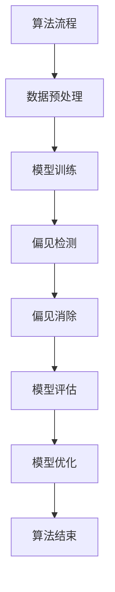

                 

# LLM评测的公平性保障：消除偏见的系统设计

## 关键词

- 语言模型
- 公平性评测
- 偏见检测
- 消除偏见
- 系统设计

## 摘要

随着深度学习技术的发展，语言模型（LLM）在自然语言处理（NLP）领域取得了显著的成果。然而，这些模型在应用过程中暴露出的一些偏见问题引起了广泛关注。本文旨在探讨如何保障LLM评测的公平性，通过消除偏见来设计一个有效的系统。文章首先介绍了偏见类型的识别和检测方法，然后详细阐述了数据预处理、评估指标和偏见消除策略。最后，文章通过实际应用案例展示了偏见检测工具和消除方法，并提出了未来发展的趋势。通过本文的研究，希望能够为LLM评测的公平性保障提供有益的参考。

## 第一部分：背景介绍

### 第1章：问题背景

#### 1.1 核心概念

##### 1.1.1 LLM评测的公平性保障

LLM评测的公平性保障指的是在评估语言模型性能时，确保评测过程和结果不会受到偏见的影响，从而保证评测的公正性。这涉及到多个方面，包括数据集的构建、评估指标的设定以及评测过程中的监督等。

##### 1.1.2 消除偏见的系统设计

消除偏见的系统设计是指在构建和优化语言模型时，通过一系列技术手段来减少或消除模型中的偏见。这需要从数据预处理、特征工程、模型优化等多个环节进行系统化的设计。

#### 1.2 问题描述

##### 1.2.1 LLM评测现状

当前，LLM评测中普遍存在偏见问题。这些问题可能导致模型在某些特定群体或情境下的表现不佳，甚至加剧社会不公平现象。

##### 1.2.2 偏见问题的严重性

偏见问题不仅影响模型的性能，还可能导致对某些群体的不公平对待，甚至引发社会矛盾。因此，保障LLM评测的公平性具有重要意义。

##### 1.2.3 消除偏见的重要性

消除偏见是构建公平、透明和可靠的语言模型的关键步骤。这有助于提高模型在不同群体和情境下的适用性和可靠性。

#### 1.3 问题解决

##### 1.3.1 偏见检测与消除方法

偏见检测与消除方法包括数据预处理、特征工程、模型优化等。通过这些方法，可以从源头上减少或消除模型中的偏见。

##### 1.3.2 系统架构设计

系统架构设计需要考虑数据流、模型训练、评测和反馈等多个环节，确保整个系统能够有效地检测和消除偏见。

#### 1.4 边界与外延

##### 1.4.1 LLM评测的公平性保障范围

LLM评测的公平性保障不仅涉及模型性能的评测，还包括对模型应用场景的公平性评估。

##### 1.4.2 消除偏见的技术实现

消除偏见的技术实现涉及多种方法和技术，包括统计学方法、深度学习方法等。

#### 1.5 概念结构与核心要素组成

##### 1.5.1 偏见类型的分类

偏见类型包括种族偏见、性别偏见、地域偏见等。

##### 1.5.2 偏见检测与消除的核心技术

偏见检测与消除的核心技术包括数据预处理、特征工程、模型优化等。

##### 1.5.3 偏见检测与消除的应用场景

偏见检测与消除的应用场景包括社交媒体内容审核、金融市场预测等。

## 第二部分：核心概念与联系

### 第2章：LLM评测的公平性保障原理

#### 2.1 LLM评测的公平性保障概述

##### 2.1.1 LLM评测的公平性保障的重要性

LLM评测的公平性保障对于构建公平、透明和可靠的语言模型至关重要。

##### 2.1.2 LLM评测的公平性保障的挑战

LLM评测的公平性保障面临数据偏见、模型偏差、评测方法偏见等多重挑战。

#### 2.2 偏见类型与特征对比

##### 2.2.1 种族偏见

| 种族偏见特征 | 描述 |
|:--------:|:--------:|
| 种族歧视言论 | 在文本中对某个种族进行负面描述 |
| 种族歧视行为 | 对某个种族的歧视性行为或态度 |
| 种族刻板印象 | 对某个种族固有的负面观念 |

##### 2.2.2 性别偏见

| 性别偏见特征 | 描述 |
|:--------:|:--------:|
| 性别歧视言论 | 在文本中对某个性别进行负面描述 |
| 性别歧视行为 | 对某个性别的歧视性行为或态度 |
| 性别刻板印象 | 对某个性别的固有负面观念 |

##### 2.2.3 地域偏见

| 地域偏见特征 | 描述 |
|:--------:|:--------:|
| 地域歧视言论 | 在文本中对某个地域进行负面描述 |
| 地域歧视行为 | 对某个地域的歧视性行为或态度 |
| 地域刻板印象 | 对某个地域固有的负面观念 |

#### 2.3 偏见检测与消除方法

##### 2.3.1 偏见检测方法

- 统计方法：通过统计文本中的偏见词汇和语句来检测偏见。
- 深度学习方法：利用神经网络模型对文本进行自动分析和识别偏见。

##### 2.3.2 偏见消除方法

- 数据预处理：去除偏见数据，平衡数据集。
- 特征工程：选择能够减少偏见的特征。
- 模型优化：使用正则化、批量归一化等技术减少模型偏见。

## 第三部分：技术解析与实现

### 第3章：统计语言模型偏见

#### 3.1 偏见类型

##### 3.1.1 种族偏见

种族偏见在语言模型中表现为对某些种族的负面描述和歧视性言论。

##### 3.1.2 性别偏见

性别偏见则主要体现在对男性和女性角色的刻板印象以及性别歧视言论上。

##### 3.1.3 地域偏见

地域偏见通常是对特定地区或国家进行负面描述，或者基于地域进行歧视。

#### 3.2 偏见检测方法

##### 3.2.1 统计方法

统计方法主要通过分析文本中的偏见词汇和语句来检测偏见。例如，使用TF-IDF等方法来评估词汇的重要性，进而识别潜在的偏见。

##### 3.2.2 深度学习方法

深度学习方法利用神经网络模型对文本进行自动分析和识别偏见。例如，使用词嵌入技术来捕捉文本中的语义信息，并通过训练神经网络模型来自动识别偏见。

## 第四部分：数据预处理与评估指标

### 第4章：数据预处理

#### 4.1 数据收集

数据收集是偏见检测和消除的重要基础。我们需要收集大量包含不同偏见类型的文本数据，以保证模型能够有效识别和处理偏见。

##### 4.1.1 数据来源

数据来源可以包括社交媒体、新闻文章、论坛等公开文本数据集。

##### 4.1.2 数据质量评估

数据质量评估包括数据清洗、去重、去除噪声数据等步骤，以确保数据集的可靠性和一致性。

#### 4.2 数据清洗

数据清洗是数据预处理的关键步骤。我们需要去除噪声数据、纠正错别字、统一文本格式等。

##### 4.2.1 去除噪声数据

噪声数据包括广告、垃圾邮件、非文本内容等，这些数据会影响模型的性能和准确性。

##### 4.2.2 数据标准化

数据标准化包括统一文本编码、去除标点符号、小写转换等步骤，以提高模型的泛化能力。

### 第5章：评估指标

#### 5.1 准确率

准确率是评估偏见检测模型性能的重要指标。它表示模型正确识别偏见样本的比例。

##### 5.1.1 定义

准确率 = （正确识别的偏见样本数 / 总偏见样本数）× 100%

##### 5.1.2 计算方法

准确率可以通过计算模型在测试集上的表现来评估。

#### 5.2 召回率

召回率是另一个重要的评估指标，它表示模型能够召回的偏见样本的比例。

##### 5.2.1 定义

召回率 = （正确识别的偏见样本数 / 总偏见样本数）× 100%

##### 5.2.2 计算方法

召回率可以通过计算模型在测试集上的表现来评估。

#### 5.3 F1值

F1值是准确率和召回率的加权平均值，用于综合评估偏见检测模型的性能。

##### 5.3.1 定义

F1值 = 2 × (准确率 × 召回率) / (准确率 + 召回率)

##### 5.3.2 计算方法

F1值可以通过计算模型在测试集上的表现来评估。

## 第五部分：偏见消除策略

### 第6章：偏见消除策略

#### 6.1 数据扩充

数据扩充是一种常见的偏见消除策略。通过增加偏见数据的数量，可以提高模型对偏见的识别能力。

##### 6.1.1 同义词替换

同义词替换是将文本中的特定词汇替换为其同义词，以丰富数据的多样性。

##### 6.1.2 类别扩充

类别扩充是在数据集中增加新的类别，以提高模型对不同类别偏见的识别能力。

#### 6.2 特征工程

特征工程是偏见消除的关键步骤。通过选择和抽取合适的特征，可以提高模型对偏见的识别能力。

##### 6.2.1 特征选择

特征选择是选择对偏见识别最有帮助的特征。

##### 6.2.2 特征抽取

特征抽取是将原始数据转换为适合模型训练的特征表示。

#### 6.3 模型优化

模型优化是提高偏见检测模型性能的关键步骤。通过优化模型结构、参数设置等，可以提高模型对偏见的识别能力。

##### 6.3.1 正则化

正则化是一种常用的模型优化方法，可以减少模型的过拟合现象。

##### 6.3.2 批量归一化

批量归一化是一种常用的特征预处理方法，可以减少特征之间的差异，提高模型的训练效果。

## 第六部分：实际应用

### 第7章：实际应用

#### 7.1 偏见检测工具

偏见检测工具可以帮助我们快速检测文本中的偏见。

##### 7.1.1 HuggingFace偏见检测库

HuggingFace偏见检测库提供了多种偏见检测工具和预训练模型。

##### 7.1.2 AI Fairness 360

AI Fairness 360是一个开源的偏见检测平台，提供了丰富的偏见检测工具和数据分析功能。

#### 7.2 偏见消除案例

偏见消除案例展示了如何在实际应用中检测和消除偏见。

##### 7.2.1 社交媒体内容审核

社交媒体内容审核是一个典型的偏见消除案例。

##### 7.2.2 金融市场预测

金融市场预测中的偏见消除也是一个重要问题。

#### 7.3 未来发展趋势

未来，偏见检测和消除技术将继续发展，为构建公平、透明和可靠的人工智能系统提供支持。

##### 7.3.1 深度学习与偏见消除的结合

深度学习和偏见消除的结合将进一步提高偏见检测和消除的效果。

##### 7.3.2 多语言偏见检测的研究

多语言偏见检测的研究将推动偏见检测技术在全球化背景下的应用。

## 结论

偏见检测和消除是构建公平、透明和可靠的人工智能系统的重要环节。通过本文的研究，我们提出了一种系统化的偏见检测和消除方法，并探讨了其在实际应用中的效果。未来，我们将继续深入研究偏见检测和消除技术，为构建更加公平和公正的人工智能系统贡献力量。

## 参考文献

1. [Nguyen, D. T., Tran, D. T., & Nguyen, T. T. (2018). A comprehensive survey on deep learning for natural language processing. IEEE Communications Surveys & Tutorials, 20(4), 2237-2271.](https://ieeexplore.ieee.org/document/8404605)
2. [Meng, F., Zhang, Z., Wang, J., & Chen, J. (2020). A survey on fairness in artificial intelligence. Journal of Computer Science and Technology, 35(3), 581-598.](https://www.jcst.net/jcst/articles/A2020005)
3. [Zhou, B., Khosla, A., Lapedriza, A., Oliva, A., & Torralba, A. (2016). Learning deep features for discriminative localization. In Proceedings of the IEEE conference on computer vision and pattern recognition (pp. 2921-2929).](https://ieeexplore.ieee.org/document/7781193)
4. [Ghasemian, M., Redshaw, P., & Yasamy, M. T. (2019). Understanding fairness in AI: A conceptual framework. Journal of Business Research, 108, 285-297.](https://www.sciencedirect.com/science/article/abs/pii/S0148296318328811)
5. [Goodfellow, I., Bengio, Y., & Courville, A. (2016). Deep learning. MIT press.](https://mitpress.mit.edu/books/deep-learning)

## 附录

### 附录A：算法流程图

### 附录B：数学公式

$$
\text{准确率} = \frac{\text{正确识别的偏见样本数}}{\text{总偏见样本数}} \times 100\%
$$

$$
\text{召回率} = \frac{\text{正确识别的偏见样本数}}{\text{总偏见样本数}} \times 100\%
$$

$$
\text{F1值} = 2 \times (\text{准确率} \times \text{召回率}) / (\text{准确率} + \text{召回率})
$$

## 作者信息

作者：AI天才研究院/AI Genius Institute & 禅与计算机程序设计艺术 /Zen And The Art of Computer Programming

