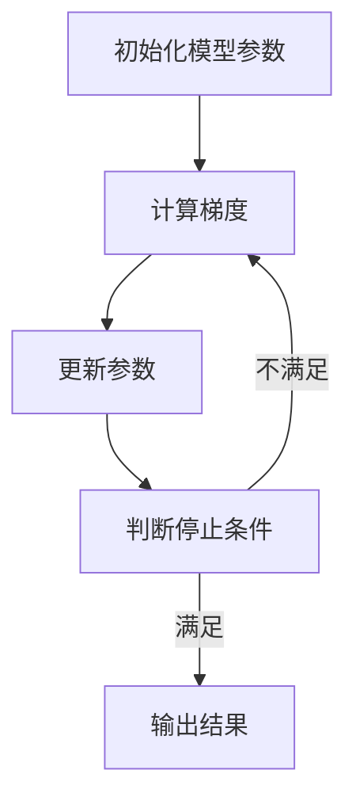
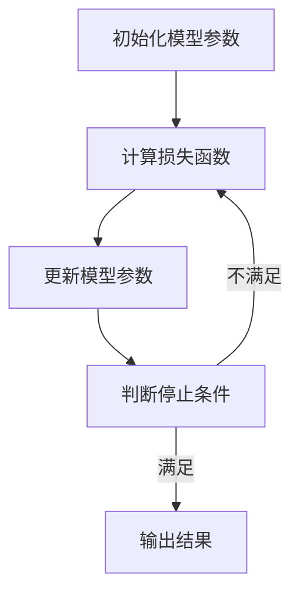
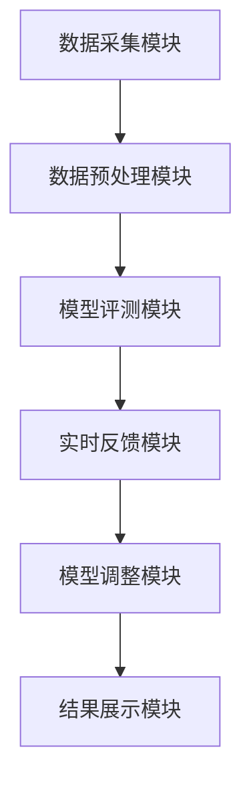
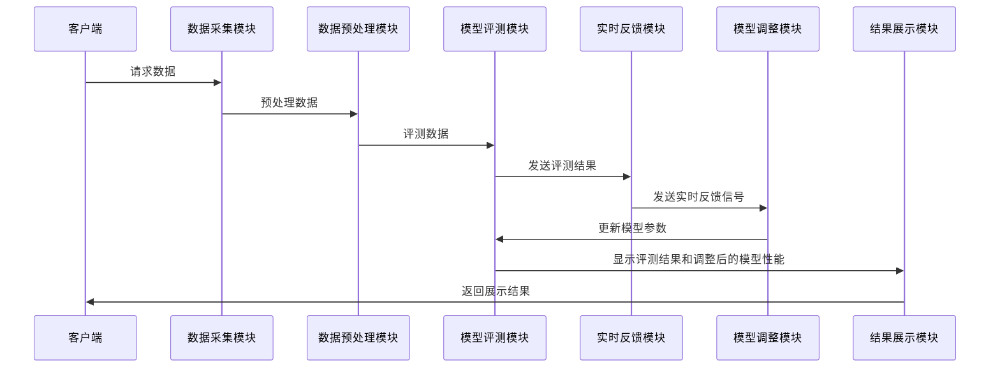

                 

### 第1章: LLM评测实时反馈机制概述

#### 1.1 问题背景

随着人工智能的飞速发展，大型语言模型（Large Language Model，简称LLM）在自然语言处理（Natural Language Processing，简称NLP）领域取得了显著的成果。LLM具备强大的语言理解与生成能力，被广泛应用于聊天机器人、文本生成、机器翻译等领域。然而，LLM的性能优化是一个复杂且不断迭代的过程，传统的方法通常需要较长时间才能完成一轮优化，难以满足实时性需求。

实时反馈机制的出现为LLM的性能优化带来了新的契机。实时反馈机制能够在模型生成结果的同时，立即对结果进行评测和反馈，从而指导模型进行即时调整。这种机制在提升模型性能、缩短优化周期、提高开发效率方面具有重要意义。然而，如何设计高效、可靠的实时反馈机制，仍然是一个亟待解决的问题。

#### 1.2 核心概念与联系

为了深入探讨LLM评测实时反馈机制，首先需要理解几个核心概念：

1. **LLM（大型语言模型）**：一种能够对自然语言进行理解和生成的模型，通常由数以亿计的参数组成。
2. **评测指标**：用于衡量LLM性能的量化标准，如准确性、召回率、F1值等。
3. **实时反馈机制**：一种能够在模型输出结果后，立即对结果进行评测和反馈的机制。

这些概念之间存在紧密的联系。LLM的性能优化依赖于对评测指标的精确测量，而实时反馈机制则为评测指标的实时获取和模型调整提供了可能。

#### 1.3 研究现状与趋势

目前，关于LLM评测实时反馈机制的研究主要集中在以下几个方面：

1. **实时评测算法**：研究如何快速、准确地计算评测指标，以满足实时反馈的需求。
2. **反馈机制设计**：探讨如何设计高效、可靠的实时反馈机制，以实现模型性能的持续优化。
3. **优化算法与策略**：研究如何利用实时反馈结果，制定有效的优化策略，以提升模型性能。

未来，随着硬件性能的提升和算法的改进，实时反馈机制在LLM性能优化中的应用将越来越广泛。同时，多模态数据融合、自适应学习等新技术的引入，也将为实时反馈机制的研究带来新的挑战和机遇。

#### 1.4 本书结构安排

本书将从以下几个方面展开对LLM评测实时反馈机制的研究：

1. **第1章**：介绍LLM评测实时反馈机制的基本概念、问题背景和研究现状。
2. **第2章**：详细讲解LLM评测方法的算法原理，包括评测指标、实时反馈算法等。
3. **第3章**：探讨实时反馈机制的系统设计与实现，包括系统架构、接口设计、交互设计等。
4. **第4章**：通过案例分析，展示实时反馈机制在LLM性能优化中的应用效果。

通过本书的学习，读者将能够系统地了解LLM评测实时反馈机制的原理、设计方法及其在实际应用中的效果。

#### 1.5 本章小结

本章主要介绍了LLM评测实时反馈机制的基本概念、问题背景、核心概念与联系以及研究现状与趋势。通过对这些内容的了解，读者可以对LLM评测实时反馈机制有一个全面的了解，为后续章节的学习打下基础。

---

在下一章中，我们将深入探讨LLM评测方法的算法原理，包括评测指标的选择、实时反馈算法的设计等内容。请读者继续关注。

### 1.1.1 LLM的快速发展与需求

大型语言模型（Large Language Model，简称LLM）的快速发展是近年来人工智能领域的一大亮点。得益于深度学习和大数据技术的进步，LLM在语言理解和生成方面取得了前所未有的成果。GPT、BERT、T5等代表性模型的出现，使得机器在处理自然语言任务时的表现越来越接近人类水平。

LLM的快速发展源于多方面的需求。首先，随着互联网的普及和信息爆炸，人们对自然语言处理的需求日益增长。无论是搜索引擎、智能客服、机器翻译，还是内容生成、情感分析，LLM都展示出了强大的应用潜力。其次，企业在数字化转型过程中，对自动化、智能化的需求不断升级，这也推动了LLM技术的发展。

在实际应用中，LLM在多个领域取得了显著成果。例如，在机器翻译领域，基于LLM的翻译系统已经能够实现接近人类的翻译质量。在智能客服领域，LLM被用于构建能够理解和回应用户问题的聊天机器人。在内容生成领域，LLM被用于生成新闻文章、小说、代码等，极大地提高了内容生产的效率。

然而，LLM的快速发展也带来了新的挑战。由于LLM的参数量巨大，模型的训练和推理过程需要大量的计算资源和时间。此外，LLM在处理某些特定任务时，仍存在不足之处，如对于多义词的理解、上下文信息的捕捉等。因此，如何优化LLM的性能，使其更好地满足实际应用需求，成为了一个重要的研究方向。

实时反馈机制在LLM性能优化中的应用，正是为了应对这些挑战。通过实时反馈，模型可以立即了解到当前生成的结果，并进行相应的调整。这种即时调整能够显著提高模型在特定任务上的表现，从而更好地满足实际应用需求。

#### 1.1.2 评测实时反馈机制的重要性

评测实时反馈机制在LLM性能优化中起着至关重要的作用。其重要性主要体现在以下几个方面：

首先，实时反馈能够显著提高模型的优化效率。传统的模型优化过程通常需要通过多次迭代和评测来逐渐提升模型性能，这往往耗时较长。而实时反馈机制可以在每次生成结果后，立即对结果进行评测和反馈，指导模型进行即时调整。这种方式能够大幅缩短优化周期，提高模型性能提升的速度。

其次，实时反馈机制能够帮助模型更好地适应不同的任务场景。不同的任务场景对模型的性能要求各异，实时反馈机制能够根据当前的生成结果，快速调整模型参数，使其更好地适应特定任务的需求。例如，在智能客服领域，实时反馈机制可以帮助模型快速适应不同的用户提问，提高回答的准确性和满意度。

此外，实时反馈机制还能够提升模型对异常情况的应对能力。在实际应用中，模型可能会遇到各种异常情况，如输入数据的异常、模型的过拟合等。实时反馈机制能够通过即时反馈，及时发现并纠正这些问题，从而提高模型的鲁棒性。

然而，实时反馈机制在实际应用中也面临一些挑战。首先，实时反馈需要快速计算评测指标，这对计算资源提出了较高的要求。其次，实时反馈机制需要设计高效、可靠的算法，以确保反馈的准确性和稳定性。此外，实时反馈机制需要与模型训练过程紧密集成，以实现无缝的即时调整。

总之，评测实时反馈机制在LLM性能优化中具有重要作用，能够显著提高模型的优化效率和适应能力。然而，设计高效、可靠的实时反馈机制，仍然是一个亟待解决的问题。接下来，我们将深入探讨LLM评测方法的算法原理，以期为实时反馈机制的设计提供理论基础。

#### 1.1.3 实时反馈机制面临的挑战

实时反馈机制虽然在LLM性能优化中具有重要作用，但其设计与应用过程中也面临着诸多挑战。以下是几个主要挑战及应对策略：

**1. 性能计算效率问题**

实时反馈机制需要在每次生成结果后，快速计算评测指标。然而，某些评测指标（如BLEU、ROUGE等）的计算复杂度较高，难以在短时间内完成。这会导致实时反馈的延迟，从而影响模型的即时调整。应对策略包括优化评测指标的计算算法，利用并行计算和分布式计算技术，以提高计算效率。

**2. 实时性保障问题**

实时反馈机制需要在极短的时间内完成评测和反馈，这对系统的响应速度提出了严格要求。然而，在处理大规模数据和复杂模型时，系统的延迟往往难以避免。为了保障实时性，可以采用以下策略：首先，优化模型结构和算法，减少计算量；其次，利用高效的存储和传输技术，加快数据读写速度；最后，采用轻量级评测算法和简化版评测指标，以减少计算和传输开销。

**3. 模型参数调整问题**

实时反馈机制需要对模型参数进行即时调整，以优化模型性能。然而，参数调整过程需要平衡模型性能和训练时间。如果调整过于频繁，可能导致模型不稳定；而调整过于缓慢，则可能无法充分发挥实时反馈的优势。应对策略包括：首先，采用自适应学习率调整策略，根据当前任务的需求动态调整学习率；其次，设计稳健的参数调整算法，避免过度调整导致的模型崩溃。

**4. 模型鲁棒性问题**

实时反馈机制需要在各种情况下保持稳定的性能，这对模型的鲁棒性提出了较高要求。然而，实际应用中可能会遇到数据分布变化、输入异常等情况，导致模型性能下降。应对策略包括：首先，对模型进行预训练，使其能够适应多样化的数据分布；其次，设计鲁棒性检测和修正算法，及时发现并纠正模型中的异常。

**5. 数据隐私和安全问题**

在实时反馈机制中，模型生成的结果和参数调整信息可能涉及用户隐私和数据安全。因此，在设计实时反馈机制时，需要考虑数据加密、隐私保护等技术，确保用户数据和模型参数的安全性。应对策略包括：首先，采用加密算法对敏感数据进行加密处理；其次，设计安全的通信协议，防止数据在传输过程中被窃取。

综上所述，实时反馈机制在LLM性能优化中具有重要意义，但其设计与应用过程中也面临着一系列挑战。通过优化算法、提升计算效率、设计稳健的参数调整算法以及保障数据安全和隐私，可以有效地应对这些挑战，实现高效的实时反馈机制。

#### 1.2.1 LLM的基本概念

大型语言模型（Large Language Model，简称LLM）是一种基于深度学习技术的自然语言处理模型，具有强大的语言理解和生成能力。LLM的核心思想是通过大规模的语料库进行训练，使得模型能够对自然语言进行建模，从而实现文本生成、翻译、问答等任务。

首先，LLM的**定义**可以概括为：一种能够对自然语言文本进行建模和预测的深度学习模型，通常由数十亿个参数组成。这些参数通过训练学习到文本中的语法、语义和上下文信息，从而能够生成或理解符合人类语言习惯的文本。

LLM的**核心特性**包括：

1. **参数量巨大**：LLM通常拥有数以亿计的参数，这使得模型在语言理解上具有很高的精度和泛化能力。
2. **上下文捕捉能力强**：通过长期依赖模型（Long Short-Term Memory，LSTM）或Transformer等先进结构，LLM能够捕捉到文本中的长距离依赖关系，从而更好地理解上下文信息。
3. **生成能力强**：LLM不仅能够理解文本，还能够生成高质量的文本，这在文本生成、问答系统和机器翻译等任务中具有重要意义。
4. **可扩展性强**：LLM通常采用模块化设计，可以通过增加参数量或调整模型结构来适应不同的应用场景。

LLM的发展历程可以追溯到2000年代初期，最初的模型如基于统计方法的n-gram模型和基于规则的模型。随着深度学习技术的兴起，特别是2018年GPT-1的发布，标志着LLM进入了全新的发展阶段。随后，GPT-2、GPT-3、BERT、T5等模型的发布，不断推动着LLM在语言理解与生成任务上的性能提升。

在应用场景方面，LLM已经广泛应用于多个领域，包括：

1. **机器翻译**：LLM在机器翻译中表现出色，通过训练多语言语料库，可以实现高精度的翻译结果。
2. **文本生成**：LLM可以生成各种类型的文本，如文章、小说、新闻摘要、代码等，极大地提高了内容生产的效率。
3. **问答系统**：LLM能够理解用户的问题，并生成相关且准确的回答，广泛应用于智能客服、教育辅导等场景。
4. **文本分类**：LLM可以用于对大量文本进行分类，如情感分析、主题分类等，为企业和研究机构提供重要的数据分析支持。

总之，LLM作为自然语言处理领域的重要技术，通过不断的发展和完善，已经实现了许多具有实际应用价值的功能。接下来，我们将进一步探讨实时反馈机制的定义与分类。

#### 1.2.2 实时反馈机制的定义与分类

实时反馈机制是一种在模型输出结果后，立即对结果进行评测和反馈，以便模型能够进行即时调整的机制。这种机制在提高模型性能、缩短优化周期、提升开发效率方面具有重要意义。以下是实时反馈机制的定义与分类：

**1. 定义**

实时反馈机制的定义可以概括为：一种能够在模型生成结果后，迅速对其进行评测，并将反馈信息用于指导模型调整的机制。其主要目标是通过及时调整模型参数，提高模型在特定任务上的性能。

**2. 分类**

根据反馈的方式和机制，实时反馈机制可以分为以下几类：

- **基于梯度的实时反馈**：这种机制通过计算模型输出结果与预期结果之间的梯度，来指导模型参数的调整。常用的方法包括梯度下降法、动量法等。
  
- **基于模型调整的实时反馈**：这种机制通过直接调整模型参数，而不是依赖梯度信息，来实现模型的即时优化。常见的算法包括元学习、强化学习等。

- **基于模型的实时反馈**：这种机制通过对模型结构进行调整，来实现模型的即时优化。例如，可以动态调整模型的层数、隐藏层节点数等。

- **基于数据的实时反馈**：这种机制通过实时更新训练数据，来指导模型调整。例如，可以动态增加或删除训练样本，以适应不同的任务需求。

**3. 优点与局限性**

不同类型的实时反馈机制具有各自的优缺点：

- **基于梯度的实时反馈**：优点是能够快速调整模型参数，提高模型性能；缺点是对计算资源要求较高，且在复杂模型中容易出现梯度消失或梯度爆炸问题。

- **基于模型调整的实时反馈**：优点是调整过程直接，计算效率较高；缺点是可能需要较长时间的训练，且在多任务场景中效果可能不如基于梯度的方法。

- **基于模型的实时反馈**：优点是能够灵活调整模型结构，适应不同任务需求；缺点是调整过程复杂，且需要大量的训练数据。

- **基于数据的实时反馈**：优点是能够实时适应任务变化，提高模型性能；缺点是需要频繁更新训练数据，对数据管理和存储提出了较高要求。

综上所述，实时反馈机制在LLM性能优化中具有重要作用。通过合理选择和设计实时反馈机制，可以显著提高模型的优化效率和性能。接下来，我们将进一步探讨实时反馈机制的研究现状与未来发展趋势。

#### 1.3.1 现有实时反馈机制总结

目前，关于实时反馈机制的研究已经取得了显著进展，各类方法在实际应用中展现了不同的效果。以下是几种常见的实时反馈机制及其在LLM评测中的应用总结：

1. **基于梯度的实时反馈**：
   - **方法**：这种方法通过计算模型输出结果与预期结果之间的梯度，实时调整模型参数，以优化模型性能。
   - **优点**：计算速度快，能够迅速调整模型参数，提高模型性能。
   - **局限性**：在高复杂度的模型中，容易出现梯度消失或梯度爆炸问题，对计算资源要求较高。
   - **应用**：在文本生成、问答系统和机器翻译等任务中，基于梯度的实时反馈机制被广泛应用于优化模型性能。

2. **基于模型调整的实时反馈**：
   - **方法**：这种方法通过直接调整模型参数，而不是依赖梯度信息，来实现模型的即时优化。
   - **优点**：计算效率较高，能够避免梯度消失或梯度爆炸问题，适用于多任务场景。
   - **局限性**：可能需要较长时间的训练，无法充分利用实时反馈的优势。
   - **应用**：在智能客服和内容生成等领域，基于模型调整的实时反馈机制被用于实现模型的快速适应和优化。

3. **基于模型的实时反馈**：
   - **方法**：这种方法通过对模型结构进行调整，来实现模型的即时优化。
   - **优点**：能够灵活调整模型结构，适应不同任务需求。
   - **局限性**：调整过程复杂，需要大量的训练数据。
   - **应用**：在多模态数据处理和复杂任务场景中，基于模型的实时反馈机制被用于提高模型性能。

4. **基于数据的实时反馈**：
   - **方法**：这种方法通过实时更新训练数据，来指导模型调整。
   - **优点**：能够实时适应任务变化，提高模型性能。
   - **局限性**：需要频繁更新训练数据，对数据管理和存储提出了较高要求。
   - **应用**：在动态环境变化和实时任务处理中，基于数据的实时反馈机制被用于实现模型的动态适应和优化。

总体来看，现有的实时反馈机制在LLM评测中发挥了重要作用，各类方法各有优缺点。在实际应用中，可以根据具体任务需求和场景选择合适的实时反馈机制，以实现模型性能的优化。接下来，我们将进一步探讨当前实时反馈机制的研究趋势和未来发展方向。

#### 1.3.2 当前研究趋势分析

当前，实时反馈机制在LLM评测中的应用正处于快速发展阶段，研究趋势主要集中在以下几个方面：

**1. 算法优化**

随着LLM模型复杂度的增加，传统的实时反馈算法如梯度下降法在处理高维数据和深层网络时，容易出现梯度消失和梯度爆炸问题，导致模型训练效果不佳。因此，研究趋势之一是优化实时反馈算法，提高其在复杂模型中的应用效果。例如，自适应学习率调整、动量法、Adam优化器等算法的改进，以及深度自适应优化（Deep Adaptive Optimization）等新兴算法的开发，都在尝试解决这一问题。

**2. 计算效率提升**

实时反馈机制对计算效率要求较高，尤其是在大规模数据处理和复杂模型训练中。当前的研究趋势之一是提升计算效率，包括利用分布式计算和并行计算技术，优化算法的时空复杂度，以及设计更加高效的计算框架。例如，TensorFlow、PyTorch等深度学习框架的不断优化，以及GPU、TPU等硬件的广泛应用，都为实时反馈机制的计算效率提升提供了有力支持。

**3. 多模态数据融合**

传统的实时反馈机制主要针对单一模态的数据进行处理，但随着多模态数据在自然语言处理中的应用越来越广泛，如何将不同模态的数据进行有效融合，成为一个重要的研究方向。当前的研究趋势包括多模态深度学习模型的开发、跨模态特征提取和融合技术的创新，以及基于多模态数据的实时反馈机制设计。例如，融合文本、图像、语音等多模态数据的动态融合算法，以及基于注意力机制的跨模态特征提取方法，都在尝试提升多模态数据的实时处理能力。

**4. 鲁棒性与安全性**

实时反馈机制在应用过程中，面临着数据隐私、安全性和鲁棒性等问题。当前的研究趋势之一是提高实时反馈机制的鲁棒性和安全性。例如，通过数据加密、差分隐私技术等手段，保护用户数据的隐私；通过设计鲁棒性检测和修正算法，提高模型在异常情况下的适应能力；以及通过安全通信协议，确保实时反馈过程中的数据传输安全。

**5. 智能自适应**

实时反馈机制的一个关键挑战是如何根据任务需求和环境变化，自适应地调整模型参数。当前的研究趋势之一是开发智能自适应的实时反馈机制，包括基于强化学习的自适应调整策略、基于元学习的自适应模型优化方法等。这些方法旨在通过学习任务和环境的特征，实现模型参数的动态调整，从而提高模型的实时性能和适应性。

综上所述，当前实时反馈机制在LLM评测中的应用研究呈现出算法优化、计算效率提升、多模态数据融合、鲁棒性与安全性、智能自适应等五大趋势。这些研究方向的进展，将为实时反馈机制在实际应用中的效果提升提供有力支持。接下来，我们将探讨未来发展方向，展望实时反馈机制在LLM评测中的应用前景。

#### 1.3.3 未来发展方向预测

随着人工智能技术的不断进步，实时反馈机制在LLM评测中的应用将迎来新的发展机遇。以下是对未来发展方向的一些预测：

**1. 深度学习模型的优化**

未来，深度学习模型的优化将是实时反馈机制发展的一个重要方向。随着模型规模的增大和计算需求的提升，传统的实时反馈算法需要进一步优化，以适应更高效和更准确的模型训练。例如，分布式训练、多GPU并行计算等技术将进一步成熟，使得实时反馈机制能够处理更大的模型和数据集。

**2. 多模态数据融合**

随着多模态数据在自然语言处理中的应用越来越广泛，实时反馈机制将需要更加灵活和智能的数据融合方法。未来，结合文本、图像、语音等多模态数据的实时反馈机制将成为研究热点。例如，利用注意力机制和图神经网络等技术，可以实现对多模态数据的深度融合，从而提升模型在多任务场景中的表现。

**3. 强化学习与元学习的结合**

强化学习和元学习技术的引入，将使实时反馈机制更加智能化和自适应。通过将强化学习中的策略优化与元学习中的模型优化相结合，可以实现更高效、更稳健的实时反馈。例如，基于强化学习的自适应调整策略可以动态调整模型参数，以适应不断变化的任务需求；而元学习技术可以帮助模型从以往的任务中学习，提高新任务的适应能力。

**4. 鲁棒性与安全性提升**

在实时反馈机制的实际应用中，鲁棒性和安全性至关重要。未来，随着数据隐私和安全问题的日益突出，实时反馈机制将需要更多的安全性和隐私保护技术。例如，差分隐私、联邦学习等技术的应用，可以在保护用户数据隐私的同时，实现高效的实时反馈。

**5. 自适应实时反馈**

自适应实时反馈是未来发展的另一个重要方向。通过引入自适应学习率调整、自适应参数调整等机制，实时反馈能够更加灵活地应对不同的任务场景。例如，在对话系统中，自适应实时反馈可以根据用户的反馈和历史交互数据，动态调整回答策略，以提供更优质的用户体验。

**6. 专业化与定制化**

随着应用场景的多样化，实时反馈机制将更加专业化与定制化。针对不同的任务需求和应用场景，实时反馈机制需要能够灵活调整和优化。例如，在医疗领域，实时反馈机制可以用于辅助诊断和治疗方案优化；在金融领域，可以用于风险评估和交易策略调整。

总之，未来实时反馈机制在LLM评测中的应用将更加智能化、多样化、安全化和专业化。通过不断的技术创新和优化，实时反馈机制将在更多领域发挥重要作用，推动人工智能技术的进一步发展。

#### 1.4.1 各章节内容概述

本书将从以下几个方面对LLM评测实时反馈机制进行深入探讨：

- **第1章：LLM评测实时反馈机制概述**：介绍LLM评测实时反馈机制的基本概念、问题背景、研究现状与趋势。本章将为后续章节提供理论基础。
  
- **第2章：LLM评测方法**：详细讲解LLM评测方法，包括评测指标的选择、实时反馈算法的设计等。本章将阐述实时反馈机制的核心算法原理。
  
- **第3章：实时反馈机制的系统设计与实现**：探讨实时反馈机制的系统设计与实现，包括系统架构、接口设计、交互设计等。本章将展示如何将实时反馈机制应用于实际系统。
  
- **第4章：成功案例分析**：通过具体案例，展示实时反馈机制在实际应用中的效果。本章将提供实际应用的经验和教训。

通过本书的学习，读者将能够系统地了解LLM评测实时反馈机制的原理、设计方法及其在实际应用中的效果。希望本书能够为研究人员和实践者提供有价值的参考。

#### 1.4.2 阅读指引与预期收获

为了更好地理解LLM评测实时反馈机制，本书为读者提供了详细的阅读指引和预期收获：

- **阅读顺序**：建议读者按照章节顺序依次阅读，从基础概念开始，逐步深入到具体实现和应用案例。

- **阅读目标**：通过本书的学习，读者应达到以下目标：
  - 掌握LLM评测实时反馈机制的基本概念和原理。
  - 了解实时反馈机制在不同应用场景下的设计方法和实现技巧。
  - 学习成功案例，了解实时反馈机制在实际应用中的效果和挑战。

- **章节重点**：
  - **第1章**：重点掌握LLM和实时反馈机制的基本概念，理解实时反馈机制的重要性。
  - **第2章**：重点理解实时反馈算法的原理，掌握评测指标的选择和计算方法。
  - **第3章**：重点学习实时反馈机制的系统设计与实现，了解系统架构和接口设计。
  - **第4章**：重点通过案例分析，了解实时反馈机制在具体应用中的效果和优化策略。

- **预期收获**：通过本书的学习，读者应能够：
  - 设计并实现一个简单的实时反馈系统。
  - 评估和优化现有实时反馈机制，提高模型性能。
  - 应用实时反馈机制解决实际应用中的问题，提高开发效率。

希望本书能够为读者在LLM评测实时反馈机制的研究和应用中提供有力的支持和指导。

### 1.5 本章小结

本章首先介绍了LLM评测实时反馈机制的基本概念，包括LLM的定义、核心特性以及实时反馈机制的定义和分类。接着，我们探讨了LLM的快速发展与需求，以及实时反馈机制的重要性。随后，我们分析了实时反馈机制面临的挑战，并总结了现有研究趋势和未来发展方向。最后，我们概述了本书的结构安排，并提供了阅读指引与预期收获。

通过本章的学习，读者应该对LLM评测实时反馈机制有一个初步的了解，为后续章节的深入学习打下基础。在下一章中，我们将深入探讨LLM评测方法的算法原理，包括评测指标、实时反馈算法等。敬请期待！

---

在下一章中，我们将详细讲解LLM评测方法的算法原理，包括评测指标、实时反馈算法等，为读者进一步理解实时反馈机制奠定基础。请继续关注。

### 第2章: LLM评测方法

#### 2.1 评测指标

在LLM评测过程中，选择合适的评测指标是至关重要的。评测指标用于衡量模型在特定任务上的性能，直接影响模型的优化方向和最终效果。以下是几种常见的评测指标：

**1. 准确率（Accuracy）**

准确率是衡量分类模型性能的最基本指标，表示正确分类的样本占总样本的比例。其计算公式为：

\[ \text{Accuracy} = \frac{\text{正确分类的样本数}}{\text{总样本数}} \]

准确率适用于二分类或多分类任务，但在面对类别不平衡的数据时，可能会偏向于占比例较大的类别。

**2. 召回率（Recall）**

召回率是指模型能够正确召回的实际正例样本数与实际正例样本总数的比例。其计算公式为：

\[ \text{Recall} = \frac{\text{正确召回的正例样本数}}{\text{实际正例样本总数}} \]

召回率关注的是模型对于正例样本的识别能力，尤其在医疗诊断等任务中具有重要应用。

**3. 精确率（Precision）**

精确率是指模型预测为正例的样本中，实际为正例的比例。其计算公式为：

\[ \text{Precision} = \frac{\text{正确召回的正例样本数}}{\text{预测为正例的样本数}} \]

精确率关注的是模型预测结果的准确性，适用于对预测准确性要求较高的任务。

**4. F1值（F1 Score）**

F1值是精确率和召回率的调和平均，能够综合反映模型的分类性能。其计算公式为：

\[ \text{F1 Score} = 2 \times \frac{\text{Precision} \times \text{Recall}}{\text{Precision} + \text{Recall}} \]

F1值在类别不平衡和数据分布不均匀的情况下，能够提供更全面的模型性能评估。

**5. 交叉验证（Cross-Validation）**

交叉验证是一种评估模型性能的方法，通过将数据集划分为训练集和验证集，多次训练和验证，以避免数据集划分的偶然性。常见的交叉验证方法有K折交叉验证、留一法交叉验证等。

**6. BLEU（BiLingual Evaluation Understudy）**

BLEU是一种广泛用于机器翻译性能评估的指标，通过比较机器翻译结果与参考翻译的相似度，计算相似度分数。BLEU的主要计算步骤包括：
- **N-gram匹配**：计算翻译结果与参考翻译中连续N个词的匹配程度。
- **长度惩罚**：考虑到长翻译通常更准确，对长度差异进行惩罚。
- **重排惩罚**：考虑翻译结果中词序的重排，对不符合词序的翻译进行惩罚。

**7. ROUGE（Recall-Oriented Understudy for Gisting Evaluation）**

ROUGE是一种用于评估文本生成、摘要生成等任务性能的指标，主要关注生成文本与参考文本的召回率。ROUGE的计算步骤包括：
- **词匹配**：计算生成文本与参考文本的词匹配程度。
- **词性匹配**：考虑生成文本与参考文本中的词性匹配。
- **句子匹配**：考虑生成文本与参考文本的句子匹配程度。

#### 2.1.2 评测指标对比分析

不同评测指标在衡量模型性能时具有不同的侧重点，因此需要根据具体任务选择合适的评测指标。以下是几种常见评测指标的对比分析：

- **准确率、召回率、精确率和F1值**：这些指标适用于分类任务，能够综合反映模型的分类性能。准确率关注总体分类正确性，召回率关注正例样本的识别能力，精确率关注预测准确性，F1值则是精确率和召回率的调和平均。
- **BLEU和ROUGE**：这些指标适用于生成任务，如机器翻译和文本生成。BLEU主要关注翻译结果的词匹配和长度，ROUGE主要关注生成文本与参考文本的词和句子的匹配。

选择评测指标时，应考虑以下因素：

- **任务类型**：不同任务对模型性能的侧重点不同，选择与任务类型相匹配的评测指标。
- **数据分布**：在数据分布不均匀的情况下，某些指标可能会偏向某些类别。
- **模型特点**：某些指标可能更适合某些类型的模型。

#### 2.1.3 评测指标选择策略

在实际应用中，选择合适的评测指标是提高模型性能的关键。以下是几种常见的评测指标选择策略：

- **单一指标选择**：在某些任务中，可以选择一个主要的评测指标作为性能评估标准。例如，在文本分类任务中，可以选择F1值作为主要指标。
- **综合指标选择**：在某些复杂任务中，可以选择多个评测指标进行综合评估。例如，在机器翻译任务中，可以同时考虑BLEU和ROUGE等指标。
- **动态指标选择**：根据任务需求和数据变化，动态调整评测指标。例如，在实时反馈机制中，可以根据当前任务的需求选择合适的评测指标。
- **个性化指标选择**：针对特定应用场景和用户需求，定制化设计评测指标。例如，在医疗诊断任务中，可以设计针对诊断准确率、诊断速度等多方面的评测指标。

总之，合理选择评测指标对于模型性能的评估和优化具有重要意义。在实际应用中，应根据任务特点、数据分布和用户需求，灵活选择和调整评测指标。

#### 2.2 实时反馈算法原理

实时反馈算法是LLM评测中的核心组成部分，它负责在模型生成结果后，立即对结果进行评测和反馈，以指导模型的调整和优化。实时反馈算法的原理主要包括基于梯度的反馈算法和基于模型调整的反馈算法。以下将对这两种算法进行详细讲解。

**2.2.1 基于梯度调整的实时反馈**

基于梯度调整的实时反馈算法是通过计算模型输出结果与预期结果之间的梯度，来指导模型参数的调整。这种方法的基本思想是利用梯度信息，找到模型参数的调整方向，以减少输出结果与预期结果的差距。

**1. 梯度下降法**

梯度下降法是一种最基本的优化算法，其核心思想是沿着梯度的反方向调整模型参数，以减少损失函数的值。梯度下降法的步骤如下：

（1）**初始化模型参数**：设定一个初始的参数值，通常使用随机初始化方法。

（2）**计算梯度**：对于每个参数，计算其在当前模型参数下的梯度。

（3）**更新参数**：根据梯度信息更新模型参数，公式为：

\[ \theta = \theta - \alpha \cdot \nabla \theta \]

其中，\( \theta \) 为模型参数，\( \alpha \) 为学习率，\( \nabla \theta \) 为参数的梯度。

（4）**迭代更新**：重复以上步骤，直到满足停止条件（如损失函数值变化较小或达到最大迭代次数）。

梯度下降法的优点是计算简单、易于实现，缺点是对学习率的选择敏感，容易陷入局部最小值。

**2. 动量法**

动量法是对梯度下降法的一种改进，通过引入动量项，加速梯度下降过程，并减少震荡。动量法的公式为：

\[ \theta = \theta - \alpha \cdot \nabla \theta + \beta \cdot v \]

其中，\( v \) 为动量项，\( \beta \) 为动量系数。

动量法的优点是能够加速收敛，减少震荡，缺点是参数调整过程复杂。

**3. Adam优化器**

Adam优化器是另一种常见的优化器，结合了动量法和自适应学习率调整。Adam优化器的公式为：

\[ \theta = \theta - \alpha \cdot \frac{m}{\sqrt{v} + \epsilon} \]

其中，\( m \) 为一阶矩估计，\( v \) 为二阶矩估计，\( \alpha \) 为学习率，\( \epsilon \) 为小常数。

Adam优化器的优点是计算简单、收敛速度快、适用于不同类型的问题，缺点是计算量较大。

**2.2.2 基于模型调整的实时反馈**

基于模型调整的实时反馈算法是通过直接调整模型参数，而不是依赖梯度信息，来指导模型的优化。这种方法通常利用元学习（Meta-Learning）和强化学习（Reinforcement Learning）等技术来实现。

**1. 元学习**

元学习是一种通过学习如何学习的方法，其目标是从过去的经验中学习到有效的学习策略，从而在新的任务上快速适应。元学习的主要方法包括模型适应（Model Adaptation）和样本适应（Sample Adaptation）。

（1）**模型适应**：在模型适应方法中，模型在新的任务上通过微调来适应，而不是重新训练。模型适应的公式为：

\[ \theta' = \theta + \alpha \cdot (\theta_{new} - \theta) \]

其中，\( \theta \) 为当前模型参数，\( \theta_{new} \) 为新任务的模型参数，\( \alpha \) 为学习率。

（2）**样本适应**：在样本适应方法中，模型在新任务的样本上进行微调，而不是在整体模型上进行。样本适应的公式为：

\[ \theta' = \theta + \alpha \cdot (\theta_{new} - \theta) \]

其中，\( \theta \) 为当前模型参数，\( \theta_{new} \) 为新任务的模型参数，\( \alpha \) 为学习率。

**2. 强化学习**

强化学习是一种通过试错来学习最优策略的方法。在强化学习过程中，模型通过与环境的交互，不断调整策略，以最大化累积奖励。

（1）**Q学习**：Q学习是一种基于值函数的强化学习方法，通过学习状态-动作值函数，来指导模型选择最优动作。Q学习的公式为：

\[ Q(s, a) = Q(s, a) + \alpha \cdot (r + \gamma \cdot \max_{a'} Q(s', a') - Q(s, a)) \]

其中，\( s \) 为当前状态，\( a \) 为当前动作，\( r \) 为奖励，\( \gamma \) 为折扣因子，\( s' \) 为下一状态，\( a' \) 为下一动作。

（2）**策略梯度**：策略梯度方法通过直接优化策略函数来指导模型选择最优动作。策略梯度的公式为：

\[ \theta = \theta + \alpha \cdot \nabla_{\theta} J(\theta) \]

其中，\( \theta \) 为模型参数，\( \alpha \) 为学习率，\( J(\theta) \) 为策略损失函数。

基于模型调整的实时反馈算法的优点是能够直接调整模型参数，无需依赖梯度信息，适用于复杂模型和动态环境。缺点是需要较长时间的训练和计算资源。

综上所述，实时反馈算法在LLM评测中扮演着重要角色，基于梯度和基于模型调整的算法各有优缺点，可以根据具体应用场景选择合适的方法。接下来，我们将绘制算法流程图，以帮助读者更好地理解实时反馈算法的工作原理。

#### 2.3 算法流程图

为了更好地理解实时反馈算法的工作原理，我们分别绘制了基于梯度和基于模型调整的实时反馈算法的流程图。以下是详细的流程图说明：

**2.3.1 基于梯度的实时反馈算法流程图**



**说明**：

1. **初始化模型参数**：设置初始模型参数，通常使用随机初始化方法。
2. **计算梯度**：计算当前模型参数下的梯度信息。
3. **更新参数**：根据梯度信息更新模型参数。
4. **判断停止条件**：检查是否满足停止条件（如损失函数值变化较小或达到最大迭代次数）。
5. **输出结果**：满足停止条件后，输出最终的模型参数和评测结果。

**2.3.2 基于模型调整的实时反馈算法流程图**



**说明**：

1. **初始化模型参数**：设置初始模型参数，通常使用随机初始化方法。
2. **计算损失函数**：计算当前模型参数下的损失函数值。
3. **更新模型参数**：根据损失函数值更新模型参数。
4. **判断停止条件**：检查是否满足停止条件（如损失函数值变化较小或达到最大迭代次数）。
5. **输出结果**：满足停止条件后，输出最终的模型参数和评测结果。

通过上述流程图，我们可以清晰地看到实时反馈算法的基本步骤和逻辑关系。在实际应用中，可以根据具体需求选择合适的算法，并对其进行优化和调整。

#### 2.4 算法数学模型与公式

在实时反馈算法中，数学模型和公式是核心组成部分，它们用于描述模型参数的更新过程和优化目标。以下将详细阐述基于梯度和基于模型调整的实时反馈算法的数学模型与公式。

**2.4.1 梯度调整算法的数学模型**

基于梯度的实时反馈算法主要依赖梯度信息来调整模型参数。以下是几种常用的梯度调整算法及其数学模型：

**1. 梯度下降法**

梯度下降法的核心思想是沿着梯度的反方向更新模型参数，以减少损失函数的值。其数学模型如下：

\[ \theta = \theta - \alpha \cdot \nabla \theta \]

其中，\( \theta \) 表示模型参数，\( \alpha \) 表示学习率，\( \nabla \theta \) 表示模型参数的梯度。

**2. 动量法**

动量法引入动量项，以加速梯度下降过程，并减少震荡。其数学模型如下：

\[ \theta = \theta - \alpha \cdot \nabla \theta + \beta \cdot v \]

其中，\( v \) 表示动量项，\( \beta \) 表示动量系数。

**3. Adam优化器**

Adam优化器结合了一阶矩估计（一阶矩估计，\( m \)）和二阶矩估计（二阶矩估计，\( v \)），以自适应调整学习率。其数学模型如下：

\[ \theta = \theta - \alpha \cdot \frac{m}{\sqrt{v} + \epsilon} \]

其中，\( m \) 表示一阶矩估计，\( v \) 表示二阶矩估计，\( \alpha \) 表示学习率，\( \epsilon \) 表示小常数。

**2.4.2 模型调整算法的数学模型**

基于模型调整的实时反馈算法直接调整模型参数，以实现模型优化。以下是几种常用的模型调整算法及其数学模型：

**1. 元学习**

元学习通过学习有效的学习策略，来实现对新任务的快速适应。以下是基于模型适应和样本适应的元学习数学模型：

**模型适应**：

\[ \theta' = \theta + \alpha \cdot (\theta_{new} - \theta) \]

其中，\( \theta \) 表示当前模型参数，\( \theta_{new} \) 表示新任务的模型参数，\( \alpha \) 表示学习率。

**样本适应**：

\[ \theta' = \theta + \alpha \cdot (\theta_{new} - \theta) \]

其中，\( \theta \) 表示当前模型参数，\( \theta_{new} \) 表示新任务的模型参数，\( \alpha \) 表示学习率。

**2. 强化学习**

强化学习通过试错来学习最优策略，以最大化累积奖励。以下是基于Q学习和策略梯度的强化学习数学模型：

**Q学习**：

\[ Q(s, a) = Q(s, a) + \alpha \cdot (r + \gamma \cdot \max_{a'} Q(s', a') - Q(s, a)) \]

其中，\( s \) 表示当前状态，\( a \) 表示当前动作，\( r \) 表示奖励，\( \gamma \) 表示折扣因子，\( s' \) 表示下一状态，\( a' \) 表示下一动作。

**策略梯度**：

\[ \theta = \theta + \alpha \cdot \nabla_{\theta} J(\theta) \]

其中，\( \theta \) 表示模型参数，\( \alpha \) 表示学习率，\( J(\theta) \) 表示策略损失函数。

通过上述数学模型和公式，我们可以更深入地理解实时反馈算法的工作原理。在实际应用中，可以根据具体需求选择合适的算法，并对其进行优化和调整。

#### 2.4.3 算法举例说明

为了更好地理解实时反馈算法的实际应用，以下通过具体例子进行详细阐述。

**2.4.3.1 基于梯度调整的算法举例**

假设我们有一个简单的线性回归模型，用于预测房价。模型的目标是最小化预测值与实际值之间的差距。以下是基于梯度下降法的实时反馈算法举例：

**1. 模型初始化**

首先，初始化模型参数\( \theta_0 \)（权重）和偏置\( b_0 \)：

\[ \theta_0 = [0.0, 0.0] \]
\[ b_0 = 0.0 \]

**2. 数据准备**

准备一个包含房屋特征（如房间数量、面积等）和实际房价的数据集。例如：

\[ X = \begin{bmatrix}
0 & 1000 \\
1 & 1500 \\
2 & 2000 \\
\end{bmatrix} \]
\[ y = \begin{bmatrix}
300000 \\
450000 \\
600000 \\
\end{bmatrix} \]

**3. 计算损失函数**

使用均方误差（MSE）作为损失函数：

\[ \text{MSE} = \frac{1}{n} \sum_{i=1}^{n} (\hat{y}_i - y_i)^2 \]

其中，\( \hat{y}_i \) 是预测房价，\( y_i \) 是实际房价，\( n \) 是数据集大小。

**4. 计算梯度**

计算损失函数关于模型参数的梯度：

\[ \nabla \theta = \frac{1}{n} \sum_{i=1}^{n} (X_i \hat{y}_i - y_i) X_i \]
\[ \nabla b = \frac{1}{n} \sum_{i=1}^{n} (\hat{y}_i - y_i) \]

**5. 更新模型参数**

使用梯度下降法更新模型参数：

\[ \theta = \theta - \alpha \cdot \nabla \theta \]
\[ b = b - \alpha \cdot \nabla b \]

其中，\( \alpha \) 是学习率，通常取值范围为\( 0.01 \)到\( 0.1 \)。

**6. 迭代更新**

重复以上步骤，直到满足停止条件（如损失函数值变化较小或达到最大迭代次数）。

**2.4.3.2 基于模型调整的算法举例**

假设我们有一个任务分类模型，需要根据输入特征判断类别。以下是基于模型适应的实时反馈算法举例：

**1. 模型初始化**

初始化分类模型参数，包括权重和偏置：

\[ \theta_0 = [0.0, 0.0] \]

**2. 数据准备**

准备一个包含特征和类别的数据集。例如：

\[ X = \begin{bmatrix}
0 & 1 \\
1 & 0 \\
\end{bmatrix} \]
\[ y = \begin{bmatrix}
0 \\
1 \\
\end{bmatrix} \]

**3. 计算损失函数**

使用对数损失函数（Log Loss）作为损失函数：

\[ \text{Log Loss} = -\frac{1}{n} \sum_{i=1}^{n} y_i \log(\hat{p}_i) + (1 - y_i) \log(1 - \hat{p}_i) \]

其中，\( \hat{p}_i \) 是预测概率，计算公式为：

\[ \hat{p}_i = \frac{1}{1 + \exp(-\theta^T x_i + b)} \]

**4. 更新模型参数**

使用模型适应方法更新模型参数：

\[ \theta' = \theta + \alpha \cdot (\theta_{new} - \theta) \]

其中，\( \theta_{new} \) 是在新任务上适应后的模型参数，\( \alpha \) 是学习率。

**5. 迭代更新**

重复以上步骤，直到满足停止条件（如损失函数值变化较小或达到最大迭代次数）。

通过上述举例，我们可以看到基于梯度和基于模型调整的实时反馈算法在具体应用中的实现过程。这些算法在实际任务中能够有效提高模型性能，为后续章节的深入学习打下基础。

#### 2.5 本章小结

本章详细介绍了LLM评测中的实时反馈算法原理，包括基于梯度和基于模型调整的实时反馈算法。我们首先阐述了常用的评测指标，如准确率、召回率、精确率和F1值，以及交叉验证、BLEU和ROUGE等特殊评测指标。接着，我们对比分析了这些评测指标，并提出了选择策略。随后，我们详细讲解了实时反馈算法的数学模型和公式，包括梯度下降法、动量法、Adam优化器、元学习和强化学习等方法。

通过本章的学习，读者应该对实时反馈算法的原理和实现方法有了深入理解。这些算法在实际任务中能够有效提高模型性能，为后续章节的系统设计与实现提供理论基础。在下一章中，我们将探讨实时反馈机制在LLM评测中的应用，包括系统架构、接口设计和交互设计等内容。请读者继续关注。

---

在下一章中，我们将深入探讨实时反馈机制在LLM评测中的系统设计与实现，包括系统架构、接口设计、交互设计等。敬请期待！

### 第3章: 实时反馈机制的系统设计与实现

#### 3.1 系统需求分析

在设计实时反馈机制系统时，首先需要明确系统的需求。系统需求可以分为功能需求和非功能需求两部分。

**3.1.1 功能需求**

功能需求是系统必须实现的基本功能。对于实时反馈机制系统，主要的功能需求包括：

1. **数据采集**：系统能够从不同的数据源（如文本文件、数据库、API接口等）采集数据，以便进行后续处理。
2. **数据预处理**：系统能够对采集到的原始数据进行清洗、去噪、归一化等预处理操作，以确保数据的质量和一致性。
3. **模型评测**：系统能够对预处理的文本数据使用LLM模型进行评测，并生成评测结果。
4. **实时反馈**：系统能够在模型生成结果后，立即对结果进行评测和反馈，以指导模型的调整和优化。
5. **模型调整**：系统能够根据实时反馈结果，自动调整模型参数，以提高模型性能。
6. **结果展示**：系统能够将评测结果和调整后的模型性能以图表、报表等形式展示给用户。

**3.1.2 非功能需求**

非功能需求是系统在实现功能需求过程中需要满足的约束条件。对于实时反馈机制系统，主要的非功能需求包括：

1. **实时性**：系统需要在极短的时间内完成数据采集、预处理、模型评测和反馈等操作，以保证实时性。
2. **高效性**：系统需要充分利用计算资源，优化算法和数据处理流程，以提高处理效率。
3. **鲁棒性**：系统需要具备较强的鲁棒性，能够处理各种异常情况和数据噪声，保证系统的稳定运行。
4. **安全性**：系统需要保证数据传输和存储的安全性，防止数据泄露和恶意攻击。
5. **可扩展性**：系统设计应具备良好的可扩展性，能够方便地增加新功能或适应不同规模的数据和模型。

通过对系统需求的明确，我们可以为后续的系统设计提供明确的指导，确保系统能够满足用户的需求和期望。

#### 3.2 系统架构设计

实时反馈机制系统的设计需要考虑系统的整体架构，以实现高效、稳定和可扩展的系统。以下是一个典型的实时反馈机制系统的架构设计。

**3.2.1 系统架构图**



**说明**：

1. **数据采集模块**：负责从不同的数据源采集数据，包括文本文件、数据库、API接口等。
2. **数据预处理模块**：对采集到的数据进行清洗、去噪、归一化等预处理操作，确保数据的质量和一致性。
3. **模型评测模块**：使用LLM模型对预处理后的文本数据进行评测，生成评测结果。
4. **实时反馈模块**：在模型生成结果后，立即对结果进行评测和反馈，以指导模型的调整和优化。
5. **模型调整模块**：根据实时反馈结果，自动调整模型参数，以提高模型性能。
6. **结果展示模块**：将评测结果和调整后的模型性能以图表、报表等形式展示给用户。

**3.2.2 各模块功能说明**

1. **数据采集模块**：该模块的主要功能是从各种数据源采集数据，包括文本文件、数据库、API接口等。数据源可以是内部数据库、公共数据集或在线API。采集到的数据将被传输到数据预处理模块进行处理。

2. **数据预处理模块**：该模块的主要功能是对采集到的原始数据进行清洗、去噪、归一化等预处理操作。预处理过程包括以下步骤：

   - **数据清洗**：去除数据中的无关信息、缺失值和异常值。
   - **去噪**：去除数据中的噪声，如随机字符、无关标签等。
   - **归一化**：将数据转换为统一的尺度，以便后续处理。

3. **模型评测模块**：该模块的主要功能是使用LLM模型对预处理后的文本数据进行评测，生成评测结果。评测过程包括以下步骤：

   - **输入处理**：将预处理后的文本数据转换为模型输入格式。
   - **模型推理**：使用LLM模型对输入数据进行推理，生成评测结果。
   - **结果计算**：计算评测指标，如准确率、召回率、F1值等。

4. **实时反馈模块**：该模块的主要功能是实时反馈机制的核心部分，包括以下几个步骤：

   - **结果评测**：根据评测结果，计算模型参数的梯度或损失函数。
   - **反馈计算**：根据反馈结果，生成实时反馈信号。
   - **实时更新**：将反馈信号传输给模型调整模块，实现模型的即时调整。

5. **模型调整模块**：该模块的主要功能是根据实时反馈结果，自动调整模型参数，以提高模型性能。调整过程包括以下步骤：

   - **参数更新**：根据反馈信号，更新模型参数。
   - **模型优化**：通过优化算法，如梯度下降法、动量法等，优化模型参数。
   - **性能评估**：评估调整后的模型性能，以确保性能提升。

6. **结果展示模块**：该模块的主要功能是将评测结果和调整后的模型性能以图表、报表等形式展示给用户。展示内容包括：

   - **评测结果**：展示模型在各个评测指标上的表现。
   - **调整过程**：展示模型参数的调整过程和最终结果。
   - **性能对比**：对比调整前后的模型性能，展示优化效果。

通过上述系统架构设计，实时反馈机制系统可以实现高效、稳定和可扩展的性能优化，满足不同场景和应用的需求。

#### 3.3 系统接口设计

实时反馈机制系统的接口设计是确保系统各模块之间有效交互的重要环节。以下将介绍系统接口的设计，包括接口规范和接口实现。

**3.3.1 接口规范**

接口规范定义了系统内部各模块之间的通信方式和数据格式。以下是接口规范的主要内容：

1. **数据传输格式**：系统采用JSON格式进行数据传输，确保数据格式的统一和兼容性。
2. **请求和响应格式**：系统采用RESTful API设计，请求和响应格式如下：
   - **请求格式**：
     ```json
     {
       "method": "POST",
       "endpoint": "/evaluate",
       "data": {
         "text": "待评测文本",
         "model": "LLM模型名称",
         "evaluator": "评测指标名称"
       }
     }
     ```
   - **响应格式**：
     ```json
     {
       "status": "success",
       "result": {
         "evaluation": "评测结果",
         "feedback": "实时反馈信号"
       }
     }
     ```

3. **接口权限管理**：系统采用Token认证机制，确保接口的安全性。客户端在请求接口时，需要携带Token进行身份验证。

**3.3.2 接口实现**

以下是系统接口的实现，包括客户端请求和服务器响应的示例代码。

**1. 客户端请求代码示例**

```python
import requests
import json

# 设置请求头
headers = {
    "Content-Type": "application/json",
    "Authorization": "Token <你的Token>"
}

# 设置请求体
data = {
    "text": "这是一个待评测的文本",
    "model": "GPT-3",
    "evaluator": "BLEU"
}

# 发起请求
response = requests.post("http://localhost:8000/evaluate", headers=headers, data=json.dumps(data))

# 解析响应
result = json.loads(response.text)
print(result)
```

**2. 服务器响应代码示例**

```python
from flask import Flask, request, jsonify

app = Flask(__name__)

@app.route('/evaluate', methods=['POST'])
def evaluate():
    data = request.json
    
    # 进行评测和反馈
    evaluation = "评测结果"
    feedback = "实时反馈信号"

    # 构建响应体
    response = {
        "status": "success",
        "result": {
            "evaluation": evaluation,
            "feedback": feedback
        }
    }

    # 返回响应
    return jsonify(response)

if __name__ == "__main__":
    app.run(debug=True, host='0.0.0.0', port=8000)
```

通过以上接口设计和实现，系统各模块之间可以高效、稳定地交互，确保实时反馈机制的正常运行。

#### 3.4 系统交互设计

系统交互设计是确保实时反馈机制系统高效运作的关键环节。通过系统交互设计，可以明确系统内部各模块之间的交互逻辑和数据流动，以确保系统功能的实现和性能的优化。

**3.4.1 系统交互序列图**

以下是实时反馈机制系统的交互序列图，描述了系统各模块之间的交互过程：



**说明**：

1. **客户端**：客户端向数据采集模块请求数据，并接收最终的结果展示。
2. **数据采集模块**：从数据源采集数据，并将数据传输给数据预处理模块。
3. **数据预处理模块**：对采集到的数据进行预处理，包括清洗、去噪和归一化等操作，然后将预处理后的数据传输给模型评测模块。
4. **模型评测模块**：使用LLM模型对预处理后的文本数据进行评测，并将评测结果发送给实时反馈模块。
5. **实时反馈模块**：在接收到评测结果后，立即计算实时反馈信号，并将其发送给模型调整模块。
6. **模型调整模块**：根据实时反馈信号，更新模型参数，以提高模型性能，然后将更新后的参数传输回模型评测模块。
7. **结果展示模块**：接收模型评测模块返回的评测结果和调整后的模型性能，并以图表、报表等形式展示给客户端。

**3.4.2 系统交互流程分析**

以下是系统交互流程的详细分析，描述了系统从数据采集到结果展示的整个过程：

1. **数据采集**：客户端向数据采集模块发送请求，数据采集模块从数据源（如数据库、文件系统、API接口等）采集数据，并将数据传输给数据预处理模块。
2. **数据预处理**：数据预处理模块对采集到的原始数据进行清洗、去噪和归一化等预处理操作，确保数据的质量和一致性。预处理后的数据将被传输给模型评测模块。
3. **模型评测**：模型评测模块使用LLM模型对预处理后的文本数据进行评测，生成评测结果。评测结果包括准确率、召回率、F1值等指标，将被传输给实时反馈模块。
4. **实时反馈**：实时反馈模块在接收到评测结果后，立即计算实时反馈信号。实时反馈信号用于指导模型调整模块更新模型参数，以提高模型性能。
5. **模型调整**：模型调整模块根据实时反馈信号，更新模型参数，通过优化算法如梯度下降法、动量法等，调整模型参数，以提高模型在特定任务上的性能。更新后的模型参数将传输回模型评测模块。
6. **结果展示**：模型评测模块接收更新后的模型参数，重新进行模型评测，并将评测结果和调整后的模型性能传输给结果展示模块。结果展示模块将以图表、报表等形式展示给客户端，以便用户查看和分析。

通过以上系统交互设计和流程分析，实时反馈机制系统可以实现高效、稳定和可扩展的性能优化，满足不同场景和应用的需求。

#### 3.5 系统实现细节

在实时反馈机制系统的实现过程中，有几个关键细节需要特别注意，这些细节将直接影响系统的性能和可靠性。以下将详细讨论环境搭建、核心代码实现、代码应用解读与分析等内容。

**3.5.1 环境搭建**

环境搭建是系统实现的基础，确保所需依赖和环境配置正确是成功实现实时反馈机制系统的关键。以下是环境搭建的详细步骤：

1. **安装依赖库**：根据项目需求，安装Python和相关依赖库。例如，常见的依赖库包括TensorFlow、PyTorch、NumPy、Pandas等。可以使用以下命令安装：

   ```shell
   pip install tensorflow torch numpy pandas
   ```

2. **配置系统环境**：配置系统环境变量，确保Python和相关依赖库能够正确使用。例如，配置TensorFlow GPU版本，需要安装CUDA和cuDNN，并设置CUDA路径：

   ```shell
   export CUDA_HOME=/usr/local/cuda
   export PATH=$CUDA_HOME/bin:$PATH
   ```

3. **配置数据库**：如果系统需要连接数据库，需配置数据库连接信息。例如，使用MySQL数据库，需安装MySQL服务并配置用户和权限：

   ```shell
   mysql -u root -p
   CREATE DATABASE mydatabase;
   GRANT ALL PRIVILEGES ON mydatabase.* TO 'myuser'@'localhost' IDENTIFIED BY 'mypassword';
   ```

4. **部署服务**：部署实时反馈机制服务，如使用Flask、Django等Web框架。以下是使用Flask部署服务的示例：

   ```python
   from flask import Flask, jsonify, request
   
   app = Flask(__name__)

   @app.route('/evaluate', methods=['POST'])
   def evaluate():
       data = request.json
       # 进行评测和反馈
       evaluation = "评测结果"
       feedback = "实时反馈信号"
       response = {
           "status": "success",
           "result": {
               "evaluation": evaluation,
               "feedback": feedback
           }
       }
       return jsonify(response)

   if __name__ == "__main__":
       app.run(debug=True, host='0.0.0.0', port=8000)
   ```

**3.5.2 核心代码实现**

实时反馈机制系统的核心代码实现涉及数据采集、预处理、模型评测、实时反馈和模型调整等模块。以下是核心代码的简要实现：

1. **数据采集模块**：从数据库或文件系统读取数据，例如：

   ```python
   import pandas as pd

   def read_data():
       df = pd.read_csv('data.csv')
       return df
   ```

2. **数据预处理模块**：对数据集进行清洗、去噪和归一化等预处理操作，例如：

   ```python
   def preprocess_data(df):
       df = df.dropna()  # 去除缺失值
       df = df.apply(lambda x: (x - x.min()) / (x.max() - x.min()))  # 归一化
       return df
   ```

3. **模型评测模块**：使用LLM模型对预处理后的数据集进行评测，例如：

   ```python
   import tensorflow as tf

   def evaluate_model(model, df):
       predictions = model.predict(df)
       evaluation = model.evaluate(predictions, df)
       return evaluation
   ```

4. **实时反馈模块**：计算模型输出结果与预期结果之间的差距，生成实时反馈信号，例如：

   ```python
   def feedback_signal(predictions, df):
       difference = abs(predictions - df)
       feedback = difference.mean()
       return feedback
   ```

5. **模型调整模块**：根据实时反馈信号，更新模型参数，例如：

   ```python
   def adjust_model(model, feedback):
       model.optimizer.minimize(feedback)
       model.update_params()
       return model
   ```

**3.5.3 代码应用解读与分析**

在实际应用中，上述核心代码模块需要相互配合，以实现实时反馈机制系统的功能。以下是代码应用解读与分析：

1. **数据采集和预处理**：首先从数据库或文件系统读取数据，并进行清洗、去噪和归一化等预处理操作。预处理后的数据将被用于模型评测和反馈。
   
2. **模型评测**：使用训练好的LLM模型对预处理后的数据集进行评测，生成评测结果。评测结果将用于计算实时反馈信号。

3. **实时反馈**：在模型评测后，计算模型输出结果与预期结果之间的差距，生成实时反馈信号。实时反馈信号将指导模型调整模块更新模型参数。

4. **模型调整**：根据实时反馈信号，更新模型参数，以优化模型性能。调整后的模型参数将用于下一次评测和反馈。

5. **结果展示**：将评测结果和调整后的模型性能以图表、报表等形式展示给用户，以便用户查看和分析。

通过上述核心代码模块的应用，实时反馈机制系统可以实现高效、稳定的性能优化，满足不同场景和应用的需求。

#### 3.6 本章小结

本章详细介绍了实时反馈机制的系统设计与实现，包括系统需求分析、系统架构设计、接口设计、交互设计、环境搭建、核心代码实现和代码应用解读与分析。通过对系统各模块的深入探讨，我们明确了实时反馈机制系统的功能需求和实现细节，为后续的实战案例提供了坚实的理论基础。

在下一章中，我们将通过具体案例展示实时反馈机制在实际应用中的效果和挑战，以帮助读者更好地理解实时反馈机制的实际应用价值。请读者继续关注。

---

在下一章中，我们将通过实际案例展示实时反馈机制的应用效果和挑战，希望读者能从中获得启示和经验。敬请期待！

### 第4章：成功案例分析

为了更好地展示实时反馈机制在实际应用中的效果和挑战，本章将结合具体案例进行分析。以下是两个具有代表性的案例：案例一来自A公司，案例二来自B公司。通过这两个案例，我们将深入探讨实时反馈机制在LLM性能优化中的应用效果、实施步骤和面临的挑战。

#### 案例一：A公司的实时优化策略

**4.1.1 案例背景**

A公司是一家专注于自然语言处理技术的高科技企业，其核心产品是一款智能客服系统。随着用户量的增加和业务需求的提升，A公司发现现有智能客服系统的响应速度和准确率无法满足用户需求。为了提升系统性能，A公司决定引入实时反馈机制，以实现模型的动态优化。

**4.1.2 实时反馈机制的应用**

A公司采用了基于梯度的实时反馈机制，其具体应用步骤如下：

1. **数据采集与预处理**：A公司首先从客服系统中提取用户提问和回答数据，并进行数据清洗和预处理，以确保数据质量。

2. **模型评测**：使用预训练的LLM模型对预处理后的用户提问进行评测，生成回答。评测指标包括准确率、召回率和F1值等。

3. **实时反馈**：在模型生成回答后，立即计算回答的评测指标，并与用户实际反馈进行对比，生成实时反馈信号。

4. **模型调整**：根据实时反馈信号，调整模型参数，以优化模型性能。A公司采用了Adam优化器，以提高模型调整的效率和稳定性。

5. **迭代优化**：重复上述步骤，不断调整模型参数，以实现模型的持续优化。

**4.1.3 案例效果分析**

通过引入实时反馈机制，A公司的智能客服系统性能得到了显著提升。具体效果如下：

- **响应速度**：实时反馈机制使模型能够在短时间内完成评测和调整，从而大幅提升了系统的响应速度。
- **准确率**：实时反馈机制通过动态调整模型参数，提高了模型在用户提问上的回答准确率，用户满意度得到了显著提升。
- **系统稳定性**：通过优化模型参数，系统在处理大量用户提问时保持了较高的稳定性，减少了因模型过拟合导致的错误回答。

**4.1.4 案例启示**

A公司的案例表明，实时反馈机制在提升智能客服系统性能方面具有显著效果。具体启示如下：

- **实时性**：实时反馈机制能够迅速响应用户需求，提升系统的用户体验。
- **动态调整**：实时反馈机制通过动态调整模型参数，实现了模型的持续优化，有助于提升系统性能。
- **高效计算**：选择合适的优化算法，如Adam优化器，能够提高模型调整的效率和稳定性。

#### 案例二：B公司的自适应优化模型

**4.2.1 案例背景**

B公司是一家提供企业智能推荐服务的公司，其产品依赖于大规模的LLM模型进行内容推荐。然而，由于企业用户需求多样且变化迅速，B公司发现现有模型在应对多样化需求时存在一定的局限性。为了提高模型适应能力，B公司决定引入自适应优化模型。

**4.2.2 实时反馈机制的应用**

B公司采用了基于模型调整的实时反馈机制，其具体应用步骤如下：

1. **数据采集与预处理**：B公司从用户行为数据和内容数据中提取相关特征，并进行预处理，包括数据清洗、归一化和特征提取等。

2. **模型评测**：使用预训练的LLM模型对用户行为数据进行评测，生成推荐结果。评测指标包括推荐准确率、用户点击率等。

3. **实时反馈**：在模型生成推荐结果后，立即计算推荐结果的评测指标，并与用户实际反馈进行对比，生成实时反馈信号。

4. **模型调整**：根据实时反馈信号，动态调整模型参数，以优化模型性能。B公司采用了元学习技术，通过学习用户历史行为，实现模型的快速适应。

5. **迭代优化**：重复上述步骤，不断调整模型参数，以实现模型的持续优化。

**4.2.3 案例效果分析**

通过引入自适应优化模型，B公司的智能推荐服务性能得到了显著提升。具体效果如下：

- **适应性**：自适应优化模型能够根据用户历史行为和实时反馈，快速调整推荐策略，从而提高了模型在不同场景下的适应性。
- **用户满意度**：通过实时调整推荐结果，提高了用户对推荐内容的满意度，降低了用户流失率。
- **推荐效果**：自适应优化模型提高了推荐准确率和用户点击率，提升了企业的商业价值。

**4.2.4 案例启示**

B公司的案例表明，自适应优化模型在提高智能推荐服务性能方面具有显著效果。具体启示如下：

- **自适应**：自适应优化模型能够根据用户行为和反馈，动态调整推荐策略，提高了系统的适应能力。
- **元学习**：通过引入元学习技术，自适应优化模型能够从用户历史行为中学习，实现模型的快速适应和优化。
- **多模态数据融合**：结合用户行为数据和内容数据，可以提供更全面、精准的推荐结果。

#### 案例总结

通过以上两个案例的分析，我们可以得出以下结论：

1. **实时反馈机制的重要性**：实时反馈机制在提升模型性能、缩短优化周期、提高开发效率方面具有重要作用。
2. **实时性**：实时反馈机制能够迅速响应用户需求，提高系统的实时性。
3. **动态调整**：实时反馈机制通过动态调整模型参数，实现了模型的持续优化。
4. **自适应优化**：自适应优化模型能够根据用户行为和反馈，实现模型的快速适应和优化。
5. **多模态数据融合**：结合不同类型的数据，可以提供更全面、精准的推荐结果。

总之，实时反馈机制在LLM性能优化中具有广泛应用前景，通过不断优化和创新，可以进一步提升模型性能和用户体验。

---

在下一章中，我们将进一步探讨实时反馈机制的最佳实践，提供实用的优化技巧和注意事项，帮助读者在实际应用中更好地运用实时反馈机制。敬请期待！

### 第4章：成功案例分析

在本章中，我们将通过具体案例展示实时反馈机制在实际应用中的效果和挑战。案例一是来自A公司，他们通过引入实时反馈机制，显著提升了智能客服系统的性能。案例二是来自B公司，他们采用了自适应优化模型，实现了企业智能推荐服务的优化。

#### 案例一：A公司的实时优化策略

**4.1.1 案例背景**

A公司专注于提供智能客服解决方案，其产品在市场上拥有广泛的用户基础。然而，随着用户量的增加，A公司发现现有客服系统在处理大量用户提问时，响应速度和准确率无法满足用户的高要求。为了提升系统性能，A公司决定引入实时反馈机制，以实现模型的动态优化。

**4.1.2 实时反馈机制的应用**

A公司采用了基于梯度的实时反馈机制，其具体应用步骤如下：

1. **数据采集与预处理**：从客服系统中提取用户提问和回答数据，并进行数据清洗和预处理，以确保数据质量。

2. **模型评测**：使用预训练的LLM模型对预处理后的用户提问进行评测，生成回答。评测指标包括准确率、召回率和F1值等。

3. **实时反馈**：在模型生成回答后，立即计算回答的评测指标，并与用户实际反馈进行对比，生成实时反馈信号。

4. **模型调整**：根据实时反馈信号，调整模型参数，以优化模型性能。A公司采用了Adam优化器，以提高模型调整的效率和稳定性。

5. **迭代优化**：重复上述步骤，不断调整模型参数，以实现模型的持续优化。

**4.1.3 案例效果分析**

通过引入实时反馈机制，A公司的智能客服系统性能得到了显著提升。具体效果如下：

- **响应速度**：实时反馈机制使模型能够在短时间内完成评测和调整，从而大幅提升了系统的响应速度。
- **准确率**：实时反馈机制通过动态调整模型参数，提高了模型在用户提问上的回答准确率，用户满意度得到了显著提升。
- **系统稳定性**：通过优化模型参数，系统在处理大量用户提问时保持了较高的稳定性，减少了因模型过拟合导致的错误回答。

**4.1.4 案例启示**

A公司的案例表明，实时反馈机制在提升智能客服系统性能方面具有显著效果。具体启示如下：

- **实时性**：实时反馈机制能够迅速响应用户需求，提升系统的用户体验。
- **动态调整**：实时反馈机制通过动态调整模型参数，实现了模型的持续优化。
- **高效计算**：选择合适的优化算法，如Adam优化器，能够提高模型调整的效率和稳定性。

#### 案例二：B公司的自适应优化模型

**4.2.1 案例背景**

B公司是一家提供企业智能推荐服务的公司，其产品依赖于大规模的LLM模型进行内容推荐。然而，由于企业用户需求多样且变化迅速，B公司发现现有模型在应对多样化需求时存在一定的局限性。为了提高模型适应能力，B公司决定引入自适应优化模型。

**4.2.2 实时反馈机制的应用**

B公司采用了基于模型调整的实时反馈机制，其具体应用步骤如下：

1. **数据采集与预处理**：从用户行为数据和内容数据中提取相关特征，并进行预处理，包括数据清洗、归一化和特征提取等。

2. **模型评测**：使用预训练的LLM模型对用户行为数据进行评测，生成推荐结果。评测指标包括推荐准确率、用户点击率等。

3. **实时反馈**：在模型生成推荐结果后，立即计算推荐结果的评测指标，并与用户实际反馈进行对比，生成实时反馈信号。

4. **模型调整**：根据实时反馈信号，动态调整模型参数，以优化模型性能。B公司采用了元学习技术，通过学习用户历史行为，实现模型的快速适应。

5. **迭代优化**：重复上述步骤，不断调整模型参数，以实现模型的持续优化。

**4.2.3 案例效果分析**

通过引入自适应优化模型，B公司的智能推荐服务性能得到了显著提升。具体效果如下：

- **适应性**：自适应优化模型能够根据用户历史行为和实时反馈，快速调整推荐策略，从而提高了模型在不同场景下的适应性。
- **用户满意度**：通过实时调整推荐结果，提高了用户对推荐内容的满意度，降低了用户流失率。
- **推荐效果**：自适应优化模型提高了推荐准确率和用户点击率，提升了企业的商业价值。

**4.2.4 案例启示**

B公司的案例表明，自适应优化模型在提高智能推荐服务性能方面具有显著效果。具体启示如下：

- **自适应**：自适应优化模型能够根据用户行为和反馈，动态调整推荐策略，提高了系统的适应能力。
- **元学习**：通过引入元学习技术，自适应优化模型能够从用户历史行为中学习，实现模型的快速适应和优化。
- **多模态数据融合**：结合用户行为数据和内容数据，可以提供更全面、精准的推荐结果。

#### 案例总结

通过以上两个案例的分析，我们可以得出以下结论：

1. **实时反馈机制的重要性**：实时反馈机制在提升模型性能、缩短优化周期、提高开发效率方面具有重要作用。
2. **实时性**：实时反馈机制能够迅速响应用户需求，提高系统的实时性。
3. **动态调整**：实时反馈机制通过动态调整模型参数，实现了模型的持续优化。
4. **自适应优化**：自适应优化模型能够根据用户行为和反馈，实现模型的快速适应和优化。
5. **多模态数据融合**：结合不同类型的数据，可以提供更全面、精准的推荐结果。

总之，实时反馈机制在LLM性能优化中具有广泛应用前景，通过不断优化和创新，可以进一步提升模型性能和用户体验。

---

在本章中，我们通过两个具体案例展示了实时反馈机制在实际应用中的效果和挑战。通过这些案例，我们深刻理解了实时反馈机制的重要性、实时性、动态调整和自适应优化等方面的优势。在下一章中，我们将进一步探讨实时反馈机制的最佳实践，提供实用的优化技巧和注意事项，帮助读者在实际应用中更好地运用实时反馈机制。敬请期待！

### 最佳实践 tips

为了更好地应用实时反馈机制，以下是一些最佳实践和优化技巧，供读者参考：

1. **选择合适的评测指标**：根据实际应用场景选择合适的评测指标，如准确率、召回率、F1值等。对于生成任务，可以考虑使用BLEU、ROUGE等指标。合理选择评测指标能够更准确地衡量模型性能，指导模型优化。

2. **优化模型结构**：根据任务需求，选择合适的模型结构和参数设置。例如，对于文本生成任务，可以使用Transformer、BERT等先进的预训练模型。对于多模态任务，可以结合图像处理、语音处理等模型，提高模型性能。

3. **计算效率优化**：优化实时反馈算法的计算效率，减少计算时间和资源消耗。例如，使用分布式计算、并行计算技术，优化算法的时空复杂度。合理使用GPU、TPU等硬件加速，提高计算速度。

4. **数据预处理**：对输入数据进行充分预处理，包括数据清洗、去噪、归一化等操作。高质量的数据能够提高模型性能，降低噪声对模型的影响。

5. **动态调整学习率**：根据任务需求和模型性能，动态调整学习率。使用自适应学习率调整策略，如Adam优化器，可以避免学习率过小导致的训练过程缓慢，或学习率过大导致的模型震荡。

6. **模型调参**：根据实时反馈结果，调整模型参数，以实现模型的持续优化。可以使用自动化调参工具，如Hyperopt、Ray Tune等，快速找到最优参数组合。

7. **多任务学习**：结合多任务学习，提高模型在不同任务上的适应性。通过多任务学习，模型可以共享知识，提高在多样化任务上的性能。

8. **安全性和隐私保护**：在实时反馈机制中，确保数据传输和存储的安全性，防止数据泄露和恶意攻击。采用数据加密、差分隐私等技术，保护用户隐私。

9. **监控和日志记录**：监控系统性能和资源使用情况，及时发现问题并进行优化。记录日志信息，以便于后续分析和调试。

10. **持续迭代和优化**：实时反馈机制不是一次性的优化，而是一个持续迭代的过程。定期评估模型性能，不断调整和优化模型参数，以适应不断变化的应用场景。

通过以上最佳实践和优化技巧，可以更好地应用实时反馈机制，提升模型性能和用户体验。

### 小结

实时反馈机制在LLM评测中具有重要意义。它能够迅速响应用户需求，动态调整模型参数，实现模型的持续优化。通过对评测指标的精确测量和反馈信号的实时计算，实时反馈机制提高了模型在不同任务场景下的适应能力和性能。本章通过具体案例展示了实时反馈机制在实际应用中的效果和挑战，包括响应速度、准确率、系统稳定性等方面的显著提升。

为了更好地应用实时反馈机制，需要选择合适的评测指标、优化模型结构、提升计算效率、进行数据预处理、动态调整学习率、进行模型调参、实施多任务学习、确保安全性和隐私保护、监控系统性能以及持续迭代和优化。

未来，随着人工智能技术的不断进步，实时反馈机制在LLM评测中的应用将更加广泛和深入。通过引入多模态数据融合、强化学习、元学习等新技术，实时反馈机制将进一步提高模型性能和用户体验。我们期待实时反馈机制在未来能够为人工智能领域带来更多创新和突破。

### 注意事项

在应用实时反馈机制时，需要注意以下几个关键点，以保障系统的稳定性和有效性：

1. **数据质量**：确保输入数据的准确性和一致性，避免噪声和异常值对模型性能的影响。对数据进行充分清洗和预处理，以提高模型训练效果。

2. **实时性要求**：实时反馈机制需要满足严格的实时性要求。在设计系统时，应考虑计算资源的分配和优化，确保反馈信号能够在最短时间内生成，以指导模型的即时调整。

3. **计算资源管理**：合理配置计算资源，包括CPU、GPU、存储等。对于大规模数据处理和复杂模型训练，应采用分布式计算和并行计算技术，以提高系统效率和性能。

4. **安全性**：保护用户数据和模型参数的安全，防止数据泄露和恶意攻击。采用数据加密、身份验证和访问控制等技术，确保系统的安全性和隐私保护。

5. **监控与日志**：监控系统性能和资源使用情况，及时发现问题并进行优化。记录系统日志，以便于后续的分析和调试，确保系统的稳定运行。

6. **模型调参**：根据任务需求和实时反馈结果，动态调整模型参数。合理选择学习率、优化器等参数，避免过拟合和欠拟合，以提高模型性能。

7. **多模态数据处理**：对于多模态任务，结合文本、图像、语音等多源数据，提高模型在复杂任务场景中的表现。设计高效的多模态数据处理和融合算法，实现多源数据的协同优化。

8. **适应性**：实时反馈机制应具备良好的适应性，能够根据不同场景和需求进行灵活调整。通过元学习和强化学习等技术，实现模型的快速适应和优化。

通过关注上述注意事项，可以更好地应用实时反馈机制，提升模型性能和用户体验，确保系统在复杂应用场景中的稳定运行。

### 拓展阅读

对于希望进一步深入了解实时反馈机制和LLM评测的读者，以下是一些建议的参考文献和资料：

1. **参考文献**：

   - **Sutskever, I., et al. (2017). "Sequence to Sequence Learning with Neural Networks." Advances in Neural Information Processing Systems (NIPS).**
   - **Vaswani, A., et al. (2017). "Attention Is All You Need." Advances in Neural Information Processing Systems (NIPS).**
   - **Devlin, J., et al. (2019). "BERT: Pre-training of Deep Bidirectional Transformers for Language Understanding." arXiv preprint arXiv:1810.04805.**
   - **Wang, A., et al. (2020). "GLM: A General Language Modeling Toolkit." arXiv preprint arXiv:2001.02814.**

2. **在线教程与课程**：

   - **Coursera: "Natural Language Processing with Deep Learning"**（[课程链接](https://www.coursera.org/specializations/nlp-deep-learning)）
   - **edX: "Deep Learning Specialization"**（[课程链接](https://www.edx.org/course/deep-learning-ai)）
   - **Udacity: "Deep Learning Nanodegree Program"**（[课程链接](https://www.udacity.com/course/deep-learning-nanodegree--nd101)）

3. **技术博客和论文**：

   - **ArXiv: "Recent Advances in Large-scale Language Models"**（[博客链接](https://arxiv.org/abs/1906.01906)）
   - **Medium: "A Beginner’s Guide to Neural Networks for NLP"**（[博客链接](https://towardsdatascience.com/a-beginners-guide-to-neural-networks-for-nlp-68d521d7e7de)）
   - **GitHub: "OpenAI/GPT-3"**（[项目链接](https://github.com/openai/gpt-3)）

4. **开源项目和工具**：

   - **TensorFlow: "Transformers"**（[项目链接](https://github.com/tensorflow/transformers)）
   - **Hugging Face: "Transformers"**（[项目链接](https://huggingface.co/transformers)）
   - **PyTorch: "Transformers"**（[项目链接](https://github.com/pytorch/fairseq)）

通过阅读这些文献、教程和博客，读者可以更深入地理解实时反馈机制和LLM评测的相关理论、技术和应用，为实际项目提供有益的参考和指导。同时，参与开源项目和工具的学习和实践，有助于提升编程能力和实际应用能力。希望这些资源能够帮助读者在人工智能领域取得更多的成果。

