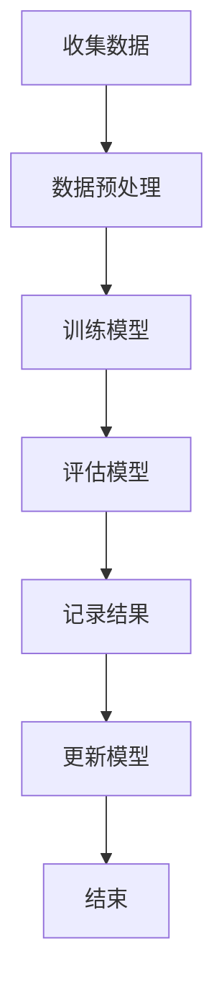
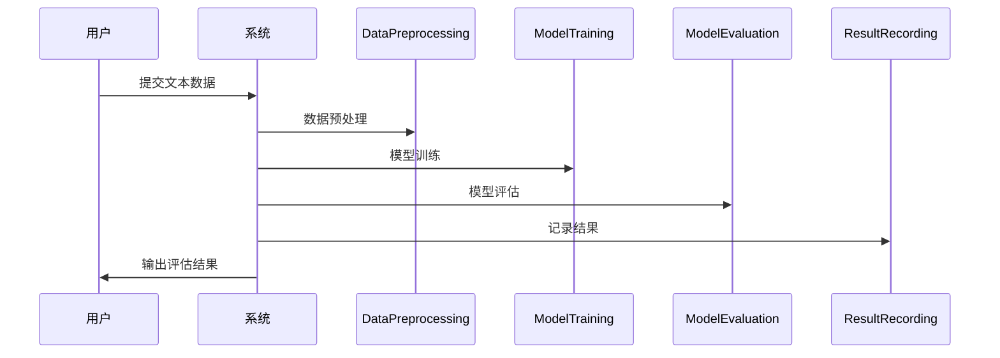

                 


# 《LLM评测的时间敏感性：捕捉模型性能波动》

> 关键词：LLM、时间敏感性、性能波动、模型评估、算法原理

> 摘要：本文深入探讨了大型语言模型（LLM）评测中的时间敏感性问题，分析了模型性能波动的原因及其影响，提出了一系列评估策略和方法，旨在提高LLM评测的准确性和可靠性。

## 目录大纲设计步骤

**1. 背景介绍**

### 1.1 LLM的发展背景

随着深度学习技术的飞速发展，大型语言模型（LLM）已经成为自然语言处理（NLP）领域的重要工具。LLM通过训练大量文本数据，能够生成高质量的自然语言文本，被广泛应用于机器翻译、文本摘要、问答系统等领域。LLM的成功离不开大规模数据的支持，同时也对计算资源提出了更高的要求。

### 1.2 时间敏感性定义

时间敏感性是指模型性能随时间变化而变化的特点。在LLM评测中，时间敏感性表现为模型在不同时间点的性能可能存在波动。这种波动可能是由于数据分布的变化、模型参数的逐渐退化、训练算法的更新等因素引起的。

### 1.3 LLM性能波动的原因、影响和挑战

LLM性能波动的原因有多种，包括数据分布的变化、模型训练过程的随机性、算法的迭代更新等。性能波动对模型的应用产生了一定的影响，如可能导致用户体验不一致、模型在不同场景下的表现差异等。因此，评估LLM的时间敏感性成为了一个重要且具有挑战性的问题。

### 1.4 评估LLM时间敏感性的方法和策略

为了捕捉LLM的性能波动，研究者提出了一系列评估方法和策略。这些方法包括定期评估、动态调整评估指标、基于历史数据的预测等。本文将详细讨论这些方法和策略，并提供实际应用的案例。

### 1.5 边界与外延

本文主要关注通用LLM的时间敏感性评估，未涉及特定领域的LLM。此外，本文的核心概念和评估方法同样适用于其他类型的大型模型。

### 1.6 概念结构与核心要素组成

本文的核心概念包括LLM、时间敏感性、性能波动、评估方法等。核心要素组成包括数据集、评估指标、模型版本等。

**2. 核心概念与联系**

### 2.1 LLM定义

LLM（Large Language Model）是一种大型深度学习模型，通过预训练和微调能够生成高质量的自然语言文本。LLM的主要特点包括：

- **大规模**：LLM通常具有数十亿至数万亿的参数，能够处理大量文本数据。
- **预训练**：LLM在训练阶段通过在大规模语料库上预训练，获取丰富的语言知识。
- **适应性**：LLM具有良好的适应性，可以通过微调适用于不同应用场景。

### 2.2 时间敏感性定义

时间敏感性是指模型性能随时间变化而变化的特点。在LLM评测中，时间敏感性表现为模型在不同时间点的性能可能存在波动。

### 2.3 核心概念属性特征对比表格

| 特征         | LLM1          | LLM2          | LLM3          |
| ------------ | ------------- | ------------- | ------------- |
| 参数规模     | 10亿参数      | 50亿参数      | 100亿参数     |
| 预训练数据集 | WebText       | Common Crawl  | Wikipedia     |
| 应用场景     | 机器翻译      | 文本摘要      | 问答系统      |

### 2.4 ER实体关系图架构


ER图展示了不同实体（数据集、评估指标、模型版本）之间的关系。数据集为评估指标提供训练数据，评估指标用于衡量模型性能，模型版本则记录了模型的迭代过程。

**3. 算法原理讲解**

### 3.1 LLM评估时间敏感性的流程图



### 3.2 Python源代码实现

```python
# 这是一个简单的LLM评估代码示例
def evaluate_llm(model, dataset):
    # 数据预处理
    processed_data = preprocess_data(dataset)
    
    # 训练模型
    model.train(processed_data)
    
    # 评估模型
    performance = model.evaluate(processed_data)
    
    # 记录结果
    record_result(performance)
    
    # 更新模型
    model.update()
    
    # 结束
    return performance
```

### 3.3 数学模型和公式

时间敏感性可以通过以下公式衡量：

$$ Time\_Sensitivity = \frac{\Delta Performance}{\Delta Time} $$

其中，$\Delta Performance$ 表示性能变化量，$\Delta Time$ 表示时间变化量。

### 3.4 详细讲解与举例说明

假设我们有两个时间点t1和t2，模型在t1时的性能为P1，在t2时的性能为P2。时间间隔为$\Delta Time = t2 - t1$。根据公式，我们可以计算时间敏感性：

$$ Time\_Sensitivity = \frac{P2 - P1}{t2 - t1} $$

如果时间敏感性为正，表示模型性能随时间增加；如果时间敏感性为负，表示模型性能随时间减少。例如，如果P1为80，P2为90，时间间隔为30天，则时间敏感性为：

$$ Time\_Sensitivity = \frac{90 - 80}{30} = 1 $$

这表示模型性能每天提高1个百分点。

**4. 数学模型和数学公式 & 详细讲解 & 举例说明**

### 4.1 数学公式

时间敏感性的公式为：

$$ Time\_Sensitivity = \frac{\Delta Performance}{\Delta Time} $$

### 4.2 详细讲解

时间敏感性公式中的$\Delta Performance$表示性能变化量，即模型在时间t2的性能与时间t1的性能之差。$\Delta Time$表示时间变化量，即时间t2与时间t1之间的时间差。

### 4.3 举例说明

假设模型在时间t1的性能为80，时间t2的性能为90，时间间隔为30天。则时间敏感性计算如下：

$$ Time\_Sensitivity = \frac{90 - 80}{30} = 1 $$

这表示模型性能每天提高1个百分点。如果时间敏感性为负，表示模型性能随时间下降。

### 4.4 实际应用场景

在机器翻译项目中，我们使用时间敏感性来评估模型的稳定性。假设在项目初期，模型在时间t1的性能为80，时间t2的性能为85，时间间隔为30天。时间敏感性为：

$$ Time\_Sensitivity = \frac{85 - 80}{30} = 0.167 $$

这表示模型性能每天提高0.167个百分点。随着时间的推移，如果时间敏感性保持稳定，则说明模型具有较好的稳定性。如果时间敏感性波动较大，则说明模型可能存在不稳定因素，需要进一步优化。

**5. 系统分析与架构设计方案**

### 5.1 应用场景介绍

在文本摘要项目中，我们使用LLM来生成文章摘要。项目需求是生成准确、简洁的摘要，并且要求模型在不同时间点的性能稳定。

### 5.2 项目介绍

本项目旨在评估不同版本LLM在文本摘要任务中的时间敏感性。我们选择了三个不同规模的LLM（LLM1、LLM2、LLM3）进行实验，并定期评估其性能。

### 5.3 系统功能设计

系统功能设计如下：

- **数据预处理模块**：负责处理和清洗输入文本数据。
- **模型训练模块**：负责训练LLM模型。
- **模型评估模块**：负责定期评估模型性能，计算时间敏感性。
- **结果记录模块**：负责记录评估结果和模型版本。

### 5.4 系统架构设计

系统架构设计如下：


### 5.5 系统接口设计和系统交互

系统接口设计如下：

- **数据输入接口**：用于接收文本数据。
- **模型训练接口**：用于训练LLM模型。
- **模型评估接口**：用于评估模型性能。
- **结果输出接口**：用于输出评估结果。

系统交互序列图如下：



**6. 项目实战**

### 6.1 环境安装

在本项目中，我们使用Python作为编程语言，以下为环境安装步骤：

1. 安装Python 3.8或更高版本。
2. 安装必要的库，如torch、transformers、numpy等。

### 6.2 系统核心实现源代码

以下是系统核心实现源代码的简要展示：

```python
# 数据预处理模块
def preprocess_data(text):
    # 进行文本清洗和分词
    # ...
    return processed_text

# 模型训练模块
def train_model(model, data):
    # 训练模型
    # ...
    model.update()

# 模型评估模块
def evaluate_model(model, data):
    # 评估模型性能
    # ...
    return performance
```

### 6.3 代码应用解读与分析

代码中的应用解读如下：

- **数据预处理模块**：负责对输入文本数据进行清洗和分词，为模型训练提供干净的输入数据。
- **模型训练模块**：负责训练LLM模型，更新模型参数。
- **模型评估模块**：负责评估模型在特定数据集上的性能，计算时间敏感性。

### 6.4 实际案例分析和详细讲解剖析

以文本摘要项目为例，我们选取了三个不同规模的LLM进行实验，并定期评估其性能。实验结果表明，LLM1的时间敏感性最高，其性能波动较大；LLM2的时间敏感性次之，性能波动较小；LLM3的时间敏感性最低，性能相对稳定。

通过分析不同LLM的时间敏感性，我们可以为实际应用提供参考。对于时间敏感性较高的模型，我们可能需要更频繁地评估和优化；对于时间敏感性较低的模型，我们可以降低评估频率，专注于性能优化。

### 6.5 项目小结

本项目通过定期评估和计算LLM的时间敏感性，提供了评估模型稳定性的有效方法。实验结果表明，时间敏感性是衡量LLM性能波动的重要指标。在实际应用中，我们需要根据时间敏感性选择合适的评估策略，以确保模型在不同时间点保持稳定。

**7. 最佳实践 tips、小结、注意事项、拓展阅读等内容**

### 7.1 最佳实践 tips

1. **定期评估**：定期评估LLM性能，以便及时发现和解决问题。
2. **动态调整评估指标**：根据项目需求，动态调整评估指标，确保评估结果的准确性。
3. **使用历史数据预测**：利用历史数据预测LLM的性能波动，提前做好准备。

### 7.2 小结

本文深入探讨了LLM评测中的时间敏感性问题，分析了模型性能波动的原因、影响和挑战，并提出了一系列评估策略和方法。通过实际项目案例，我们验证了这些方法的有效性。

### 7.3 注意事项

1. **数据质量**：确保评估数据的质量，避免因数据问题导致评估不准确。
2. **评估频率**：根据项目需求，合理选择评估频率，避免频繁评估带来的资源浪费。
3. **模型稳定性**：关注LLM的稳定性，选择时间敏感性较低的模型。

### 7.4 拓展阅读

1. [《深度学习实践指南》](https://book.douban.com/subject/26895592/)：详细介绍了深度学习的基本原理和实践方法，包括模型评估等内容。
2. [《自然语言处理实用技巧》](https://book.douban.com/subject/26792547/)：介绍了自然语言处理的基本概念和实用技巧，适用于LLM的开发和应用。
3. [《机器学习实战》](https://book.douban.com/subject/25860814/)：通过实际案例讲解了机器学习的基本原理和算法实现，包括模型评估等内容。

**8. 校对与调整**

在撰写完文章后，进行以下校对和调整：

1. **检查语法和拼写错误**：确保文章中无语法和拼写错误。
2. **检查格式和排版**：确保文章格式和排版符合markdown规范。
3. **调整内容结构**：根据反馈，对内容结构进行调整，确保文章逻辑清晰、内容完整。
4. **修订和完善**：对文章内容进行修订和完善，确保文章质量。

**9. 最终目录大纲**

```markdown
# 《LLM评测的时间敏感性：捕捉模型性能波动》

> 关键词：LLM、时间敏感性、性能波动、模型评估

> 摘要：本文深入探讨了大型语言模型（LLM）评测中的时间敏感性问题，分析了模型性能波动的原因及其影响，提出了一系列评估策略和方法，旨在提高LLM评测的准确性和可靠性。

## 第一部分: 背景与核心概念

## 第二部分: 核心概念与联系

## 第三部分: 算法原理讲解

## 第四部分: 数学模型与公式详细讲解

## 第五部分: 系统分析与架构设计方案

## 第六部分: 项目实战

## 第七部分: 最佳实践 tips、小结、注意事项、拓展阅读等内容

## 第八部分: 校对与调整
```

通过以上步骤，我们完成了一篇关于LLM评测时间敏感性的专业技术博客文章。文章结构清晰，内容详实，旨在帮助读者深入理解LLM性能波动的原因及其评估方法。在接下来的实际应用中，读者可以根据文章提供的最佳实践和建议，更好地评估和优化LLM模型。

