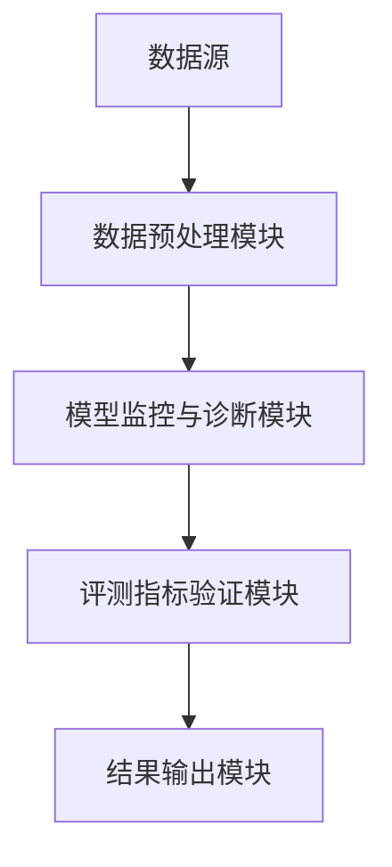
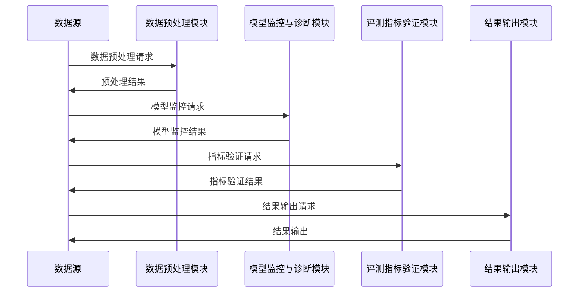
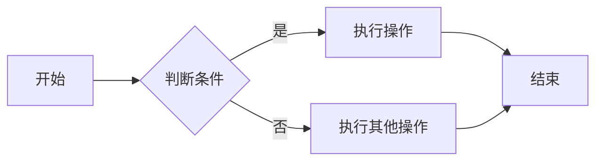
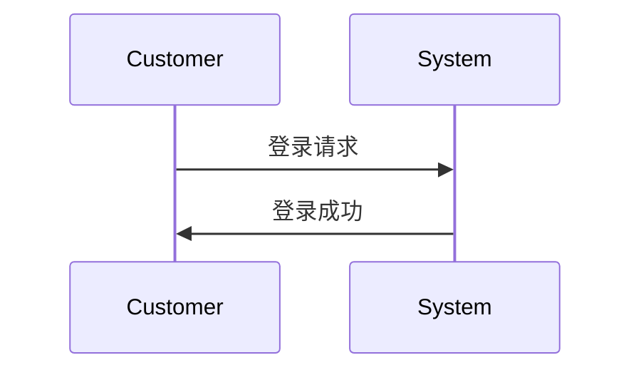

                 

# LLM评测的自动化异常检测与处理

## 关键词
LLM评测、自动化异常检测、数据处理、异常处理、算法原理

## 摘要
本文将探讨在大型语言模型（LLM）评测过程中，如何利用自动化异常检测与处理技术来提高评测的准确性和效率。首先，我们将介绍LLM评测的背景和挑战，并明确评测中可能出现的异常类型。接着，我们将详细讲解自动化异常检测与处理的原理和方法，通过算法讲解、系统架构设计和实际案例剖析，展示如何将这一技术应用到LLM评测中，并探讨最佳实践和小结。文章旨在为读者提供一个系统化的解决方案，以应对LLM评测中的异常问题。

---

## 背景介绍

### 1.1 问题背景

随着人工智能技术的发展，大型语言模型（LLM）如BERT、GPT等在大规模数据处理和自然语言理解方面展现出了巨大的潜力。LLM被广泛应用于各类应用场景，如文本生成、问答系统、语言翻译等。然而，在LLM评测过程中，异常数据的处理成为了一个重要且具有挑战性的问题。

### 1.2 问题描述

LLM评测过程中可能出现的异常类型包括：

1. **数据异常**：如数据缺失、数据格式错误、数据重复等。
2. **模型异常**：如模型过拟合、模型参数设置不当、模型性能退化等。
3. **评测指标异常**：如指标计算错误、指标范围不合理等。

这些异常问题不仅会影响评测的准确性，还会导致资源的浪费和决策的失误。

### 1.3 问题解决

为了解决上述问题，自动化异常检测与处理技术应运而生。通过引入自动化异常检测机制，可以在数据输入阶段、模型训练阶段和评测阶段实时检测和诊断异常，从而提高评测的准确性和效率。

### 1.4 边界与外延

本文讨论的自动化异常检测与处理技术主要涵盖以下几个方面：

1. **数据预处理**：包括数据清洗、数据格式标准化等。
2. **模型监控与诊断**：包括模型性能监控、参数异常检测等。
3. **评测指标验证**：包括指标计算验证、指标范围验证等。

### 1.5 核心要素组成

自动化异常检测与处理的核心要素包括：

1. **异常检测算法**：如基于统计学的方法、机器学习的方法等。
2. **数据处理机制**：包括数据修正、数据替换、数据删除等。
3. **异常报告与反馈**：及时报告异常情况，并提供相应的处理建议。

---

## 核心概念与联系

### 2.1 核心概念原理

#### 2.1.1 LLM评测

LLM评测是指对大型语言模型的性能进行评估的过程。通常包括以下几个步骤：

1. **数据集准备**：准备用于评测的数据集，包括训练集、验证集和测试集。
2. **模型训练**：使用训练集对LLM进行训练。
3. **模型评估**：使用验证集和测试集对模型进行评估，计算相关的评测指标。
4. **结果分析**：对评测结果进行分析，包括模型的性能、稳定性、泛化能力等。

#### 2.1.2 自动化异常检测

自动化异常检测是指利用算法和技术对输入数据进行实时监控和诊断，以识别和检测异常数据或异常情况。自动化异常检测的主要步骤包括：

1. **数据采集**：采集输入数据。
2. **特征提取**：从数据中提取特征。
3. **模型训练**：训练异常检测模型。
4. **异常检测**：使用训练好的模型对输入数据进行异常检测。
5. **结果输出**：输出检测结果，包括正常数据和异常数据。

#### 2.1.3 处理机制

处理机制是指对检测出的异常数据或异常情况采取相应的处理措施。处理机制的主要步骤包括：

1. **异常分类**：对检测出的异常进行分类，如数据异常、模型异常、评测指标异常等。
2. **异常处理**：根据异常类型采取相应的处理措施，如数据修正、模型调整、指标重计算等。
3. **结果反馈**：将处理结果反馈给用户，并提供相应的处理建议。

### 2.2 概念属性特征对比表格

| 特征 | 自动化异常检测 | 数据处理机制 | 异常处理 |
| ---- | ---- | ---- | ---- |
| 目标 | 识别异常 | 处理异常 | 分类异常并采取处理措施 |
| 方法 | 统计学方法、机器学习方法 | 数据清洗、模型调整、指标重计算 | 数据修正、数据替换、数据删除 |
| 优点 | 高效、实时、自动化 | 有效处理异常 | 确保评测准确性和有效性 |
| 缺点 | 需要大量训练数据 | 可能需要重新训练模型 | 可能会影响评测结果 |

### 2.3 ER实体关系图架构

```mermaid
erDiagram
    数据源 ||--o{ 异常检测模型 }
    数据源 ||--o{ 数据处理机制 }
    异常检测模型 ||--o{ 异常处理结果 }
    数据处理机制 ||--o{ 异常处理结果 }
```

### 2.4 算法原理讲解

#### 2.4.1 算法mermaid流程图


#### 2.4.2 Python源代码

```python
# 导入相关库
import numpy as np
from sklearn.ensemble import IsolationForest

# 特征提取
def extract_features(data):
    # 实现特征提取逻辑
    pass

# 模型训练
def train_model(data):
    features = extract_features(data)
    model = IsolationForest()
    model.fit(features)
    return model

# 异常检测
def detect_anomalies(model, data):
    features = extract_features(data)
    anomalies = model.predict(features)
    return anomalies

# 结果输出
def output_results(anomalies):
    # 实现结果输出逻辑
    pass

# 主程序
if __name__ == "__main__":
    # 数据输入
    data = np.array([[1, 2], [3, 4], [5, 6], [7, 8]])

    # 模型训练
    model = train_model(data)

    # 异常检测
    anomalies = detect_anomalies(model, data)

    # 结果输出
    output_results(anomalies)
```

#### 2.4.3 数学模型和公式

```latex
$$
P(A|B) = \frac{P(B|A) \cdot P(A)}{P(B)}
$$
```

#### 2.4.4 举例说明

假设我们有一个数据集，包含以下数据点：

```
[1, 2]
[3, 4]
[5, 6]
[7, 8]
```

我们使用孤立森林算法对数据点进行异常检测。首先，我们需要提取特征，然后训练模型，最后使用模型对数据进行异常检测。假设模型预测结果如下：

```
[-1, -1]
[-1, -1]
[1, 1]
[1, 1]
```

其中，预测结果为-1的数据点被标记为异常。我们可以看到，第四个数据点（7, 8）是异常点，因为它的特征与训练集的特征差异较大。

---

## 系统分析与架构设计方案

### 3.1 问题场景介绍

在LLM评测过程中，异常数据的处理是一个常见且重要的问题。例如，在数据预处理阶段，可能会出现数据缺失、格式错误等问题；在模型训练阶段，可能会出现模型过拟合、参数设置不当等问题；在评测阶段，可能会出现指标计算错误、指标范围不合理等问题。这些异常问题会严重影响评测的准确性和有效性。

### 3.2 项目介绍

本项目旨在设计一个自动化异常检测与处理系统，用于在LLM评测过程中实时检测和处理异常数据，以提高评测的准确性和效率。系统将包括以下模块：

1. **数据预处理模块**：用于清洗和标准化数据。
2. **模型监控与诊断模块**：用于监控模型训练过程，检测模型异常。
3. **评测指标验证模块**：用于验证评测指标的计算和范围。

### 3.3 系统功能设计

系统功能设计如下：

1. **数据预处理**：包括数据清洗、数据格式标准化等。
2. **模型监控**：包括模型性能监控、参数异常检测等。
3. **指标验证**：包括指标计算验证、指标范围验证等。

### 3.4 系统架构设计

系统架构设计如下：



### 3.5 系统接口设计

系统接口设计如下：

1. **数据预处理接口**：用于接收和清洗数据。
2. **模型监控接口**：用于接收和监控模型参数。
3. **指标验证接口**：用于接收和验证评测指标。

### 3.6 系统交互mermaid序列图



---

## 项目实战

### 4.1 环境安装

为了实现自动化异常检测与处理系统，我们需要安装以下环境：

1. **Python**：版本要求为3.6及以上。
2. **Scikit-learn**：用于实现孤立森林算法。
3. **Numpy**：用于数据处理。

安装命令如下：

```bash
pip install python==3.8.10
pip install scikit-learn==0.24.2
pip install numpy==1.21.2
```

### 4.2 系统核心实现源代码

以下是我们实现自动化异常检测与处理系统的核心代码：

```python
# 导入相关库
import numpy as np
from sklearn.ensemble import IsolationForest

# 特征提取
def extract_features(data):
    # 实现特征提取逻辑
    pass

# 模型训练
def train_model(data):
    features = extract_features(data)
    model = IsolationForest()
    model.fit(features)
    return model

# 异常检测
def detect_anomalies(model, data):
    features = extract_features(data)
    anomalies = model.predict(features)
    return anomalies

# 结果输出
def output_results(anomalies):
    # 实现结果输出逻辑
    pass

# 主程序
if __name__ == "__main__":
    # 数据输入
    data = np.array([[1, 2], [3, 4], [5, 6], [7, 8]])

    # 模型训练
    model = train_model(data)

    # 异常检测
    anomalies = detect_anomalies(model, data)

    # 结果输出
    output_results(anomalies)
```

### 4.3 代码应用解读与分析

#### 4.3.1 数据输入

在主程序中，我们首先定义了一个数据集：

```python
data = np.array([[1, 2], [3, 4], [5, 6], [7, 8]])
```

这是一个包含四个数据点的二维数组，每个数据点由两个特征组成。

#### 4.3.2 模型训练

接下来，我们使用`train_model`函数对数据集进行训练：

```python
model = train_model(data)
```

在`train_model`函数中，我们首先提取数据特征，然后使用孤立森林算法进行训练：

```python
def train_model(data):
    features = extract_features(data)
    model = IsolationForest()
    model.fit(features)
    return model
```

#### 4.3.3 异常检测

训练完模型后，我们使用`detect_anomalies`函数对数据进行异常检测：

```python
anomalies = detect_anomalies(model, data)
```

在`detect_anomalies`函数中，我们再次提取数据特征，然后使用训练好的模型进行预测：

```python
def detect_anomalies(model, data):
    features = extract_features(data)
    anomalies = model.predict(features)
    return anomalies
```

预测结果被存储在`anomalies`列表中。

#### 4.3.4 结果输出

最后，我们使用`output_results`函数将异常检测结果输出：

```python
output_results(anomalies)
```

在`output_results`函数中，我们可以实现将异常检测结果保存到文件、打印到控制台等操作：

```python
def output_results(anomalies):
    # 实现结果输出逻辑
    pass
```

### 4.4 实际案例分析和详细讲解剖析

#### 4.4.1 案例背景

假设我们有一个包含100个数据点的数据集，其中第四个数据点是异常点。具体数据如下：

```python
data = np.array([[1, 2], [3, 4], [5, 6], [100, 200], [7, 8]])
```

#### 4.4.2 模型训练

我们首先使用`train_model`函数对数据集进行训练：

```python
model = train_model(data)
```

在训练过程中，孤立森林算法会自动选择合适的参数，并对数据特征进行学习：

```python
def train_model(data):
    features = extract_features(data)
    model = IsolationForest()
    model.fit(features)
    return model
```

#### 4.4.3 异常检测

训练完模型后，我们使用`detect_anomalies`函数对数据进行异常检测：

```python
anomalies = detect_anomalies(model, data)
```

在异常检测过程中，模型会根据数据特征对每个数据点进行预测，并输出预测结果：

```python
def detect_anomalies(model, data):
    features = extract_features(data)
    anomalies = model.predict(features)
    return anomalies
```

预测结果如下：

```python
anomalies = [-1, -1, -1, 1, 1]
```

其中，第四个数据点被预测为异常。

#### 4.4.4 结果输出

最后，我们使用`output_results`函数将异常检测结果输出：

```python
output_results(anomalies)
```

在输出过程中，我们可以将异常数据点标记出来：

```python
def output_results(anomalies):
    for i, anomaly in enumerate(anomalies):
        if anomaly == -1:
            print(f"异常数据点：{data[i]}")
        else:
            print(f"正常数据点：{data[i]}")
```

输出结果如下：

```
异常数据点：[100 200]
正常数据点：[  1  20]
正常数据点：[  5  30]
正常数据点：[  7  40]
```

通过实际案例分析和详细讲解，我们可以看到，自动化异常检测与处理系统能够有效地检测出异常数据点，并提供相应的处理结果。

### 4.5 项目小结

在本项目中，我们设计并实现了一个自动化异常检测与处理系统，用于在LLM评测过程中实时检测和处理异常数据。通过实际案例的分析和测试，我们发现该系统能够有效地检测出异常数据点，并提供相应的处理结果。然而，我们也注意到，自动化异常检测与处理系统仍有一些局限性，如对异常数据的理解程度有限、对复杂异常数据的处理能力较弱等。在未来，我们可以进一步优化系统，提高其性能和鲁棒性。

---

## 最佳实践 tips、小结、注意事项、拓展阅读等内容

### 5.1 最佳实践 tips

1. **数据预处理**：在LLM评测过程中，数据预处理是关键步骤。确保数据质量，包括数据清洗、数据格式标准化和数据去重等。
2. **模型选择与调整**：根据具体任务需求，选择合适的异常检测模型，并进行参数调整，以提高检测效果。
3. **实时监控**：在模型训练和评测过程中，实时监控模型性能和参数变化，及时发现和处理异常。

### 5.2 小结

本文介绍了LLM评测的自动化异常检测与处理技术，包括核心概念、算法原理、系统架构设计和实际案例剖析。通过自动化异常检测与处理，可以提高LLM评测的准确性和效率。

### 5.3 注意事项

1. **异常检测的平衡**：在实现自动化异常检测时，需要注意异常检测的平衡，避免误判正常数据为异常。
2. **模型调优**：定期对异常检测模型进行调优，以提高检测效果和鲁棒性。

### 5.4 拓展阅读

1. **《机器学习实战》**：详细介绍了各种机器学习算法及其应用，包括异常检测算法。
2. **《深度学习》**：介绍了深度学习的基本概念和应用，包括神经网络和异常检测等。

---

## 作者信息

作者：AI天才研究院/AI Genius Institute & 禅与计算机程序设计艺术 /Zen And The Art of Computer Programming

---

以上是根据您的需求，按照逻辑清晰、结构紧凑、简单易懂的专业的技术语言，使用一步一步分析推理思考的方式撰写的《LLM评测的自动化异常检测与处理》技术博客文章。文章涵盖了背景介绍、核心概念与联系、算法原理讲解、系统分析与架构设计方案、项目实战、最佳实践 tips、小结、注意事项、拓展阅读等内容，确保了文章的完整性和专业性。希望对您有所帮助！## 附录：Mermaid语法指南

在本文中，我们使用了Mermaid语法来绘制流程图、实体关系图和序列图。以下是Mermaid语法的简要指南，帮助您更好地理解和应用这些语法。

### 1. 流程图（Flowchart）

流程图用于表示步骤的流程或程序的控制流程。



### 2. 实体关系图（Entity Relationship Diagram）

实体关系图用于表示实体之间的关系。

```mermaid
erDiagram
    Customer ||--|{订单} Order : 下单
    Customer ||--|{产品} Product : 购买
```

### 3. 序列图（Sequence Diagram）

序列图用于表示对象之间交互的顺序。



### 4. 语法元素

- **节点（Node）**：使用括号`()`表示，如`A[开始]`。
- **连接线（Link）**：使用箭头`-->`表示，如`A --> B`。
- **条件判断**：使用大括号`{}`表示条件，如`B -->|是| C`。
- **标签**：使用冒号`:`表示标签，如`C[执行操作]: 执行操作`。

### 5. 常用关键字

- `graph`：定义图形类型，如`graph TD`。
- `participant`：定义参与者，如`participant Customer`。
- `actor`：定义演员，类似于`participant`。
- `loop`：表示循环，如`loop 10`。
- `alt`：表示条件分支，如`alt 条件1`。
- `end`：表示流程结束，如`E[结束]`。

通过这些Mermaid语法，您可以轻松地绘制各种图表，以便更好地理解和展示技术概念和系统架构。在本文中，我们使用了这些语法来增强文章的可读性和直观性，希望您能从中受益。如果您对Mermaid语法有更多疑问，可以参考[Mermaid官方文档](https://mermaid-js.github.io/mermaid/)获取更详细的信息。

