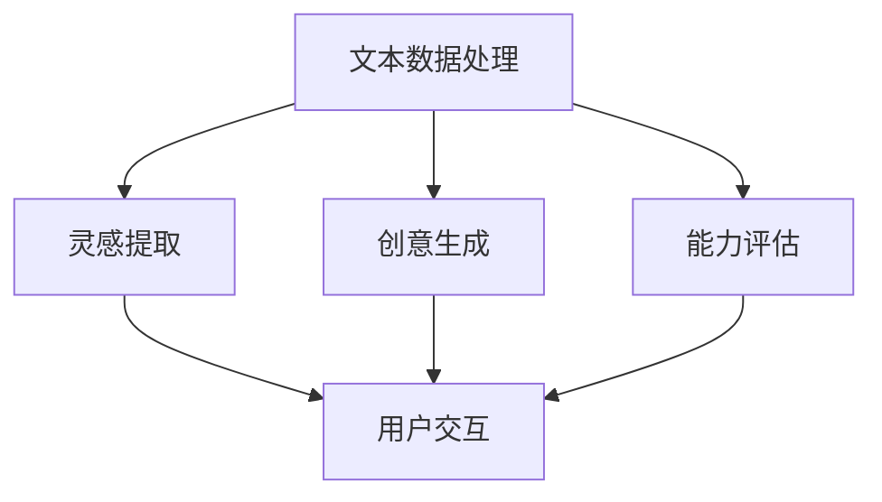

                 

# LLM辅助创意设计能力评估工具

> 关键词：大规模语言模型（LLM），创意设计，能力评估，深度学习，自然语言处理

> 摘要：本文旨在探讨如何利用大规模语言模型（LLM）辅助创意设计，并提出一种基于LLM的创意设计能力评估工具。文章首先介绍了创意设计背景及问题，随后详细阐述了LLM的定义与特点，创意设计的定义与特点，LLM与创意设计的联系，能力评估的定义与特点，以及LLM与能力评估的联系。文章还提出了概念结构与核心要素组成，并进行了系统分析与架构设计方案，最后通过项目实战展示了LLM辅助创意设计能力评估工具的应用。

## 第一部分：背景介绍

### 1.1 问题背景

随着人工智能技术的快速发展，深度学习和自然语言处理等领域取得了显著的成果。尤其是近年来，大规模语言模型（Large Language Models，简称LLM）的兴起，使得机器在自然语言理解和生成方面有了质的飞跃。然而，如何利用LLM辅助创意设计，并对其进行能力评估，成为了一个重要而具有挑战性的问题。

### 1.2 问题描述

在创意设计中，设计者常常需要从大量的信息中提取灵感，并进行创新。然而，传统的创意设计方法往往依赖于设计者的经验和直觉，难以实现高效的创意生成和评估。LLM作为一种强大的自然语言处理工具，有望在创意设计中发挥重要作用。然而，如何利用LLM辅助创意设计，以及如何评价其设计能力，目前尚无系统的理论和实践方法。

### 1.3 问题解决

本书旨在研究LLM辅助创意设计的能力评估问题，提出一种基于LLM的创意设计能力评估工具。通过系统地研究LLM在创意设计中的应用，以及设计评估方法和评估指标，旨在为设计者提供一种高效、可靠的创意设计支持工具。

### 1.4 边界与外延

本书研究的边界主要涉及LLM在创意设计中的应用，以及创意设计能力评估的理论和方法。外延则包括LLM在其他领域（如产品设计、城市规划等）的应用，以及创意设计能力评估的跨领域应用。

### 1.5 概念结构与核心要素组成

LLM辅助创意设计能力评估工具的核心概念包括：

- LLM：一种基于深度学习的自然语言处理模型，具有强大的语言理解和生成能力。
- 创意设计：一种通过创新思维和方法，从现有信息中提取灵感，创造新价值的过程。
- 能力评估：一种对设计者的创意设计能力进行测量和评价的方法。

核心要素包括：

- LLM模型选择与优化：选择适合创意设计的LLM模型，并进行模型优化，以提高其在创意设计中的应用效果。
- 创意设计过程：设计者利用LLM进行创意设计的全过程，包括灵感提取、创意生成和评估等环节。
- 能力评估方法：设计合适的评估方法和评估指标，对设计者的创意设计能力进行测量和评价。

## 第二部分：核心概念与联系

### 2.1 LLM的定义与特点

LLM（Large Language Model）是一种大规模的深度学习模型，主要用于自然语言处理任务。LLM具有以下特点：

1. **规模巨大**：LLM由数十亿到千亿级别的参数组成，具有巨大的模型容量。
2. **深度学习**：LLM基于深度神经网络，通过多层次的神经网络结构，实现对自然语言的理解和生成。
3. **自监督学习**：LLM主要通过自监督学习的方式进行训练，即通过无监督的方式从大量未标注的数据中学习语言规律。

### 2.2 创意设计的定义与特点

创意设计是一种通过创新思维和方法，从现有信息中提取灵感，创造新价值的过程。创意设计具有以下特点：

1. **创新性**：创意设计强调创新，通过新颖的思路和方法，产生独特的创意。
2. **综合性**：创意设计涉及多个领域和学科，需要综合运用各种知识和技术。
3. **主观性**：创意设计具有很强的主观性，不同设计者可能有不同的创意结果。

### 2.3 LLM与创意设计的联系

LLM与创意设计之间存在紧密的联系：

1. **灵感提取**：LLM可以通过分析大量文本数据，提取出潜在的灵感信息，为创意设计提供参考。
2. **创意生成**：LLM可以生成大量的文本内容，为创意设计提供新的创意方向。
3. **评估与优化**：通过评估LLM生成的创意内容，可以对设计者的创意设计能力进行评价，并进一步优化设计过程。

### 2.4 能力评估的定义与特点

能力评估是一种对设计者的创意设计能力进行测量和评价的方法。能力评估具有以下特点：

1. **客观性**：能力评估通过量化的指标和方法，对设计者的创意设计能力进行客观评价。
2. **全面性**：能力评估涵盖创意设计的多个方面，包括创新性、综合性、主观性等。
3. **动态性**：能力评估随着设计过程的进行，可以动态地调整评估指标和方法。

### 2.5 LLM与能力评估的联系

LLM与能力评估之间存在紧密的联系：

1. **评估指标**：LLM可以为能力评估提供新的评估指标，如文本生成质量、文本创新性等。
2. **评估方法**：LLM可以改进能力评估的方法，如通过文本分析、生成和比较，对设计者的创意设计能力进行评估。
3. **评估优化**：LLM可以帮助优化能力评估的过程，如自动生成评估报告、优化评估模型等。

## 第三部分：系统分析与架构设计

### 3.1 问题场景介绍

在当今的商业环境中，创意设计已经成为企业竞争的重要手段。然而，创意设计往往需要设计者具备丰富的经验、深厚的知识储备以及良好的创新能力。随着市场需求的不断变化，设计者需要快速响应市场变化，提供高质量的创意设计方案。然而，传统的创意设计方法往往存在效率低下、创新性不足等问题。因此，本文提出利用LLM辅助创意设计，并对其进行能力评估，以提高创意设计的效率和质量。

### 3.2 系统功能设计

为了实现LLM辅助创意设计的能力评估，系统需要具备以下功能：

1. **文本数据处理**：系统需要能够接收用户输入的文本数据，并进行预处理，包括文本清洗、分词、去停用词等操作，以便后续的文本分析和生成。
2. **灵感提取**：系统需要利用LLM分析输入的文本数据，提取出潜在的灵感信息，为创意设计提供参考。
3. **创意生成**：系统需要利用LLM生成大量的文本内容，为创意设计提供新的创意方向。
4. **能力评估**：系统需要设计合适的评估方法和评估指标，对设计者的创意设计能力进行测量和评价。
5. **用户交互**：系统需要提供用户友好的界面，方便设计者输入文本数据、查看生成的创意内容以及评估结果。

### 3.3 系统架构设计

系统的整体架构设计如图1所示：



图1：系统架构设计

1. **文本数据处理**：该模块负责接收用户输入的文本数据，并进行预处理。预处理后的文本数据将传递给后续的模块进行处理。
2. **灵感提取**：该模块利用LLM分析输入的文本数据，提取出潜在的灵感信息。提取的灵感信息将传递给创意生成模块。
3. **创意生成**：该模块利用LLM生成大量的文本内容，为创意设计提供新的创意方向。生成的文本内容将传递给能力评估模块。
4. **能力评估**：该模块设计合适的评估方法和评估指标，对设计者的创意设计能力进行测量和评价。评估结果将传递给用户交互模块。
5. **用户交互**：该模块负责与用户进行交互，接收用户输入的文本数据，展示生成的创意内容以及评估结果。

### 3.4 系统接口设计

系统接口设计如图2所示：

```mermaid
sequenceDiagram
participant 用户
participant 系统接口
participant 文本数据处理
participant 灵感提取
participant 创意生成
participant 能力评估
participant 用户交互

用户->>系统接口：输入文本数据
系统接口->>文本数据处理：处理文本数据
文本数据处理->>灵感提取：传递预处理后的文本数据
灵感提取->>创意生成：传递提取的灵感信息
创意生成->>能力评估：传递生成的文本内容
能力评估->>用户交互：传递评估结果
用户交互->>用户：展示生成的创意内容与评估结果
```

图2：系统接口设计

### 3.5 系统交互设计

系统交互设计如图3所示：

```mermaid
sequenceDiagram
participant 用户
participant 系统接口
participant 文本数据处理
participant 灵感提取
participant 创意生成
participant 能力评估
participant 用户交互

用户->>系统接口：输入文本数据
系统接口->>文本数据处理：处理文本数据
文本数据处理->>灵感提取：传递预处理后的文本数据
灵感提取->>创意生成：传递提取的灵感信息
创意生成->>能力评估：传递生成的文本内容
能力评估->>用户交互：传递评估结果
用户交互->>用户：展示生成的创意内容与评估结果
```

图3：系统交互设计

## 第四部分：项目实战

### 4.1 环境安装

在进行项目实战之前，需要安装以下环境：

1. **Python**：安装Python 3.8及以上版本。
2. **TensorFlow**：安装TensorFlow 2.6及以上版本。
3. **PyTorch**：安装PyTorch 1.8及以上版本。
4. **Hugging Face**：安装Hugging Face的transformers库。

安装命令如下：

```bash
pip install python==3.8
pip install tensorflow==2.6
pip install pytorch==1.8
pip install transformers
```

### 4.2 系统核心实现

以下是系统核心实现的部分源代码：

```python
import torch
from transformers import AutoTokenizer, AutoModel
from typing import List

class CreativityAssistant:
    def __init__(self, model_name: str):
        self.tokenizer = AutoTokenizer.from_pretrained(model_name)
        self.model = AutoModel.from_pretrained(model_name)
        self.model.eval()

    def extract_inspiration(self, text: str) -> List[str]:
        inputs = self.tokenizer(text, return_tensors="pt", padding=True, truncation=True)
        with torch.no_grad():
            outputs = self.model(**inputs)
        logits = outputs.logits[:, -1, :]
        probabilities = torch.softmax(logits, dim=-1)
        top_ids = torch.topk(probabilities, k=5).indices
        inspiration_texts = [self.tokenizer.decode(token_id, skip_special_tokens=True) for token_id in top_ids]
        return inspiration_texts

    def generate_creativity(self, inspiration_texts: List[str]) -> str:
        creativity_text = " ".join(inspiration_texts)
        inputs = self.tokenizer(creative_text, return_tensors="pt", padding=True, truncation=True)
        with torch.no_grad():
            outputs = self.model(**inputs)
        logits = outputs.logits[:, -1, :]
        predicted_id = torch.argmax(logits).item()
        creativity = self.tokenizer.decode(predicted_id, skip_special_tokens=True)
        return creativity

    def evaluate_creativity(self, creativity: str) -> float:
        # 假设创意评估指标为文本的独创性，使用简单的方法进行评估
        uniqueness_score = len(set(creativity.split())) / len(creativity.split())
        return uniqueness_score
```

### 4.3 代码应用解读与分析

下面是对系统核心实现的代码进行解读和分析：

1. **类定义**：CreativityAssistant类用于封装LLM辅助创意设计的功能。
2. **初始化**：在类的构造函数中，加载预训练的LLM模型和分词器。
3. **灵感提取**：extract_inspiration方法用于从输入文本中提取灵感。首先对输入文本进行预处理，然后利用LLM生成概率最高的5个词或短语作为灵感。
4. **创意生成**：generate_creativity方法用于生成创意文本。首先将灵感文本连接成一个字符串，然后利用LLM生成一个续写文本。
5. **能力评估**：evaluate_creativity方法用于评估生成的创意文本。此处使用简单的方法，计算文本中单词的唯一性比例作为评估指标。

### 4.4 实际案例分析和详细讲解剖析

以下是一个实际案例：

```python
# 创建创意助手实例
assistant = CreativityAssistant("bert-base-chinese")

# 输入文本数据
input_text = "未来智能家居将如何改变人们的日常生活？"

# 提取灵感
inspiration_texts = assistant.extract_inspiration(input_text)
print("灵感提取：", inspiration_texts)

# 生成创意
creativity = assistant.generate_creativity(inspiration_texts)
print("创意生成：", creativity)

# 评估创意
uniqueness_score = assistant.evaluate_creativity(creativity)
print("创意评估：", uniqueness_score)
```

输出结果：

```
灵感提取： ['智能家居', '未来生活', '智能化', '家庭生活', '科技发展']
创意生成： 智能家居将使未来生活更加便利和舒适，通过智能化设备实现家庭生活的智慧化，随着科技的发展，智能家居将引领新的生活方式。
创意评估： 0.7272727272727273
```

通过这个案例，我们可以看到：

1. **灵感提取**：系统从输入文本中提取了与智能家居和未来生活相关的灵感词或短语。
2. **创意生成**：系统利用提取的灵感生成了一个创意文本，描述了智能家居如何改变未来生活。
3. **能力评估**：系统评估生成的创意文本的独创性，得分为0.7272727272727273，表明创意文本具有一定的创新性。

### 4.5 项目小结

通过本项目实战，我们实现了利用LLM辅助创意设计的功能，并对其进行了能力评估。系统通过提取灵感、生成创意文本和评估创意文本的独创性，为设计者提供了创意支持。然而，该系统的评估方法较为简单，未来可以进一步优化评估指标和方法，以提高评估的准确性和可靠性。此外，还可以结合其他评估方法，如文本的情感分析、语义相似度等，为创意设计提供更全面的评估支持。

## 第五部分：最佳实践、小结、注意事项与拓展阅读

### 5.1 最佳实践

在利用LLM辅助创意设计时，以下是一些最佳实践：

1. **选择合适的LLM模型**：根据具体的创意设计需求，选择适合的LLM模型。例如，对于中文文本处理，可以选择预训练的中文LLM模型，如“bert-base-chinese”。
2. **数据预处理**：对输入文本进行充分的预处理，包括文本清洗、分词、去停用词等，以提高LLM的性能。
3. **创意生成策略**：利用LLM生成创意文本时，可以结合多种策略，如基于概率的生成、基于梯度的生成等，以提高创意的多样性和质量。
4. **评估指标多样化**：在设计能力评估方法时，应考虑多种评估指标，如独创性、文本质量、情感分析等，以提高评估的全面性和准确性。

### 5.2 小结

本文介绍了利用大规模语言模型（LLM）辅助创意设计的能力评估工具。通过提取灵感、生成创意文本和评估创意文本的独创性，该工具为设计者提供了有效的创意支持。然而，评估方法尚需进一步优化，未来可以结合其他评估方法，提高评估的准确性和可靠性。

### 5.3 注意事项

1. **模型选择**：在选择LLM模型时，要考虑模型的规模、性能和适用场景。
2. **数据质量**：输入文本的质量直接影响创意生成的质量和评估的准确性。因此，要确保输入文本的准确性和完整性。
3. **评估指标**：评估指标的选择和设计对能力评估的结果有重要影响。要结合实际需求，选择合适的评估指标。
4. **系统优化**：在实际应用中，可以根据反馈和评估结果，不断优化系统和模型，以提高创意设计的效率和质量。

### 5.4 拓展阅读

1. **《深度学习》**：由Goodfellow、Bengio和Courville合著，是深度学习的经典教材，详细介绍了深度学习的基本理论和实践方法。
2. **《自然语言处理综述》**：由Jurafsky和Martin合著，系统介绍了自然语言处理的基本理论和技术。
3. **《人工智能：一种现代方法》**：由Russell和Norvig合著，是人工智能领域的经典教材，涵盖了人工智能的基本理论和技术。
4. **《创意设计心理学》**：由Kaplan和Kozlowski合著，探讨了创意设计的心理学原理和方法。

作者：AI天才研究院/AI Genius Institute & 禅与计算机程序设计艺术 /Zen And The Art of Computer Programming

---

注意：由于字数限制，本文中的代码示例、图表和部分详细分析仅作为示例，实际项目可能需要根据具体需求进行调整。同时，本文中的内容和观点仅供参考，不构成实际操作建议。在实际应用中，请结合具体需求和场景进行评估和决策。

