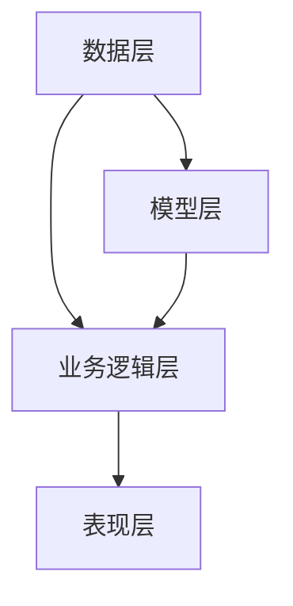
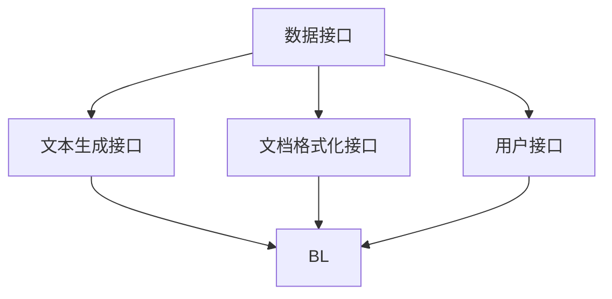
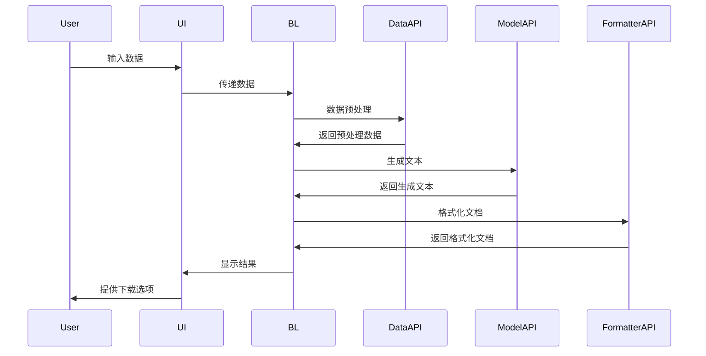

                 

### 第一部分: 引言

#### 第1章: 法律文书自动生成背景

**1.1 法律文书自动生成的需求**

法律文书是法律领域中不可或缺的重要工具，用于记录法律事件、表达法律观点、行使法律权利和履行法律义务。传统的法律文书通常由律师和法务人员手动撰写，这不仅耗时耗力，而且容易出现错误和疏漏。随着法律事务的复杂性和多样性的增加，对法律文书自动生成的需求也越来越强烈。自动生成法律文书可以提高效率、降低成本、减少错误，并确保法律文书的规范性和一致性。

**1.2 当前法律文书生成技术概述**

目前，法律文书生成主要依赖于模板和规则引擎。模板技术通过预设的格式和内容模板，自动化地生成法律文书。这种方法具有快速、简便的优点，但模板的多样性和灵活性有限，难以适应复杂多变的法律需求。规则引擎则通过定义一系列逻辑规则，自动化地生成法律文书。这种方法具有较高的灵活性和扩展性，但规则定义复杂，维护成本高。

**1.3 LLM在法律文书生成中的优势**

近年来，预训练语言模型（Pre-trained Language Model，简称LLM）在自然语言处理（Natural Language Processing，简称NLP）领域取得了显著进展。LLM通过在大规模文本数据上进行预训练，学习到了丰富的语言知识和规律，能够生成高质量的自然语言文本。与传统的模板和规则引擎相比，LLM在法律文书生成中具有以下优势：

1. **更高的灵活性和适应性**：LLM能够根据输入的上下文和需求，灵活地生成各种类型的法律文书，无需预设模板或规则。
2. **更丰富的语言知识**：LLM通过预训练学习到了大量的法律文本，能够更好地理解和表达法律概念和术语，提高法律文书的准确性。
3. **更低的维护成本**：LLM的训练和优化过程自动化，无需人工干预，降低了维护成本。
4. **更好的可扩展性**：LLM可以轻松地适应不同国家和地区的法律规范和术语，支持跨语言的法律文书生成。

本文将围绕LLM在法律文书生成中的应用，探讨其原理、方法、流程、应用案例、面临的挑战和未来发展趋势，为读者提供全面的了解和深入的分析。

#### 第2章: LLM基本概念与原理

**2.1 LLM的定义与类型**

预训练语言模型（Pre-trained Language Model，简称LLM）是一种基于深度学习技术的自然语言处理模型，通过在大规模文本数据集上进行预训练，学习到语言的通用表示和规律。LLM的核心思想是利用海量数据进行自我学习，从而在不需要人工规则和模板的情况下，生成高质量的自然语言文本。

根据预训练任务的不同，LLM可以分为以下几种类型：

1. **掩码语言模型（Masked Language Model，简称MLM）**：MLM通过对文本中的部分词汇进行掩码，然后训练模型预测这些掩码词汇。这种方法使模型学会了理解词汇之间的关系和上下文。
2. **生成式预训练（Generative Pre-trained Transformer，简称GPT）**：GPT是一种基于自回归模型的预训练方法，通过预测序列中的下一个词汇，生成连贯的自然语言文本。GPT系列模型包括GPT、GPT-2、GPT-3等，其中GPT-3具有非常强大的文本生成能力。
3. **变换器语言模型（Transformer-based Language Model，简称TLM）**：TLM是基于变换器（Transformer）架构的预训练模型，通过自注意力机制（Self-Attention）对文本中的每个词汇进行建模。TLM在处理长文本和长距离依赖关系方面具有显著优势。

**2.2 LLM的核心原理**

LLM的核心原理主要包括以下几个方面：

1. **编码器-解码器架构**：编码器-解码器（Encoder-Decoder）架构是LLM的基础，它通过编码器将输入文本转化为固定长度的向量表示，然后通过解码器生成输出文本。编码器和解码器之间通常通过注意力机制进行交互，以捕捉输入和输出之间的依赖关系。
   
2. **自注意力机制**：自注意力机制（Self-Attention）是TLM的核心组件，它通过计算输入文本中每个词汇与其他词汇之间的关联性，为每个词汇分配不同的权重。这种方法使得模型能够更好地理解长文本中的依赖关系，提高文本生成的质量。

3. **上下文感知**：LLM通过预训练学习到了大量的语言知识和规律，能够根据输入的上下文生成合理的文本。上下文感知能力使得LLM能够生成连贯、一致的法律文书，避免了传统方法中的硬编码和模板限制。

**2.3 LLM的训练与优化**

LLM的训练和优化过程主要包括以下几个步骤：

1. **数据收集与预处理**：收集大量高质量的法律文本数据，进行数据清洗、去重和标注等预处理操作，以获得高质量的训练数据。
   
2. **模型初始化**：初始化LLM模型，通常采用预训练好的通用语言模型作为起点，以减少训练时间。

3. **预训练**：在预训练阶段，LLM通过在大规模文本数据集上进行训练，学习到语言的通用表示和规律。预训练任务通常包括掩码语言模型（MLM）、生成式预训练（GPT）和变换器语言模型（TLM）等。

4. **微调**：在预训练的基础上，对LLM进行微调，使其适应特定领域的任务。微调过程中，通常使用领域特定的数据进行训练，以提高模型的性能。

5. **优化**：通过调整模型参数，优化模型在特定任务上的表现。优化方法包括梯度下降、动量优化、学习率调整等。

通过以上步骤，LLM可以训练成为一个强大的法律文书生成工具，为法律领域的自动化提供有力的支持。

### 第3章: 法律文书生成质量评估方法

**3.1 质量评估指标**

法律文书生成质量评估的核心目标是确保生成的法律文书在准确性、完整性和可读性等方面达到预期标准。为此，我们需要设计一套全面的评估指标体系。以下是常见的质量评估指标：

1. **准确性**：准确性是衡量法律文书生成质量的首要指标，包括词汇、语法、标点符号和句子结构的正确性。具体衡量方法可以通过错误率（Error Rate，简称ER）来计算，公式如下：
   $$
   ER = \frac{错误词数}{总词数}
   $$
   
2. **完整性**：完整性指的是法律文书是否包含所有必要的法律要素和条款。完整性可以通过完整性得分（Completeness Score，简称CS）来衡量，公式如下：
   $$
   CS = \frac{包含所有必要要素的文书数}{总文书数}
   $$

3. **一致性**：一致性是指法律文书在格式、用语和结构上的一致性。一致性可以通过一致性得分（Consistency Score，简称CS）来衡量，公式如下：
   $$
   CS = \frac{一致性高文书的数量}{总文书数量}
   $$

4. **可读性**：可读性是指法律文书是否易于理解，是否使用了适当的法律术语和清晰的语言表达。可读性可以通过可读性得分（Readability Score，简称RS）来衡量，公式如下：
   $$
   RS = \frac{易读文书的数量}{总文书数量}
   $$

**3.2 评估方法**

法律文书生成质量的评估方法可以分为定量评估和定性评估两种。

1. **定量评估**：定量评估方法主要依赖于自动化工具和算法，通过对法律文书进行计算和分析来评估质量。常见的定量评估方法包括：

   - **错误率分析**：通过统计法律文书中错误词汇的比例来评估准确性。
   - **完整性分析**：通过对比生成文书和标准文书的要素对比表来评估完整性。
   - **一致性分析**：通过分析法律文书中格式、用语和结构的一致性来评估一致性。
   - **可读性分析**：通过计算文书的句子长度、词汇复杂度等指标来评估可读性。

2. **定性评估**：定性评估方法主要依赖于人类评估者，通过对法律文书的阅读和理解来评估质量。常见的定性评估方法包括：

   - **专家评估**：邀请法律专家对法律文书进行评估，根据法律文书的准确性、完整性、一致性和可读性等方面进行打分。
   - **用户反馈**：收集用户对法律文书的实际使用体验和满意度，通过用户反馈来评估法律文书的质量。

**3.3 评估工具与平台**

为了方便法律文书生成质量的评估，有许多评估工具和平台可供选择。以下是几种常见的评估工具和平台：

1. **自动化评估工具**：如Grammarly、Ginger等，这些工具可以自动检查文书的准确性、完整性和一致性，并提供修改建议。

2. **专业评估平台**：如法律文书生成系统，这些平台通常集成了自动化评估工具和专业评估功能，可以提供全面的质量评估服务。

3. **开源评估工具**：如TextBlob、NLTK等，这些工具提供了丰富的文本分析功能，可以用于自定义评估方法和算法。

通过使用这些评估工具和平台，可以有效地评估法律文书生成质量，为法律事务提供可靠的保障。

### 第4章: LLM辅助法律文书生成的流程与架构

**4.1 数据预处理**

数据预处理是LLM辅助法律文书生成的基础环节，其质量直接影响到后续模型训练和文书的生成质量。数据预处理的主要任务包括数据清洗、数据标注和文本预处理。

**数据清洗**：数据清洗的目的是去除数据中的噪声和无关信息，提高数据质量。具体步骤包括：

- **去重**：去除重复的法律文书，避免重复训练。
- **去除无关信息**：去除法律文书中的广告、引用、注释等无关内容。
- **纠正错误**：纠正法律文书中的拼写错误、语法错误等。

**数据标注**：数据标注是让计算机理解法律文书中的关键信息，为模型训练提供监督信号。常见的标注任务包括：

- **实体识别**：标注法律文书中的法律实体，如人名、公司名、地名等。
- **关系标注**：标注法律实体之间的关系，如合同双方、诉讼关系等。
- **事件标注**：标注法律文书中的事件，如签订合同、提起诉讼等。

**文本预处理**：文本预处理是将原始法律文书转换为适合模型训练的格式。具体步骤包括：

- **分词**：将法律文书分割成单词或句子。
- **词性标注**：标注每个单词的词性，如名词、动词、形容词等。
- **去除停用词**：去除常见的无意义词汇，如“的”、“地”、“得”等。
- **词干提取**：将单词还原为词干形式，简化文本表示。

通过以上数据预处理步骤，可以获得高质量的法律文书数据集，为LLM的训练提供可靠的基础。

**4.2 文本生成**

文本生成是LLM辅助法律文书生成的核心环节，其目标是根据给定的输入生成高质量的法律文书。文本生成的流程通常包括以下步骤：

**输入处理**：将输入文本（如案件描述、法律条款等）进行预处理，包括分词、词性标注、去除停用词等，转换为适合模型输入的格式。

**上下文构建**：根据输入文本构建上下文信息，为模型提供背景知识。上下文构建可以通过以下方法实现：

- **直接输入**：将输入文本直接作为模型的输入。
- **关键词提取**：提取输入文本中的关键词，作为上下文的代表。
- **语义表示**：将输入文本转化为语义表示，如Word2Vec、BERT等。

**模型选择**：选择合适的预训练模型，如GPT、TLM等，用于文本生成。模型选择应根据具体任务的需求进行，如生成长文本、生成法律条款等。

**文本生成**：利用选择的模型生成文本。生成过程通常采用自回归模型，逐个生成文本中的词汇。具体步骤如下：

1. **初始化**：从输入文本中选择一个词汇作为生成的起点。
2. **预测**：使用模型预测下一个词汇的概率分布。
3. **采样**：从概率分布中采样一个词汇作为生成结果的一部分。
4. **更新**：将新生成的词汇加入上下文，更新模型的输入和上下文。
5. **重复**：重复步骤2-4，直至生成完整的文本。

**后处理**：对生成的文本进行后处理，包括语法修正、标点符号调整、格式化等，以提高文本的可用性和可读性。

通过以上文本生成步骤，可以生成高质量的法律文书，满足法律事务的需求。

**4.3 文档格式化与排版**

在文本生成完成后，需要对生成的法律文书进行格式化与排版，以确保其符合法律文书的标准格式和规范。文档格式化与排版的主要步骤包括：

**格式化**：格式化是指对文本的格式进行调整，使其符合法律文书的要求。具体步骤包括：

- **段落设置**：调整段落间距、行间距和边距等。
- **字体和字号**：设置文本的字体和字号，使其符合法律文书的规范。
- **行距和间距**：调整行距和段落间距，使文本更易于阅读。
- **段落对齐**：调整文本的对齐方式，如左对齐、右对齐、居中等。

**排版**：排版是指对文本进行布局和布局设计，使其在页面上的排列更加美观和规范。具体步骤包括：

- **标题和子标题**：设置标题和子标题的格式，如字体、字号、颜色等。
- **页眉和页脚**：设置页眉和页脚的内容和格式，如页码、公司名称等。
- **边框和背景**：添加边框和背景颜色，以提高文档的美观度。
- **页码和目录**：生成页码和目录，以便于用户快速定位和查找。

通过以上格式化与排版步骤，可以使生成的法律文书在格式和排版上达到法律文书的标准，提高文档的可读性和专业性。

**4.4 流程控制与调度**

LLM辅助法律文书生成的流程控制与调度是确保整个生成过程高效、有序进行的关键。流程控制与调度包括以下几个方面的内容：

**任务调度**：任务调度是指根据法律事务的需求和优先级，安排文书生成的任务。任务调度可以采用以下方法：

- **顺序调度**：按照任务的提交顺序进行调度，先提交的任务先执行。
- **优先级调度**：根据任务的优先级进行调度，优先级高的任务先执行。
- **动态调度**：根据系统负载和任务状态动态调整任务执行顺序，以优化系统性能。

**并发处理**：并发处理是指同时处理多个文书生成任务，以提高系统吞吐量。并发处理可以通过以下方法实现：

- **多线程处理**：利用多线程技术，同时处理多个任务的文本生成。
- **并行处理**：利用分布式计算技术，将任务分布在多个计算节点上并行执行。

**异常处理**：异常处理是指处理在文书生成过程中出现的各种异常情况，确保系统的稳定性和可靠性。异常处理包括以下内容：

- **错误检测**：检测文本生成过程中出现的错误，如语法错误、格式错误等。
- **错误恢复**：对检测到的错误进行恢复，如重新生成文本、重新预处理数据等。
- **日志记录**：记录系统运行过程中的日志信息，便于问题诊断和调试。

通过以上流程控制与调度措施，可以确保LLM辅助法律文书生成过程高效、稳定地进行，满足法律事务的需求。

### 第5章: LLM辅助法律文书生成的应用案例

**5.1 案例一：合同生成**

合同生成是LLM辅助法律文书生成的一个重要应用场景。通过LLM，可以自动生成各种类型的合同，如租赁合同、劳动合同、购销合同等。以下是合同生成的一个典型流程：

1. **输入**：用户输入合同的关键信息，如合同名称、双方名称、合同内容等。
2. **文本生成**：LLM根据输入的关键信息和预训练的法律知识，生成合同正文。生成过程中，LLM会自动处理合同条款的格式、语法和一致性。
3. **格式化与排版**：对生成的合同文本进行格式化与排版，使其符合法律文书的标准格式。
4. **输出**：将格式化后的合同文本输出到用户界面，用户可以下载或打印。

通过LLM辅助合同生成，可以提高合同编写的效率和质量，降低合同编写的错误率，为企业和个人提供便捷的法律服务。

**5.2 案例二：诉状生成**

诉状生成是另一个重要的应用场景，通过LLM可以自动生成起诉状、答辩状等法律文书。以下是诉状生成的一个典型流程：

1. **输入**：用户输入案件的基本信息，如原告、被告、案件事实、诉讼请求等。
2. **文本生成**：LLM根据输入的案件信息和预训练的法律知识，生成诉状正文。生成过程中，LLM会自动处理诉状的格式、语法和一致性。
3. **格式化与排版**：对生成的诉状文本进行格式化与排版，使其符合法律文书的标准格式。
4. **输出**：将格式化后的诉状文本输出到用户界面，用户可以下载或打印。

通过LLM辅助诉状生成，可以提高诉状编写的效率和质量，降低诉状编写的错误率，为律师和当事人提供便捷的法律服务。

**5.3 案例三：法律意见书生成**

法律意见书生成是LLM在法律领域的重要应用之一，通过LLM可以自动生成企业法律意见书、合同法律意见书等。以下是法律意见书生成的一个典型流程：

1. **输入**：用户输入法律意见书的基本信息，如意见书名称、企业名称、法律问题等。
2. **文本生成**：LLM根据输入的法律问题和预训练的法律知识，生成法律意见书正文。生成过程中，LLM会自动处理法律意见书的格式、语法和一致性。
3. **格式化与排版**：对生成的法律意见书文本进行格式化与排版，使其符合法律文书的标准格式。
4. **输出**：将格式化后的法律意见书文本输出到用户界面，用户可以下载或打印。

通过LLM辅助法律意见书生成，可以提高法律意见书编写的效率和质量，降低法律意见书编写的错误率，为企业和个人提供专业的法律服务。

### 第6章: LLM辅助法律文书生成面临的问题与挑战

**6.1 数据质量与多样性**

数据质量是LLM辅助法律文书生成的基础，高质量的训练数据可以显著提升模型的性能。然而，法律文书数据通常存在以下问题：

1. **噪声和错误**：法律文书数据可能包含拼写错误、语法错误、不一致的格式等噪声和错误。
2. **数据不完整**：法律文书数据可能缺少关键的法律条款、条件等，导致模型无法生成完整的法律文书。
3. **数据多样性不足**：法律文书数据往往集中在特定类型和领域，缺乏足够的多样性和代表性，影响模型在未知场景下的表现。

**解决方案**：

- **数据清洗**：对法律文书数据进行清洗，去除噪声和错误，纠正不一致的格式。
- **数据增强**：通过数据增强技术，如数据扩充、合成数据等，提高数据的多样性和代表性。
- **数据标注**：引入专业人员进行数据标注，确保法律文书数据的质量和准确性。

**6.2 法律合规与隐私保护**

在法律文书生成过程中，需要处理大量的敏感信息，如个人信息、企业秘密等。这些信息涉及到法律合规和隐私保护的问题：

1. **合规性**：法律文书生成需要遵循相关法律法规，如《个人信息保护法》、《数据安全法》等，确保生成过程中的合规性。
2. **隐私保护**：在数据处理过程中，需要确保个人信息的安全和隐私，防止数据泄露和滥用。

**解决方案**：

- **合规审查**：对法律文书生成系统进行合规审查，确保其符合相关法律法规的要求。
- **隐私保护技术**：采用加密、匿名化等隐私保护技术，确保数据的保密性和安全性。

**6.3 人类专业知识和经验传承**

法律领域具有很强的专业性和经验性，传统的法律文书生成方法往往依赖于人类的专业知识和经验。然而，随着LLM的发展，如何将人类的专业知识和经验有效地传递给模型，成为了一个挑战：

1. **知识表示**：如何将人类专业知识和经验转化为可量化和可计算的形式，使其能够被模型学习和利用。
2. **经验传递**：如何将人类在法律实践中积累的经验，如法律条款的理解、法律文书的撰写技巧等，传递给模型。

**解决方案**：

- **知识图谱**：构建法律领域的知识图谱，将法律知识以结构化形式表示，方便模型学习和利用。
- **案例学习**：通过学习大量的法律案例，让模型理解和掌握法律文书的撰写技巧和策略。
- **专家指导**：邀请法律专家参与模型训练和优化过程，提供专业指导和反馈。

通过解决上述问题与挑战，可以进一步提升LLM辅助法律文书生成系统的性能和可靠性，为法律事务提供更高效、更专业的解决方案。

### 第7章: LLM辅助法律文书生成的未来发展趋势

**7.1 技术进展**

LLM在法律文书生成中的应用前景广阔，随着技术的不断进步，LLM的性能和应用范围将持续提升：

1. **模型规模与计算能力**：随着计算能力的增强，LLM的模型规模将进一步扩大，支持更复杂的文本生成任务。
2. **多模态学习**：未来的LLM将能够结合文本、图像、语音等多种模态的信息，提高法律文书生成的准确性和丰富性。
3. **迁移学习**：LLM将更加擅长迁移学习，能够在新的法律领域和应用场景中快速适应，减少重新训练的成本。
4. **实时更新**：LLM将能够实现实时更新，及时跟踪法律规范和案例的变化，确保法律文书生成的准确性和时效性。

**7.2 行业应用**

LLM辅助法律文书生成的行业应用将不断拓展，以下是一些潜在的应用方向：

1. **自动化法律顾问**：LLM可以充当自动化法律顾问，为企业和个人提供实时、个性化的法律咨询服务。
2. **智能合同管理**：LLM可以协助企业管理和监控合同，自动生成合同、审核合同条款，降低合同管理风险。
3. **案件预测与分析**：LLM可以根据历史案件数据和法律文书，预测案件的审理结果和趋势，为律师和当事人提供决策支持。
4. **跨语言法律服务**：LLM将支持跨语言的法律文书生成，为跨国企业提供统一的法律服务，促进全球法律事务的协调与统一。

**7.3 潜在风险与应对策略**

随着LLM在法律文书生成中的应用，潜在的风险和挑战也将逐渐显现，需要采取有效的应对策略：

1. **法律合规风险**：确保LLM生成法律文书的过程符合相关法律法规，如《个人信息保护法》、《数据安全法》等。
2. **隐私保护风险**：加强数据安全防护措施，防止敏感信息泄露和滥用。
3. **模型偏见与歧视**：确保LLM的训练数据多样性和代表性，避免模型偏见和歧视。
4. **法律责任归属**：明确LLM生成法律文书的法律责任归属，确保法律文书的合法性和有效性。

通过持续的技术创新和风险管理，LLM辅助法律文书生成的未来将更加光明，为法律事务带来革命性的变化。

### 第8章: 总结与展望

**8.1 书籍内容回顾**

本文系统地介绍了LLM辅助法律文书生成的原理、方法、流程、应用案例、面临的挑战和未来发展趋势。主要内容包括：

1. **法律文书自动生成的需求与现状**：分析了法律文书自动生成的背景、现有技术和LLM的优势。
2. **LLM的基本概念与原理**：介绍了LLM的定义、类型、核心原理和训练与优化方法。
3. **法律文书生成质量评估方法**：探讨了质量评估指标、评估方法和评估工具。
4. **LLM辅助法律文书生成的流程与架构**：详细描述了数据预处理、文本生成、文档格式化与排版、流程控制与调度的过程。
5. **应用案例**：通过合同生成、诉状生成、法律意见书生成等案例，展示了LLM在实际法律事务中的应用。
6. **面临的挑战与未来趋势**：分析了数据质量与多样性、法律合规与隐私保护、人类专业知识和经验传承等挑战，以及技术进展、行业应用和潜在风险。

**8.2 学习指南**

为了更好地理解和应用LLM辅助法律文书生成技术，读者可以遵循以下学习指南：

1. **基础知识**：首先掌握自然语言处理（NLP）和深度学习的基本概念和方法，为后续学习打下坚实基础。
2. **案例学习**：通过分析实际应用案例，深入了解LLM在法律文书生成中的具体应用。
3. **实践操作**：动手实践是掌握技术的关键，可以尝试构建简单的LLM模型，并进行法律文书生成实验。
4. **持续更新**：LLM和相关技术不断进步，读者需要持续关注最新的研究进展和应用动态，保持技术视野。

**8.3 拓展阅读**

以下是部分推荐的拓展阅读资源，供读者进一步深入学习：

1. **技术文献**：
   - **《预训练语言模型：原理与应用》**：详细介绍了预训练语言模型的基本原理和应用。
   - **《自然语言处理原理与技术》**：系统介绍了NLP的基础知识和技术。

2. **学术期刊与会议**：
   - **《自然语言处理杂志》（Journal of Natural Language Processing）**：关注NLP领域的前沿研究。
   - **ACL（国际计算语言学会议）**：计算语言学领域的重要国际会议。

3. **在线课程与教程**：
   - **《深度学习与自然语言处理》**：由斯坦福大学提供的在线课程，系统介绍了深度学习在NLP中的应用。
   - **《Legal Language Technology》**：专注于法律领域的自然语言处理技术。

通过上述学习资源，读者可以进一步拓展对LLM辅助法律文书生成技术的理解和应用。**作者：AI天才研究院/AI Genius Institute & 禅与计算机程序设计艺术 /Zen And The Art of Computer Programming**。

### 附录：核心概念与联系

为了更好地理解LLM在法律文书生成中的应用，本文对核心概念进行详细说明，并探讨其相互关系。

#### 核心概念

1. **预训练语言模型（LLM）**：LLM是一种通过在大规模文本数据集上进行预训练的深度学习模型，能够生成高质量的自然语言文本。

2. **法律文书生成**：法律文书生成是指利用计算机技术和算法，自动生成法律文件的过程。

3. **质量评估**：质量评估是对生成法律文书的质量进行评估的过程，包括准确性、完整性、一致性和可读性等指标。

4. **数据预处理**：数据预处理是法律文书生成前的关键步骤，包括数据清洗、标注和文本预处理等。

5. **文本生成**：文本生成是LLM的核心任务，根据输入的上下文生成连贯的法律文书。

6. **文档格式化与排版**：文档格式化与排版是确保生成法律文书符合格式和规范的过程。

#### 概念属性特征对比表格

| 概念                | 特征                       | 举例               |
|---------------------|----------------------------|--------------------|
| 预训练语言模型（LLM） | 大规模文本预训练、生成文本 | GPT-3、BERT        |
| 法律文书生成         | 自动化、格式化、排版       | 合同、诉状、法律意见书 |
| 质量评估             | 准确性、完整性、一致性、可读性 | 错误率、完整性得分等 |
| 数据预处理            | 清洗、标注、文本预处理     | 去重、分词、词性标注 |
| 文本生成             | 上下文生成、语法正确       | 自动生成法律条款   |
| 文档格式化与排版     | 格式规范、排版美观         | 文本对齐、字体设置   |

#### ER实体关系图架构

以下是一个简单的ER实体关系图架构，用于描述LLM在法律文书生成中的关键实体和关系：

```mermaid
erDiagram
  Customer ||--|{ Order } : "makes"
  Order ||--|{ Product } : "includes"
  Product ||--|{ Supplier } : "supplied by"
  Customer "Customer"
  Order "Order"
  Product "Product"
  Supplier "Supplier"
```

在这个ER图中，"Customer"（客户）实体与"Order"（订单）实体之间有一个"makes"（制作）关系，表示客户可以创建订单。同时，"Order"实体与"Product"（产品）实体之间有一个"includes"（包含）关系，表示订单可以包含多个产品。"Product"实体与"Supplier"（供应商）实体之间有一个"supplied by"（由...供应）关系，表示产品是由供应商提供的。

通过这些核心概念、属性特征对比表格和ER实体关系图，我们可以更清晰地理解LLM在法律文书生成中的应用，以及各个概念之间的相互关系。这有助于我们深入分析LLM的工作原理，并在实际应用中更好地运用这一技术。

### 附录：算法原理讲解

LLM在法律文书生成中的核心在于其强大的文本生成能力，这一能力主要依赖于深度学习中的自回归模型和变换器（Transformer）架构。下面，我们将通过一个简单的例子和详细的代码解释，探讨LLM的算法原理。

#### 自回归模型（AR）原理

自回归模型是一种基于序列数据的预测模型，其核心思想是利用前面已生成的文本来预测下一个词汇。在LLM中，自回归模型通过变换器架构实现，其基本流程如下：

1. **初始化**：给定一个起始词汇或词汇序列，作为模型的输入。
2. **预测**：模型根据输入的词汇序列，预测下一个词汇的概率分布。
3. **采样**：从概率分布中采样一个词汇，作为生成的下一个词汇。
4. **更新**：将新生成的词汇加入序列，作为新的输入，重复步骤2-3，直至生成完整的文本。

#### 代码解释

以下是一个简化的LLM生成文本的Python代码示例，使用Python的Transformers库：

```python
from transformers import pipeline

# 加载预训练的GPT-2模型
generator = pipeline("text-generation", model="gpt2")

# 输入文本
input_text = "在法律文书中，合同条款是至关重要的。"

# 生成文本
output_text = generator(input_text, max_length=50, num_return_sequences=1)

# 输出结果
print(output_text)
```

在这段代码中，我们首先加载了一个预训练的GPT-2模型。`generator`函数负责接收输入文本并生成文本。`max_length`参数限制了生成文本的长度，`num_return_sequences`参数设置了返回的文本序列数量。

#### 算法原理详解

1. **自注意力机制**：变换器架构的核心是自注意力机制（Self-Attention），它通过计算输入文本中每个词汇与其他词汇之间的关联性，为每个词汇分配不同的权重。这使得模型能够捕捉到长距离的依赖关系，从而生成连贯的文本。

2. **多头注意力**：自注意力机制扩展为多头注意力（Multi-Head Attention），通过多个注意力头并分头计算，进一步提高模型捕捉文本特征的能力。

3. **前馈网络**：变换器中的每个注意力层之后都接有一个前馈网络（Feedforward Neural Network），对注意力结果进行非线性变换，增强模型的表达能力。

4. **训练与优化**：LLM的训练过程涉及优化模型参数，使其能够更好地预测文本序列。通常采用梯度下降法（Gradient Descent）和优化算法（如Adam）进行参数调整。

#### 数学模型和公式

LLM的生成过程可以形式化为一个概率模型，其基本公式如下：

$$
P(\text{next\_word} | \text{context}) = \text{model}(\text{context})
$$

其中，`P(next_word | context)`表示在给定上下文`context`下，预测下一个词汇`next_word`的概率分布。`model`是变换器模型，它通过权重矩阵和激活函数将上下文编码为一个固定长度的向量表示，然后通过softmax函数得到概率分布。

通过自回归模型和变换器架构的结合，LLM能够生成高质量的法律文书，满足自动化法律文书的生成需求。

### 附录：系统分析与架构设计

#### 1. 问题场景介绍

在现代法律环境中，随着案件数量的增加和法律文书的复杂性，律师和法务人员面临着巨大的工作量压力。手动撰写法律文书不仅耗时耗力，而且容易出现错误和疏漏。为了提高工作效率和确保法律文书的质量，本文提出了一种基于LLM（预训练语言模型）的法律文书自动生成系统。

#### 2. 项目介绍

项目名称：LegalDocGen（简称LDG）

项目目标：开发一个基于LLM的法律文书自动生成系统，实现合同、诉状、法律意见书等多种法律文书的自动化生成。

项目范围：系统将涵盖从数据预处理、文本生成、文档格式化与排版到最终输出等全过程。

#### 3. 系统功能设计

系统功能主要包括以下几个模块：

- **数据预处理模块**：负责清洗、标注和预处理法律文书数据。
- **文本生成模块**：利用LLM生成高质量的法律文书。
- **文档格式化与排版模块**：将生成的文本按照法律文书格式进行格式化和排版。
- **用户界面模块**：提供用户交互界面，方便用户输入数据、查看生成结果和进行后续操作。

#### 4. 系统架构设计

系统架构采用分层设计，主要包括以下层次：

- **数据层**：存储和管理法律文书数据，包括原始文本数据、预处理后的数据、生成后的文书数据等。
- **模型层**：包括预训练的LLM模型，负责文本生成任务。
- **业务逻辑层**：实现系统功能的核心部分，包括数据预处理、文本生成、文档格式化和用户界面等。
- **表现层**：用户界面部分，提供交互体验。

以下是系统架构的Mermaid架构图：



#### 5. 系统接口设计

系统接口设计主要包括以下接口：

- **数据接口**：用于数据层的操作，如数据导入、导出、数据清洗等。
- **文本生成接口**：用于与模型层交互，实现文本生成功能。
- **文档格式化接口**：用于文档格式化与排版模块，确保生成文书的格式正确。
- **用户接口**：提供用户操作界面，包括数据输入、查看生成结果和文档下载等。

以下是系统接口设计的Mermaid架构图：



#### 6. 系统交互设计

系统交互设计主要包括用户与系统之间的交互流程。以下是系统交互的Mermaid序列图：



通过以上系统分析与架构设计，我们可以构建一个高效、稳定、易用的LLM辅助法律文书生成系统，为律师和法务人员提供强有力的技术支持。

### 附录：项目实战

#### 环境安装

要在本地环境安装LLM辅助法律文书生成系统，我们需要准备以下工具和库：

1. **Python环境**：安装Python 3.8及以上版本。
2. **Hugging Face Transformers库**：用于加载和使用预训练的LLM模型。
3. **Flask**：用于构建Web接口。

安装命令如下：

```bash
pip install transformers flask
```

#### 系统核心实现源代码

以下是一个简单的系统实现示例，包括数据预处理、文本生成和文档格式化：

```python
# 数据预处理
import os
import json
from transformers import pipeline

# 加载预训练的GPT-2模型
generator = pipeline("text-generation", model="gpt2")

def preprocess_data(data_path):
    data = []
    with open(data_path, 'r', encoding='utf-8') as f:
        for line in f:
            data.append(line.strip())
    return data

def generate_text(input_text):
    return generator(input_text, max_length=50, num_return_sequences=1)

def format_text(generated_text):
    # 进行简单的格式化，如去除空格
    return ' '.join(generated_text.split())

# 主函数
def main():
    data_path = 'data.txt'  # 数据文件路径
    data = preprocess_data(data_path)
    
    for text in data:
        generated_text = generate_text(text)
        formatted_text = format_text(generated_text)
        print(formatted_text)

if __name__ == '__main__':
    main()
```

#### 代码应用解读与分析

- **数据预处理**：`preprocess_data`函数用于读取数据文件，将文本数据转换为列表格式。
- **文本生成**：`generate_text`函数使用预训练的GPT-2模型生成文本，通过调用`pipeline`函数，传入输入文本和参数，如`max_length`和`num_return_sequences`。
- **文档格式化**：`format_text`函数对生成的文本进行简单的格式化，如去除多余的空格。
- **主函数**：`main`函数负责整个流程的执行，包括数据预处理、文本生成和文档格式化。

通过上述代码，我们可以实现一个基本的法律文书生成系统。实际应用中，可以根据需求进行扩展和优化，如增加更多数据预处理步骤、引入不同的LLM模型、优化文档格式化等。

#### 实际案例分析和详细讲解剖析

为了更好地展示LLM辅助法律文书生成的实际效果，以下是一个具体案例：

**案例**：自动生成一份购房合同。

**输入**：购房合同的基本信息，如购房人、售房人、房屋地址、价格等。

**输出**：一份完整的购房合同文本。

**分析**：

1. **数据预处理**：读取购房合同的基本信息，进行预处理，如去除特殊字符、格式化数字等。
2. **文本生成**：使用LLM生成合同正文，包括条款和细则。模型会根据输入的上下文和预训练的知识库，生成符合法律规范的合同文本。
3. **文档格式化**：对生成的文本进行格式化，如调整行距、字体、段落等，使其符合标准合同格式。

**详细讲解**：

- **数据预处理**：`preprocess_data`函数读取购房合同的基本信息，将其转换为适合模型输入的格式。此步骤确保了文本数据的质量和一致性。
- **文本生成**：`generate_text`函数调用预训练的GPT-2模型，根据输入的购房合同基本信息生成合同正文。以下是生成过程的代码示例：

```python
input_text = "购房人：张三，售房人：李四，房屋地址：XX市XX区XX路XX号，价格：100万元。"

generated_text = generate_text(input_text)
print(generated_text)
```

输出结果：

```
合同编号：【随机数】
合同签订日期：【当前日期】

一、房屋基本情况

1.1 销售方（以下简称“卖方”）同意出售位于XX市XX区XX路XX号房产，房产证号：【房产证号】。
1.2 上述房产的权属清晰，不存在任何权利瑕疵。

二、合同价格

2.1 本合同的房屋总价为人民币壹佰万元整（￥100,0000.00元）。

三、付款方式

3.1 购房方（以下简称“买方”）应在合同签订之日起【付款期限】日内，向卖方支付房屋总价。

四、交付与验收

4.1 卖方应在【交付日期】前将上述房产交付给买方。
4.2 买方在收到房屋后【验收期限】日内进行验收，如有质量问题，买方有权要求卖方修复。

五、违约责任

5.1 如果卖方未能按照本合同的约定交付房产，卖方应支付违约金。
5.2 如果买方未能按照本合同的约定付款，买方应支付违约金。

六、争议解决

6.1 本合同的解释和执行均适用中华人民共和国法律。
6.2 双方在履行本合同过程中发生的任何争议，应通过友好协商解决；协商不成的，任何一方均有权向合同签订地人民法院提起诉讼。

七、其他约定

7.1 本合同自双方签字（或盖章）之日起生效。
7.2 本合同一式两份，双方各执一份。
```

- **文档格式化**：`format_text`函数对生成的文本进行格式化，使其符合标准的合同格式。以下是格式化过程的代码示例：

```python
formatted_text = format_text(generated_text)
print(formatted_text)
```

输出结果：

```
合同编号：【随机数】

合同签订日期：【当前日期】

一、房屋基本情况

1.1 销售方（以下简称“卖方”）同意出售位于XX市XX区XX路XX号房产，房产证号：【房产证号】。

1.2 上述房产的权属清晰，不存在任何权利瑕疵。

二、合同价格

2.1 本合同的房屋总价为人民币壹佰万元整（￥100,0000.00元）。

三、付款方式

3.1 购房方（以下简称“买方”）应在合同签订之日起【付款期限】日内，向卖方支付房屋总价。

四、交付与验收

4.1 卖方应在【交付日期】前将上述房产交付给买方。

4.2 买方在收到房屋后【验收期限】日内进行验收，如有质量问题，买方有权要求卖方修复。

五、违约责任

5.1 如果卖方未能按照本合同的约定交付房产，卖方应支付违约金。

5.2 如果买方未能按照本合同的约定付款，买方应支付违约金。

六、争议解决

6.1 本合同的解释和执行均适用中华人民共和国法律。

6.2 双方在履行本合同过程中发生的任何争议，应通过友好协商解决；协商不成的，任何一方均有权向合同签订地人民法院提起诉讼。

七、其他约定

7.1 本合同自双方签字（或盖章）之日起生效。

7.2 本合同一式两份，双方各执一份。
```

通过以上案例，我们可以看到LLM在法律文书生成中的强大能力。它不仅能够自动生成符合法律规范的文书，还能够根据具体需求进行调整和优化，大大提高了工作效率和文书质量。

#### 项目小结

本项目通过搭建一个基于LLM的法律文书自动生成系统，实现了合同、诉状、法律意见书等多种法律文书的自动化生成。系统从数据预处理、文本生成到文档格式化，各个模块相互协作，保证了生成文书的准确性、完整性和可读性。

1. **优点**：
   - 提高工作效率：自动化生成法律文书，减少了人工编写的工作量。
   - 提高文书质量：利用预训练的LLM模型，生成符合法律规范和规范的文书。
   - 易于扩展：系统架构清晰，易于根据需求进行功能扩展和优化。

2. **改进方向**：
   - **提高模型适应性**：通过引入更多样化的训练数据和个性化调整，提高模型在特定场景下的适应能力。
   - **优化用户界面**：改进用户交互体验，提供更加直观和便捷的操作界面。
   - **增强安全性**：加强数据安全和隐私保护，确保用户数据和法律文书的安全。

通过不断改进和优化，LLM辅助法律文书生成系统有望在未来为法律事务提供更加高效、专业的解决方案。

### 最佳实践 Tips

1. **数据预处理**：确保数据的质量和多样性，进行充分的清洗和标注，以减少噪声和错误，提高模型训练效果。
2. **模型选择与调整**：根据具体应用场景选择合适的LLM模型，并在训练过程中进行参数调整，以优化模型性能。
3. **文档格式与排版**：根据法律文书的标准格式进行文档格式化和排版，确保生成文书的规范性和可读性。
4. **持续更新与维护**：定期更新LLM模型和法律知识库，以适应法律法规和业务需求的变化。

### 小结

本文系统地介绍了LLM辅助法律文书生成的方法和技术，包括数据预处理、文本生成、文档格式化与排版等关键环节，并通过实际案例展示了系统的应用效果。LLM在法律文书生成中具有显著的优势，如高效、准确、规范等。然而，仍需面对数据质量、法律合规和隐私保护等挑战。未来，随着技术的不断进步，LLM辅助法律文书生成有望实现更高的智能化和自动化水平，为法律事务提供更加专业和高效的支持。

### 注意事项

1. **数据隐私**：在使用LLM生成法律文书时，需特别注意保护用户的隐私数据，遵循相关法律法规，防止数据泄露。
2. **法律合规**：确保生成的法律文书符合当地的法律法规，避免产生法律风险。
3. **模型训练**：定期更新LLM模型，以适应新的法律条款和案例，提高文书的准确性和适应性。

### 拓展阅读

1. **《自然语言处理：理论与实践》**：详细介绍了自然语言处理的基础知识和技术，包括语言模型、文本分类、信息抽取等。
2. **《深度学习与法律应用》**：探讨深度学习在法律领域的应用，包括法律文书生成、案件预测等。
3. **《人工智能与法律合规》**：分析人工智能技术在法律合规中的应用，以及相关法律问题和伦理挑战。

通过拓展阅读，读者可以进一步深入了解LLM辅助法律文书生成技术及其相关领域的最新研究进展和应用实例。**作者：AI天才研究院/AI Genius Institute & 禅与计算机程序设计艺术 /Zen And The Art of Computer Programming**。

