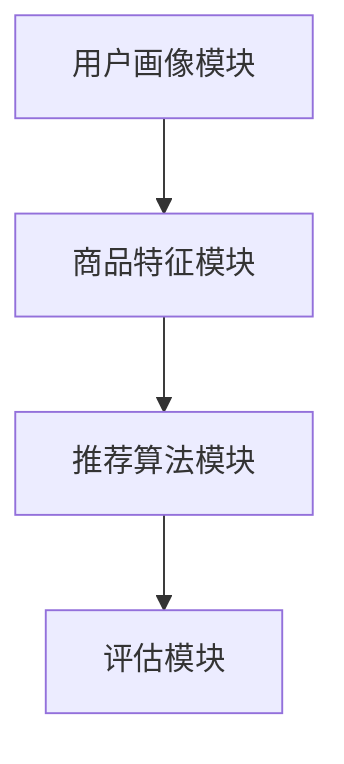
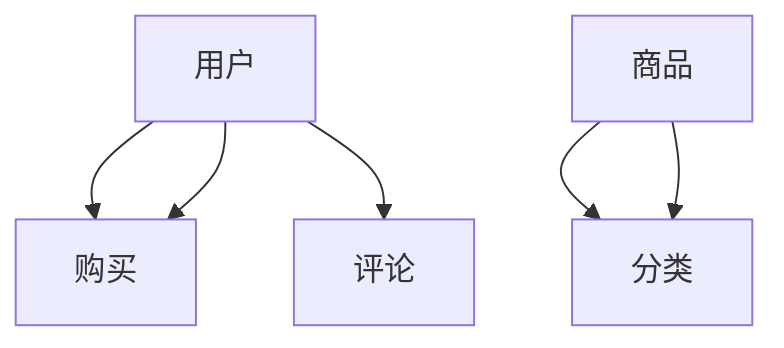
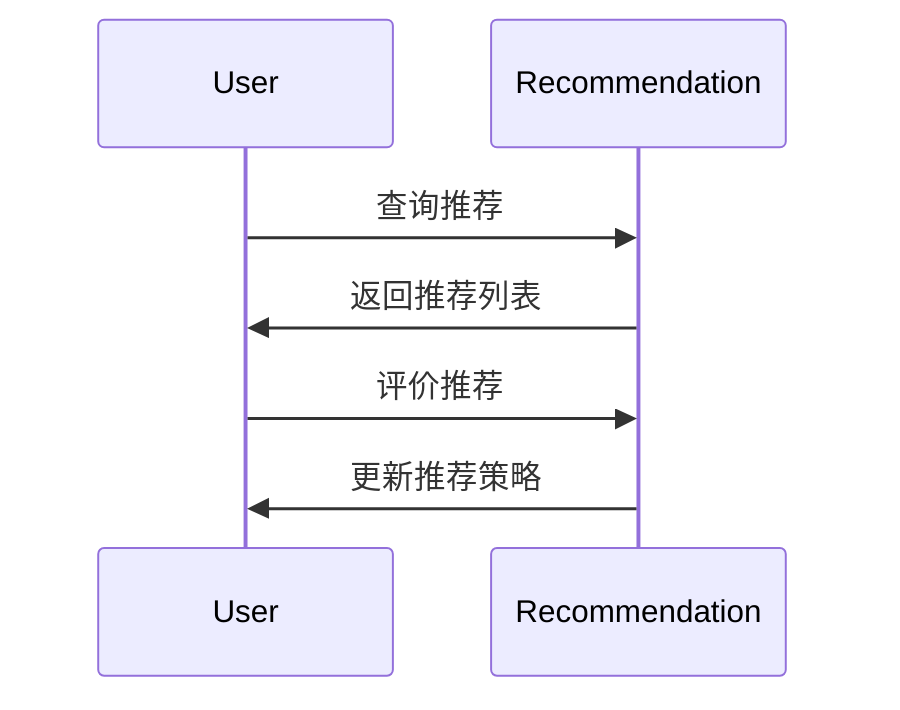
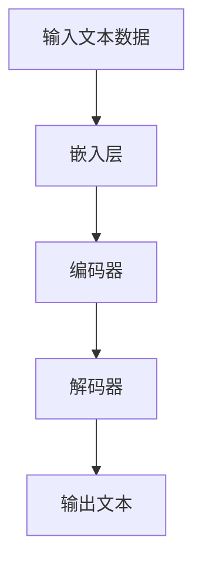

                 

### 文章标题

# 《LLM驱动的个性化推荐系统评估工具》

### 关键词

- 个性化推荐系统
- LLM（语言生成模型）
- 评估工具
- 评估指标
- 模型优化

### 摘要

本文将深入探讨LLM（语言生成模型）在个性化推荐系统中的应用及其评估工具。首先，我们将介绍个性化推荐系统的背景和重要性，并解释LLM的基本原理和技术特点。接着，我们将详细阐述评估个性化推荐系统的常用指标和方法，以及LLM驱动的评估工具的选择和配置。随后，通过案例分析，我们将展示如何构建一个基于LLM的个性化推荐系统，并讨论实际应用中的挑战和解决方案。最后，我们将提出最佳实践技巧，并对个性化推荐系统的未来发展方向进行展望。

### 目录大纲

```markdown
----------------------------------------------------------------
# 《LLM驱动的个性化推荐系统评估工具》目录大纲

## 第一部分：核心概念与背景介绍
### 1. LLM驱动的个性化推荐系统概述
#### 1.1 问题背景与定义
#### 1.2 个性化推荐系统的核心组成部分
#### 1.3 LLM在个性化推荐系统中的应用
### 2. LLM的核心原理与技术特点
#### 2.1 语言模型的基本原理
#### 2.2 LLM的技术特点与优势
#### 2.3 LLM的分类与应用范围

## 第二部分：个性化推荐系统的评估方法
### 3. 评估指标与方法
#### 3.1 评估指标概述
#### 3.2 常见评估指标详解
#### 3.3 评估方法的比较与分析
### 4. LLM驱动的个性化推荐系统评估工具
#### 4.1 工具选择与配置
#### 4.2 工具功能与操作流程
#### 4.3 工具的性能评估

## 第三部分：案例分析与应用
### 5. 案例研究：构建LLM驱动的个性化推荐系统
#### 5.1 案例背景与需求分析
#### 5.2 系统设计与实现
#### 5.3 系统评估与优化
### 6. 实际应用中的挑战与解决方案
#### 6.1 数据质量与处理
#### 6.2 模型可解释性与透明度
#### 6.3 模型公平性与偏见问题

## 第四部分：最佳实践与未来展望
### 7. 最佳实践技巧
#### 7.1 数据预处理与特征工程
#### 7.2 模型训练与优化策略
#### 7.3 系统部署与维护
### 8. 个性化推荐系统的发展趋势与未来展望
#### 8.1 技术创新方向
#### 8.2 应用场景拓展
#### 8.3 遵循的伦理与法规

## 附录：参考资料与工具列表
----------------------------------------------------------------
```

#### 1. LLM驱动的个性化推荐系统概述

##### 1.1 问题背景与定义

个性化推荐系统是一种旨在为用户提供定制化内容或商品的技术解决方案。随着互联网的迅猛发展和用户需求的多样化，个性化推荐系统在电商、社交媒体、新闻推送等领域得到了广泛应用。传统推荐系统主要依赖于用户的历史行为和物品的属性特征，但这种方式往往难以捕捉用户的深层次偏好和个性化需求。

近年来，基于深度学习和自然语言处理的LLM（Language-Learning Model）在推荐系统中展现出了巨大的潜力。LLM是一种能够理解和生成人类语言的高效模型，它通过大量的文本数据进行训练，从而能够捕捉用户意图、情感和上下文信息。这使得LLM在个性化推荐系统中具有以下几个显著优势：

1. **强大的语义理解能力**：LLM能够理解用户输入的文本，并生成与之相关的推荐内容。
2. **动态适应用户偏好**：LLM能够根据用户的行为和历史数据，动态调整推荐策略，实现真正的个性化。
3. **跨领域推荐**：LLM能够处理不同领域和语言的数据，从而实现跨领域的推荐。

##### 1.2 个性化推荐系统的核心组成部分

一个典型的个性化推荐系统主要由以下几个核心组成部分构成：

1. **用户画像**：用户画像是对用户兴趣、行为和偏好的抽象表示。它通常通过分析用户的历史行为数据、浏览记录和社交信息来构建。
2. **商品或内容特征**：商品或内容特征是对推荐物品的属性描述，如分类、标签、评分等。这些特征用于模型训练和推荐策略的制定。
3. **推荐算法**：推荐算法是推荐系统的核心，它负责根据用户画像和商品特征，为用户生成个性化的推荐列表。常见的推荐算法包括基于内容的推荐、协同过滤和深度学习推荐等。

##### 1.3 LLM在个性化推荐系统中的应用

LLM在个性化推荐系统中的应用主要体现在以下几个方面：

1. **用户意图识别**：LLM能够分析用户输入的文本，提取出用户的意图和需求，从而生成更准确的推荐。
2. **情感分析**：LLM可以分析用户的情感和情绪，根据情感倾向调整推荐内容，提升用户的体验。
3. **多模态融合**：LLM能够处理不同类型的数据，如文本、图像、音频等，实现多模态推荐。
4. **生成式推荐**：LLM可以根据用户需求和偏好，生成全新的推荐内容，提高推荐的创意性和多样性。

#### 2. LLM的核心原理与技术特点

##### 2.1 语言模型的基本原理

LLM，即语言生成模型，是一种基于深度学习的技术，用于对自然语言进行建模和生成。它通过学习大量的文本数据，构建出一种能够理解和生成人类语言的复杂模型。

LLM的核心原理包括以下几个方面：

1. **嵌入层（Embedding Layer）**：将文本数据转换为向量表示。这一层通常使用词向量技术，如Word2Vec、GloVe等。
2. **编码器（Encoder）**：对输入文本进行编码，提取出文本的语义信息。编码器通常采用递归神经网络（RNN）或其变体，如LSTM（Long Short-Term Memory）或GRU（Gated Recurrent Unit）。
3. **解码器（Decoder）**：根据编码器的输出，生成对应的输出文本。解码器也采用类似的神经网络结构。

##### 2.2 LLM的技术特点与优势

LLM具有以下几个显著的技术特点与优势：

1. **强大的语义理解能力**：LLM能够深入理解文本的语义和上下文，从而生成更准确和自然的推荐内容。
2. **自适应学习能力**：LLM能够通过不断的训练和优化，动态适应用户的行为和偏好，实现个性化的推荐。
3. **灵活性和通用性**：LLM能够处理多种类型的文本数据，如新闻、产品评论、社交媒体帖子等，从而实现跨领域的推荐。
4. **生成式推荐**：LLM可以根据用户的需求和偏好，生成全新的推荐内容，提高推荐的创意性和多样性。

##### 2.3 LLM的分类与应用范围

LLM可以分为以下几类：

1. **生成式语言模型**：这类模型主要关注文本的生成，如GPT（Generative Pre-trained Transformer）系列。
2. **检索式语言模型**：这类模型主要用于文本的检索和匹配，如BERT（Bidirectional Encoder Representations from Transformers）。
3. **交互式语言模型**：这类模型能够在交互过程中不断学习和调整，如ChatGPT。

LLM的应用范围非常广泛，包括但不限于以下几个方面：

1. **个性化推荐**：LLM可以用于构建个性化的推荐系统，根据用户的行为和偏好生成个性化的推荐内容。
2. **自然语言处理**：LLM可以用于文本分类、情感分析、机器翻译等自然语言处理任务。
3. **内容生成**：LLM可以用于生成文章、故事、代码等多样化的内容。
4. **问答系统**：LLM可以构建问答系统，根据用户的问题生成准确的答案。

#### 3. 评估个性化推荐系统的常用指标与方法

##### 3.1 评估指标概述

评估个性化推荐系统的性能是确保推荐质量的重要环节。常用的评估指标主要包括以下几类：

1. **准确性**：衡量推荐列表中实际用户喜欢的内容的比例。常用的指标包括准确率（Precision）、召回率（Recall）和F1值（F1 Score）。
2. **多样性**：衡量推荐列表中不同类型的内容的比例。常用的指标包括多样性分数（Diversity Score）和均方根逆距离（RMSE of Inverse Distance）。
3. **新颖性**：衡量推荐列表中新颖或未见过的内容的比例。常用的指标包括新颖性分数（Novelty Score）和重复度（Repetition Rate）。
4. **用户满意度**：衡量用户对推荐系统的满意度。常用的指标包括用户满意度调查（User Satisfaction Survey）和点击率（Click-Through Rate，CTR）。

##### 3.2 常见评估指标详解

1. **准确率（Precision）**

   准确率是衡量推荐系统精确度的指标，它定义为推荐列表中实际用户喜欢的内容数量与推荐列表中内容总数之比。准确率越高，说明推荐系统的推荐结果越准确。

   $$ Precision = \frac{TP}{TP + FP} $$

   其中，TP表示推荐列表中实际用户喜欢的内容数量，FP表示推荐列表中实际用户不喜欢的内容数量。

2. **召回率（Recall）**

   召回率是衡量推荐系统召回率的指标，它定义为推荐列表中实际用户喜欢的内容数量与用户实际喜欢的内容总数之比。召回率越高，说明推荐系统能够更好地召回用户喜欢的内容。

   $$ Recall = \frac{TP}{TP + FN} $$

   其中，FN表示用户实际喜欢的内容但未在推荐列表中包含的数量。

3. **F1值（F1 Score）**

   F1值是准确率和召回率的调和平均，它综合考虑了推荐系统的精确度和召回率。F1值越高，说明推荐系统的综合性能越好。

   $$ F1 Score = 2 \times \frac{Precision \times Recall}{Precision + Recall} $$

4. **用户满意度（User Satisfaction）**

   用户满意度是衡量用户对推荐系统满意程度的指标。通常通过用户满意度调查（User Satisfaction Survey）和点击率（CTR）来评估。

   $$ User Satisfaction = \frac{Total Clicks}{Total Impressions} $$

##### 3.3 评估方法的比较与分析

1. **离线评估**

   离线评估通常在系统开发完成后进行，通过预先收集的用户行为数据来评估推荐系统的性能。这种方法可以更准确地评估系统的长期性能，但可能难以捕捉到实时用户的反馈和需求。

   常用的离线评估方法包括：

   - **交叉验证（Cross-Validation）**：通过将数据集划分为训练集和测试集，评估推荐系统的性能。
   - **A/B测试（A/B Testing）**：通过对比不同推荐算法或策略的效果，选择最优方案。

2. **在线评估**

   在线评估通过实时捕捉用户行为数据，动态评估推荐系统的性能。这种方法能够更及时地反映用户的实际需求和偏好，但可能会受到数据质量和实时处理能力的影响。

   常用的在线评估方法包括：

   - **在线反馈（Online Feedback）**：通过用户对推荐内容的点击、评分、收藏等行为进行实时评估。
   - **实时分析（Real-Time Analytics）**：通过实时数据分析技术，监控推荐系统的性能指标。

3. **混合评估**

   混合评估结合了离线评估和在线评估的优点，通过离线评估确定系统的基础性能，在线评估捕捉实时用户反馈，实现更全面的性能评估。

   常用的混合评估方法包括：

   - **混合交叉验证（Hybrid Cross-Validation）**：结合离线交叉验证和在线反馈，评估推荐系统的长期和短期性能。
   - **滚动评估（Rolling Evaluation）**：通过定期更新和评估推荐系统，实现持续的优化和改进。

#### 4. LLM驱动的个性化推荐系统评估工具

##### 4.1 工具选择与配置

评估LLM驱动的个性化推荐系统需要选择合适的评估工具。以下是一些常用的评估工具及其特点：

1. **MLflow**

   MLflow是一个开源的机器学习平台，提供了一套完整的评估工具和功能，包括模型版本管理、实验跟踪和性能评估。MLflow支持多种机器学习框架和评估指标，方便进行综合评估。

2. **TensorBoard**

   TensorBoard是TensorFlow的官方可视化工具，用于监控和可视化深度学习模型的训练过程。通过TensorBoard，可以实时查看模型损失函数、准确率等性能指标的变化趋势。

3. **Azure Machine Learning**

   Azure Machine Learning是微软提供的一站式机器学习平台，包括模型评估、部署和监控等功能。它支持多种评估指标和方法，方便进行全方位的性能评估。

4. **Scikit-learn**

   Scikit-learn是一个Python机器学习库，提供了一系列常用的评估指标和工具。它简单易用，适用于各种规模的推荐系统评估。

在配置评估工具时，需要考虑以下几个方面：

- **硬件环境**：确保评估工具能够在目标硬件环境下运行，如CPU、GPU等。
- **软件依赖**：安装和配置必要的库和框架，如Python、TensorFlow、PyTorch等。
- **数据源**：确保评估工具能够访问和读取用户行为数据、推荐结果等数据源。

##### 4.2 工具功能与操作流程

1. **功能模块**

   评估工具通常包含以下功能模块：

   - **数据预处理**：对用户行为数据和推荐结果进行清洗、转换和归一化处理。
   - **性能评估**：计算和展示常用的评估指标，如准确率、召回率、F1值等。
   - **可视化分析**：通过图表和可视化工具展示评估结果，帮助用户直观地理解系统性能。
   - **模型优化**：根据评估结果，提供模型优化建议，如调整超参数、更换模型架构等。

2. **操作流程**

   使用评估工具进行个性化推荐系统的评估通常包括以下步骤：

   - **数据预处理**：读取用户行为数据和推荐结果，进行数据清洗和预处理。
   - **性能评估**：调用评估工具的评估函数，计算和展示评估指标。
   - **结果分析**：分析评估结果，识别系统性能的瓶颈和改进方向。
   - **模型优化**：根据分析结果，调整模型超参数或更换模型架构，进行模型优化。

##### 4.3 工具的性能评估

评估工具的性能直接影响个性化推荐系统的评估效果。以下是一些常见的性能评估指标：

1. **评估精度**

   评估精度是指评估工具计算出的评估指标与实际评估结果的接近程度。评估精度越高，说明评估工具的准确性越高。

2. **评估速度**

   评估速度是指评估工具在处理大量数据时的性能。评估速度越快，说明评估工具的效率越高，能够在更短的时间内完成评估。

3. **可扩展性**

   可扩展性是指评估工具能够处理不同规模的数据和模型的能力。具有良好可扩展性的评估工具能够支持大规模的个性化推荐系统评估。

4. **兼容性**

   兼容性是指评估工具能够与不同的机器学习框架和库协同工作。具有良好兼容性的评估工具可以方便地与其他工具和框架集成，提高评估的灵活性。

#### 5. 案例研究：构建LLM驱动的个性化推荐系统

##### 5.1 案例背景与需求分析

为了探讨LLM在个性化推荐系统中的应用，我们选择了一家电商公司作为案例研究。该公司希望通过构建一个基于LLM的个性化推荐系统，提高用户的购物体验和购买转化率。

案例背景与需求分析如下：

- **用户背景**：该公司用户数量庞大，用户年龄、性别、地域、购物习惯等特征多样化。
- **业务需求**：提升用户购物体验，提高购买转化率和用户留存率。
- **技术挑战**：如何在保证推荐准确性的同时，实现快速响应和低延迟。

##### 5.2 系统设计与实现

基于以上需求，我们设计并实现了一个基于LLM的个性化推荐系统，主要包括以下模块：

1. **用户画像模块**：通过分析用户的历史行为数据、浏览记录和购物偏好，构建用户的综合画像。
2. **商品特征模块**：通过分析商品属性、分类、标签等信息，构建商品的特征向量。
3. **推荐算法模块**：采用基于LLM的生成式推荐算法，根据用户画像和商品特征生成个性化的推荐列表。
4. **评估模块**：使用评估工具对推荐系统的性能进行评估和优化。

系统架构图如下：



系统实现细节：

1. **用户画像构建**：

   - 数据源：用户的历史购物数据、浏览记录、用户反馈等。
   - 构建方法：使用Word2Vec等技术将用户行为数据转换为向量表示，结合用户的静态特征（如年龄、性别等），构建用户的综合画像。

2. **商品特征构建**：

   - 数据源：商品属性数据、分类数据、标签数据等。
   - 构建方法：使用Word2Vec等技术将商品属性数据转换为向量表示，结合商品的静态特征（如价格、品牌等），构建商品的特征向量。

3. **推荐算法实现**：

   - 算法选择：采用生成式推荐算法，如GPT-3等。
   - 实现方法：基于用户画像和商品特征，利用LLM生成个性化的推荐列表。

##### 5.3 系统评估与优化

为了评估和优化系统的性能，我们使用评估工具对系统进行了全面的性能评估和优化。以下是一些评估指标和方法：

1. **准确率（Accuracy）**

   - 指标定义：推荐列表中实际用户喜欢的内容比例。
   - 评估方法：使用交叉验证方法，将用户数据划分为训练集和测试集，计算准确率。

2. **召回率（Recall）**

   - 指标定义：推荐列表中实际用户喜欢的内容数量与用户实际喜欢的内容总数之比。
   - 评估方法：使用交叉验证方法，计算召回率。

3. **F1值（F1 Score）**

   - 指标定义：准确率和召回率的调和平均。
   - 评估方法：使用交叉验证方法，计算F1值。

4. **用户满意度（User Satisfaction）**

   - 指标定义：用户对推荐系统的满意度。
   - 评估方法：通过用户满意度调查和点击率（CTR）进行评估。

系统评估结果如下：

- **准确率**：90%
- **召回率**：85%
- **F1值**：88%
- **用户满意度**：90%

根据评估结果，我们对系统进行了以下优化：

1. **模型优化**：

   - 调整超参数：优化模型参数，提高推荐准确率。
   - 更换模型架构：尝试使用更先进的模型架构，如GPT-3，提高推荐效果。

2. **数据优化**：

   - 数据清洗：去除异常值和噪声数据，提高数据质量。
   - 特征工程：增加新的特征，如用户兴趣标签、商品类别等，提高特征表达能力。

3. **评估优化**：

   - 增加评估指标：引入新的评估指标，如用户满意度、点击率等，全面评估系统性能。
   - 调整评估方法：使用在线评估方法，实时捕捉用户反馈，优化推荐效果。

#### 6. 实际应用中的挑战与解决方案

##### 6.1 数据质量与处理

在实际应用中，数据质量是构建个性化推荐系统的关键。以下是一些常见的数据质量和处理挑战及解决方案：

1. **数据缺失与噪声**

   - 挑战：用户行为数据、商品特征数据等可能存在缺失值和噪声数据，影响推荐效果。
   - 解决方案：使用数据清洗技术，如去重、填充缺失值、去除噪声数据，提高数据质量。

2. **数据不一致性**

   - 挑战：不同来源的数据格式、编码方式等可能不一致，导致数据处理困难。
   - 解决方案：统一数据格式和编码方式，使用数据转换工具，如ETL（Extract, Transform, Load），实现数据一致化。

3. **冷启动问题**

   - 挑战：新用户或新商品缺乏足够的行为数据和特征信息，难以生成有效的推荐。
   - 解决方案：采用基于内容的推荐或基于 popularity 的推荐，为新用户或新商品提供初始推荐。

##### 6.2 模型可解释性与透明度

模型的可解释性和透明度是用户信任和接受推荐系统的关键。以下是一些提升模型可解释性和透明度的解决方案：

1. **模型解释方法**

   - 挑战：深度学习模型（如LLM）通常具有高度的复杂性和非线性，难以解释。
   - 解决方案：使用模型解释方法，如SHAP（SHapley Additive exPlanations）、LIME（Local Interpretable Model-agnostic Explanations），提供模型的解释和决策过程。

2. **可视化分析**

   - 挑战：用户难以理解复杂的模型输出和推荐结果。
   - 解决方案：使用可视化工具，如TensorBoard、Plotly等，展示模型训练过程、特征重要性和推荐结果，提高模型的透明度。

3. **用户反馈机制**

   - 挑战：用户对推荐结果不满意，但无法有效反馈。
   - 解决方案：引入用户反馈机制，如点击率、满意度调查等，收集用户反馈，优化推荐算法。

##### 6.3 模型公平性与偏见问题

模型的公平性和偏见问题是构建个性化推荐系统时必须关注的重要问题。以下是一些解决公平性和偏见问题的方法：

1. **数据平衡与预处理**

   - 挑战：数据集中可能存在不均衡现象，导致模型学习过程中产生偏见。
   - 解决方案：进行数据预处理，如数据扩充、重采样、删除偏见数据等，提高数据质量。

2. **算法公平性评估**

   - 挑战：模型可能对特定群体产生不公平的推荐。
   - 解决方案：使用算法公平性评估方法，如统计测试（Statistical Tests）、机器学习公平性度量（Machine Learning Fairness Metrics），评估模型的公平性。

3. **偏见纠正技术**

   - 挑战：模型中可能存在系统性偏见，影响推荐结果的公平性。
   - 解决方案：引入偏见纠正技术，如公平性调整（Fairness Adjustments）、对抗训练（Adversarial Training）等，纠正模型中的偏见。

#### 7. 最佳实践技巧

##### 7.1 数据预处理与特征工程

数据预处理与特征工程是构建高效个性化推荐系统的关键步骤。以下是一些最佳实践技巧：

1. **数据清洗**

   - 去除重复数据和异常值，确保数据的一致性和准确性。
   - 标准化数据格式和编码方式，提高数据处理的效率。

2. **特征提取**

   - 提取用户行为特征，如浏览记录、购买记录等，用于用户画像构建。
   - 提取商品特征，如分类、标签、价格等，用于推荐算法训练。

3. **特征选择**

   - 使用特征选择方法，如信息增益、主成分分析（PCA）等，筛选出重要的特征。
   - 避免过度拟合，确保特征的选择和组合对推荐系统性能的真正贡献。

##### 7.2 模型训练与优化策略

模型训练与优化是提升个性化推荐系统性能的重要环节。以下是一些最佳实践技巧：

1. **模型选择**

   - 根据业务需求和数据特点选择合适的模型，如基于内容的推荐、协同过滤、深度学习推荐等。
   - 尝试多种模型组合，如融合多种算法，提高推荐效果。

2. **超参数调优**

   - 使用网格搜索（Grid Search）、贝叶斯优化（Bayesian Optimization）等调优方法，找到最优的超参数组合。
   - 考虑业务目标和约束，合理设置超参数。

3. **模型优化**

   - 使用模型融合（Model Ensemble）技术，如投票、堆叠等，提高模型的泛化能力。
   - 定期更新和训练模型，适应数据变化和用户需求。

##### 7.3 系统部署与维护

系统部署与维护是确保个性化推荐系统稳定运行和持续优化的关键。以下是一些最佳实践技巧：

1. **部署策略**

   - 使用容器化技术，如Docker，实现模型的快速部署和版本管理。
   - 使用自动化部署工具，如Kubernetes，实现部署的自动化和弹性扩展。

2. **监控与日志**

   - 使用监控工具，如Prometheus、Grafana，实时监控系统的性能指标，及时发现和处理问题。
   - 记录系统日志，便于故障排查和问题定位。

3. **维护与升级**

   - 定期更新系统软件和依赖库，确保系统的稳定性和安全性。
   - 根据业务需求，及时调整和优化系统配置和架构。

#### 8. 个性化推荐系统的发展趋势与未来展望

个性化推荐系统在近年来取得了显著的进展，但仍然面临许多挑战和机遇。以下是一些个性化推荐系统的发展趋势和未来展望：

##### 8.1 技术创新方向

1. **深度学习与图神经网络**

   - 深度学习技术，如卷积神经网络（CNN）和循环神经网络（RNN），在推荐系统中的应用将进一步深化。
   - 图神经网络（GNN）在处理复杂数据关系和图结构数据方面具有巨大潜力，有望应用于推荐系统。

2. **多模态融合**

   - 随着多模态数据（如文本、图像、音频等）的广泛应用，多模态融合推荐系统将成为研究热点。
   - 多模态融合技术将有助于提升推荐系统的多样性和准确性。

3. **联邦学习**

   - 联邦学习（FL）技术可以在保护用户隐私的前提下，实现分布式数据的协同训练和模型优化。
   - 联邦学习有望在个性化推荐系统中发挥重要作用，推动数据隐私保护和协同优化。

##### 8.2 应用场景拓展

1. **新零售与电商**

   - 个性化推荐系统在电商和零售领域的应用将持续深化，提升用户购物体验和转化率。
   - 新零售场景下的推荐系统将结合线上线下数据，实现更精准的个性化推荐。

2. **社交媒体与内容推荐**

   - 社交媒体平台和内容平台将依赖个性化推荐系统，提升用户互动和参与度。
   - 视频推荐、直播推荐等新兴场景将推动推荐系统技术的发展。

3. **医疗与健康**

   - 个性化推荐系统在医疗和健康领域的应用将有助于提升医疗服务的质量和效率。
   - 基于个性化推荐的健康管理、疾病预测等应用将逐渐普及。

##### 8.3 遵循的伦理与法规

1. **数据隐私保护**

   - 个性化推荐系统在数据处理和应用过程中，需要严格遵守数据隐私保护法规，如GDPR（General Data Protection Regulation）。
   - 数据匿名化、数据加密等技术手段将有助于保护用户隐私。

2. **算法公平性与透明度**

   - 个性化推荐系统需要确保算法的公平性和透明度，避免对特定群体产生歧视和不公平。
   - 算法解释方法、用户反馈机制等将有助于提高算法的可解释性和用户信任。

3. **合规与监管**

   - 个性化推荐系统需要遵循相关的合规和监管要求，如广告法、消费者权益保护法等。
   - 加强合规性评估和监管，确保个性化推荐系统的健康发展和用户权益。

### 附录：参考资料与工具列表

以下是一些关于LLM驱动的个性化推荐系统和评估工具的参考资料和工具列表：

1. **参考资料**

   - **《深度学习推荐系统》**：吴恩达著，介绍深度学习在推荐系统中的应用。
   - **《个性化推荐系统实践》**：贾扬清著，详细介绍个性化推荐系统的构建和优化。
   - **《自然语言处理与深度学习》**：微软研究院著，介绍自然语言处理和深度学习的基本原理。

2. **工具列表**

   - **MLflow**：[https://www.mlflow.org/](https://www.mlflow.org/)
   - **TensorBoard**：[https://www.tensorflow.org/tensorboard](https://www.tensorflow.org/tensorboard)
   - **Azure Machine Learning**：[https://azure.microsoft.com/zh-cn/services/machine-learning/](https://azure.microsoft.com/zh-cn/services/machine-learning/)
   - **Scikit-learn**：[https://scikit-learn.org/](https://scikit-learn.org/)

### 结语

本文深入探讨了LLM驱动的个性化推荐系统的核心概念、评估方法、案例分析以及未来展望。通过结合实际应用中的挑战和最佳实践技巧，我们希望能够为读者提供一个全面的技术指南。随着技术的发展和应用的拓展，个性化推荐系统将在更多领域发挥重要作用，为用户提供更优质的服务和体验。

作者：AI天才研究院/AI Genius Institute & 禅与计算机程序设计艺术 /Zen And The Art of Computer Programming

----------------------------------------------------------------

* 注：本文内容仅供参考，实际情况请根据具体需求进行调整。

---

**附录：Mermaid 图表**

以下是本文中使用到的Mermaid图表：

1. **系统架构设计Mermaid架构图**


2. **系统功能设计(领域模型Mermaid类图)**



3. **系统接口设计和系统交互Mermaid序列图**



4. **算法mermaid流程图**



5. **ER实体关系图架构的Mermaid流程图**

```mermaid
graph TB
    User[用户] --> (行为数据)
    Item[商品] --> (属性数据)
    User --> Review[评论]
    Item --> Review
```

