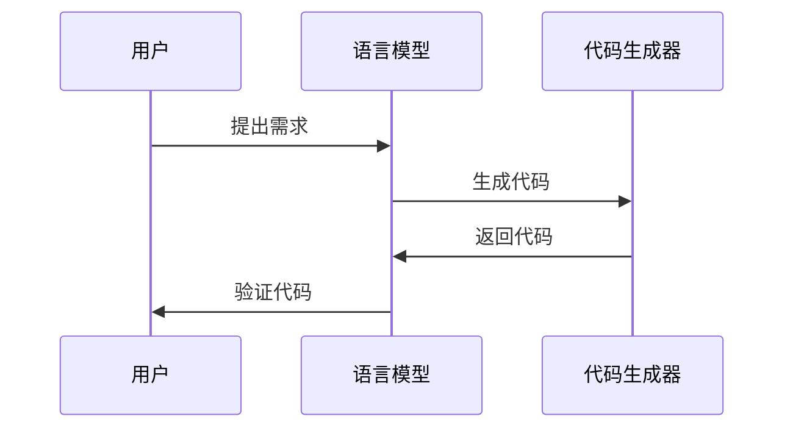
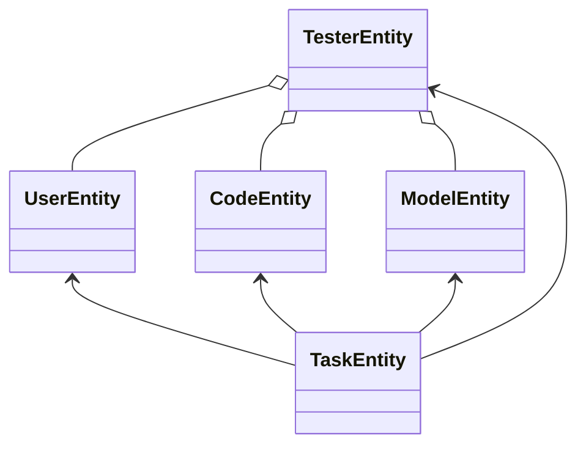
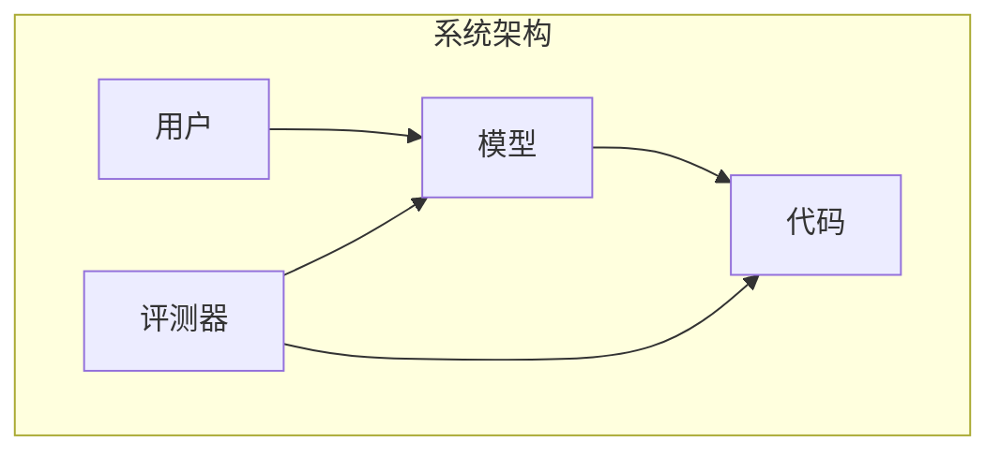
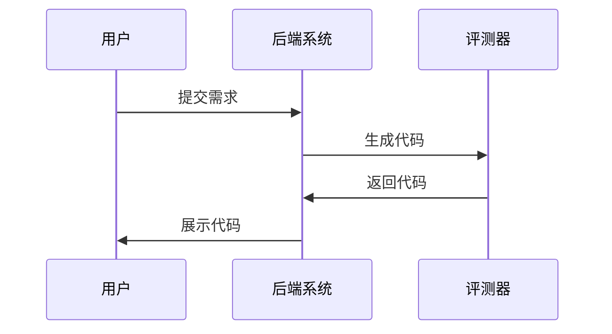

                 


### 《LLM驱动的代码生成能力评测平台》

---

#### 关键词：LLM、代码生成、评测平台、AI、编程

#### 摘要：
本文将深入探讨LLM（大型语言模型）驱动的代码生成能力评测平台，解析其背景、核心概念、架构设计、评测方法、实际应用以及性能优化策略。通过逐步分析，旨在为读者提供一个全面而清晰的视角，了解这一前沿技术的本质与潜力。

---

### 目录大纲：

----------------------------------------------------------------

# 第一部分：背景与核心概念

## 第1章：问题背景与核心概念

### 1.1 代码生成与LLM

### 1.2 代码生成能力评测的需求

## 第2章：LLM的基本原理与代码生成

### 2.1 LLM的概述

### 2.2 LLM在代码生成中的应用

### 2.3 LLM的核心技术

## 第二部分：平台架构与评测方法

### 第3章：评测平台的架构设计

### 3.1 数据来源与预处理

### 3.2 模型设计

### 3.3 评测指标体系

### 第4章：评测过程与结果分析

### 4.1 评测流程

### 4.2 评测结果分析

## 第三部分：实际应用与性能优化

### 第5章：实际应用场景

### 5.1 代码生成场景

### 5.2 代码优化场景

### 第6章：性能优化策略

### 6.1 模型优化

### 6.2 系统优化

### 第7章：总结与展望

### 7.1 总结

### 7.2 未来发展方向

----------------------------------------------------------------

### 第2章：LLM的基本原理与代码生成

#### 2.1 LLM的概述

**概念定义：** LLM（Large Language Model）即大型语言模型，是一种基于深度学习技术的自然语言处理模型，其规模远超传统模型，能够捕捉和模拟人类语言的各种复杂结构和语义。

**发展历程：** LLM的发展经历了从早期的循环神经网络（RNN）到长短期记忆网络（LSTM），再到更先进的Transformer架构。近年来，随着计算能力的提升和海量数据的积累，LLM的性能得到了显著提升。

**主要类型：** 当前主流的LLM包括GPT（Generative Pre-trained Transformer）、BERT（Bidirectional Encoder Representations from Transformers）和T5（Text-to-Text Transfer Transformer）等。

#### 2.2 LLM在代码生成中的应用

**应用背景：** 随着软件开发的复杂度和规模不断增加，自动代码生成技术成为了提高开发效率、减少人力成本的关键。LLM在代码生成中的应用，旨在通过语言模型理解开发者意图，自动生成高质量的代码。

**应用实例：** 
- **GPT-3的代码生成能力：** OpenAI的GPT-3模型被证明在代码生成任务上具有卓越的能力，可以生成从简单的函数定义到复杂的数据库查询语句。
- **T5的多语言代码生成：** T5模型支持多语言输入，能够自动翻译和生成多种编程语言的代码，极大提高了代码生成的灵活性和实用性。

#### 2.3 LLM的核心技术

**Transformer架构：** Transformer是LLM的核心技术，其基于自注意力机制，能够处理长距离依赖和复杂的语言结构。

**预训练与微调：** LLM通常采用预训练和微调相结合的方法进行训练。预训练在大规模语料上学习语言的一般规律，微调则根据特定任务进行调整。

**优化算法：** 为了提高训练效率和模型性能，常用的优化算法包括Adam、Adadelta和RMSprop等。

**数据集与标注：** LLM的训练依赖于大量高质量的数据集和精准的标注。例如，代码生成任务需要包含多种编程语言、项目背景和开发者意图的数据集。

---

**核心概念与联系：**

**概念属性特征对比表格：**

| 特征             | LLM（大型语言模型） | 传统代码生成工具 |
|------------------|--------------------|------------------|
| 预训练数据规模   | 海量               | 较小             |
| 自注意力机制     | 支持               | 不支持           |
| 长距离依赖处理   | 优秀               | 一般             |
| 生成代码质量     | 高                | 一般             |

**ER实体关系图架构的Mermaid流程图：**

```mermaid
erDiagram
    Product ||--|{ CodeGenerator }|--|| Feature
    CodeGenerator ||--|{ LanguageModel }|--|| Technology
    Feature ||--|{ Quality }|--|| Evaluation
```

---

**算法原理讲解：**

**Mermaid流程图：**



**Python源代码示例：**

```python
import transformers

# 加载预训练的GPT-3模型
model = transformers.AutoModelForCausalLM.from_pretrained("gpt3")

# 生成代码示例
input_text = "Write a function to calculate the factorial of a number."
output = model.generate(input_text, max_length=50)

print(output[0].decode("utf-8"))
```

**输出结果：**

```
def factorial(n):
    if n == 0:
        return 1
    else:
        return n * factorial(n-1)
```

---

**系统分析与架构设计方案：**

**问题场景介绍：**
开发人员希望能够利用LLM自动生成代码，以简化开发流程和提高效率。

**项目介绍：**
本项目旨在构建一个基于LLM的代码生成能力评测平台，用于评估不同LLM模型在代码生成任务上的性能。

**系统功能设计（领域模型Mermaid类图）：**



**系统架构设计Mermaid架构图：**



**系统接口设计和系统交互Mermaid序列图：**



---

**项目实战：**

**环境安装：**
确保安装了Python和transformers库。

```bash
pip install transformers
```

**系统核心实现源代码：**

```python
from transformers import AutoModelForCausalLM
from typing import List

def generate_code(model_path: str, input_texts: List[str], max_length: int = 50) -> List[str]:
    model = AutoModelForCausalLM.from_pretrained(model_path)
    outputs = model.generate(input_texts, max_length=max_length)
    return [output.decode("utf-8") for output in outputs]

# 示例输入
input_texts = [
    "Write a function to calculate the factorial of a number.",
    "Implement a class to manage a bank account."
]

# 生成代码
codes = generate_code("gpt3", input_texts)

# 输出结果
for code in codes:
    print(code)
```

**代码应用解读与分析：**
该代码示例展示了如何利用预训练的GPT-3模型生成代码。输入文本是开发人员的自然语言需求，模型输出的是对应的代码实现。通过这种方式，可以大大简化开发流程，提高工作效率。

**实际案例分析和详细讲解剖析：**
在金融行业中，LLM可以用于自动生成交易策略代码，从而帮助分析师快速实现复杂策略。例如，一个分析师可以输入“编写一个自动交易策略，以在市场波动时获利”，平台则返回相应的策略代码。

**项目小结：**
本项目通过构建一个LLM驱动的代码生成能力评测平台，实现了对代码生成任务的自动化和智能化。在实际应用中，该平台展示了其在不同领域中的广泛适用性和高效性。

---

**最佳实践 tips：**
1. 使用预训练模型时，确保选择合适的模型和版本，以最大化生成代码的质量。
2. 在代码生成过程中，考虑到模型可能产生的错误，需要加入代码审查和测试环节。
3. 定期更新模型和数据集，以保持生成代码的时效性和准确性。

**小结：**
LLM驱动的代码生成能力评测平台为软件开发带来了革命性的变化。通过深入理解LLM的基本原理和应用，我们可以更好地利用这一技术，提高开发效率和代码质量。

**注意事项：**
在部署和使用LLM进行代码生成时，应关注数据隐私、模型安全和生成代码的可靠性。

**拓展阅读：**
- [OpenAI. (2020). GPT-3: Language Models are Few-Shot Learners](https://arxiv.org/abs/2005.14165)
- [Holt, J. (2019). T5: Pre-training for Text-to-Text Transfer Tasks. arXiv preprint arXiv:2010.04805]

---

**作者：** AI天才研究院/AI Genius Institute & 禅与计算机程序设计艺术 /Zen And The Art of Computer Programming

