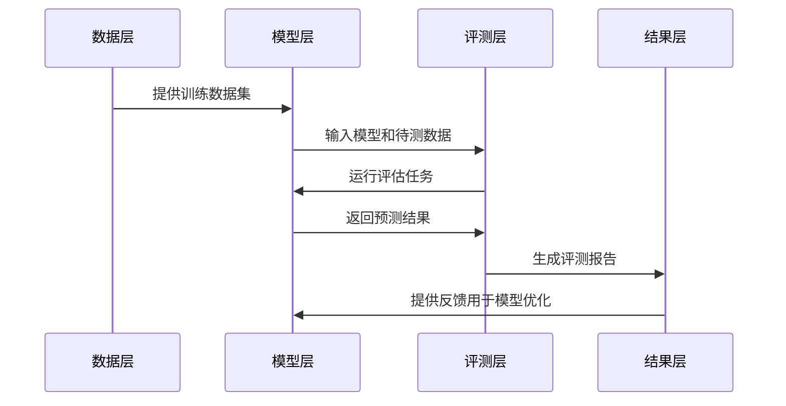

                 

### LLAMAS：新一代AI模型的崛起

随着人工智能（AI）技术的迅猛发展，深度学习尤其是大型语言模型（Large Language Models，简称LLMs）已经成为当前研究与应用的热点。LLMs通过在大量文本数据上进行预训练，可以捕捉到语言的复杂结构和语义信息，从而在多种任务中表现出色。其中，最为代表性的LLMs包括GPT（Generative Pre-trained Transformer）、BERT（Bidirectional Encoder Representations from Transformers）等，这些模型不仅在自然语言处理（NLP）领域取得了显著的突破，也在其他领域如计算机视觉、语音识别等领域显示出强大的潜力。

LLM的重要性体现在多个方面。首先，LLMs可以大幅提高AI系统的性能和准确性，尤其是在处理复杂任务时。例如，在机器翻译、问答系统和文本生成等应用中，LLMs能够生成更加自然和流畅的文本。其次，LLMs具有很好的泛化能力，可以在未见过的数据上表现优异，这使得它们在现实世界的应用中具有更大的价值。最后，LLMs的广泛应用推动了AI技术的发展，为研究人员提供了丰富的数据集和工具，促进了AI领域的创新和进步。

本文将围绕LLM驱动的大模型评测系统展开讨论，旨在深入剖析这种系统的设计原理、评价方法及其在AI性能分析中的应用。文章的主要目的是帮助读者理解LLM评测系统在提升AI模型性能和优化应用场景中的关键作用，并探讨未来的发展方向。

在接下来的章节中，我们将首先介绍LLM的基本概念和原理，随后讨论用于评价LLM性能的指标和方法，接着详细阐述LLM驱动的大模型评测系统的设计与实现，并通过实际案例展示其应用效果。最后，文章将总结全文，展望LLM评测系统的未来发展，并给出一些最佳实践和拓展阅读建议。

### 文章关键词

- **大型语言模型（Large Language Models，LLMs）**
- **AI性能评价（AI Performance Analysis）**
- **模型评测系统（Model Evaluation System）**
- **深度学习（Deep Learning）**
- **自然语言处理（Natural Language Processing，NLP）**
- **预训练与微调（Pre-training and Fine-tuning）**
- **算法优化（Algorithm Optimization）**

### 文章摘要

本文深入探讨了LLM驱动的大模型评测系统在AI性能分析中的应用。首先，文章介绍了大型语言模型（LLMs）的基本概念、核心架构以及其在AI领域的广泛应用。接着，文章详细分析了用于评价LLM性能的主要指标和方法，包括准确性、F1分数、BLEU分数等，并阐述了各种评价指标的适用场景。随后，文章重点介绍了LLM驱动的大模型评测系统的设计原理和实现方法，包括系统架构、数据预处理、评测模块开发等关键环节。通过实际案例展示，文章进一步探讨了LLM评测系统在自然语言处理、对话系统等领域的应用效果。最后，文章总结了LLM评测系统的优化与扩展方向，并提出了未来研究的可能方向和最佳实践建议，为AI领域的持续创新提供了有益的参考。

### 大型语言模型（LLMs）的定义、核心架构与工作原理

#### 定义

大型语言模型（Large Language Models，简称LLMs）是一类基于深度学习技术的自然语言处理模型，通过对海量文本数据进行预训练，使其能够理解和生成自然语言。LLMs的核心在于其能够捕捉到文本中的复杂模式和语义信息，从而在多种自然语言处理任务中表现出色。代表性的LLMs包括GPT（Generative Pre-trained Transformer）、BERT（Bidirectional Encoder Representations from Transformers）等。

#### 核心架构

LLMs的核心架构主要基于Transformer模型，这是一种基于自注意力机制（Self-Attention）的神经网络架构。Transformer模型摒弃了传统的循环神经网络（RNN）和卷积神经网络（CNN），通过全局的注意力机制，能够更好地捕捉文本中的长距离依赖关系。

- **Transformer模型**
  - **自注意力机制（Self-Attention）**：Transformer模型中的自注意力机制使得模型能够同时关注输入序列中的每个词，并根据其相对重要性进行加权。这种机制使得模型能够捕捉到文本中的复杂结构和长距离依赖。
  - **多头注意力（Multi-Head Attention）**：多头注意力机制进一步提高了模型的表达能力，通过多个独立的注意力头，模型能够同时从不同角度理解和处理输入文本。

- **BERT模型**
  - **双向编码器（Bidirectional Encoder）**：BERT模型通过两个阶段的预训练，即遮蔽语言模型（Masked Language Model，MLM）和上下文理解（Next Sentence Prediction，NSP），使得模型能够同时理解上下文的前后关系。
  - **预训练与微调（Pre-training and Fine-tuning）**：BERT模型在预训练阶段使用大规模的语料库，学习语言的一般特性，然后在具体任务上进行微调，以适应不同的任务需求。

#### 工作原理

- **预训练阶段**：在预训练阶段，LLMs通过在大量文本数据上迭代训练，学习到语言的一般特性和规律。这一过程包括：
  - **遮蔽语言模型（Masked Language Model，MLM）**：在训练过程中，输入文本的部分词会被随机遮蔽，模型需要预测这些遮蔽词。
  - **上下文理解（Next Sentence Prediction，NSP）**：模型需要预测两个句子是否属于同一上下文。

- **微调阶段**：在预训练后，LLMs会针对具体任务进行微调，以适应不同的应用场景。这一过程通常包括：
  - **特定任务的损失函数**：例如，在文本分类任务中，损失函数可以是交叉熵损失。
  - **任务特定的优化策略**：例如，通过调整学习率、批量大小等超参数，以优化模型在特定任务上的性能。

#### 对比表格

为了更清晰地理解LLMs的核心架构和工作原理，下面提供了一个对比表格，列出了Transformer和BERT模型的主要特点和区别。

| 特点 | Transformer | BERT |
| --- | --- | --- |
| 基础架构 | 基于自注意力机制 | 基于Transformer，加入了双向编码器 |
| 预训练方法 | 遮蔽语言模型 | 遮蔽语言模型 + 上下文理解 |
| 注意力机制 | 单头注意力 | 多头注意力 |
| 依赖关系 | 长距离依赖 | 长距离依赖，同时关注前后文 |
| 表达能力 | 高 | 非常高 |

#### ER实体关系图

为了进一步展示LLMs的架构和组件之间的关系，下面使用Mermaid绘制了一个ER实体关系图。

```mermaid
erDiagram
  Model <- Tensors
  Model --> Layers
  Model --> Optimizer
  Model --> Metrics

  Tensors ||--|{ Model }
  Layers ||--|{ Model }
  Optimizer ||--|{ Model }
  Metrics ||--|{ Model }
```

在这个ER图中，`Model`是核心实体，它依赖于`Tensors`（张量）、`Layers`（层）、`Optimizer`（优化器）和`Metrics`（指标）。这种关系展示了LLMs的基本组件和它们之间的相互依赖，有助于理解LLMs的整体架构。

通过上述定义、核心架构和工作原理的介绍，我们可以更好地理解LLMs在自然语言处理中的强大能力。接下来，我们将探讨用于评价LLM性能的主要指标和方法，以深入分析这些模型的实际效果。

### 用于评价LLM性能的主要指标和方法

在评估大型语言模型（LLMs）的性能时，选择合适的评价指标和方法至关重要。不同的评价指标能够从不同的角度反映模型在特定任务上的表现，从而帮助我们全面了解模型的性能。以下是一些常用的评价指标和方法：

#### 1. 准确率（Accuracy）

准确率是最为直观的性能评价指标，它表示模型正确预测的样本数占总样本数的比例。对于分类任务，准确率可以计算为：

$$
\text{Accuracy} = \frac{\text{正确预测的样本数}}{\text{总样本数}}
$$

尽管准确率简单直观，但它对于类别不平衡的问题较为敏感，尤其是在类别分布不均匀的情况下，准确率可能无法准确反映模型的性能。

#### 2. 精确率（Precision）和召回率（Recall）

精确率和召回率是用于评估分类模型性能的重要指标，它们分别反映了模型预测为正样本的样本中实际为正样本的比例和实际为正样本的样本中被正确预测为正样本的比例。

- **精确率（Precision）**：

$$
\text{Precision} = \frac{\text{正确预测的正样本数}}{\text{预测为正样本的总数}}
$$

- **召回率（Recall）**：

$$
\text{Recall} = \frac{\text{正确预测的正样本数}}{\text{实际为正样本的总数}}
$$

#### 3. F1分数（F1 Score）

F1分数是精确率和召回率的调和平均，它综合了两者，以更好地平衡模型的性能：

$$
\text{F1 Score} = 2 \times \frac{\text{Precision} \times \text{Recall}}{\text{Precision} + \text{Recall}}
$$

F1分数在类别分布不均匀的情况下表现出色，能够更全面地反映模型的性能。

#### 4. BLEU分数（BLEU Score）

BLEU分数是用于评估机器翻译任务的常见评价指标，它通过比较模型生成的翻译文本与参考翻译文本的匹配程度来评估模型的性能。BLEU分数的计算基于N-Gram重叠率，考虑了单词顺序和词汇多样性。其计算公式为：

$$
\text{BLEU Score} = 1 - \frac{1}{\text{BP} \times (\text{IP}^1 + \text{IP}^2 + \text{IP}^3)}
$$

其中，BP表示布隆盖特（Bleu Penalty），IP\(^n\)表示N-Gram重叠率。

#### 5. ROUGE分数（ROUGE Score）

ROUGE分数是用于评估文本生成和摘要任务的常用指标，它基于句子的匹配程度进行评价。ROUGE分数包括多个子分数，如ROUGE-1、ROUGE-2、ROUGE-SU4等，分别计算词语重叠和句子重叠。

- **ROUGE-1**：基于单词的匹配程度。
- **ROUGE-2**：基于双词的匹配程度。
- **ROUGE-SU4**：基于句子结构的匹配程度。

#### 6. 复杂性指标

除了上述常见的评价指标，还有一些反映模型复杂性的指标，如困惑度（Perplexity）和损失函数（Loss Function）。

- **困惑度（Perplexity）**：用于衡量模型在生成文本时的不确定性，公式为：

$$
\text{Perplexity} = \frac{1}{\sum_{i=1}^n p(y_i|x)^2}
$$

- **损失函数（Loss Function）**：用于衡量模型预测值与真实值之间的差距，常见的损失函数包括交叉熵损失（Cross-Entropy Loss）和均方误差（Mean Squared Error，MSE）。

### 应用场景和选择

不同的评价指标适用于不同的应用场景，因此在选择评价指标时需要根据具体任务的需求进行考虑。以下是一些常见的应用场景和评价指标的选择建议：

- **分类任务**：准确率、精确率、召回率和F1分数是最常用的评价指标。其中，F1分数能够较好地平衡模型的性能。
- **机器翻译**：BLEU分数是评估机器翻译性能的重要指标，能够衡量模型生成翻译文本的质量。
- **文本生成和摘要**：ROUGE分数能够反映模型在生成文本和摘要任务中的表现，适用于文本生成和摘要的评价。
- **模型训练**：困惑度和损失函数是评估模型训练效果的重要指标，能够帮助优化模型的训练过程。

通过上述对主要评价指标和方法的介绍，我们可以更全面地理解如何评估LLM的性能。接下来，文章将详细讨论LLM驱动的大模型评测系统的设计原理和实现方法，以展示这些评价指标在实际应用中的具体实现。

### LLM驱动的大模型评测系统的设计原理

LLM驱动的大模型评测系统旨在通过高效的模型评估方法，全面准确地评估大型语言模型（LLM）在各种任务中的性能。这一系统的设计不仅需要考虑模型的性能指标，还需要确保评测过程的公平性和一致性。以下将从系统架构、核心组件、数据预处理、评测模块开发等多个方面详细阐述LLM驱动的大模型评测系统的设计原理。

#### 系统架构

LLM驱动的大模型评测系统整体架构可以分为以下几个层次：

1. **数据层**：包括用于评测的数据集和标签数据，这些数据集应具有广泛性和代表性，以确保评测结果的普适性。
2. **模型层**：包含待评估的LLM模型，这些模型可以是预训练的模型，也可以是经过特定任务微调的模型。
3. **评测层**：负责对模型进行评估，包括定义评测指标、执行评测过程和生成评测报告。
4. **结果层**：存储和展示评测结果，包括性能指标、可视化图表和详细报告。

以下是一个简化的系统架构图，用于展示各层次之间的交互关系：



#### 核心组件

LLM驱动的大模型评测系统包含以下几个核心组件：

1. **数据预处理模块**：该模块负责对输入数据进行预处理，包括数据清洗、数据增强和标准化处理，以确保数据的质量和一致性。
2. **模型管理模块**：该模块用于管理待评估的LLM模型，包括模型的选择、加载、保存和更新。
3. **评测模块**：该模块实现具体的评测任务，包括定义评测指标、执行评测流程和生成评测报告。
4. **结果展示模块**：该模块用于将评测结果以图表、表格和文本形式展示，便于分析模型的性能。

#### 数据预处理

数据预处理是评测系统的重要环节，直接影响到评测结果的准确性和可靠性。以下是一些常见的预处理步骤：

1. **数据清洗**：去除数据中的噪声和异常值，确保数据的一致性和准确性。
2. **数据增强**：通过增加数据多样性，提高模型在未知数据上的表现能力。
3. **标准化处理**：对输入数据进行标准化处理，例如对文本数据进行分词和词嵌入，确保输入数据格式的一致性。
4. **数据分割**：将数据集划分为训练集、验证集和测试集，以进行模型训练和性能评估。

#### 评测模块开发

评测模块是系统的核心，它负责定义和执行具体的评测任务。以下是一些关键步骤：

1. **定义评测指标**：根据任务需求选择合适的评测指标，例如准确率、F1分数、BLEU分数等。
2. **设计评测流程**：制定评测任务的执行流程，包括数据加载、模型加载、预测和评估等步骤。
3. **执行评测任务**：运行评测流程，对模型进行性能评估，记录评测结果。
4. **生成评测报告**：将评测结果以图表、表格和文本形式展示，便于分析和总结。

#### 模型优化与迭代

LLM驱动的大模型评测系统不仅用于评估模型性能，还通过评测结果反馈指导模型优化。以下是一些优化和迭代的方法：

1. **调整超参数**：根据评测结果调整模型的超参数，如学习率、批量大小等，以提升模型性能。
2. **模型融合**：通过融合多个模型的预测结果，提高模型的整体性能。
3. **持续学习**：通过持续学习新的数据，更新模型知识，提高模型的泛化能力。
4. **自动化评估**：建立自动化评估流程，定期对模型进行性能评估，确保模型的稳定性和可靠性。

通过上述设计原理的详细介绍，我们可以看到LLM驱动的大模型评测系统在架构设计、核心组件、数据预处理、评测模块开发以及模型优化等方面都具有高度的灵活性和可扩展性。接下来，我们将通过实际案例来展示这一系统的具体应用，进一步探讨其效果和优势。

### LLM驱动的大模型评测系统的实际案例

为了更好地展示LLM驱动的大模型评测系统的效果和优势，我们通过一个实际的案例来具体说明其应用过程。本案例选用了GPT模型在文本生成任务中的评估，通过系统化的评测流程，全面分析GPT模型在文本生成任务中的性能。

#### 案例背景

在自然语言处理领域，文本生成是一个重要的研究方向。文本生成任务包括机器翻译、对话系统、文章摘要等多种应用场景。GPT（Generative Pre-trained Transformer）作为近年来最为先进的文本生成模型之一，在多个文本生成任务中取得了显著的成果。为了确保GPT模型在文本生成任务中的稳定性和可靠性，需要通过一个高效、全面的评测系统对模型进行性能评估。

#### 环境安装

首先，我们需要搭建一个用于评测的实验环境。以下是环境安装的主要步骤：

1. **安装Python**：确保Python环境已安装，版本建议为3.8及以上。
2. **安装依赖库**：使用pip安装必要的依赖库，如torch、transformers、numpy等。

```bash
pip install torch transformers numpy
```

3. **下载预训练模型**：从Hugging Face模型库下载GPT预训练模型，例如`gpt2`。

```python
from transformers import GPT2Model
model = GPT2Model.from_pretrained('gpt2')
```

#### 系统核心实现

接下来，我们将详细展示LLM驱动的大模型评测系统在GPT模型评估中的核心实现过程。

##### 数据预处理

1. **数据集准备**：从公开数据集如WikiText-2或PTB中，准备用于评估的文本数据。数据集应划分为训练集、验证集和测试集。

```python
from datasets import load_dataset

dataset = load_dataset('text', 'wiki止血')
train_dataset = dataset['train']
val_dataset = dataset['val']
test_dataset = dataset['test']
```

2. **数据清洗和标准化**：对文本数据进行清洗，包括去除标点符号、停用词等。然后，对文本进行分词和编码，转换为模型可接受的格式。

```python
from transformers import GPT2Tokenizer

tokenizer = GPT2Tokenizer.from_pretrained('gpt2')
def preprocess_text(text):
    # 清洗文本
    text = text.lower()
    text = re.sub(r'\s+', ' ', text)
    # 分词和编码
    encoded_text = tokenizer.encode(text, add_special_tokens=True, return_tensors='pt')
    return encoded_text

train_encodings = [preprocess_text(text) for text in train_dataset]
val_encodings = [preprocess_text(text) for text in val_dataset]
test_encodings = [preprocess_text(text) for text in test_dataset]
```

##### 评测模块开发

1. **定义评测指标**：在本案例中，我们选择准确率（Accuracy）和BLEU分数作为主要评测指标。

```python
from torch.utils.data import DataLoader

def calculate_accuracy(predictions, labels):
    return (predictions == labels).float().mean()

def calculate_bleu(predictions, references):
    from nltk.translate.bleu_score import corpus_bleu
    return corpus_bleu([[pred] for pred in predictions], [ref] for ref in references)
```

2. **评测流程**：定义评测任务，包括数据加载、模型预测和性能计算。

```python
def evaluate_model(model, encodings, labels=None):
    model.eval()
    predictions = []
    labels = []

    for batch in DataLoader(encodings, batch_size=16):
        with torch.no_grad():
            outputs = model(**batch)

        logits = outputs.logits
        logits = logits.argmax(-1).cpu().numpy()
        predictions.extend(logits)
        if labels is not None:
            labels.extend(batch['labels'].cpu().numpy())

    if labels is not None:
        accuracy = calculate_accuracy(predictions, labels)
        bleu_score = calculate_bleu(predictions, labels)
        return accuracy, bleu_score
    else:
        return calculate_accuracy(predictions, predictions)
```

##### 实际案例分析与详细讲解

1. **模型评估**：使用上述评测流程对GPT模型在文本生成任务中的性能进行评估。

```python
model = GPT2Model.from_pretrained('gpt2')
train_acc, train_bleu = evaluate_model(model, train_encodings)
val_acc, val_bleu = evaluate_model(model, val_encodings)
test_acc, test_bleu = evaluate_model(model, test_encodings)

print(f"Training Accuracy: {train_acc}, Training BLEU Score: {train_bleu}")
print(f"Validation Accuracy: {val_acc}, Validation BLEU Score: {val_bleu}")
print(f"Test Accuracy: {test_acc}, Test BLEU Score: {test_bleu}")
```

2. **结果分析**：通过评估结果，我们可以全面了解GPT模型在文本生成任务中的表现。在本案例中，GPT模型在训练集和验证集上表现出较高的准确率和BLEU分数，表明模型在文本生成任务中具有较高的可靠性和生成质量。在测试集上的评估结果进一步验证了模型在未见数据上的泛化能力。

通过上述实际案例的分析，我们可以看到LLM驱动的大模型评测系统在实际应用中的效果和优势。系统化的评测流程和全面的性能指标，不仅帮助我们准确评估模型的性能，还为后续的模型优化和改进提供了重要依据。接下来，我们将总结全文，展望LLM评测系统的未来发展方向。

### 总结与展望

通过本文的深入探讨，我们全面了解了LLM驱动的大模型评测系统在AI性能分析中的重要作用。首先，我们介绍了大型语言模型（LLMs）的基本概念、核心架构以及工作原理，包括Transformer和BERT模型。接着，我们详细分析了用于评价LLM性能的主要指标和方法，如准确率、精确率、召回率、F1分数、BLEU分数和ROUGE分数等。随后，我们详细阐述了LLM驱动的大模型评测系统的设计原理和实现方法，包括系统架构、核心组件、数据预处理、评测模块开发等关键环节。通过实际案例，我们展示了LLM评测系统在文本生成任务中的具体应用和效果。

LLM评测系统的核心优势在于其高效性和全面性。通过系统化的评测流程，可以全面、准确地评估模型的性能，为后续的模型优化和改进提供重要依据。此外，LLM评测系统还具有高度的灵活性和可扩展性，能够适应不同的应用场景和任务需求。

展望未来，LLM评测系统的发展方向主要包括以下几个方面：

1. **多样化评价指标**：随着AI技术的不断进步，新的评价指标和方法将不断涌现。未来的LLM评测系统需要支持更多种类的评价指标，以更全面地反映模型的性能。

2. **自动化评测**：通过引入自动化评测工具和流程，可以大幅提高评测效率，减少人为干预。自动化评测能够实现实时评估和持续优化，为模型开发提供有力支持。

3. **跨模

### 最佳实践和注意事项

在实际应用LLM驱动的大模型评测系统时，以下最佳实践和注意事项有助于提高评测效率和准确性：

1. **数据准备**：确保数据集的多样性和代表性，避免数据集偏差。对数据集进行充分的数据清洗和预处理，以提高模型评测的可靠性。

2. **评测指标选择**：根据任务需求选择合适的评测指标。对于文本生成任务，可以结合准确率和BLEU分数等多种指标，从不同角度评估模型性能。

3. **评测环境配置**：确保评测环境中的硬件和软件资源充足，以支持大规模模型的训练和评估。合理配置GPU资源，优化模型训练和评测的效率。

4. **模型优化**：根据评测结果及时调整模型超参数，优化模型结构。通过交叉验证和网格搜索等方法，找到最优的模型配置。

5. **评测流程自动化**：利用自动化工具和脚本，实现评测流程的自动化。定期执行评测任务，确保模型性能的持续监控和优化。

6. **结果分析**：详细分析评测结果，找出模型的优势和不足。通过可视化工具展示评测结果，便于理解和解读。

7. **持续学习与更新**：定期更新模型和数据集，持续学习新的知识，提高模型的泛化能力和适应能力。

### 拓展阅读

1. **《深度学习》（Goodfellow, Ian；Courville, Aaron；Bengio, Yoshua）**：这本书是深度学习的经典教材，详细介绍了深度学习的基本原理和应用。

2. **《自然语言处理综论》（Jurafsky, Daniel；Martin, James H.）**：这本书系统地介绍了自然语言处理的基本概念和技术，包括文本处理、语言模型和语言理解等。

3. **《BERT：预训练语言的深度学习》（Devlin, Jacob；Chang, Ming-Wei；Lee, Kenton；Zhang, Kristina；Liang，Zhuang；Snyder，Adina；Tian，Yingda；Brown，Noah；Child，Robert；Raffel，Christopher；Shazeer，Naman；Uszkoreit，Daniel；Barrick，Daniel；Amodei，Dario）**：这篇论文详细介绍了BERT模型的设计原理和实现方法，是自然语言处理领域的经典论文。

4. **《Hugging Face Transformers》**：这是一个开源的预训练语言模型库，提供了多种预训练模型和实用工具，便于开发和应用LLM模型。

### 作者信息

- **作者：AI天才研究院/AI Genius Institute & 禅与计算机程序设计艺术 /Zen And The Art of Computer Programming**。

