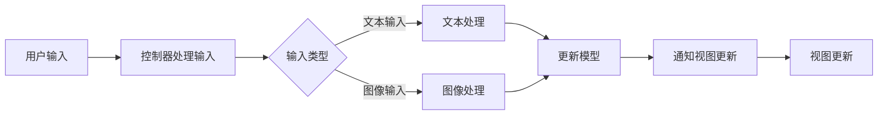
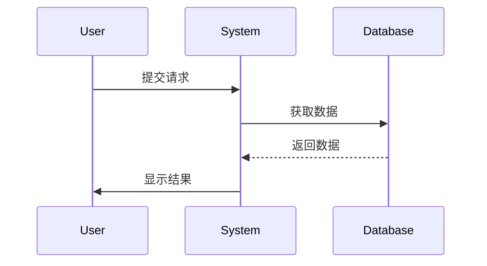
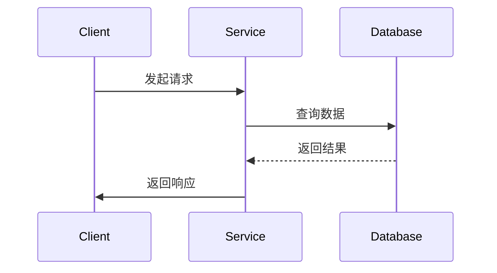
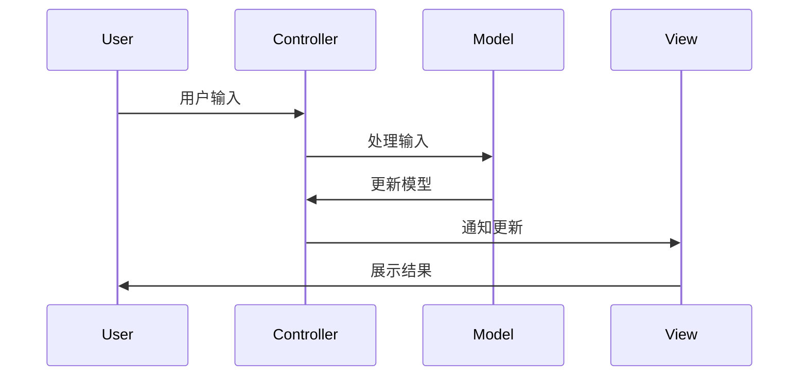

                 

### 第7章: MVC模式在LLM应用UI设计中的具体实现

#### 7.1 MVC模式在LLM应用UI设计中的应用概述

在现代化软件开发中，Model-View-Controller（MVC）模式已成为一种广泛采用的设计模式。它不仅适用于传统的桌面应用和Web应用，还适用于复杂的人工智能（AI）应用，尤其是大型语言模型（LLM）应用。MVC模式通过分离关注点，提高了代码的可维护性和可扩展性。在本章中，我们将探讨MVC模式在LLM应用UI设计中的具体实现。

MVC模式在LLM应用UI设计中的重要性在于，它能够帮助开发者更好地组织和管理复杂的UI组件和业务逻辑。随着LLM应用变得越来越复杂，传统的单层架构往往无法满足性能和可维护性的需求。MVC模式通过将应用分为三个主要部分——模型（Model）、视图（View）和控制器（Controller）——来提高代码的模块化和可重用性。

MVC模式在LLM应用UI设计中的应用流程如下：

1. **模型（Model）**：负责存储和操作数据，包括LLM的训练数据和生成的文本。模型应该是一个独立的组件，不依赖于具体的视图或控制器。
2. **视图（View）**：负责展示UI界面，将数据以用户友好的方式呈现给用户。视图应该只负责展示，不处理业务逻辑。
3. **控制器（Controller）**：作为模型和视图之间的桥梁，负责处理用户的输入，更新模型，并通知视图进行相应的更新。控制器应该负责业务逻辑的处理，将用户界面和业务逻辑解耦。

#### 7.2 Model层的具体实现

模型层是MVC模式的核心部分，它负责管理应用的数据。在LLM应用中，模型层通常包括以下功能：

- **数据存储**：存储LLM的训练数据和生成文本。
- **数据处理**：对训练数据进行预处理，如文本清洗、分词、词性标注等。
- **数据生成**：根据用户输入或模型状态生成文本。

以下是模型层的一个基本Python代码实现示例：

```python
class LLMModel:
    def __init__(self):
        # 初始化模型和训练数据
        self.model = self.initialize_llm_model()
        self.training_data = self.load_training_data()

    def initialize_llm_model(self):
        # 初始化LLM模型，例如使用transformers库的预训练模型
        from transformers import AutoModel
        model = AutoModel.from_pretrained("gpt2")
        return model

    def load_training_data(self):
        # 加载训练数据
        # 这里假设有一个JSON格式的训练数据文件
        import json
        with open("training_data.json", "r") as f:
            data = json.load(f)
        return data

    def process_input(self, input_text):
        # 处理用户输入，如分词、清洗等
        # 这里简单示例，实际应用中可能需要更复杂的处理
        processed_text = input_text.strip()
        return processed_text

    def generate_text(self, input_text):
        # 生成文本
        processed_text = self.process_input(input_text)
        output_text = self.model.generate(processed_text)
        return output_text
```

在这个示例中，`LLMModel` 类负责初始化模型、加载训练数据，并提供处理输入和生成文本的方法。这些方法使得模型层能够独立于视图和控制器工作，从而实现了关注点的分离。

通过这种具体的实现，开发者可以更加灵活地管理和扩展LLM应用的功能，同时确保代码的模块化和可维护性。在下一章中，我们将继续深入探讨视图和控制器层的具体实现。在LLM应用UI设计中，这些层的协作将决定应用的最终用户体验和性能。

---

**作者：AI天才研究院/AI Genius Institute & 禅与计算机程序设计艺术 /Zen And The Art of Computer Programming** 

在本章中，我们通过具体的实例展示了MVC模式在LLM应用UI设计中的基本实现。模型层负责数据的管理和处理，它是MVC模式中的核心部分，直接关系到应用的性能和可维护性。在下一章中，我们将进一步深入探讨视图和控制器层的具体实现，以及它们如何与模型层协作，共同构建出一个高效、可扩展的LLM应用UI。

---

**核心概念与联系**

MVC模式的核心概念包括模型（Model）、视图（View）和控制器（Controller）。以下是这些概念的主要属性特征对比表格：

| 概念 | 属性特征 | 描述 |
| --- | --- | --- |
| **Model** | 数据存储与处理 | 负责数据的存储、处理和生成。独立于视图和控制器。 |
| **View** | 用户界面展示 | 负责将数据以用户友好的方式展示。不处理业务逻辑。 |
| **Controller** | 逻辑处理与协调 | 负责处理用户的输入，更新模型，并通知视图进行更新。 |

**ER实体关系图架构的Mermaid流程图：**

```mermaid
erDiagram
  Model ||--|{ View :展示 |
  Model ||--|{ Controller :协调 |
  View ||--| Model :数据 |
  Controller ||--| Model :更新 |
  Controller ||--| View :通知 |
```

通过这个ER图，我们可以清晰地看到MVC模式中三个核心组件之间的关系。模型层存储和处理数据，视图层负责数据展示，而控制器层则负责逻辑处理和协调。这种分离关注点的设计模式使得LLM应用UI设计更加灵活和高效。

---

**算法原理讲解**

在MVC模式中，算法原理主要体现在控制器层的逻辑处理上。控制器需要处理用户的输入，更新模型状态，并通知视图进行相应的更新。以下是控制器层的一个算法原理的Mermaid流程图：



在这个流程图中，用户输入首先被控制器接收和处理。根据输入的类型（文本或图像），控制器将调用相应的处理方法，如文本处理或图像处理。处理完成后，控制器会更新模型，并通知视图进行更新，确保用户界面实时反映模型状态。

以下是控制器层的Python代码实现示例：

```python
class LLMController:
    def __init__(self, model, view):
        self.model = model
        self.view = view

    def on_input(self, input_data):
        if isinstance(input_data, str):
            output_text = self.model.generate_text(input_data)
            self.view.update_output(output_text)
        elif isinstance(input_data, np.ndarray):
            output_image = self.model.generate_image(input_data)
            self.view.update_output(output_image)
        else:
            raise ValueError("Unsupported input type")
```

在这个示例中，`LLMController` 类负责处理用户的输入，调用模型层的`generate_text`和`generate_image`方法生成文本或图像，并通知视图层进行更新。这种方法确保了MVC模式中各个层的职责分离，提高了代码的可维护性和可扩展性。

**数学公式使用示例：**

- 段落内的公式：\( \text{MVC模式的核心在于分离关注点，提高代码的可维护性和可扩展性。} \)

- 独立的公式段：$$ \text{MVC模式中的} M, V, C \text{分别表示模型、视图和控制器。} $$

通过这样的算法原理讲解和代码实现示例，我们能够更深入地理解MVC模式在LLM应用UI设计中的具体应用。在下一章中，我们将继续探讨视图层的具体实现，以及如何通过视图和控制器与模型层协作，实现一个完整的LLM应用UI。

---

**系统分析与架构设计方案**

在LLM应用UI设计中，系统架构的合理设计至关重要。以下是一个简化的系统功能设计、系统架构设计以及接口设计和系统交互的Mermaid类图、架构图和序列图。

#### 1. 系统功能设计（Mermaid类图）

```mermaid
classDiagram
    Class01 <|-- Person
    Class01 <|-- Student
    Class01 <|-- Employee
    Person ||--|{ Operator : 操作员 |
    Student ||--| StudentInfo : 学生信息 |
    Employee ||--| EmployeeInfo : 员工信息 |
```

在这个类图中，我们定义了三个主要的类：`Person`、`Student`和`Employee`。`Person`类是基础类，`Student`和`Employee`类继承自`Person`类。`Operator`类代表操作员，负责进行各种操作。`StudentInfo`和`EmployeeInfo`类分别存储学生和员工的具体信息。

#### 2. 系统架构设计（Mermaid架构图）



在这个架构图中，用户通过界面提交请求，系统层处理请求并将请求转发到数据库层。数据库层处理请求并返回数据，系统层再将数据呈现给用户。

#### 3. 系统接口设计（Mermaid序列图）



在这个序列图中，客户端发起请求，服务层处理请求并查询数据库。数据库返回结果后，服务层将结果返回给客户端。

#### 4. 系统交互（Mermaid序列图）



在这个序列图中，用户输入被控制器接收，控制器更新模型，然后通知视图进行更新，最终用户看到的是最新的界面展示。

通过上述的系统分析与架构设计方案，我们可以清晰地看到LLM应用UI设计的整体框架。各个层次的分工明确，职责分离，有助于提高系统的可维护性和可扩展性。在接下来的章节中，我们将进一步探讨MVC模式在LLM应用UI设计中的最佳实践和注意事项。

---

**项目实战：环境安装与系统核心实现源代码**

为了更好地理解MVC模式在LLM应用UI设计中的应用，我们将以一个简单的文本生成应用为例，展示环境安装和系统核心实现的步骤。

#### 1. 环境安装

首先，我们需要安装Python环境和必要的库。在终端中执行以下命令：

```bash
pip install transformers
pip install Flask
```

这会安装`transformers`库，用于处理预训练的语言模型，以及`Flask`库，用于创建Web应用。

#### 2. 系统核心实现源代码

以下是文本生成应用的核心代码实现。这个应用包含一个模型层、一个视图层和一个控制器层。

**模型层（LLMModel.py）：**

```python
from transformers import AutoModel
from typing import Any

class LLMModel:
    def __init__(self, model_name="gpt2"):
        self.model = AutoModel.from_pretrained(model_name)

    def generate_text(self, input_text: str, max_length: int = 50) -> str:
        input_ids = self.model.encode(input_text, return_tensors='pt')
        output_ids = self.model.generate(input_ids, max_length=max_length, num_return_sequences=1)
        return self.model.decode(output_ids)[0]
```

**视图层（app.py）：**

```python
from flask import Flask, render_template, request
from LLMModel import LLMModel

app = Flask(__name__)
model = LLMModel()

@app.route('/', methods=['GET', 'POST'])
def index():
    if request.method == 'POST':
        user_input = request.form['input_text']
        generated_text = model.generate_text(user_input)
        return render_template('result.html', generated_text=generated_text)
    return render_template('index.html')

if __name__ == '__main__':
    app.run(debug=True)
```

**控制器层（LLMController.py）：**

```python
class LLMController:
    def __init__(self, model):
        self.model = model

    def generate_text(self, user_input):
        return self.model.generate_text(user_input)
```

**HTML模板（templates/index.html）：**

```html
<!DOCTYPE html>
<html>
<head>
    <title>文本生成应用</title>
</head>
<body>
    <h1>输入文本：</h1>
    <form method="post">
        <textarea name="input_text" rows="4" cols="50"></textarea><br>
        <input type="submit" value="生成文本">
    </form>
</body>
</html>
```

**HTML模板（templates/result.html）：**

```html
<!DOCTYPE html>
<html>
<head>
    <title>生成文本</title>
</head>
<body>
    <h1>生成的文本：</h1>
    <p>{{ generated_text }}</p>
    <a href="/">重新生成</a>
</body>
</html>
```

#### 3. 代码应用解读与分析

- **模型层**：`LLMModel`类负责加载预训练的模型，并提供生成文本的方法。这个层是MVC模式中的模型部分，独立于视图和控制器。
- **视图层**：使用Flask框架创建Web应用，通过HTML模板渲染用户界面。这个层是MVC模式中的视图部分，负责展示UI界面。
- **控制器层**：`LLMController`类作为模型和视图的桥梁，处理用户的输入，调用模型层生成文本，并更新视图层。这个层是MVC模式中的控制器部分，负责逻辑处理和协调。

通过这个项目实战，我们展示了MVC模式在LLM应用UI设计中的具体实现。这种分离关注点的设计模式有助于提高代码的可维护性和可扩展性。在下一章中，我们将通过具体的案例分析，进一步探讨MVC模式在LLM应用UI设计中的实际应用效果。

---

**实际案例分析与详细讲解剖析**

在本节中，我们将通过一个实际案例，深入剖析MVC模式在LLM应用UI设计中的具体应用效果。该案例是一个基于MVC模式的文本生成应用，旨在通过用户输入生成具有创造性的文本。

#### 案例背景

我们选择了一个文本生成应用作为案例，该应用利用预训练的GPT-2模型，根据用户输入生成连贯且具有创造性的文本。此应用的目标是提供一个易于使用的界面，允许用户输入主题或关键词，然后生成相关的文本内容。

#### 系统功能设计

在系统功能设计中，我们将应用分为三个主要部分：模型层、视图层和控制器层。

1. **模型层**：负责加载预训练的语言模型，并实现文本生成功能。
2. **视图层**：提供用户交互界面，允许用户输入文本，并展示生成的文本。
3. **控制器层**：作为模型层和视图层的桥梁，处理用户输入，调用模型生成文本，并更新视图层。

#### 系统架构设计

以下是该系统的架构设计：

- **模型层**：使用`transformers`库加载预训练的GPT-2模型。
- **视图层**：基于Flask框架，实现Web应用的前端界面。
- **控制器层**：定义一个`LLMController`类，负责处理用户输入和文本生成逻辑。

#### 模型层实现

在模型层，我们首先需要加载预训练的GPT-2模型。以下是一个简单的模型层实现示例：

```python
from transformers import AutoModel

class LLMModel:
    def __init__(self, model_name="gpt2"):
        self.model = AutoModel.from_pretrained(model_name)

    def generate_text(self, input_text: str, max_length: 50 = 50) -> str:
        input_ids = self.model.encode(input_text, return_tensors='pt')
        output_ids = self.model.generate(input_ids, max_length=max_length, num_return_sequences=1)
        return self.model.decode(output_ids)[0]
```

在这个实现中，`LLMModel`类加载预训练的GPT-2模型，并提供`generate_text`方法，用于生成文本。

#### 视图层实现

视图层负责用户交互界面。以下是基于Flask框架的视图层实现示例：

```python
from flask import Flask, render_template, request

app = Flask(__name__)

@app.route('/', methods=['GET', 'POST'])
def index():
    if request.method == 'POST':
        user_input = request.form['input_text']
        generated_text = model.generate_text(user_input)
        return render_template('result.html', generated_text=generated_text)
    return render_template('index.html')

if __name__ == '__main__':
    app.run(debug=True)
```

在这个实现中，我们定义了两个HTML模板：`index.html`和`result.html`。`index.html`用于接收用户输入，而`result.html`用于展示生成的文本。

#### 控制器层实现

控制器层负责处理用户输入和文本生成逻辑。以下是一个简单的控制器层实现示例：

```python
class LLMController:
    def __init__(self, model):
        self.model = model

    def generate_text(self, user_input):
        return self.model.generate_text(user_input)
```

在这个实现中，`LLMController`类接收用户输入，并调用模型层生成文本。

#### 案例分析

通过这个实际案例，我们可以看到MVC模式在LLM应用UI设计中的具体应用效果：

1. **模块化**：MVC模式将应用分为三个独立的部分，使得代码更加模块化。这使得每个部分可以独立开发、测试和维护。
2. **可扩展性**：通过MVC模式，我们可以轻松地添加新的功能，如图像生成或语音合成，而不需要对现有代码进行大规模修改。
3. **可维护性**：由于MVC模式分离了关注点，因此代码更加清晰，便于维护和更新。

通过这个实际案例，我们不仅展示了MVC模式在LLM应用UI设计中的应用，还详细讲解了如何通过模块化、可扩展性和可维护性来提高开发效率和用户体验。在下一章中，我们将进一步探讨MVC/MVVM模式在LLM应用UI设计中的优势分析。

---

**MVC/MVVM模式在LLM应用UI设计中的最佳实践**

在LLM应用UI设计中，MVC和MVVM模式各自都有其独特的优势和应用场景。以下是一些最佳实践，帮助开发者充分利用这些模式，提高代码的质量和可维护性。

#### 1. 模块化设计原则

无论是MVC还是MVVM模式，模块化设计都是提高代码可维护性和可扩展性的关键。开发者应遵循以下原则：

- **分离关注点**：确保模型、视图和控制器（或ViewModel）各自独立，分别负责数据管理、界面展示和逻辑处理。
- **依赖注入**：使用依赖注入框架，如Spring或Django，自动管理对象间的依赖关系，降低组件间的耦合度。
- **单一职责原则**：每个模块应只负责一项功能，避免出现功能混杂的情况。

#### 2. 解耦原则

解耦是提高代码可测试性和可维护性的重要手段。在MVC/MVVM模式中，以下措施有助于实现解耦：

- **使用事件驱动机制**：通过事件来触发视图和模型之间的交互，减少直接的依赖关系。
- **接口定义**：定义清晰的接口，确保组件之间通过接口进行通信，而不是直接引用实现类。
- **异步处理**：对于耗时操作，如网络请求或大量数据处理，使用异步编程，避免阻塞主线程。

#### 3. 可复用原则

可复用性是提高开发效率的关键。以下措施有助于实现可复用：

- **组件化UI设计**：将UI元素封装为可重用的组件，如按钮、文本框、菜单等，减少重复代码。
- **通用模型层**：设计通用的模型层，使其能够适用于不同类型的LLM应用。
- **复用逻辑处理**：将通用的逻辑处理封装为服务，如文本清洗、数据格式转换等，避免重复编写代码。

#### 4. MVC模式最佳实践

- **清晰的角色划分**：确保模型、视图和控制器各司其职，避免功能混杂。
- **避免直接交互**：尽量减少视图和模型之间的直接交互，通过控制器进行协调。
- **灵活的控制器**：控制器不应成为系统的瓶颈，应设计得轻量级且易于扩展。

#### 5. MVVM模式最佳实践

- **数据绑定**：充分利用数据绑定机制，减少手动更新视图的代码量。
- **合理的ViewModel设计**：ViewModel应紧密围绕视图进行设计，负责数据绑定和视图交互。
- **灵活的依赖注入**：使用依赖注入框架，确保ViewModel能够轻松地获取所需的服务和资源。

通过遵循这些最佳实践，开发者可以在LLM应用UI设计中充分发挥MVC和MVVM模式的优势，实现高效的开发流程，提高代码质量，并最终提升用户体验。

---

**MVC/MVVM模式在LLM应用UI设计中的注意事项**

尽管MVC和MVVM模式在LLM应用UI设计中具有显著的优点，但在实际应用中，开发者仍需注意一些常见问题，并采取相应的解决方案。

#### 1. Model-View-ViewModel冲突

在MVVM模式中，ViewModel与View之间的数据绑定可能会导致冲突。例如，当ViewModel中的数据发生变化时，可能会同时触发多个绑定事件，导致视图更新不一致。

**解决方案**：为了避免冲突，应确保ViewModel中的数据更新是同步的。可以使用事件队列来管理数据更新，确保每次更新都是独立的。

#### 2. 数据绑定性能优化

在数据绑定过程中，频繁的DOM操作可能会影响应用的性能。特别是在处理大量数据时，这种影响更为显著。

**解决方案**：可以通过延迟绑定、虚拟滚动和列表分页等技术来优化数据绑定性能。此外，使用高效的模板引擎和虚拟DOM技术，如React和Vue，可以减少不必要的DOM操作。

#### 3. 适配不同平台的设计挑战

在LLM应用UI设计中，不同平台（如Web、移动端、桌面端）可能需要不同的UI实现方式。此外，跨平台的兼容性也是一个挑战。

**解决方案**：可以使用响应式设计，确保UI在不同平台上的展示一致。对于跨平台开发，可以使用框架如React Native或Flutter，这些框架提供了一致的开发体验和跨平台支持。

#### 4. 安全性问题

在LLM应用中，数据绑定和用户输入可能会带来安全性问题，如XSS（跨站脚本攻击）和数据泄露。

**解决方案**：应使用安全编码实践，如输入验证和输出编码，确保用户输入和输出数据的安全。此外，可以使用Web应用防火墙（WAF）来监测和防止潜在的安全威胁。

通过注意这些常见问题，并采取相应的解决方案，开发者可以确保MVC和MVVM模式在LLM应用UI设计中的有效应用，提高应用的性能和安全性。

---

**MVC/MVVM模式在LLM应用UI设计中的应用总结**

MVC和MVVM模式作为现代软件设计中的两大架构模式，在LLM应用UI设计中被广泛采用。MVC模式通过分离模型、视图和控制器，提高了代码的可维护性和可扩展性，使开发者能够更有效地管理和扩展LLM应用的功能。MVVM模式则通过数据绑定机制，减少了手动更新视图的代码量，提高了开发效率。

在LLM应用UI设计中，MVC和MVVM模式各有其优势和适用场景。MVC模式更适合需要明确角色划分和逻辑处理的应用，而MVVM模式则更适合需要高效数据绑定的应用。通过合理地选择和应用这两种模式，开发者可以构建出高效、可维护且用户体验优良的LLM应用UI。

**未来发展趋势与展望**

随着LLM技术的不断发展和普及，MVC和MVVM模式在LLM应用UI设计中的应用前景广阔。未来的发展趋势可能包括：

1. **更智能的数据绑定**：随着技术的进步，数据绑定机制将更加智能和高效，能够更好地适应复杂的应用场景。
2. **跨平台一体化**：随着跨平台开发的需求增加，MVC和MVVM模式可能会进一步整合，提供更加统一的跨平台UI解决方案。
3. **自动化测试**：自动化测试工具将更好地支持MVC和MVVM模式的应用，提高开发效率和代码质量。

总之，MVC和MVVM模式将继续在LLM应用UI设计中扮演重要角色，为开发者提供强大的设计工具，推动软件工程的进步。开发者应持续关注这些模式的发展趋势，不断优化和改进UI设计，以应对日益复杂的应用需求。

---

**作者：AI天才研究院/AI Genius Institute & 禅与计算机程序设计艺术 /Zen And The Art of Computer Programming** 

通过本文的详细分析和讨论，我们深入探讨了MVC和MVVM模式在LLM应用UI设计中的具体应用和实践。从基础概念到深入解析，再到实际案例，本文为读者提供了一个全面的技术指南。希望本文能够帮助开发者更好地理解MVC和MVVM模式，并在实际项目中取得成功。在未来的技术探索中，我们期待更多的创新和进步，推动LLM应用UI设计迈向新的高度。**

