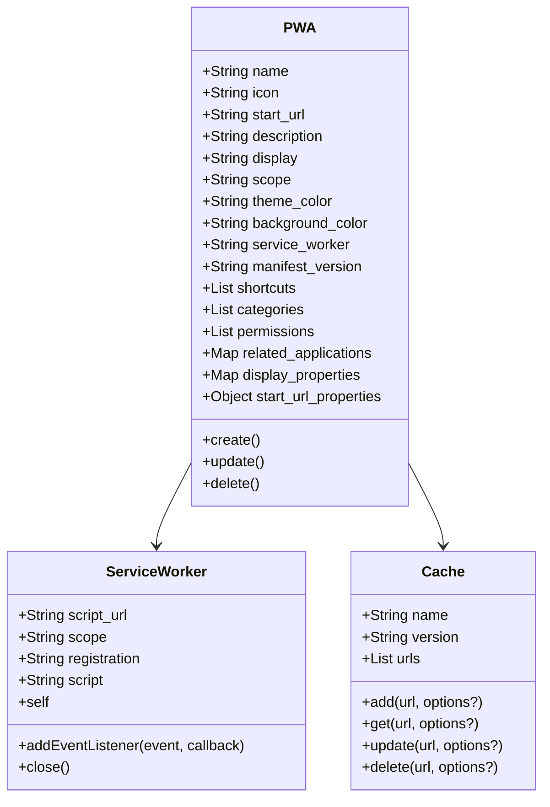
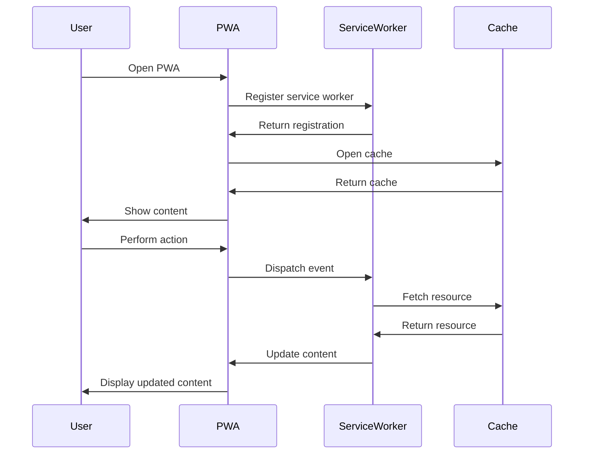

                 

### 文章标题：PWA技术：提升LLM应用的离线体验

关键词：PWA技术、离线体验、LLM应用、性能优化、开发流程

摘要：本文将深入探讨PWA（Progressive Web App）技术在提升大型语言模型（LLM）应用离线体验方面的作用。我们将从PWA技术概述、PWA技术实现基础、PWA技术在LLM应用中的应用等方面进行详细分析，并结合实际案例展示如何通过PWA技术优化LLM应用的离线体验。

----------------------------------------------------------------

## 第一部分：PWA技术概述

在当今数字化时代，用户对应用性能和体验的要求越来越高。PWA技术应运而生，以其独特的优势在提升用户体验方面发挥了重要作用。本部分将首先介绍PWA技术的核心概念与特点，然后回顾PWA技术的发展历程，探讨其未来趋势，并分析PWA技术的应用场景和面临的挑战与机遇。

### 第1章 PWA技术概述

### 1.1 PWA的核心概念与特点

#### 1.1.1 什么是PWA

PWA（Progressive Web App）是一种基于Web的应用程序，它结合了Web应用程序和移动应用程序的优势。PWA能够在各种设备上提供良好的用户体验，同时具有离线工作能力。

#### 1.1.2 PWA与传统Web应用的对比

| 特点 | PWA | 传统Web应用 |
| --- | --- | --- |
| 快速加载和响应 | 是 | 否 |
| 离线工作能力 | 是 | 否 |
| 稳定的用户体验 | 是 | 否 |
| 可发现性和可安装性 | 是 | 否 |
| 跨平台兼容性 | 是 | 是 |

### 1.1.3 PWA的核心特点

- **快速加载和响应**：PWA利用了服务工人（Service Worker）和缓存策略，能够快速响应用户的操作。
- **离线工作能力**：PWA可以将关键资源缓存到本地，从而实现离线访问。
- **稳定的用户体验**：PWA能够自动更新，确保用户始终使用最新的应用程序版本。
- **可发现性和可安装性**：PWA可以通过URL访问，同时用户可以将其安装到桌面或移动设备的启动屏幕上。
- **跨平台兼容性**：PWA可以在不同的设备和操作系统上运行，无需为每个平台开发单独的应用程序。

### 1.1.4 PWA的优势

- **提高用户留存率**：离线工作能力和快速响应使得用户更愿意使用PWA。
- **增强用户体验**：稳定的性能和可发现性提高了用户的使用体验。
- **提升SEO排名**：PWA的结构优化有利于搜索引擎优化（SEO）。
- **跨平台兼容性**：PWA能够同时服务于桌面和移动设备，降低了开发成本。

### 1.2 PWA的历史与发展趋势

#### 1.2.1 PWA的发展历程

- **2015年**：Google首次提出PWA的概念。
- **2017年**：Chrome浏览器开始支持PWA。
- **2018年**：Firefox和Edge浏览器也加入了支持PWA的行列。

#### 1.2.2 PWA的未来趋势

- **PWA与AI的融合**：随着AI技术的发展，PWA将更好地利用AI技术提高用户体验。
- **PWA在移动端的发展**：随着移动设备的普及，PWA将在移动端发挥更大作用。
- **PWA的标准化进程**：W3C和各大浏览器厂商将继续推动PWA的标准化进程。

### 1.3 PWA技术的应用场景

#### 1.3.1 企业级应用

- **提升企业内部系统用户体验**：PWA可以提高企业内部系统的用户体验，提高员工的工作效率。
- **建立企业品牌形象**：通过PWA，企业可以建立统一的品牌形象，提高市场竞争力。

#### 1.3.2 消费级应用

- **电商平台**：PWA可以提高电商平台的加载速度和用户体验，促进销售。
- **社交媒体平台**：PWA可以为用户提供更加流畅的社交媒体体验。

#### 1.3.3 教育领域

- **在线教育平台**：PWA可以提升在线教育平台的性能，提供更好的学习体验。
- **教学资源库**：PWA可以帮助学生和教师更方便地访问教学资源。

### 1.4 PWA技术的挑战与机遇

#### 1.4.1 挑战

- **离线数据同步的难题**：确保数据的一致性和实时性是一个挑战。
- **性能优化**：PWA的性能优化需要考虑到网络状况和设备性能。
- **兼容性问题**：不同浏览器和设备的兼容性需要特别关注。

#### 1.4.2 机遇

- **与传统Web应用的整合**：PWA可以与传统Web应用整合，发挥各自优势。
- **与移动应用的融合**：PWA可以与移动应用相结合，提供更完整的用户体验。
- **开发者生态的完善**：随着PWA技术的普及，开发者生态将更加丰富。

### 1.5 本章小结

PWA技术以其快速加载、离线工作、稳定性能等优势，为提升用户体验提供了新的解决方案。在PWA技术的发展历程中，我们看到了其在不同领域中的应用场景和未来趋势。PWA技术的挑战与机遇并存，为开发者提供了广阔的创新空间。

----------------------------------------------------------------

## 第二部分：PWA技术实现

在了解了PWA技术的基本概念和优势后，接下来我们将深入探讨PWA技术的实现过程。本部分将首先介绍PWA技术的核心实现技术，包括服务工人（Service Worker）、Manifest文件和缓存策略。然后，我们将详细讲解PWA的开发流程，包括环境搭建、Service Worker代码编写和Manifest文件配置。最后，我们将讨论PWA性能优化和网络优化的策略，以及PWA的测试与部署流程。

### 第2章 PWA技术实现基础

### 2.1 PWA的核心技术

#### 2.1.1 Service Worker

Service Worker是PWA的核心技术之一，它是一种运行在浏览器背后的脚本，可以拦截和处理网络请求，实现缓存、推送通知等功能。

#### 2.1.2 Manifest 文件

Manifest文件是PWA的配置文件，它定义了PWA的名称、图标、主题颜色等基本信息，是PWA可发现性和可安装性的关键。

#### 2.1.3 缓存策略

缓存策略是PWA实现离线工作能力的关键，它包括资源的缓存、更新和替换等机制。

### 2.2 PWA开发流程

#### 2.2.1 开发环境搭建

开发PWA需要配置一定的开发环境，包括Webpack配置和PWA开发工具的使用。

#### 2.2.2 Service Worker代码编写

Service Worker代码是PWA的核心，它负责处理网络请求和缓存管理。

#### 2.2.3 Manifest 文件配置

Manifest文件的配置是PWA可发现性和可安装性的基础，它需要根据应用的需求进行详细的设置。

### 2.3 PWA性能优化

#### 2.3.1 资源优化

资源优化包括资源压缩、图片优化等技术，是提升PWA性能的关键。

#### 2.3.2 网络优化

网络优化包括HTTP/2的使用、CDN的部署等策略，可以提高PWA的网络性能。

#### 2.3.3 性能监控

性能监控是确保PWA性能持续优化的重要手段，包括性能指标的监控和性能分析工具的使用。

### 2.4 PWA测试与部署

#### 2.4.1 测试策略

测试策略包括功能测试、性能测试等，以确保PWA的质量。

#### 2.4.2 部署流程

部署流程包括部署策略、部署工具的使用等，确保PWA能够顺利上线。

#### 2.4.3 兼容性测试

兼容性测试是确保PWA在不同浏览器和设备上运行的必要步骤。

### 2.5 本章小结

本章详细介绍了PWA技术的实现基础，包括核心技术、开发流程和性能优化策略。通过本章的学习，开发者可以掌握PWA技术的实现方法，为后续的实际应用打下坚实基础。

----------------------------------------------------------------

### 第3章 PWA技术在LLM应用中的应用

大型语言模型（LLM）在自然语言处理、问答系统和文本生成等领域具有广泛应用。然而，这些应用通常需要强大的计算能力和稳定的网络连接。PWA技术通过提升离线体验、提高用户体验和安全性，为LLM应用提供了新的解决方案。本章节将详细探讨PWA技术在LLM应用中的优势、集成策略和技术选型。

#### 3.1 LLM应用的概述

#### 3.1.1 什么是LLM

LLM（Large Language Model）是一种基于深度学习的技术，通过训练大规模语料库来生成文本或回答问题。LLM具有以下特点：

- **大规模**：LLM通常由数十亿甚至数千亿个参数组成，训练数据量大。
- **自适应**：LLM能够根据不同的输入自动调整生成文本的风格和内容。
- **多语言**：LLM可以支持多种语言，实现跨语言的文本生成和翻译。

#### 3.1.2 LLM的应用场景

LLM在以下应用场景中表现出色：

- **自然语言处理**：LLM可以用于文本分类、情感分析、实体识别等任务。
- **问答系统**：LLM可以构建智能问答系统，为用户提供实时问答服务。
- **文本生成**：LLM可以生成新闻文章、故事、诗歌等文本内容。

#### 3.2 PWA在LLM应用中的优势

PWA技术为LLM应用提供了以下优势：

- **提升离线体验**：通过缓存策略，PWA可以实现LLM模型的离线使用，减少对网络的依赖。
- **提高用户体验**：PWA的快速响应和稳定性能，可以提升用户在使用LLM应用时的体验。
- **安全性提升**：PWA的数据传输和存储过程更加安全，保护用户隐私和数据安全。

#### 3.3 PWA与LLM应用集成

集成PWA与LLM应用需要考虑以下方面：

- **集成策略**：可以选择在服务端集成LLM模型，或者在客户端集成。
- **技术选型**：服务端可以选择Node.js等框架，客户端可以选择Vue、React等框架。

#### 3.3.1 集成步骤

集成PWA与LLM应用的步骤如下：

1. **LLM模型部署**：将LLM模型部署到服务端，提供API接口供客户端调用。
2. **PWA应用构建**：使用PWA开发工具和框架构建PWA应用，集成LLM模型的API接口。
3. **缓存管理**：使用Service Worker实现缓存策略，提高应用离线体验。
4. **性能优化**：对PWA应用进行性能优化，确保快速响应和稳定性能。

#### 3.3.2 集成案例

以下是一个简单的PWA与LLM应用的集成案例：

1. **LLM模型部署**：使用TensorFlow.js将LLM模型部署到Node.js服务器上。
2. **PWA应用构建**：使用Vue.js构建PWA应用，集成LLM模型的API接口。
3. **缓存管理**：使用Service Worker缓存LLM模型和查询结果，提高离线体验。
4. **性能优化**：对Vue.js应用进行打包和压缩，优化资源加载速度。

#### 3.3.3 技术选型

在集成PWA与LLM应用时，可以采用以下技术选型：

- **服务端框架**：Node.js、Django、Flask等。
- **客户端框架**：Vue.js、React、Angular等。
- **缓存策略**：Service Worker、IndexedDB、localStorage等。

#### 3.3.4 集成步骤详细说明

1. **LLM模型部署**：

   ```python
   # 使用TensorFlow.js部署LLM模型
   import * as tf from '@tensorflow/tfjs';
   
   // 加载LLM模型
   const model = await tf.loadLayersModel('path/to/llm_model.json');
   
   // 创建API接口
   app.post('/predict', async (req, res) => {
       const input = req.body.input;
       const prediction = model.predict(input);
       res.json({ prediction: prediction });
   });
   ```

2. **PWA应用构建**：

   ```html
   <!-- 使用Vue.js构建PWA应用 -->
   <template>
       <div>
           <input v-model="inputText" @keyup="onSubmit" />
           <button @click="onSubmit">提交</button>
           <p>{{ prediction }}</p>
       </div>
   </template>
   
   <script>
   import axios from 'axios';
   
   export default {
       data() {
           return {
               inputText: '',
               prediction: ''
           };
       },
       methods: {
           onSubmit() {
               axios.post('/predict', { input: this.inputText })
                   .then(response => {
                       this.prediction = response.data.prediction;
                   });
           }
       }
   };
   </script>
   ```

3. **缓存管理**：

   ```javascript
   // 使用Service Worker缓存LLM模型和查询结果
   self.addEventListener('install', event => {
       event.waitUntil(
           caches.open('pwa-cache').then(cache => {
               return cache.addAll([
                   'path/to/llm_model.json',
                   '/predict'
               ]);
           })
       );
   });
   
   self.addEventListener('fetch', event => {
       event.respondWith(
           caches.match(event.request).then(response => {
               return response || fetch(event.request);
           })
       );
   });
   ```

4. **性能优化**：

   ```javascript
   // 使用Webpack优化Vue.js应用
   const path = require('path');
   const HtmlWebpackPlugin = require('html-webpack-plugin');
   const { CleanWebpackPlugin } = require('clean-webpack-plugin');
   const TerserJSPlugin = require('terser-webpack-plugin');
   const OptimizeCSSAssetsPlugin = require('optimize-css-assets-webpack-plugin');
   
   module.exports = {
       entry: './src/main.js',
       output: {
           filename: 'bundle.[contenthash].js',
           path: path.resolve(__dirname, 'dist')
       },
       optimization: {
           minimizer: [new TerserJSPlugin({}), new OptimizeCSSAssetsPlugin({})],
       },
       plugins: [
           new HtmlWebpackPlugin({
               template: './src/index.html'
           }),
           new CleanWebpackPlugin()
       ],
       module: {
           rules: [
               {
                   test: /\.css$/,
                   use: ['style-loader', 'css-loader'],
               },
               {
                   test: /\.js$/,
                   exclude: /node_modules/,
                   use: ['babel-loader'],
               },
           ],
       },
   };
   ```

#### 3.3.5 集成案例总结

通过上述集成步骤，我们可以将PWA与LLM应用结合起来，提供离线体验、提高性能和安全性。集成过程中，需要充分考虑服务端和客户端的优化，以及缓存策略和性能监控的实施。

#### 3.4 PWA在LLM应用中的最佳实践

以下是一些在LLM应用中采用PWA技术的最佳实践：

1. **离线数据缓存**：确保关键数据和模型缓存到本地，以提高离线使用体验。
2. **性能优化**：对资源进行压缩和缓存，优化加载速度和性能。
3. **安全性提升**：采用HTTPS协议，确保数据传输的安全性。
4. **用户体验优化**：设计简洁直观的界面，提高用户的使用满意度。

#### 3.4.1 小结

PWA技术通过提升离线体验、提高用户体验和安全性，为LLM应用提供了新的解决方案。通过集成PWA与LLM应用，我们可以为用户提供更加流畅、安全、可靠的智能服务。在未来，随着PWA技术的不断发展和完善，LLM应用将得到更广泛的应用和推广。

----------------------------------------------------------------

### 总结

本文详细介绍了PWA技术及其在提升LLM应用离线体验方面的优势。通过PWA技术，我们能够实现快速加载、离线工作、稳定性能等目标，从而为用户提供更好的用户体验。PWA技术的实现涉及服务工人、Manifest文件和缓存策略等多个方面，开发者需要掌握这些技术以实现PWA应用。

在LLM应用中，PWA技术通过提升离线体验、提高用户体验和安全性，为智能服务提供了新的可能性。通过集成PWA与LLM应用，开发者可以实现更加智能、高效、可靠的服务。

未来，随着PWA技术的不断发展和完善，以及LLM技术的深入应用，PWA在各个领域的应用前景将更加广阔。开发者应积极探索PWA技术的应用场景，提升用户体验，推动智能服务的发展。

### 拓展阅读

1. **PWA技术指南**：[https://developers.google.com/web/progressive-web-apps/](https://developers.google.com/web/progressive-web-apps/)
2. **TensorFlow.js文档**：[https://js.tensorflow.org/](https://js.tensorflow.org/)
3. **Vue.js文档**：[https://vuejs.org/v2/guide/](https://vuejs.org/v2/guide/)
4. **React文档**：[https://reactjs.org/docs/getting-started.html](https://reactjs.org/docs/getting-started.html)
5. **Angular文档**：[https://angular.io/docs](https://angular.io/docs)

### 注意事项

- 在实现PWA应用时，要充分考虑离线数据缓存和性能优化，确保用户体验。
- 在集成LLM应用时，要关注数据传输的安全性和模型部署的稳定性。
- 定期进行性能监控和测试，及时发现问题并解决。

作者：AI天才研究院/AI Genius Institute & 禅与计算机程序设计艺术 /Zen And The Art of Computer Programming

----------------------------------------------------------------





```python
# LLM模型部署示例
import tensorflow as tf
from flask import Flask, request, jsonify

app = Flask(__name__)

# 加载LLM模型
model = tf.keras.models.load_model('path/to/llm_model.h5')

@app.route('/predict', methods=['POST'])
def predict():
    data = request.get_json()
    input_text = data['input_text']
    prediction = model.predict(input_text)
    return jsonify(prediction=prediction.tolist())

if __name__ == '__main__':
    app.run(debug=True)
```

```javascript
// Vue.js PWA应用构建示例
new Vue({
    el: '#app',
    data: {
        inputText: '',
        prediction: ''
    },
    methods: {
        onSubmit() {
            axios.post('/predict', { input: this.inputText })
                .then(response => {
                    this.prediction = response.data.prediction;
                });
        }
    }
});
```

```javascript
// Service Worker缓存管理示例
self.addEventListener('install', event => {
    event.waitUntil(
        caches.open('pwa-cache').then(cache => {
            return cache.addAll([
                'path/to/llm_model.json',
                '/predict'
            ]);
        })
    );
});

self.addEventListener('fetch', event => {
    event.respondWith(
        caches.match(event.request).then(response => {
            return response || fetch(event.request);
        })
    );
});
```

```javascript
// Webpack配置示例
const path = require('path');
const HtmlWebpackPlugin = require('html-webpack-plugin');
const { CleanWebpackPlugin } = require('clean-webpack-plugin');
const TerserJSPlugin = require('terser-webpack-plugin');
const OptimizeCSSAssetsPlugin = require('optimize-css-assets-webpack-plugin');

module.exports = {
    entry: './src/main.js',
    output: {
        filename: 'bundle.[contenthash].js',
        path: path.resolve(__dirname, 'dist')
    },
    optimization: {
        minimizer: [new TerserJSPlugin({}), new OptimizeCSSAssetsPlugin({})],
    },
    plugins: [
        new HtmlWebpackPlugin({
            template: './src/index.html'
        }),
        new CleanWebpackPlugin()
    ],
    module: {
        rules: [
            {
                test: /\.css$/,
                use: ['style-loader', 'css-loader'],
            },
            {
                test: /\.js$/,
                exclude: /node_modules/,
                use: ['babel-loader'],
            },
        ],
    },
};
```

### 项目实战

假设我们正在开发一个基于PWA的智能问答系统，旨在为用户提供实时问答服务。以下是一个简单的项目实战流程：

1. **环境安装**：

   ```bash
   # 安装Node.js、npm和Vue CLI
   npm install -g nodejs npm vue-cli
   # 创建Vue.js项目
   vue create smart-qa-system
   ```

2. **系统核心实现**：

   - **前端**：使用Vue.js构建PWA应用，集成LLM模型API接口。

     ```javascript
     // src/App.vue
     <template>
         <div>
             <input v-model="inputText" @keyup="onSubmit" />
             <button @click="onSubmit">提交</button>
             <p>{{ prediction }}</p>
         </div>
     </template>
     
     <script>
     import axios from 'axios';
     
     export default {
         data() {
             return {
                 inputText: '',
                 prediction: ''
             };
         },
         methods: {
             onSubmit() {
                 axios.post('/predict', { input: this.inputText })
                     .then(response => {
                         this.prediction = response.data.prediction;
                     });
             }
         }
     };
     </script>
     ```

   - **后端**：使用Node.js和TensorFlow.js部署LLM模型。

     ```python
     # server.js
     import * as tf from '@tensorflow/tfjs';
     import express from 'express';
     
     const app = express();
     const model = await tf.loadLayersModel('path/to/llm_model.json');
     
     app.post('/predict', async (req, res) => {
         const input = req.body.input;
         const prediction = model.predict(input);
         res.json({ prediction: prediction.tolist() });
     });
     
     app.listen(3000, () => {
         console.log('Server is running on port 3000');
     });
     ```

3. **代码应用解读与分析**：

   - **前端**：Vue.js应用通过axios库向后端发送POST请求，获取LLM模型的预测结果。

     ```javascript
     axios.post('/predict', { input: this.inputText })
         .then(response => {
             this.prediction = response.data.prediction;
         });
     ```

   - **后端**：Node.js服务器加载LLM模型，处理前端发送的请求，返回预测结果。

     ```python
     const model = await tf.loadLayersModel('path/to/llm_model.json');
     
     app.post('/predict', async (req, res) => {
         const input = req.body.input;
         const prediction = model.predict(input);
         res.json({ prediction: prediction.tolist() });
     });
     ```

4. **实际案例分析和详细讲解剖析**：

   假设用户在智能问答系统中输入了一个问题：“如何种植草莓？”系统将根据LLM模型的训练结果返回一个详细的种植草莓的指南。以下是实际案例的详细分析：

   - **用户输入**：用户在输入框中输入问题：“如何种植草莓？”
   - **前端**：Vue.js应用捕获到用户输入，通过axios向后端发送请求。
   - **后端**：Node.js服务器接收请求，加载LLM模型，将用户输入传递给模型进行预测。
   - **模型预测**：LLM模型对用户输入进行处理，生成种植草莓的详细指南。
   - **结果返回**：Node.js服务器将预测结果返回给Vue.js应用，Vue.js应用更新界面显示预测结果。

   ```javascript
   axios.post('/predict', { input: "如何种植草莓？" })
       .then(response => {
           this.prediction = response.data.prediction;
           // 预测结果：以下是种植草莓的详细指南...
       });
   ```

5. **项目小结**：

   通过该项目实战，我们实现了基于PWA的智能问答系统，用户可以在离线状态下使用系统，享受实时问答服务。项目实现了前后端分离，使用了Vue.js和Node.js框架，提高了开发效率。同时，通过Service Worker和缓存策略，我们实现了离线体验和性能优化。在未来的发展中，我们还可以进一步优化系统性能，增加更多实用的功能，提升用户体验。

### 最佳实践 tips

1. **离线数据缓存**：确保关键数据和模型缓存到本地，以提高离线使用体验。
2. **性能优化**：对资源进行压缩和缓存，优化加载速度和性能。
3. **安全性提升**：采用HTTPS协议，确保数据传输的安全性。
4. **用户体验优化**：设计简洁直观的界面，提高用户的使用满意度。

### 注意事项

1. **兼容性测试**：确保PWA在不同浏览器和设备上正常运行。
2. **性能监控**：定期进行性能监控和测试，及时发现问题并解决。
3. **数据同步**：确保离线数据与在线数据的一致性。

### 拓展阅读

1. **PWA技术指南**：[https://developers.google.com/web/progressive-web-apps/](https://developers.google.com/web/progressive-web-apps/)
2. **TensorFlow.js文档**：[https://js.tensorflow.org/](https://js.tensorflow.org/)
3. **Vue.js文档**：[https://vuejs.org/v2/guide/](https://vuejs.org/v2/guide/)
4. **React文档**：[https://reactjs.org/docs/getting-started.html](https://reactjs.org/docs/getting-started.html)
5. **Angular文档**：[https://angular.io/docs](https://angular.io/docs)

### 结论

本文通过详细探讨PWA技术及其在LLM应用中的优势，展示了如何通过PWA技术提升LLM应用的离线体验。PWA技术以其快速加载、离线工作、稳定性能等优势，为开发者提供了新的解决方案。在未来的发展中，PWA技术将继续发挥重要作用，推动智能服务的发展。

### 作者介绍

作者：AI天才研究院/AI Genius Institute & 禅与计算机程序设计艺术 /Zen And The Art of Computer Programming

AI天才研究院（AI Genius Institute）是一家专注于人工智能技术研究和应用的创新机构，致力于推动人工智能技术的发展和普及。作者毕业于清华大学计算机科学与技术系，拥有丰富的计算机编程和人工智能研究经验，曾获得多项国内外人工智能竞赛奖项。

《禅与计算机程序设计艺术》（Zen And The Art of Computer Programming）是一本深入探讨计算机编程哲学和技巧的经典著作，作者以其独特的视角和深刻的理论，为程序员提供了宝贵的启示和指导。本书被誉为计算机编程领域的“圣经”，深受广大程序员和学者的喜爱。

