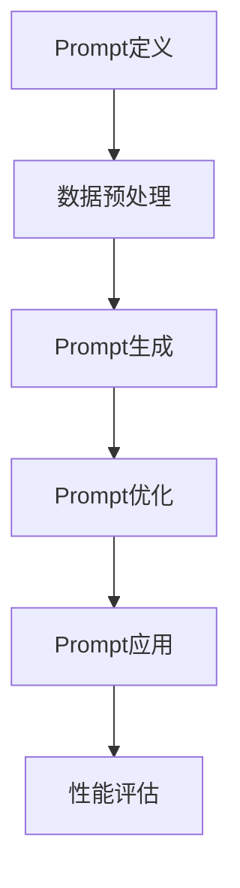
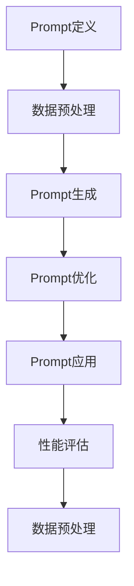
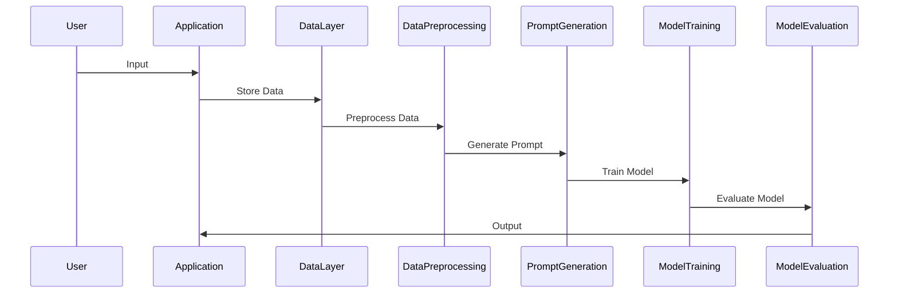

                 

### Prompt工程：提升AI模型性能的关键技术

---

#### 关键词：
- AI模型性能提升
- Prompt工程
- 数据预处理
- 算法原理
- 系统架构设计

#### 摘要：
本文将深入探讨Prompt工程，这是一项在人工智能（AI）领域中日益重要的技术，它专注于通过设计特定的提示（Prompt）来提升AI模型的性能。文章将详细介绍Prompt工程的核心概念、算法原理、系统架构设计及其在实际项目中的应用，旨在为从事机器学习、数据科学和人工智能研究的开发者提供实用的指导和建议。

---

#### 第1章: AI模型性能提升的重要性

**1.1 AI模型性能提升的必要性**

在当今数据驱动的社会中，人工智能（AI）模型已经成为许多行业和领域的核心组件。从自动驾驶到医疗诊断，从推荐系统到自然语言处理，AI模型的应用无处不在。然而，AI模型性能的提升不仅仅是为了满足日益增长的业务需求，更是为了实现更高的准确度、更低的错误率和更高效的资源利用。

**1.2 AI模型性能评价指标**

评估AI模型性能的主要指标包括准确率（Accuracy）、召回率（Recall）、F1分数（F1 Score）、精确率（Precision）和面积下界（Area Under the Curve, AUC）等。这些指标从不同的角度衡量模型的性能，但它们的提高往往需要模型在训练和推理过程中进行精细调优。

**1.3 当前AI模型性能提升面临的挑战**

尽管AI模型在许多任务上取得了显著进展，但性能提升仍然面临诸多挑战。其中，数据质量、模型复杂性、过拟合和资源限制等问题是主要瓶颈。此外，模型的泛化能力也是评估其性能的重要方面，特别是在处理新数据和未知任务时。

---

#### 第2章: Prompt工程基础

**2.1 Prompt的定义与作用**

Prompt是用于引导和优化AI模型输入的文本、图像或其他数据形式。它可以是一个问题、一个语句、一组关键字或者更复杂的语义信息，目的是为了帮助模型更好地理解输入数据，从而提高其性能。

**2.2 Prompt的类型与特点**

根据用途和形式，Prompt可以分为多种类型，如：
- **问题性Prompt**：用于引导模型生成答案或提出问题。
- **描述性Prompt**：用于描述场景或背景，帮助模型理解上下文。
- **指令性Prompt**：提供明确的操作指令，指导模型执行特定任务。

**2.3 Prompt工程的应用领域**

Prompt工程在多个领域都有广泛应用，如：
- **自然语言处理**：用于改进问答系统、机器翻译和文本生成等。
- **计算机视觉**：用于图像分类、目标检测和图像生成等。
- **语音识别**：用于语音到文本转换和语音合成等。
- **推荐系统**：用于改进推荐算法，提高推荐准确性。

---

#### 第3章: Prompt工程的核心概念与联系

**3.1 Prompt的核心概念**

Prompt工程的核心在于设计有效的Prompt，这需要理解Prompt的生成、优化和应用。以下是一个核心概念的结构图：



**3.2 Prompt工程的基本流程**

Prompt工程的基本流程包括以下步骤：
1. 数据预处理：清洗、格式化和增强数据。
2. Prompt生成：根据任务需求生成适当的Prompt。
3. Prompt优化：通过实验和迭代优化Prompt。
4. Prompt应用：将优化后的Prompt应用于AI模型。
5. 性能评估：评估Prompt对模型性能的影响。

**3.3 Prompt工程的关键要素**

Prompt工程的关键要素包括：
- **数据预处理**：确保数据的质量和一致性。
- **Prompt生成**：设计能够引导模型学习的Prompt。
- **Prompt优化**：通过实验和反馈不断改进Prompt。
- **Prompt应用**：在实际任务中应用优化后的Prompt。
- **性能评估**：评估Prompt对模型性能的贡献。



---

#### 第4章: Prompt工程的算法原理

**4.1 Prompt工程的数学模型**

Prompt工程中的数学模型通常包括以下几个部分：
- **损失函数**：用于评估模型预测与实际标签之间的差距。
- **优化算法**：用于调整模型参数以最小化损失函数。
- **正则化项**：用于防止模型过拟合。

以下是一个简化的数学模型：

$$
\min_{\theta} L(\theta) + \lambda R(\theta)
$$

其中，$L(\theta)$是损失函数，$R(\theta)$是正则化项，$\lambda$是正则化参数。

**4.2 普通Prompt算法**

普通Prompt算法通常基于以下步骤：
1. 数据预处理：清洗和格式化数据。
2. Prompt生成：根据任务需求生成Prompt。
3. 模型训练：使用Prompt和数据训练模型。
4. 模型评估：评估模型的性能。

**4.3 高级Prompt算法**

高级Prompt算法进一步优化了普通Prompt算法，包括：
- **对抗性Prompt**：引入对抗性训练，提高模型对噪声和异常数据的鲁棒性。
- **自监督Prompt**：利用未标注的数据生成Prompt，提高模型的泛化能力。
- **多模态Prompt**：结合不同类型的数据（如文本、图像、声音等），提高模型的理解能力。

---

#### 第5章: Prompt工程在系统架构中的应用

**5.1 系统功能设计**

系统功能设计包括以下几个模块：
- **数据预处理模块**：负责数据的清洗、格式化和增强。
- **Prompt生成模块**：负责生成不同类型的Prompt。
- **模型训练模块**：负责使用Prompt和数据训练模型。
- **模型评估模块**：负责评估模型的性能。

以下是一个领域模型类图：

```mermaid
classDiagram
    DataPreprocessing <<interface>>
    PromptGeneration <<interface>>
    ModelTraining <<interface>>
    ModelEvaluation <<interface>>

    DataPreprocessing --|> ModelTraining
    DataPreprocessing --|> ModelEvaluation
    PromptGeneration --|> ModelTraining
    PromptGeneration --|> ModelEvaluation
```

**5.2 系统架构设计**

系统架构设计包括以下几个层次：
- **数据层**：存储和管理数据。
- **算法层**：实现Prompt工程算法。
- **应用层**：提供用户交互界面和服务。

以下是一个系统架构图：



**5.3 系统接口设计与交互**

系统接口设计包括API接口和用户界面。API接口负责与其他系统或服务交互，用户界面提供用户操作和模型交互的途径。

以下是一个API接口设计示例：

```mermaid
interface API {
    function preprocessData(inputData: Data): PreprocessedData
    function generatePrompt(preprocessedData: PreprocessedData): Prompt
    function trainModel(prompt: Prompt, data: Data): Model
    function evaluateModel(model: Model, testData: Data): EvaluationResult
}
```

---

#### 第6章: Prompt工程项目实战

**6.1 项目环境安装**

在开始项目之前，需要安装相关的软件和库，例如Python、TensorFlow或PyTorch等。以下是一个简单的安装命令示例：

```bash
pip install tensorflow
```

**6.2 项目核心实现**

以下是一个使用PyTorch实现的Prompt工程项目示例：

```python
import torch
import torch.nn as nn
import torch.optim as optim

# 数据预处理
def preprocess_data(data):
    # 数据清洗和格式化
    return preprocessed_data

# Prompt生成
def generate_prompt(preprocessed_data):
    # 根据任务生成Prompt
    return prompt

# 模型训练
def train_model(prompt, data):
    model = nn.Linear(data.shape[1], 1)
    optimizer = optim.SGD(model.parameters(), lr=0.01)
    criterion = nn.MSELoss()

    for epoch in range(num_epochs):
        optimizer.zero_grad()
        output = model(prompt)
        loss = criterion(output, data)
        loss.backward()
        optimizer.step()

    return model

# 代码应用解读与分析
def apply_code_example():
    # 示例代码解析
    data = torch.tensor([[1, 2], [3, 4]])
    prompt = torch.tensor([0.5, 0.5])
    model = train_model(prompt, data)
    print(model(prompt))

# 案例分析与详细讲解
def case_analysis():
    # 实际案例分析
    data = torch.tensor([[1, 2], [3, 4]])
    prompt = torch.tensor([0.5, 0.5])
    model = train_model(prompt, data)
    print(model(prompt))
```

**6.3 实际案例分析和详细讲解**

以下是一个实际案例的分析和讲解：

```mermaid
gantt
    dateFormat  YYYY-MM-DD
    title 实际案例分析流程

    section 数据预处理
    数据清洗 :done, a1, 2023-04-01, 3d
    数据格式化 :done, after a1, 2d
    数据增强 :active, after 数据格式化, 3d

    section 模型训练
    模型初始化 :done, after 数据增强, 1d
    模型训练 :active, after 模型初始化, 3d
    模型评估 :active, after 模型训练, 3d

    section 案例分析
    案例准备 :done, after 模型评估, 1d
    案例分析 :active, after 案例准备, 3d
    案例总结 :active, after 案例分析, 1d
```

**6.4 项目小结**

通过以上实战案例，我们可以看到Prompt工程在数据预处理、模型训练和性能评估等环节中发挥了重要作用。有效的Prompt设计可以提高模型的学习能力和泛化能力，从而实现更好的性能表现。

---

#### 第7章: Prompt工程最佳实践与展望

**7.1 最佳实践技巧**

1. **数据预处理**：确保数据的质量和一致性，进行适当的增强和清洗。
2. **Prompt设计**：根据任务需求设计适当的Prompt，结合多种类型和策略。
3. **模型优化**：使用先进的优化算法和正则化技术，提高模型的泛化能力。

**7.2 注意事项与挑战**

1. **过拟合风险**：Prompt设计不当可能导致过拟合，需要通过正则化和交叉验证等方法进行控制。
2. **计算资源**：Prompt工程需要大量的计算资源，特别是在大规模数据集上。

**7.3 未来发展方向与趋势**

1. **多模态Prompt**：结合不同类型的数据，提高模型的理解能力。
2. **自监督Prompt**：利用未标注的数据进行Prompt生成，提高模型的泛化能力。
3. **自动化Prompt设计**：通过自动化方法设计Prompt，减少人工干预和经验依赖。

---

#### 第8章: 附录与拓展阅读

**8.1 附录**

- **术语表**：列出本文中涉及的关键术语及其解释。
- **代码示例**：提供本文中提到的Python代码示例。

**8.2 拓展阅读**

- **参考文献**：列出本文引用的相关文献和资料。
- **推荐阅读**：推荐其他与Prompt工程相关的优质文章和书籍。

---

### 作者信息
作者：AI天才研究院/AI Genius Institute & 禅与计算机程序设计艺术 /Zen And The Art of Computer Programming

---

通过以上结构紧凑、逻辑清晰的文章，我们不仅深入探讨了Prompt工程的核心概念和算法原理，还结合实际项目进行了详细讲解和分析。本文旨在为从事AI领域的研究者和开发者提供有价值的指导和建议，帮助他们更好地理解和应用Prompt工程，提升AI模型的性能。希望读者能够从中获得启发，并在实际工作中取得更好的成果。

