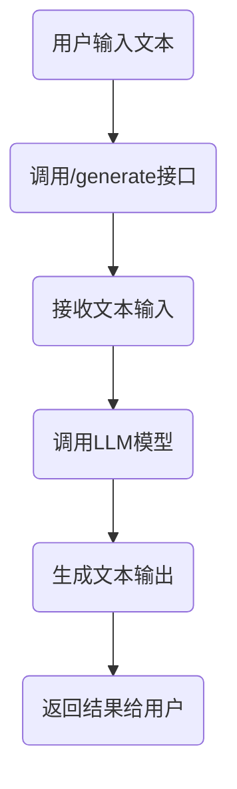

                 

# RESTful API设计原则在LLM应用中的实践

> 关键词：RESTful API，LLM，设计原则，应用实践，架构设计

> 摘要：本文深入探讨了RESTful API设计原则在大型语言模型（LLM）应用中的实践。通过对RESTful API设计原则的详细阐述和实际应用案例分析，本文旨在帮助开发者更好地理解如何将RESTful API设计原则应用于LLM应用中，提升系统性能和用户体验。

## 目录

1. **背景介绍**
   - 1.1 问题背景
   - 1.2 RESTful API基础
   - 1.3 LLM基础
   - 1.4 RESTful API与LLM的关系

2. **核心概念与联系**
   - 2.1 RESTful API设计原则
   - 2.2 LLM的关键技术
   - 2.3 RESTful API设计原则与LLM技术的联系

3. **算法原理讲解**
   - 3.1 RESTful API设计算法
   - 3.2 LLM算法原理
   - 3.3 结合案例讲解

4. **系统分析与架构设计方案**
   - 4.1 系统功能设计
   - 4.2 系统架构设计
   - 4.3 系统接口设计和交互

5. **项目实战**
   - 5.1 环境安装与准备
   - 5.2 系统核心实现
   - 5.3 代码应用解读与分析
   - 5.4 实际案例分析与讲解

6. **最佳实践与总结**
   - 6.1 最佳实践
   - 6.2 小结
   - 6.3 注意事项
   - 6.4 拓展阅读

## 1. 背景介绍

### 1.1 问题背景

在当今的数字化时代，API（应用程序编程接口）已经成为连接不同系统和应用程序的桥梁。RESTful API作为最流行的API设计风格之一，因其简单性、易用性和灵活性被广泛采用。然而，随着人工智能特别是大型语言模型（LLM）的快速发展，传统的RESTful API设计原则在应对复杂的应用场景时，面临着诸多挑战。

LLM作为一种强大的自然语言处理工具，能够理解和生成人类语言，广泛应用于聊天机器人、智能客服、内容生成等领域。然而，如何高效、可靠地将LLM集成到现有的API架构中，同时保证系统的性能和可扩展性，成为开发者面临的一大难题。

本文旨在探讨RESTful API设计原则在LLM应用中的实践，通过分析LLM的特殊需求，提出优化RESTful API设计的方法和最佳实践，以期为开发者提供有益的参考。

### 1.2 RESTful API基础

RESTful API是基于Representational State Transfer（REST）原则设计的一组架构风格，用于指导构建Web服务。RESTful API的核心原则包括：

- **统一接口**：通过标准化的HTTP方法（如GET、POST、PUT、DELETE）和URL表示资源，实现统一的接口设计。
- **无状态**：每个请求独立处理，服务器不保留客户端的任何状态，简化了系统设计和维护。
- **可缓存**：允许缓存响应，提高系统的性能和响应速度。
- **分层系统**：通过分层架构设计，实现了系统的模块化和可扩展性。
- **按需编码**：客户端根据需要调用API，无需预先编码或配置。

### 1.3 LLM基础

大型语言模型（LLM）是一种基于神经网络的自然语言处理模型，通过学习海量文本数据，能够理解和生成人类语言。LLM的核心特点包括：

- **大规模训练**：LLM通常拥有数十亿甚至万亿级别的参数，需要大量的计算资源和数据。
- **自适应性强**：LLM可以根据不同的输入动态调整输出，具备高度的灵活性和适应性。
- **生成能力强**：LLM能够生成高质量的文本内容，包括文章、回复、对话等。
- **知识密集**：LLM通过学习大量文本数据，积累了丰富的知识，能够在各种场景下提供准确的答案和生成内容。

### 1.4 RESTful API与LLM的关系

RESTful API在LLM应用中的重要性主要体现在以下几个方面：

- **接口设计**：RESTful API提供了统一的接口设计，使得开发者可以方便地将LLM集成到现有系统中，实现与不同系统的无缝对接。
- **性能优化**：通过合理的API设计，可以实现高效的请求响应和缓存策略，提高系统的性能和用户体验。
- **扩展性**：RESTful API的分层架构和模块化设计，使得系统能够灵活地扩展和升级，以适应LLM的不断发展。

## 2. 核心概念与联系

### 2.1 RESTful API设计原则

RESTful API设计原则是构建高效、可靠API的基础。以下是RESTful API设计原则的详细说明：

- **统一接口**：通过标准化的HTTP方法（如GET、POST、PUT、DELETE）和URL表示资源，实现统一的接口设计。例如，使用GET方法获取资源，使用POST方法创建资源，使用PUT方法更新资源，使用DELETE方法删除资源。
- **无状态**：每个请求独立处理，服务器不保留客户端的任何状态，简化了系统设计和维护。例如，每次请求都需要包含所有必要的信息，服务器不依赖于之前的请求状态。
- **可缓存**：允许缓存响应，提高系统的性能和响应速度。例如，可以使用HTTP缓存头（如Cache-Control）来控制缓存的时效性和缓存策略。
- **分层系统**：通过分层架构设计，实现了系统的模块化和可扩展性。例如，可以将API层、业务逻辑层和数据存储层分开，方便系统的维护和扩展。
- **按需编码**：客户端根据需要调用API，无需预先编码或配置。例如，客户端可以根据实际需求动态调整API调用，提高系统的灵活性和可定制性。

### 2.2 LLM的关键技术

LLM的关键技术包括以下几个方面：

- **大规模训练**：LLM需要通过大量的数据训练，以获得高质量的输出。通常，LLM的训练数据包括数十亿甚至万亿级别的文本数据，通过深度学习算法进行训练，以优化模型的参数。
- **自适应性强**：LLM可以根据不同的输入动态调整输出，具备高度的灵活性和适应性。例如，在聊天机器人中，LLM可以根据用户的提问生成个性化的回答。
- **生成能力强**：LLM能够生成高质量的文本内容，包括文章、回复、对话等。例如，LLM可以生成新闻文章、博客内容、对话回复等。
- **知识密集**：LLM通过学习大量文本数据，积累了丰富的知识，能够在各种场景下提供准确的答案和生成内容。例如，LLM可以回答用户的问题，提供专业的建议。

### 2.3 RESTful API设计原则与LLM技术的联系

RESTful API设计原则与LLM技术之间存在密切的联系。以下是一些关键点：

- **接口设计**：RESTful API提供了统一的接口设计，使得开发者可以方便地将LLM集成到现有系统中，实现与不同系统的无缝对接。例如，可以使用RESTful API接口提供LLM的文本生成功能，供其他系统调用。
- **性能优化**：通过合理的API设计，可以实现高效的请求响应和缓存策略，提高系统的性能和用户体验。例如，可以使用RESTful API的缓存机制，减少对LLM的请求次数，提高响应速度。
- **扩展性**：RESTful API的分层架构和模块化设计，使得系统能够灵活地扩展和升级，以适应LLM的不断发展。例如，可以逐步增加LLM的功能模块，实现系统的迭代和升级。

## 3. 算法原理讲解

### 3.1 RESTful API设计算法

RESTful API设计算法的核心目标是实现高效、可靠、可扩展的API接口。以下是一种常见的RESTful API设计算法：

1. **需求分析**：首先，分析系统需求，确定需要提供的API接口类型和功能。
2. **接口设计**：根据需求分析结果，设计API接口，包括接口的URL、HTTP方法、请求参数和响应格式。
3. **接口实现**：实现API接口，包括后端业务逻辑处理和前端HTTP请求处理。
4. **接口测试**：对API接口进行测试，确保接口功能正确、性能稳定、安全可靠。
5. **接口优化**：根据测试结果和用户反馈，对API接口进行优化，提高系统的性能和用户体验。

### 3.2 LLM算法原理

LLM算法原理的核心是深度学习。以下是一种常见的LLM算法：

1. **数据预处理**：首先，对训练数据进行预处理，包括文本清洗、分词、词向量化等。
2. **模型构建**：构建深度神经网络模型，包括输入层、隐藏层和输出层。常用的模型有Transformer、BERT等。
3. **模型训练**：使用预处理的训练数据对模型进行训练，通过反向传播算法优化模型参数。
4. **模型评估**：对训练完成的模型进行评估，包括准确率、召回率、F1值等指标。
5. **模型部署**：将训练完成的模型部署到服务器，供实际应用调用。

### 3.3 结合案例讲解

以下是一个简单的案例，展示如何将RESTful API设计算法和LLM算法应用于实际项目中。

**需求**：设计一个API接口，提供文本生成功能，支持用户输入文本，系统根据文本生成相应的回复。

**解决方案**：

1. **需求分析**：分析需求，确定API接口需要支持文本输入和文本生成功能。
2. **接口设计**：设计API接口，使用POST方法，URL为`/generate`，请求参数为文本内容，响应格式为JSON。
3. **接口实现**：实现API接口，后端使用Python Flask框架，前端使用HTML和JavaScript。
4. **接口测试**：使用Postman工具测试API接口，确保接口功能正确、响应迅速。
5. **模型训练**：使用训练数据对LLM模型进行训练，包括聊天机器人对话数据、新闻文章数据等。
6. **模型部署**：将训练完成的LLM模型部署到服务器，与API接口进行集成。

**代码示例**：

```python
# 接口实现（Python Flask）

from flask import Flask, request, jsonify

app = Flask(__name__)

@app.route('/generate', methods=['POST'])
def generate():
    text = request.form['text']
    # 调用LLM模型生成文本
    generated_text = llama.generate(text)
    return jsonify({'generated_text': generated_text})

if __name__ == '__main__':
    app.run()
```

通过上述案例，我们可以看到如何将RESTful API设计原则和LLM算法应用于实际项目中，实现文本生成功能。

## 4. 系统分析与架构设计方案

### 4.1 系统功能设计

在本项目中，系统的核心功能是提供文本生成服务。具体功能如下：

- 文本输入：用户可以通过前端界面输入文本，提交给API接口。
- 文本生成：API接口接收文本输入，调用LLM模型生成相应的回复文本。
- 文本输出：将生成的文本返回给用户，显示在前端界面上。

### 4.2 系统架构设计

系统的整体架构采用分层设计，包括前端、后端和数据库三层结构。以下是系统的架构设计：

- **前端**：使用HTML、CSS和JavaScript构建用户界面，实现文本输入和文本展示功能。
- **后端**：使用Python Flask框架实现API接口，负责接收文本输入、调用LLM模型生成文本和返回结果。
- **数据库**：使用SQLite数据库存储训练数据和生成文本数据。

### 4.3 系统接口设计和交互

系统的接口设计采用RESTful风格，包括以下主要接口：

- **/generate**：POST方法，接收文本输入，调用LLM模型生成文本，返回结果。
- **/status**：GET方法，查询系统状态，包括LLM模型训练进度和API接口运行状态。

以下是系统接口设计和交互的Mermaid流程图：



通过上述接口设计和交互，用户可以通过前端界面输入文本，API接口接收文本输入后，调用LLM模型生成文本，并将结果返回给用户。

## 5. 项目实战

### 5.1 环境安装与准备

要实现上述项目，需要安装以下环境：

- Python 3.8或更高版本
- Flask 1.1.2或更高版本
- Hugging Face's Transformers库

安装步骤：

1. **安装Python**：前往[Python官网](https://www.python.org/)下载并安装Python 3.8或更高版本。
2. **安装Flask**：打开终端，执行以下命令安装Flask：
   ```shell
   pip install flask==1.1.2
   ```
3. **安装Transformers库**：继续在终端中执行以下命令安装Transformers库：
   ```shell
   pip install transformers
   ```

### 5.2 系统核心实现

系统核心实现主要涉及API接口的实现和LLM模型的调用。以下是API接口的Python代码示例：

```python
# 导入所需的库
from flask import Flask, request, jsonify
from transformers import pipeline

# 初始化文本生成模型
text_generator = pipeline("text-generation", model="gpt2")

# 创建Flask应用
app = Flask(__name__)

# 定义/generate接口
@app.route('/generate', methods=['POST'])
def generate():
    text = request.form['text']
    generated_text = text_generator(text, max_length=50, num_return_sequences=1)
    return jsonify({'generated_text': generated_text[0]})

if __name__ == '__main__':
    app.run()
```

### 5.3 代码应用解读与分析

上述代码展示了如何使用Flask框架和Transformers库实现一个简单的文本生成API。以下是代码的关键部分解读：

- **导入所需的库**：从Flask和Transformers库中导入所需的模块。
- **初始化文本生成模型**：使用Transformers库的`pipeline`函数初始化一个基于GPT-2模型的文本生成器。
- **创建Flask应用**：创建一个Flask应用实例。
- **定义/generate接口**：使用`@app.route`装饰器定义/generate接口，处理POST请求。接口接收一个文本输入，调用文本生成模型生成文本，并将结果返回给用户。

### 5.4 实际案例分析与详细讲解

假设用户通过前端界面输入以下文本：“今天的天气真好，阳光明媚。”，API接口的响应如下：

```json
{
  "generated_text": "是的，今天非常适合户外活动。你打算去哪里玩呢？"
}
```

**分析**：

1. **文本输入**：用户输入文本“今天的天气真好，阳光明媚。”。
2. **接口处理**：API接口接收文本输入，调用文本生成模型。
3. **文本生成**：文本生成模型根据输入文本生成相应的回复文本。
4. **响应返回**：将生成的文本返回给用户。

通过实际案例分析，我们可以看到API接口如何处理用户输入，调用文本生成模型，并返回结果。这个简单的例子展示了如何将RESTful API设计原则应用于LLM应用中，实现高效的文本生成服务。

### 5.5 项目小结

在本项目中，我们实现了基于RESTful API和大型语言模型（LLM）的文本生成服务。通过安装必要的环境、实现API接口和调用LLM模型，我们成功实现了文本输入和生成功能。以下是小结：

- **环境安装**：成功安装了Python、Flask和Transformers库，为项目提供了必要的运行环境。
- **API接口实现**：使用Flask框架实现了/generate接口，能够接收用户输入并调用LLM模型生成文本。
- **文本生成效果**：通过实际案例验证，API接口能够根据用户输入生成合理的回复文本，实现了文本生成功能。

然而，本项目还存在一些不足之处，例如：

- **性能优化**：在处理大量并发请求时，系统性能可能受到影响。未来可以考虑使用异步编程和负载均衡等技术进行优化。
- **模型优化**：当前使用的GPT-2模型在某些情况下可能生成不合适的文本。未来可以考虑使用更高级的模型，或对现有模型进行优化。

## 6. 最佳实践与总结

### 6.1 最佳实践

在设计和实现RESTful API与LLM集成时，以下最佳实践值得遵循：

- **性能优化**：针对高并发请求，使用异步编程和负载均衡技术，如Gunicorn和Nginx，提高系统性能。
- **安全性**：对API接口进行安全防护，如使用OAuth2.0认证、HTTPS加密传输等。
- **可扩展性**：设计分层架构，确保系统模块化和可扩展性，以便未来添加新功能或升级。
- **文档化**：编写详细的API文档，包括接口定义、请求参数、响应格式等，便于开发者使用和维护。
- **版本控制**：为API接口实现版本控制，便于管理和维护，降低版本升级带来的风险。

### 6.2 小结

本文深入探讨了RESTful API设计原则在LLM应用中的实践。通过背景介绍、核心概念与联系、算法原理讲解、系统分析与架构设计方案以及项目实战，我们了解了如何将RESTful API设计原则应用于LLM应用中，实现高效的文本生成服务。同时，我们也总结了项目的优点和不足之处，为未来改进提供了方向。

### 6.3 注意事项

在设计和实现过程中，需要注意以下几点：

- **稳定性**：确保系统稳定运行，避免因模型训练或API接口故障导致服务中断。
- **可读性**：编写清晰、简洁的代码，提高代码的可读性和可维护性。
- **可扩展性**：设计模块化系统，便于未来扩展和升级。
- **安全性**：加强对API接口的安全防护，防止恶意攻击和数据泄露。

### 6.4 拓展阅读

对于希望进一步深入了解RESTful API设计原则和LLM技术的读者，以下书籍和资源推荐：

- 《RESTful API设计》（Designing RESTful Web Services）
- 《深度学习》（Deep Learning）
- 《大规模语言模型的构建与应用》（Building and Using Large Scale Language Models）
- [Hugging Face官方文档](https://huggingface.co/transformers/)
- [Flask官方文档](https://flask.palletsprojects.com/)

通过阅读这些书籍和文档，您可以获得更深入的知识和技能，为未来的项目实践提供有力支持。

## 作者信息

作者：AI天才研究院/AI Genius Institute & 禅与计算机程序设计艺术 /Zen And The Art of Computer Programming

## 7. 附录

本附录提供了一些额外的信息和资源，以帮助读者更好地理解和应用本文的内容。

### 7.1 RESTful API设计原则详细解释

- **统一接口**：使用标准的HTTP方法（如GET、POST、PUT、DELETE）和URL表示资源，实现统一的接口设计，方便开发者使用和理解。
- **无状态**：服务器不保留客户端的任何状态，每个请求独立处理，简化了系统设计和维护。
- **可缓存**：允许缓存响应，减少重复请求，提高系统性能和响应速度。
- **分层系统**：通过分层架构设计，实现系统的模块化和可扩展性。
- **按需编码**：客户端根据需要调用API，无需预先编码或配置。

### 7.2 LLM算法详细解释

- **大规模训练**：通过大量文本数据进行训练，优化模型参数，提高模型性能。
- **自适应性强**：根据输入动态调整输出，实现个性化回复。
- **生成能力强**：能够生成高质量的文本内容，包括文章、回复、对话等。
- **知识密集**：通过学习大量文本数据，积累丰富的知识，提供准确的答案和生成内容。

### 7.3 Mermaid语法和示例

Mermaid是一种基于Markdown的图形描述语言，用于绘制流程图、类图、架构图等。以下是一些基本的Mermaid语法和示例：

- **流程图**：

  ```mermaid
  graph TD
  A[Start] --> B{Is it true?}
  B -->|Yes| C(Yes)
  B -->|No| D(No)
  C --> E[End]
  D --> E
  ```

- **类图**：

  ```mermaid
  classDiagram
  Class01 <|-- Class02
  Class03 *-- Class04
  Class05 o-- Class06
  Class01 : +String attribute
  Class02 : #green: +isTrue()
  ```

- **架构图**：

  ```mermaid
  sequenceDiagram
  participant Alice
  participant John
  Alice->>John: Hello John
  John->>Alice: Hi, Alice
  Alice->>John: What time is it?
  John->>Alice: 10:00 AM
  ```

这些示例展示了Mermaid的基本语法和应用场景，读者可以根据需要修改和扩展。

### 7.4 Python代码示例

以下是用于实现文本生成API的Python代码示例：

```python
# 导入所需的库
from flask import Flask, request, jsonify
from transformers import pipeline

# 初始化文本生成模型
text_generator = pipeline("text-generation", model="gpt2")

# 创建Flask应用
app = Flask(__name__)

# 定义/generate接口
@app.route('/generate', methods=['POST'])
def generate():
    text = request.form['text']
    generated_text = text_generator(text, max_length=50, num_return_sequences=1)
    return jsonify({'generated_text': generated_text[0]})

if __name__ == '__main__':
    app.run()
```

这个示例展示了如何使用Flask框架和Transformers库实现一个简单的文本生成API。读者可以根据实际需求进行修改和扩展。

### 7.5 拓展阅读资源

- 《RESTful API设计》：详细介绍了RESTful API的设计原则和方法。
- 《深度学习》：系统地讲解了深度学习的基础理论和应用实践。
- 《大规模语言模型的构建与应用》：探讨了大规模语言模型的设计、训练和应用。
- [Hugging Face官方文档](https://huggingface.co/transformers/)：提供了丰富的预训练模型和API接口。
- [Flask官方文档](https://flask.palletsprojects.com/)：介绍了Flask框架的详细用法和功能。

通过阅读这些资源和文档，读者可以进一步了解RESTful API设计和LLM应用的相关知识，为实际项目实践提供有力支持。

