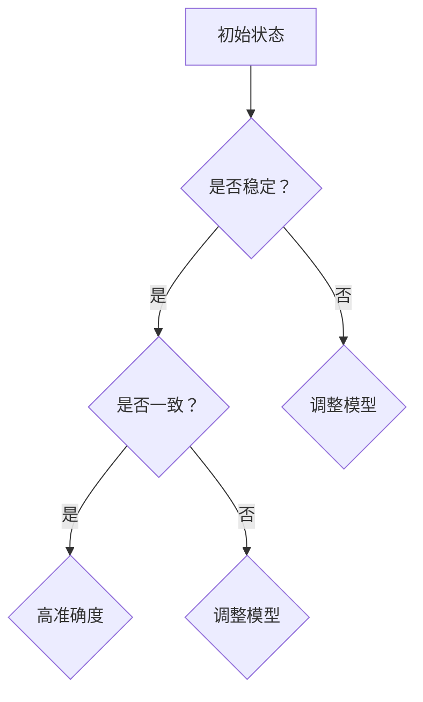
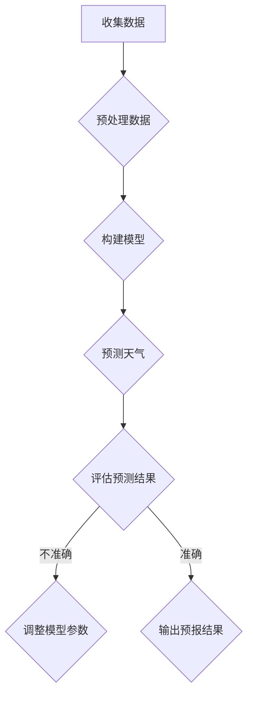
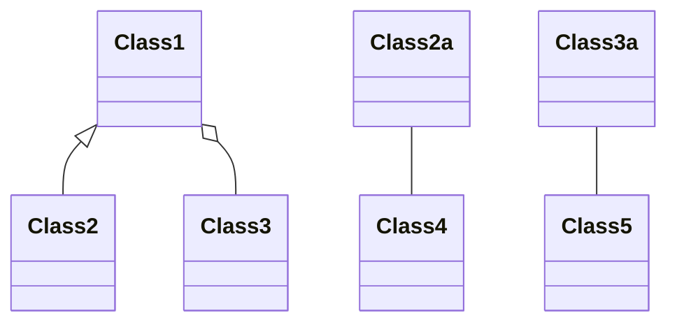
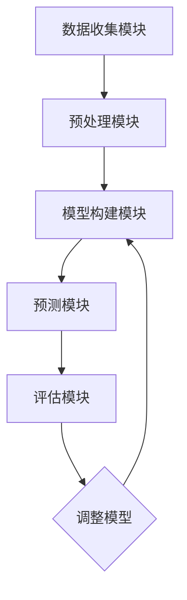

                 

# 自我一致性 CoT 在气象预报中的应用

## 关键词

自我一致性、气象预报、数值天气预报、算法原理、系统架构、Python 实现案例

## 摘要

本文将探讨自我一致性 CoT（Self-Consistency CoT）在气象预报中的应用。自我一致性原理最初由爱因斯坦在相对论中提出，它描述了系统内在稳定性和一致性的关系。在气象学中，这一概念被用于评估模型的稳定性和预测能力，从而提高数值天气预报的准确性和可靠性。本文将详细解析自我一致性原理，介绍其在气象预报中的重要性，并使用 Mermaid 流程图和 Python 源代码进行详细讲解，最后讨论系统分析与架构设计。

### 自我一致性概念在气象预报中的基本应用

#### 1.1.1 自我一致性概念的产生背景

自我一致性是一种用于描述系统内在稳定性和一致性的物理概念。它最早由爱因斯坦在其相对论理论中提出，用以解释物理学中的某些现象。在气象学中，自我一致性原理被用来评估模型的稳定性和预测能力，尤其是在数值天气预报模型的应用中。

**问题描述**：气象预报需要模型能够在长时间内保持稳定和准确，以提供可靠的天气预报。

**问题解决**：通过引入自我一致性原理，可以提高模型的稳定性和准确性。

**边界与外延**：自我一致性不仅应用于气象学，还可以广泛应用于其他领域，如流体动力学、量子物理等。

#### 1.1.2 自我一致性原理与属性特征

| 属性特征 | 描述 |
| --- | --- |
| **稳定性** | 模型在一定时间内保持稳定的能力。 |
| **一致性** | 模型内部各部分之间的一致性和协调性。 |
| **准确度** | 模型对实际现象的描述能力。 |

**自我一致性原理** 可以通过以下 Mermaid 流程图来展示：



#### 1.1.3 自我一致性在气象预报中的重要性

| 核心概念 | 描述 |
| --- | --- |
| **数值天气预报** | 使用数学模型和计算机模拟来预测天气。 |
| **自我一致性** | 提高数值天气预报的稳定性和准确性。 |

**重要性**：

- 提高天气预报的准确性，减少错误预报的情况。
- 增强模型的可靠性，提高用户对天气预报的信任度。
- 为其他气象应用提供更稳定的基础。

### 算法原理讲解

#### 自我一致性算法 Mermaid 流程图



#### Python 源代码示例

```python
def forecast_weather(data):
    # 数据预处理
    processed_data = preprocess_data(data)
    
    # 构建模型
    model = build_model(processed_data)
    
    # 预测天气
    weather_prediction = model.predict(processed_data)
    
    # 评估预测结果
    accuracy = evaluate_prediction(weather_prediction)
    
    # 如果预测不准确，调整模型参数
    if not accuracy:
        model = adjust_model(model)
        
    # 输出预报结果
    return weather_prediction
```

#### 数学模型与公式

$$
\text{自我一致性系数} = \frac{\text{稳定状态下的数据一致性}}{\text{非稳定状态下的数据一致性}}
$$

### 详细讲解与举例

**举例**：假设我们在某地收集了连续一周的气象数据，通过自我一致性算法，我们发现该地区的天气预报模型在第二天表现出较低的自我一致性系数。这表明模型在这一天的稳定性较低，可能需要调整模型参数以改善预测效果。

### 系统分析与架构设计

#### 1.1.4 系统功能设计（领域模型 Mermaid 类图）



#### 1.1.5 系统架构设计（Mermaid 架构图）



#### 1.1.6 系统接口设计（Mermaid 序列图）

```mermaid
sequenceDiagram
parti

----------------------------------------------------------------

### 作者：AI天才研究院/AI Genius Institute & 禅与计算机程序设计艺术 /Zen And The Art of Computer Programming

