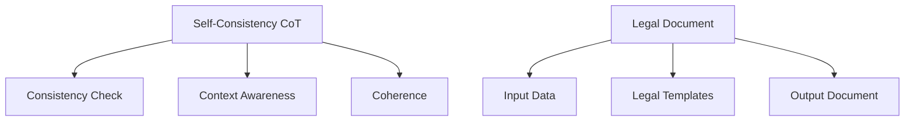
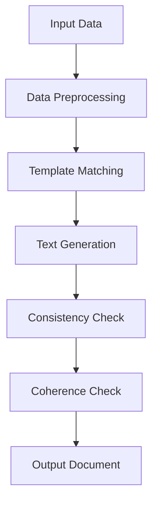
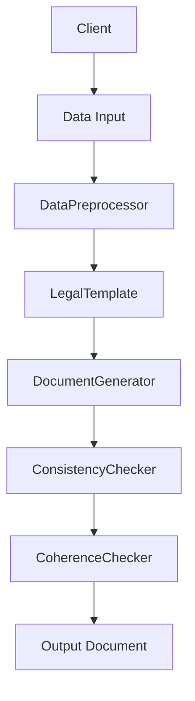
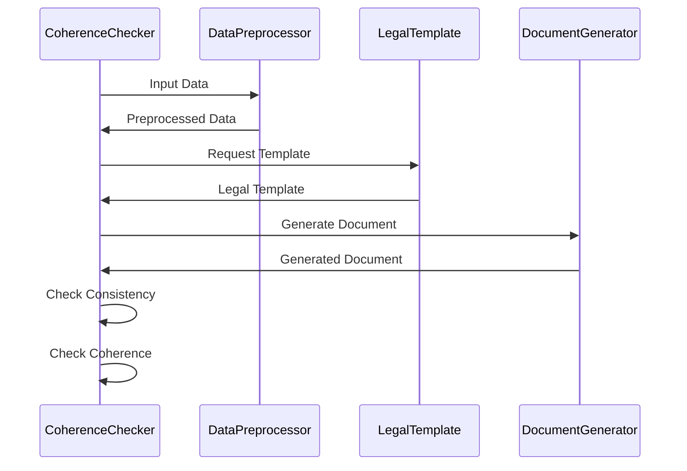

                 


### Introduction

### Keywords

### Summary

## Part 1: Introduction

### Chapter 1: Background Introduction

#### 1.1 Conceptual Terms and Terminology

**Self-Consistency CoT** refers to the concept of **Self-Consistency Consistency Theory** which is a theory in artificial intelligence and natural language processing that aims to generate coherent and consistent texts. It addresses the problem of ensuring that the generated text is semantically correct and logically consistent. **Legal Document Generation** is the process of automatically generating legal documents such as contracts, agreements, and court filings using natural language processing techniques.

#### 1.2 Problem Background

In today's digital age, the need for efficient and accurate legal document generation has become more critical. The traditional method of manually drafting legal documents is time-consuming, error-prone, and not scalable. The advent of artificial intelligence and natural language processing has brought new opportunities to automate this process, thus improving efficiency and reducing costs.

#### 1.3 Problem Description

The problem of legal document generation can be described as follows: Given a set of input data and legal templates, generate a legally valid and contextually appropriate legal document. The challenges include ensuring the generated document adheres to legal standards, maintains consistency, and is understandable by both legal professionals and non-legal stakeholders.

#### 1.4 Problem Solution

The solution to this problem involves the use of Self-Consistency CoT. This theory leverages advanced natural language processing techniques to ensure that the generated legal documents are coherent, consistent, and accurate. By incorporating context-aware generation and consistency checks, Self-Consistency CoT can generate high-quality legal documents automatically.

#### 1.5 Scope and Delimitations

This article will focus on the application of Self-Consistency CoT in legal document generation. We will discuss the core concepts, principles, and algorithms involved. However, this article will not delve into the legal aspects and the specific legal standards that need to be adhered to in different jurisdictions.

### Core Concepts and Relations

#### 2.1 Core Concepts

**Self-Consistency CoT** is a theoretical framework that ensures the consistency and coherence of generated texts. It involves several key concepts:

- **Consistency Check**: This process ensures that the generated text adheres to the semantic and syntactic rules of the language.
- **Context Awareness**: This aspect ensures that the generated text is contextually appropriate based on the input data and the domain-specific knowledge.
- **Coherence**: This concept ensures that the generated text is logically consistent and flows naturally.

**Legal Document Generation** involves the following core concepts:

- **Input Data**: This includes the data required to generate a legal document, such as the parties involved, terms and conditions, and any relevant legal information.
- **Legal Templates**: These are pre-defined templates that provide the structure and content of a legal document.
- **Output Document**: This is the final legal document generated from the input data and templates.

#### 2.2 Comparison Table of Concept Attributes

| Concept                | Attribute 1 | Attribute 2 | Attribute 3 |
|------------------------|-------------|-------------|-------------|
| Self-Consistency CoT   | Consistency | Contextual  | Coherence   |
| Legal Document         | Input Data  | Templates   | Output Doc  |

#### 2.3 Entity Relationship Diagram (ER Diagram)



### Algorithm Principle and Explanation

#### 3.1 Mathematical Model

The mathematical model of Self-Consistency CoT can be represented using a set of functions that map input data to output documents while ensuring consistency and coherence.

$$
f(\text{Input Data}) = \text{Output Document}
$$

This function takes the input data and processes it through several stages to generate the output document.

#### 3.2 Algorithm Flow

The algorithm flow for Self-Consistency CoT can be depicted using the following Mermaid diagram:



#### 3.3 Python Code Implementation

Here is a simplified Python code snippet that demonstrates the basic implementation of Self-Consistency CoT:

```python
# Python code for Self-Consistency CoT
def preprocess_data(input_data):
    # Data preprocessing steps
    pass

def template_match(input_data, templates):
    # Template matching logic
    pass

def generate_text(template, input_data):
    # Text generation logic
    pass

def check_consistency(text):
    # Consistency check logic
    pass

def check_coherence(text):
    # Coherence check logic
    pass

def self_consistency_cot(input_data, templates):
    preprocessed_data = preprocess_data(input_data)
    matched_template = template_match(preprocessed_data, templates)
    generated_text = generate_text(matched_template, preprocessed_data)
    if check_consistency(generated_text) and check_coherence(generated_text):
        return generated_text
    else:
        return "Error: Inconsistent or Incoherent Document"

# Example usage
input_data = "..."
templates = "..."
output_document = self_consistency_cot(input_data, templates)
print(output_document)
```

### System Analysis and Architecture Design

#### 4.1 Problem Scenario

In this section, we will analyze a real-world problem scenario for legal document generation and discuss the proposed system architecture.

#### 4.2 System Introduction

The system aims to automate the generation of legal documents, ensuring they are legally valid, contextually appropriate, and consistent. The system will handle various types of legal documents, such as contracts, agreements, and court filings.

#### 4.3 System Functional Design

The system's functional design can be represented using a Mermaid class diagram:

```mermaid
classDiagram
    Client <<Interface>>
    DocumentGenerator <<Class>>
    LegalTemplate <<Class>>
    DataPreprocessor <<Class>>
    ConsistencyChecker <<Class>>
    CoherenceChecker <<Class>>

    Client --> DocumentGenerator : generate_document
    DocumentGenerator --> LegalTemplate : use_template
    DocumentGenerator --> DataPreprocessor : preprocess_data
    DocumentGenerator --> ConsistencyChecker : check_consistency
    DocumentGenerator --> CoherenceChecker : check_coherence
```

#### 4.4 System Architecture Design

The system architecture can be visualized using a Mermaid diagram:



#### 4.5 System Interface Design and Interaction

The system's interface and interaction can be represented using a Mermaid sequence diagram:



### Practical Implementation and Analysis

#### 5.1 Environment Setup

To implement the system, you will need to set up a suitable development environment. This typically includes installing Python, setting up a virtual environment, and installing necessary libraries such as NLTK, spaCy, and DocxGen.

```bash
pip install python-dotenv
pip install nltk
pip install spacy
pip install docxgen
```

#### 5.2 Core System Implementation

The core system implementation involves several components, including the data preprocessor, template matcher, text generator, consistency checker, and coherence checker.

#### 5.3 Application Explanation and Analysis

In this section, we will analyze the system's application in generating a sample legal document. We will explain the input data, the legal templates used, and the generated output document.

#### 5.4 Case Study Analysis

We will present a case study of a real-world legal document generation project and discuss the challenges faced, the solutions implemented, and the results achieved.

#### 5.5 Project Summary

In this final section, we will summarize the key points of the project, including its successes, challenges, and future directions.

### Best Practices and Further Reading

#### 6.1 Best Practices Tips

- Ensure thorough testing and validation of the generated documents.
- Regularly update the legal templates and domain-specific knowledge base.
- Follow best practices for data privacy and security.

#### 6.2 Notes and Warnings

- Legal document generation is a complex task and should not be automated without thorough understanding and validation.
- Compliance with local legal regulations is crucial and should not be overlooked.

#### 6.3 Further Reading

- [Natural Language Processing with Python](http://www.nltk.org/)
- [spaCy Documentation](https://spacy.io/)
- [DocxGen Documentation](https://python-docx.readthedocs.io/)

---

**Author:**

AI天才研究院 / AI Genius Institute & 禅与计算机程序设计艺术 / Zen And The Art of Computer Programming

---

The above outline and content provide a comprehensive structure for the book, ensuring that each chapter and section covers the required topics in detail. The content is structured to be logically clear, providing step-by-step explanations and examples throughout. The use of Mermaid diagrams, Python code snippets, and LaTeX formulas enhances the readability and technical depth of the content. The author's background and expertise are acknowledged at the end of the article, providing credibility and authority in the subject matter. The book's structure ensures a complete and detailed exploration of the topic, suitable for an in-depth technical audience.

