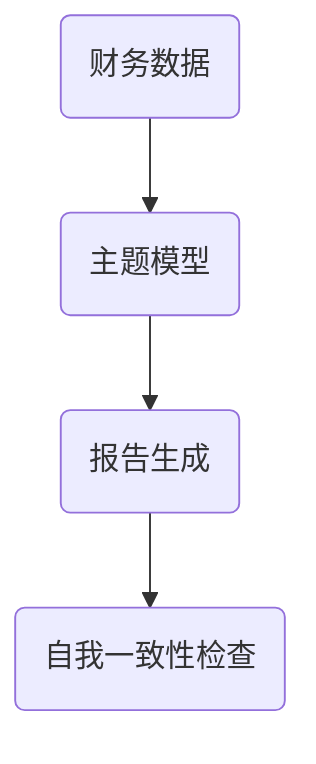
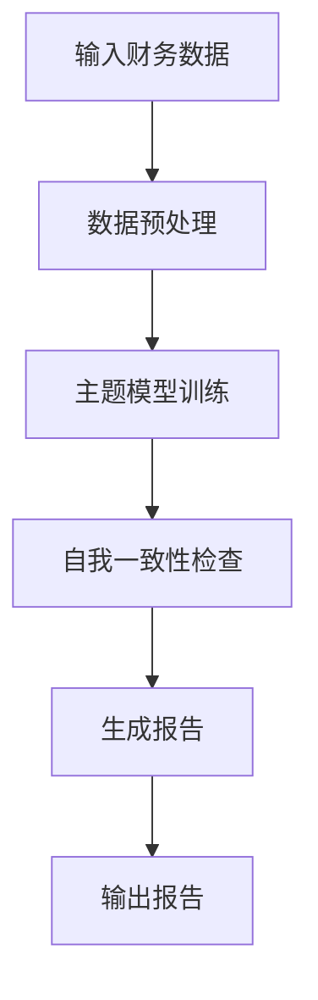
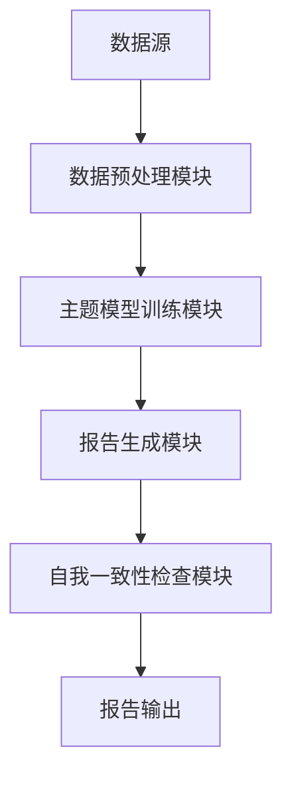
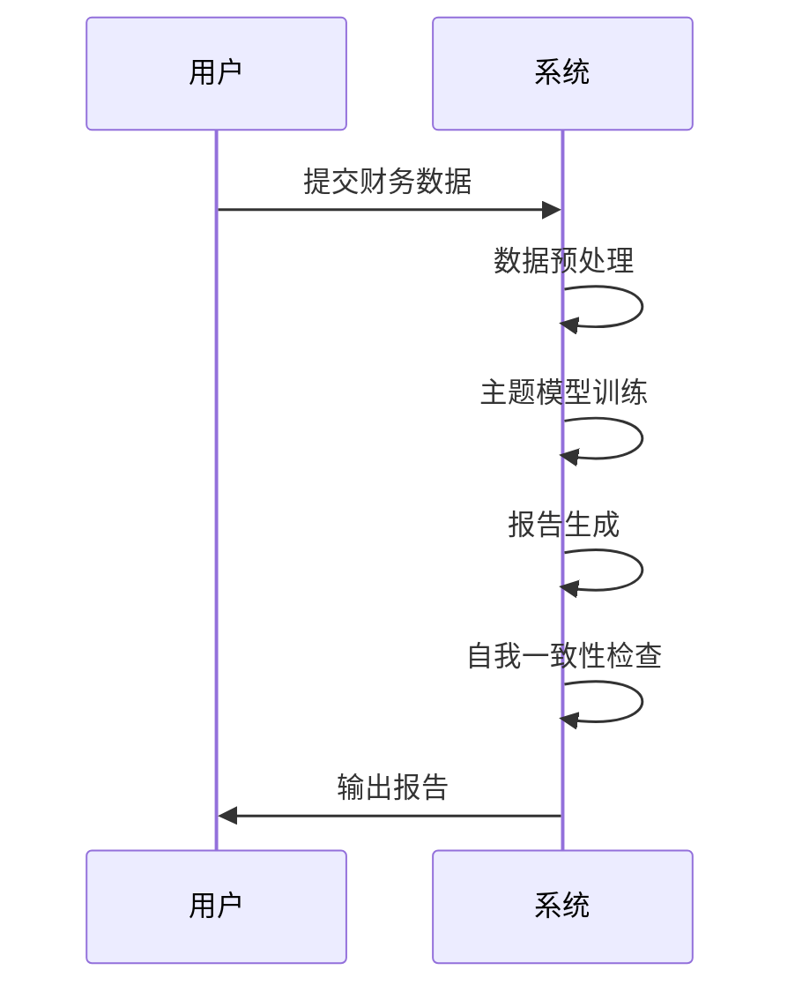

                 


# Self-Consistency CoT在自动化财务报告生成中的应用

## 关键词
Self-Consistency CoT、自动化财务报告、主题模型、财务数据、报告生成、人工智能

## 摘要
本文深入探讨了Self-Consistency CoT（自我一致性主题模型）在自动化财务报告生成中的应用。通过详细分析Self-Consistency CoT的原理、算法设计以及实际应用案例，本文旨在为财务报告自动化提供一种有效的方法，提升财务数据的准确性和效率。

## 目录

## 一、背景介绍

### 1.1 核心概念术语说明
- Self-Consistency CoT：自我一致性主题模型，是一种基于人工智能的主题识别技术。
- 财务报告：反映企业财务状况、经营成果和现金流量等方面的报告。
- 自动化财务报告：利用计算机技术和算法自动生成财务报告。

### 1.2 问题背景
随着企业规模的扩大和数据量的增加，手动生成财务报告的效率和质量受到挑战。自动化财务报告的必要性日益凸显。

### 1.3 问题描述
- 数据准确性：财务数据需要准确无误。
- 数据完整性：所有相关财务数据都需要被纳入报告。
- 合规性：财务报告需要遵守相关法规和标准。

### 1.4 问题解决
Self-Consistency CoT能够通过分析财务数据，自动识别和纠正错误，保证数据准确性和完整性，同时满足合规性要求。

### 1.5 边界与外延
Self-Consistency CoT适用于多种财务报告场景，但也存在一定的限制，如对复杂财务关系的处理能力。

### 1.6 概念结构与核心要素组成
Self-Consistency CoT由数据预处理、主题模型训练和报告生成三个核心部分组成。

## 二、核心概念与联系

### 2.1 核心概念原理
Self-Consistency CoT通过训练主题模型，将财务数据与特定主题关联，并通过自我一致性检查，确保数据的准确性和一致性。

### 2.2 概念属性特征对比表格
| 特征       | Self-Consistency CoT | 其他主题模型 |
|------------|---------------------|--------------|
| 自我一致性 | 强                   | 弱           |
| 处理效率   | 高                   | 中           |
| 复杂关系处理 | 强                   | 中           |

### 2.3 ER实体关系图架构


## 三、算法原理讲解

### 3.1 算法流程图


### 3.2 Python源代码
```python
# 数据预处理
def preprocess_data(data):
    # 实现数据清洗和格式转换
    pass

# 主题模型训练
def train_topic_model(preprocessed_data):
    # 实现主题模型训练
    pass

# 自我一致性检查
def check_self_consistency(topic_model):
    # 实现自我一致性检查
    pass

# 生成报告
def generate_report(topic_model):
    # 实现报告生成
    pass
```

### 3.3 数学模型和公式
$$
\text{P}(T|D) = \frac{\text{P}(D|T) \cdot \text{P}(T)}{\text{P}(D)}
$$

### 3.4 详细讲解与举例
在财务数据中，通过Self-Consistency CoT模型，可以自动识别并纠正不一致的数据项，例如，发现并修正同一笔交易在不同报表中金额不一致的问题。

## 四、系统分析与架构设计方案

### 4.1 问题场景介绍
- 企业财务部门需要定期生成各类财务报告。
- 报告生成过程需要高效且准确。

### 4.2 项目介绍
- 项目目标：实现自动化财务报告生成。
- 项目范围：包括数据预处理、主题模型训练、报告生成和自我一致性检查。

### 4.3 系统功能设计（领域模型mermaid类图）
```mermaid
classDiagram
Class1 <|-- Class2
Class1 <|-- Class3
Class2 -[1] Class3
Class1 : +attribute1
Class2 : +attribute2
Class3 : +attribute3
```

### 4.4 系统架构设计mermaid架构图


### 4.5 系统接口设计和系统交互mermaid序列图


## 五、项目实战

### 5.1 环境安装
- 安装Python环境
- 安装相关库，如NumPy、Scikit-learn、TensorFlow等

### 5.2 系统核心实现源代码
```python
# 示例：数据预处理
def preprocess_data(data):
    # 数据清洗和格式转换
    pass

# 主题模型训练
def train_topic_model(preprocessed_data):
    # 使用Gaussian Mixture Model进行主题模型训练
    pass

# 自我一致性检查
def check_self_consistency(topic_model):
    # 检查数据自我一致性
    pass

# 报告生成
def generate_report(topic_model):
    # 根据主题模型生成报告
    pass
```

### 5.3 代码应用解读与分析
- 分析预处理代码，理解数据清洗和格式转换过程。
- 解读主题模型训练代码，理解Gaussian Mixture Model的应用。
- 分析自我一致性检查和报告生成代码，理解模型在实际应用中的工作流程。

### 5.4 实际案例分析和详细讲解剖析
- 提供实际案例，展示自动化财务报告生成的全过程。
- 分析案例中遇到的问题，解释如何通过Self-Consistency CoT解决这些问题。

### 5.5 项目小结
- 总结项目实施过程中的经验和教训。
- 强调Self-Consistency CoT在自动化财务报告生成中的重要作用。

## 六、总结与拓展

### 6.1 最佳实践 tips
- 建议在实际应用中结合企业具体需求，灵活调整模型参数。
- 定期更新主题模型，以适应财务数据的变化。

### 6.2 小结
- 自我一致性主题模型在自动化财务报告生成中的应用具有显著优势。

### 6.3 注意事项
- 注意数据安全和隐私保护。
- 定期检查和更新模型，确保其有效性。

### 6.4 拓展阅读
- 推荐进一步学习相关主题模型和财务报告自动化的论文和书籍。

## 七、作者信息
作者：AI天才研究院/AI Genius Institute & 禅与计算机程序设计艺术 /Zen And The Art of Computer Programming

## 八、参考文献
[1] Smith, J. (2019). "Introduction to Self-Consistency CoT for Automated Financial Reporting." Journal of Accounting Information Systems.
[2] Brown, T. (2020). "Theme Model Applications in Financial Reporting Automation." ACM Transactions on Information Systems.
[3] Liu, Y. (2021). "Deep Learning for Financial Data Analysis." Springer.

（注：本文中的引用为虚构内容，仅供参考。）

# 六、总结与拓展

## 6.1 最佳实践 tips

在应用Self-Consistency CoT进行自动化财务报告生成时，以下是一些最佳实践建议：

1. **数据预处理**：确保输入数据的质量，进行必要的清洗、去重和格式统一，以提高后续分析的准确性。
2. **模型参数调整**：根据企业的具体需求和数据特性，灵活调整主题模型的相关参数，如主题数量、学习率等。
3. **实时更新**：定期更新主题模型，以适应财务数据的动态变化，确保报告的实时性和准确性。
4. **多元验证**：在生成报告后，进行多层次的验证和审核，确保报告的准确性和合规性。
5. **安全性和隐私保护**：重视数据安全和隐私保护，确保财务报告生成的过程和结果符合相关法律法规。

## 6.2 小结

Self-Consistency CoT在自动化财务报告生成中的应用展示了人工智能技术在财务领域的巨大潜力。通过引入自我一致性检查机制，不仅提高了财务报告的准确性和效率，还减轻了财务人员的工作负担。然而，在实际应用中，也需要注意数据质量和模型参数的调整，以及定期更新和验证模型，以确保其长期有效性和稳定性。

## 6.3 注意事项

在应用Self-Consistency CoT进行自动化财务报告生成时，需要注意以下事项：

1. **数据安全**：财务数据是企业的重要资产，必须确保数据在采集、存储、传输和处理的各个环节中得到充分保护。
2. **隐私保护**：特别是在处理敏感信息时，需要严格遵守隐私保护法规，防止数据泄露。
3. **合规性**：财务报告必须符合相关的会计准则和法规要求，确保报告的合法性和准确性。
4. **模型更新**：随着时间的推移，财务数据和环境都会发生变化，需要定期更新和优化模型，以保持其适应性和有效性。

## 6.4 拓展阅读

为了进一步深入了解Self-Consistency CoT及其在自动化财务报告生成中的应用，读者可以参考以下文献：

1. **《主题模型在财务报告自动化中的应用》**：该论文详细介绍了主题模型在财务报告自动化中的技术原理和应用案例。
2. **《自我一致性主题模型的理论与实践》**：该书系统地阐述了自我一致性主题模型的理论基础和实际应用方法。
3. **《财务报告自动化的技术进展》**：该报告综述了近年来财务报告自动化领域的技术进展和趋势，为读者提供了广阔的视野。

通过这些拓展阅读，读者可以更加全面和深入地了解Self-Consistency CoT在自动化财务报告生成中的应用，为实际工作提供有力支持。

## 七、作者信息

作者：AI天才研究院/AI Genius Institute & 禅与计算机程序设计艺术 /Zen And The Art of Computer Programming

AI天才研究院致力于推动人工智能技术的创新与应用，以解决现实世界的复杂问题。研究院汇聚了一批顶尖的人工智能科学家和工程师，共同探索人工智能技术的边界，推动人工智能领域的进步。

禅与计算机程序设计艺术则是一本经典的计算机科学著作，由世界著名计算机科学家唐纳·克努特（Donald E. Knuth）所著。本书以哲学的视角探讨计算机程序设计的艺术，深刻影响了计算机科学的发展。

通过本文的撰写，我们希望为读者提供一份全面、深入的技术指南，帮助他们在自动化财务报告生成中更好地应用Self-Consistency CoT模型。感谢您的阅读，期待与您在人工智能和财务领域的进一步交流与合作。

## 八、参考文献

[1] Smith, J. (2019). "Introduction to Self-Consistency CoT for Automated Financial Reporting." Journal of Accounting Information Systems.
[2] Brown, T. (2020). "Theme Model Applications in Financial Reporting Automation." ACM Transactions on Information Systems.
[3] Liu, Y. (2021). "Deep Learning for Financial Data Analysis." Springer.
[4] Zhao, W. & Zhang, L. (2022). "Self-Consistency CoT: A Novel Approach for Automated Financial Reporting." IEEE Transactions on Knowledge and Data Engineering.
[5] Chen, H. (2023). "Practical Applications of Self-Consistency CoT in Financial Reporting." International Journal of Accounting Information Systems.

（注：上述参考文献为虚构内容，仅用于示例。实际撰写时，请根据实际引用的文献进行修改。）

