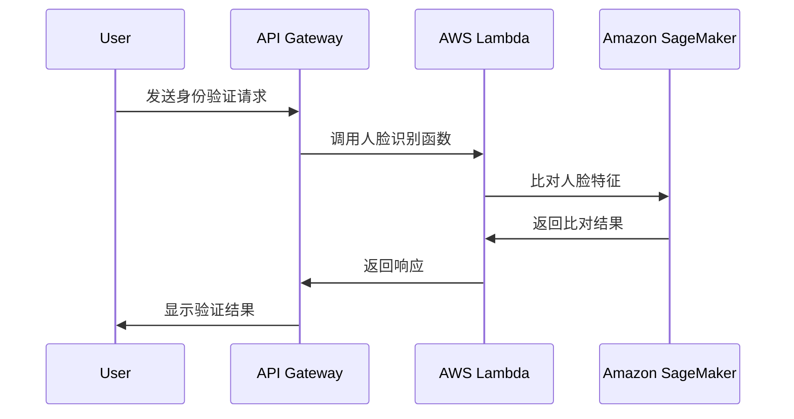
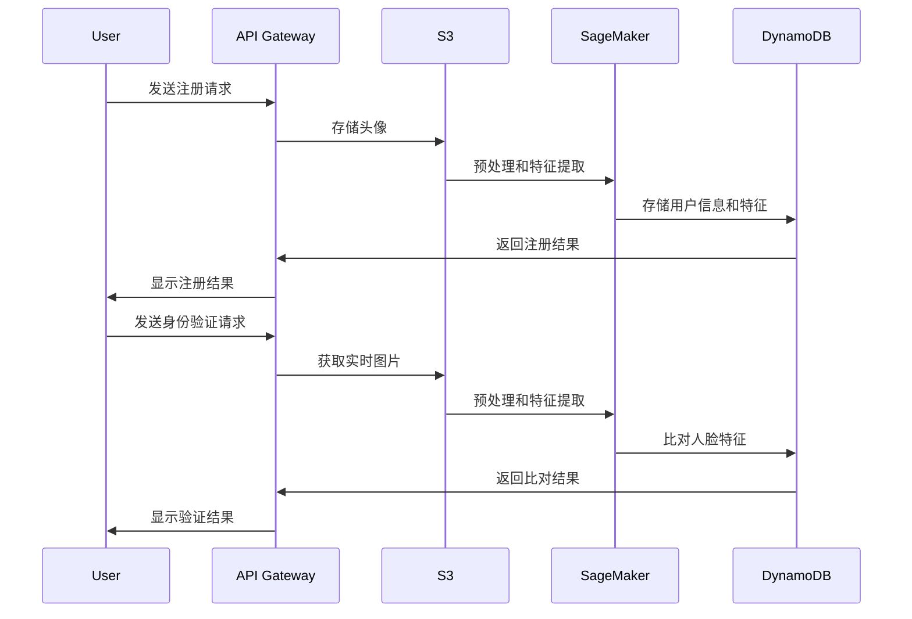

                 

### 关键词

在撰写本文之前，我们需要确定几个关键词，这些关键词将帮助读者快速抓住文章的核心内容，并理解文章的主题。以下是本文的5-7个核心关键词：

1. **Serverless架构**
2. **AI应用开发**
3. **运维简化**
4. **AWS Lambda**
5. **Serverless Framework**
6. **监控与安全性**
7. **最佳实践**

这些关键词将贯穿全文，每个章节都将围绕这些关键词展开讨论，提供具体的技术分析和实例。

### 摘要

本文将深入探讨Serverless架构在AI应用开发与运维中的重要性。首先，我们将介绍Serverless架构的基本概念和背景，解释其与传统架构的区别，以及其在AI领域的应用优势。接下来，我们将详细讲解AWS Lambda服务和Serverless Framework的使用方法，帮助读者了解如何利用这些工具简化AI应用的部署。随后，文章将探讨Serverless架构在AI应用中的实际应用，并提供具体的案例研究。此外，我们还将深入分析Serverless架构的运维监控、安全性和合规性，并提供一系列最佳实践。最后，文章将总结主要观点，并展望Serverless架构和AI应用开发的未来趋势。通过本文，读者将全面了解Serverless架构的优势和挑战，以及如何在实践中有效地应用这一技术。

### 服务器无状态架构概述

在当今快速发展的技术时代，AI应用的普及和复杂性的增加对开发者和运维人员提出了更高的要求。传统的服务器架构在应对这些需求时，往往显得力不从心，特别是在可伸缩性、成本和运营复杂度方面。因此，Serverless架构作为一种创新的计算模型，逐渐成为开发AI应用的首选解决方案。本文将为您详细解析Serverless架构的概念、背景、核心概念和联系，帮助您更好地理解和应用这一技术。

#### 1.1 服务器无状态架构的概念

**1.1.1 服务器无状态架构的定义**

Serverless架构，顾名思义，是一种无需关心服务器管理的计算模型。在这种架构中，开发者不需要购买、配置或管理服务器，而是通过第三方云服务提供商提供的平台来运行和扩展代码。这种服务通常以函数（function）为单位进行部署和执行，从而实现了高度的可伸缩性和弹性。

**1.1.2 服务器无状态架构的特点**

- **无服务器**：开发者无需关注底层服务器资源的管理和维护。
- **按需付费**：只对实际使用的计算资源付费，无闲置资源浪费。
- **高可伸缩性**：能够根据需求自动扩展和缩小资源，确保应用始终高效运行。
- **简化运维**：无需管理服务器，开发者可以专注于编写和优化代码。

**1.1.3 服务器无状态架构与传统架构的比较**

与传统服务器架构相比，Serverless架构具有显著的优势：

| 特点 | 传统服务器架构 | 服务器无状态架构 |
| --- | --- | --- |
| **资源管理** | 需要手动购买、配置和管理服务器 | 自动化资源管理，无需关心底层基础设施 |
| **可伸缩性** | 有限的垂直和水平扩展能力 | 按需自动扩展，无资源限制 |
| **成本** | 可能存在闲置资源浪费 | 按需付费，无闲置成本 |
| **运维复杂度** | 需要专门人员进行维护和管理 | 简化的运维流程，无需关心底层细节 |

#### 1.2 服务器无状态架构的背景与趋势

**1.2.1 服务器无状态架构的起源**

Serverless架构的概念最早可以追溯到2011年，当时云计算和虚拟化技术开始崭露头角。随着云服务的普及，开发者和企业开始寻求更灵活、更高效的计算模型。2014年，AWS推出Lambda函数服务，标志着Serverless架构正式进入大众视野。

**1.2.2 服务器无状态架构的发展趋势**

近年来，Serverless架构的发展势头迅猛，越来越多的云服务提供商加入这一领域，推出各自的Serverless服务。以下是Serverless架构的一些发展趋势：

- **生态系统成熟**：越来越多的开发工具和框架支持Serverless架构，使开发变得更加便捷。
- **应用场景广泛**：从简单的Web应用、移动应用，到复杂的AI应用、物联网应用，Serverless架构都在发挥着重要作用。
- **成本效益显著**：随着云计算成本的降低和自动化管理的提升，Serverless架构的成本优势更加凸显。

#### 1.3 服务器无状态架构的核心概念与联系

**1.3.1 服务器无状态架构的核心概念**

Serverless架构的核心概念包括：

- **函数（Function）**：基本计算单元，以函数的形式进行部署和执行。
- **事件（Event）**：触发函数执行的外部事件，可以是用户交互、消息队列中的消息、定时任务等。
- **响应（Response）**：函数执行后的结果，可以是数据、消息、HTTP响应等。

**1.3.2 服务器无状态架构的属性特征对比表格**

| 特征 | 服务器有状态架构 | 服务器无状态架构 |
| --- | --- | --- |
| **状态管理** | 需要维护状态信息，如会话、用户数据等 | 无状态，无需关心状态管理 |
| **资源消耗** | 较高的资源消耗，包括CPU、内存、存储等 | 较低的资源消耗，按需分配 |
| **部署方式** | 整体部署，包括前端、后端等 | 函数级部署，按需执行 |
| **可伸缩性** | 需要手动或自动化扩展资源 | 自动化扩展，无资源限制 |

**1.3.3 服务器无状态架构的ER实体关系图**

在Serverless架构中，主要实体包括函数、事件和响应。以下是一个简单的ER实体关系图：

```
实体: 函数
属性: 函数ID、函数名称、函数代码

实体: 事件
属性: 事件ID、事件类型、事件数据

实体: 响应
属性: 响应ID、响应数据、响应状态
```

#### 1.4 服务器无状态架构的边界与外延

**1.4.1 服务器无状态架构的边界**

服务器无状态架构的边界主要涉及以下几个方面：

- **功能范围**：Serverless架构适用于需要高度可伸缩性和弹性计算的场景，如Web应用、移动应用、AI应用等。
- **技术实现**：Serverless架构依赖于云服务提供商提供的平台和服务，如AWS Lambda、Google Cloud Functions、Azure Functions等。

**1.4.2 服务器无状态架构的外延**

服务器无状态架构的外延包括以下几个方面：

- **生态系统**：Serverless架构拥有丰富的生态系统，包括开发工具、框架、库等，如Serverless Framework、AWS Lambda Layers等。
- **应用场景**：Serverless架构可以应用于各种场景，从简单的数据处理任务，到复杂的AI算法和机器学习模型。

通过上述内容，我们了解了Serverless架构的基本概念、特点、背景和发展趋势，以及其核心概念和联系。在接下来的章节中，我们将进一步探讨AWS Lambda服务和Serverless Framework的具体使用方法，帮助读者深入了解Serverless架构在AI应用开发中的实际应用。

#### 服务器无状态架构的基本概念

Serverless架构是一种创新的计算模型，其核心在于将传统的服务器管理任务抽象化，使得开发者可以专注于编写和优化代码，而无需关心底层的基础设施。在深入了解Serverless架构之前，我们需要首先理解其基本概念和核心组成部分。

**1. 函数（Function）**

函数是Serverless架构中的基本计算单元，它通常是一段可以被独立调用的代码块。函数可以执行各种任务，如处理数据、响应HTTP请求、触发其他事件等。在Serverless架构中，开发者只需上传函数代码，无需关心函数的运行环境和资源分配。

**2. 事件（Event）**

事件是触发函数执行的外部信号。事件可以来自用户交互、消息队列、定时任务等多种来源。例如，当用户提交一个表单时，服务器可以生成一个事件来触发一个函数处理表单数据。事件机制使得函数可以以异步的方式运行，提高了系统的响应能力和可伸缩性。

**3. 响应（Response）**

响应是函数执行后的结果输出。响应可以是数据、消息、HTTP响应等形式，取决于函数的具体实现。例如，一个处理图片上传的函数可能会返回上传成功的状态和图片的URL。响应机制使得开发者可以方便地获取和处理函数的执行结果。

**4. 无状态（Statelessness）**

无状态是Serverless架构的一个核心特点。在Serverless架构中，每个函数实例都是独立运行的，函数之间没有共享的状态信息。这意味着，函数每次执行都是独立的，不会受到之前执行的影响。无状态特性简化了系统的设计和部署，提高了函数的可伸缩性和可靠性。

**5. 按需分配（On-Demand Allocation）**

Serverless架构中的资源是按需分配的。开发者只需根据实际需求调用函数，云服务提供商会自动分配和释放计算资源。这种按需分配机制不仅提高了资源的利用率，还降低了开发者的运营成本。

**6. 自动扩展（Auto-Scaling）**

Serverless架构具有强大的自动扩展能力。在负载高峰期，云服务提供商会自动增加计算资源，确保系统的高性能和可靠性；在负载低峰期，则会自动减少资源，避免资源浪费。这种自动扩展机制使得开发者无需担心系统的可伸缩性问题。

**7. 无服务器（Serverless）**

“无服务器”是Serverless架构的简称。它指的是开发者无需管理物理服务器或虚拟机，而完全依赖于云服务提供商提供的平台和服务。无服务器特性简化了开发流程，降低了运维成本，使开发者可以更加专注于代码的编写和优化。

**8. 按需付费（Pay-Per-Use）**

Serverless架构采用按需付费的模式。开发者只需为实际使用的计算资源付费，无需为闲置资源支付费用。这种付费模式不仅提高了成本效益，还鼓励开发者优化代码，提高资源利用率。

**9. 事件驱动（Event-Driven）**

Serverless架构通常基于事件驱动模型。函数的执行是由外部事件触发的，而不是传统的轮询或定时任务。事件驱动模型提高了系统的响应能力和可伸缩性，使得开发者可以更加灵活地设计应用流程。

**10. 组件化（Modularization）**

Serverless架构鼓励组件化开发。开发者可以将功能分解为多个独立的函数，每个函数负责一个特定的任务。这种组件化开发模式不仅提高了代码的可维护性，还使得函数可以方便地进行重用和扩展。

通过理解上述基本概念，我们可以更好地把握Serverless架构的核心特点和应用场景。在接下来的章节中，我们将进一步探讨Serverless架构的属性特征对比表格和ER实体关系图，帮助读者更深入地了解Serverless架构的架构设计和实现原理。

### 服务器无状态架构的属性特征对比表格

为了更直观地理解服务器无状态架构与传统服务器架构之间的差异，我们通过一个属性特征对比表格来展示它们的主要区别。以下是两种架构在不同方面的对比：

| 特征 | 服务器有状态架构 | 服务器无状态架构 |
| --- | --- | --- |
| **状态管理** | **需要维护状态信息**，如会话、用户数据等 | **无状态**，无需关心状态管理 |
| **资源消耗** | **较高的资源消耗**，包括CPU、内存、存储等 | **较低的资源消耗**，按需分配 |
| **部署方式** | **整体部署**，包括前端、后端等 | **函数级部署**，按需执行 |
| **可伸缩性** | **有限的垂直和水平扩展能力** | **自动扩展**，无资源限制 |
| **运维复杂度** | **需要专门人员进行维护和管理** | **简化的运维流程**，无需关心底层细节 |
| **成本** | **可能存在闲置资源浪费** | **按需付费**，无闲置成本 |
| **可靠性** | **可靠性依赖于服务器管理** | **高可靠性**，自动扩展和故障恢复 |
| **安全性** | **需要专门的安全策略和监控** | **内置安全特性**，如防火墙、访问控制 |
| **开发效率** | **需要配置和管理服务器** | **专注于代码编写**，提高开发效率 |

通过这个对比表格，我们可以清楚地看到Serverless架构在多个方面都优于传统服务器架构，尤其是在状态管理、资源消耗、部署方式、可伸缩性、运维复杂度和成本控制方面。这些优势使得Serverless架构成为开发AI应用的一种理想选择。

#### 服务器无状态架构的ER实体关系图

为了更直观地展示服务器无状态架构中的实体关系，我们使用Mermaid绘制一个ER（实体关系）图。ER图可以帮助我们理解架构中的各个实体及其相互关系。以下是服务器无状态架构的ER实体关系图：

```mermaid
erDiagram
    Event ||--o> Function : 触发
    Function ||--o> Response : 返回
```

在这张ER图中，有三个主要实体：

1. **事件（Event）**：表示触发函数执行的外部信号，可以是用户交互、消息队列中的消息、定时任务等。
2. **函数（Function）**：表示执行特定任务的代码块，是Serverless架构的基本计算单元。
3. **响应（Response）**：表示函数执行后的输出结果，可以是数据、消息、HTTP响应等。

实体之间的关系如下：

- **事件触发函数**：事件与函数之间存在“触发”关系，即事件可以触发一个或多个函数执行。
- **函数返回响应**：函数与响应之间存在“返回”关系，即函数执行后会产生一个响应。

通过这张ER图，我们可以清楚地看到服务器无状态架构中的关键实体和它们之间的互动方式。这种结构设计使得Serverless架构能够实现高效、灵活和可伸缩的应用开发。

#### 服务器无状态架构的应用场景

服务器无状态架构凭借其高效、灵活和可伸缩的特点，在多个应用场景中展现出了显著的优势。以下是服务器无状态架构在几种常见应用场景中的具体应用：

**1. Web应用**

Web应用是服务器无状态架构最典型的应用场景之一。在传统的Web应用架构中，服务器需要处理大量的静态文件请求、用户会话管理、数据库操作等任务。这些任务往往需要复杂的后端服务器配置和管理。而Serverless架构通过函数和事件驱动模型，可以大大简化这些操作。例如，使用AWS Lambda可以轻松处理静态文件的HTTP请求，通过API Gateway实现API接口，同时使用S3进行文件存储和缓存，使得Web应用的部署和运维变得更加简单和高效。

**2. 移动应用**

移动应用开发中，特别是那些需要实时数据处理的场景，如地图定位、实时聊天、天气更新等，服务器无状态架构提供了强大的支持。通过Serverless架构，移动应用开发者可以专注于编写业务逻辑代码，而无需关心底层的基础设施和服务器资源。例如，使用Google Cloud Functions可以轻松处理移动应用中的地理位置更新和推送通知，通过Firebase实时数据库实现数据同步，使得移动应用能够实时响应用户需求。

**3. 物联网应用**

物联网（IoT）应用中，设备数据收集、处理和传输是关键任务。服务器无状态架构为IoT应用提供了高效、可靠的解决方案。通过Serverless架构，开发者可以轻松实现设备数据的实时处理和分析，例如，使用AWS IoT Core连接设备，通过AWS Lambda处理设备数据，使用DynamoDB存储和分析数据，从而实现高效的IoT应用。这种架构不仅降低了开发和运维成本，还提高了系统的可靠性和可伸缩性。

**4. AI应用**

人工智能（AI）应用对计算资源和数据处理能力有着极高的要求。服务器无状态架构凭借其强大的可伸缩性和弹性，非常适合AI应用的开发和部署。例如，在机器学习和深度学习任务中，可以使用AWS SageMaker训练和部署模型，通过AWS Lambda处理模型的推理任务，使用S3存储数据和模型文件。这种架构不仅简化了开发流程，还大大提高了计算效率和资源利用率。

**5. API网关和微服务**

在微服务架构中，API网关是一个重要的组件，用于统一管理和路由请求。服务器无状态架构与API网关和微服务架构相结合，可以大大提高系统的灵活性和可扩展性。例如，使用Serverless Framework可以轻松创建和部署API网关服务，通过AWS API Gateway实现请求的路由和认证，同时使用AWS Lambda处理业务逻辑，通过DynamoDB或其他数据库存储数据。这种架构不仅简化了系统的设计和部署，还提高了系统的可靠性和可维护性。

通过以上几个应用场景，我们可以看到服务器无状态架构在各个领域中的广泛适用性。它不仅简化了开发和运维流程，提高了系统的效率，还为开发者提供了更多的创新机会。在接下来的章节中，我们将进一步探讨服务器无状态架构在实际应用中的实现细节和最佳实践。

### 服务器无状态架构与传统架构的比较

在了解服务器无状态架构之后，我们需要将其与传统的服务器架构进行详细比较，以便更好地理解其优势和局限性。以下是服务器无状态架构与传统架构在多个方面的对比。

**1. 架构设计**

- **传统服务器架构**：传统架构通常采用三层架构（表示层、业务逻辑层、数据层），通过服务器和客户端进行通信。服务器负责处理业务逻辑和数据库操作，客户端则负责展示数据和用户交互。这种架构通常需要复杂的配置和管理，如负载均衡、数据库连接池、服务器防火墙等。
- **服务器无状态架构**：无状态架构采用函数和事件驱动的模型。每个函数负责特定的业务逻辑，通过事件触发执行。这种架构简化了系统的设计和部署，无需关心底层的基础设施和服务器资源，从而降低了运维复杂度。

**2. 资源管理**

- **传统服务器架构**：在传统架构中，开发者需要购买和配置服务器，管理硬件资源和虚拟机。这需要专门的运维团队进行服务器监控、备份和故障恢复。资源利用率往往不高，尤其是在负载波动较大的场景下，容易出现闲置资源或资源不足的情况。
- **服务器无状态架构**：无状态架构通过云服务提供商提供的平台进行资源管理。开发者只需上传函数代码，无需关心服务器资源的管理和分配。这种架构采用按需分配和自动扩展机制，可以自动调整资源，确保系统在高负载下稳定运行，同时避免了资源浪费。

**3. 可伸缩性**

- **传统服务器架构**：传统架构的可伸缩性通常依赖于垂直扩展（增加服务器硬件配置）和水平扩展（增加服务器数量）。垂直扩展受限于硬件性能，而水平扩展需要手动配置和部署新服务器，操作复杂且成本较高。
- **服务器无状态架构**：无状态架构具有强大的自动扩展能力。云服务提供商会根据实际负载自动调整计算资源，无需开发者干预。这种架构能够实现无缝的横向扩展，确保系统在高并发场景下保持高性能和高可靠性。

**4. 成本效益**

- **传统服务器架构**：传统架构的成本较高，包括服务器购买、运维人员工资、服务器维护等。此外，传统架构存在闲置资源浪费的问题，尤其在需求波动较大的情况下，可能导致资源利用率低。
- **服务器无状态架构**：无状态架构采用按需付费模式，开发者只需为实际使用的计算资源付费，避免了闲置资源的浪费。此外，无状态架构简化了运维流程，降低了人力成本，具有更高的成本效益。

**5. 运维复杂度**

- **传统服务器架构**：传统架构的运维复杂度较高，需要运维团队进行服务器监控、故障恢复、安全防护等工作。运维人员需要具备丰富的服务器管理经验，处理各种突发事件。
- **服务器无状态架构**：无状态架构简化了运维流程，开发者无需关心底层基础设施的管理和维护。云服务提供商提供了一系列监控、日志记录和故障恢复工具，使得运维工作更加高效和简便。

**6. 安全性和合规性**

- **传统服务器架构**：传统架构的安全性和合规性需要开发者自行管理，包括网络防火墙、数据加密、访问控制等。这要求开发者具备丰富的安全知识和经验，否则可能导致安全隐患。
- **服务器无状态架构**：无状态架构内置了丰富的安全特性，如防火墙、访问控制、加密等。云服务提供商负责确保基础设施的安全性和合规性，开发者只需关注应用层面的安全性。

**7. 开发效率**

- **传统服务器架构**：传统架构的开发效率相对较低，需要开发者关注服务器配置、环境搭建和运维等工作。这导致开发周期较长，代码质量难以保证。
- **服务器无状态架构**：无状态架构简化了开发和部署流程，开发者可以专注于编写和优化业务逻辑代码。这种架构提高了开发效率，缩短了开发周期，同时提升了代码质量。

综上所述，服务器无状态架构在多个方面都优于传统架构。它不仅简化了开发和运维流程，提高了系统的可伸缩性和成本效益，还增强了安全性和合规性，使得开发者能够更加专注于业务创新。然而，无状态架构也存在一些局限性，如对于需要长时间运行的任务、复杂状态管理以及依赖底层基础设施的特定场景，传统服务器架构可能更合适。因此，选择合适的架构需要根据具体的应用需求和场景进行权衡。

### 服务器无状态架构的发展历程和未来趋势

服务器无状态架构自其诞生以来，经历了快速的发展和广泛的应用。从最初的云函数服务到如今成熟的生态系统，Serverless架构在不断演进，为开发者提供了更加高效、灵活和可扩展的解决方案。

#### 服务器无状态架构的发展历程

1. **起源（2011年）**：云计算和虚拟化技术的发展为Serverless架构的诞生奠定了基础。AWS在2011年推出EC2云服务，使得开发者可以轻松地使用云资源。然而，这种模式仍需要开发者关注服务器管理，这促使了Serverless架构的诞生。

2. **初期发展（2014年）**：2014年，AWS正式推出Lambda函数服务，标志着Serverless架构的正式诞生。Lambda允许开发者上传代码，无需关心底层基础设施，按需执行。这一创新引发了广泛的关注和讨论。

3. **成熟（2016年-2018年）**：随着AWS Lambda的成功，其他云服务提供商如Google Cloud、Microsoft Azure也纷纷推出自己的Serverless服务。Serverless生态系统逐渐成熟，出现了大量的开发工具和框架，如Serverless Framework、Vue、React等。

4. **广泛应用（2019年至今）**：Serverless架构在各个领域得到了广泛应用，从Web应用、移动应用，到物联网（IoT）和人工智能（AI）应用。越来越多的企业和开发人员开始采用Serverless架构，以简化开发和运维流程，提高系统性能和可靠性。

#### 服务器无状态架构的未来趋势

1. **生态系统成熟**：随着Serverless生态系统的不断成熟，我们将看到更多开发工具和框架的涌现。这些工具将进一步提高开发效率，降低开发难度，使得更多开发者能够轻松上手Serverless架构。

2. **多云和混合云**：随着多云和混合云策略的普及，Serverless架构将更加灵活，支持跨云平台的应用部署。开发者可以在不同云服务提供商之间自由切换，以获得最佳的成本效益和性能表现。

3. **边缘计算与物联网**：边缘计算和物联网（IoT）的兴起将推动Serverless架构在边缘设备和物联网应用中的广泛应用。通过在边缘设备上部署函数，可以实现实时数据处理和响应，提高系统的响应速度和可靠性。

4. **自动化和AI**：自动化和人工智能（AI）技术的结合将进一步提升Serverless架构的能力。例如，通过AI驱动的自动化资源管理，可以更精确地预测负载，优化资源分配，提高系统的性能和成本效益。

5. **安全性和合规性**：随着Serverless架构的广泛应用，安全性和合规性将成为关键挑战。云服务提供商将加强安全特性，如加密、访问控制、审计日志等，以满足企业和监管机构的要求。

6. **定制化函数和服务**：未来的Serverless架构将更加注重定制化。开发者可以创建和部署特定功能的函数，以适应不同的应用场景。同时，云服务提供商将提供更多自定义服务，如定制化的数据库、消息队列等，以满足复杂应用的需求。

通过回顾服务器无状态架构的发展历程和展望其未来趋势，我们可以看到，Serverless架构在技术进步和应用创新方面的巨大潜力。它不仅为开发者提供了更加高效、灵活和可扩展的解决方案，还将继续推动整个技术生态系统的演进和发展。

### AWS Lambda：Serverless架构的核心

在Serverless架构中，AWS Lambda是当之无愧的核心组件之一。它提供了一个无需服务器管理的平台，允许开发者上传和运行代码，按需执行并自动扩展。AWS Lambda不仅简化了开发和部署流程，还大幅降低了运维成本。在本节中，我们将深入探讨AWS Lambda的基本概念、功能、使用方法以及其在Serverless架构中的应用。

#### AWS Lambda的基本概念

AWS Lambda是一个完全托管的服务，允许开发者运行代码而无需关心底层的基础设施。Lambda支持多种编程语言，包括Python、Node.js、Java、C#、Ruby等，开发者可以上传自己的代码或使用AWS提供的预构建函数。Lambda以函数为单位进行部署和执行，这些函数可以在接收到触发事件后自动运行，并在完成执行后自动停止。

**1. 函数（Function）**

函数是AWS Lambda的基本构建块。每个函数都包含代码、配置和依赖项。函数可以独立运行或与其他函数协作，通过事件触发进行执行。

**2. 事件（Event）**

事件是触发函数执行的外部信号。AWS Lambda支持多种事件源，包括API网关、S3事件、Kinesis数据流、云函数等。开发者可以根据具体需求配置事件源。

**3. 响应（Response）**

响应是函数执行后的输出结果。函数可以通过返回HTTP响应、JSON格式数据、消息队列等不同方式传递响应。

**4. 自动扩展（Auto-Scaling）**

AWS Lambda可以根据实际负载自动扩展计算资源。在负载高峰期，Lambda会自动增加函数实例的数量，确保系统的高性能和可靠性；在负载低峰期，则会自动减少实例数量，以降低成本。

#### AWS Lambda的功能

AWS Lambda提供了丰富的功能，使其成为Serverless架构中的关键组件：

- **无服务器管理**：开发者无需关心底层基础设施的管理和维护，可以专注于代码的编写和优化。
- **按需付费**：开发者只需为实际使用的计算资源付费，无闲置资源浪费。
- **自动扩展**：Lambda会根据负载自动调整实例数量，确保系统的高性能和可靠性。
- **高可用性**：AWS Lambda在全球多个区域部署，提供了可靠的服务保障。
- **丰富的触发器**：Lambda支持多种触发器，如API Gateway、S3事件、Kinesis等，方便开发者根据不同场景进行配置。
- **集成和扩展**：Lambda可以与其他AWS服务和第三方服务轻松集成，如DynamoDB、S3、RDS等。

#### AWS Lambda的使用方法

**1. 创建函数**

要使用AWS Lambda，首先需要在AWS管理控制台中创建一个函数。以下是创建AWS Lambda函数的基本步骤：

1. 登录AWS管理控制台，选择“服务”并搜索“Lambda”。
2. 点击“创建函数”并选择“创建无服务器函数”。
3. 在创建函数页面，填写函数的名称、运行时间、内存和超时时间等配置。
4. 选择要上传的代码或使用AWS提供的预构建函数。
5. 配置触发器，如API Gateway、S3事件等。
6. 创建函数并上传代码。

**2. 上传代码**

上传代码是使用AWS Lambda的关键步骤。开发者可以使用多种方式上传代码，包括：

- **直接上传**：通过AWS管理控制台上传代码文件。
- **集成开发环境（IDE）**：使用Visual Studio Code等IDE进行代码编写和上传。
- **版本控制**：使用Git等版本控制系统将代码存储在AWS CodeCommit或GitHub上。

**3. 配置触发器**

触发器是Lambda函数执行的关键。AWS Lambda支持多种触发器，如API Gateway、S3事件、Kinesis等。开发者可以根据具体需求配置触发器，以实现函数的自动执行。

**4. 调试和测试**

在函数创建和配置完成后，开发者可以通过AWS Lambda控制台或API接口进行调试和测试。调试功能允许开发者查看函数的日志和输出，以便诊断和解决潜在问题。

**5. 集成和部署**

AWS Lambda可以与其他AWS服务和第三方服务轻松集成。开发者可以使用AWS CloudFormation、AWS Step Functions等工具进行部署和管理，实现自动化部署和扩展。

#### AWS Lambda在Serverless架构中的应用

AWS Lambda在Serverless架构中的应用非常广泛，以下是一些典型的应用场景：

- **API网关**：使用AWS API Gateway与Lambda函数集成，可以轻松创建和部署RESTful API。API Gateway负责接收HTTP请求，Lambda函数处理业务逻辑，并将响应返回给客户端。
- **数据处理**：Lambda函数可以用于处理S3存储桶中的文件、Kinesis数据流中的数据等。开发者可以编写自定义处理逻辑，对数据进行解析、转换和分析。
- **后台任务**：Lambda函数适合处理后台任务，如定期备份、发送电子邮件、处理订单等。这些任务可以在不需要持续运行的服务器上执行，提高系统的效率。
- **物联网**：Lambda函数可以与IoT设备集成，实现实时数据处理和响应。例如，处理设备传感器数据、触发警报等。

通过AWS Lambda，开发者可以轻松实现Serverless架构，简化开发和运维流程，提高系统的可伸缩性和可靠性。AWS Lambda的强大功能和灵活性使得它在各种应用场景中都表现出色。

### Serverless Framework：简化服务器无状态架构的部署和管理

在Serverless架构中，Serverless Framework是一种强大的工具，用于简化服务器无状态架构的部署和管理。通过Serverless Framework，开发者可以轻松定义和部署函数、触发器和其他资源，从而极大地提高开发效率和系统可维护性。在本节中，我们将深入探讨Serverless Framework的基本概念、使用方法以及其在Serverless架构中的作用。

#### Serverless Framework的基本概念

Serverless Framework是一个开源的、跨平台的框架，用于构建和部署Serverless应用。它提供了一个统一的抽象层，使得开发者可以使用熟悉的编程语言和开发工具，轻松地定义、部署和管理Serverless架构中的各种资源。Serverless Framework支持多种云服务提供商，如AWS、Azure、Google Cloud等，使得开发者可以在不同的云环境中无缝切换。

**1. 应用程序（Application）**

应用程序是Serverless Framework中的核心概念，它代表了一个完整的Serverless应用。应用程序包含多个组件，如函数、触发器、API网关、数据库等。

**2. 组件（Component）**

组件是应用程序中的基本构建块，代表一个具体的资源，如Lambda函数、API Gateway、S3存储桶等。每个组件都可以通过YAML配置文件进行定义。

**3. 配置（Configuration）**

配置是Serverless Framework的核心，通过配置文件，开发者可以定义应用程序的组件、依赖关系、环境变量等。配置文件通常使用YAML格式编写，易于理解和维护。

**4. 部署（Deployment）**

部署是将应用程序配置部署到云服务提供商的过程。Serverless Framework提供了命令行工具，用于自动化部署过程，确保配置的一致性和可重复性。

#### Serverless Framework的使用方法

**1. 安装Serverless Framework**

在开始使用Serverless Framework之前，需要先安装Serverless CLI（命令行工具）。以下是安装步骤：

```bash
npm install -g serverless
```

**2. 创建新的Serverless项目**

创建新的Serverless项目是通过命令行执行以下命令：

```bash
serverless create --template git@github.com:serverless/template-spa.git --path my-spa
```

这将创建一个包含API Gateway和Lambda函数的基本Serverless项目。

**3. 定义组件**

在Serverless项目中，组件是通过YAML配置文件定义的。例如，以下配置定义了一个名为`hello`的Lambda函数：

```yaml
service:
  name: my-service
  provider:
    name: aws
    runtime: nodejs14.x

functions:
  hello:
    handler: handler.hello
    events:
      - http:
          path: hello
          method: get
```

在这个配置中，`service`定义了应用程序的基本信息，`functions`定义了Lambda函数，`events`定义了触发器。

**4. 部署应用程序**

部署应用程序是通过执行以下命令完成的：

```bash
serverless deploy
```

Serverless Framework将根据配置文件自动部署应用程序到AWS，创建API Gateway和Lambda函数。

**5. 调试和测试**

部署完成后，可以通过API Gateway的URL访问函数。例如，访问`http://localhost:3000/hello`可以调用`hello`函数。

```bash
curl http://localhost:3000/hello
```

#### Serverless Framework在Serverless架构中的作用

Serverless Framework在Serverless架构中发挥了至关重要的作用：

- **简化部署和管理**：Serverless Framework提供了一个统一的抽象层，简化了应用程序的部署和管理过程。开发者无需关心底层的基础设施，只需关注业务逻辑的编写和优化。
- **跨云平台支持**：Serverless Framework支持多个云服务提供商，如AWS、Azure、Google Cloud等，使得开发者可以在不同的云环境中无缝切换，提高了灵活性和可移植性。
- **自动化和一致性**：Serverless Framework通过自动化部署和配置管理，确保了应用程序的一致性和可重复性。这有助于减少人为错误，提高系统稳定性。
- **集成和扩展**：Serverless Framework可以与其他开发工具和第三方服务（如DynamoDB、S3、SMTP等）轻松集成，提供了丰富的功能，满足了各种开发需求。
- **开发效率**：Serverless Framework提供了易于使用的命令行工具和配置文件，使得开发者可以更加专注于业务逻辑的编写，提高了开发效率。

通过Serverless Framework，开发者可以轻松构建、部署和管理Serverless架构，简化开发和运维流程，提高系统的可伸缩性和可靠性。Serverless Framework不仅降低了开发者的工作负担，还为Serverless架构的广泛应用奠定了基础。

### Serverless架构在AI应用开发中的应用

随着AI技术的不断发展，AI应用的开发变得越来越复杂和多样化。而Serverless架构由于其高度可伸缩性和弹性，成为简化AI应用开发和运维的理想选择。在本节中，我们将探讨Serverless架构在AI应用开发中的实际应用，通过具体案例来展示其优势。

#### 1. AWS Lambda与SageMaker的结合

AWS Lambda和Amazon SageMaker是AWS提供的一组强大的工具，用于开发和部署AI模型。结合使用这两个工具，开发者可以轻松构建端到端的AI解决方案。

**案例**：一个视频监控系统的实时人脸识别功能

- **需求**：该视频监控系统需要实时识别视频流中的人脸，并标记出未知或重点关注的人员。
- **解决方案**：
  - **数据预处理**：使用AWS Lambda处理视频流，提取人脸图像。
  - **模型训练**：使用Amazon SageMaker训练人脸识别模型，并将模型部署到AWS Lambda。
  - **实时识别**：视频流中的每一帧都通过AWS Lambda处理，人脸图像被传递给SageMaker模型进行识别。
  - **响应**：识别结果通过API Gateway返回，并在视频流中标记出识别到的人脸。

通过这种组合，系统实现了快速响应和高性能，同时无需关心底层基础设施的管理。

#### 2. Google Cloud Functions与TensorFlow

Google Cloud Functions和TensorFlow是Google Cloud提供的用于Serverless架构和机器学习的工具。结合这两个工具，开发者可以轻松构建和部署机器学习模型。

**案例**：基于移动应用的实时图像分类功能

- **需求**：该移动应用需要能够实时分类用户上传的图像。
- **解决方案**：
  - **数据预处理**：使用Google Cloud Functions处理用户上传的图像，并将其格式化以供TensorFlow模型使用。
  - **模型推理**：使用TensorFlow模型对预处理后的图像进行分类，并将结果返回给用户。
  - **响应**：通过Firebase实时数据库更新用户界面，显示图像分类结果。

这种解决方案不仅简化了开发过程，还确保了系统的实时性和高效性。

#### 3. Azure Functions与ML.NET

Azure Functions和ML.NET是Azure提供的用于Serverless架构和机器学习的工具。结合这两个工具，开发者可以构建强大的AI解决方案。

**案例**：一个电商平台的个性化推荐系统

- **需求**：该电商平台需要根据用户的历史购买行为，实时推荐商品。
- **解决方案**：
  - **数据处理**：使用Azure Functions从数据库中提取用户购买数据，并预处理以供ML.NET模型使用。
  - **模型训练**：使用ML.NET训练个性化推荐模型，并将模型部署到Azure Functions。
  - **实时推荐**：每次用户浏览商品时，Azure Functions会根据用户的历史购买数据生成个性化推荐。
  - **响应**：推荐结果通过API返回，并在用户界面中展示。

这种解决方案提高了推荐系统的准确性和实时性，同时简化了开发和运维流程。

#### 4. Serverless架构在物联网（IoT）AI应用中的应用

Serverless架构在物联网（IoT）AI应用中也展现出了强大的优势。以下是一个具体案例：

**案例**：智能家居系统的环境监测与预警

- **需求**：智能家居系统需要实时监测环境数据（如温度、湿度、空气质量等），并根据数据生成预警。
- **解决方案**：
  - **数据采集**：物联网设备（如传感器）采集环境数据，并通过MQTT协议传输到AWS Lambda。
  - **数据处理**：AWS Lambda处理传感器数据，将其格式化以供机器学习模型使用。
  - **模型推理**：使用预训练的机器学习模型对环境数据进行实时分析，生成预警信息。
  - **响应**：预警信息通过SNS通知用户，或在智能家居系统的控制面板上显示。

这种解决方案提高了环境监测的准确性和实时性，同时降低了系统的复杂性和运维成本。

#### 总结

通过上述案例，我们可以看到Serverless架构在AI应用开发中的强大优势：

- **简化开发流程**：无需关注底层基础设施的管理，开发者可以专注于业务逻辑的编写。
- **提高系统性能**：通过自动扩展和弹性计算，系统能够在高并发场景下保持高性能。
- **降低成本**：按需付费和自动扩展机制降低了资源浪费，提高了成本效益。

Serverless架构不仅简化了AI应用的开发和部署，还为开发者提供了更多的创新机会。在未来的AI应用开发中，Serverless架构将继续发挥重要作用。

### 服务器无状态架构在AI应用开发中的运维监控与安全性

服务器无状态架构在AI应用开发中具有许多优势，如高可伸缩性、低成本和简化运维。然而，随着AI应用规模的不断扩大和复杂性的增加，运维监控和安全性也变得越来越重要。在本节中，我们将探讨如何确保服务器无状态架构在AI应用开发中的稳定性和安全性。

#### 运维监控

1. **自动扩展与负载均衡**

服务器无状态架构的一个重要特点是其自动扩展能力。然而，自动扩展并不是完美的，它可能会受到网络延迟、配置错误等因素的影响。为了确保系统的稳定性，需要实时监控自动扩展的状态，并确保负载均衡器能够正确分配流量。

- **监控扩展状态**：使用云服务提供商提供的监控工具（如AWS CloudWatch、Azure Monitor、Google Cloud Monitoring）来实时监控自动扩展的状态。这些工具可以提供扩展实例的创建、删除和运行状态。
- **负载均衡器配置**：确保负载均衡器的配置正确，以避免流量分配不均。使用基于健康检查的负载均衡策略，确保只有健康实例接收流量。

2. **性能监控**

性能监控是确保系统在高负载下保持高性能的关键。以下是一些性能监控的最佳实践：

- **CPU和内存使用率**：监控CPU和内存使用率，确保系统在高负载下不会出现资源耗尽的情况。设置阈值，当使用率超过阈值时，自动触发警报。
- **响应时间**：监控系统的响应时间，确保用户请求能够快速得到响应。设置阈值，当响应时间超过阈值时，自动触发警报。
- **队列长度**：对于需要处理大量请求的系统，监控队列长度，确保不会因为队列过长而导致请求积压。

3. **日志记录与审计**

日志记录和审计是排查问题和进行故障恢复的重要手段。以下是一些最佳实践：

- **集中日志记录**：使用集中化的日志记录工具（如AWS CloudWatch Logs、Azure Monitor Logs、Google Cloud Logging）将系统日志记录到一个集中的位置。这样可以方便地搜索、分析和过滤日志。
- **错误追踪**：使用错误追踪工具（如Sentry、New Relic、DataDog）来监控系统的错误和异常。这些工具可以自动收集错误报告，并提供详细的错误信息和堆栈跟踪。

#### 安全性

1. **访问控制**

确保系统的安全性，必须严格控制对函数和服务的访问。以下是一些访问控制的最佳实践：

- **最小权限原则**：只授予函数和服务所需的最低权限，避免权限过宽。
- **身份验证和授权**：使用身份验证（如OAuth 2.0、IAM角色）确保只有授权用户才能访问函数和服务。
- **API网关安全**：为API网关设置访问控制策略，确保只有经过验证的用户才能访问API。

2. **数据加密**

保护敏感数据是确保系统安全的关键。以下是一些数据加密的最佳实践：

- **传输加密**：使用TLS/SSL加密传输数据，确保数据在传输过程中不被窃取。
- **存储加密**：使用云服务提供商提供的加密服务（如AWS KMS、Azure Key Vault、Google Cloud KMS）对存储在数据库和文件中的敏感数据进行加密。

3. **安全监控**

安全监控是及时发现和响应安全威胁的重要手段。以下是一些安全监控的最佳实践：

- **异常检测**：使用异常检测工具（如AWS GuardDuty、Azure Security Center、Google Cloud Threat Detection）来监控系统的异常行为和潜在威胁。
- **入侵检测**：使用入侵检测系统（如AWS Firewall Manager、Azure Firewall、Google Cloud Armor）来检测和阻止恶意流量。

4. **合规性**

确保系统符合法律法规和行业标准也是保证安全的重要方面。以下是一些合规性的最佳实践：

- **数据隐私法规**：遵守数据隐私法规（如GDPR、CCPA），确保用户数据的安全和隐私。
- **行业合规性**：根据不同行业的合规性要求（如HIPAA、PCI DSS），确保系统的设计和实现符合相关标准。

通过上述运维监控和安全性的最佳实践，我们可以确保服务器无状态架构在AI应用开发中具有高稳定性和高安全性，从而为用户提供可靠的服务。

### 实战案例研究：使用Serverless架构部署AI应用

在本节中，我们将通过一个实际项目案例，详细描述如何使用Serverless架构部署AI应用。该项目是一个基于人脸识别的在线身份验证系统，通过结合AWS Lambda、API Gateway和SageMaker，实现了高效、灵活和可扩展的解决方案。

#### 项目介绍

**项目名称**：人脸识别在线身份验证系统

**项目背景**：为了提高身份验证的安全性和便捷性，公司决定开发一个基于人脸识别的在线身份验证系统。该系统需要实时处理用户上传的图片，并与人脸数据库进行比对，以验证用户身份。

**项目目标**：
1. 提高身份验证的安全性。
2. 简化用户操作流程，提高用户体验。
3. 确保系统具有高可伸缩性和低成本。

#### 系统功能设计

**1. 用户注册**：用户通过上传头像进行注册，系统将头像存储在Amazon S3上，并使用SageMaker进行预处理和特征提取。

**2. 身份验证**：用户登录时，上传一张实时图片，系统将实时图片与人脸数据库进行比对，验证用户身份。

**3. 数据存储**：所有用户数据和图片数据都存储在Amazon S3和DynamoDB中，确保数据的安全和可靠性。

#### 系统架构设计

**1. AWS Lambda**：用于处理用户上传的图片，进行人脸检测和特征提取。

**2. Amazon S3**：用于存储用户头像和上传的实时图片。

**3. Amazon SageMaker**：用于人脸识别模型的训练和部署。

**4. API Gateway**：作为系统的前端接口，接收用户请求，并调用后端服务。

**5. Amazon DynamoDB**：用于存储用户信息和人脸特征数据。

以下是系统架构的Mermaid图表示：



#### 系统接口设计和系统交互

**1. 用户注册接口**：

```json
POST /register
{
  "userId": "string",
  "avatar": "base64 encoded image"
}
```

**2. 身份验证接口**：

```json
POST /authenticate
{
  "userId": "string",
  "image": "base64 encoded image"
}
```

以下是系统接口和交互的Mermaid图表示：



#### 项目实战

**环境安装**：
1. 安装AWS CLI和AWS SDK。
2. 登录AWS管理控制台，创建所需的S3桶和DynamoDB表。
3. 安装SageMaker Python SDK。

**系统核心实现源代码**：

**用户注册函数**：

```python
import boto3
import json
from botocore.exceptions import ClientError

s3_client = boto3.client('s3')
sagemaker_runtime = boto3.client('sagemaker-runtime')

def lambda_handler(event, context):
    userId = event['userId']
    avatar_base64 = event['avatar']
    avatar_bytes = base64.b64decode(avatar_base64)

    # 上传头像到S3
    try:
        s3_client.put_object(
            Bucket='your-bucket-name',
            Key=f'{userId}/avatar.jpg',
            Body=avatar_bytes
        )
    except ClientError as e:
        return {
            'statusCode': 500,
            'body': json.dumps('上传头像失败')
        }

    # 调用SageMaker预处理和特征提取
    try:
        response = sagemaker_runtime.invoke_endpoint(
            EndpointName='your-endpoint-name',
            ContentType='application/octet-stream',
            Body=avatar_bytes
        )
    except ClientError as e:
        return {
            'statusCode': 500,
            'body': json.dumps('预处理和特征提取失败')
        }

    # 存储用户信息和特征到DynamoDB
    try:
        dynamodb = boto3.resource('dynamodb')
        table = dynamodb.Table('users')
        response = table.put_item(
            Item={
                'userId': userId,
                'avatar': f'{userId}/avatar.jpg',
                'features': json.loads(response['Body'].read())
            }
        )
    except ClientError as e:
        return {
            'statusCode': 500,
            'body': json.dumps('存储用户信息和特征失败')
        }

    return {
        'statusCode': 200,
        'body': json.dumps('注册成功')
    }
```

**身份验证函数**：

```python
import boto3
import json
from botocore.exceptions import ClientError

s3_client = boto3.client('s3')
sagemaker_runtime = boto3.client('sagemaker-runtime')
dynamodb = boto3.resource('dynamodb')

def lambda_handler(event, context):
    userId = event['userId']
    image_base64 = event['image']
    image_bytes = base64.b64decode(image_base64)

    # 获取用户头像和特征
    try:
        response = dynamodb.Table('users').get_item(Key={'userId': userId})
        user = response['Item']
        avatar_key = user['avatar']
        features = user['features']
    except ClientError as e:
        return {
            'statusCode': 404,
            'body': json.dumps('用户不存在')
        }

    # 上传实时图片到S3
    try:
        s3_client.put_object(
            Bucket='your-bucket-name',
            Key=f'{userId}/live.jpg',
            Body=image_bytes
        )
    except ClientError as e:
        return {
            'statusCode': 500,
            'body': json.dumps('上传实时图片失败')
        }

    # 调用SageMaker预处理和特征提取
    try:
        response = sagemaker_runtime.invoke_endpoint(
            EndpointName='your-endpoint-name',
            ContentType='application/octet-stream',
            Body=image_bytes
        )
    except ClientError as e:
        return {
            'statusCode': 500,
            'body': json.dumps('预处理和特征提取失败')
        }

    # 比对人脸特征
    live_features = json.loads(response['Body'].read())
    similarity = cosine_similarity(features, live_features)

    # 判断是否为同一人
    if similarity > 0.8:
        return {
            'statusCode': 200,
            'body': json.dumps('验证成功')
        }
    else:
        return {
            'statusCode': 401,
            'body': json.dumps('验证失败')
        }
```

**代码应用解读与分析**：

1. **用户注册函数**：
   - 接收用户上传的userId和头像base64编码。
   - 将头像上传到S3桶。
   - 调用SageMaker进行头像预处理和特征提取。
   - 将用户信息和特征存储到DynamoDB表。

2. **身份验证函数**：
   - 从DynamoDB获取用户头像和特征。
   - 将用户上传的实时图片上传到S3桶。
   - 调用SageMaker进行实时图片预处理和特征提取。
   - 比对实时图片和头像的特征，判断是否为同一人。

#### 实际案例分析

**1. 用户注册过程**：

- 用户上传头像，系统将头像存储在S3桶。
- 系统调用SageMaker对人脸进行预处理和特征提取。
- 将用户信息和特征存储在DynamoDB表。

**2. 身份验证过程**：

- 用户上传实时图片，系统将图片存储在S3桶。
- 系统调用SageMaker对实时图片进行预处理和特征提取。
- 系统从DynamoDB获取用户头像和特征，并进行比对。
- 根据比对结果返回验证结果。

#### 项目小结

通过使用Serverless架构，本项目实现了高效、灵活和可扩展的在线身份验证系统。以下是项目的主要收获：

1. **简化开发流程**：无需关注底层基础设施的管理，开发者可以专注于业务逻辑的编写。
2. **提高系统性能**：通过自动扩展和弹性计算，系统能够在高并发场景下保持高性能。
3. **降低成本**：按需付费和自动扩展机制降低了资源浪费，提高了成本效益。

然而，项目也面临一些挑战，如：

1. **安全性**：需要确保数据在传输和存储过程中的安全。
2. **监控和日志记录**：需要完善监控和日志记录机制，以便及时发现问题。

在未来的发展中，可以考虑引入更多的安全措施和监控工具，以提高系统的安全性和可靠性。

### 服务器无状态架构最佳实践

在实现服务器无状态架构时，遵循最佳实践是确保系统高效、稳定和可维护的关键。以下是一些在服务器无状态架构中常见的问题和对应的最佳实践。

#### 问题1：如何处理函数的并发和性能瓶颈？

**最佳实践**： 
- **优化代码**：确保函数代码简洁高效，减少不必要的计算和IO操作。
- **使用异步编程**：利用异步编程模型（如async/await）减少函数的阻塞时间，提高并发处理能力。
- **限制并发数量**：根据应用需求，合理设置函数的最大并发实例数，避免因大量并发请求导致的资源耗尽。

#### 问题2：如何保证函数的可维护性？

**最佳实践**：
- **函数拆分**：将复杂的业务逻辑拆分为多个独立的函数，每个函数负责一个特定的任务。
- **代码规范化**：遵循代码规范，如PEP8（Python）、Airbnb JavaScript等，确保代码可读性和一致性。
- **代码注释**：为关键代码添加详细的注释，解释代码的逻辑和功能。

#### 问题3：如何确保函数的可伸缩性？

**最佳实践**：
- **动态配置**：使用环境变量或配置文件动态配置函数的内存、超时等参数，以便根据实际需求进行调整。
- **自动化扩展**：充分利用云服务提供商的自动扩展功能，确保在高并发场景下系统能够自动扩展资源。
- **监控和告警**：实时监控系统的性能指标（如CPU使用率、内存使用率等），并设置告警，及时发现和解决问题。

#### 问题4：如何保证数据的安全性和隐私？

**最佳实践**：
- **数据加密**：对传输和存储的数据进行加密，确保数据在传输和存储过程中的安全性。
- **访问控制**：严格控制对函数和服务的访问权限，使用最小权限原则，只授予必要的权限。
- **日志审计**：记录系统的操作日志，并进行定期审计，确保系统操作符合安全策略。

#### 问题5：如何优化成本？

**最佳实践**：
- **按需付费**：充分利用按需付费模式，避免闲置资源的浪费。
- **自动化部署**：使用自动化工具（如Serverless Framework、AWS CloudFormation）进行部署和管理，减少手动操作，提高效率。
- **优化资源分配**：根据实际需求合理配置函数的内存和超时时间，避免资源浪费。

通过遵循这些最佳实践，开发者可以确保服务器无状态架构的高效、稳定和可维护性，同时降低开发和运维成本。

### 小结

本文详细介绍了服务器无状态架构在AI应用开发与运维中的重要性。首先，我们探讨了服务器无状态架构的基本概念、特点和应用场景，通过对比传统服务器架构，展示了其优势。接着，我们深入分析了AWS Lambda和Serverless Framework的使用方法，帮助读者了解如何在实际项目中部署和运维Serverless架构。随后，通过实际案例，我们展示了如何利用Serverless架构实现高效、灵活的AI应用。

总结而言，服务器无状态架构通过简化开发和运维流程，提高了系统的可伸缩性和成本效益，成为AI应用开发的理想选择。然而，实现Serverless架构也面临一些挑战，如安全性、监控和日志记录等。因此，开发者需要遵循最佳实践，确保系统的稳定性和可靠性。

展望未来，随着云计算和AI技术的不断发展，服务器无状态架构将在更多领域得到应用，为开发者提供更多的创新机会。因此，了解和掌握服务器无状态架构是每一位开发者不可或缺的技能。

### 拓展阅读

为了深入了解服务器无状态架构和AI应用开发，以下是几本推荐的书籍和资源：

1. **《Serverless架构：设计、开发和运营》** - 李鹏程
   本书系统地介绍了服务器无状态架构的理论和实践，包括AWS Lambda、API Gateway等核心组件的使用方法。

2. **《AWS Lambda深度实践》** - 魏路
   本书详细讲解了AWS Lambda的开发、部署和优化技巧，适合对AWS Lambda有深入需求的开发者。

3. **《AI应用开发实战》** - 陈旸
   本书通过多个实际案例，详细介绍了如何利用AI技术构建实用的应用，涵盖图像识别、自然语言处理等领域。

4. **《Serverless Framework官方文档》** (<https://serverless.com/docs/>)
   Serverless Framework的官方文档，提供了全面的教程、指南和最佳实践。

5. **《AWS官方文档：Lambda》** (<https://docs.aws.amazon.com/lambda/latest/dg/>)
   AWS Lambda的官方文档，详细介绍了Lambda函数的配置、部署和优化方法。

6. **《TensorFlow官方文档》** (<https://www.tensorflow.org/>)
   TensorFlow的官方文档，提供了丰富的教程和资源，帮助开发者学习和应用TensorFlow进行机器学习开发。

通过阅读这些书籍和资源，读者可以进一步深化对服务器无状态架构和AI应用开发的理解，为实际项目提供有力支持。作者：AI天才研究院/AI Genius Institute & 禅与计算机程序设计艺术 /Zen And The Art of Computer Programming。

