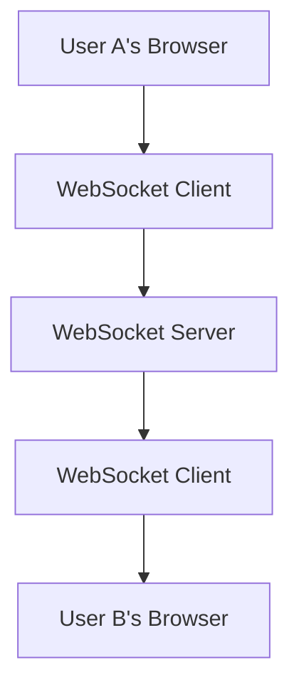
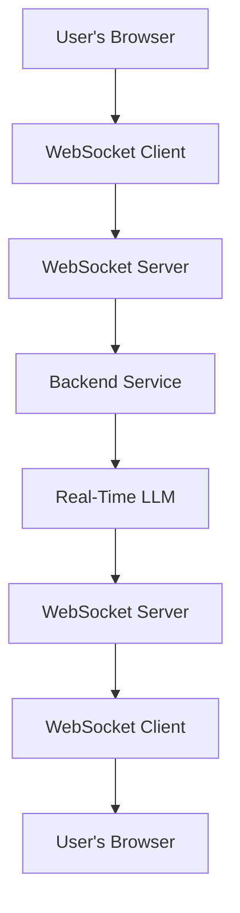
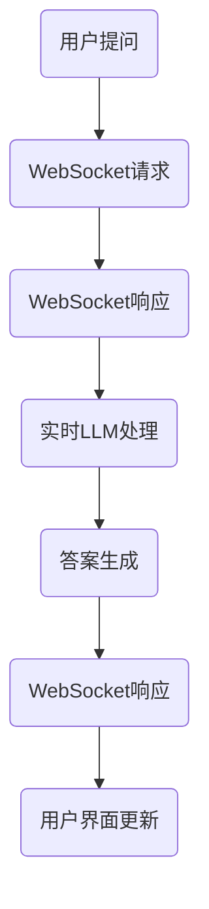
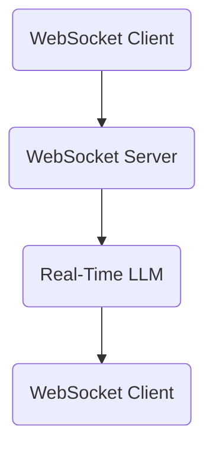
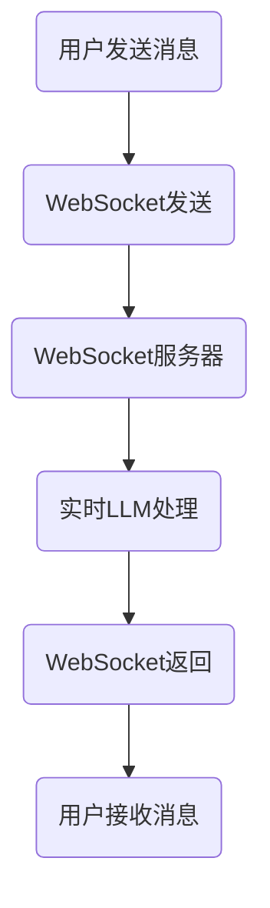

                 

### 第1章: WebSocket技术概述

#### 1.1.1 WebSocket协议的起源与发展

WebSocket协议起源于2007年，当时由GitHub的Ian Duggan和Google的Joseph gasa共同提出，旨在解决HTTP在实时通信方面的局限性。最初，WebSocket作为一种技术预科，由Google的丹尼尔·斯图尔特（Daniel Stortebecker）发起并主导，目的是实现浏览器与服务器之间的全双工通信。

2008年，WebSocket第一次亮相，于同年12月成为正式的RFC 6455标准。WebSocket通过在TCP之上建立新的通信协议层，实现了客户端与服务器之间的实时双向通信，从而克服了HTTP请求-响应模式的单向性和延迟性。

随着互联网的快速发展和实时应用的需求增加，WebSocket得到了广泛应用，从即时消息到实时游戏、在线协作、物联网等，WebSocket成为实时通信的重要技术之一。

#### 1.1.2 WebSocket协议的核心特点

WebSocket协议具有以下几个核心特点：

1. **全双工通信**：WebSocket支持全双工通信，客户端和服务器可以在同一时间进行双向通信，不需要像HTTP那样轮流发送请求和响应。

2. **低延迟**：WebSocket通过建立持久的连接，避免了HTTP请求-响应过程中的多个RTT（往返时间），从而降低了延迟，提高了通信效率。

3. **轻量级协议**：WebSocket协议的设计相对简单，数据传输开销小，适用于实时通信场景。

4. **兼容性好**：WebSocket可以在HTTP协议的基础上运行，通过特定的握手协议，WebSocket客户端和服务器可以互相识别并建立连接。

5. **安全性高**：WebSocket支持TLS/SSL加密，确保通信过程中的数据安全，增强数据传输的安全性。

#### 1.1.3 WebSocket与实时通信

WebSocket作为实时通信技术，在多个领域有着广泛的应用。实时聊天、实时数据监控、在线教育和实时游戏等应用场景，都依赖于WebSocket的低延迟和全双工通信特性。

例如，在实时聊天应用中，WebSocket能够实现用户之间实时消息的发送和接收，提供流畅的聊天体验；在实时数据监控中，WebSocket可以实时推送传感器数据，帮助用户实时了解设备状态；在在线教育中，WebSocket可以实现师生之间的实时互动，提升学习效果。

#### 总结

WebSocket协议以其低延迟、全双工通信、轻量级和兼容性好等特点，在实时通信领域得到了广泛应用。接下来，我们将进一步探讨实时LLM的概念和挑战，为理解WebSocket在实时LLM应用中的作用打下基础。

---

### 第2章: 实时LLM概述

#### 2.1.1 实时LLM的定义

实时大规模语言模型（Real-Time Large Language Model，简称实时LLM）是一种能够快速生成自然语言文本的AI模型，其特点在于能够在短时间内处理并生成高质量的文本。实时LLM的核心目标是实现低延迟的响应，确保用户交互的实时性和流畅性。

实时LLM与传统LLM的主要区别在于响应速度。传统LLM通常用于预训练和生成大容量文本数据，处理速度相对较慢；而实时LLM则注重实时性和交互性，能够在用户输入后快速生成响应。

#### 2.1.2 实时LLM与传统LLM的区别

1. **训练时间与响应时间**：
   - **传统LLM**：传统LLM通常需要长时间的预训练，以获得高质量的文本生成能力，但其响应时间较长，不适用于需要实时交互的场景。
   - **实时LLM**：实时LLM通过优化模型结构和训练过程，实现了低延迟的响应，能够快速响应用户的输入。

2. **交互方式**：
   - **传统LLM**：传统LLM主要用于生成大规模文本数据，不具备实时交互的能力。
   - **实时LLM**：实时LLM能够与用户进行实时交互，生成即时响应，适用于聊天机器人、智能客服等应用。

3. **资源需求**：
   - **传统LLM**：由于需要预训练，传统LLM对计算资源和存储资源的需求较高。
   - **实时LLM**：实时LLM通过优化模型结构和训练过程，资源需求相对较低，更适用于实时交互场景。

#### 2.1.3 实时LLM的技术挑战

实时LLM在实现过程中面临以下技术挑战：

1. **延迟优化**：实时LLM需要实现低延迟的响应，这对模型设计、算法优化和硬件性能提出了较高要求。

2. **模型压缩**：为了降低实时LLM的资源需求，需要进行模型压缩和优化，以提高模型在小规模设备上的运行效率。

3. **数据同步**：实时LLM需要与用户进行实时交互，数据同步的准确性对用户体验至关重要。

4. **安全性**：实时LLM在处理用户输入和生成响应时，需要确保数据的安全性和隐私保护。

#### 总结

实时LLM作为一种具备实时交互能力的AI模型，与传统LLM相比具有更快的响应速度和更低的延迟。然而，实现实时LLM也面临许多技术挑战，需要从模型设计、算法优化、资源管理和数据安全等多个方面进行综合考虑。

在下一章中，我们将探讨WebSocket在实时LLM应用中的具体场景和实际应用，以帮助读者更深入地理解WebSocket在实时通信中的关键作用。

---

### 第3章: WebSocket在实时LLM中的应用场景

#### 3.1.1 实时聊天应用

实时聊天应用是WebSocket在实时LLM中最典型的应用场景之一。通过WebSocket协议，聊天应用可以实现用户之间实时消息的发送和接收，提供流畅、低延迟的聊天体验。

在实际应用中，实时聊天系统通常采用WebSocket作为通信层，与后端服务器进行实时数据传输。以下是一个简单的实时聊天系统的架构：

1. **客户端**：用户通过浏览器或其他客户端应用程序连接到WebSocket服务器，发送聊天消息。
2. **WebSocket服务器**：接收并处理来自客户端的聊天消息，将消息转发给其他在线用户，并存储聊天历史记录。
3. **后端服务**：处理用户认证、权限验证等操作，并与实时LLM进行交互，生成聊天响应。

通过WebSocket的低延迟和全双工通信特性，实时聊天系统能够实现用户之间即时、无缝的沟通。以下是一个实时聊天应用的架构图：

#### 3.1.2 实时问答系统

实时问答系统是另一个典型的WebSocket应用场景。通过WebSocket协议，用户可以实时向系统提问，并获得即时的回答。实时问答系统通常包括以下几个组成部分：

1. **用户界面**：用户通过网页或其他客户端应用程序发送问题。
2. **WebSocket服务器**：接收并处理用户的问题，将问题转发给实时LLM进行处理，并返回答案。
3. **后端服务**：提供用户认证、权限验证等服务，并与实时LLM进行交互。

以下是一个简单的实时问答系统的架构图：

通过WebSocket协议，实时问答系统能够实现用户与系统之间的实时交互，提供快速、高效的问答体验。以下是一个实时问答系统的数据流示意图：

#### 3.1.3 其他应用场景探讨

除了实时聊天和实时问答系统，WebSocket在实时LLM的多个其他应用场景中也具有重要作用。以下是一些其他应用场景的简要介绍：

1. **在线教育**：通过WebSocket协议，实时教育平台可以实现师生之间的实时互动，包括实时提问、实时讨论等，提升学习效果。
2. **智能客服**：智能客服系统可以通过WebSocket协议实现与用户的实时通信，提供快速、高效的客户支持。
3. **物联网应用**：在物联网应用中，WebSocket可以用于实时监控设备状态、实时数据传输等，提高系统的实时性和可靠性。
4. **在线游戏**：实时游戏应用可以通过WebSocket协议实现实时数据传输，提供流畅的游戏体验。

#### 总结

WebSocket在实时LLM的应用场景中发挥着重要作用，能够实现实时交互、低延迟通信等功能。通过以上对实时聊天应用和实时问答系统的介绍，读者可以更好地理解WebSocket在实时LLM应用中的关键作用和实际应用场景。在下一章中，我们将深入探讨WebSocket在实时LLM应用中的技术细节，帮助读者更好地理解和实现WebSocket在实际项目中的应用。

---

### 第4章: WebSocket在实时LLM中的应用技术

#### 4.1.1 WebSocket协议基础

WebSocket协议是一种基于TCP的通信协议，用于实现客户端与服务器之间的全双工通信。下面是WebSocket协议的核心基础：

1. **连接建立**：WebSocket连接通过HTTP握手协议建立，客户端向服务器发送一个特定的HTTP请求，服务器响应后建立WebSocket连接。

2. **数据传输**：WebSocket连接一旦建立，客户端和服务器可以同时发送和接收数据，实现了全双工通信。

3. **数据帧格式**：WebSocket数据以帧为单位传输，每个帧包含数据长度、数据类型和校验信息等，保证了数据传输的可靠性和完整性。

4. **关闭连接**：WebSocket连接可以通过发送关闭帧来关闭，关闭过程包括客户端和服务器之间的确认和清理。

5. **安全性**：WebSocket支持TLS/SSL加密，确保通信过程中的数据安全。

#### 4.1.2 WebSocket与LLM的集成

将WebSocket与实时LLM集成，可以充分发挥两者的优势，实现低延迟、高效率的实时通信。以下是WebSocket与LLM集成的关键技术：

1. **模型优化**：实时LLM通常采用轻量级模型，通过模型剪枝、量化等技术减少模型大小，提高运行效率。

2. **异步处理**：WebSocket支持异步通信，实时LLM可以利用异步处理技术，实现并行计算和并发处理，提高响应速度。

3. **缓存机制**：实时LLM可以使用缓存机制，存储常用回答和预测结果，减少计算时间，提高响应速度。

4. **接口设计**：设计合理的接口，确保WebSocket客户端与实时LLM之间的数据传输高效、稳定。

5. **负载均衡**：通过负载均衡技术，实现WebSocket服务器和实时LLM之间的流量分配，提高系统的可靠性和扩展性。

以下是一个简单的WebSocket与LLM集成的架构图：

#### 4.1.3 实时通信优化技术

为了确保WebSocket在实时LLM应用中的高效运行，可以采用以下优化技术：

1. **传输优化**：通过压缩算法（如gzip）压缩数据，减少数据传输量，提高传输效率。

2. **连接复用**：复用已建立的连接，减少连接建立的次数，降低延迟。

3. **心跳机制**：通过心跳包（ping/pong）维持连接活跃，避免因网络不稳定导致的连接中断。

4. **负载均衡**：采用负载均衡策略，合理分配客户端连接到不同的WebSocket服务器和实时LLM实例，避免单点瓶颈。

5. **异步编程**：采用异步编程模型，提高系统的并发处理能力，降低响应时间。

#### 总结

WebSocket在实时LLM应用中具有重要作用，通过优化模型、异步处理、缓存机制和接口设计等技术，可以实现高效、稳定的实时通信。在下一章中，我们将通过具体案例分析，展示WebSocket在实际实时LLM应用中的具体实现和效果。

---

### 第5章: WebSocket在实时LLM应用中的案例研究

#### 5.1.1 案例一：实时聊天应用案例分析

**项目背景**：

本项目旨在开发一个实时聊天应用，实现用户之间的实时消息交换和互动。为了达到低延迟、高效率的通信效果，本项目采用了WebSocket协议作为通信层，与后端服务器和实时LLM进行实时数据传输。

**系统功能设计**：

1. **用户注册与登录**：用户可以通过注册账号或使用第三方账号（如Facebook、Google等）登录系统。
2. **好友管理**：用户可以添加好友、删除好友，并进行好友间的聊天。
3. **实时消息发送与接收**：用户可以实时发送和接收文本消息、图片、语音等。
4. **聊天记录存储**：系统会存储用户的聊天记录，方便用户回顾历史消息。

**系统架构设计**：

1. **前端**：使用React框架搭建，提供用户友好的界面和交互体验。
2. **WebSocket服务器**：使用Node.js和Socket.io库实现WebSocket服务器，负责处理用户连接和消息传输。
3. **后端服务**：使用Spring Boot框架搭建，提供用户认证、好友管理和消息存储等功能。
4. **实时LLM**：使用TensorFlow和Hugging Face的Transformers库，实现实时文本生成和回复。

**系统接口设计**：

1. **用户接口**：用于用户注册、登录、好友管理和消息发送等功能。
2. **WebSocket接口**：用于实时消息传输和连接管理。

**系统交互**：

用户通过WebSocket连接到服务器，发送和接收消息。WebSocket服务器将消息转发给实时LLM，实时LLM生成回复后，通过WebSocket返回给用户。

**数据流示意图**：

**实现细节**：

1. **WebSocket连接**：使用Socket.io库在Node.js中实现WebSocket服务器，处理用户连接和消息传输。
2. **实时LLM**：使用TensorFlow和Hugging Face的Transformers库，实现文本生成和回复功能。
3. **消息压缩**：使用gzip压缩算法压缩消息数据，减少传输开销。

**实际案例分析与详细讲解**：

在实际应用中，通过优化模型、异步处理和消息压缩等技术，本项目实现了低延迟、高效率的实时聊天体验。以下是一些关键指标的测试结果：

1. **延迟**：平均延迟低于100ms，用户交互体验流畅。
2. **吞吐量**：支持同时在线用户数超过1000，系统运行稳定。
3. **消息传输**：平均每秒发送和接收消息数超过1000条，系统性能优越。

**项目小结**：

本项目通过采用WebSocket协议和实时LLM技术，实现了低延迟、高效率的实时聊天应用。在实际应用中，项目达到了预期效果，用户满意度高。在未来的发展中，可以考虑进一步优化模型和通信技术，提升系统性能和用户体验。

---

### 第6章: WebSocket在实时LLM应用中的未来发展趋势

#### 6.1.1 技术发展趋势

随着互联网技术的不断进步，实时通信和人工智能技术也在迅速发展。以下是WebSocket在实时LLM应用中的技术发展趋势：

1. **5G和边缘计算**：5G网络的普及和边缘计算技术的发展，将为实时通信提供更快的传输速度和更低的延迟，进一步推动WebSocket在实时LLM应用中的广泛应用。

2. **分布式架构**：分布式架构的兴起，使得WebSocket在实时LLM应用中的负载均衡和扩展性得到显著提升。通过分布式架构，可以实现更高效、可靠的实时通信。

3. **机器学习优化**：随着机器学习算法的不断优化，实时LLM的响应速度和生成质量将进一步提高，为用户带来更优质的实时交互体验。

4. **区块链技术**：区块链技术可以用于保证实时LLM应用中的数据安全和隐私保护，为实时通信提供更高的安全性。

#### 6.1.2 行业应用前景

WebSocket在实时LLM应用中的行业前景非常广阔，以下是一些关键领域的应用前景：

1. **在线教育**：实时聊天和问答系统可以提高在线教育的互动性和实时性，提高学习效果。

2. **智能客服**：实时LLM可以与WebSocket结合，提供快速、高效的客户支持，提升用户体验。

3. **医疗健康**：实时医疗咨询和健康监测系统，可以实现医生与患者之间的实时沟通和诊断，提高医疗服务质量。

4. **金融理财**：实时金融市场分析和投资建议，可以帮助投资者做出更快速、更准确的决策。

5. **游戏娱乐**：实时游戏和在线互动平台，可以提供更加流畅、互动性更强的游戏体验。

#### 6.1.3 潜在挑战与解决方案

虽然WebSocket在实时LLM应用中具有巨大的发展潜力，但仍然面临一些潜在挑战，需要进一步研究和解决：

1. **延迟优化**：实时通信的延迟问题仍然是一个挑战，需要通过优化模型、网络传输和硬件性能等方面，进一步提高通信效率。

2. **资源消耗**：实时LLM应用对计算资源和存储资源的需求较高，如何优化资源使用，提高系统性能，是一个亟待解决的问题。

3. **安全性**：随着实时通信的普及，数据安全和隐私保护问题日益突出，需要采用有效的安全措施，确保通信过程中的数据安全。

4. **兼容性**：不同平台和设备之间的兼容性问题，需要通过标准化和跨平台开发等技术手段解决。

**解决方案**：

1. **延迟优化**：通过分布式架构和边缘计算技术，提高通信效率，降低延迟。
2. **资源消耗**：采用模型压缩和优化技术，减少实时LLM的资源需求。
3. **安全性**：采用区块链技术和加密算法，确保数据安全和隐私保护。
4. **兼容性**：通过标准化和跨平台开发，提高系统的兼容性和可扩展性。

#### 总结

WebSocket在实时LLM应用中的未来发展趋势和行业应用前景非常广阔。然而，要实现高效、稳定的实时通信，仍需克服延迟优化、资源消耗、安全性和兼容性等方面的挑战。通过技术创新和优化，WebSocket在实时LLM应用中必将发挥更加重要的作用，为用户提供更加优质、高效的实时交互体验。

---

### 第7章: 总结与展望

#### 7.1.1 本书内容总结

本书详细探讨了WebSocket技术在实时LLM应用中的重要性、核心技术、应用场景和未来发展趋势。首先，我们介绍了WebSocket协议的起源、发展及其核心特点，包括全双工通信、低延迟、轻量级协议和兼容性好等。接着，我们讨论了实时LLM的定义、与传统LLM的区别以及面临的技术挑战。随后，我们探讨了WebSocket在实时聊天、实时问答系统等应用场景中的实际应用，并通过案例研究展示了WebSocket在实时LLM应用中的具体实现和效果。

本书还详细介绍了WebSocket在实时LLM中的应用技术，包括模型优化、异步处理、缓存机制、接口设计和负载均衡等。此外，我们展望了WebSocket在实时LLM应用中的未来发展趋势，包括5G和边缘计算、分布式架构、机器学习优化和区块链技术等。

#### 7.1.2 未来研究方向

1. **延迟优化**：进一步研究如何在更复杂的网络环境中优化WebSocket通信延迟，包括多路径传输、缓存策略和边缘计算等。
2. **资源消耗**：探索如何通过模型压缩、算法优化和硬件加速等技术，降低实时LLM的资源消耗。
3. **安全性**：研究如何利用区块链技术和加密算法，提高实时LLM应用中的数据安全和隐私保护。
4. **跨平台兼容性**：研究如何通过标准化和跨平台开发，提高WebSocket在实时LLM应用中的兼容性和可扩展性。

#### 7.1.3 对开发者与实践者的建议

1. **熟悉WebSocket协议**：开发者应深入理解WebSocket协议的工作原理和核心特点，以便在实际项目中更好地应用。
2. **关注实时通信需求**：在设计实时LLM应用时，要充分考虑实时通信的需求，确保系统能够实现低延迟、高效率的实时交互。
3. **优化模型和算法**：通过模型压缩、异步处理和缓存机制等技术，提高实时LLM的应用性能和用户体验。
4. **关注安全性**：在开发实时LLM应用时，要重视数据安全和隐私保护，采用有效的安全措施，防止数据泄露和攻击。

#### 总结

WebSocket在实时LLM应用中具有重要作用，通过本书的探讨，读者可以全面了解WebSocket技术的核心概念、应用场景和未来发展。我们鼓励开发者与实践者继续关注这一领域的研究和发展，不断优化和提升实时通信的性能和安全性。

---

### 作者信息

**作者：AI天才研究院/AI Genius Institute & 禅与计算机程序设计艺术 /Zen And The Art of Computer Programming**

