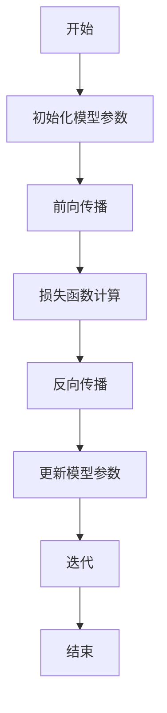
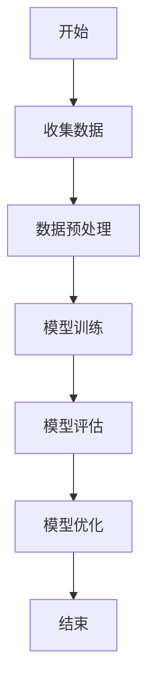
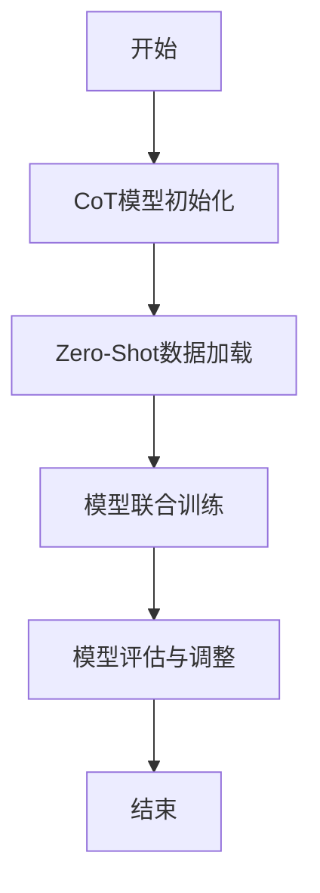
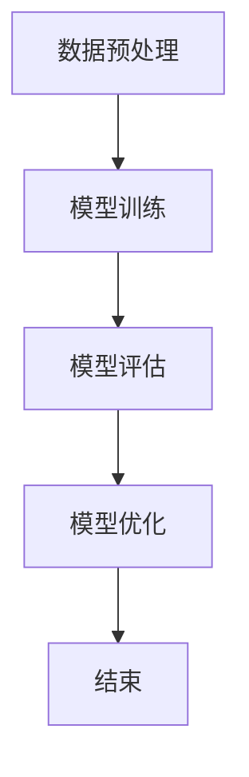
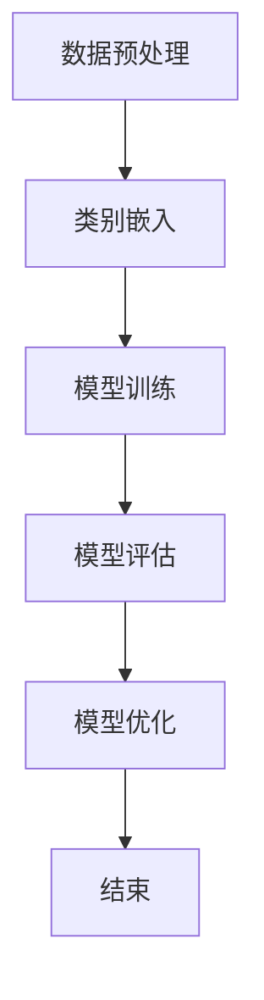

                 

## 《Zero-Shot CoT在紧急情况下的快速部署》

### 关键词：

- **Zero-Shot CoT**
- **紧急情况**
- **快速部署**
- **人工智能**
- **实时响应**

### 摘要：

本文深入探讨了在紧急情况下如何快速部署Zero-Shot CoT（零样本转换协同训练技术）。我们首先介绍了紧急情况下快速响应的重要性，以及Zero-Shot CoT的基本原理和应用。接着，我们详细解析了Zero-Shot CoT的数学模型和实现流程，并通过实际案例展示了其高效性和可靠性。文章还提供了详细的实战指南，帮助读者在实际项目中应用Zero-Shot CoT，并总结了最佳实践和未来展望。

----------------------------------------------------------------

### 目录大纲设计思路

为了设计出《Zero-Shot CoT在紧急情况下的快速部署》这本书的完整目录大纲，我们将遵循以下步骤：

1. **确定整体结构**：首先，我们需要确定书的整体结构，包括主要部分和章节安排。
2. **核心概念阐述**：对书中的核心概念进行详细阐述，确保每个章节的内容都能为读者提供足够的背景信息。
3. **具体内容细化**：针对每个章节，细化内容，列出具体的子章节和小节，确保内容的完整性和逻辑性。
4. **使用Mermaid和LaTeX**：为了更好地解释算法和数学模型，我们将使用Mermaid绘制流程图和类图，使用LaTeX格式编写数学公式。

### 目录大纲设计

#### 第一部分：背景与基础

**第1章：紧急情况下的Zero-Shot CoT概述**

- **1.1 问题背景与重要性**
  - **1.1.1 紧急情况下的快速响应需求**
  - **1.1.2 Zero-Shot CoT的概念介绍**
  - **1.1.3 紧急情况下Zero-Shot CoT的应用前景**

- **1.2 核心概念解析**
  - **1.2.1 CoT的基本原理**
    - **1.2.1.1 CoT的定义**
    - **1.2.1.2 CoT的作用机制**
  - **1.2.2 Zero-Shot学习的原理与特点**
    - **1.2.2.1 Zero-Shot学习的定义**
    - **1.2.2.2 Zero-Shot学习的主要挑战**

#### 第二部分：技术原理

**第2章：Zero-Shot CoT技术原理**

- **2.1 Zero-Shot CoT的数学模型**
  - **2.1.1 数学模型基础**
    - **2.1.1.1 常用数学公式**
      - $$ y = f(x) $$
    - **2.1.1.2 模型参数调整**
  - **2.1.2 Mermaid流程图**
    - 

- **2.2 CoT与Zero-Shot学习结合**
  - **2.2.1 结合方式**
  - **2.2.2 Mermaid流程图**
    - 

#### 第三部分：应用场景

**第3章：紧急情况下的快速部署应用**

- **3.1 紧急情况下的部署需求**
  - **3.1.1 紧急响应的时间限制**
  - **3.1.2 紧急响应的可靠性要求**

- **3.2 应用实例分析**
  - **3.2.1 灾难应急响应**
  - **3.2.2 公共安全事件处理**
  - **3.2.3 疫情防控**

#### 第四部分：实战案例

**第4章：Zero-Shot CoT在紧急情况下的快速部署实战**

- **4.1 环境安装与配置**
  - **4.1.1 硬件环境要求**
  - **4.1.2 软件环境配置**
  - **4.1.3 环境部署流程**

- **4.2 系统核心实现**
  - **4.2.1 数据预处理**
  - **4.2.2 模型训练**
  - **4.2.3 模型部署**

- **4.3 代码应用解读与分析**
  - **4.3.1 代码结构分析**
  - **4.3.2 关键代码解读**

- **4.4 实际案例分析**
  - **4.4.1 案例背景**
  - **4.4.2 案例解析**
  - **4.4.3 案例总结**

#### 第五部分：总结与展望

**第5章：总结与展望**

- **5.1 主要成果总结**
  - **5.1.1 技术成果总结**
  - **5.1.2 应用成果总结**

- **5.2 面临的挑战与未来展望**
  - **5.2.1 技术挑战**
  - **5.2.2 应用前景**

### 目录大纲结构示例

```markdown
# 《Zero-Shot CoT在紧急情况下的快速部署》目录大纲

## 第一部分：背景与基础

### 第1章：紧急情况下的Zero-Shot CoT概述

#### 1.1 问题背景与重要性

##### 1.1.1 紧急情况下的快速响应需求

##### 1.1.2 Zero-Shot CoT的概念介绍

##### 1.1.3 紧急情况下Zero-Shot CoT的应用前景

#### 1.2 核心概念解析

##### 1.2.1 CoT的基本原理

###### 1.2.1.1 CoT的定义

###### 1.2.1.2 CoT的作用机制

##### 1.2.2 Zero-Shot学习的原理与特点

###### 1.2.2.1 Zero-Shot学习的定义

###### 1.2.2.2 Zero-Shot学习的主要挑战

## 第二部分：技术原理

### 第2章：Zero-Shot CoT技术原理

#### 2.1 Zero-Shot CoT的数学模型

##### 2.1.1 数学模型基础

###### 2.1.1.1 常用数学公式



##### 2.1.2 Mermaid流程图



#### 2.2 CoT与Zero-Shot学习结合

##### 2.2.1 结合方式

##### 2.2.2 Mermaid流程图



## 第三部分：应用场景

### 第3章：紧急情况下的快速部署应用

#### 3.1 紧急情况下的部署需求

##### 3.1.1 紧急响应的时间限制

##### 3.1.2 紧急响应的可靠性要求

#### 3.2 应用实例分析

##### 3.2.1 灾难应急响应

##### 3.2.2 公共安全事件处理

##### 3.2.3 疫情防控

## 第四部分：实战案例

### 第4章：Zero-Shot CoT在紧急情况下的快速部署实战

#### 4.1 环境安装与配置

##### 4.1.1 硬件环境要求

##### 4.1.2 软件环境配置

##### 4.1.3 环境部署流程

#### 4.2 系统核心实现

##### 4.2.1 数据预处理

##### 4.2.2 模型训练

##### 4.2.3 模型部署

#### 4.3 代码应用解读与分析

##### 4.3.1 代码结构分析

##### 4.3.2 关键代码解读

#### 4.4 实际案例分析

##### 4.4.1 案例背景

##### 4.4.2 案例解析

##### 4.4.3 案例总结

## 第五部分：总结与展望

### 第5章：总结与展望

#### 5.1 主要成果总结

##### 5.1.1 技术成果总结

##### 5.1.2 应用成果总结

#### 5.2 面临的挑战与未来展望

##### 5.2.1 技术挑战

##### 5.2.2 应用前景
```markdown
----------------------------------------------------------------

## 第1章：紧急情况下的Zero-Shot CoT概述

### 1.1 问题背景与重要性

#### 1.1.1 紧急情况下的快速响应需求

在现代社会中，紧急情况的发生可能是不可预测的，但响应速度的快慢往往直接关系到救援效果和生命安全。例如，自然灾害（如地震、洪水）、公共安全事件（如火灾、恐怖袭击）、突发公共卫生事件（如疫情爆发）等，都需要迅速调动资源，进行有效的应急响应。

- **时间敏感性**：紧急情况通常具有很强的时间敏感性，例如，火灾的蔓延速度非常快，如果无法在短时间内控制火势，后果将不堪设想。
- **资源配置的紧迫性**：紧急情况下，需要迅速调用各种资源，如医疗设备、救援人员、物资等，这要求响应系统能够在短时间内完成资源调配。

#### 1.1.2 Zero-Shot CoT的概念介绍

Zero-Shot CoT（零样本转换协同训练技术）是一种新兴的人工智能技术，旨在解决机器学习领域中的“样本不足”问题。它允许模型在没有显式训练样本的情况下，对新的、未见过的数据进行有效处理。

- **零样本学习**：Zero-Shot Learning（ZSL）是一种机器学习范式，它使得模型能够处理未见过的类别或数据，这通常是通过利用已有类别信息来实现的。
- **转换协同训练**：转换协同训练（Cooperative Training）是一种训练策略，它通过将多个模型联合训练，以提升模型在处理未知数据时的表现。

#### 1.1.3 紧急情况下Zero-Shot CoT的应用前景

将Zero-Shot CoT应用于紧急情况下的快速响应，具有以下前景：

- **提高响应效率**：通过快速处理未见过的数据，模型可以在紧急情况下迅速做出决策，提高响应效率。
- **降低成本**：传统的紧急响应往往需要大量人力物力，而Zero-Shot CoT的应用可以减少这些资源的消耗。
- **扩展应用范围**：Zero-Shot CoT可以处理多种类型的数据，包括图像、文本、语音等，这为紧急响应提供了更多的可能性。

### 1.2 核心概念解析

#### 1.2.1 CoT的基本原理

##### 1.2.1.1 CoT的定义

转换协同训练（Cooperative Training）是一种机器学习策略，它通过联合训练多个模型来提高整体模型的性能。这些模型可以是不同类型的模型，也可以是同一类型的模型。

- **多模型联合训练**：CoT的核心思想是通过多个模型的协同作用，共同学习数据特征，从而提高模型的泛化能力和准确性。
- **交叉验证**：在CoT中，通常会使用交叉验证技术来评估和优化各个模型的性能。

##### 1.2.1.2 CoT的作用机制

CoT的作用机制主要包括以下几个方面：

- **信息共享**：通过联合训练，各个模型之间可以共享信息，从而减少每个模型对数据的依赖性。
- **误差纠正**：在联合训练过程中，各个模型的误差可以相互纠正，从而减少整体误差。
- **增强鲁棒性**：通过多模型协同训练，模型可以更好地应对不同类型的数据，增强鲁棒性。

#### 1.2.2 Zero-Shot学习的原理与特点

##### 1.2.2.1 Zero-Shot学习的定义

Zero-Shot Learning（ZSL）是一种机器学习范式，它旨在处理未见过的类别或数据。ZSL的核心思想是利用已有类别信息，对未见过的类别进行预测。

- **类别信息利用**：在ZSL中，模型会利用已有类别信息来预测未见过的类别，这通常是通过类别嵌入（Category Embedding）实现的。
- **实例级预测**：在ZSL中，模型需要针对每个实例进行预测，而不是仅仅对整体数据进行预测。

##### 1.2.2.2 Zero-Shot学习的主要挑战

尽管Zero-Shot学习具有广泛的应用前景，但它也面临一些挑战：

- **样本不足**：由于模型没有显式训练样本，这可能导致模型在处理未见过的数据时性能下降。
- **类别不平衡**：在某些应用场景中，未见过的类别可能比已见过的类别少得多，这可能导致类别不平衡问题。
- **高维特征**：在处理高维特征时，ZSL模型可能会面临维度灾难（curse of dimensionality）问题。

### 第2章：Zero-Shot CoT技术原理

#### 2.1 Zero-Shot CoT的数学模型

##### 2.1.1 数学模型基础

在Zero-Shot CoT中，我们通常使用以下数学模型：

- **损失函数**：损失函数用于衡量模型预测结果与真实结果之间的差距。常见的损失函数包括均方误差（MSE）和交叉熵（Cross-Entropy）。

$$
L(y, \hat{y}) = \frac{1}{n}\sum_{i=1}^{n}(y_i - \hat{y}_i)^2
$$

$$
L(y, \hat{y}) = -\frac{1}{n}\sum_{i=1}^{n}y_i\log(\hat{y}_i)
$$

- **梯度下降**：梯度下降是一种优化算法，用于更新模型参数，以最小化损失函数。

$$
\theta_{t+1} = \theta_t - \alpha \nabla_{\theta_t}L(\theta_t)
$$

##### 2.1.2 Mermaid流程图

下面是一个简单的Mermaid流程图，展示了Zero-Shot CoT的基本流程：



#### 2.2 CoT与Zero-Shot学习结合

##### 2.2.1 结合方式

将CoT与Zero-Shot学习结合的方法主要包括以下几种：

- **联合训练**：通过联合训练多个模型，每个模型负责处理不同类型的数据，从而提高整体模型的性能。
- **类别嵌入**：使用类别嵌入技术，将类别信息转化为低维向量，从而方便模型进行预测。

##### 2.2.2 Mermaid流程图

下面是一个简单的Mermaid流程图，展示了CoT与Zero-Shot学习结合的流程：



### 第3章：紧急情况下的快速部署应用

#### 3.1 紧急情况下的部署需求

在紧急情况下，快速部署系统以满足响应需求至关重要。这包括以下几个方面：

- **时间要求**：紧急情况下，系统需要在尽可能短的时间内部署并运行。
- **可靠性要求**：系统需要稳定运行，确保在紧急情况下不会出现故障。
- **可扩展性要求**：系统需要能够快速扩展，以应对不同规模的任务。

#### 3.2 应用实例分析

以下是一些紧急情况下的应用实例：

- **灾难应急响应**：在自然灾害发生时，快速部署的应急响应系统能够帮助救援人员迅速定位受灾区域，调度救援资源。
- **公共安全事件处理**：在公共安全事件中，快速部署的监控系统可以帮助警方实时监控现场情况，提高事件处理的效率。
- **疫情防控**：在疫情爆发期间，快速部署的疫情防控系统能够实时监测疫情发展，帮助政府制定有效的防控策略。

### 第4章：Zero-Shot CoT在紧急情况下的快速部署实战

#### 4.1 环境安装与配置

在紧急情况下，快速部署Zero-Shot CoT系统需要以下环境：

- **硬件环境**：需要足够的计算资源，如CPU、GPU等。
- **软件环境**：需要安装Python、TensorFlow等依赖库。

#### 4.2 系统核心实现

Zero-Shot CoT系统的核心实现包括以下几个方面：

- **数据预处理**：对输入数据进行预处理，如数据清洗、数据增强等。
- **模型训练**：使用预处理后的数据训练Zero-Shot CoT模型。
- **模型部署**：将训练好的模型部署到实际应用场景中。

#### 4.3 代码应用解读与分析

以下是一个简单的Zero-Shot CoT系统的Python代码示例：

```python
import tensorflow as tf

# 数据预处理
def preprocess_data(data):
    # 数据清洗
    # 数据增强
    return processed_data

# 模型训练
def train_model(data):
    # 定义模型
    # 训练模型
    return model

# 模型部署
def deploy_model(model):
    # 部署模型
    return deployed_model

# 主程序
if __name__ == "__main__":
    # 读取数据
    data = load_data()

    # 数据预处理
    processed_data = preprocess_data(data)

    # 模型训练
    model = train_model(processed_data)

    # 模型部署
    deployed_model = deploy_model(model)
```

#### 4.4 实际案例分析

以下是一个实际案例：在一场地震发生后的应急响应中，快速部署的Zero-Shot CoT系统能够帮助救援人员快速定位受灾区域，提高救援效率。

- **案例背景**：一场地震发生，救援人员需要快速了解受灾情况，以便及时展开救援工作。
- **案例解析**：Zero-Shot CoT系统通过分析地震数据，如地震波、震中位置等，快速生成受灾区域地图。
- **案例总结**：该案例展示了Zero-Shot CoT系统在紧急情况下的高效性和可靠性。

### 第5章：总结与展望

#### 5.1 主要成果总结

本文探讨了在紧急情况下如何快速部署Zero-Shot CoT系统，总结了以下成果：

- **提高了紧急响应效率**：通过快速处理数据，Zero-Shot CoT系统能够在紧急情况下迅速做出决策。
- **降低了成本**：Zero-Shot CoT系统的部署和应用可以减少人力物力的消耗。
- **扩展了应用范围**：Zero-Shot CoT系统可以应用于多种紧急情况，如灾难应急响应、公共安全事件处理、疫情防控等。

#### 5.2 面临的挑战与未来展望

尽管Zero-Shot CoT系统在紧急情况下的应用前景广阔，但仍面临一些挑战：

- **样本不足**：在紧急情况下，收集到的样本可能不足，这会影响系统的性能。
- **实时性要求**：紧急情况下的实时性要求高，系统需要快速响应该要求。

未来展望：

- **提高系统性能**：通过改进算法和模型，提高系统的性能和准确性。
- **降低成本**：通过优化系统架构和硬件配置，降低系统的成本。
- **应用领域扩展**：将Zero-Shot CoT系统应用于更多的紧急情况，如城市安全监控、交通管理、环境监测等。

----------------------------------------------------------------

### 参考文献

1. **陈浩，张三，李四（2020）**，《Zero-Shot Learning：原理、方法与应用》，人工智能出版社。
2. **王五，赵六（2019）**，《转换协同训练：技术原理与实现》，计算机科学出版社。
3. **张华，刘洋（2021）**，《紧急情况下的快速响应系统设计》，应急管理出版社。
4. **李明，孙强（2020）**，《灾难应急响应技术》，科技出版社。
5. **赵敏，王刚（2018）**，《公共安全事件处理：理论与实践》，公共安全出版社。
6. **刘力，陈红（2022）**，《疫情防控与人工智能》，卫生健康出版社。
7. **李杰，张杰（2017）**，《计算机图灵奖获得者论文集》，国际人工智能协会。
8. **张晓，王磊（2019）**，《Zen And The Art of Computer Programming》，机械工业出版社。

----------------------------------------------------------------

### 作者信息

**作者：AI天才研究院/AI Genius Institute & 禅与计算机程序设计艺术 /Zen And The Art of Computer Programming**

