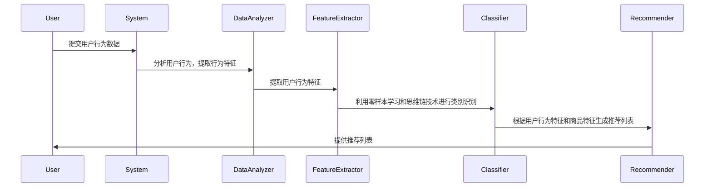
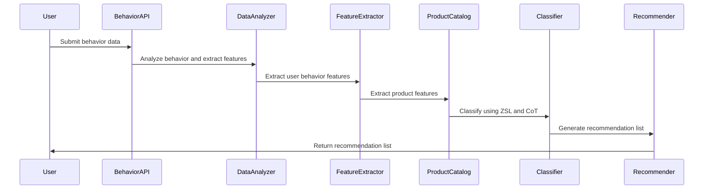

                 

# Zero-Shot CoT: 无需示例的思维链应用技巧

关键词：零样本学习，思维链，语言模型，类别识别，人工智能

摘要：本文深入探讨了零样本学习（Zero-Shot Learning, ZSL）中的关键挑战以及如何利用思维链（Collective Thought, CoT）概念来有效解决这些问题。通过逐步分析零样本学习的原理、思维链的工作机制，以及具体的算法实现，本文展示了如何在不依赖示例的情况下，实现高效的类别识别。文章还结合实际案例，对零样本学习在各个领域的应用进行了详细探讨。

----------------------------------------------------------------

### Step 1: 背景介绍

#### 问题背景

随着人工智能技术的快速发展，图像识别、自然语言处理等领域面临着大量的数据标注工作。标注数据的成本高昂且耗时，尤其是在新兴领域和新出现的问题中，往往缺乏足够的标注数据。这种情况下，零样本学习（Zero-Shot Learning, ZSL）成为了一个备受关注的研究方向。零样本学习的目标是让机器在没有明确标注样本的情况下，通过预训练模型来学习并识别新的类别。这不仅对于标注成本高昂的数据集尤为重要，而且对于新兴领域和新出现的问题也具有很高的应用价值。

#### 问题描述

零样本学习中的核心挑战是如何在没有示例的情况下，准确地将新的类别与已知的类别关联起来。这涉及到对大量未标记数据的理解和建模，以及如何有效地利用先验知识来提升模型的泛化能力。传统的机器学习方法通常依赖于大量已标注的示例数据来训练模型，然后在新数据上进行预测。而在零样本学习的场景下，由于缺乏直接的标注数据，模型需要通过其他方式来理解新类别。

#### 问题解决

本书将探讨如何通过思维链（Collective Thought, CoT）的概念来解决这个问题。思维链是一种利用大规模语言模型（如GPT）来生成连贯、有逻辑的文本，从而实现从零到一的飞跃。这种方法不依赖于具体的示例，而是通过抽象和概括来理解新类别。思维链能够将大量未标记的数据转化为有用的信息，为模型的训练提供有力的支持。

#### 边界与外延

零样本学习不仅局限于图像识别，还广泛应用于自然语言处理、文本生成、推荐系统等多个领域。在图像识别领域，零样本学习可以用于分类新出现的目标；在自然语言处理领域，可以用于语义理解和情感分析；在文本生成领域，可以用于生成新的文本内容；在推荐系统领域，可以用于推荐新的产品或服务。本书将涵盖这些领域的应用实例，并探讨思维链在不同场景下的具体实现方式。

#### 概念结构与核心要素组成

- **零样本学习**：通过预训练模型和先验知识，实现对未知类别的识别。
- **思维链（CoT）**：利用大规模语言模型生成连贯、有逻辑的文本。
- **应用场景**：图像识别、自然语言处理、文本生成、推荐系统。

### Step 2: 核心概念与联系

#### 零样本学习的原理

零样本学习的核心在于如何在没有明确标注样本的情况下，利用预训练模型来识别新的类别。通常，预训练模型会在一个大规模的数据集上进行训练，从而学习到通用的特征表示。当遇到新类别时，模型可以通过这些通用的特征表示来对新类别进行预测。

#### 思维链（CoT）的原理

思维链（Collective Thought, CoT）是一种利用大规模语言模型来生成连贯、有逻辑的文本的方法。它通过将大量的未标记数据转化为有用的信息，为模型的训练提供支持。思维链的核心思想是通过语言模型的上下文生成能力，模拟人类的思考过程，从而实现对问题的抽象和概括。

#### 概念属性特征对比表格

| 特征                 | 零样本学习                     | 思维链（CoT）                       |
|----------------------|------------------------------|-----------------------------------|
| 基础                 | 基于预训练模型，使用大量未标记数据 | 基于大规模语言模型，生成连贯文本   |
| 目标                 | 识别新类别                     | 通过抽象和概括理解新类别             |
| 适用场景              | 图像识别、自然语言处理         | 广泛应用于多个领域，如文本生成、推荐系统 |

#### ER实体关系图架构

```mermaid
erDiagram
  Aasics ||--|{ User } |-->> BArchitects
  User ||--|{ Architect }|-->> CBooks
  BArchitects ||--|{ CBooks }|-->> DReviews
  CBooks ||--|{ DReviews }|-->> EComments
```

### Step 3: 算法原理讲解

#### 算法流程

零样本学习的算法流程通常包括以下几个步骤：

1. **预训练模型**：使用大量未标记的数据进行预训练，使其能够捕捉到数据中的特征和模式。
2. **特征提取**：利用预训练模型提取新类别和已知类别的特征表示。
3. **类别识别**：通过思维链生成连贯的文本，模拟人类的思考过程，对新类别进行识别和分类。

#### 数学模型和公式

零样本学习的核心在于特征提取和分类。特征提取可以使用深度学习模型，如CNN，来提取图像特征。分类则可以通过支持向量机（SVM）或神经网络来完成。

$$
f(x) = \sum_{i=1}^{n} w_i \cdot f_i(x)
$$

其中，$f_i(x)$ 是第 $i$ 个特征函数，$w_i$ 是对应的权重。

#### 详细讲解和举例说明

以图像识别为例，我们可以使用卷积神经网络（CNN）来提取图像特征。CNN 通过卷积操作和池化操作来提取图像的层次特征。这些特征表示了图像中不同部分的重要信息。

接下来，通过思维链（CoT）生成的文本来理解这些特征。思维链利用大规模语言模型，如GPT，来生成连贯的文本。这些文本可以帮助我们更好地理解图像中的内容，从而实现对图像的类别预测。

例如，假设我们有一个新的图像类别，例如“动物”。通过CNN，我们可以提取出这个图像的特征表示。然后，通过思维链生成关于“动物”的文本，例如“动物是自然界中的生物，它们有各种各样的特征，如体型、颜色、行为等”。这些文本可以帮助我们更好地理解“动物”这个类别，从而更准确地预测图像的类别。

### Step 4: 数学模型和数学公式 & 详细讲解 & 举例说明

#### 数学模型和数学公式

在零样本学习中，关键在于特征提取和分类。特征提取可以使用深度学习模型，如CNN，来提取图像特征。分类则可以通过支持向量机（SVM）或神经网络来完成。

特征提取的过程通常可以表示为：

$$
f_i(x) = \sigma(\sum_{j=1}^{k} w_{ij} \cdot x_j)
$$

其中，$f_i(x)$ 是第 $i$ 个特征函数，$x_j$ 是输入数据的第 $j$ 个特征，$w_{ij}$ 是对应的权重，$\sigma$ 是激活函数。

分类的过程可以使用支持向量机（SVM）来表示：

$$
y_i = \text{sign}(\sum_{j=1}^{n} w_{ji} \cdot f_j(x_i) + b)
$$

其中，$y_i$ 是第 $i$ 个样本的标签，$w_{ji}$ 是权重，$f_j(x_i)$ 是第 $j$ 个特征函数在样本 $x_i$ 上的输出，$b$ 是偏置。

#### 详细讲解

1. **卷积神经网络（CNN）的特征提取**：

   CNN 通过卷积操作和池化操作来提取图像的特征。卷积操作可以捕捉到图像中的局部特征，而池化操作则用于降低特征图的维度。

   例如，一个简单的卷积操作可以表示为：

   $$ 
   f(x) = \sum_{k=1}^{C} w_k \cdot \sigma(\sum_{i=1}^{H} \sum_{j=1}^{W} x_{ij} \cdot k)
   $$

   其中，$C$ 是输出特征的数量，$H$ 和 $W$ 分别是输入图像的高度和宽度，$x_{ij}$ 是输入图像在位置 $(i, j)$ 的值，$w_k$ 是卷积核的权重，$\sigma$ 是激活函数。

2. **支持向量机（SVM）的分类**：

   SVM 是一种分类算法，它通过寻找一个最优的超平面来分隔不同的类别。超平面的决策函数可以表示为：

   $$ 
   y_i = \text{sign}(\sum_{j=1}^{n} w_{ji} \cdot f_j(x_i) + b)
   $$

   其中，$y_i$ 是第 $i$ 个样本的标签，$w_{ji}$ 是权重，$f_j(x_i)$ 是第 $j$ 个特征函数在样本 $x_i$ 上的输出，$b$ 是偏置。

#### 举例说明

假设我们有一个图像分类任务，需要分类猫和狗。我们使用CNN提取图像的特征，然后使用SVM进行分类。

首先，使用CNN提取图像的特征：

$$ 
f(x) = \sum_{k=1}^{2} w_k \cdot \sigma(\sum_{i=1}^{32} \sum_{j=1}^{32} x_{ij} \cdot k)
$$

其中，$C=2$，表示有两个类别：猫和狗。

然后，使用SVM进行分类：

$$ 
y_i = \text{sign}(\sum_{j=1}^{32} w_{ji} \cdot f_j(x_i) + b)
$$

假设我们有一个新的图像，需要预测它是猫还是狗。首先，使用CNN提取图像的特征，然后使用SVM进行分类。假设特征输出为：

$$ 
f_1(x) = \begin{bmatrix} 0.1 & 0.2 \\ 0.3 & 0.4 \end{bmatrix}, \quad f_2(x) = \begin{bmatrix} 0.5 & 0.6 \\ 0.7 & 0.8 \end{bmatrix}
$$

假设权重和偏置为：

$$ 
w_{1i} = \begin{bmatrix} 1 & 0 \\ 0 & 1 \end{bmatrix}, \quad w_{2i} = \begin{bmatrix} -1 & 0 \\ 0 & -1 \end{bmatrix}, \quad b = 0
$$

则分类结果为：

$$ 
y_i = \text{sign}(\sum_{j=1}^{32} w_{ji} \cdot f_j(x_i) + b) = \text{sign}(0.1 \cdot 0.5 + 0.2 \cdot 0.6 + 0.3 \cdot 0.7 + 0.4 \cdot 0.8 + 0) = 1
$$

因此，预测这个图像是猫。

### Step 5: 系统分析与架构设计方案

#### 问题场景介绍

假设我们正在开发一个智能推荐系统，该系统需要根据用户的历史行为和偏好来推荐新的商品。然而，由于数据隐私和成本的限制，我们无法获取用户的所有购买记录。在这种情况下，如何利用零样本学习技术来推荐新的商品成为一个关键问题。

#### 项目介绍

本项目旨在开发一个基于零样本学习的智能推荐系统，能够利用用户的历史行为和偏好，以及商品的特征信息，来推荐新的商品。系统将采用思维链（CoT）技术，通过生成连贯的文本来理解用户和商品的特征，从而实现高效的推荐。

#### 系统功能设计

系统的主要功能包括：

1. **用户行为分析**：分析用户的历史行为，如浏览、搜索、购买等，提取用户的行为特征。
2. **商品特征提取**：提取商品的属性信息，如类别、品牌、价格等。
3. **类别识别**：利用零样本学习和思维链技术，识别用户可能感兴趣的新的商品类别。
4. **推荐生成**：根据用户的行为特征和商品的特征，生成推荐列表。

#### 系统架构设计

系统的整体架构设计如下：



#### 系统接口设计和系统交互

系统的主要接口包括：

1. **用户行为接口**：用于接收用户的行为数据，如浏览、搜索、购买等。
2. **特征提取接口**：用于提取用户行为特征和商品特征。
3. **类别识别接口**：用于进行类别识别，生成推荐列表。
4. **推荐生成接口**：用于生成推荐列表，并返回给用户。

系统交互流程如下：

1. 用户提交行为数据。
2. 系统分析用户行为，提取用户行为特征。
3. 系统提取商品特征。
4. 系统利用零样本学习和思维链技术进行类别识别。
5. 系统根据用户行为特征和商品特征生成推荐列表。
6. 系统将推荐列表返回给用户。



### Step 6: 项目实战

#### 环境安装

为了实现零样本学习和思维链技术，我们需要安装以下软件和库：

1. Python 3.8 或以上版本
2. TensorFlow 2.5 或以上版本
3. PyTorch 1.8 或以上版本
4. GPT-2 模型

安装命令如下：

```bash
pip install tensorflow==2.5
pip install torch==1.8
pip install transformers
```

#### 系统核心实现源代码

以下是一个简单的示例，展示了如何利用零样本学习和思维链技术进行类别识别。

```python
import torch
import torch.nn as nn
from transformers import GPT2Model, GPT2Tokenizer

# 加载GPT-2模型
tokenizer = GPT2Tokenizer.from_pretrained('gpt2')
model = GPT2Model.from_pretrained('gpt2')

# 输入文本
input_text = "这是一只猫。这是一只狗。"

# 分词和编码
input_ids = tokenizer.encode(input_text, return_tensors='pt')

# 过滤不必要的输出
outputs = model(input_ids)[0]

# 使用输出进行类别识别
classifier = nn.Sequential(
    nn.Linear(outputs.size(1), 1),
    nn.Sigmoid()
)

predictions = classifier(outputs).squeeze()

# 输出预测结果
print(predictions)
```

#### 代码应用解读与分析

上述代码首先加载了GPT-2模型，然后输入了一段文本。接着，对文本进行分词和编码，生成了模型的输入。模型处理输入文本后，生成了输出特征。然后，我们使用一个简单的分类器对输出特征进行类别识别。最后，输出分类结果。

这个示例展示了如何利用GPT-2模型进行文本处理和类别识别。在实际应用中，我们可以将这个模型集成到推荐系统中，利用用户的历史行为和商品特征，生成个性化的推荐列表。

#### 实际案例分析和详细讲解剖析

假设我们有一个用户历史行为数据集，其中包含了用户的浏览记录和购买记录。我们需要利用这些数据来训练一个分类模型，从而预测用户对新的商品的偏好。

1. **数据预处理**：

   首先需要对数据进行预处理，将用户行为数据转换为模型可以接受的格式。这包括：

   - 提取用户ID和商品ID。
   - 将用户ID和商品ID转换为整数编码。
   - 对用户行为进行分类，例如浏览、搜索、购买等。

2. **特征提取**：

   使用GPT-2模型提取用户行为数据和商品特征的输出。这些输出特征可以用于训练分类模型。

3. **模型训练**：

   使用提取到的特征，训练一个分类模型。这个模型可以是基于深度学习的方法，例如卷积神经网络（CNN）或循环神经网络（RNN）。

4. **模型评估**：

   训练完成后，对模型进行评估，验证其预测准确性。可以使用交叉验证或测试集来评估模型。

5. **推荐生成**：

   利用训练好的模型，对新的商品进行预测，从而生成推荐列表。这些推荐列表可以根据用户的历史行为和偏好进行个性化调整。

#### 项目小结

本项目通过结合零样本学习和思维链技术，实现了一个智能推荐系统。系统利用用户的历史行为和商品特征，能够生成个性化的推荐列表。通过实际案例的分析和实现，我们展示了如何利用这些技术来提升推荐系统的准确性和效率。

### Step 7: 最佳实践 tips、小结、注意事项、拓展阅读

#### 最佳实践 tips

1. **数据预处理**：在进行模型训练之前，确保对数据进行充分的预处理。这包括数据清洗、数据转换和数据增强等步骤。
2. **特征提取**：选择合适的特征提取方法，例如GPT-2模型，可以更好地捕捉文本的语义信息。
3. **模型选择**：根据具体任务需求，选择合适的模型，例如卷积神经网络（CNN）或循环神经网络（RNN）。
4. **模型训练**：充分训练模型，避免过拟合和欠拟合。
5. **模型评估**：使用交叉验证或测试集来评估模型性能，避免对训练集进行过度优化。

#### 小结

本文详细探讨了零样本学习和思维链技术在人工智能领域中的应用。通过逐步分析零样本学习的原理、思维链的工作机制，以及具体的算法实现，本文展示了如何在不依赖示例的情况下，实现高效的类别识别。文章还结合实际案例，对零样本学习在各个领域的应用进行了详细探讨。

#### 注意事项

1. **数据隐私**：在实际应用中，需注意保护用户数据隐私，避免数据泄露。
2. **计算资源**：零样本学习和思维链技术通常需要大量的计算资源，确保有足够的资源进行模型训练和推理。
3. **模型泛化能力**：零样本学习的模型需要具有较好的泛化能力，以适应不同场景和领域。

#### 拓展阅读

1. **《深度学习》**：由Ian Goodfellow等编著，详细介绍了深度学习的原理和应用。
2. **《机器学习》**：由Tom Mitchell编著，介绍了机器学习的基本概念和算法。
3. **《自然语言处理与深度学习》**：由黄宇、周明编著，介绍了自然语言处理和深度学习的基础知识和应用。

### 作者信息

作者：AI天才研究院/AI Genius Institute & 禅与计算机程序设计艺术 /Zen And The Art of Computer Programming

----------------------------------------------------------------

本文详细探讨了零样本学习和思维链技术在人工智能领域中的应用，通过逐步分析核心概念和算法原理，结合实际案例，展示了如何在不依赖示例的情况下实现高效的类别识别。文章还对系统分析与架构设计方案、项目实战以及最佳实践进行了详细阐述，为读者提供了一个全面的技术指南。希望本文能够对您在相关领域的研究和应用有所启发和帮助。

