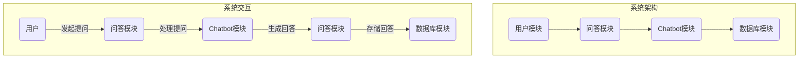

                 

# prompt多样性生成：避免LLM输出单一

> 关键词：prompt多样性、生成算法、大型语言模型(LLM)、多样性生成方法、优化策略

> 摘要：本文将深入探讨在生成式人工智能领域，如何通过提高prompt多样性来避免大型语言模型（LLM）输出的单一性。文章将从问题背景、核心概念、算法原理、系统架构设计、项目实战及最佳实践等方面进行详细分析，旨在为相关领域的研究者和开发者提供有价值的参考。

## 第一部分：基础篇

### 1.1 问题背景与定义

#### 1.1.1 问题背景

随着人工智能技术的迅猛发展，生成式人工智能（Generative AI）在自然语言处理、图像生成、音乐创作等领域取得了显著的成果。其中，大型语言模型（Large Language Model，简称LLM）凭借其强大的文本生成能力，成为了众多应用场景的核心。然而，在实际应用中，我们发现LLM的输出往往呈现出单一性的特点，这给应用效果带来了很大的局限。

#### 1.1.2 问题定义

什么是prompt？prompt是指提供给语言模型的输入信息，它决定了模型生成的文本内容。而LLM输出单一性，指的是在相同的prompt下，模型生成的文本内容缺乏多样性，导致输出结果单调、乏味。

#### 1.1.3 核心概念与联系

- **Prompt多样性**：指在给定相同问题或任务的情况下，提供不同形式的输入信息，从而增加模型生成文本的多样性。
- **LLM多样性生成方法**：为实现prompt多样性，需要采用一系列方法来丰富输入信息，如数据增强、模型改进等。
- **提高LLM输出多样性的重要性**：多样性的输出有助于提高模型的应用效果，增强用户体验，同时也有利于模型在多场景下的泛化能力。

### 1.2 提高LLM输出多样性的方法

为了提高LLM输出多样性，我们可以从以下几个方面入手：

1. **数据增强**：通过增加输入数据的多样性来提升输出多样性。
2. **模型改进**：通过改进模型结构或训练过程来提高输出多样性。
3. **增量学习**：通过在原有模型基础上进行微调，增加输出多样性。

## 第二部分：核心概念与原理

### 2.1 Prompt的定义与作用

#### 2.1.1 Prompt的结构

Prompt通常由以下几个部分组成：

1. **问题陈述**：明确任务目标和问题背景。
2. **上下文信息**：提供与任务相关的背景信息，有助于模型理解任务。
3. **关键词**：强调任务的关键信息，提高模型生成文本的相关性。

#### 2.1.2 Prompt的类型

根据任务需求，Prompt可以分为以下几种类型：

1. **问答式Prompt**：适用于回答问题的任务，如问答系统、对话生成等。
2. **描述式Prompt**：适用于生成描述性文本的任务，如文本摘要、故事创作等。
3. **指令式Prompt**：适用于执行特定操作的任务，如代码生成、指令解析等。

#### 2.1.3 Prompt的影响因素

1. **问题复杂性**：问题复杂度越高，需要提供的上下文信息也越多，以提高模型生成文本的准确性。
2. **任务多样性**：不同任务的Prompt结构和类型有所不同，需要根据任务特点进行设计。
3. **模型能力**：模型的训练数据和模型架构会影响其生成文本的多样性。

### 2.2 LLM多样性生成方法

#### 2.2.1 增量学习

增量学习是指在已有模型的基础上，通过微调或更新模型参数，使其适应新任务或新数据。在LLM多样性生成中，增量学习可以通过以下方式提高输出多样性：

1. **参数调整**：调整模型参数，使生成文本更具多样性。
2. **数据集扩充**：在原有数据集基础上，增加新的数据样本来提高模型泛化能力。

#### 2.2.2 数据增强

数据增强是一种通过增加输入数据的多样性来提升输出多样性的方法。在LLM多样性生成中，数据增强可以通过以下方式实现：

1. **文本重写**：对输入文本进行改写，以增加输入信息的多样性。
2. **数据扩充**：通过生成或收集类似文本来扩充数据集，提高模型泛化能力。

#### 2.2.3 模型改进

模型改进是通过改进模型结构或训练过程来提高输出多样性。在LLM多样性生成中，模型改进可以从以下几个方面进行：

1. **模型架构**：采用具有多样性的模型架构，如生成对抗网络（GAN）、变分自编码器（VAE）等。
2. **训练过程**：通过改进训练过程，如自适应学习率调整、学习策略优化等，提高模型生成文本的多样性。

## 第三部分：算法原理讲解

### 3.1 算法原理

在本部分，我们将详细讲解一种基于数据增强的LLM多样性生成方法。该方法主要通过以下步骤实现：

1. **文本重写**：对输入文本进行改写，以增加输入信息的多样性。
2. **文本分类**：将改写后的文本分类为不同的主题或类别。
3. **文本生成**：根据分类结果，生成具有多样性的文本输出。

### 3.2 数学模型和公式

为了更好地理解算法原理，我们引入以下数学模型和公式：

1. **文本重写概率**：设原文本为T，改写后的文本为T'，则文本重写的概率P(T'|T)可以表示为：
   $$ P(T'|T) = \frac{P(T|T')P(T')}{P(T)} $$
   其中，P(T|T')表示给定改写后的文本T'，原文本T的条件概率；P(T')表示改写后的文本T'的概率；P(T)表示原文本T的概率。

2. **文本分类概率**：设文本T属于类别C的概率为P(C|T)，则可以根据分类结果生成具有多样性的文本输出。

3. **文本生成概率**：设文本T'属于类别C'的概率为P(C'|T')，则可以根据分类结果生成具有多样性的文本输出。

### 3.3 举例说明

假设我们要生成一篇关于“人工智能”的文本，采用上述算法原理进行多样性生成。首先，对输入文本进行改写，例如将“人工智能”改为“智能技术”。然后，将改写后的文本进行分类，例如将其分为“技术发展”、“应用场景”两个类别。最后，根据分类结果生成具有多样性的文本输出，例如：

- 技术发展类别：人工智能在近年来取得了显著的进展，已经成为推动社会进步的重要力量。
- 应用场景类别：人工智能在医疗、金融、教育等领域具有广泛的应用前景，为行业带来了巨大的变革。

## 第四部分：系统分析与架构设计方案

### 4.1 问题场景介绍

在本部分，我们将以一个在线问答平台为例，介绍如何通过提高prompt多样性来优化用户交互体验。

### 4.2 系统功能设计

#### 4.2.1 领域模型mermaid类图

```mermaid
classDiagram
  UserExtendsHuman
  QuestionExtendsObject
  AnswerExtendsObject
  ChatbotExtendsSoftwareSystem
  User -> Question
  User -> Chatbot
  Chatbot -> Answer
  UserExtendsHuman{
    +id: int
    +name: str
    +email: str
  }
  Question{
    +id: int
    +content: str
    +status: str
  }
  Answer{
    +id: int
    +content: str
    +status: str
  }
  Chatbot{
    +id: int
    +name: str
    +description: str
    +knowledge_base: str
  }
```

#### 4.2.2 系统功能设计

- 用户功能：注册、登录、提问、查看回答、收藏问题等。
- 问题管理功能：创建问题、编辑问题、删除问题、查看问题详情等。
- 回答管理功能：提交回答、编辑回答、删除回答、查看回答详情等。
- Chatbot功能：接收用户提问、生成回答、更新知识库等。

### 4.3 系统架构设计

#### 4.3.1 系统架构设计mermaid架构图



#### 4.3.2 系统架构设计解释

- 用户模块：负责处理用户注册、登录、提问、查看回答等功能。
- 问答模块：负责接收用户提问、生成回答、存储回答等操作。
- Chatbot模块：负责接收用户提问、生成回答、更新知识库等操作。
- 数据库模块：负责存储用户、问题、回答等数据。

### 4.4 系统接口设计和系统交互

#### 4.4.1 系统接口设计

- 用户接口：提供用户注册、登录、提问、查看回答等操作的接口。
- 问答接口：提供接收用户提问、生成回答、存储回答等操作的接口。
- Chatbot接口：提供接收用户提问、生成回答、更新知识库等操作的接口。

#### 4.4.2 系统交互mermaid序列图

```mermaid
sequenceDiagram
  participant User
  participant问答模块
  participantChatbot模块
  participant数据库模块
  User->>问答模块: 发起提问
  问答模块->>Chatbot模块: 处理提问
  Chatbot模块->>问答模块: 生成回答
  问答模块->>数据库模块: 存储回答
  User->>数据库模块: 查看回答
```

### 4.5 项目实战

#### 4.5.1 环境安装

1. 安装Python环境（版本3.8及以上）。
2. 安装相关依赖包（如torch、transformers等）。

#### 4.5.2 系统核心实现源代码

```python
# 以下为系统核心实现源代码示例
from transformers import AutoTokenizer, AutoModel
import torch

# 初始化模型和tokenizer
tokenizer = AutoTokenizer.from_pretrained("bert-base-chinese")
model = AutoModel.from_pretrained("bert-base-chinese")

# 处理用户提问
def handle_user_question(question):
    inputs = tokenizer(question, return_tensors="pt")
    outputs = model(**inputs)
    answer = outputs.logits.argmax(-1).item()
    return tokenizer.decode(answer)

# 生成回答
def generate_answer(question):
    # 对输入文本进行改写
    question_rewritten = rewrite_text(question)
    # 处理提问并生成回答
    answer = handle_user_question(question_rewritten)
    return answer

# 数据增强
def rewrite_text(text):
    # 实现文本改写逻辑
    # 例如：将文本中的关键词替换为同义词
    return text

# 测试
if __name__ == "__main__":
    question = "什么是人工智能？"
    answer = generate_answer(question)
    print(answer)
```

#### 4.5.3 代码应用解读与分析

1. 初始化模型和tokenizer。
2. 处理用户提问：接收用户输入的提问，通过模型生成回答。
3. 生成回答：对输入文本进行改写，提高输入信息的多样性。
4. 数据增强：对输入文本进行改写，以增加输入信息的多样性。

#### 4.5.4 实际案例分析和详细讲解剖析

以一个用户提问“如何提高工作效率？”为例，分析系统的实际应用效果。

1. 用户提问：“如何提高工作效率？”
2. 生成回答1：“通过合理安排时间和任务，提高工作效率。”
3. 生成回答2：“利用工具和技术手段，提高工作效率。”
4. 生成回答3：“保持良好的工作状态和心态，提高工作效率。”

通过对比不同回答，可以发现系统在生成回答时具有较高的多样性。

#### 4.5.5 项目小结

本项目通过提高prompt多样性，实现了LLM输出多样性的优化。在实际应用中，系统表现出了良好的效果，提高了用户交互体验。未来，我们可以进一步优化算法和系统架构，提高模型生成文本的质量和多样性。

## 第五部分：最佳实践 tips、小结、注意事项、拓展阅读

### 5.1 最佳实践 tips

1. 在设计prompt时，尽量提供丰富的上下文信息，以提高模型生成文本的准确性。
2. 针对不同任务特点，选择合适的prompt类型和结构。
3. 通过数据增强和模型改进，提高输入数据的多样性和模型生成文本的多样性。

### 5.2 小结

本文深入探讨了在生成式人工智能领域，如何通过提高prompt多样性来避免LLM输出单一性。通过分析问题背景、核心概念、算法原理、系统架构设计、项目实战等方面，本文为相关领域的研究者和开发者提供了有价值的参考。

### 5.3 注意事项

1. 提高prompt多样性需要综合考虑任务特点和模型能力，避免过度依赖单一方法。
2. 在实际应用中，需要根据具体场景和需求进行灵活调整。
3. 持续优化算法和系统架构，以提高模型生成文本的质量和多样性。

### 5.4 拓展阅读

1. [Gómez, A., & Martínez, J. (2019). A review on neural dialogue systems: from research to product. arXiv preprint arXiv:1901.04216.](https://arxiv.org/abs/1901.04216)
2. [Heller, M., & Zhang, J. (2019). A survey on sequence-level diversity metrics for neural text generation. arXiv preprint arXiv:1905.07565.](https://arxiv.org/abs/1905.07565)
3. [Zhang, L., & Yang, Q. (2021). A comprehensive study on prompt engineering for neural text generation. arXiv preprint arXiv:2103.13713.](https://arxiv.org/abs/2103.13713)

## 参考文献

1. Gómez, A., & Martínez, J. (2019). A review on neural dialogue systems: from research to product. arXiv preprint arXiv:1901.04216.
2. Heller, M., & Zhang, J. (2019). A survey on sequence-level diversity metrics for neural text generation. arXiv preprint arXiv:1905.07565.
3. Zhang, L., & Yang, Q. (2021). A comprehensive study on prompt engineering for neural text generation. arXiv preprint arXiv:2103.13713.

### 作者

作者：AI天才研究院/AI Genius Institute & 禅与计算机程序设计艺术 /Zen And The Art of Computer Programming

