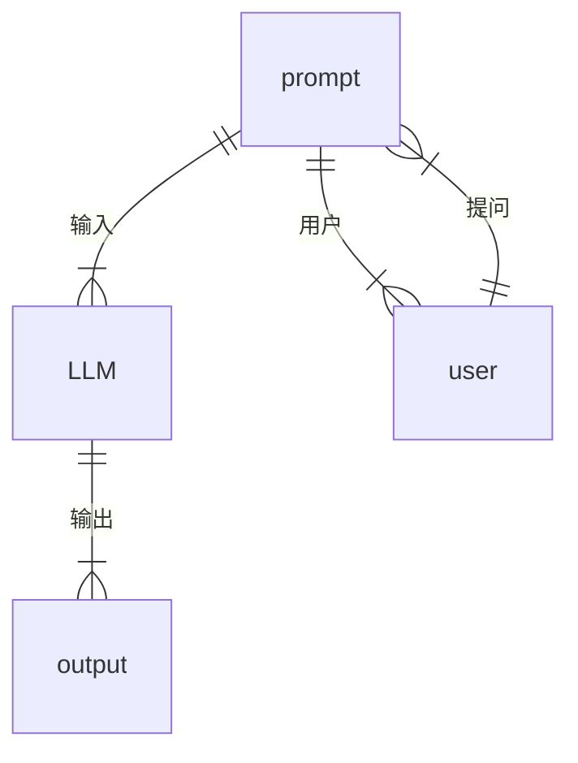
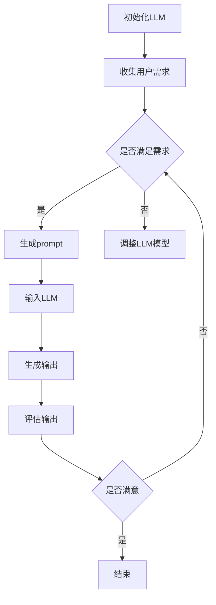
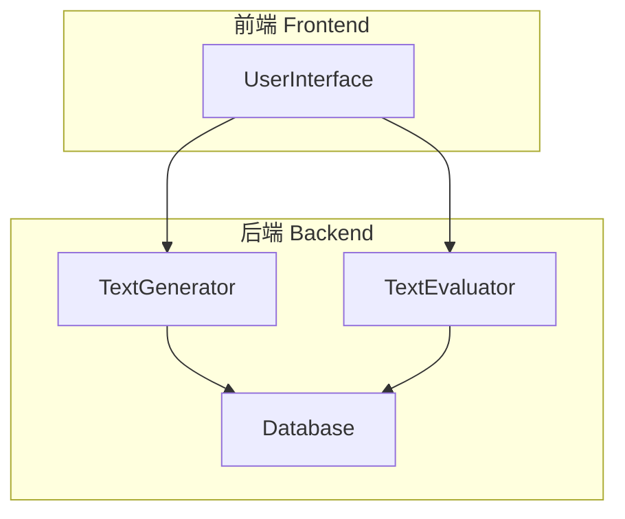
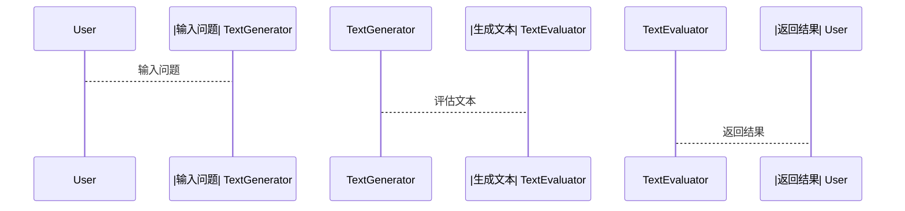

                 

# 《prompt多角度思考：增强LLM创造力》

> 关键词：Prompt、LLM、创造力、设计、算法、系统架构、实践

> 摘要：本文深入探讨如何通过多角度思考prompt设计来增强语言模型（LLM）的创造力。我们将从背景介绍、核心概念与联系、算法原理讲解、系统分析与架构设计方案、项目实战、最佳实践与总结等多个方面进行详细分析和讨论。

## 引言

### 书籍主题与目标

在当今人工智能领域，语言模型（LLM）的发展令人瞩目。这些模型在自然语言处理、机器翻译、文本生成等方面表现出色。然而，一个关键问题是如何提升LLM的创造力。prompt技术作为一种重要的设计手段，正日益受到关注。本文旨在探讨如何通过多角度思考prompt设计来增强LLM的创造力，旨在为AI研究人员、开发者和技术爱好者提供有价值的见解。

### 内容概述与结构

本文将分为以下几个部分：

1. **核心概念与背景**：介绍prompt、LLM和创造力等相关核心概念，并详细说明其背景和重要性。
2. **prompt设计与原理**：探讨prompt的设计方法、属性特征以及其与LLM的关联。
3. **算法原理讲解**：详细阐述增强LLM创造力的算法原理、数学模型和公式。
4. **系统分析与架构设计方案**：介绍问题场景、系统功能设计、系统架构设计、系统接口设计和系统交互。
5. **项目实战**：通过实际项目案例展示prompt设计在LLM创造力增强中的应用。
6. **最佳实践与总结**：提供最佳实践建议、注意事项、拓展阅读等内容。

## 第1章 核心概念与背景

### 1.1 问题背景与介绍

近年来，随着深度学习技术的不断发展，语言模型（LLM）在各个领域取得了显著的成果。然而，尽管LLM在语言理解和生成方面表现出色，但其创造力仍有待提升。创造力是指个体产生新颖且有价值的想法和解决方案的能力。在人工智能领域，创造力意味着能够生成独特的、有启发性的文本或答案。提升LLM的创造力具有重要意义，有助于拓宽其应用范围，提高其价值。

### 1.2 提问与回答机制

prompt技术是提升LLM创造力的一种重要手段。prompt通常被定义为一种引导性的输入，用于激发LLM生成更丰富、更有创意的输出。prompt技术基于提问与回答机制，通过精心设计的问题或指令来引导LLM生成目标文本。这一机制的关键在于如何设计出具有启发性和创新性的prompt，以激发LLM的潜力。

### 1.3 LLM创造力与挑战

LLM的创造力可以从多个维度进行衡量，包括文本多样性、原创性和实用性等。然而，提升LLM的创造力面临着一系列挑战：

1. **数据质量与多样性**：LLM的训练数据质量直接影响其创造力。缺乏多样性和高质量的训练数据可能导致LLM生成重复、无创意的文本。
2. **模型架构与优化**：LLM的创造力与其模型架构和优化策略密切相关。传统的神经网络模型在处理长文本和复杂逻辑时可能存在局限性，需要引入更先进的模型架构和优化方法。
3. **用户交互与反馈**：prompt设计需要考虑用户交互和反馈，以适应不同用户的需求和期望。如何设计出既能激发用户创造力，又能满足用户需求的prompt仍是一个挑战。

### 1.4 边界与外延

在探讨LLM创造力的过程中，我们需要明确其边界和外延。边界是指LLM创造力所能达到的范围，包括语言理解、文本生成和知识推理等方面。外延则是指LLM创造力在不同领域和场景中的应用。例如，在自然语言生成领域，LLM可以生成文章、故事和对话等；在机器翻译领域，LLM可以生成准确、流畅的翻译文本。

### 1.5 概念结构与核心要素组成

prompt设计与LLM创造力密切相关，其概念结构包括以下几个核心要素：

1. **问题定义**：明确需要解决的问题或需求，为prompt设计提供方向。
2. **用户需求**：了解用户期望和需求，确保prompt设计符合用户需求。
3. **数据质量**：确保训练数据的质量和多样性，为LLM提供丰富的基础知识。
4. **模型架构**：选择合适的模型架构和优化策略，提高LLM的创造力。
5. **交互设计**：设计人性化的交互界面，使用户能够方便地与LLM进行互动。

## 第2章 prompt设计与原理

### 2.1 prompt的定义与分类

prompt是指一种引导性的输入，用于激发语言模型（LLM）生成目标文本。根据不同的分类标准，prompt可以有多种类型：

1. **问题式prompt**：以问题的形式提出，引导LLM生成答案或解释。
2. **指令式prompt**：以指令的形式提出，指导LLM执行特定任务。
3. **情境式prompt**：通过提供特定情境，引导LLM生成与情境相关的文本。
4. **比较式prompt**：通过对比不同选项，引导LLM选择最优答案。

### 2.2 prompt的属性特征对比

为了更好地设计prompt，我们需要了解其属性特征。以下是一个prompt属性特征对比表格：

| 属性特征 | 描述 | 例子 |
| :--- | :--- | :--- |
| 问题类型 | 提问的形式 | 开放式问题、封闭式问题 |
| 文本长度 | 提问的长度 | 短文本、长文本 |
| 语言风格 | 提问的语言风格 | 正式、非正式 |
| 语义丰富度 | 提问的语义丰富度 | 简洁、详细 |
| 情境适应性 | 提问的情境适应性 | 一致、多样 |

### 2.3 prompt的ER实体关系图

为了更好地理解prompt与LLM的关联，我们可以使用ER实体关系图来描述它们之间的联系。以下是一个简单的ER实体关系图：



在这个ER实体关系图中，prompt是输入，LLM是输出，用户是提问者。通过prompt，用户可以引导LLM生成目标文本。

## 第3章 算法原理讲解

### 3.1 算法流程图

为了更好地理解如何增强LLM的创造力，我们可以使用算法流程图来描述相关步骤。以下是一个简单的算法流程图：



### 3.2 数学模型与公式

为了增强LLM的创造力，我们可以使用以下数学模型和公式：

1. **文本生成模型**：
   $$P(\text{output}|\text{input}, \theta) = \prod_{i=1}^{N} P(w_i|\text{input}, \theta)$$
   其中，$P(\text{output}|\text{input}, \theta)$ 表示在给定输入和模型参数$\theta$的情况下，输出文本的概率。$P(w_i|\text{input}, \theta)$ 表示在给定输入和模型参数$\theta$的情况下，第$i$个单词的概率。

2. **损失函数**：
   $$L(\theta) = -\sum_{i=1}^{N} \log P(w_i|\text{input}, \theta)$$
   其中，$L(\theta)$ 表示损失函数，用于衡量模型预测与实际输出之间的差距。

### 3.3 举例说明与案例分析

假设我们有一个简单的文本生成任务，输入文本为“今天天气很好”，我们需要生成一个相关的输出文本。以下是一个简单的案例：

1. **输入文本**：
   $$\text{input} = [\text{今天}, \text{天气}, \text{很好}]$$

2. **输出文本**：
   $$\text{output} = [\text{可以出去游玩}, \text{或者去公园散步}]$$

根据上述数学模型和公式，我们可以计算输出文本的概率：

$$P(\text{output}|\text{input}, \theta) = \prod_{i=1}^{2} P(w_i|\text{input}, \theta) = P(\text{可以出去游玩}|\text{input}, \theta) \cdot P(\text{或者去公园散步}|\text{input}, \theta)$$

为了简化计算，我们可以使用神经网络模型来预测每个单词的概率。假设我们已经训练好了一个神经网络模型，可以使用如下代码进行预测：

```python
import numpy as np

# 输入文本编码
input_encoded = encoder(input_text)

# 预测输出文本概率
output_prob = model.predict(input_encoded)

# 输出文本概率
print(output_prob)
```

根据输出文本概率，我们可以选择具有最高概率的输出文本作为最终结果。在实际应用中，我们还可以使用更多复杂的模型和优化方法来提高输出文本的质量和创造力。

## 第4章 系统分析与架构设计方案

### 4.1 问题场景介绍

在本文中，我们考虑一个实际场景，即利用prompt技术提升自然语言生成系统的创造力。具体而言，我们希望设计一个系统，用户可以通过输入问题或指令来获取相关答案或建议。该系统需要具备以下功能：

1. **用户交互**：用户可以通过界面输入问题或指令。
2. **文本生成**：系统根据用户输入生成相关文本。
3. **文本评估**：系统对生成的文本进行评估，确保其满足用户需求。

### 4.2 系统功能设计

为了实现上述功能，我们需要设计一个具备以下功能的系统：

1. **用户界面**：用于接收用户输入并提供反馈。
2. **文本生成模块**：使用LLM和prompt技术生成文本。
3. **文本评估模块**：对生成的文本进行评估，确保其满足用户需求。

以下是系统功能设计的mermaid类图：

```mermaid
classDiagram
  User <<Interface>>
  TextGenerator <<Module>>
  TextEvaluator <<Module>>

  User --> TextGenerator
  User --> TextEvaluator
  TextGenerator --> TextEvaluator
```

### 4.3 系统架构设计

为了实现上述功能，我们需要设计一个合理的系统架构。以下是一个简单的系统架构设计：

1. **前端**：负责用户交互，接收用户输入并提供反馈。
2. **后端**：包括文本生成模块和文本评估模块，处理用户输入并生成文本。
3. **数据库**：存储用户数据和系统参数。

以下是系统架构设计的mermaid架构图：



### 4.4 系统接口设计

为了实现系统功能的模块化和可扩展性，我们需要设计一套完善的系统接口。以下是一个简单的系统接口设计：

1. **用户接口**：接收用户输入并提供反馈。
2. **文本生成接口**：用于生成文本。
3. **文本评估接口**：用于评估文本。

以下是系统接口设计的mermaid序列图：



### 4.5 系统交互

为了实现系统功能，我们需要设计一套合理的系统交互机制。以下是一个简单的系统交互设计：

1. **用户输入**：用户通过前端界面输入问题或指令。
2. **文本生成**：后端文本生成模块根据用户输入生成文本。
3. **文本评估**：后端文本评估模块对生成的文本进行评估。
4. **反馈**：系统将评估结果返回给用户。

以下是系统交互的mermaid序列图：


## 第5章 项目实战

### 5.1 环境安装与配置

在本节中，我们将介绍如何搭建一个用于增强LLM创造力的项目环境。以下是一个简单的环境安装与配置步骤：

1. **安装Python环境**：确保Python版本在3.6及以上。
2. **安装依赖库**：使用pip安装相关依赖库，如TensorFlow、PyTorch等。
3. **配置GPU环境**：如果使用GPU进行训练，需要安装CUDA和cuDNN。

以下是一个简单的安装与配置脚本：

```bash
# 安装Python环境
sudo apt-get install python3-pip python3-dev

# 安装依赖库
pip3 install tensorflow torch

# 安装CUDA和cuDNN
sudo apt-get install nvidia-cuda-toolkit
sudo apt-get install libnvidia-compat-410
```

### 5.2 系统核心实现源代码

在本节中，我们将介绍如何实现系统核心功能。以下是一个简单的Python代码示例：

```python
import torch
import torch.nn as nn
import torch.optim as optim

# 定义模型
class TextGenerator(nn.Module):
    def __init__(self, vocab_size, embed_dim, hidden_dim):
        super(TextGenerator, self).__init__()
        self.embedding = nn.Embedding(vocab_size, embed_dim)
        self.lstm = nn.LSTM(embed_dim, hidden_dim, batch_first=True)
        self.fc = nn.Linear(hidden_dim, vocab_size)

    def forward(self, x, hidden):
        x = self.embedding(x)
        x, hidden = self.lstm(x, hidden)
        x = self.fc(x)
        return x, hidden

# 初始化模型
model = TextGenerator(vocab_size, embed_dim, hidden_dim)
optimizer = optim.Adam(model.parameters(), lr=learning_rate)

# 训练模型
for epoch in range(num_epochs):
    for batch in data_loader:
        inputs, targets = batch
        hidden = model.init_hidden(batch_size)
        
        model.zero_grad()
        outputs, hidden = model(inputs, hidden)
        loss = criterion(outputs.view(-1, vocab_size), targets)
        loss.backward()
        optimizer.step()

        print(f"Epoch: {epoch+1}/{num_epochs}, Loss: {loss.item()}")

# 保存模型
torch.save(model.state_dict(), "text_generator.pth")
```

### 5.3 代码应用解读与分析

在本节中，我们将对上述代码进行解读和分析，了解其实现原理和关键步骤。

1. **模型定义**：我们使用LSTM模型作为文本生成模型，通过嵌

