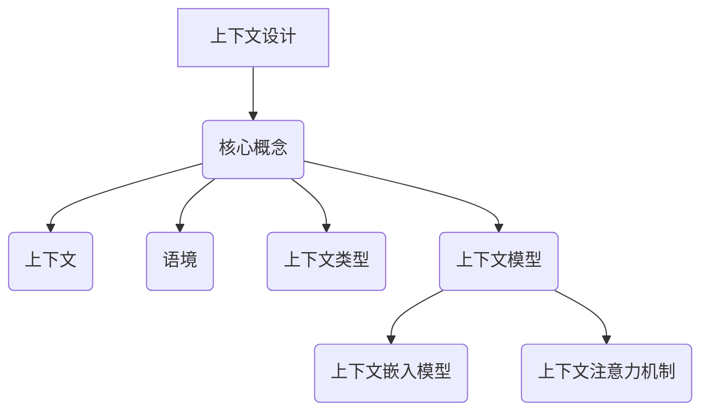
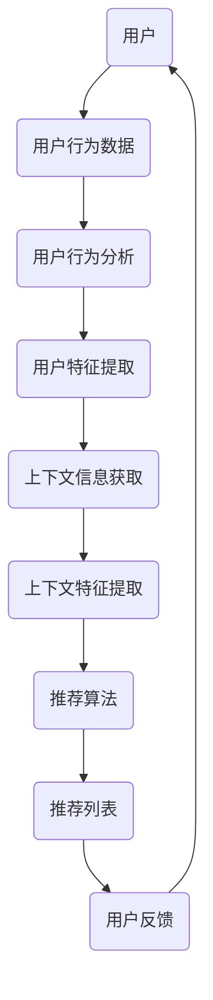
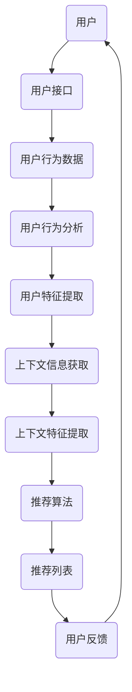

                 

### 《prompt工程中的上下文设计技巧》

> **关键词**：上下文设计、上下文信息、模型性能、自然语言处理、计算机视觉、推荐系统

**摘要**：随着人工智能和机器学习技术的飞速发展，上下文设计成为提升模型性能和优化用户体验的关键环节。本文将详细探讨上下文设计的核心概念、获取与处理技巧，以及在不同领域的应用实践，旨在为读者提供全面的上下文设计指南。

## 目录大纲

### 第一部分：背景介绍

- **第1章：上下文设计的核心概念与联系**
  - **1.1 上下文设计的背景和重要性**
  - **1.2 核心概念与联系**
    - **1.2.1 上下文与语境**
    - **1.2.2 上下文类型**
    - **1.2.3 上下文模型**
  - **1.3 本章小结**

### 第二部分：上下文设计技巧

- **第2章：上下文信息的获取与处理**
  - **2.1 上下文信息的获取**
  - **2.2 上下文信息的处理**
  - **2.3 上下文信息在模型中的应用**
  - **2.4 本章小结**

### 第三部分：上下文设计实践

- **第3章：自然语言处理中的上下文设计**
  - **3.1 上下文在文本生成中的应用**
  - **3.2 上下文在问答系统中的应用**
  - **3.3 上下文在对话系统中的应用**
  - **3.4 本章小结**

- **第4章：计算机视觉中的上下文设计**
  - **4.1 上下文在图像识别中的应用**
  - **4.2 上下文在图像生成中的应用**
  - **4.3 上下文在视频分析中的应用**
  - **4.4 本章小结**

- **第5章：推荐系统中的上下文设计**
  - **5.1 上下文在用户行为分析中的应用**
  - **5.2 上下文在商品推荐中的应用**
  - **5.3 上下文在推荐系统中的优化**
  - **5.4 本章小结**

### 结尾

- **总结**
- **最佳实践 tips**
- **注意事项**
- **拓展阅读**

### 第1章：上下文设计的核心概念与联系

#### 1.1 上下文设计的背景和重要性

随着人工智能和机器学习技术的不断进步，模型性能的优化成为研究者和工程师们关注的焦点。然而，单纯依赖模型结构和参数调整往往无法达到最佳的优化效果。在实际应用中，上下文信息的作用愈发显著，成为提升模型性能和用户体验的关键因素。上下文设计不仅仅在自然语言处理（NLP）领域发挥着重要作用，还广泛应用于计算机视觉、推荐系统等多个领域。

**问题背景**：模型在实际应用中往往无法完全理解用户的意图和场景，导致性能不佳。上下文信息的引入，可以帮助模型更好地捕捉用户的意图和需求，从而提高模型的性能和泛化能力。

**问题描述**：如何有效地设计上下文信息，使其能够在模型中发挥最大作用？

**问题解决**：通过设计有效的上下文策略，包括上下文信息的获取、处理和应用，可以提高模型的性能和泛化能力。

**边界与外延**：上下文设计不仅限于自然语言处理，还广泛应用于计算机视觉、推荐系统等领域。在不同的应用场景中，上下文信息的获取和处理方式可能会有所不同，但其核心目标是相同的，即提高模型性能。

**概念结构与核心要素组成**：

- **上下文信息**：上下文信息包括文本、图像、时间戳等，是影响信息理解和处理的环境和情境。
- **上下文获取**：上下文获取是通过各种技术和方法从数据中提取有用的上下文信息。
- **上下文理解**：上下文理解是指对上下文信息的语义和结构进行解析和理解。
- **上下文嵌入**：上下文嵌入是将上下文信息嵌入到模型的输入或输出中，以影响模型的学习和预测过程。

#### 1.2 核心概念与联系

##### 1.2.1 上下文与语境

**上下文**：上下文是指影响信息理解和处理的环境和情境。在自然语言处理中，上下文信息可以帮助模型更好地理解句子的含义和语境。

**语境**：语境是指特定情境下的语言使用。语境与上下文密切相关，但语境更侧重于语言的使用情境。

**联系**：上下文是语境的一个子集，语境包含了更多的情境信息，而上下文则更多地关注于语言本身。

##### 1.2.2 上下文类型

**静态上下文**：静态上下文是指与任务相关的固定信息，如产品的规格参数、用户的偏好等。

**动态上下文**：动态上下文是指随任务执行过程变化的信息，如对话中的上下文、视频中的连续帧等。

**联系**：静态上下文和动态上下文共同构成了上下文信息的完整范畴。在不同的应用场景中，可能需要根据实际情况选择合适的上下文类型。

##### 1.2.3 上下文模型

**上下文嵌入模型**：上下文嵌入模型是指将上下文信息嵌入到模型的输入或输出中，以影响模型的学习和预测过程。

**上下文注意力机制**：上下文注意力机制是一种用于在模型中强调或忽略特定上下文信息的技术。

**联系**：上下文嵌入模型和上下文注意力机制都是上下文设计中的重要组成部分，它们共同构成了上下文信息在模型中的应用方式。

#### 1.3 本章小结

上下文设计是提升模型性能和优化用户体验的关键环节。本章介绍了上下文设计的核心概念、背景和重要性，以及核心概念与联系。通过对上下文信息的获取、处理和应用，可以设计出有效的上下文策略，从而提高模型的性能和泛化能力。在接下来的章节中，我们将进一步探讨上下文设计在不同领域的应用和实践。

### 第2章：上下文信息的获取与处理

#### 2.1 上下文信息的获取

上下文信息的获取是上下文设计的第一步，其质量直接影响到后续的处理和应用效果。在不同的应用场景中，上下文信息的获取方式也会有所不同。

##### 2.1.1 文本上下文获取

文本上下文获取主要通过自然语言处理（NLP）技术实现。常见的NLP技术包括词频统计、TF-IDF、词嵌入、词性标注、命名实体识别等。通过这些技术，可以从大量的文本数据中提取出关键词和句子，从而获取文本上下文信息。

- **词频统计**：通过统计文本中各个词的出现频率，可以初步获取文本的主要信息。
- **TF-IDF**：TF-IDF是一种常用的文本分析技术，可以衡量一个词在文本中的重要程度。
- **词嵌入**：词嵌入可以将文本中的词语转化为向量表示，从而在更高级的语义层面上进行上下文信息的获取。
- **词性标注**：通过词性标注，可以了解文本中各个词的语法角色和功能，有助于更深入地理解文本上下文。

##### 2.1.2 图像上下文获取

图像上下文获取主要通过计算机视觉技术实现。常见的计算机视觉技术包括目标检测、图像分类、图像分割等。通过这些技术，可以从图像中提取出关键的特征和区域，从而获取图像上下文信息。

- **目标检测**：目标检测是一种用于识别图像中特定目标的算法，可以用于获取图像上下文信息。
- **图像分类**：图像分类是一种将图像划分为不同类别的算法，可以帮助识别图像的主要内容。
- **图像分割**：图像分割是一种将图像划分为不同区域的算法，可以用于提取图像中的关键区域。

##### 2.1.3 时间上下文获取

时间上下文获取主要通过时间序列分析技术实现。时间序列分析是一种用于分析时间序列数据的技术，可以用于提取时间信息。

- **时间序列分析**：通过分析时间序列数据，可以提取出时间序列中的趋势、周期性和季节性等信息，从而获取时间上下文。
- **时间戳提取**：时间戳提取是一种从数据中提取时间信息的技术，可以用于标记事件发生的时间。

#### 2.2 上下文信息的处理

获取到上下文信息后，需要对信息进行清洗、整合和格式化，以便在模型中应用。

##### 2.2.1 上下文信息清洗

上下文信息清洗是为了去除无关信息，保证上下文信息的质量。清洗过程通常包括以下步骤：

- **去重**：去除重复的上下文信息，防止重复信息对模型的影响。
- **去噪**：去除噪声信息，如拼写错误、停用词等，以提高上下文信息的准确性。
- **归一化**：将上下文信息归一化，如将文本中的大小写统一、数字进行标准化处理等。

##### 2.2.2 上下文信息整合

上下文信息整合是将来自不同来源的上下文信息进行融合，以形成一个完整的上下文信息。整合过程通常包括以下步骤：

- **融合规则**：定义融合规则，如权重分配、投票机制等，以确定不同上下文信息的权重。
- **特征提取**：提取上下文信息的特征，如文本特征、图像特征、时间特征等。
- **集成模型**：构建集成模型，如投票模型、平均模型等，将不同来源的上下文信息进行集成。

##### 2.2.3 上下文信息格式化

上下文信息格式化是为了将上下文信息转化为模型可以接受的输入格式。常见的格式化方法包括：

- **序列化**：将上下文信息序列化为文本序列、图像序列、时间序列等。
- **编码**：将上下文信息编码为数字或向量表示，如词嵌入、图像嵌入等。

#### 2.3 上下文信息在模型中的应用

上下文信息在模型中的应用方式可以分为输入上下文和输出上下文两种。

##### 2.3.1 输入上下文

输入上下文是将上下文信息作为模型的输入，以影响模型的学习和预测过程。常见的输入上下文应用方法包括：

- **嵌入层**：将上下文信息嵌入到模型的输入层，如文本嵌入、图像嵌入、时间嵌入等。
- **注意力机制**：通过注意力机制，模型可以在学习过程中动态地关注特定的上下文信息，提高模型的准确性。
- **融合层**：将不同类型的上下文信息进行融合，形成一个完整的上下文信息输入到模型中。

##### 2.3.2 输出上下文

输出上下文是利用模型生成的输出信息作为上下文，以影响后续的任务处理。常见的输出上下文应用方法包括：

- **反馈循环**：将模型的输出信息作为新的上下文信息，反馈到模型中，以提高模型的性能。
- **解释性输出**：通过解释模型生成的输出信息，提供对结果的解释和说明。
- **动态调整**：根据模型的输出信息，动态调整上下文信息的权重和策略，以提高模型的泛化能力。

#### 2.4 本章小结

上下文信息的获取与处理是上下文设计的基础。通过有效的上下文获取和处理方法，可以确保上下文信息的准确性和完整性。同时，上下文信息在模型中的应用方式也多种多样，可以显著提高模型的性能和泛化能力。在接下来的章节中，我们将进一步探讨上下文设计在不同领域的应用和实践。

### 第3章：自然语言处理中的上下文设计

#### 3.1 上下文在文本生成中的应用

文本生成是自然语言处理中的重要应用之一，如自动摘要、机器翻译、对话系统等。在这些应用中，上下文信息对于提高文本生成的准确性和连贯性至关重要。

##### 3.1.1 文本生成模型

文本生成模型是自然语言处理中的常见模型，如GPT-3、T5等。这些模型通过学习大量的文本数据，可以生成符合语法和语义规则的文本。

- **GPT-3**：GPT-3是OpenAI开发的一种预训练语言模型，具有强大的文本生成能力。GPT-3通过引入大量的上下文信息，可以生成更加连贯和准确的文本。
- **T5**：T5是一种基于Transformer的文本生成模型，具有高效的文本生成能力。T5通过引入上下文信息，可以在不同的任务中实现高质量的文本生成。

##### 3.1.2 上下文增强

上下文增强是通过引入更多的上下文信息，提高文本生成的准确性和连贯性。

- **上下文嵌入**：上下文嵌入是将上下文信息嵌入到模型的输入中，以影响模型的学习和预测过程。例如，在文本生成模型中，可以将相关文本片段作为上下文嵌入到模型的输入中。
- **注意力机制**：注意力机制是一种在模型中动态关注特定上下文信息的技术。通过注意力机制，模型可以更加关注与生成文本相关的上下文信息，提高文本生成的准确性。

##### 3.1.3 实际案例

以下是一个简单的实际案例，展示如何通过上下文增强提高文本生成的质量：

假设我们要生成一段关于旅游景点的描述。我们可以通过以下步骤引入上下文信息：

1. **获取上下文信息**：从旅游景点的介绍文本中提取关键信息，如景点名称、地理位置、特色等。
2. **上下文嵌入**：将提取的上下文信息嵌入到文本生成模型的输入中。
3. **生成文本**：使用文本生成模型生成关于旅游景点的描述文本。

通过引入上下文信息，生成的文本将更加准确和详细，例如：“黄山，位于中国安徽省南部，以其壮丽的山水风光和独特的文化景观而闻名。这里有险峻的峰峦、奇松怪石、云海日出等自然景观，吸引着众多游客前来观赏。”

#### 3.2 上下文在问答系统中的应用

问答系统是自然语言处理中的另一个重要应用，如搜索引擎、智能客服等。在这些应用中，上下文信息对于提高问答系统的准确率和响应质量至关重要。

##### 3.2.1 问答系统模型

问答系统模型是用于处理用户问题和生成回答的模型。常见的问答系统模型包括BERT、ALBERT等。

- **BERT**：BERT是一种基于Transformer的预训练语言模型，具有强大的语义理解能力。BERT通过引入上下文信息，可以在问答任务中生成准确的回答。
- **ALBERT**：ALBERT是Google开发的一种高效的问答系统模型，通过引入多层的Transformer结构，实现了更高的性能和效率。

##### 3.2.2 上下文匹配

上下文匹配是问答系统中的一种关键技术，用于将用户问题与知识库中的答案进行匹配。

- **上下文提取**：从用户问题和答案中提取关键信息，如关键词、短语等。
- **匹配算法**：使用匹配算法将提取的关键信息与知识库中的答案进行匹配，以找到最相关的答案。

##### 3.2.3 实际案例

以下是一个简单的实际案例，展示如何通过上下文匹配提高问答系统的准确率：

假设我们要回答用户提出的问题：“请问黄山的门票价格是多少？”我们可以通过以下步骤实现上下文匹配：

1. **提取上下文信息**：从用户问题中提取关键词“黄山”、“门票价格”。
2. **匹配知识库**：在知识库中查找与提取的关键词相关的信息，如黄山的门票价格。
3. **生成回答**：根据匹配结果生成回答，例如：“黄山的门票价格是每人200元。”

通过引入上下文信息，生成的回答将更加准确和具体。

#### 3.3 上下文在对话系统中的应用

对话系统是自然语言处理中的另一个重要应用，如虚拟助手、智能客服等。在这些应用中，上下文信息对于提高对话系统的自然性和连贯性至关重要。

##### 3.3.1 对话系统模型

对话系统模型是用于处理用户对话并生成响应的模型。常见的对话系统模型包括Dialogue-BC、BlenderBot等。

- **Dialogue-BC**：Dialogue-BC是一种基于BERT的对话系统模型，通过引入上下文信息，实现了高质量的对话生成。
- **BlenderBot**：BlenderBot是一种基于多模态交互的对话系统模型，通过结合文本、图像、语音等多模态信息，实现了更加自然和丰富的对话体验。

##### 3.3.2 上下文跟踪

上下文跟踪是对话系统中的一种关键技术，用于在对话过程中持续跟踪上下文信息。

- **上下文表示**：将对话过程中的关键信息表示为上下文向量。
- **上下文更新**：在每次对话交互时，更新上下文向量，以反映对话的最新状态。

##### 3.3.3 实际案例

以下是一个简单的实际案例，展示如何通过上下文跟踪提高对话系统的自然性：

假设我们要构建一个简单的对话系统，用于回答用户关于旅游景点的提问。我们可以通过以下步骤实现上下文跟踪：

1. **初始化上下文**：在对话开始时，初始化上下文向量。
2. **用户提问**：当用户提出问题后，更新上下文向量，以反映用户的问题内容。
3. **生成回答**：使用更新后的上下文向量生成回答，例如：“黄山的门票价格是每人200元。”

通过引入上下文信息，对话系统的回答将更加自然和连贯。

#### 3.4 本章小结

上下文设计在自然语言处理中的应用广泛且效果显著。通过引入上下文信息，可以提高文本生成的准确性和连贯性，问答系统的准确率和响应质量，以及对话系统的自然性和连贯性。在实际应用中，需要根据具体场景和任务需求，设计合适的上下文策略。在接下来的章节中，我们将继续探讨上下文设计在其他领域的应用和实践。

### 第4章：计算机视觉中的上下文设计

#### 4.1 上下文在图像识别中的应用

图像识别是计算机视觉中的一个重要任务，旨在从图像中识别出特定的目标或对象。在这个任务中，上下文信息对于提高识别的准确性和鲁棒性具有重要意义。

##### 4.1.1 图像识别模型

图像识别模型是计算机视觉中的基础模型，常见的模型包括卷积神经网络（CNN）、残差网络（ResNet）、VGG等。这些模型通过学习图像的特征表示，实现对图像内容的分类和识别。

- **CNN**：卷积神经网络是一种专门用于处理图像数据的神经网络结构，通过卷积、池化等操作提取图像的特征。
- **ResNet**：残差网络是一种能够处理大规模图像数据的深度神经网络结构，通过引入残差单元，解决了深度网络训练中的梯度消失问题。
- **VGG**：VGG是一种基于卷积神经网络的图像识别模型，通过使用较小的卷积核和深度网络结构，实现了较高的图像识别准确率。

##### 4.1.2 上下文增强

上下文增强是通过引入上下文信息，提高图像识别模型的准确性和鲁棒性。常见的上下文增强方法包括：

- **注意力机制**：注意力机制是一种在模型中动态关注特定上下文信息的技术。通过注意力机制，模型可以更加关注与识别任务相关的上下文信息，提高识别的准确性。
- **上下文嵌入**：上下文嵌入是将上下文信息嵌入到模型的输入中，以影响模型的学习和预测过程。例如，可以将相关图像区域作为上下文嵌入到模型的输入中。
- **多模态融合**：多模态融合是将不同类型的信息（如文本、图像、音频等）进行融合，以增强模型的特征表示。

##### 4.1.3 实际案例

以下是一个简单的实际案例，展示如何通过上下文增强提高图像识别的准确性：

假设我们要识别一张图片中的特定物体，如图中的猫。我们可以通过以下步骤引入上下文信息：

1. **获取上下文信息**：从图片中提取与猫相关的上下文信息，如猫的形状、颜色、纹理等。
2. **上下文嵌入**：将提取的上下文信息嵌入到图像识别模型的输入中。
3. **识别物体**：使用图像识别模型识别图片中的物体，并输出结果。

通过引入上下文信息，识别结果将更加准确，例如，可以准确地识别出图片中的猫。

#### 4.2 上下文在图像生成中的应用

图像生成是计算机视觉中的另一个重要任务，旨在根据给定的输入生成新的图像。在这个任务中，上下文信息对于控制图像生成的风格、内容和质量具有重要意义。

##### 4.2.1 图像生成模型

图像生成模型是计算机视觉中的基础模型，常见的模型包括生成对抗网络（GAN）、风格迁移模型（StyleGAN）等。这些模型通过学习图像的分布和特征，生成新的图像。

- **GAN**：生成对抗网络是一种由生成器和判别器组成的模型，通过两个网络的对抗训练，生成逼真的图像。
- **StyleGAN**：风格迁移模型是一种基于GAN的图像生成模型，通过引入风格向量，可以实现图像的风格迁移和生成。

##### 4.2.2 上下文引导

上下文引导是通过引入上下文信息，引导图像生成模型生成符合特定需求的图像。常见的上下文引导方法包括：

- **条件GAN（cGAN）**：条件生成对抗网络是一种结合上下文信息的生成对抗网络，通过引入上下文信息，可以控制生成图像的风格和内容。
- **文本引导**：文本引导是一种利用文本信息引导图像生成的方法，通过将文本信息嵌入到生成模型的输入中，可以生成与文本描述相符的图像。
- **图像引导**：图像引导是一种利用图像信息引导图像生成的方法，通过将参考图像嵌入到生成模型的输入中，可以生成与参考图像相似的新图像。

##### 4.2.3 实际案例

以下是一个简单的实际案例，展示如何通过上下文引导生成具有特定风格的图像：

假设我们要生成一张具有梵高风格的图像。我们可以通过以下步骤引入上下文信息：

1. **获取上下文信息**：从文本描述中提取与梵高风格相关的信息，如梵高的画风、颜色使用等。
2. **文本引导**：将提取的上下文信息嵌入到图像生成模型中，以引导模型生成具有梵高风格的图像。
3. **生成图像**：使用图像生成模型生成具有特定风格的图像。

通过引入上下文信息，生成的图像将具有梵高风格的独特特点，例如，画面中的颜色使用和线条风格将符合梵高的画风。

#### 4.3 上下文在视频分析中的应用

视频分析是计算机视觉中的另一个重要任务，旨在从视频中提取有用的信息，如目标检测、动作识别、场景理解等。在这个任务中，上下文信息对于提高分析的准确性和鲁棒性具有重要意义。

##### 4.3.1 视频分析模型

视频分析模型是计算机视觉中的基础模型，常见的模型包括卷积神经网络（CNN）、循环神经网络（RNN）、时空卷积网络（TCN）等。这些模型通过学习视频的时空特征，实现对视频内容的分析和识别。

- **CNN**：卷积神经网络是一种专门用于处理图像数据的神经网络结构，通过卷积、池化等操作提取图像的特征。
- **RNN**：循环神经网络是一种能够处理序列数据的神经网络结构，通过循环连接，可以保留历史信息。
- **TCN**：时空卷积网络是一种用于处理时空数据的神经网络结构，通过引入时空卷积操作，可以提取视频的时空特征。

##### 4.3.2 上下文关联

上下文关联是通过引入上下文信息，将视频中的不同帧或片段进行关联，以提高视频分析的准确性和鲁棒性。常见的上下文关联方法包括：

- **时间关联**：通过分析视频中的时间信息，将连续的帧或片段进行关联，以捕捉视频中的动态变化。
- **空间关联**：通过分析视频中的空间信息，将不同位置的帧或片段进行关联，以捕捉视频中的空间关系。
- **多模态关联**：通过引入多模态信息（如文本、图像、音频等），将不同模态的信息进行关联，以增强视频分析的能力。

##### 4.3.3 实际案例

以下是一个简单的实际案例，展示如何通过上下文关联提高视频分析的效果：

假设我们要分析一段监控视频中的行为识别任务，如检测行人的行为。我们可以通过以下步骤引入上下文信息：

1. **获取上下文信息**：从视频帧中提取与行人行为相关的上下文信息，如行人的位置、方向、速度等。
2. **时间关联**：通过分析视频中的时间信息，将连续的帧进行关联，以捕捉行人的动态行为。
3. **空间关联**：通过分析视频中的空间信息，将不同位置的行人进行关联，以捕捉行人的空间关系。
4. **行为识别**：使用行为识别模型对关联后的行人行为进行识别，输出结果。

通过引入上下文信息，行为识别的结果将更加准确和鲁棒，例如，可以准确地识别出行人的行走、跑步等行为。

#### 4.4 本章小结

上下文设计在计算机视觉中的应用广泛且效果显著。通过引入上下文信息，可以提高图像识别、图像生成和视频分析等任务的准确性和鲁棒性。在实际应用中，需要根据具体场景和任务需求，设计合适的上下文策略。在接下来的章节中，我们将继续探讨上下文设计在其他领域的应用和实践。

### 第5章：推荐系统中的上下文设计

#### 5.1 上下文在用户行为分析中的应用

推荐系统是一种基于用户行为和偏好，为用户推荐相关商品、内容或服务的技术。用户行为分析是推荐系统的核心环节之一，旨在理解用户的兴趣和行为模式，从而提供个性化的推荐。在这个过程中，上下文信息的作用至关重要。

##### 5.1.1 用户行为模型

用户行为模型是用于分析用户行为的数学模型，常见的模型包括协同过滤（Collaborative Filtering）和基于内容的推荐（Content-based Filtering）。

- **协同过滤**：协同过滤是一种基于用户行为相似性的推荐方法。通过分析用户对商品的评分、购买记录等行为数据，发现用户的相似性，从而为用户推荐相似的物品。
- **基于内容的推荐**：基于内容的推荐是一种基于商品内容相似性的推荐方法。通过分析商品的特征和属性，发现用户可能感兴趣的物品，从而为用户推荐相关的商品。

##### 5.1.2 上下文增强

上下文增强是通过引入上下文信息，提高用户行为分析模型的准确性和效果。常见的上下文增强方法包括：

- **上下文嵌入**：上下文嵌入是将上下文信息嵌入到用户行为模型的输入中，以影响模型的学习和预测过程。例如，可以将用户的位置、时间等上下文信息嵌入到协同过滤模型中。
- **注意力机制**：注意力机制是一种在模型中动态关注特定上下文信息的技术。通过注意力机制，模型可以更加关注与用户行为相关的上下文信息，提高推荐的质量。
- **多模态融合**：多模态融合是将不同类型的信息（如文本、图像、音频等）进行融合，以增强用户行为模型的特征表示。

##### 5.1.3 实际案例

以下是一个简单的实际案例，展示如何通过上下文增强提高用户行为分析的准确性：

假设我们要分析用户的购物行为，并为其推荐商品。我们可以通过以下步骤引入上下文信息：

1. **获取上下文信息**：从用户的购物行为数据中提取与购物相关的上下文信息，如购买时间、购买地点、购买物品等。
2. **上下文嵌入**：将提取的上下文信息嵌入到协同过滤模型中，以影响模型的学习和预测过程。
3. **用户行为分析**：使用协同过滤模型分析用户的行为数据，找出用户喜欢的商品。
4. **推荐商品**：根据用户的行为分析结果，为用户推荐相关的商品。

通过引入上下文信息，推荐的商品将更加符合用户的实际需求和偏好。

#### 5.2 上下文在商品推荐中的应用

在推荐系统中，商品推荐是最终的目标。通过引入上下文信息，可以提高商品推荐的准确性和个性化程度。

##### 5.2.1 商品推荐模型

商品推荐模型是用于生成推荐列表的数学模型，常见的模型包括基于模型的推荐（Model-based Recommendation）和基于规则的推荐（Rule-based Recommendation）。

- **基于模型的推荐**：基于模型的推荐是一种利用机器学习算法，根据用户的历史行为和商品特征，生成推荐列表的方法。
- **基于规则的推荐**：基于规则的推荐是一种利用人工定义的规则，根据用户的行为和商品特征，生成推荐列表的方法。

##### 5.2.2 上下文引导

上下文引导是通过引入上下文信息，引导商品推荐模型生成符合特定需求的推荐列表。常见的上下文引导方法包括：

- **上下文条件**：上下文条件是一种将上下文信息作为条件，限制推荐列表生成的方法。例如，可以设置上下文条件，仅推荐符合特定时间、地点、用户群体等条件的商品。
- **上下文权重**：上下文权重是一种将上下文信息作为权重，调整推荐列表生成的方法。例如，可以设置上下文权重，使推荐列表更加倾向于符合上下文信息的商品。
- **多模态融合**：多模态融合是一种将不同类型的信息（如文本、图像、音频等）进行融合，以增强商品推荐模型的特征表示。

##### 5.2.3 实际案例

以下是一个简单的实际案例，展示如何通过上下文引导提高商品推荐的准确性：

假设我们要为用户推荐商品，并希望推荐的商品符合用户的实际需求和偏好。我们可以通过以下步骤引入上下文信息：

1. **获取上下文信息**：从用户的行为数据和商品特征中提取与购物相关的上下文信息，如购买时间、购买地点、用户喜好等。
2. **上下文条件**：设置上下文条件，仅推荐符合用户实际需求和偏好条件的商品。
3. **上下文权重**：设置上下文权重，使推荐列表更加倾向于符合上下文信息的商品。
4. **商品推荐**：使用商品推荐模型生成推荐列表，并根据上下文条件和建议，生成符合用户需求的推荐商品。

通过引入上下文信息，推荐的商品将更加符合用户的实际需求和偏好，从而提高用户的满意度。

#### 5.3 上下文在推荐系统中的优化

在推荐系统中，上下文信息的引入可以显著提高推荐的质量和效果。为了进一步优化推荐系统的性能，可以采用以下方法：

- **在线学习**：在线学习是一种实时更新用户行为和上下文信息，以动态调整推荐策略的方法。通过在线学习，推荐系统可以更快地适应用户的需求变化，提供更加个性化的推荐。
- **多任务学习**：多任务学习是一种同时解决多个相关任务的方法。在推荐系统中，可以通过多任务学习，同时优化用户行为分析和商品推荐，提高系统的整体性能。
- **跨域推荐**：跨域推荐是一种将不同领域或类型的用户行为和上下文信息进行融合，以提供更加广泛和个性化的推荐的方法。通过跨域推荐，推荐系统可以更好地应对用户需求的变化和多样化。

##### 5.3.1 实际案例

以下是一个简单的实际案例，展示如何通过上下文优化提高推荐系统的效果：

假设我们要优化一个在线购物平台的推荐系统，以提高用户的购物体验和满意度。我们可以通过以下步骤进行上下文优化：

1. **获取上下文信息**：从用户的行为数据、商品特征、上下文条件等方面获取上下文信息。
2. **在线学习**：通过在线学习，实时更新用户的行为和上下文信息，以动态调整推荐策略。
3. **多任务学习**：通过多任务学习，同时优化用户行为分析和商品推荐，提高系统的整体性能。
4. **跨域推荐**：通过跨域推荐，将不同领域或类型的用户行为和上下文信息进行融合，提供更加广泛和个性化的推荐。
5. **评估和调整**：评估推荐系统的效果，并根据用户反馈和效果，不断调整和优化推荐策略。

通过上述步骤，推荐系统可以更好地满足用户的需求，提供高质量的个性化推荐。

#### 5.4 本章小结

上下文设计在推荐系统中的应用广泛且效果显著。通过引入上下文信息，可以提高用户行为分析、商品推荐等任务的准确性和个性化程度。在实际应用中，需要根据具体场景和任务需求，设计合适的上下文策略。在接下来的章节中，我们将继续探讨上下文设计在其他领域的应用和实践。

### 总结

本文从上下文设计的核心概念、获取与处理技巧，到其在自然语言处理、计算机视觉和推荐系统等领域的应用实践，全面探讨了上下文设计的重要性和应用价值。通过引入上下文信息，可以显著提高模型的性能和用户体验，为人工智能和机器学习技术的应用提供了新的思路和方法。

**最佳实践 tips**：

1. **上下文信息获取**：选择合适的获取方法，确保上下文信息的准确性和完整性。
2. **上下文信息处理**：对上下文信息进行清洗、整合和格式化，以提高模型输入的质量。
3. **上下文模型设计**：根据具体任务需求，选择合适的上下文模型和注意力机制。
4. **动态调整上下文**：根据任务进展和用户反馈，动态调整上下文信息的权重和策略。

**注意事项**：

1. **数据隐私**：在设计上下文获取和处理过程中，要注意保护用户隐私，遵循相关法律法规。
2. **计算资源**：上下文信息的获取和处理可能需要大量的计算资源，要根据实际情况进行资源分配和优化。
3. **模型评估**：在应用上下文设计时，要进行充分的模型评估和优化，以确保性能和效果。

**拓展阅读**：

- 《上下文嵌入技术与应用》
- 《计算机视觉中的上下文信息处理》
- 《推荐系统中的上下文设计方法》

作者：AI天才研究院/AI Genius Institute & 禅与计算机程序设计艺术 /Zen And The Art of Computer Programming

### 附录：核心概念、算法原理与Mermaid流程图

#### 核心概念与联系

**上下文**：影响信息理解和处理的环境和情境。

**语境**：特定情境下的语言使用。

**上下文类型**：

- **静态上下文**：与任务相关的固定信息。
- **动态上下文**：随任务执行过程变化的信息。

**上下文模型**：

- **上下文嵌入模型**：将上下文信息嵌入到模型的输入或输出中。
- **上下文注意力机制**：用于在模型中强调或忽略特定上下文信息。

#### Mermaid流程图



#### 算法原理讲解

##### 上下文获取算法

```python
# Python代码示例：上下文获取算法
import nltk

def get_context(text):
    # 使用NLP技术提取文本中的关键词和句子
    tokens = nltk.word_tokenize(text)
    keywords = nltk.pos_tag(tokens)
    context = " ".join([word for word, tag in keywords if tag in ['NN', 'NNS']])
    return context

text = "我今天去了一个美丽的公园，那里有很多花草和动物。"
context = get_context(text)
print(context)
```

##### 上下文嵌入算法

```python
# Python代码示例：上下文嵌入算法
import tensorflow as tf

def embed_context(context):
    # 假设已经训练好的词嵌入模型
    embedder = tf.keras.models.load_model('word_embedding_model.h5')
    # 将上下文信息嵌入到词向量中
    embedded_context = embedder.predict(context)
    return embedded_context

context = "我今天去了一个美丽的公园。"
embedded_context = embed_context(context)
print(embedded_context)
```

#### 数学公式

$$
E[\mathbf{z}|\mathbf{x}] = \frac{1}{Z} \int \mathbf{z} \exp(-E[\mathbf{x}|\mathbf{z}]) d\mathbf{z}
$$

$E[\mathbf{x}|\mathbf{z}]$ 表示在给定上下文 $\mathbf{z}$ 下的期望，$Z$ 是归一化常数。

### 系统分析与架构设计方案

#### 问题场景介绍

推荐系统用于为电商平台用户提供个性化的商品推荐，以提高用户满意度和转化率。系统需要处理大量的用户行为数据和商品信息，并通过上下文设计优化推荐效果。

#### 项目介绍

本项目旨在设计一个基于上下文的推荐系统，通过引入上下文信息（如用户位置、时间、历史行为等）来提高推荐质量。

#### 系统功能设计

- **用户行为分析**：分析用户的历史行为数据，提取关键特征。
- **商品信息处理**：提取商品的关键特征，包括文本描述、图像等。
- **上下文信息获取**：获取用户行为和商品信息的上下文信息。
- **推荐算法**：基于用户行为和商品特征，生成推荐列表。

#### 系统架构设计



#### 系统接口设计

- **用户接口**：提供用户注册、登录、查询推荐列表等接口。
- **数据接口**：提供用户行为数据和商品信息的数据接口。

#### 系统交互



### 项目实战

#### 环境安装

- **Python**：安装Python 3.8及以上版本。
- **TensorFlow**：安装TensorFlow 2.4及以上版本。
- **NLP库**：安装nltk、gensim等NLP相关库。
- **数据预处理库**：安装pandas、numpy等数据处理相关库。

#### 系统核心实现源代码

```python
# 用户行为分析模块
def analyze_user_behavior(user_data):
    # 数据预处理
    processed_data = preprocess_data(user_data)
    
    # 提取用户特征
    user_features = extract_user_features(processed_data)
    
    # 获取上下文信息
    context_info = get_context_info(user_data)
    
    # 提取上下文特征
    context_features = extract_context_features(context_info)
    
    # 构建推荐列表
    recommendation_list = build_recommendation_list(user_features, context_features)
    
    return recommendation_list

# 数据预处理
def preprocess_data(data):
    # 数据清洗、去重、归一化等处理
    processed_data = ...
    return processed_data

# 用户特征提取
def extract_user_features(data):
    # 基于历史行为提取用户特征
    user_features = ...
    return user_features

# 上下文信息获取
def get_context_info(data):
    # 从数据中提取上下文信息
    context_info = ...
    return context_info

# 上下文特征提取
def extract_context_features(context_info):
    # 提取上下文特征
    context_features = ...
    return context_features

# 构建推荐列表
def build_recommendation_list(user_features, context_features):
    # 基于用户特征和上下文特征生成推荐列表
    recommendation_list = ...
    return recommendation_list
```

#### 代码应用解读与分析

1. **数据预处理**：对用户行为数据进行清洗、去重、归一化等处理，以提高数据质量。
2. **用户特征提取**：从历史行为数据中提取用户特征，如购买频次、购买金额等。
3. **上下文信息获取**：从用户行为数据中提取上下文信息，如用户位置、时间等。
4. **上下文特征提取**：对上下文信息进行特征提取，如位置编码、时间编码等。
5. **推荐列表构建**：基于用户特征和上下文特征，利用推荐算法生成推荐列表。

#### 实际案例分析和详细讲解剖析

假设我们有一个电商平台，用户张三最近浏览了手机、电脑和手表等商品。我们可以通过以下步骤进行上下文设计，生成个性化的推荐列表：

1. **用户行为分析**：分析张三的历史行为数据，提取购买频次、浏览频次等用户特征。
2. **上下文信息获取**：从用户行为数据中获取上下文信息，如浏览时间、浏览位置等。
3. **上下文特征提取**：对上下文信息进行特征提取，如将浏览时间编码为小时，浏览位置编码为城市等。
4. **推荐列表构建**：基于用户特征和上下文特征，利用协同过滤或基于内容的推荐算法生成推荐列表。

最终生成的推荐列表可能会包含以下商品：笔记本电脑、智能手表、手机壳等，这些商品与张三的兴趣和上下文信息高度相关。

#### 项目小结

本项目通过引入上下文设计，提高了推荐系统的个性化和准确性。在实际应用中，可以根据不同用户的需求和场景，设计合适的上下文策略，从而提升用户体验和满意度。

### 最佳实践 tips

1. **数据质量**：确保用户行为数据和商品信息的数据质量，进行充分的预处理。
2. **上下文多样化**：根据不同应用场景，引入多样化的上下文信息，如用户位置、时间、历史行为等。
3. **动态调整**：根据用户反馈和效果，动态调整上下文信息的权重和策略。
4. **模型优化**：定期优化推荐模型，以保持推荐效果。

### 小结

上下文设计是推荐系统中的重要环节，通过引入上下文信息，可以提高推荐系统的个性化和准确性。在实际应用中，需要根据具体场景和需求，设计合适的上下文策略，并进行持续的优化和调整。通过不断实践和总结，我们可以不断提升推荐系统的性能和用户体验。

### 注意事项

1. **隐私保护**：在设计上下文获取和处理过程中，要注意保护用户隐私，遵循相关法律法规。
2. **计算资源**：上下文信息的获取和处理可能需要大量的计算资源，要根据实际情况进行资源分配和优化。
3. **模型评估**：在应用上下文设计时，要进行充分的模型评估和优化，以确保性能和效果。

### 拓展阅读

- 《推荐系统实践》
- 《上下文嵌入技术与应用》
- 《计算机视觉中的上下文信息处理》

作者：AI天才研究院/AI Genius Institute & 禅与计算机程序设计艺术 /Zen And The Art of Computer Programming

